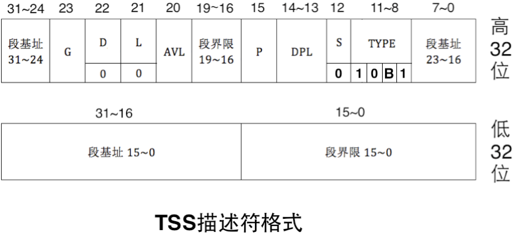
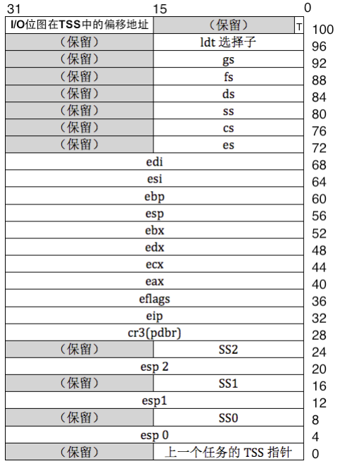
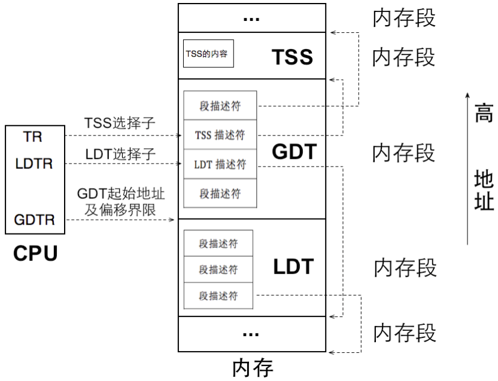

# 准备好用户进程了嘛，同志们？

​	我们终于准备整点真大活了，在这一章中，我们就准备实现用户级别的线程，为此，我们需要做一些工作来保证。

## 所以，先问为什么

​	笔者逛的知乎社区有一个话，我是比较喜欢的——“再问问题之前，先问是什么，再问为什么”，显然，我们要做的，是实现一个用户线程的框架。这个观念是我灌输的，自然，你会立马问——**为什么我们要实现用户线程呢？**

​	一直以来我们的程序都在最高特权级 0 级下工作，这意味着任何程序都和操作系统平起平坐，可以改动任何系统资源。那么，万一我们粗心的加载了一些怀有恶意的程序...你知道的，程序崩溃都是小事情，硬件也有可能损坏，那到时候损失的可是您的真金白银——太吓人了！

​	我们平时工作中所用的文档都是用某种应用程序创建的，应用程序一般是由某种编译器按照某种语言规则编译出来的。比如说，笔者自己写的一个PDF浏览器就是使用C++的Qt框架写的，最后就被映射到C++语言的编译上去了。

​	编译器跟我们的操作系统也是紧密联系的，我们编译器下面使用的库就直接跟操作系统对接（可以认为，编译器提供的库函数又是对操作系统的再一次封装），对于编译性的语言（Java虚拟机等也算这里，因为这类基于解释器的虚拟机语言本身最终要被转化成特定平台的机器码才能跑）。这些被称作Application的语言，是不应该直接跟硬件打交道的，不然我们要操作系统干啥！

​	操作系统最直接控制的就是 CPU，要想让 CPU 这颗奔腾的心永远地跳下去，首先必须把内存分成段，把内存按“内存块”访问，其次必须让代码段寄存器 CS 和指令寄存器[E]IP 指向下一条待执行的指令。这是人家 CPU 开发厂商规定的，也就是说，要想让这颗 CPU 帮咱们执行指令，咱们就必须遵守人家厂商的规矩。

### TSS

​	我们回到现在的主题：TSS。TSS 是 Task State Segment 的缩写，即任务状态段。本身呢，我们的硬件厂商和底层软件开发人院针对多任务，提出了两种方案：LDT和TSS。LDT笔者这里就不说了，因为现在没人使用LDT来搞多任务，这个事情在我们手搓内核线程的时候已经说过了，我就不罗嗦了。

​	CPU 执行任务时，需要把任务运行所需要的数据加载到寄存器、栈和内存中，因为 CPU 只能直接处 理这些资源中的数据，这是CPU 在设计之初时工程师们决定的，属于“基因”里的内容，因此，任务（软 件）在此类 CPU 上执行时，必须遵守此规定。

​	于是问题来了，任务的数据和指令是 CPU 的处理对象，任务的执行要占用一套存储资源，如寄存器和内存，这些存储资源中装的是任务的数据和指令。他们是CPU工作必不可少的资源（想想看，执行任务肯定需要数据吧！），然而我们知道，访问内存相对于访问寄存器，那简直是慢到不可以想象！因此内存中的数据往往被加载到高速的寄存器后 再处理，处理完成后，再将结果回写到低速的内存中，所以，任何时候，寄存器中的内容才是任务的最新 状态。采取轮流使用 CPU 的方式运行多任务，当前任务在被换下 CPU 时，任务的最新状态，也就是寄存 器中的内容应该找个地方保存起来，以便下次重新将此任务调度到 CPU 上时可以恢复此任务的最新状态，这样任务才能继续执行，否则就出错了。 

​	的确是这个道理，CPU 厂商也是这么想的，Intel 的建议是给每个任务“关联”一个任务状态段，这就是 TSS（Task State Segment），用它来表示任务。

​	TSS 是由程序员“提供”的，由CPU 来“维护”。“提供”就是指TSS 是程序员为任务单独定义的一个结构体变量，“维护”是指CPU 自动用此结构体变量保存任务的状态（任务的上下 文环境，寄存器组的值）和自动从此结构体变量中载入任务的状态。**当加载新任务时，CPU 自动把当前任务（旧任务）的状态存入当前任务的TSS，然后将新任务TSS 中的数据载入到对应的寄存器中，这就实现了任务 切换。TSS 就是任务的代表。CPU 用不同的TSS 区分不同的任务，因此任务切换的本质就是TSS 的换来换去。**

> 当然，你可能会问：喂！多余啊，咱们不是已经有了switch_to等技术来实现进程切换了嘛？干嘛还要用TSS呢？啊哈，我必须先说总结一下TSS的作用
>
> - **保存内核栈指针**：当CPU从用户态切换到内核态时（例如发生中断或系统调用），CPU需要知道内核栈的位置。TSS中有一个字段专门用于存储内核栈的指针（`SS0`和`ESP0`）。
> - **权限级别切换**：x86架构有4个特权级别（Ring 0 ~ Ring 3），当从低特权级（用户态）切换到高特权级（内核态）时，CPU需要从TSS中加载新的栈指针（`SS0`和`ESP0`），以确保内核栈的正确切换
>
> 说完了，你就会反应过来，switch_to等本身是内核线程之间的切换，我们现在要纳入特权级为3的用户线程（要注意，我们的单核CPU是可能发生用户线程和内核线程之间的切换的）的切换，所以，按照x86架构的要求，我们必须维护和使用TSS。这是因为：
>
> - **每个CPU核心需要一个TSS**：即使在单核CPU上，操作系统也需要为每个CPU核心维护一个TSS，用于存储内核栈指针等信息。
> - **任务切换的遗留功能**：虽然现代操作系统不再使用TSS进行任务切换，但在某些情况下（例如硬件任务切换或特定架构需求），仍然需要切换TR寄存器来更新TSS。
> - **中断和异常处理**：当发生中断或异常时，CPU会自动从TSS中加载内核栈指针。如果TR寄存器指向的TSS不正确，内核栈可能会被破坏，导致系统崩溃（我们发生异常是直接砍死了操作系统）。

​	在 CPU 中有一个专门存储 TSS 信息的寄存器，这就是 TR 寄存器，它始终指向当前正在运行的任务，因此，“在 CPU 眼里”，任务切换的实质就是 TR 寄存器指向不同的 TSS。我想你知道我们之后要做的工作了，对吧（笑）

#### TSS描述符的格式

	**上面就是TSS描述符的格式**，看起来不错对吧。TSS 和其他段一样，本质上是一片存储数据的内存区域，Intel 打算用这片内存区域保存任务的最新状态（也就是任务运行时占用的寄存器组等)，因此它也像其他段那样，需要用某个描述符结构来“描述”它，这就是TSS 描述符，TSS 描述符也要在GDT中注册，这样才能“找到它”。我们等下就要对他进行编程

​	TSS 描述符属于系统段描述符，因此 S 为 0，在S 为0 的情况下，TYPE 的值为10B1。我们这里关注一下 B 位，B 表示 busy 位，B 位为 0 时，表示任务不繁忙，B 位为 1 时，表示任务繁忙，我们稍后验证的时候，就是上gdt表中看看它是不是busy的！

​	任务繁忙有两方面的含义，一方面就是指此任务是否为当前正在 CPU 上运行的任务。另一方面是指此任务嵌套调用了新的任务，CPU 正在执行新任务，此任务暂时挂起，等新任务执行完成后 CPU 会回到 此任务继续执行，所以此任务马上就会被调度执行了。这种有嵌套调用关系的任务数不只两个，可以很多， 比如任务A 调用了任务A.1，任务A.1 又调用了任务 A.1.1 等，为维护这种嵌套调用的关联，CPU 把新任 务TSS 中的B 位置为1，并且在新任务的TSS 中保存了上一级旧任务的TSS 指针（还要把新任务标志寄存 器eflags 中NT 位的值置为1），新老任务的调用关系形成了调用关系链。

**B 位存在的意义可不是单纯为了表示任务忙不忙，而是为了给当前任务打个标记，目的是避免当前任 务调用自己，也就是说任务是不可重入的。**不可重入的意思是当前任务只能调用其他任务，不能自己调用自己。原因是如果任务可以自我调用的话就混乱了，由于旧任务和新任务是同一个，首先 CPU 进行任务状态保护时，在同一个 TSS 中保存后再载入，这将导致严重错误。其次，旧任务在调用新任务时，新任务执行完成后，为了能够回到旧任务，在调用新任务之初，CPU 会自动把老任务的 TSS 选择子写入到新任务 TSS 中的“上一个任务的 TSS 指针”字段中（后面在任务切换时会讨论），此指针形成了一个任务嵌 套调用链，CPU 是靠此指针形成的链表来维护任务调用链的。如果任务重入的话，此链则被破坏。

#### TSS指向的东西长啥样？



​	我们准备维护的TSS就是这样的一个结构体。啊哈，像不像一个快照呢？这就是TSS的作用。

​	TSS 中有三组栈：SS0 和 esp0，SS1 和 esp1，SS2 和 esp2。之前已经介绍过，除了从中断和调用门返回外，CPU 不允许从高特权级转向低特权级（为了助记，可以简单理解为低特权级能做的高特权级也能做，高特权级不需要找低特权级帮忙）。另外，CPU 在不同特权级下用不同的栈，这三组 栈是用来由低特权级往高特权级跳转时用的，最低的特权级是3，没有更低的特权级会跳入3 特权级，因此，TSS 中没有 SS3 和 esp3。 这三组栈仅仅是 CPU 用来由低特权级进入高特权级时用的，因此，CPU 并不会主动在 TSS 中更新相应特权级的栈指针，不管进入高特权级后进行了多少次压栈操作，下次重新进入该特权级时，该特权级别栈指针依然是TSS 中最初的值，除非人为地在TSS 中将栈指针改写，否则这三组栈指针将一成不变。

​	Linux 只用到了 0 特权级和 3 特权级，用户进程处于 3 特权级，内核位于 0 特权级，因此对于 Linux来说只需要在 TSS 中设置 SS0 和 esp0，咱们也效仿它，只设置 SS0 和 esp0 的值就够了。

​	我们说完了TSS描述符本身，下一个，我们说一下如何加载TSS描述符到TR寄存器，这也是必须注册的

```
ltr “16位通用寄存器” or “16位内存单元” 
```

​	不管操作数是寄存器，还是内存，其值必须是描述符在 GDT 中的选择子。




​	有了TSS 后，任务在被换下CPU 时，由CPU 自动地把当前任务的资源状态（所有寄存器、必要的内存结构，如栈等）保存到该任务对应的TSS 中（由寄存器TR 指定）。CPU 通过新任务的TSS 选择子加载新任务时， 会把该TSS 中的数据载入到CPU 的寄存器中，同时用此TSS 描述符更新寄存器TR。注意啦，以上动作是CPU 自动完成的，不需要人工干预，这就是前面所说的硬件一级的原生支持。不过话又说回来了，第一个任务的TSS 是需要手工加载的，否则第一个任务的状态该没有地方保存了。

​	关于Intel本来计划的任务切换，感兴趣的朋友去对应的bonus文件夹下的第十章节查看，笔者那里留下了笔记。

## 上代码

​	我们刚刚说了，TSS需要向GDT中申请插入，就自然需要GDT表中的一些内容，这一点上，使用GAS的朋友有福了，直接复用就好，我们是nasm + gcc的朋友，只好进一步丰富一下。

​	当然，首先复习一下GDT的一些定义，我把自己写的一个selectors.h给大家看一下：

```
#ifndef PROPERTY_SELECTOR_H
#define PROPERTY_SELECTOR_H

#include "include/library/types.h"

// --------------- Selectors ----------------------
// These definitions are used for segment selectors in the GDT (Global Descriptor Table).
// --------------- Selectors ----------------------

// ----------------  GDT Descriptor Attributes  ----------------

#define	DESC_G_4K    1  // Granularity bit, 1 means 4K-byte granularity.
#define	DESC_D_32    1  // Default operand size, 1 means 32-bit protected mode.
#define DESC_L	     0  // Long mode indicator, 0 means not using 64-bit code.
#define DESC_AVL     0  // Available bit, not used by CPU, set to 0.
#define DESC_P	     1  // Present bit, must be 1 for valid descriptors.
#define DESC_DPL_0   0  // Descriptor Privilege Level 0 (highest privilege).
#define DESC_DPL_1   1  // Descriptor Privilege Level 1.
#define DESC_DPL_2   2  // Descriptor Privilege Level 2.
#define DESC_DPL_3   3  // Descriptor Privilege Level 3 (lowest privilege).

/* 
   Code segments and data segments belong to storage segments,
   while TSS and various gate descriptors belong to system segments.
   S = 1 indicates a storage segment, while S = 0 indicates a system segment.
*/
#define DESC_S_CODE	1  // Code segment descriptor.
#define DESC_S_DATA	DESC_S_CODE  // Data segment descriptor (same as code).
#define DESC_S_SYS	0  // System segment descriptor.

#define DESC_TYPE_CODE	8  // Code segment: executable, non-conforming, not readable, accessed bit cleared.
#define DESC_TYPE_DATA  2  // Data segment: non-executable, expanding upward, writable, accessed bit cleared.
#define DESC_TYPE_TSS   9  // TSS (Task State Segment), B-bit is 0 (not busy).

// Ring privilege levels (RPL).
#define	 RPL0  0  // Highest privilege (kernel).
#define	 RPL1  1  
#define	 RPL2  2  
#define	 RPL3  3  // Lowest privilege (user mode).

// Table Indicator (TI) values.
#define TI_GDT 0  // Refers to GDT.
#define TI_LDT 1  // Refers to LDT.

#define SELECTOR_K_CODE	   ((1 << 3) + (TI_GDT << 2) + RPL0)  // Kernel code segment selector.
#define SELECTOR_K_DATA	   ((2 << 3) + (TI_GDT << 2) + RPL0)  // Kernel data segment selector.
#define SELECTOR_K_STACK   SELECTOR_K_DATA  // Kernel stack segment selector (same as data).
#define SELECTOR_K_GS	   ((3 << 3) + (TI_GDT << 2) + RPL0)  // Kernel GS segment selector.

/* The third descriptor is for video memory, and the fourth is for TSS */
#define SELECTOR_U_CODE	   ((5 << 3) + (TI_GDT << 2) + RPL3)  // User code segment selector.
#define SELECTOR_U_DATA	   ((6 << 3) + (TI_GDT << 2) + RPL3)  // User data segment selector.
#define SELECTOR_U_STACK   SELECTOR_U_DATA  // User stack segment selector (same as data).

// GDT descriptor attributes.
#define GDT_ATTR_HIGH		 ((DESC_G_4K << 7) + (DESC_D_32 << 6) + (DESC_L << 5) + (DESC_AVL << 4))
#define GDT_CODE_ATTR_LOW_DPL3	 ((DESC_P << 7) + (DESC_DPL_3 << 5) + (DESC_S_CODE << 4) + DESC_TYPE_CODE)
#define GDT_DATA_ATTR_LOW_DPL3	 ((DESC_P << 7) + (DESC_DPL_3 << 5) + (DESC_S_DATA << 4) + DESC_TYPE_DATA)

//--------------   IDT Descriptor Attributes  ------------

#define	 IDT_DESC_P	 1  // Present bit, must be 1 for valid IDT entries.
#define	 IDT_DESC_DPL0   0  // DPL 0 (kernel-level interrupt).
#define	 IDT_DESC_DPL3   3  // DPL 3 (user-level interrupt).

#define	 IDT_DESC_32_TYPE     0xE  // 32-bit interrupt gate.
#define	 IDT_DESC_16_TYPE     0x6  // 16-bit interrupt gate (not used, defined for distinction).

// IDT descriptor attributes.
#define	 IDT_DESC_ATTR_DPL0  ((IDT_DESC_P << 7) + (IDT_DESC_DPL0 << 5) + IDT_DESC_32_TYPE)
#define	 IDT_DESC_ATTR_DPL3  ((IDT_DESC_P << 7) + (IDT_DESC_DPL3 << 5) + IDT_DESC_32_TYPE)

//---------------    EFLAGS Register Attributes    ---------------- 

/********************************************************
--------------------------------------------------------------
		  Intel 8086 EFLAGS Register
--------------------------------------------------------------
*
*     15|14|13|12|11|10|F|E|D C|B|A|9|8|7|6|5|4|3|2|1|0|
*      |  |  |  |  |  | | |  |  | | | | | | | | | | '---  CF……Carry Flag
*      |  |  |  |  |  | | |  |  | | | | | | | | | '---  1 MBS (must be set)
*      |  |  |  |  |  | | |  |  | | | | | | | | '---  PF……Parity Flag
*      |  |  |  |  |  | | |  |  | | | | | | | '---  0 (Reserved)
*      |  |  |  |  |  | | |  |  | | | | | | '---  AF……Auxiliary Flag
*      |  |  |  |  |  | | |  |  | | | | | '---  0 (Reserved)
*      |  |  |  |  |  | | |  |  | | | | '---  ZF……Zero Flag
*      |  |  |  |  |  | | |  |  | | | '---  SF……Sign Flag
*      |  |  |  |  |  | | |  |  | | '---  TF……Trap Flag
*      |  |  |  |  |  | | |  |  | '---  IF……Interrupt Flag
*      |  |  |  |  |  | | |  |  '---  DF……Direction Flag
*      |  |  |  |  |  | | |  '----  OF……Overflow flag
*      |  |  |  |  |  | | '-----  IOPL……I/O Privilege Level
*      |  |  |  |  |  | '-----  NT……Nested Task Flag
*      |  |  |  |  |  '-----  0 (Reserved)
*      |  |  |  |  '------  RF……Resume Flag
*      |  |  |  '-----  VM……Virtual Mode Flag
*      |  |  '-----  AC……Alignment Check
*      |  '-----  VIF……Virtual Interrupt Flag  
*      '-----  VIP……Virtual Interrupt Pending
*
**********************************************************/

#define EFLAGS_MBS	(1 << 1)	// Must be set to 1.
#define EFLAGS_IF_1	(1 << 9)	// IF = 1, enables interrupts.
#define EFLAGS_IF_0	0		// IF = 0, disables interrupts.
#define EFLAGS_IOPL_3	(3 << 12)	// IOPL = 3, allows user-mode I/O (for testing).
#define EFLAGS_IOPL_0	(0 << 12)	// IOPL = 0, restricts I/O access to kernel mode.

#endif
```

​	这个会在我们后面的程序编写中反复出现，所以，笔者有必要好好的说明一下：

> `DESC_G_4K` 是描述符的粒度位，设置为1时表示段界限的粒度为4KB。`DESC_D_32` 是默认操作数大小位，设置为1时表示32位保护模式。`DESC_L` 是长模式指示位，设置为0时表示不使用64位代码。`DESC_AVL` 是可用位，CPU不使用，通常设置为0。`DESC_P` 是存在位，必须为1以表示描述符有效。`DESC_DPL_0` 到 `DESC_DPL_3` 是描述符特权级别，分别表示从最高特权（0级）到最低特权（3级）。
>
> `DESC_S_CODE` 和 `DESC_S_DATA` 表示存储段描述符，用于代码段和数据段，设置为1。`DESC_S_SYS` 表示系统段描述符，用于TSS和各种门描述符，设置为0。`DESC_TYPE_CODE` 表示代码段类型，设置为8，表示可执行、非一致、不可读且访问位清零。`DESC_TYPE_DATA` 表示数据段类型，设置为2，表示不可执行、向上扩展、可写且访问位清零。`DESC_TYPE_TSS` 表示任务状态段（TSS）类型，设置为9，B位为0表示不忙。
>
> `RPL0` 到 `RPL3` 是请求特权级别（RPL），用于选择子中，表示从最高特权（0级）到最低特权（3级）。`TI_GDT` 和 `TI_LDT` 是表指示位，分别表示引用全局描述符表（GDT）和局部描述符表（LDT）。
>
> `SELECTOR_K_CODE` 是内核代码段选择子，`SELECTOR_K_DATA` 是内核数据段选择子，`SELECTOR_K_STACK` 是内核堆栈段选择子，`SELECTOR_K_GS` 是内核GS段选择子。`SELECTOR_U_CODE` 是用户代码段选择子，`SELECTOR_U_DATA` 是用户数据段选择子，`SELECTOR_U_STACK` 是用户堆栈段选择子。
>
> `GDT_ATTR_HIGH` 是GDT描述符的高位属性，包括粒度、默认操作数大小、长模式和可用位。`GDT_CODE_ATTR_LOW_DPL3` 是DPL3级别的代码段描述符低位属性，包括存在位、特权级别、存储段类型和代码段类型。`GDT_DATA_ATTR_LOW_DPL3` 是DPL3级别的数据段描述符低位属性，包括存在位、特权级别、存储段类型和数据段类型。
>
> `IDT_DESC_P` 是IDT描述符的存在位，必须为1以表示IDT条目有效。`IDT_DESC_DPL0` 和 `IDT_DESC_DPL3` 是IDT描述符的特权级别，分别表示内核级中断和用户级中断。`IDT_DESC_32_TYPE` 和 `IDT_DESC_16_TYPE` 是IDT描述符的类型，分别表示32位中断门和16位中断门。
>
> `IDT_DESC_ATTR_DPL0` 是DPL0级别的IDT描述符属性，包括存在位、特权级别和32位中断门类型。`IDT_DESC_ATTR_DPL3` 是DPL3级别的IDT描述符属性，包括存在位、特权级别和32位中断门类型。
>
> `EFLAGS_MBS` 是EFLAGS寄存器中的必须设置为1的位。`EFLAGS_IF_1` 和 `EFLAGS_IF_0` 是中断标志位，分别表示启用和禁用中断。`EFLAGS_IOPL_3` 和 `EFLAGS_IOPL_0` 是I/O特权级别，分别表示允许用户模式I/O和限制I/O访问到内核模式。

​	我们下面就依照此来定义TSS的描述符，然后看看下面的分析

```
//---------------  TSS Descriptors  ------------
#define TSS_DESC_D  0 

#define TSS_ATTR_HIGH ((DESC_G_4K << 7) + (TSS_DESC_D << 6) + (DESC_L << 5) + (DESC_AVL << 4) + 0x0)
#define TSS_ATTR_LOW ((DESC_P << 7) + (DESC_DPL_0 << 5) + (DESC_S_SYS << 4) + DESC_TYPE_TSS)
#define SELECTOR_TSS ((4 << 3) + (TI_GDT << 2 ) + RPL0)
```

> `TSS_DESC_D` 是TSS（任务状态段）描述符的默认操作大小位，其值为0，表示这是一个16位的TSS描述符。在TSS描述符中，D位用于指示TSS的默认操作大小，0表示16位，1表示32位。这里设置为0，说明当前系统使用的是16位TSS。
>
> `TSS_ATTR_HIGH` 是TSS描述符的高4字节属性，其值由多个属性位组合而成。`DESC_G_4K << 7` 表示段界限的粒度位，设置为1时表示段界限的粒度为4KB；`TSS_DESC_D << 6` 表示默认操作大小位，这里为0，表示16位TSS；`DESC_L << 5` 是长模式位，设置为0表示不使用64位模式；`DESC_AVL << 4` 是可用位，设置为0表示该位未被CPU使用；最后的`0x0` 是保留位，设置为0。这些位的组合定义了TSS描述符的高4字节的属性，包括段粒度、操作大小、长模式支持和可用位等。
>
> `TSS_ATTR_LOW` 是TSS描述符的低4字节属性，其值同样由多个属性位组合而成。`DESC_P << 7` 是存在位，设置为1表示该描述符有效；`DESC_DPL_0 << 5` 是描述符特权级别，设置为0表示最高特权级别（内核模式）；`DESC_S_SYS << 4` 是系统段标志位，设置为0表示这是一个系统段描述符（TSS属于系统段）；`DESC_TYPE_TSS` 是描述符类型，设置为9表示这是一个TSS描述符，且B位为0表示TSS未被占用。这些位的组合定义了TSS描述符的低4字节的属性，包括存在性、特权级别、系统段标志和描述符类型等。
>
> `SELECTOR_TSS` 是TSS段的选择子，其值由段索引、表指示位和请求特权级别（RPL）组合而成。`4 << 3` 表示段索引为4，即TSS描述符在GDT中的位置是第4个条目；`TI_GDT << 2` 是表指示位，设置为0表示引用全局描述符表（GDT）；`RPL0` 是请求特权级别，设置为0表示最高特权级别（内核模式）。这些值的组合定义了TSS段的选择子，用于在任务切换时定位TSS描述符。

​	我们现在马上就要建立一个用户文件夹，表达的是我们的用户态的建立。

```c
typedef struct {
    uint16_t limit_low_word;   // Lower 16 bits of limit
    uint16_t base_low_word;    // Lower 16 bits of base address
    uint8_t base_mid_byte;     // Middle 8 bits of base address
    uint8_t attr_low_byte;     // Low 8 bits of attributes
    uint8_t limit_high_attr_high; // Upper 4 bits of limit and high bits of attributes
    uint8_t base_high_byte;    // Upper 8 bits of base address
} GDT_Descriptor;

/* Task State Segment (TSS) structure */
typedef struct tss {
    uint32_t backlink;         // Link to the previous task's TSS
    uint32_t *esp0;            // Stack pointer for privilege level 0
    uint32_t ss0;              // Stack segment for privilege level 0
    uint32_t *esp1;            // Stack pointer for privilege level 1
    uint32_t ss1;              // Stack segment for privilege level 1
    uint32_t *esp2;            // Stack pointer for privilege level 2
    uint32_t ss2;              // Stack segment for privilege level 2
    uint32_t cr3;              // Page directory base address
    uint32_t (*eip)(void);     // Instruction pointer (entry point of the task)
    uint32_t eflags;           // CPU flags
    uint32_t eax;              // General-purpose registers
    uint32_t ecx;
    uint32_t edx;
    uint32_t ebx;
    uint32_t esp;              // Stack pointer for the task
    uint32_t ebp;              // Base pointer
    uint32_t esi;              // Source index
    uint32_t edi;              // Destination index
    uint32_t es;               // Extra segment
    uint32_t cs;               // Code segment
    uint32_t ss;               // Stack segment
    uint32_t ds;               // Data segment
    uint32_t fs;               // Additional segment
    uint32_t gs;               // Additional segment
    uint32_t ldt;              // Local descriptor table selector
    uint32_t trace;            // Trace flag for debugging
    uint32_t io_base;          // Base address for I/O permissions
}TSS;

static TSS tss;
```

​	一个个看。首先是GDT_Descriptor，这个没啥说的，只是将我们在汇编中小米加步枪搓出来的GDT使用C语言进行了规范化了。我们下面的一个make_gdt_desc函数就是创建一个描述符：

```c
/* Create a GDT descriptor */
static GDT_Descriptor make_gdt_desc(uint32_t *desc_addr, uint32_t limit,
                                    uint8_t attr_low, uint8_t attr_high) {
    uint32_t desc_base = (uint32_t)desc_addr;
    GDT_Descriptor desc;
    desc.limit_low_word = limit & 0x0000ffff;  // Set the lower 16 bits of the limit
    desc.base_low_word = desc_base & 0x0000ffff; // Set the lower 16 bits of the base address
    desc.base_mid_byte = ((desc_base & 0x00ff0000) >> 16); // Set middle 8 bits of the base
    desc.attr_low_byte = (uint8_t)(attr_low);   // Set the low byte of the attributes
    desc.limit_high_attr_high =
        (((limit & 0x000f0000) >> 16) + (uint8_t)(attr_high)); // Set the high byte of the limit and attributes
    desc.base_high_byte = desc_base >> 24;  // Set the high byte of the base address
    return desc;
}
```

​	这里就不再多说了，实在是老生重弹

​	我们更加关心的是这两个函数：

```c
/* Update the esp0 field of the TSS to the stack pointer of the given task (pthread) */
void update_tss_esp(TaskStruct *pthread) {
    tss.esp0 = (uint32_t *)((uint32_t)pthread + PG_SIZE);
}
```

​	还有一个初始化的函数

```c
/* Initialize the TSS in the GDT and reload the GDT */
void init_user_tss(void) {
    verbose_ccputs("init_user_tss start\n");
    uint32_t tss_size = sizeof(tss);
    k_memset(&tss, 0, tss_size);  // Clear the TSS structure
    tss.ss0 = SELECTOR_K_STACK; // Set the stack segment for privilege level 0
    tss.io_base = tss_size;     // Set the I/O base address to the size of TSS
```

​	update_tss_esp 用来更新 TSS 中的 esp0，这是学习 Linux 任务切换的方式，只修改TSS 中的特权级 0 对应的栈。此函数将TSS 中esp0 修改为参数 pthread 的内核栈地址，也就是线程pthread 的 PCB 所在页的最顶端`(uint32_t)pthread + PG_SIZE`。此栈地址是用户进程由用户态进入内核态时所用的栈，这和之前咱们的内核线程地址是一样的，也许您猜到了，用户进程进入内核态后，除了拥有单独 的地址空间外，其他方面和内核线程是一样的。

​	init_user_tss干两个事情，一个是初始化全局唯一的TSS描述符，还有一个事情就是准备为未来即将诞生的用户进程安装两个供用户进程使用的描述符，一个是 DPL 为 3 的数据段，另一个是 DPL 为 3 的代码段。

​	我们回忆下：之前我们安装了这些gdt，请看VCR：

```
gdt[0x0000]=<null entry>
gdt[0x0008]=Code segment, base=0x00000000, limit=0xffffffff, Execute-Only, Non-Conforming, Accessed, 32-bit
gdt[0x0010]=Data segment, base=0x00000000, limit=0xffffffff, Read/Write, Accessed
gdt[0x0018]=Data segment, base=0xc00b8000, limit=0x00007fff, Read/Write, Accessed
```

​	我们下一步就是在这之后安排，那就是考虑在0x20（每一个描述符8个字节大小，这是毫无疑问的）之后依次安装我们的gdt描述符，当然，笔者这里封装了一个叫做`GDT_ACTUAL_POSITION`的宏，笔者是之前革新之前版本的操作系统的时候留下来的调试遗产。你可以按照自己喜欢的方式调整，反正，就是在GDT加载的基址上，偏移0x20放上我们的TSS就好了，这就产生了下面的代码

```c
    /* GDT base address is 0x900, place the TSS at the 4th position, i.e., 0x900 + 0x20 */
   /*
      Author's note:
         Sometimes compilers might dump! Try setting a virtual memory breakpoint
         to inspect the GDT base info and adjust the following defines accordingly
   */
#define GDT_ACTUAL_POSITION   (0xc0000900)
    /* Add a TSS descriptor with DPL (Descriptor Privilege Level) 0 in the GDT */
    *((GDT_Descriptor *)(GDT_ACTUAL_POSITION + 0x20)) = make_gdt_desc(
        (uint32_t *)&tss, tss_size - 1, TSS_ATTR_LOW, TSS_ATTR_HIGH);

    /* Add code and data segment descriptors with DPL 3 (user level) in the GDT */
    *((GDT_Descriptor *)(GDT_ACTUAL_POSITION + 0x28)) = make_gdt_desc(
        (uint32_t *)0, 0xfffff, GDT_CODE_ATTR_LOW_DPL3, GDT_ATTR_HIGH);
    *((GDT_Descriptor *)(GDT_ACTUAL_POSITION + 0x30)) = make_gdt_desc(
        (uint32_t *)0, 0xfffff, GDT_DATA_ATTR_LOW_DPL3, GDT_ATTR_HIGH);
	...
```

​	最后呢，就安装上去：

```c
    /* GDT 16-bit limit and 32-bit segment base address */
    uint64_t gdt_operand =
        ((8 * 7 - 1) | ((uint64_t)(uint32_t)GDT_ACTUAL_POSITION << 16)); // 7 descriptors total
    asm volatile("lgdt %0" : : "m"(gdt_operand));  // Load the GDT
    asm volatile("ltr %w0" : : "r"(SELECTOR_TSS)); // Load the TSS selector
    verbose_ccputs("init_user_tss and ltr done\n");
```

​	这个没啥好说的。我们上机看看效果：

```c
<bochs:2> info gdt
gdt (base=0xc0000900, limit=55):
gdt[0x0000]=<null entry>
gdt[0x0008]=Code segment, base=0x00000000, limit=0xffffffff, Execute-Only, Non-Conforming, Accessed, 32-bit
gdt[0x0010]=Data segment, base=0x00000000, limit=0xffffffff, Read/Write, Accessed
gdt[0x0018]=Data segment, base=0xc00b8000, limit=0x00007fff, Read/Write, Accessed
gdt[0x0020]=32-Bit TSS (Busy) at 0xc00085a0, length 0x0006b
gdt[0x0028]=Code segment, base=0x00000000, limit=0xffffffff, Execute-Only, Non-Conforming, 32-bit
gdt[0x0030]=Data segment, base=0x00000000, limit=0xffffffff, Read/Write
```

​	非常好！

## 下一篇

[实现User Thread](10.2_implement_user_proc.md)