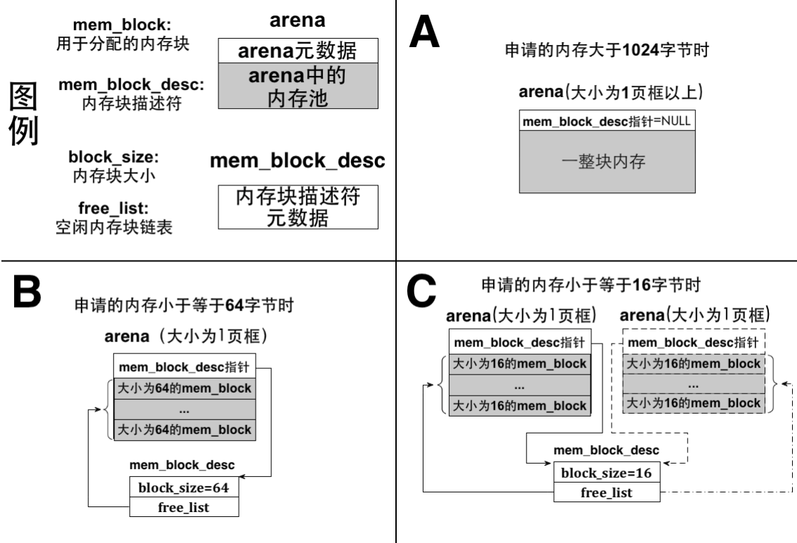
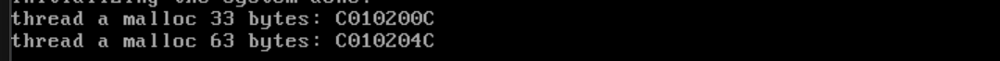
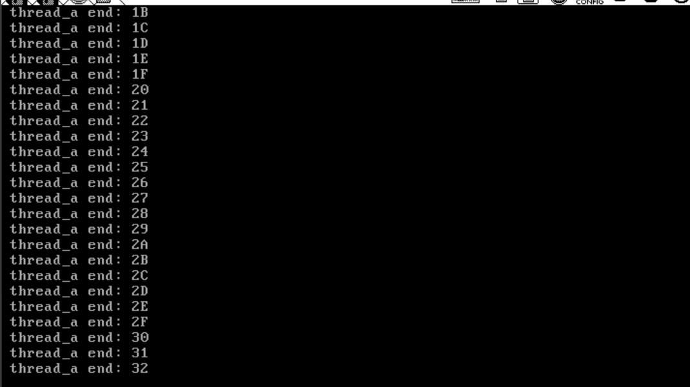
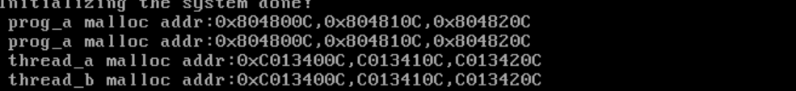

# 大活：实现malloc和free

## 内存的申请——sys_malloc函数

### What is MemoryBlockDescriptor And Arena

> 说实在的，大一大二被malloc和free和派生的new和delete折磨过，直到遇到了智能指针，哈哈

​	之前我们虽然已经实现了内存管理，但显得过于粗糙，分配的内存都是以 4KB 大小的页框为单位的，当 我们仅需要几十字节、几百字节这样的小内存块时，显然无法满足这样的需求了，为此必须实现一种小内存块 的管理，可以满足任意内存大小的分配，这就是我们为实现malloc 要做的基础工作。 

​	对于这种小东西，我们需要一个arena，这是很多开源项目中都会用到的内存管理概 念，将一大块内存划分成多个小内存块，每个小内存块之间互不干涉，可以分别管理，这样众多的小内存块就称为 arena

​	小格子小格子，你只需要用里头的，被分配给自己的小东西就好了，不要干扰别人。我们的arena就是这样的小东西，我们把一大片的：一页的内存，分成若干的小内存仓库。根据请求的内存量的大小，arena 的大小也许是 1 个页 框，也许是多个页框，随后再将它们平均拆分成多个小内存块。按内存块的大小，可以划分出多种不同规 格的 arena，比如一种 arena 中全是 16 字节大小的内存块，故它只响应 16 字节以内的内存分配，另一种arena 中全是32 字节的内存块，故它只响应32 字节以内的内存分配。我们平时调用 malloc 申请内存时，操作系统返回的地址其实就是某个内存块的起始地址，操作系统会根据 malloc 申请的内存大小来选择不同规格的内存块。因此，为支持多种容量内存块的分配，我们要提前建立好多种不同容量内存块的arena。

​	arena 是个提供内存分配的数据结构，它分为两部分，一部分是元信息，用来描述自己内存池中空闲内存块数量，这其中包括内存块描述符指针（后面介绍），通过它可以间接获知本 arena 所包含内存块的规格大小，此部分占用的空间是固定的，约为 12 字节。另一部分就是内存池区域，这里面有无数的内存块，此部分占用 arena 大量的空间。我们把每个内存块命名为 mem_block，它们是内存分配粒度更细的资源，最终为用户分配的就是这其中的一个内存块。在咱们的实现中，针对小内存块的 arena 占用1 页框内存，除了元信息外的剩下的内存被平均分成多个小内存块。

​	我们的arena是动态的——当此 arena 中的全部内存块都被分配完时，系统再创建一个同规格的 arena 继续提供该规格 的内存块，当此 arena 又被分配完时，再继续创建出同规格的 arena，arena 规模逐渐增大，逐步形成 arena 集群。既然同一类内存块可以由多个 arena 提供，为了跟踪每个 arena 中的空闲内存块，分别为每一种规格的内存块建立一个内存块描述符，即 MemoryBlockDescriptor，在其中记录内存块规格大小，以及位于所有同类 arena 中的空闲内存块链表。

​	内存块描述符将所有同类 arena 中空闲内存块汇总，因此它相当于内存块超级大仓库，分配小块内存时必须先经过此入口，系统从它的空闲内存块链表 free_list 中挑选一块内存，也就是说，最终所分配的内存属于此类arena 集群中某个arena 的某个内存块。内存块规格有多少种，内存块描述符就有多少种，因此各种内存块描述符的区别就是 block_size 不同，free_list 中指向的内存块规格不同。由于有了内存块描述符arena 中就没有必要再冗余记录本arena 中内存块规格信息，而是用内存块描述符指针指向本arena 所属的内存块描述符，间接获得本arena 中内存块的规格大小，内存块描 述符指针位于arena 的元信息当中。 

​	咱们这里的内存块以 16 字节为起始，向上依次是32 字节、64 字节、128 字节、256字节、512 字节、1024 字节，总共7 种规格，等会代码实现上，会体现出来的



```c
/* MemoryBlock */
typedef struct {
    list_elem free_elem;
}MemoryBlock;

/* MemoryBlockDescriptor */
typedef struct {
    uint32_t    block_size;       // block size of the memory
    uint32_t    blocks_per_arena; // current memblock contains
    list        free_list;     // current available mem blocks
}MemoryBlockDescriptor;
```

​	在settings中，咱们也添加一个：

```
// for malloc free issue
#define     DESC_CNT            (7)
```

​	下面看看：

```c
/* Arena metadata for memory allocation */
typedef struct {
    MemoryBlockDescriptor
        *desc; // Memory block descriptor associated with this arena
    /* If 'large' is true, 'cnt' represents the number of page frames.
     * Otherwise, 'cnt' represents the number of free memory blocks. */
    uint32_t cnt;
    bool large;
}Arena;

MemoryBlockDescriptor   k_block_descs[DESC_CNT];
```

​	这个就是我们的Arena，如你所见。

```c
/* Prepare for malloc by initializing memory block descriptors */
void block_desc_init(MemoryBlockDescriptor *desc_array) {
    uint16_t block_size = 16;

    /* Initialize each memory block descriptor */
    for (uint16_t desc_idx = 0; desc_idx < DESC_CNT; desc_idx++) {
        desc_array[desc_idx].block_size = block_size;

        /* Initialize the number of memory blocks in an arena */
        desc_array[desc_idx].blocks_per_arena =
            (PG_SIZE - sizeof(Arena)) / block_size;

        list_init(&desc_array[desc_idx].free_list);

        block_size *= 2; // Update to the next memory block size
    }
}
```

​	我们之后做的就是初始化。我们给每一个内存块描述符上初始化，维护的大小从16开始说。

​	然后我们在memory_management_init调用一下。这描述符就好初始化好了。

### 向实现sys_malloc迈进

​	很快我们就要实现一个接口malloc了，但是在那之前我们先把sys_malloc实现了。

​	修改一下PCB，因为我们每一个进程都要维护自己的内存块描述符，不然咋知道这个线程下的分配情况。

```c
/**
 * @brief Task control block structure.
 *
 * This structure represents a thread and stores its execution context.
 */
typedef struct __cctaskstruct
{
    uint32_t *self_kstack;         // Kernel stack pointer for the thread
    pid_t pid;                     // Process ID
    TaskStatus status;             // Current status of the thread
    char name[TASK_NAME_ARRAY_SZ]; // Thread name
    uint8_t priority;              // Thread priority level
    uint8_t ticks;
    uint32_t elapsed_ticks;
    list_elem general_tag;
    list_elem all_list_tag;
    uint32_t *pg_dir;
    VirtualAddressMappings  userprog_vaddr;
    MemoryBlockDescriptor u_block_desc[DESC_CNT];
    uint32_t stack_magic; // Magic value for stack overflow detection
} TaskStruct;
```

​	添加一个MemoryBlockDescriptor数组成员来维护情况。当我们触发的是一个用户线程的时候，我们初始化MemoryBlockDescriptor数组

```c
/* Execute a user process */
void create_process(void *filename, char *name) {
    /* Allocate memory for the process control block (PCB) in the kernel memory
     * pool */
    TaskStruct *thread = get_kernel_pages(PCB_SZ_PG_CNT);
    init_thread(thread, name, DEFAULT_PRIO); // Initialize the thread's PCB
    create_user_vaddr_bitmap(
        thread); // Create a virtual address bitmap for the user process
    create_thread(thread, start_process,
                  filename); // Create the thread to start the user process
    thread->pg_dir =
        create_page_dir(); // Create a page directory for the process
    block_desc_init(thread->u_block_desc);
    /* Add the thread to the ready list and all thread list */
    Interrupt_Status old_status = set_intr_status(INTR_OFF);
    KERNEL_ASSERT(!elem_find(&thread_ready_list, &thread->general_tag));
    list_append(&thread_ready_list, &thread->general_tag);

    KERNEL_ASSERT(!elem_find(&thread_all_list, &thread->all_list_tag));
    list_append(&thread_all_list, &thread->all_list_tag);
    set_intr_status(old_status); // Restore the interrupt state
}
```

​	下面就是两个工具函数，嗯，有点长。这是解决索引问题的：

```c
/* Return the address of the idx-th memory block in the arena */
static MemoryBlock *arena2block(Arena *a, uint32_t idx) {
    return (MemoryBlock *)((uint32_t)a + sizeof(Arena) +
                           idx * a->desc->block_size);
}

/* Return the arena address where the memory block b is located */
static Arena *block2arena(MemoryBlock *b) {
    return (Arena *)((uint32_t)b & PG_FETCH_OFFSET);
}
```

​	arena2block 接受两个参数，arena 指针a 和内存块mem_block 在arena 中的索引，函数功能是返回arena中第 idx 个内存块的首地址。一会儿我们介绍 sys_malloc 时您就会明白，arena 是从堆中创建的，方法是 使 arena 结构体指针指向从堆中返回的一个或多个页框的内存，因此 arena 结构体 struct arena 并不是全部 arena 的大小，结构体中仅有3 个成员，它就是我们所说的arena 的元信息。在arena 指针指向的页框中，除去 元信息外的部分才被用于内存块的平均拆分，每个内存块都是相等的大小且连续挨着，因此arena2block 的原理是在 arena 指针指向的页框中，跳过元信息部分，即 struct arena 的大小，再用 idx 乘以该 arena 中内存块大小，最终的地址便是 arena 中第 idx 个内存块的首地址，最后将其转换成 mem_block 类型后返回。内存块大小记录在由 desc 指向的内存块描述符的 block_size 中。

​	第 2 个函数block2arena 接受一个参数，内存块指针b。block2arena 用于将7 种规格的内存块转换为内存块所在的arena，由于此类内存块所在的arena 占据1 个完整的自然页框，所以arena 中的内存块都属于这1 页框之内，因此函数原理很简单，内存块的高 20 位地址便是 arena 所在的地址。

​	下面就是我们的sys_malloc了，想看全局函数需要自己到代码仓库中看，在memory.c文件中！

​	抛开我们的变量声明的部分，我们一段一段看：

```c
    /* Determine which memory pool to use */
    if (!cur_thread->pg_dir) { // Kernel thread
        PF = PF_KERNEL;
        pool_size = kernel_pool.pool_size;
        mem_pool = &kernel_pool;
        descs = k_block_descs;
    } else { // User process, its pg_dir is created when allocating page table
        PF = PF_USER;
        pool_size = user_pool.pool_size;
        mem_pool = &user_pool;
        descs = cur_thread->u_block_desc;
    }
    /* Return NULL if requested memory size exceeds the pool size */
    if (!(size > 0 && size < pool_size)) {
        return NULL;
    }
```

​	这个嘛，就是我们准备好确定我们的分配目标。注意，内核线程的资源是全局唯一，这点就在k_block_descs是全局的可以体现出来。同样的，最后我们检查一下，如果空间不够了，咱们不分配直接返回空。

​	我们用来初始化上面声明的变量。简单吧。

​	arena 既可处理大于 1024 字节的大内存分配，也支持 1024 字节以内的小内存分配，各自的实现还是有些区别的，所以，我们先看大于的部分。

```c
    /* If the size is larger than 1024 bytes, allocate a page frame */
    if (size > 1024) {
        uint32_t page_cnt =
            ROUNDUP(size + sizeof(Arena),
                    PG_SIZE); // Round up to the number of page frames needed

        a = malloc_page(PF, page_cnt);

        if (a) {
            k_memset(a, 0, page_cnt * PG_SIZE); // Clear the allocated memory

            /* For large allocations, set desc to NULL, cnt to the number of
             * pages, and large to true */
            a->desc = NULL;
            a->cnt = page_cnt;
            a->large = true;
            lock_release(&mem_pool->lock);
            return (void *)(a + 1); // Skip the arena header and return the
                                    // remaining memory
        } else {
            lock_release(&mem_pool->lock);
            return NULL;
        }
   }
```

​	首先计算一下，要分配多少个页。如果分配成功，我们就要清空，把元信息搞定来。：清空我们的小内存，然后赋值对应的参数，这个简直没啥好说的。随后，直接扔回去我们初始化好的东西。完结。

​	处理小于的情况才会复杂起来：

```c
else { // If the requested memory is 1024 bytes or less, fit into
             // available block descriptors
        uint8_t desc_idx;

        /* Find the matching block size from the memory block descriptors */
        for (desc_idx = 0; desc_idx < DESC_CNT; desc_idx++) {
            if (size <=
                descs[desc_idx].block_size) { // From small to large, stop once
                                              // a match is found
                break;
            }
        }

        /* If no available memory blocks in the free list, allocate a new arena
         */
        if (list_empty(&descs[desc_idx].free_list)) {
            a = malloc_page(PF, 1); // Allocate 1 page frame for the arena
            if (!a) {
                lock_release(&mem_pool->lock);
                return NULL;
            }
            k_memset(a, 0, PG_SIZE);

            /* For small allocations, set desc to the matching memory block
             * descriptor, cnt to the number of available blocks in the arena,
             * and large to false */
            a->desc = &descs[desc_idx];
            a->large = false;
            a->cnt = descs[desc_idx].blocks_per_arena;
            uint32_t block_idx;

            Interrupt_Status old_status = set_intr_status(INTR_OFF);

            /* Start splitting the arena into memory blocks and adding them to
             * the free list */
            for (block_idx = 0; block_idx < descs[desc_idx].blocks_per_arena;
                 block_idx++) {
                b = arena2block(a, block_idx);
                KERNEL_ASSERT(!elem_find(&a->desc->free_list, &b->free_elem));
                list_append(&a->desc->free_list, &b->free_elem);
            }
            set_intr_status(old_status);
        }
```

​	我们有7 种规格的内存块描述符，把它们都遍历一次，肯定能找到合适的内存块。下面用 for 循环排查所有的内存块描述符，注意，我们上节在初始化内存块描述符时，下标越低，其block_size 的值越小，desc_idx 初始为0，从低容量的内存块向上找，把7 种block_size 都遍历一遍，总有一款内存块最接近size 字节。比如申请的内存量size 为120 字节，规格为128 字节的内存块是最适合的。找到后退出循环，desc_idx 便是最合适的内存块索引。在分配之前先要判断是否有可用的内存块，这里是通过内存块描述符中的free_list 是否为空判断的。如果 free_list 为空，表示目前的供货商 arena 已经被分配光了，此规格大小的内存块已经没有了，此时需要再创建新的arena。

​	找到了，准备初始化：这次的arena 用于小内存块分配，所以其desc 指针必须指向具体的内存块描述符。在创建新的 arena 后，下一步是将它拆分成内存块，for循环次数是descs[desc_idx].blocks_per_arena，这表示此arena 将被拆分成的内存块数量。拆分内存块是通过arena2block函数完成的，它在 arena 中按照内存块的索引 block_idx 拆分出相应的内存块。指针 b 指向每次新拆分出来的内存块，然后将其添加到内存块描述符的 free_list 中。以后每次发现目标内存块描述符的 free_list 为空时，就重新为这样block_size 大小的块创建 arena，将 arena 打散成 block_size 大小的内存块，继续添加到内存块描述符的free_list 中。这样一来，为同一内存块描述符提供内存块的 arena 将越来越多，这些 arena的 desc 都指向同一个内存块描述符。 

```c
        b = elem2entry(MemoryBlock, free_elem,
                       list_pop(&(descs[desc_idx].free_list)));
        k_memset(b, 0, descs[desc_idx].block_size);

        a = block2arena(b); // Get the arena of the memory block b
        a->cnt--;           // Decrease the count of free blocks in the arena
        lock_release(&mem_pool->lock);
        return (void *)b;
```

​	内存块被汇总在内存块描述符的free_list 中，我们用list_pop 从free_list 中弹出一 个内存块，此时得到的仅仅是内存块 mem_block 中 list_elem 的地址，因此要用到elem2entry 宏将其转换成 mem_block 的地址。 通过函数block2arena(b)获取内存块b 所在的 arena 地址，然后将 a->cnt 减1，表示空闲内存块少了一个。此项是供将来释放内存使用的，释放内存时会参考 cnt 的值，用来判断是将 mem_block 回收到内存块描述符的 free_list 中，还是直接释放内存块所在的 arena。 

> 让我们总结一下：这个函数 `sys_malloc` 的作用是从内存堆中分配一块大小为 `size` 字节的内存空间。它根据调用者是内核线程还是用户进程来决定从哪个内存池分配内存。函数首先获取当前线程的结构体指针 `cur_thread`，然后判断它是否有页目录 `pg_dir`。如果没有，说明是内核线程，使用内核内存池 `kernel_pool` 和内核的内存块描述符数组 `k_block_descs`；如果有页目录，说明是用户进程，使用用户内存池 `user_pool` 和当前线程私有的内存块描述符 `u_block_desc`。
>
> 接着，函数检查请求的内存大小是否有效，如果请求的大小小于等于0或超过了该内存池的总容量，函数直接返回空指针表示失败。
>
> 然后加锁，保证多线程安全。分配逻辑根据请求的大小分为两类。如果请求的大小大于1024字节，则直接分配整页内存。具体做法是计算需要多少页，调用 `malloc_page` 分配这些页。若成功，使用 `k_memset` 把新分配的内存清零，然后将 `Arena` 的 `desc` 字段设为 NULL，`cnt` 字段设为页数，`large` 字段设为 true，最后释放锁，并返回跳过 Arena 头部之后的内存地址作为分配结果；如果分配失败，则释放锁并返回 NULL。
>
> 如果请求的大小不超过1024字节，说明可以使用内存块描述符数组进行小块内存管理。从小到大查找第一个能容纳请求大小的内存块描述符索引 `desc_idx`。然后检查该描述符的空闲列表是否为空，如果为空，说明之前没有为该大小类型分配过内存块，就需要新分配一页，将这一页划分为多个小内存块。
>
> 在新分配的一页中，将该页初始化为一个 Arena，并把它的 `desc` 指向对应的描述符，`large` 标志设为 false，`cnt` 表示该 Arena 还能提供多少个内存块。然后关中断，确保在往空闲列表里添加新内存块时不会被打断。根据描述符中规定的块数量，将 Arena 划分为多个 MemoryBlock，每一个都加到空闲列表中，然后恢复中断状态。
>
> 如果空闲列表不为空，或已经填充了新的内存块，程序从空闲列表中取出第一个可用内存块，将其清零，然后获取它所属的 Arena，把该 Arena 中剩余的空闲块数量减一，释放锁，最后返回这个内存块的地址作为分配结果。

​	我们现在来测试一下：

```c
#include "include/device/console_tty.h"
#include "include/kernel/init.h"
#include "include/library/kernel_assert.h"
#include "include/thread/thread.h"
#include "include/user/process/process.h"
#include "include/user/syscall/syscall.h"
#include "include/user/syscall/syscall_init.h"
#include "include/user/stdio/stdio.h"
#include "include/memory/memory.h"
void thread_a(void *args);
void thread_b(void *args);
void u_prog_a(void);
void u_prog_b(void);
int prog_a_pid = 0, prog_b_pid = 0; 

int main(void)
{
    init_all();
    interrupt_enabled();
    thread_start("k_thread_a", 31, thread_a, "In thread A:");
    thread_start("k_thread_b", 31, thread_b, "In thread B:");
    
    while (1)
    {
    }
}

void thread_a(void *arg)
{
    char* para = arg;
    (void)para;
    void* addr = sys_malloc(33);
    console_ccos_puts("thread a malloc 33 bytes: ");
    console__ccos_display_int((uint32_t)addr);
    console__ccos_putchar('\n');
    while (1);
}
void thread_b(void *arg)
{
    char* para = arg;
    (void)para;
    void* addr = sys_malloc(63);
    console_ccos_puts("thread a malloc 63 bytes: ");
    console__ccos_display_int((uint32_t)addr);
    console__ccos_putchar('\n');
    while (1);
}
```



## 内存的释放：sys_free函数

### 预备工作

​	只借不还，可不是好习惯，我们还要对称的实现free的函数。释放内存是与分配内存相反的过程，所以基本步骤就是——

- 在物理地址池中释放物理页地址，相关的函数是 pfree，操作的位图同 palloc。 
- 在页表中去掉虚拟地址的映射，原理是将虚拟地址对应pte 的P 位置0，相关的函数是page_table_pte_remove。 
- 在虚拟地址池中释放虚拟地址，相关的函数是 vaddr_remove，操作的位图同 vaddr_get。 

​	先说说`page_table_pte_remove`，由于使用的是二级页表结构，一个虚拟地址在页表中需要查找两个级别的表项：页目录项（PDE）和页表项（PTE）。其中，PDE 指向一个页表的物理地址，而 PTE 指向最终映射的物理页框。每个页表有 1024 个 PTE，对应 1024 个虚拟页。要清除一个虚拟地址的映射，直观的做法是把对应的 PTE 清零，这当然可以，但其实不够细致。更推荐的方式是只将 PTE 中的 P 位（present 位）清 0。P 位是用来指示该 PTE 是否有效，即物理页是否在内存中。一旦 P 位为 0，CPU 就会认为这个 PTE 无效，从而认为该虚拟地址没有映射，而不会继续去访问该 PTE 指向的物理地址。

​	将 P 位清 0 有一个额外的好处：当系统物理内存紧张时，可以将该物理页的内容写入外存，然后释放对应的物理页框。这种情况下，需要将 PTE 的 P 位清 0，以便之后如果访问该虚拟地址时，CPU 触发 page fault 异常。在 page fault 的中断处理程序中，系统可以从外存重新将数据读入一个可用的物理页（不一定是原来的），然后更新 PTE 的地址字段，并将 P 位重新置为 1。这样，CPU 会重新尝试访问该虚拟地址，并因为 P 位为 1 而访问成功。

​	这种机制正是现代操作系统（如 Linux）所采用的虚拟地址管理方式之一。正因为“清除虚拟地址映射”本质上只需要操作 PTE 中的 P 位，所以函数名中使用 `pte_remove` 而不是更宽泛的 `page_table_remove`，以强调其具体作用在 PTE 上，而非整个页表结构。

```c
/* Remove the mapping for the virtual address vaddr in the page table,
 * only removes the page table entry (PTE) for the given virtual address */
static void page_table_pte_remove(uint32_t vaddr) {
    uint32_t *pte = pte_ptr(vaddr);
    *pte &= ~PG_P_1; // Set the present bit of the page table entry to 0
    asm volatile("invlpg %0" ::"m"(vaddr) : "memory"); // Update TLB
}
```

​	看起来就是这样的。

​	下面我们看看如何处理物理内存的清除

```c
/* Return the physical address pg_phy_addr back to the physical memory pool */
void pfree(uint32_t pg_phy_addr) {
    MemoryPool *mem_pool;
    uint32_t bit_idx = 0;
    if (pg_phy_addr >= user_pool.phy_addr_start) { // User physical memory pool
        mem_pool = &user_pool;
        bit_idx = (pg_phy_addr - user_pool.phy_addr_start) / PG_SIZE;
    } else { // Kernel physical memory pool
        mem_pool = &kernel_pool;
        bit_idx = (pg_phy_addr - kernel_pool.phy_addr_start) / PG_SIZE;
    }
    bitmap_set(&mem_pool->pool_bitmap, bit_idx, 0); // Set the bitmap bit to 0
}

```

​	您看，就是根据类型来操作对应的位图置空。

```c
/* Free the contiguous pg_cnt virtual pages starting from vaddr in the virtual
 * address pool */
static void vaddr_remove(PoolFlag pf, void *_vaddr, uint32_t pg_cnt) {
    uint32_t bit_idx_start = 0, vaddr = (uint32_t)_vaddr, cnt = 0;

    if (pf == PF_KERNEL) { // Kernel virtual memory pool
        bit_idx_start = (vaddr - kernel_vaddr.vaddr_start) / PG_SIZE;
        while (cnt < pg_cnt) {
            bitmap_set(&kernel_vaddr.virtual_mem_bitmap, bit_idx_start + cnt++, 0);
        }
    } else { // User virtual memory pool
        TaskStruct *cur_thread = current_thread();
        bit_idx_start =
            (vaddr - cur_thread->userprog_vaddr.vaddr_start) / PG_SIZE;
        while (cnt < pg_cnt) {
            bitmap_set(&cur_thread->userprog_vaddr.virtual_mem_bitmap,
                       bit_idx_start + cnt++, 0);
        }
    }
}
```

​	类似的，上面也就是清空虚拟内存了。下面，我们综合一下释放物理页——释放虚拟页——释放链接三大关系来结合构成我们的mfree_page函数：

```c
/* Free the physical pages starting from the virtual address vaddr and spanning
 * pg_cnt pages */
void mfree_page(PoolFlag pf, void *_vaddr, uint32_t pg_cnt) {
    uint32_t pg_phy_addr;
    uint32_t vaddr = (int32_t)_vaddr;
    uint32_t page_cnt = 0;
    KERNEL_ASSERT(pg_cnt >= 1 && vaddr % PG_SIZE == 0);
    pg_phy_addr =
        addr_v2p(vaddr); // Get the physical address corresponding to vaddr

    /* Ensure that the physical memory to be freed is outside the lower 1M + 1K
     * page directory + 1K page table address range */
    KERNEL_ASSERT((pg_phy_addr % PG_SIZE) == 0 && pg_phy_addr >= 0x102000);

    /* Determine if the physical address belongs to the user or kernel pool */
    if (pg_phy_addr >= user_pool.phy_addr_start) { // User pool
        vaddr -= PG_SIZE;
        while (page_cnt < pg_cnt) {
            vaddr += PG_SIZE;
            pg_phy_addr = addr_v2p(vaddr);

            /* Ensure the physical address belongs to the user physical memory
             * pool */
            KERNEL_ASSERT((pg_phy_addr % PG_SIZE) == 0 &&
                   pg_phy_addr >= user_pool.phy_addr_start);

            /* Return the corresponding physical page frame to the pool */
            pfree(pg_phy_addr);

            /* Remove the page table entry for the corresponding virtual address
             */
            page_table_pte_remove(vaddr);

            page_cnt++;
        }
        /* Clear the corresponding bits in the virtual address bitmap */
        vaddr_remove(pf, _vaddr, pg_cnt);

    } else { // Kernel pool
        vaddr -= PG_SIZE;
        while (page_cnt < pg_cnt) {
            vaddr += PG_SIZE;
            pg_phy_addr = addr_v2p(vaddr);
            /* Ensure that the physical memory to be freed is only within the
             * kernel physical memory pool */
            KERNEL_ASSERT((pg_phy_addr % PG_SIZE) == 0 &&
                   pg_phy_addr >= kernel_pool.phy_addr_start &&
                   pg_phy_addr < user_pool.phy_addr_start);

            /* Return the corresponding physical page frame to the pool */
            pfree(pg_phy_addr);

            /* Remove the page table entry for the corresponding virtual address
             */
            page_table_pte_remove(vaddr);

            page_cnt++;
        }
        /* Clear the corresponding bits in the virtual address bitmap */
        vaddr_remove(pf, _vaddr, pg_cnt);
    }
}
```

​	首先，函数将虚拟地址 `_vaddr` 转换为 `uint32_t` 类型的整型变量 `vaddr`，同时将页面计数器 `page_cnt` 初始化为 0。断言检查 `pg_cnt` 至少为 1，且 `vaddr` 必须是页对齐的，即它必须是页大小（通常为 4KB）的整数倍。接下来通过 `addr_v2p` 函数将虚拟地址转换为对应的物理地址 `pg_phy_addr`。为了避免错误地释放内核关键区域的内存，函数断言物理地址必须是页对齐的，并且位于 1MB 加上页目录和页表占用空间之后，即至少是 `0x102000` 以上。

​	然后函数判断这段物理地址属于用户内存池还是内核内存池。如果物理地址不小于用户内存池的起始地址 `user_pool.phy_addr_start`，就说明它属于用户内存池。此时先将 `vaddr` 回退一个页的大小（为了配合后续循环中先加后用的处理方式），然后进入循环，每次处理一个页。循环中，先将 `vaddr` 加上一个页的大小，然后重新计算当前虚拟地址对应的物理地址 `pg_phy_addr`，并再次断言它属于用户内存池。

​	接着，调用 `pfree` 将当前物理页归还到用户物理内存池，再调用 `page_table_pte_remove` 删除该虚拟地址的页表项（将其 P 位清 0）。最后将页面计数器 `page_cnt` 加一，继续循环直到释放完所有页。用户页释放完成后，调用 `vaddr_remove` 清除虚拟地址位图中的相应位，表示这些虚拟页已经不再被占用。

​	如果最开始判断该物理地址不属于用户内存池，那就说明它属于内核内存池。处理方式与用户内存池类似，只是增加了一项额外的断言：除了页对齐和大于内核起始地址外，还要确保物理地址小于用户内存池的起始地址，即它确实属于内核分配范围。释放过程和用户部分完全一致：先归还物理页，再删除对应的页表项，最后更新虚拟地址位图。

### 实现我们的sys_free

```c
/* Free the memory pointed to by ptr */
void sys_free(void *ptr) {
    KERNEL_ASSERT(ptr);
    PoolFlag PF;
    MemoryPool *mem_pool;
    /* Determine whether it's a thread or a process */
    if (!current_thread()->pg_dir) {
        KERNEL_ASSERT((uint32_t)ptr >= KERNEL_HEAP_V_START);
        PF = PF_KERNEL;
        mem_pool = &kernel_pool;
    } else {
        PF = PF_USER;
        mem_pool = &user_pool;
    }

    lock_acquire(&mem_pool->lock);
    MemoryBlock *b = ptr;
    Arena *a = block2arena(
        b); // Convert the memory block to an arena to get metadata
        KERNEL_ASSERT(a->large == 0 || a->large == 1);
    if (!(a->desc) &&
        a->large == true) { // Memory larger than 1024 bytes
        mfree_page(PF, a, a->cnt);
    } else { // Memory block smaller than or equal to 1024 bytes
        /* Add the memory block back to the free list */
        list_append(&a->desc->free_list, &b->free_elem);

        /* Check if all blocks in this arena are freed, if so, release the
         * arena */
        if (++a->cnt == a->desc->blocks_per_arena) {
            uint32_t block_idx;
            for (block_idx = 0; block_idx < a->desc->blocks_per_arena;
                 block_idx++) {
                MemoryBlock *b = arena2block(a, block_idx);
                KERNEL_ASSERT(elem_find(&a->desc->free_list, &b->free_elem));
                list_remove(&b->free_elem);
            }
            mfree_page(PF, a, 1);
        }
    }
    lock_release(&mem_pool->lock);
}
```

​	一开始，我们通过断言确保 `ptr` 非空，即不能传入一个空指针。随后判断当前正在运行的是线程还是进程：如果当前线程没有页目录（`pg_dir` 为 `NULL`），说明它是内核线程，此时使用内核内存池，并断言传入的地址位于内核堆的起始地址之后；如果存在页目录，说明是用户进程，就使用用户内存池。接着为防止并发冲突，对对应的内存池加锁。将传入的 `ptr` 强制转换为 `MemoryBlock *` 类型的指针 `b`，然后使用 `block2arena` 函数找到它所在的 `Arena`，这样就可以访问它所在内存区域的元数据了。

​	此时通过断言确认 `a->large` 的值为 0 或 1（即只可能是 false 或 true）。如果这个内存块所在的 `Arena` 没有关联到 `desc` 描述符，且 `a->large == true`，说明这是一次大块内存分配（超过 1024 字节），当初是直接用整页方式分配的，那么现在就调用 `mfree_page` 将整个页释放掉。否则，说明这是一次小块内存分配，`Arena` 中包含了多个小的 `MemoryBlock`，现在将这个小块重新加入到它所在描述符的空闲链表中。然后检查整个 `Arena` 中是否所有的内存块都已经归还了（即 `cnt` 恢复到了 `blocks_per_arena` 的值）。如果是，就表示这个 `Arena` 已经完全空闲，接下来遍历这个 `Arena` 中所有的块，逐个从空闲链表中移除，以清理干净，再通过 `mfree_page` 释放掉整个 `Arena` 所在的页面。最后，无论是释放整页还是释放小块，都要释放对内存池的锁，以允许其他线程或进程访问内存。

### 测试代码

```c
#include "include/device/console_tty.h"
#include "include/kernel/init.h"
#include "include/library/kernel_assert.h"
#include "include/thread/thread.h"
#include "include/user/process/process.h"
#include "include/user/syscall/syscall.h"
#include "include/user/syscall/syscall_init.h"
#include "include/user/stdio/stdio.h"
#include "include/memory/memory.h"
#include "include/library/ccos_print.h"
void thread_a(void *args);
void thread_b(void *args);
void u_prog_a(void);
void u_prog_b(void);
int prog_a_pid = 0, prog_b_pid = 0; 

int main(void) {
    init_all();
    interrupt_enabled();
    thread_start("k_thread_a", 31, thread_a, "I am thread_a");
    thread_start("k_thread_b", 31, thread_b, "I am thread_b");
    while (1);
    return 0;
}

void thread_a(void* arg) {
    char* para = arg;
    void *addr1, *addr2, *addr3, *addr4, *addr5, *addr6, *addr7;
    int index = 0, max = 100;
    console_ccos_puts(" thread_a start\n");

    while (max-- > 0) {
        int size = 128;
        addr1 = sys_malloc(size);
        addr2 = sys_malloc(size *= 2);
        addr3 = sys_malloc(size *= 2);
        sys_free(addr1);
        addr4 = sys_malloc(size);
        size *= 128;
        addr5 = sys_malloc(size);
        addr6 = sys_malloc(size);
        sys_free(addr5);
        addr7 = sys_malloc(size *= 2);
        sys_free(addr6);
        sys_free(addr7);
        sys_free(addr2);
        sys_free(addr3);
        sys_free(addr4);
        ccos_puts(" thread_a end: ");
        __ccos_display_int(index++);
        __ccos_putchar('\n');
    }

    while (1);
}

void thread_b(void* arg) {
    char* para = arg;
    void *addr1, *addr2, *addr3, *addr4, *addr5, *addr6, *addr7, *addr8, *addr9;
    int index = 0, max = 100;
    console_ccos_puts(" thread_b start\n");

    while (max-- > 0) {
        int size = 9;
        addr1 = sys_malloc(size);
        addr2 = sys_malloc(size *= 2);
        sys_free(addr2);
        addr3 = sys_malloc(size *= 2);
        sys_free(addr1);
        addr4 = sys_malloc(size);
        addr5 = sys_malloc(size);
        addr6 = sys_malloc(size);
        sys_free(addr5);
        addr7 = sys_malloc(size *= 2);
        sys_free(addr6);
        sys_free(addr7);
        sys_free(addr3);
        sys_free(addr4);

        size *= 8;
        addr1 = sys_malloc(size);
        addr2 = sys_malloc(size);
        addr3 = sys_malloc(size);
        addr4 = sys_malloc(size);
        addr5 = sys_malloc(size);
        addr6 = sys_malloc(size);
        addr7 = sys_malloc(size);
        addr8 = sys_malloc(size);
        addr9 = sys_malloc(size);

        sys_free(addr1);
        sys_free(addr2);
        sys_free(addr3);
        sys_free(addr4);
        sys_free(addr5);
        sys_free(addr6);
        sys_free(addr7);
        sys_free(addr8);
        sys_free(addr9);
        ccos_puts(" thread_b end: ");
        __ccos_display_int(index++);
        __ccos_putchar('\n');
    }

    while (1);
}

```

​	测试一下：



​	看看会不会炸page fault来检验我们写的正不正确。

## 实现malloc和free

​	放轻松，有sys_malloc和sys_free，这件事情简直易如反掌。

```c
/* Allocates 'size' bytes of memory and returns the result */
void *malloc(uint32_t size) {
    return (void *)_syscall1(SYS_MALLOC, size);
}

/* Frees the memory pointed to by 'ptr' */
void free(void *ptr) {
    _syscall1(SYS_FREE, ptr);
}

#ifndef USR_SYSCALL_NR
#define USR_SYSCALL_NR
#include "include/library/types.h"
typedef enum {
    SYS_GETPID,
    SYS_WRITE,
    SYS_MALLOC,
    SYS_FREE
}Syscall_NR;

uint32_t getpid(void);
uint32_t write(char* str);
void* malloc(uint32_t size); 
void free(void* ptr);
#endif

extern void sys_free(void *ptr);
extern void *sys_malloc(uint32_t size);

/* Initialize the system call table */
void syscall_init(void) {
    verbose_ccputs("syscall_init start\n"); // Logging the start of syscall initialization
    /* Set the system call table entries for various system call numbers */
    syscall_table[SYS_GETPID] = sys_getpid; // Get process ID
    syscall_table[SYS_WRITE] = sys_write;
    syscall_table[SYS_MALLOC] = sys_malloc; // Memory allocation
    syscall_table[SYS_FREE] = sys_free;     // Free allocated memory
    verbose_ccputs("syscall_init done\n"); // Logging the completion of syscall
                                          // initialization
}

```

​	简单吧，直接上测试！

```c
#include "include/device/console_tty.h"
#include "include/kernel/init.h"
#include "include/library/kernel_assert.h"
#include "include/thread/thread.h"
#include "include/user/process/process.h"
#include "include/user/syscall/syscall.h"
#include "include/user/syscall/syscall_init.h"
#include "include/user/stdio/stdio.h"
#include "include/memory/memory.h"
#include "include/library/ccos_print.h"
void thread_a(void *args);
void thread_b(void *args);
void u_prog_a(void);
void u_prog_b(void);
int prog_a_pid = 0, prog_b_pid = 0; 

int main(void) { 
    init_all(); 
    interrupt_enabled(); 
    create_process(u_prog_a, "u_prog_a"); 
    create_process(u_prog_b, "u_prog_b"); 
    thread_start("k_thread_a", 31, thread_a, "I am thread_a"); 
    thread_start("k_thread_b", 31, thread_b, "I am thread_b"); 
    while(1); 
    return 0; 
} 

/* 在线程中运行的函数 */ 
void thread_a(void* arg) { 
    void* addr1 = sys_malloc(256); 
    void* addr2 = sys_malloc(255); 
    void* addr3 = sys_malloc(254); 
    console_ccos_puts(" thread_a malloc addr:0x"); 
    console__ccos_display_int((int)addr1); 
    console__ccos_putchar(','); 
    console__ccos_display_int((int)addr2); 
    console__ccos_putchar(','); 
    console__ccos_display_int((int)addr3); 
    console__ccos_putchar('\n'); 

    int cpu_delay = 100000; 
    while(cpu_delay-- > 0); 
    sys_free(addr1); 
    sys_free(addr2); 
    sys_free(addr3); 
    while(1); 
} 

/* 在线程中运行的函数 */ 
void thread_b(void* arg) { 
    void* addr1 = sys_malloc(256); 
    void* addr2 = sys_malloc(255); 
    void* addr3 = sys_malloc(254); 
    console_ccos_puts(" thread_b malloc addr:0x");  
    console__ccos_display_int((int)addr1); 
    console__ccos_putchar(','); 
    console__ccos_display_int((int)addr2); 
    console__ccos_putchar(','); 
    console__ccos_display_int((int)addr3); 
    console__ccos_putchar('\n'); 

    int cpu_delay = 100000; 
    while(cpu_delay-- > 0); 
    sys_free(addr1); 
    sys_free(addr2); 
    sys_free(addr3); 
    while(1); 
} 

void u_prog_a(void) { 
    void* addr1 = malloc(256); 
    void* addr2 = malloc(255); 
    void* addr3 = malloc(254); 
    printf(" prog_a malloc addr:0x%x,0x%x,0x%x\n",  
        (int)addr1, (int)addr2, (int)addr3); 

    int cpu_delay = 100000; 
    while(cpu_delay-- > 0); 
    free(addr1); 
    free(addr2); 
    free(addr3); 
    while(1); 
}

/* 测试用户进程 */ 
void u_prog_b(void) { 
    void* addr1 = malloc(256); 
    void* addr2 = malloc(255); 
    void* addr3 = malloc(254); 
    printf(" prog_a malloc addr:0x%x,0x%x,0x%x\n",  
        (int)addr1, (int)addr2, (int)addr3); 

    int cpu_delay = 100000; 
    while(cpu_delay-- > 0); 
    free(addr1); 
    free(addr2); 
    free(addr3); 
    while(1); 
}
```

​	看看效果：



## 下一篇

[实现硬盘驱动程序](../12_harddisk_driver/12.1_finish_ide_driver.md)
