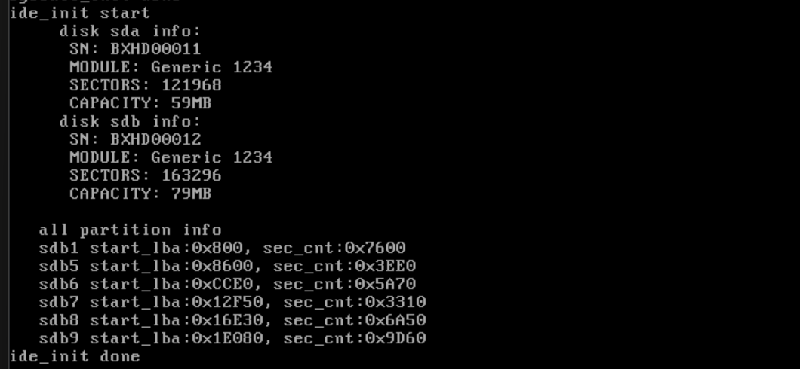

# 完成硬盘驱动程序

​	（提示——这里的代码发生了比较大的变动，如果你担心本次实验做不成功，考虑更换一下中断的写法，参考本篇代码的interrupt.c做改写。）

​	下面这个活够硬，就是完成我们的键盘驱动程序。还记得我们最开始创建我们的主boot.img嘛，很快就要来新活了。我们要创建一个新的bochs硬盘，作为我们的辅硬盘，在上面安装文件系统。嗯，就像C盘和D盘似的。

​	实际上在Makefile中添加一行话，就能直接添加好了：

```
create_disk:
	bximage -func=create -hd=80M -q ${DISK_NAME}
```

​	创建的办法：`make create_disk`。然后稍微的修改一下我们的bochsrc

```shell
# My Configure in Bochs

# RAM size available
megs:               32

# BIOS and VGA BIOS
romimage:           file=/usr/local/share/bochs/BIOS-bochs-latest
vgaromimage:        file=/usr/local/share/bochs/VGABIOS-lgpl-latest

# USE WHAT
boot:               disk
log:                bochs.log.out

# Configure More IO Device
mouse:              enabled=0
keyboard:           keymap=/usr/local/share/bochs/keymaps/x11-pc-us.map

# disk related
ata0:               enabled=1, ioaddr1=0x1f0, ioaddr2=0x3f0, irq=14
ata0-master:        type=disk, path="boot.img", mode=flat
ata0-slave:         type=disk, path="disk.img", mode=flat

# gdb support
# gdbstub:            enabled=0, port=1234, text_base=0, data_base=0, bss_base=0
```

​	添加上`ata0-slave:         type=disk, path="disk.img", mode=flat`就完事了。创建好硬盘，我们需要看看，虚拟机是不是真的认出来我们的硬盘。嗯，笔者使用的bochs呢，会在地址0x475处写入我们的检测到的硬盘数量。咱们也不客气，直接看看是不是

```
<bochs:2> xp /b 0x475
[bochs]:
0x00000475 <bogus+       0>:    0x02
```

​	哈哈，认出来了。

## 说一说磁盘分区表 

​	目前我们创建的磁盘还只是一个裸盘，没有分区。为了使用它，必须进行分区操作，这里用到的是 `fdisk` 工具。在了解如何分区前，需要先理解磁盘的物理结构。

​	磁盘内部是由一个或多个盘片组成的，盘片就像光盘一样，是带有磁性介质的圆盘。盘片上按同心圆划分为一圈一圈的磁道，每个磁道又被分成若干个扇区。

- **扇区**是磁盘最基本的读写单位，一般大小为512字节。
- **磁道**是载体，每个磁道上包含多个扇区。磁道从外到内编号。老式硬盘的每个磁道扇区数一样，而新式硬盘的外圈磁道能容纳更多扇区，不过由于存在地址转换器，操作系统仍然认为每个磁道有相同数量的扇区。
- 磁头是负责读取盘面数据的装置，每个盘面配一个磁头。一个盘片有两个面，因此有两个磁头。如果有多个盘片，就有多个磁头。磁头编号从上到下依次编号。
- **柱面**是由所有盘面上同一编号磁道构成的立体结构。为了提高读写效率，多个磁头可以同时在柱面中并行操作。柱面的容量等于盘面数（也就是磁头数）乘以每磁道的扇区数。
- **分区**是由一组连续柱面组成的，分区在物理上看是一个柱体，而不是我们平常看到的“饼图”。一个柱面不能被两个分区共享，分区边界总是对齐柱面，所以分区大小通常不是随意指定的，会自动向上取整到柱面的整数倍。

说了一些，咱们总结硬盘容量的计算公式：

- 单个盘片的容量等于每个磁道的扇区数乘以磁道数再乘以每个扇区的字节数（512字节）。磁道数也等于柱面数。
- 整个硬盘的容量等于单片容量乘以磁头数（也就是盘面数）。
- 硬盘容量 = 每磁道扇区数 × 柱面数 × 512字节 × 磁头数。

​	所以我们把硬盘的基本概念说好了。硬盘很大，我们肯定不能随意挥霍。对硬盘空间进行逻辑划分，成为了一个很自然的想法——这就是分区：其实质是将硬盘上的柱面和扇区组合成若干个连续的区域，每个区域就是一个分区。为了标明每个分区的起始和终止范围，硬盘会为每个分区配置一个“描述符”，这些描述符集中存放在硬盘的MBR（主引导记录）中。

​	MBR所在的是硬盘的第一个扇区，共512字节。其中前446字节是引导程序区域，中间64字节是分区表，最后2字节是魔数55AA。分区表是一个固定长度的结构，由4个16字节的分区表项组成，因此只能容纳4个分区的描述信息，也就意味着传统结构下，一个硬盘最多只能划分4个分区。

​	虽然有人提出是否可以扩大分区表的长度以支持更多的分区，但由于分区表的位置被固定在MBR的扇区中，并且许多底层程序（例如BIOS）依赖这个固定的结构和偏移，因此不能随意改变分区表的大小或位置。为了兼容旧结构，同时支持更多分区，人们提出了扩展分区的概念。

​	在分区表的每个表项中有一个字段叫做“文件系统ID”，用于指示该分区使用的文件系统类型。当这个ID被设置为特定的值（如5），它就不再代表某种具体的文件系统，而是表示该分区是一个扩展分区。扩展分区并不直接用于存储数据，它是一种逻辑容器，内部还可以继续划分出若干个逻辑分区。

​	由于分区表最多只能有4个表项，所**以硬盘上的扩展分区最多只能有一个**，而其余的三个分区则被称为主分区。扩展分区是可选的，也就是说，一个硬盘可以只有主分区而没有扩展分区。但一旦有扩展分区，它的作用就是容纳逻辑分区。欸！1 个扩展分区在理论上可被划分出任意多的子扩展分区，因此1 个扩展分区足够了。（反正相当于链表头了！）

​	逻辑分区是扩展分区中的具体子结构，它们才是可以真正用于存储文件系统和数据的分区。在逻辑结构上，逻辑分区也是通过类似分区表的机制进行描述，不过它们的信息不是存储在MBR中，而是存储在扩展分区内部的特殊区域——这些区域通常称为EBR（扩展引导记录）。每个逻辑分区都有一个对应的EBR结构，通过类似链表的形式将所有逻辑分区连接起来。

​	由于扩展分区本质上是一种声明性的容器，它本身不能直接使用，只有其内部的逻辑分区才可被操作系统识别并挂载。过去在没有扩展分区概念时，MBR中的4个分区全部都是主分区。为保持向下兼容，逻辑分区的编号从5开始，避免与主分区（编号1～4）混淆。虽然理论上扩展分区中可以划分出任意数量的逻辑分区，但在实际中受到硬件和接口协议的限制。比如IDE硬盘最多支持63个分区，SCSI硬盘则支持15个。尽管如此，一个扩展分区通常已能满足绝大多数需求。

​	郑刚老师使用了非常纷繁的方式去搞了分区，其实现在不用了——使用笔者提供的脚本来做——这个是使用sfdisk来做的，直接解析字符串来创建。

```shell
#!/bin/sh

if [ ! -e disk_image ]; then
    make create_disk
fi

echo -e "label: dos
unit: sectors

disk.img1 : start=2048,  size=30208, type=83
disk.img4 : start=32256, size=131040, type=5
disk.img5 : start=34304, size=16096, type=66
disk.img6 : start=52448, size=23152, type=66
disk.img7 : start=77648, size=13072, type=66
disk.img8 : start=93744, size=27216, type=66
disk.img9 : start=123008, size=40288, type=66
" | sfdisk disk.img

echo "Now display the disk info: "
fdisk -l disk.img
```

## 分区表浅析

​	磁盘分区表是一张描述硬盘上各个分区信息的表格，它的作用是告诉操作系统每个分区从哪里开始，有多大，占据哪些扇区。这张表本身是由多个结构完全相同的表项组成，每个表项对应一个分区，表中最多可以有四个分区项，因此最多支持四个主分区。分区表不是操作系统自己创建的，而是由像 fdisk 这样的分区工具生成的，不过操作系统完全有能力去创建或修改它，只是因为分区表通常是在安装系统之前就写入硬盘的，所以往往是独立于操作系统的工具来完成这一步。

​	这张分区表所在的位置很特别，它位于硬盘的第一个扇区，这个扇区叫做主引导扇区，里面包含主引导记录，也就是 MBR。整个主引导扇区大小是 512 字节，由三部分组成：前 446 字节是 MBR 的引导程序，中间 64 字节是磁盘分区表，最后两个字节是特殊的魔数 55AA，表示这是一个有效的主引导扇区。

​	**MBR 所在的扇区编号是逻辑地址 0（LBA 0），这是整个硬盘的起点。**不过为了分区的对齐和管理，真正用于存放数据的分区通常不会直接从 LBA 1 开始，而是从更靠后的地方起步。这中间的几十个扇区被空出来，一般是因为早期的分区工具按柱面对齐的规则做了偏移，保证每个分区从一个完整柱面的起点开始，这样对性能有好处。这部分空出来的扇区虽小，但理论上操作系统是能使用的，不过由于空间太小，实际使用意义不大，所以一般也不会用它做什么。

​	最早的硬盘只有一个分区表，支持最多四个主分区，对当时来说已经足够用了。但后来硬盘越来越大，四个分区不够用了，于是引入了扩展分区的概念。扩展分区本身也是一个主分区，只不过它里面可以继续包含其他分区。这些内部的分区称为逻辑分区，而这些逻辑分区又是通过一种特别的方式串联起来的，这种方式就是链表结构。

​	**扩展分区并不会一次性列出所有逻辑分区的信息，而是通过一个一个的“子扩展分区”来组织，每一个子扩展分区的起始扇区都有一段结构和 MBR 一样的内容，包括引导程序、分区表和魔数，这个结构叫做扩展引导记录，也就是 EBR。**每个 EBR 的分区表中只有两个表项，一个用于描述当前的逻辑分区，另一个则指向下一个子扩展分区的起点，也就是下一个 EBR 所在的位置。就这样，一个 EBR 指向一个逻辑分区，同时又指向下一个 EBR，从而形成一个单向链表，逻辑分区的数量也就不再受四个表项的限制了。

​	每个逻辑分区的真正起点是它所描述的数据区，这个扇区叫做 OBR，有时也叫 DBR。它是属于分区内部的，由操作系统管理，用来存放文件系统结构。而 EBR 是用于描述逻辑分区的，不属于任何分区，不在操作系统管理的范围之内。这样一来，MBR 只需要知道扩展分区的起始位置，之后通过链表方式不断读取各个 EBR，就可以找到所有逻辑分区，实现了兼容又扩展的目的。

​	活动分区是指在启动过程中由主引导记录（MBR）选择并交出控制权的那个分区。MBR 要判断哪个分区包含可执行的引导程序，就是通过查看每个分区表项的活动分区标志来实现的。这个标志位通常是 0x80，表示这个分区是活动的，也就是启动分区。MBR 遇到这个标志后，就会跳转到该分区的起始扇区去执行那里的引导代码。这个被跳转到的扇区叫做分区引导扇区，它也是一个引导扇区，不过它不是 MBR，而是属于某个具体分区的第一个扇区。由于这个扇区中通常包含的是操作系统的加载器，加载成功后就开始执行操作系统，所以它又叫操作系统引导记录，也就是 OBR。这个 OBR 才是真正开始加载系统内核的地方。

​	OBR 引导扇区虽然也是引导扇区，结尾也用 0x55 和 0xaa 标识，但它和 MBR 或 EBR 不一样，它里面没有分区表。OBR 只负责引导，不负责描述结构。而 MBR 和 EBR 除了引导程序，还包含分区描述信息，用于告诉系统后续该如何定位分区。由于 MBR 和 EBR 不属于任何一个分区，所以它们的内容并不由操作系统直接管理，而是由分区工具负责。操作系统虽然技术上能修改它们，但通常不会这样做。而 OBR 是分区的内容之一，它受操作系统文件系统的管理，系统会主动向其中写入内核加载器的代码，以供 MBR 跳转执行。

​	在分区表项中，还有两个重要的信息，一是分区起始偏移扇区数，另一个是分区容量扇区数。容量扇区数很好理解，就是分区的总大小用多少个扇区表示。偏移扇区数则需要结合“基准”来理解。这个偏移不是直接指向某个物理扇区，而是相对于其上层分区对象的偏移。所谓上层分区对象，可以是主分区、扩展分区，或是子扩展分区，具体依赖于分区的层级结构。

​	主分区和总扩展分区是直接由 MBR 定义的，它们是一级分区，自身不依赖其他结构，所以它们的基准为 0，也就是说它们的起始 LBA 地址就是它们在分区表中记录的偏移扇区数本身。子扩展分区是在总扩展分区中被划分出来的，所以它们的基准是总扩展分区的起始地址。逻辑分区则是子扩展分区中再划分出来的，基准就是对应子扩展分区的起始地址。每一个逻辑分区的地址计算方法，就是用其所在 EBR 中记录的偏移量加上子扩展分区的起始地址。这样设计的好处是分区链表结构可以灵活扩展，并且每一层都有自己明确的参考点。这个分层偏移的结构虽然复杂，但非常有利于硬盘的扩展性和逻辑组织，在实践中，只要清楚每一层的“基准”是谁，便能准确计算出每个分区的实际位置。

## 我的天，累死我了，咱们写代码吧！

### 前置的工作

#### 开中断

​	好，我们还是看代码吧，说的清楚一些这样。现在我们准备好打开硬盘中断来~

```
    outb(PCI_MASTER_DATA_PORT, 0xf8);      // Mask all IRQs on the master PIC (set bit 0)
    outb(PCI_SLAVE_DATA_PORT, 0xbf);       // Mask all IRQs on the slave PIC (set all bits)
```

#### printk

​	顺手实现一下printk函数，这个呢，就没啥好说的——

```c
#include "include/io/stdio-kernel.h"
#include "include/device/console_tty.h"
#include "include/library/ccos_print.h"
#include "include/library/types.h"
#include "include/user/stdio/stdio.h"

#define va_start(args, first_fix) args = (va_list) & first_fix
#define va_end(args) args = NULL

#ifndef va_list
typedef char *va_list;
#endif

/* this is the kernel format stdio... */
void printk(const char *format, ...) {
    va_list args;
    va_start(args, format);
    char buf[1024] = {0};
    vsprintf(buf, format, args);
    va_end(args);
    console_ccos_puts(buf);
}

#define VERBOSE
void verbose_printk(const char *format, ...) {
    (void)format;
#ifdef VERBOSE
va_list args;
    va_start(args, format);
    char buf[1024] = {0};
    vsprintf(buf, format, args);
    va_end(args);
    console_ccos_puts(buf);
#endif
}
```

#### 以及实现一下线程yield和idle线程

​	thread_yield就是将自己退出竞赛，把CPU让出来，实现这个非常关键，会在我们后面编写IDE驱动中发挥作用。idle线程就是一个——啥线程也不运行的时候，我们跑这个线程玩。

```c
/* Idle thread, runs when the system is idle */
static void idle(void *arg) {
    (void)arg; // maybe unused
    while (1) {
        thread_block(TASK_BLOCKED);
        // Ensure interrupts are enabled before executing hlt instruction
        asm volatile("sti; \
          hlt"
                     :
                     :
                     : "memory");
    }
}
```

​	这就是我们的IDLE线程，默认的情况下，我们会阻塞idle线程，但是当被唤醒后，就说明没有任何线程在跑，这个时候我们开中断，把系统挂起来（注意不是jmp $，这个表达的是忙等待，CPU100%跑，你就会惊讶的发现：“这CPU不知道再燃什么.jpg”）

​	下面就是我们的thread_yield函数了

```c
/* Yield the CPU voluntarily to another thread */
void thread_yield(void) {
    TaskStruct *cur = current_thread();
    Interrupt_Status old_status = set_intr_status(INTR_OFF);
    KERNEL_ASSERT(!elem_find(&thread_ready_list, &cur->general_tag));
    list_append(&thread_ready_list,
                &cur->general_tag); // Add the current thread to the ready list
    cur->status = TASK_READY;       // Set the current thread's status to ready
    schedule();                     // Schedule another thread
    set_intr_status(old_status);     // Restore interrupt state
}
```

​	我们获取当前执行的线程，即调用线程的上下文结构体（`TaskStruct`）。关闭中断并保存原先的中断状态，确保在修改线程状态和调度线程时不会被打断。之后咱们断言当前线程不在就绪线程队列中。我们通过了断言，将当前线程加入到就绪队列 `thread_ready_list` 中，以便它在将来可以重新调度执行。所以，设置TASK_READY后，选择一个新的线程来执行。这个操作通常会根据线程优先级等调度策略选择下一个线程。当我们线程恢复之后，再set_intr_status恢复上下文。

#### 休眠的简单实现

​	硬盘和 CPU 是相互独立的个体，它们各自并行执行，但由于硬盘是低速设备，其在处理请求时往往消耗很长的时间（不过手册上说最慢的情况也能在31 秒之内完成），为避免浪费CPU 资源，在等待硬盘操作的过程中最好把 CPU 主动让出来，让CPU 去执行其他任务，为实现这种“明智”的行为，我们在 timer.c中定义休眠函数，当然这只是简易版，精度不是很高，能达到目的就可以了。

```c
// Sleep in tick units. Any sleep function in other time formats will be converted to this.
static void ticks_to_sleep(uint32_t sleep_ticks) {
    uint32_t start_tick = ticks;

    while (ticks - start_tick < sleep_ticks) { // If the required ticks have not elapsed, yield the CPU
        thread_yield();
    }
}

// Sleep in milliseconds. 1 second = 1000 milliseconds
void mtime_sleep(uint32_t m_seconds) {
    uint32_t sleep_ticks = ROUNDUP(m_seconds, MILISEC_PER_INT);
    KERNEL_ASSERT(sleep_ticks > 0);
    ticks_to_sleep(sleep_ticks);
}
```

​	这个没啥好说的。我们就是当休眠秒数不够，就自愿放弃CPU直到够了。

### 说说看我们咋抽象

​	说了一大堆，可能看到下面的代码才好理解

```c
/*
   Hard Disk Drive
*/
typedef struct __diskpartition DiskPartition;
typedef struct __diskhandle Disk;
typedef struct __idechannel IDEChannel;

/* Partition structure */
typedef struct __diskpartition{
    uint32_t start_lba;     // Starting sector
    uint32_t sec_cnt;       // Number of sectors
    Disk *my_disk;   // The disk to which this partition belongs
    list_elem part_tag;     // Tag for use in a queue
    char name[8];           // Partition name
    struct super_block *sb; // Superblock of this partition
    Bitmap block_bitmap;    // Block bitmap
    Bitmap inode_bitmap;    // Inode bitmap
    list open_inodes;       // List of open inodes in this partition
}DiskPartition;

/* Disk structure */
typedef struct __diskhandle{
    char name[8];                   // Name of the disk, e.g., sda
    IDEChannel *my_channel; // IDE channel to which this disk belongs
    uint8_t dev_no; // Whether this disk is master (0) or slave (1)
    DiskPartition prim_parts[4]; // Primary partitions (up to 4)
    DiskPartition
        logic_parts[8]; // Logical partitions (theoretically unlimited, but
                        // capped at 8 for practicality)
}Disk;

/* ATA channel structure */
typedef struct __idechannel{
    char name[8]; // Name of the ATA channel, e.g., ata0 (also known as ide0).
                  // Refer to the Bochs configuration file for hard disk
                  // settings.
    uint16_t port_base; // Base port number for this channel
    uint8_t irq_no;     // Interrupt number used by this channel
    CCLocker lock;
    bool expecting_intr; // Waiting for an interrupt from the hard disk after
                         // sending a command
    CCSemaphore disk_done; // Disk operation completed. Threads use this semaphore
                         // to block themselves, and the interrupt generated by
                         // the disk wakes them up.
    Disk devices[2]; // Two disks connected to one channel: one master
                            // and one slave
}IDEChannel;
```

`DiskPartition`结构体表示一个硬盘分区，其中`start_lba`表示该分区的起始扇区，它用于指示分区在硬盘上的位置。`sec_cnt`表示该分区包含的扇区数，用来计算分区的大小。`my_disk`指向该分区所在的硬盘，方便与硬盘的关系进行管理。`part_tag`是一个标签，用于在队列中区分分区。`name`是一个分区名称，最多包含8个字符，用于标识该分区。`sb`是该分区的超级块，包含文件系统的一些基本信息。`block_bitmap`表示该分区的块位图，它记录了分区中哪些块是空闲的，哪些是已使用的。`inode_bitmap`是该分区的inode位图，用来标识分区内inode的使用情况。`open_inodes`是一个列表，包含了当前打开的inode，用于文件操作时管理文件描述符。

`Disk`结构体表示一个硬盘，它的`name`是硬盘的名称，例如"sda"，用于区分不同的硬盘。`my_channel`指向硬盘所属的IDE通道，表示硬盘连接的具体接口。`dev_no`用来标识硬盘是主盘还是从盘，0表示主盘，1表示从盘。`prim_parts`是一个数组，包含最多4个主分区。`logic_parts`是一个数组，包含最多8个逻辑分区，尽管理论上可以有更多的逻辑分区，但为了简化，通常限制为8个。

`IDEChannel`结构体表示一个ATA通道，它的`name`表示通道的名称，例如"ata0"，用于区分不同的ATA通道。`port_base`是该通道的基地址，用于与硬盘进行通信。`irq_no`是该通道使用的中断号，用于硬盘操作的中断处理。`lock`是一个锁，用于同步访问硬盘通道的操作，确保多线程环境下的互斥访问。`expecting_intr`表示硬盘是否在等待中断，这通常在硬盘操作时用于控制是否需要等待硬盘响应。`disk_done`是一个信号量，用于表示硬盘操作完成，线程可以在该信号量上阻塞，直到硬盘操作完成并发出中断信号。`devices`是一个包含两个硬盘的数组，分别代表主硬盘和从硬盘。

### 封装一些操作

```
/* Define port numbers for IDE registers */
#define reg_data(channel) (channel->port_base + 0)
#define reg_error(channel) (channel->port_base + 1)
#define reg_sect_cnt(channel) (channel->port_base + 2)
#define reg_lba_l(channel) (channel->port_base + 3)
#define reg_lba_m(channel) (channel->port_base + 4)
#define reg_lba_h(channel) (channel->port_base + 5)
#define reg_dev(channel) (channel->port_base + 6)
#define reg_status(channel) (channel->port_base + 7)
#define reg_cmd(channel) (reg_status(channel))
#define reg_alt_status(channel) (channel->port_base + 0x206)
#define reg_ctl(channel) reg_alt_status(channel)

/* Key bits in the reg_status register */
#define BIT_STAT_BSY 0x80  // Hard disk is busy
#define BIT_STAT_DRDY 0x40 // Drive is ready
#define BIT_STAT_DRQ 0x8   // Data transfer is ready

/* Key bits in the device register */
#define BIT_DEV_MBS 0xa0 // Bits 7 and 5 are fixed to 1
#define BIT_DEV_LBA 0x40 // LBA (Logical Block Addressing) mode
#define BIT_DEV_DEV 0x10 // Device selection (0 for master, 1 for slave)

/* Hard disk operation commands */
#define CMD_IDENTIFY 0xec     // Identify command
#define CMD_READ_SECTOR 0x20  // Read sector command
#define CMD_WRITE_SECTOR 0x30 // Write sector command

/* Maximum number of sectors for read/write (debugging purposes) */
#define max_lba ((80 * 1024 * 1024 / 512) - 1) // Supports only 80MB hard disk
```

**端口号定义：**

- `reg_data(channel)`：表示IDE通道的`data`寄存器，它是用于数据读写的寄存器，位于`channel->port_base`的偏移地址0处。
- `reg_error(channel)`：表示IDE通道的`error`寄存器，位于偏移地址1，用于存储错误信息。
- `reg_sect_cnt(channel)`：表示IDE通道的`sect_cnt`寄存器，位于偏移地址2，用于指定要操作的扇区数。
- `reg_lba_l(channel)`：表示IDE通道的`LBA low`寄存器，位于偏移地址3，用于存储LBA地址的低字节。
- `reg_lba_m(channel)`：表示IDE通道的`LBA middle`寄存器，位于偏移地址4，用于存储LBA地址的中间字节。
- `reg_lba_h(channel)`：表示IDE通道的`LBA high`寄存器，位于偏移地址5，用于存储LBA地址的高字节。
- `reg_dev(channel)`：表示IDE通道的`dev`寄存器，位于偏移地址6，用于选择硬盘设备。
- `reg_status(channel)`：表示IDE通道的`status`寄存器，位于偏移地址7，用于检查硬盘的状态。
- `reg_cmd(channel)`：是`reg_status(channel)`的别名，实际上它用于发送命令到硬盘。
- `reg_alt_status(channel)`：表示IDE通道的`alt_status`寄存器，位于偏移地址0x206，它是用于提供一些备用的状态信息。
- `reg_ctl(channel)`：是`reg_alt_status(channel)`的别名，用于访问控制寄存器。

**`reg_status`寄存器的关键位：**

- `BIT_STAT_BSY`：硬盘忙碌标志，表示硬盘正在进行操作。
- `BIT_STAT_DRDY`：驱动器就绪标志，表示硬盘已经准备好进行数据传输。
- `BIT_STAT_DRQ`：数据请求标志，表示硬盘的数据传输准备好，可以进行读取或写入。

**`dev`寄存器的关键位：**

- `BIT_DEV_MBS`：此寄存器的第7位和第5位固定为1。
- `BIT_DEV_LBA`：逻辑块寻址模式标志，启用LBA模式以便进行更大范围的硬盘访问。
- `BIT_DEV_DEV`：设备选择标志，值为0表示选择主盘，值为1表示选择从盘。

**硬盘操作命令：**

- `CMD_IDENTIFY`：识别命令，用于识别硬盘信息。
- `CMD_READ_SECTOR`：读取扇区命令，用于从硬盘中读取数据。
- `CMD_WRITE_SECTOR`：写入扇区命令，用于向硬盘写入数据。

​	上面的一些内容可以到我们最开始操作主硬盘（Loader.S）中再去复习一下。

### 硬盘的中断处理函数

#### 先看六个重要的私有辅助函数

```c
/* Select the disk for read/write operations */
static void select_disk(Disk *hd) {
    uint8_t reg_device = BIT_DEV_MBS | BIT_DEV_LBA;
    if (hd->dev_no == 1) { // If it's the slave disk, set the DEV bit to 1
        reg_device |= BIT_DEV_DEV;
    }
    outb(reg_dev(hd->my_channel), reg_device);
}

/* Write the starting sector address and sector count to the disk controller */
static void select_sector(Disk *hd, uint32_t lba, uint8_t sec_cnt) {
    KERNEL_ASSERT(lba <= max_lba);
    IDEChannel *channel = hd->my_channel;

    /* Write the number of sectors to read/write */
    outb(reg_sect_cnt(channel),
         sec_cnt); // If sec_cnt is 0, it means 256 sectors

    /* Write the LBA address (sector number) */
    outb(reg_lba_l(channel), lba);       // Lower 8 bits of LBA address
    outb(reg_lba_m(channel), lba >> 8);  // Bits 8-15 of LBA address
    outb(reg_lba_h(channel), lba >> 16); // Bits 16-23 of LBA address

    /* Re-write the device register to store bits 24-27 of the LBA address */
    outb(reg_dev(channel), BIT_DEV_MBS | BIT_DEV_LBA |
                               (hd->dev_no == 1 ? BIT_DEV_DEV : 0) | lba >> 24);
}

/* Send a command to the IDE channel */
static void cmd_out(IDEChannel *channel, uint8_t cmd) {
    /* Set this flag to true whenever a command is issued to the disk */
    channel->expecting_intr = true;
    outb(reg_cmd(channel), cmd);
}

/* Read sec_cnt sectors of data from the disk into buf */
static void read_from_sector(Disk *hd, void *buf, uint8_t sec_cnt) {
    uint32_t size_in_byte;
    if (sec_cnt == 0) {
        /* If sec_cnt is 0, it means 256 sectors */
        size_in_byte = 256 * 512;
    } else {
        size_in_byte = sec_cnt * 512;
    }
    insw(reg_data(hd->my_channel), buf, size_in_byte / 2);
}

/* Write sec_cnt sectors of data from buf to the disk */
static void write2sector(Disk *hd, void *buf, uint8_t sec_cnt) {
    uint32_t size_in_byte;
    if (sec_cnt == 0) {
        /* If sec_cnt is 0, it means 256 sectors */
        size_in_byte = 256 * 512;
    } else {
        size_in_byte = sec_cnt * 512;
    }
    outsw(reg_data(hd->my_channel), buf, size_in_byte / 2);
}

/* Wait for 30 seconds for the disk to become ready */
static bool busy_wait(Disk *hd) {
    IDEChannel *channel = hd->my_channel;
    uint16_t time_limit = 30 * 1000; // Wait for up to 30,000 milliseconds
    while (time_limit -= 10 >= 0) {
        if (!(inb(reg_status(channel)) & BIT_STAT_BSY)) {
            return (inb(reg_status(channel)) & BIT_STAT_DRQ);
        } else {
            mtime_sleep(10); // Sleep for 10 milliseconds
        }
    }
    return false;
}
```

`select_disk` 函数选择要进行读写操作的硬盘。它首先设置 `reg_device` 变量，并根据硬盘是否为从盘（`hd->dev_no == 1`）来决定是否设置设备选择位 `BIT_DEV_DEV`。然后，通过 `outb` 函数将设备选择命令写入硬盘控制器的设备寄存器，完成选择硬盘的操作。

`select_sector` 函数用于将要读写的扇区的起始地址和扇区数设置到硬盘控制器中。它首先检查给定的逻辑块地址（LBA）是否有效。然后，它通过 `outb` 函数将扇区数和 LBA 地址的不同部分分别写入硬盘控制器的寄存器。LBA 地址被分成低位、中位和高位，并逐个写入相应的寄存器，确保控制器能够正确识别目标扇区。最后，它再次写入设备寄存器，以确保 LBA 地址的高位部分被传送到硬盘控制器。

`cmd_out` 函数用于向 IDE 通道发送命令。它首先将 `expecting_intr` 标志设置为 `true`，表示硬盘操作完成后会触发中断。然后，通过 `outb` 函数将给定的命令发送到硬盘控制器的命令寄存器，启动硬盘的操作。

`read_from_sector` 函数用于从硬盘的指定扇区读取数据到内存中的缓冲区。首先，判断 `sec_cnt`（扇区数）是否为 0，如果为 0，则表示要读取 256 个扇区的数据，每个扇区为 512 字节，所以计算出数据大小为 256 × 512 字节。否则，按照 `sec_cnt` × 512 字节来计算要读取的数据大小。接着，使用 `insw` 函数从硬盘的 `reg_data` 寄存器中读取数据，并将数据存储到 `buf` 缓冲区。`insw` 是从硬盘控制器的 `reg_data` 寄存器读取数据，并将其存入内存中的指定位置。

`write2sector` 函数用于将内存中的数据写入硬盘的指定扇区。和 `read_from_sector` 类似，首先判断 `sec_cnt` 是否为 0，如果为 0，则表示要写入 256 个扇区的数据。否则，按照 `sec_cnt` × 512 字节来计算要写入的数据大小。然后，使用 `outsw` 函数将数据从缓冲区 `buf` 写入硬盘的 `reg_data` 寄存器。`outsw` 是将内存中的数据写入到硬盘控制器的指定寄存器。

`busy_wait` 函数的作用是等待硬盘准备好进行操作。它会等待最多 30 秒，检查硬盘是否准备就绪并且可以进行数据传输。首先，函数计算出最大等待时间 30 秒（即 30,000 毫秒）。然后进入一个循环，每次循环减少 10 毫秒，调用 `inb` 函数读取硬盘的状态寄存器（`reg_status`）。如果硬盘不再处于忙碌状态（即 `BIT_STAT_BSY` 位未被设置），则检查是否可以进行数据传输（即 `BIT_STAT_DRQ` 位被设置），如果可以，函数返回 `true`，表示硬盘准备好。如果硬盘依然忙碌，函数会休眠 10 毫秒后继续检查，直到达到最大等待时间为止。如果 30 秒内硬盘仍未准备好，函数返回 `false`，表示硬盘未准备好。

​	下面封装一下，就有了读写的函数：

```c
/* Read sec_cnt sectors from the disk into buf */
void ide_read(Disk *hd, uint32_t lba, void *buf, uint32_t sec_cnt) {
    KERNEL_ASSERT(lba <= max_lba);
    KERNEL_ASSERT(sec_cnt > 0);
    lock_acquire(&hd->my_channel->lock);

    /* 1. Select the disk */
    select_disk(hd);

    uint32_t secs_op;       // Number of sectors to operate on
    uint32_t secs_done = 0; // Number of sectors already processed
    while (secs_done < sec_cnt) {
        if ((secs_done + 256) <= sec_cnt) {
            secs_op = 256;
        } else {
            secs_op = sec_cnt - secs_done;
        }

        /* 2. Write the sector count and starting sector number */
        select_sector(hd, lba + secs_done, secs_op);

        /* 3. Issue the read command */
        cmd_out(hd->my_channel, CMD_READ_SECTOR);

        /* Block the thread until the disk operation completes */
        sema_down(&hd->my_channel->disk_done);

        /* 4. Check if the disk is ready */
        if (!busy_wait(hd)) { // If failed
            char error[64];
            sprintf(error, "%s read sector %d failed!!!!!!\n", hd->name, lba);
            KERNEL_PANIC_SPIN(error);
        }

        /* 5. Read data from the disk's buffer */
        read_from_sector(hd, (void *)((uint32_t)buf + secs_done * 512),
                         secs_op);
        secs_done += secs_op;
    }
    lock_release(&hd->my_channel->lock);
}

/* Write sec_cnt sectors of data from buf to the disk */
void ide_write(Disk *hd, uint32_t lba, void *buf, uint32_t sec_cnt) {
    KERNEL_ASSERT(lba <= max_lba);
    KERNEL_ASSERT(sec_cnt > 0);
    lock_acquire(&hd->my_channel->lock);

    /* 1. Select the disk */
    select_disk(hd);

    uint32_t secs_op;       // Number of sectors to operate on
    uint32_t secs_done = 0; // Number of sectors already processed
    while (secs_done < sec_cnt) {
        if ((secs_done + 256) <= sec_cnt) {
            secs_op = 256;
        } else {
            secs_op = sec_cnt - secs_done;
        }

        /* 2. Write the sector count and starting sector number */
        select_sector(hd, lba + secs_done, secs_op);

        /* 3. Issue the write command */
        cmd_out(hd->my_channel, CMD_WRITE_SECTOR);

        /* 4. Check if the disk is ready */
        if (!busy_wait(hd)) { // If failed
            char error[64];
            sprintf(error, "%s write sector %d failed!!!!!!\n", hd->name, lba);
            KERNEL_PANIC_SPIN(error);
        }

        /* 5. Write data to the disk */
        write2sector(hd, (void *)((uint32_t)buf + secs_done * 512), secs_op);

        /* Block the thread until the disk operation completes */
        sema_down(&hd->my_channel->disk_done);
        secs_done += secs_op;
    }
    lock_release(&hd->my_channel->lock);
}
```

`ide_read` 函数用于从硬盘读取数据到缓冲区。它首先验证请求的逻辑块地址（LBA）和扇区数是否有效。然后，使用锁来确保在操作硬盘时不会发生并发问题。接着，通过调用 `select_disk` 选择硬盘并计算每次操作的扇区数量。如果一次可以读取 256 个扇区，则设置每次操作的扇区数为 256，否则设置为剩余要读取的扇区数。然后，它通过 `select_sector` 函数选择开始的扇区和扇区数量，并调用 `cmd_out` 发送读取命令。读取完成后，函数会通过 `busy_wait` 检查硬盘是否已准备好，然后使用 `read_from_sector` 从硬盘读取数据到提供的缓冲区中。最后，处理完每一轮的读取后，它会更新已读取的扇区数量，并继续直到读取完所有请求的扇区。

`ide_write` 函数用于将数据从缓冲区写入硬盘。它的工作流程与 `ide_read` 类似。首先，验证逻辑块地址和扇区数的有效性，并获取对硬盘操作的锁。然后，选择硬盘并计算每次操作的扇区数量，之后通过 `select_sector` 设置开始扇区和扇区数，并调用 `cmd_out` 发送写入命令。接下来，函数通过 `busy_wait` 检查硬盘是否准备好。如果硬盘就绪，函数会调用 `write2sector` 将缓冲区中的数据写入硬盘。每次写入后，函数会等待磁盘操作完成，直到所有请求的扇区都被写入。

### 获取硬盘信息

​	identify 命令是 0xec，它用于获取硬盘的参数，不过奇怪的是此命令返回的结果都是以字为单位，并不是字节，这一点要注意。

| 字 偏 移 量 | 描    述                              |
| ----------- | ------------------------------------- |
| 10~19       | 硬盘序列号，长度为 20 的字符串        |
| 27~46       | 硬盘型号，长度为 40 的字符串          |
| 60~61       | 可供用户使用的扇区数，长度为 2 的整型 |

​	分区表扫描的工作稍微复杂一些，需要以 MBR 引导扇区为入口，遍历所有主分区，然后找到扩展分区并递归遍历其中的子扩展分区，最后找出逻辑分区。由于涉及分区管理，每个分区需要一个名称，为了简化，我们可以借鉴现成的 Linux 设备命名规则。Linux 中所有设备都在 /dev/ 目录下，硬盘的命名规则是 [x]d[y][n]，其中字母 d 是固定的，其他带中括号的字符是可选值。x 表示硬盘分类，IDE 硬盘用 h 表示，SCSI 硬盘用 s 表示，所以 x 的取值是 h 和 s；d 表示磁盘；y 表示设备号，用小写字母区分第几个设备，a 是第 1 个硬盘，b 是第 2 个硬盘，依此类推；n 表示分区号，硬盘上的分区从数字 1 开始，依次递增。举例来说，sda 表示第一个 SCSI 硬盘，hdc 表示第三个 IDE 硬盘，sda1 表示第一个 SCSI 硬盘的第一个分区，hdc3 表示第三个 IDE 硬盘的第三个分区。

```c
uint8_t channel_cnt;    // Number of IDE channels based on the number of disks
IDEChannel channels[2]; // There are two IDE channels

/* Records the starting LBA of the extended partition, initially 0 */
int32_t ext_lba_base = 0;

uint8_t p_no = 0, l_no = 0; // Indexes for primary and logical partitions

list partition_list; // List of partitions

/* A 16-byte structure to store partition table entries */
struct partition_table_entry {
    uint8_t bootable;      // Whether the partition is bootable
    uint8_t start_head;    // Starting head number
    uint8_t start_sec;     // Starting sector number
    uint8_t start_chs;     // Starting cylinder number
    uint8_t fs_type;       // Partition type
    uint8_t end_head;      // Ending head number
    uint8_t end_sec;       // Ending sector number
    uint8_t end_chs;       // Ending cylinder number
    uint32_t start_lba;    // Starting LBA address of the partition
    uint32_t sec_cnt;      // Number of sectors in the partition
} __attribute__((packed)); // Ensure the structure is 16 bytes

/* Boot sector, where MBR or EBR resides */
struct boot_sector {
    uint8_t other[446]; // Boot code
    struct partition_table_entry
        partition_table[4]; // Partition table with 4 entries (64 bytes)
    uint16_t signature;     // End signature of the boot sector (0x55, 0xAA)
} __attribute__((packed));
```

​	我们下面来编写identify：

```c
/* Swap adjacent bytes in dst and store the result in buf */
static void swap_pairs_bytes(const char *dst, char *buf, uint32_t len) {
    uint8_t idx;
    for (idx = 0; idx < len; idx += 2) {
        buf[idx + 1] = *dst++;
        buf[idx] = *dst++;
    }
    buf[idx] = '\0';
}

/* Retrieve disk parameter information */
static void identify_disk(Disk *hd) {
    char id_info[512];
    select_disk(hd);
    cmd_out(hd->my_channel, CMD_IDENTIFY);
    /* Block the thread until the disk operation completes */
    sema_down(&hd->my_channel->disk_done);

    /* Check if the disk is ready */
    if (!busy_wait(hd)) { // If failed
        char error[64];
        sprintf(error, "%s identify failed!!!!!!\n", hd->name);
        KERNEL_PANIC_SPIN(error);
    }
    read_from_sector(hd, id_info, 1);

    char buf[64];
    uint8_t sn_start = 10 * 2, sn_len = 20, md_start = 27 * 2, md_len = 40;
    swap_pairs_bytes(&id_info[sn_start], buf, sn_len);
    verbose_printk("     disk %s info:\n      SN: %s\n", hd->name, buf);
    k_memset(buf, 0, sizeof(buf));
    swap_pairs_bytes(&id_info[md_start], buf, md_len);
    verbose_printk("      MODULE: %s\n", buf);
    uint32_t sectors = *(uint32_t *)&id_info[60 * 2];
    verbose_printk("      SECTORS: %d\n", sectors);
    verbose_printk("      CAPACITY: %dMB\n", sectors * 512 / 1024 / 1024);
}
```

​	swap_pairs_bytes通过循环遍历 `dst`，每次处理两个字节。对于每一对字节，函数将当前字节的下一个字节放入 `buf` 的当前位置，并将当前字节放入 `buf` 的下一个位置。每次处理两个字节后，`idx` 增加 2。最后，函数在 `buf` 的末尾加上一个空字符 `\0`，以确保字符串正确结束。

​	identify_disk使用`select_disk` 选择当前硬盘，并向硬盘发送 `CMD_IDENTIFY` 命令。之后，函数等待硬盘操作完成，使用 `sema_down` 阻塞线程直到硬盘准备好。如果硬盘没有成功准备好，函数会打印错误信息并触发内核 panic。接下来，函数从硬盘读取硬盘信息到 `id_info` 数组中，并使用 `swap_pairs_bytes` 函数处理硬盘序列号和模块信息，将其从字节数组转换为字符串。最后，函数打印硬盘的序列号、模块信息、总扇区数和硬盘容量。

### 分区扫描

```c
/* Scan all partitions in the sector at ext_lba on disk hd */
static void partition_scan(Disk *hd, uint32_t ext_lba) {
    struct boot_sector *bs = sys_malloc(sizeof(struct boot_sector));
    ide_read(hd, ext_lba, bs, 1);
    uint8_t part_idx = 0;
    struct partition_table_entry *p = bs->partition_table;

    /* Traverse the 4 partition table entries */
    while (part_idx++ < 4) {
        if (p->fs_type == 0x5) { // If it's an extended partition
            if (ext_lba_base != 0) {
                /* The start_lba of the child extended partition is relative to
                 * the base */
                partition_scan(hd, p->start_lba + ext_lba_base);
            } else { // First time reading the boot block (MBR)
                /* Record the base LBA of the extended partition */
                ext_lba_base = p->start_lba;
                partition_scan(hd, p->start_lba);
            }
        } else if (p->fs_type != 0) { // If it's a valid partition type
            if (ext_lba == 0) {       // Primary partitions
                hd->prim_parts[p_no].start_lba = ext_lba + p->start_lba;
                hd->prim_parts[p_no].sec_cnt = p->sec_cnt;
                hd->prim_parts[p_no].my_disk = hd;
                list_append(&partition_list, &hd->prim_parts[p_no].part_tag);
                sprintf(hd->prim_parts[p_no].name, "%s%d", hd->name, p_no + 1);
                p_no++;
                KERNEL_ASSERT(p_no < 4); // Only 4 primary partitions (0,1,2,3)
            } else {              // Logical partitions
                hd->logic_parts[l_no].start_lba = ext_lba + p->start_lba;
                hd->logic_parts[l_no].sec_cnt = p->sec_cnt;
                hd->logic_parts[l_no].my_disk = hd;
                list_append(&partition_list, &hd->logic_parts[l_no].part_tag);
                sprintf(hd->logic_parts[l_no].name, "%s%d", hd->name,
                        l_no + 5); // Logical partitions start from 5
                l_no++;
                if (l_no >= 8) // Only support up to 8 logical partitions
                    return;
            }
        }
        p++;
    }
    sys_free(bs);
}

/* Print partition information */
static bool partition_info(list_elem *pelem, int arg) {
    (void)arg;
    DiskPartition *part = elem2entry(DiskPartition, part_tag, pelem);
    verbose_printk("   %s start_lba:0x%x, sec_cnt:0x%x\n", part->name, part->start_lba,
           part->sec_cnt);

    /* Return false to continue traversal */
    return false;
}
```

​	partition_scan为 `boot_sector` 结构分配内存，并从指定的逻辑块地址 (`ext_lba`) 读取磁盘分区表。然后，遍历 4 个分区表项。对于每个表项，检查文件系统类型 (`fs_type`)。如果文件系统类型是 0x5，表示这是一个扩展分区。若扩展分区不是第一次被读取，它会递归扫描子扩展分区，否则记录扩展分区的基础 LBA 并开始扫描扩展分区。如果文件系统类型不是 0（即是一个有效的分区类型），则根据当前 `ext_lba` 地址判断这是一个主分区还是逻辑分区。如果是主分区，函数会记录分区的起始 LBA 和扇区数，并将分区加入到主分区列表中；如果是逻辑分区，函数会记录分区的起始 LBA 和扇区数，并将分区加入到逻辑分区列表中。函数最后会释放 `boot_sector` 结构的内存。

​	`partition_info` ：通过 `elem2entry` 将链表元素转换为 `DiskPartition` 类型的结构体，并打印分区的名称、起始 LBA 和扇区数。函数返回 `false`，以继续遍历链表中的其他分区信息。这个是我们打印的辅助函数。所以可以往后放放

### 注册中断与初始化

```c
/* Hard disk interrupt handler */
void intr_hd_handler(uint8_t irq_no) {
    KERNEL_ASSERT(irq_no == 0x2e || irq_no == 0x2f);
    uint8_t ch_no = irq_no - 0x2e;
    IDEChannel *channel = &channels[ch_no];
    KERNEL_ASSERT(channel->irq_no == irq_no);
    /* Handle the interrupt if it was expected */
    if (channel->expecting_intr) {
        channel->expecting_intr = false;
        sema_up(&channel->disk_done);

        /* Read the status register to acknowledge the interrupt */
        inb(reg_status(channel));
    }
}
```

​	我们的`intr_hd_handler` 会检查中断号 `irq_no` 是否为硬盘中断请求号 0x2e 或 0x2f。如果是，计算通道号 `ch_no`，并通过 `ch_no` 获取对应的 IDE 通道。接着，检查该通道是否正在等待中断。如果是，将 `expecting_intr` 标志设为 `false`，然后通过 `sema_up` 释放信号量，通知磁盘操作完成。接下来，读取状态寄存器以确认中断的发生。

```c
/* Initialize the IDE subsystem */
void ide_init() {
    verbose_printk("ide_init start\n");
    uint8_t hd_cnt = *((uint8_t *)(0x475)); // Get the number of hard disks
    KERNEL_ASSERT(hd_cnt > 0);
    list_init(&partition_list);
    channel_cnt = ROUNDUP(hd_cnt, 2); // Each IDE channel supports 2 disks
    IDEChannel *channel;
    uint8_t channel_no = 0, dev_no = 0;

    /* Initialize each IDE channel and its disks */
    while (channel_no < channel_cnt) {
        channel = &channels[channel_no];
        sprintf(channel->name, "ide%d", channel_no);

        /* Set the base port and interrupt vector for each IDE channel */
        switch (channel_no) {
        case 0:
            channel->port_base = 0x1f0;  // IDE0 channel base port
            channel->irq_no = 0x20 + 14; // IRQ 14 for IDE0
            break;
        case 1:
            channel->port_base = 0x170;  // IDE1 channel base port
            channel->irq_no = 0x20 + 15; // IRQ 15 for IDE1
            break;
        }

        channel->expecting_intr = false; // No interrupt expected initially
        lock_init(&channel->lock);
        sema_init(&channel->disk_done,
                  0); // Initialize the semaphore for disk operations

        register_intr_handler(channel->irq_no, intr_hd_handler);

        /* we fetch the devices info */
        while (dev_no < 2) {
            Disk *hd = &channel->devices[dev_no];
            hd->my_channel = channel;
            hd->dev_no = dev_no;
            sprintf(hd->name, "sd%c", 'a' + channel_no * 2 + dev_no);
            identify_disk(hd); // verify the disk
            if (dev_no != 0) {
                partition_scan(hd, 0); //	scan the disk
            }
            p_no = 0, l_no = 0;
            dev_no++;
        }
        dev_no = 0;   // set the dev as 0
        channel_no++; // so the next
    }

    verbose_printk("\n   all partition info\n");
    list_traversal(&partition_list, partition_info, (int)NULL);
    verbose_printk("ide_init done\n");
}

```

​	最后是我们的初始化函数：获取硬盘的数量，并初始化分区列表。然后计算 IDE 通道的数量。接着，初始化每个通道的相关配置，包括设置通道基地址和中断号。为每个通道初始化锁和信号量，并注册中断处理函数。之后，遍历每个硬盘，使用 `identify_disk` 获取硬盘的基本信息，并对非第一个硬盘调用 `partition_scan` 进行分区扫描。扫描到的分区信息被保存在主分区和逻辑分区数组中，并添加到分区列表。最后，遍历分区列表并打印每个分区的信息，完成硬盘初始化。

​	累死我们了，看看效果（直接再init_all中加入初始化即可）



## 下一篇

[实现制作和检测文件系统](../13_filesystem/13.1_detect_filesystem.md)