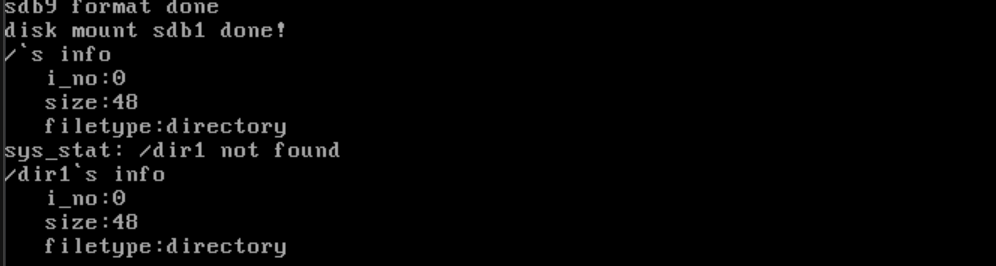

# 实现stat

## 让我们看看stat是干啥的

​	stat用来得到文件的类型、权限、属主、时间。说白了，就是stat告诉我们这个文件是一个啥，情况咋样，是谁的。

​	我偷个懒，直接放上来Deepseek的说法：

> `stat` 是 Linux 系统中一个用于显示文件或文件系统状态的命令。通过 `stat`，用户可以获取关于文件的详细信息，包括文件大小、权限、所有者、所属组、inode 号、硬链接数量、文件类型、访问时间、修改时间、状态改变时间等。这些信息对于系统管理员和开发者来说非常有用，可以帮助他们更好地管理和调试文件系统。
>
> `stat` 命令的基本语法是 `stat [选项] 文件名`。常用的选项包括 `-c` 用于自定义输出格式，`-f` 用于显示文件系统状态而不是文件状态，`-L` 用于跟随符号链接并显示目标文件的状态等。
>
> 例如，使用 `stat filename` 会显示该文件的详细信息，包括文件大小、块数、IO 块大小、文件类型、设备号、inode 号、硬链接数、权限、UID、GID、访问时间、修改时间和状态改变时间等。
>
> `stat` 命令的输出格式可以通过 `-c` 选项进行自定义，用户可以选择显示特定的字段，例如只显示文件大小或只显示修改时间等。这使得 `stat` 命令在脚本编程中非常灵活，可以根据需要提取特定的文件信息。
>
> 总的来说，`stat` 是一个功能强大且灵活的命令，能够提供关于文件和文件系统的详细信息，是 Linux 系统管理和开发中不可或缺的工具之一。

​	看完了，我们来做一下：

```c
typedef struct
{
   uint32_t st_ino;             // Inode number
   uint32_t st_size;            // File size
   enum file_types st_filetype; // File type
}Stat;
```

​	下面来实现这个系统调用

```c
/* Fills the buf with the file structure information. Returns 0 on success, -1
 * on failure */
int32_t sys_stat(const char *path, Stat *buf) {
    /* If directly querying the root directory '/' */
    if (!k_strcmp(path, "/") || !k_strcmp(path, "/.") || !k_strcmp(path, "/..")) {
        buf->st_filetype = FT_DIRECTORY;
        buf->st_ino = 0;
        buf->st_size = root_dir.inode->i_size;
        return 0;
    }

    int32_t ret = -1; // Default return value
    PathSearchRecordings searched_record;
    k_memset(
        &searched_record, 0,
        sizeof(PathSearchRecordings)); // Initialize or clear, otherwise
                                            // the stack information is unknown
    int inode_no = search_file(path, &searched_record);
    if (inode_no != -1) {
        Inode *obj_inode =
            inode_open(cur_part, inode_no); // Open only to get the file size
        buf->st_size = obj_inode->i_size;
        inode_close(obj_inode);
        buf->st_filetype = searched_record.file_type;
        buf->st_ino = inode_no;
        ret = 0;
    } else {
        ccos_printk("sys_stat: %s not found\n", path);
    }
    dir_close(searched_record.parent_dir);
    return ret;
}
```

​	`sys_stat` 系统调用，用于获取指定路径（`path`）的文件信息，并将其存储在 `Stat` 结构体 `buf` 中。首先检查传入的路径是否是根目录 (`/`)、当前目录 (`/.`) 或上级目录 (`/..`)。如果是根目录，则直接将文件类型设为目录 (`FT_DIRECTORY`)，inode 号设为 `0`（根目录的 inode 号），并将根目录的大小（`root_dir.inode->i_size`）写入 `buf->st_size`。如果路径不是根目录或特殊目录，则通过 `search_file` 函数查找路径。如果路径存在，返回路径对应的 inode 号，并将相关的文件信息存入 `Stat` 结构体，包括文件的大小 `obj_inode->i_size` 和文件类型 `searched_record.file_type`，以及 inode 号 `inode_no`。查找完成后，关闭 inode。如果路径不存在，则输出错误信息并返回 `-1`。最后，关闭查找过程中的父目录。

## 补充：切换文件夹

```c
/* Changes the current working directory to the absolute path specified by path.
   Returns 0 on success, -1 on failure */
int32_t sys_chdir(const char *path)
{
    int32_t ret = -1;
    PathSearchRecordings searched_record;
    k_memset(&searched_record, 0, sizeof(PathSearchRecordings));
    int inode_no = search_file(path, &searched_record);
    if (inode_no != -1)
    {
        if (searched_record.file_type == FT_DIRECTORY)
        {
            current_thread()->cwd_inode_nr = inode_no;
            ret = 0;
        }
        else
        {
            ccos_printk("sys_chdir: %s is regular file or other!\n", path);
        }
    }
    dir_close(searched_record.parent_dir);
    return ret;
}
```

`sys_chdir` 函数接受一个参数 `path`，即新工作目录的绝对路径，功能是将当前工作目录更改为 `path`，成功时返回 0，失败时返回 -1。任务的工作目录记录在 `pcb` 中的 `cwd_inode_nr`，因此更改工作目录的核心原理是修改 `cwd_inode_nr`。

在更改工作目录之前，函数需要确保新路径 `path` 在硬盘上存在。函数调用 `search_file` 搜索 `path`，如果未找到（即返回值 `inode_no` 为 -1），函数直接返回默认的返回值 `ret`，即 -1。

如果找到了 `path`，函数需要确认 `path` 是否为目录。如果 `path` 是普通文件，函数也会失败。函数通过判断 `searched_record.file_type` 是否为 `FT_DIRECTORY` 来确认 `path` 是否为目录。如果 `path` 是目录，函数将 `cwd_inode_nr` 更新为 `path` 的 inode 编号 `inode_no`，从而完成工作目录的更改，并将返回值 `ret` 置为 0。通过 `sys_chdir` 函数，系统能够高效地更改当前工作目录，并确保路径的有效性和一致性。

## 上电测试

```c
int main(void)
{
    init_all();
    Stat obj_stat;
    sys_stat("/", &obj_stat);
    printf("/`s info\n   i_no:%d\n   size:%d\n   filetype:%s\n",
           obj_stat.st_ino, obj_stat.st_size,
           obj_stat.st_filetype == 2 ? "directory" : "regular");
    sys_stat("/dir1", &obj_stat);
    printf("/dir1`s info\n   i_no:%d\n   size:%d\n   filetype:%s\n",
           obj_stat.st_ino, obj_stat.st_size,
           obj_stat.st_filetype == 2 ? "directory" : "regular");

    while (1)
        ;
    return 0;
}
```



## 下一篇

[准备迈向完全的内核——fork](../14_user_proc_utils/14.1_fork.md)
