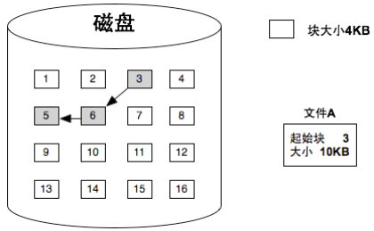
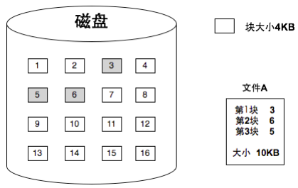
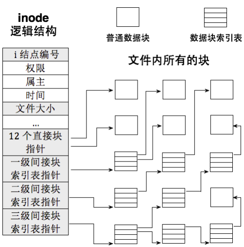
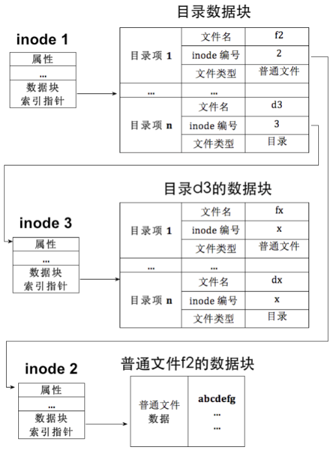
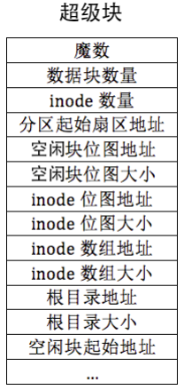
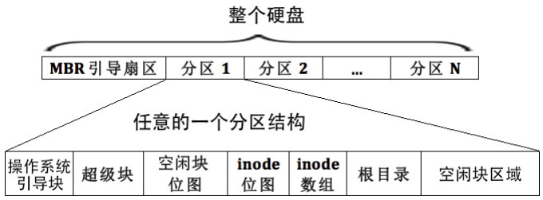
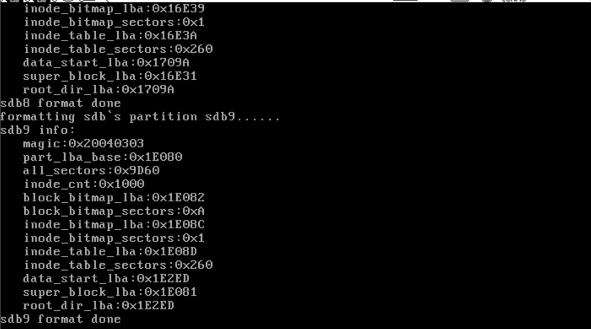
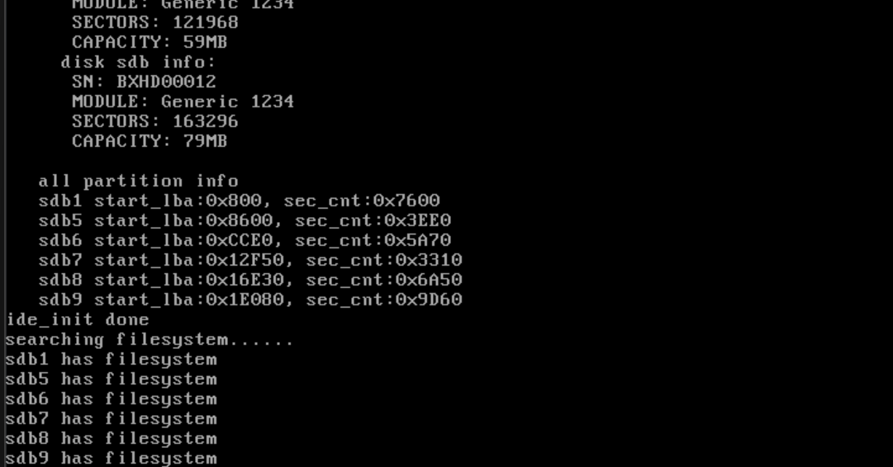

# 生成和检测文件系统

​	兄弟们，我们上一节把硬盘驱动正好了，这里准备生成和检测文件系统！

## 所以，文件系统的概念—— inode、间接块索引表、文件控制块 FCB 简介



​	**硬盘是低速设备，其读写单位是扇区。这个事情我相信任何一个上操作系统的朋友都知道的，不然我们不会满头大汗的学习为此而作妥协的API**。为了减少频繁访问硬盘，操作系统通常不会在每次有一扇区数据时就去读写硬盘，而是等到数据积累到一定量时才进行一次性访问，这个量就是块。块的大小是扇区大小的整数倍，因此块是由多个扇区组成的。以 Windows 系统为例，格式化分区时选择 FAT32 文件系统时，可以选择不同的簇大小，如 4KB 或 32KB 等，簇即为块。**在文件系统中，块是读写的基本单位，因此文件至少占用一个块，当文件大小超过一个块时，文件会被分割成多个块来存储。**



​	文件的块如何组织起来呢？在 FAT 文件系统中，**文件的块是通过链式结构组织的**。在这个系统中，每个文件的块都会存储下一个块的地址，这样文件的块可以分散存储在硬盘的不同位置，从而有效利用磁盘空间。然而，链式结构的一个缺点是每次访问文件中的某个块时，都需要从头开始遍历块节点。例如，如果要访问文件 A 的第 3 个块，首先需要访问第 1 个块，获得第 2 个块的地址，再访问第 2 个块获得第 3 个块的地址。这种遍历方式效率较低，而且每次访问块都会涉及一次硬盘寻道，使得低速的硬盘设备访问变得更加频繁。

​	为了提高效率，微软推出了 NTFS 文件系统。与 FAT 文件系统不同，UNIX 操作系统使用一种名为 inode 的索引结构来组织文件。采用索引结构的文件系统虽然文件中的块仍然可以分散存储，但每个文件都配备了一个索引表，这个索引表存储了文件所有块的地址。**通过索引表，访问文件的块变得更为高效，因为无需遍历链式结构，只需从索引表中获得块的地址即可。**这个算数据结构的知识，毕竟从索引查表`O(1)`远远比遍历链表`O(N)`来的好一些

​	UNIX 文件系统的 inode 是一种元信息结构，它包含了文件的所有块地址以及其他信息。每个文件都有一个对应的 inode，用于索引文件的块。每个 inode 包括文件的权限、属主、时间戳（如创建时间、修改时间、访问时间）、文件大小等信息。**此外，inode 还包含了指向文件各个数据块的指针。为了提高存储效率，inode 采用了多级间接索引的方式来管理文件的块。首先，inode 包含指向文件前 12 个块的直接指针，如果文件较大，超出 12 个块，则会使用一级间接索引表来存储其他块的地址。一级间接表中的每个项指向一个块地址，最多可以存储 256 个地址。如果文件超过 256 个块，还会使用二级间接索引表，二级间接表中的每个项指向一级间接表，以此类推，最多可以使用三级间接索引表。**

​	**inode 的优点是通过索引表可以快速定位到文件的块，避免了链式结构的低效。**然而，inode 结构也有缺点，当文件非常大时，索引表本身会占用一定的空间。尽管如此，inode 结构的设计可以有效提高大多数文件的访问效率，避免了频繁的硬盘寻道操作。特别注意的是——inode 的数量等于文件的数量，为方便管理，分区中所有文件的 inode 通过一个大表格来维护，此表格称为inode_table，在计算机中表格都可以用数组来表示，因此inode_table 本质上就inode 数组，数组元素 的下标便是文件 inode 的编号。 



### 碎碎念一下

​	我们现在的流行一些的文件系统有这些

> - **FAT32 (File Allocation Table 32)** 是FAT文件系统的升级版本，支持更大的磁盘容量和更大的文件。FAT32的最大优点是兼容性极佳，几乎所有的操作系统都支持它，因此常用于USB闪存驱动器和SD卡等便携式存储设备。然而，FAT32不支持文件权限和加密功能，且单个文件大小限制在4GB以内，这在处理大文件时显得不够灵活。一些嵌入式设备刷的FS就是类似这种
> - **NTFS (New Technology File System)** 是Windows NT系列操作系统的默认文件系统，支持大容量硬盘和大文件。NTFS具有许多高级功能，如文件权限、加密、压缩和日志功能，这些功能使其在安全性和可靠性方面表现出色。不过，NTFS在非Windows系统上的兼容性较差，虽然Linux和macOS可以读取NTFS，但写入支持有限，这在一定程度上限制了其跨平台使用。
> - **exFAT (Extended File Allocation Table)** 是FAT32的改进版本，专为大容量存储设备设计。exFAT支持更大的文件和分区，适合用于大容量USB驱动器和SD卡。与FAT32相比，exFAT在文件大小和分区大小上的限制大大放宽，但它仍然不支持文件权限和日志功能，兼容性也不如FAT32广泛。
> - **ext4 (Fourth Extended File System)** 是Linux系统中最常用的文件系统，是ext3的升级版。ext4支持大文件和大分区，具有日志功能，这大大提高了文件系统的可靠性和性能。ext4在Linux系统中表现出色，但在Windows和macOS上的支持有限，通常需要借助第三方软件才能访问。
> - **Btrfs (B-tree File System)** 是一个现代的文件系统，最初由Oracle开发，现已被多个Linux发行版采用。Btrfs设计用于解决传统文件系统的许多限制，并提供高级功能。它支持快照、数据完整性校验、动态卷管理、压缩和RAID功能，适合需要高级功能和灵活性的用户。然而，Btrfs在某些情况下可能不如ext4稳定，性能也可能不如ext4，且主要在Linux系统上使用，其他操作系统支持有限。这个文件系统也是笔者给我的跑Linux电脑刷的

## 目录

​	inode 记录了文件的大部分信息，地位上相当于文件本身。虽然 inode 中包含了文件的权限、属主、时间戳、文件大小以及指向数据块的指针等关键信息，但它没有包含文件名这一用户常用的属性。理论上，inode 中是可以存储文件名的，但如果这样做，会导致文件系统设计的复杂性增加，而且这也不是现代文件系统的做法。原因是，文件系统是通过 inode 来描述文件的，给定 inode，文件系统就能找到文件的数据块。因此，文件名对操作系统（文件系统）而言并不重要。

​	文件名是用户访问文件时最常用的信息，用户通过文件名来访问文件，但文件系统通过 inode 来管理文件。为了让用户能够方便地通过文件名访问文件，操作系统需要将文件名和 inode 关联起来。文件名的使用场景很多，比如作为可执行文件，或作为其他文件操作的参数等，所有这些都属于查找文件的范畴。无论文件位于什么路径，它总是存在于某个目录下（至少会有一个根目录“/”）。因此，文件名应该存储在与目录相关的地方，这就引出了目录这一概念。

​	在 Linux 中，**目录和文件都通过 inode 来表示，因此目录本身也是一种文件**，通常称之为目录文件，而普通文件则是指一般意义上的文件。在文件系统中，无论是普通文件还是目录文件，它们都有各自的 inode。虽然 inode 结构相同，但文件系统能够区分它们的类型。实际上，在磁盘上并没有专门的“目录”数据结构，只有 inode。这是因为 inode 只是描述文件实体的数据块，它并不关心该数据块具体记录的内容。

​	那么，文件系统是如何区分普通文件和目录文件的呢？答案就在于 inode 所指向的数据块内容。具体来说，如果 inode 表示的是普通文件，它所指向的数据块包含的是普通文件的数据。而如果 inode 表示的是目录文件，它所指向的数据块则包含该目录下的目录项。目录项记录了文件名及其对应的 inode，目录文件和普通文件的区分是通过其数据块的内容来实现的，而 inode 本身并不直接区分它们。

​	因此，虽然 inode 结构本身没有包含文件名和文件类型等信息，但文件系统通过 inode 所指向的数据块内容来判断文件的类型，并通过目录将文件名与 inode 关联起来，使得用户能够通过文件名访问文件。



###  超级块与文件系统布局

​	**超级块在文件系统中扮演着非常重要的角色。它存储了文件系统的元信息**，也可以被看作是文件系统的“配置文件”。这些元信息包括 inode 数组的位置和大小、inode 位图的位置和大小、根目录的位置和大小、空闲块位图的位置和大小等内容。通过这些信息，文件系统能够有效地管理文件及磁盘空间。

​	在文件系统中，每个文件都有一个 inode，所有的 inode 都存储在 inode 数组中。为了能定位到这些 inode 数组，我们需要知道 inode 数组的位置和大小，而这些信息就在超级块中。类似地，虽然根目录的地址在不同分区中可能不同，但它们的地址在该分区内是固定的，因此也需要在超级块中保存这些信息。

​	除此之外，文件系统还需要管理空闲块和 inode 的使用情况。为了实现这一点，文件系统通常使用位图来管理 inode 和空闲块的使用情况。inode 位图记录哪些 inode 是已分配的，哪些是空闲的，而空闲块位图则记录磁盘上哪些块是可用的，哪些已经被占用。咱们的超级快有这些东西：



​	这些信息可以帮助操作系统识别和管理不同分区上的文件系统。超级块通常存储在分区的第二个扇区，并且其大小通常为一个扇区。



在文件系统的布局中，超级块、空闲块位图、inode 位图、inode 数组和根目录都是非常重要的部分。具体来说，文件系统的布局一般如下：

1. **引导块**：存储操作系统引导程序的信息。
2. **超级块**：存储文件系统的元信息。
3. **空闲块位图**：记录哪些数据块是空闲的。
4. **inode 位图**：记录哪些 inode 是空闲的。
5. **inode 数组**：存储所有文件的 inode。
6. **根目录**：存储根目录下的目录项信息。
7. **空闲块区域**：存储文件的数据块。

这些结构按照顺序依次存储在分区的磁盘上，其中根目录和空闲块区域是真正用于存储文件数据的地方。其他结构的大小和位置则取决于分区的容量以及文件系统在创建时的设置。

这种文件系统布局是以 ext2 文件系统为参考设计的，虽然它比 ext2 更简单，但仍然保持了大部分的基本特性。

## 建立文件系统的初步抽象

#### 超级块

​	我们下面抽象超级块和inode

```c
#ifndef __FS_SUPER_BLOCK_H
#define __FS_SUPER_BLOCK_H
#include "include/library/types.h"

#define SUPER_BLOCK_MAGIC (0x20040303)

/* Superblock structure */
typedef struct __super_block{
   uint32_t magic;                // Identifier for the file system type, used by operating systems supporting multiple file systems to recognize the type
   uint32_t sec_cnt;              // Total number of sectors in this partition
   uint32_t inode_cnt;            // Number of inodes in this partition
   uint32_t part_lba_base;        // Starting LBA address of this partition

   uint32_t block_bitmap_lba;     // Starting sector address of the block bitmap
   uint32_t block_bitmap_sects;   // Number of sectors occupied by the block bitmap

   uint32_t inode_bitmap_lba;     // Starting LBA address of the inode bitmap
   uint32_t inode_bitmap_sects;   // Number of sectors occupied by the inode bitmap

   uint32_t inode_table_lba;      // Starting LBA address of the inode table
   uint32_t inode_table_sects;    // Number of sectors occupied by the inode table

   uint32_t data_start_lba;       // First sector number of the data area
   uint32_t root_inode_no;        // Inode number of the root directory
   uint32_t dir_entry_size;       // Size of a directory entry

   uint8_t  pad[460];             // Padding to make the structure 512 bytes (one sector) in size
} __attribute__ ((packed)) SuperBlock;

#endif
```

​	上面的代码是笔者对我们的`SuperBlock`做的抽象，表示文件系统的超级块，包含了文件系统的元信息，是文件系统管理的关键部分。

​	它的第一个成员 `magic` 是一个标识符，用来识别文件系统的类型。操作系统可以通过检查这个字段来判断该分区的文件系统类型，从而调用适当的文件系统驱动程序。`sec_cnt` 表示分区中总的扇区数量，指示了整个分区的大小，通常是分区的总字节数除以扇区大小。`inode_cnt` 表示该分区中可以使用的 inode 总数，inode 是存储文件元数据的结构，因此这个字段帮助文件系统知道该分区上的文件数限制。`part_lba_base` 是该分区的起始逻辑块地址，LBA 是一种访问磁盘的方式，指示了分区的开始位置。`block_bitmap_lba` 是块位图的起始扇区地址，块位图用于记录哪些数据块是空闲的，哪些已经被分配给文件。`block_bitmap_sects` 表示块位图占用的扇区数量，帮助文件系统管理块位图在磁盘上的大小。`inode_bitmap_lba` 是 inode 位图的起始扇区地址，inode 位图记录 inode 的分配情况，即哪些 inode 被分配，哪些是空闲的。`inode_bitmap_sects` 表示 inode 位图占用的扇区数量，告诉文件系统 inode 位图的大小。`inode_table_lba` 是 inode 表的起始扇区地址，inode 表存储所有文件的元数据。`inode_table_sects` 表示 inode 表占用的扇区数量，指示 inode 表在磁盘上占用的空间大小。`data_start_lba` 是数据区的第一个扇区地址，数据区存储实际的文件内容。`root_inode_no` 是根目录的 inode 编号，根目录是文件系统中的起点，包含其他文件和目录。`dir_entry_size` 是目录项的大小，目录项包含文件名和其对应的 inode 编号。最后，`pad[460]` 是填充字段，用来确保超级块结构体的大小为 512 字节，以符合磁盘扇区的对齐要求。这个结构体包含了文件系统的关键信息，对于文件系统的操作和管理至关重要。

#### Inode

```c
/* inode structure */
typedef struct {
   uint32_t i_no;    // inode number, uniquely identifies a file in the filesystem

   /* When the inode represents a file, i_size is the file size in bytes.
      When the inode represents a directory, i_size is the total size of all directory entries in the directory. */
   uint32_t i_size;

   uint32_t i_open_cnts;   // Keeps track of the number of times this file has been opened by processes or threads

   bool write_deny;        // A flag to prevent concurrent write operations to this file. If true, new write operations are denied until the current write completes

   /* i_sectors[0-11] are direct block pointers, i_sectors[12] is used for storing the pointer to the first indirect block */
   uint32_t i_sectors[13]; // Array of block pointers, with the first 11 being direct pointers to data blocks and the 12th being a pointer to an indirect block containing more block pointers

   list_elem inode_tag;    // A list element to manage the inode in a linked list, typically used for inode management in the filesystem
} Inode;
```

​	上面这个就是我们对Inode的抽象：这个 `Inode` 结构体表示文件系统中的 inode，用来存储文件的元数据，下面是结构体成员的详细说明。`i_no` 是 inode 的编号，用来唯一标识一个文件。每个文件在文件系统中都有一个对应的 inode 编号，可以通过 inode 编号来查找该文件的元数据。`i_size` 表示文件的大小。当 inode 表示的是一个文件时，`i_size` 表示文件的字节数；如果 inode 表示的是一个目录，则 `i_size` 表示该目录下所有目录项的大小总和。目录项是存储在目录中的文件或子目录的条目，每个目录项包含文件名和对应的 inode 编号。`i_open_cnts` 用来记录当前有多少个进程或线程打开了此文件。它是对文件打开次数的计数，文件系统可以根据这个计数来管理文件是否可以被修改或者是否已经被正确关闭。`write_deny` 是一个标识，用于控制文件的写操作是否可以并行执行。如果这个字段为 `true`，表示该文件正在被其他进程或线程写入，新的写操作会被拒绝，直到当前的写操作完成。这避免了写操作的并发冲突，确保数据的一致性。`i_sectors` 是一个包含 13 个元素的数组，指向文件的数据块。前 11 个元素（`i_sectors[0]` 到 `i_sectors[10]`）是直接块指针，直接块是指向文件数据的实际块。`i_sectors[12]` 是一个间接块指针，它指向一个包含指向数据块的指针的块。这个指针数组用于实现文件的数据块分配方式，支持较大的文件。通过这些指针，文件系统能够找到文件的数据区域。`inode_tag` 是一个列表元素，用来管理 inode 在文件系统中的链表。这个字段可能用于在某些数据结构（例如 inode 链表）中保存 inode，以便在内存中管理和访问。

#### 文件夹

```
#ifndef __FS_DIR_H
#define __FS_DIR_H
#include "include/device/ide.h"
#include "include/filesystem/filesystem.h"
#include "include/filesystem/inode.h"
#include "include/library/types.h"

#define MAX_FILE_NAME_LEN (16)     // Maximum length of a file name
#define DIRENT_LEN_BUFFER_SZ (512) // Directory entry buffer size

/* Directory structure */
typedef struct __dir{
    Inode *inode; // Pointer to the inode of the directory
    uint32_t dir_pos;    // Offset within the directory
    uint8_t dir_buf[DIRENT_LEN_BUFFER_SZ]; // Buffer to hold directory data
}Dir;

/* Directory entry structure */
typedef struct __dirEntry{
    char filename[MAX_FILE_NAME_LEN]; // Name of the file or directory
    uint32_t i_no;                    // Inode number of the file or directory
    enum file_types f_type; // File type (e.g., regular file, directory, etc.)
}DirEntry;

#endif
```

Dir结构体包含三个成员。首先，inode是一个指向Inode结构体的指针，Inode结构体保存了与目录相关的元数据，包含文件或目录的权限、大小、修改时间、文件类型等信息，inode通过唯一的编号标识文件或目录。其次，dir_pos是一个32位的无符号整型变量，用于表示目录中当前位置的偏移量，它帮助在读取或遍历目录条目时追踪当前的位置。最后，dir_buf是一个大小为512字节的缓冲区，用于存储目录读取的数据，当需要访问目录时，会将目录项信息存入该缓冲区，以便后续操作。

DirEntry结构体包含三个成员。首先，filename是一个字符数组，最大长度为16个字符，用于存储文件或目录的名称，在文件系统中，通过文件名来标识和访问文件或目录。其次，i_no是一个32位的无符号整型变量，表示文件或目录的inode编号，inode编号是文件系统中的唯一标识符，每个文件或目录都有一个唯一的inode编号，用于快速访问文件的元数据。最后，f_type是一个枚举类型的变量，表示文件的类型，它可以区分不同类型的文件，如普通文件、目录文件、符号链接文件等。

### 创建文件系统

​	我们先说`partition_format`的作用：对给定的磁盘分区进行格式化，具体来说，它初始化了分区的元数据并创建了文件系统。首先，函数假设每个块的大小等于一个扇区。然后计算分区格式化所需的扇区数量，包括引导扇区、超级块扇区、inode位图扇区、inode表扇区等，确保分区的元数据得到充分的初始化。

在初始化超级块时，函数设置了超级块的各种参数，如分区的总扇区数、inode的数量、块位图和inode位图的LBA位置、inode表的LBA位置等。这些信息对于后续的文件系统操作至关重要。超级块被写入分区的第二个扇区。

接下来，函数分配了一个缓冲区，大小足以容纳块位图、inode位图和inode表的内容，然后依次进行以下初始化操作：

1. **初始化块位图**：首先将根目录的第一个块标记为已使用，并将块位图中的空闲块设置为未使用，最后将修改后的块位图写入磁盘。
2. **初始化inode位图**：根目录使用第一个inode，将inode位图中的第一个位置标记为已使用，然后将其写入磁盘。
3. **初始化inode表**：根目录的inode初始化为第一个inode，设置大小、inode编号和数据块位置，并将其写入磁盘。
4. **初始化根目录数据**：根目录包含两个目录项：一个是当前目录“.”，一个是父目录“..”，它们的inode编号均为0（表示根目录）。这两个目录项被写入磁盘的根目录位置。

​	我们最后会打印一部分信息看看咋样，下面我们逐一开始编程

#### 第一个部分

```c
    /* For simplicity, assume that one block size equals one sector */
    uint32_t boot_sector_sects = 1;
    uint32_t super_block_sects = 1;
    uint32_t inode_bitmap_sects =
        ROUNDUP(MAX_FILES_PER_PART,
                BITS_PER_SECTOR); // Number of sectors for the inode bitmap.
                                  // Supports a maximum of 4096 files
    uint32_t inode_table_sects =
        ROUNDUP(((sizeof(Inode) * MAX_FILES_PER_PART)), SECTOR_SIZE);
    uint32_t used_sects = boot_sector_sects + super_block_sects +
                          inode_bitmap_sects + inode_table_sects;
    uint32_t free_sects = part->sec_cnt - used_sects;

    /************** Simple calculation for the number of sectors occupied by the
     * block bitmap ***************/
    uint32_t block_bitmap_sects;
    block_bitmap_sects = ROUNDUP(free_sects, BITS_PER_SECTOR);
    /* block_bitmap_bit_len is the length of the bitmap in bits, which also
     * represents the number of available blocks */
    uint32_t block_bitmap_bit_len = free_sects - block_bitmap_sects;
    block_bitmap_sects = ROUNDUP(block_bitmap_bit_len, BITS_PER_SECTOR);
    /*********************************************************/

    /* Initialize the superblock */
    SuperBlock sb;
    sb.magic = SUPER_BLOCK_MAGIC;
    sb.sec_cnt = part->sec_cnt;
    sb.inode_cnt = MAX_FILES_PER_PART;
    sb.part_lba_base = part->start_lba;

    sb.block_bitmap_lba =
        sb.part_lba_base +
        2; // Block 0 is the boot sector, block 1 is the superblock
    sb.block_bitmap_sects = block_bitmap_sects;

    sb.inode_bitmap_lba = sb.block_bitmap_lba + sb.block_bitmap_sects;
    sb.inode_bitmap_sects = inode_bitmap_sects;

    sb.inode_table_lba = sb.inode_bitmap_lba + sb.inode_bitmap_sects;
    sb.inode_table_sects = inode_table_sects;

    sb.data_start_lba = sb.inode_table_lba + sb.inode_table_sects;
    sb.root_inode_no = 0;
    sb.dir_entry_size = sizeof(DirEntry);

    printk("%s info:\n", part->name);
    printk("   magic:0x%x\n   part_lba_base:0x%x\n   all_sectors:0x%x\n   "
           "inode_cnt:0x%x\n   block_bitmap_lba:0x%x\n   "
           "block_bitmap_sectors:0x%x\n   inode_bitmap_lba:0x%x\n   "
           "inode_bitmap_sectors:0x%x\n   inode_table_lba:0x%x\n   "
           "inode_table_sectors:0x%x\n   data_start_lba:0x%x\n",
           sb.magic, sb.part_lba_base, sb.sec_cnt, sb.inode_cnt,
           sb.block_bitmap_lba, sb.block_bitmap_sects, sb.inode_bitmap_lba,
           sb.inode_bitmap_sects, sb.inode_table_lba, sb.inode_table_sects,
           sb.data_start_lba);
```

创建文件系统的过程包括确定元信息并将其写入磁盘。首先，需要根据分区大小计算各个元信息的位置和大小，这包括超级块、空闲块位图、inode 位图、inode 数组、空闲块的数量以及根目录的位置。超级块和引导块占用的扇区数在代码中简单赋值为1扇区。inode 位图的大小通过计算最大文件数和每扇区位数来确定，而inode 数组的大小则根据inode的数量和大小决定。接下来，计算空闲块的数量并从总扇区数中减去已使用的扇区数来得出。空闲块位图的大小根据空闲块数量计算，并最终确定其占用的扇区数。

在内存中创建超级块时，将上述计算出的元信息写入超级块，并将其保存。超级块会在磁盘上进行存储，接着其他元信息（如inode 位图和空闲块位图）也会被写入磁盘。根目录的inode编号设置为0，指向inode数组中的第一个inode。最后，目录项尺寸被赋值，超级块中的元信息会被打印以供调试使用。

```c
    /**************************************
     * 2. Initialize the block bitmap and write it to sb.block_bitmap_lba *
     *************************************/
    /* Initialize the block bitmap */
    buf[0] |= 0x01; // Reserve the first block for the root directory, mark it
                    // in the bitmap
    uint32_t block_bitmap_last_byte = block_bitmap_bit_len / 8;
    uint8_t block_bitmap_last_bit = block_bitmap_bit_len % 8;
    uint32_t last_size =
        SECTOR_SIZE - (block_bitmap_last_byte %
                       SECTOR_SIZE); // last_size is the remaining part in the
                                     // last sector of the bitmap

    /* 1. Set all the bits from the last byte in the bitmap to 1, marking them
     * as occupied */
    k_memset(&buf[block_bitmap_last_byte], 0xff, last_size);

    /* 2. Reset the valid bits in the last byte */
    uint8_t bit_idx = 0;
    while (bit_idx <= block_bitmap_last_bit)
    {
        buf[block_bitmap_last_byte] &= ~(1 << bit_idx++);
    }
    ide_write(hd, sb.block_bitmap_lba, buf, sb.block_bitmap_sects);
```

在文件系统创建过程中，首先需要获取分区所属的硬盘，以便后续操作。在第59行，超级块被写入到本分区开始的扇区加1的位置，跳过引导扇区，将超级块存储在引导扇区之后。由于超级块占用的空间较小，通常可以使用局部变量。但其他较大的元信息，如空闲块位图和inode数组位图，占用的空间较大，因此需要在堆中申请内存来存储这些数据。通过选择占用空间最大的元信息作为内存缓冲区的大小，申请足够的内存来存储这些位图数据。

接着，创建空闲块位图时，需要将第0个空闲块标记为根目录，并将块位图最后一个扇区中不属于空闲块的位设置为1。这样做是为了避免在挂载分区时，空闲块位图中包含不必要的无效位，这些无效位会指向硬盘上其他非位图资源的数据，可能会导致错误。

持久化操作是在内存中准备好位图后，将位图数据写入硬盘，确保文件系统可以在挂载时加载正确的位图。通过这种方式，确保位图的多余位不会被误用，从而避免在资源管理时发生错误。在最后，位图被写入到指定的硬盘位置以完成文件系统创建过程。

```c
    /***************************************
     * 3. Initialize the inode bitmap and write it to sb.inode_bitmap_lba *
     ***************************************/
    /* Clear the buffer */
    k_memset(buf, 0, buf_size);
    buf[0] |= 0x1; // Reserve the first inode for the root directory
    /* Since there are 4096 inodes in the inode table, the inode bitmap fits
     * exactly into one sector */
    ide_write(hd, sb.inode_bitmap_lba, buf, sb.inode_bitmap_sects);

    /***************************************
     * 4. Initialize the inode array and write it to sb.inode_table_lba *
     ***************************************/
    /* Prepare the first inode in the inode table, which corresponds to the root
     * directory */
    k_memset(buf, 0, buf_size); // Clear the buffer
    Inode *i = (Inode *)buf;
    i->i_size = sb.dir_entry_size * 2; // For "." and ".."
    i->i_no = 0;                       // The root directory occupies the first inode
    i->i_sectors[0] =
        sb.data_start_lba; // Initialize the first sector for the root directory
    ide_write(hd, sb.inode_table_lba, buf, sb.inode_table_sects);

    /***************************************
     * 5. Initialize the root directory and write it to sb.data_start_lba *
     ***************************************/
    /* Write the two directory entries for "." and ".." */
    k_memset(buf, 0, buf_size);
    DirEntry *p_de = (DirEntry *)buf;

    /* Initialize the current directory entry "." */
    k_memcpy(p_de->filename, ".", 1);
    p_de->i_no = 0;
    p_de->f_type = FT_DIRECTORY;
    p_de++;

    /* Initialize the parent directory entry ".." */
    k_memcpy(p_de->filename, "..", 2);
    p_de->i_no = 0; // The parent directory of the root is still the root itself
    p_de->f_type = FT_DIRECTORY;

    /* Write the root directory data */
    ide_write(hd, sb.data_start_lba, buf, 1);

    printk("   root_dir_lba:0x%x\n", sb.data_start_lba);
    printk("%s format done\n", part->name);
    sys_free(buf);
```

创建文件系统的流程包括扫描硬盘和分区，并检查是否已存在文件系统。如果没有文件系统，则会进行格式化。首先，系统通过三层循环遍历各个硬盘和分区。每个硬盘最多支持12个分区，其中包括4个主分区和8个逻辑分区。在遍历分区时，首先会检查分区是否存在，判断依据是分区的`sec_cnt`（扇区数），若为0表示分区不存在。

当找到有效分区时，系统读取该分区的超级块，检查其中的魔数。如果魔数为0x20040303，表示该分区已格式化并有文件系统存在，不会进行格式化。若魔数不匹配，则会对该分区执行格式化操作，创建新的文件系统。

## 最后封装，初始化

```c
/* Searches for the file system on the disk. If none is found, it formats the
 * partition and creates the file system */
void filesystem_init()
{
    uint8_t channel_no = 0, dev_no, part_idx = 0;

    /* sb_buf is used to store the super block read from the hard disk */
    SuperBlock *sb_buf = (SuperBlock *)sys_malloc(SECTOR_SIZE);

    if (!sb_buf)
    {
        KERNEL_PANIC_SPIN("alloc memory failed!");
    }
    verbose_printk("searching filesystem......\n");
    while (channel_no < channel_cnt)
    {
        dev_no = 0;
        while (dev_no < 2)
        {
            if (dev_no == 0)
            { // Skip raw disk hd60M.img
                dev_no++;
                continue;
            }
            Disk *hd = &channels[channel_no].devices[dev_no];
            DiskPartition *part = hd->prim_parts;
            while (part_idx < 12)
            { // 4 primary partitions + 8 logical partitions
                if (part_idx == 4)
                { // Start processing logical partitions
                    part = hd->logic_parts;
                }

                /* The channels array is a global variable, with a default value
                   of 0. Disk is a nested structure, and partition is a nested
                   structure within disk. Therefore, members in partition are
                   also defaulted to 0. We now process existing partitions. */
                if (part->sec_cnt != 0)
                { // If the partition exists
                    k_memset(sb_buf, 0, SECTOR_SIZE);

                    /* Read the super block of the partition to check if the
                     * magic number is correct and determine if the file system
                     * exists */
                    ide_read(hd, part->start_lba + 1, sb_buf, 1);

                    /* Only support our own file system. If the disk already has
                     * a file system, don't format it */
                    if (sb_buf->magic == SUPER_BLOCK_MAGIC)
                    {
                        verbose_printk("%s has filesystem\n", part->name);
                    }
                    else
                    { // Unsupported file systems are treated as having
                      // no file system
                        verbose_printk("formatting %s`s partition %s......\n", hd->name,
                               part->name);
                        partition_format(part);
                    }
                }
                part_idx++;
                part++; // Next partition
            }
            dev_no++; // Next disk
        }
        channel_no++; // Next channel
    }
    sys_free(sb_buf);
}
```

​	这个函数初始化文件系统。首先，它定义了几个变量：`channel_no` 用来遍历硬盘通道，`dev_no` 用来遍历每个通道下的磁盘设备，`part_idx` 用来遍历分区。在函数的开始，定义了一个指向 `SuperBlock` 结构体的指针 `sb_buf`，用于存储从硬盘读取的超级块。通过 `sys_malloc()` 动态分配了一块内存，并判断分配是否成功。如果内存分配失败，程序会触发内核崩溃，停止执行。

接下来，函数会进入一个嵌套循环，首先遍历所有硬盘通道，然后遍历每个通道下的磁盘设备。对于每个设备，如果是第一个设备（即 `dev_no == 0`），会跳过它（这部分代码用于跳过一个特定的硬盘文件 `hd60M.img`）。对于其他磁盘设备，会遍历其分区，分为主分区和逻辑分区两部分。在遍历过程中，首先判断当前分区是否存在（通过检查 `part->sec_cnt` 是否为零）。

如果分区存在，首先清空 `sb_buf`，然后通过 `ide_read()` 函数从硬盘中读取该分区的超级块数据。接着，检查超级块中的魔数是否正确，以确定文件系统是否已经存在。如果魔数匹配，表示该分区已经有文件系统，函数会输出提示信息；如果魔数不匹配，表示该分区没有有效的文件系统，程序会调用 `partition_format()` 函数对该分区进行格式化。遍历完成后，函数会释放之前分配的内存。整个过程的目的是检查每个分区是否存在文件系统，如果没有则格式化该分区并创建文件系统。

## 上电看看效果

​	第一次创建：



​	再次打开：



##  下一篇

[挂载文件系统](./13.2_mount_filesystem.md)