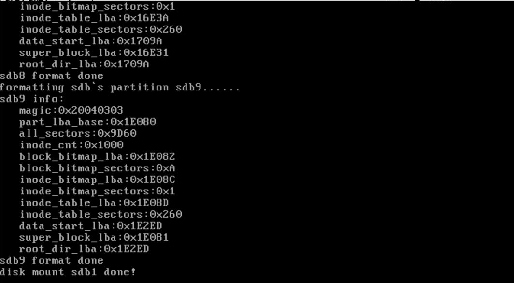
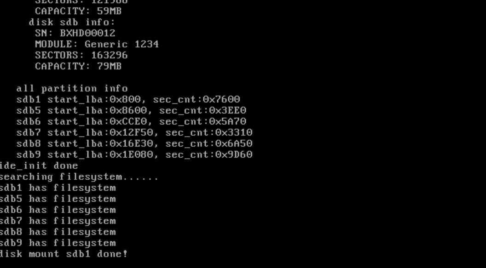

# 挂载我们的文件系统

​	文件系统的挂载和卸载在Linux中是非常重要的功能，它允许用户将一个分区的文件系统与另一个分区的目录树连接起来。通常情况下，Linux会将根分区作为默认分区，并通过`mount`命令将其他分区挂载到默认分区的某个目录上。在这个过程里，分区的根目录是固定存在的，其他分区尽管有自己的根目录，但它们的根目录并不直接与整个系统的文件结构挂钩。通过`mount`命令，其他分区可以在需要时被挂载到指定的目录下，而默认分区的根目录则作为所有分区的父目录，挂载后形成一个统一的路径树结构。

​	对于挂载操作系统到裸盘的情况，并没有现成的分区和文件系统。这时，为了实现文件操作，首先必须在裸盘上创建文件系统，至少要实现基本的文件写入功能。然后，操作系统可以通过文件系统进行安装。例如，在Windows或Linux系统安装过程中，首先会选择目标分区，格式化并安装操作系统到文件系统中。对于学习操作系统实现的场景，虽然也可以模仿这一过程，但为了简化操作，一开始可以避免复杂的分区挂载过程。

​	实现分区挂载的本质是通过读取硬盘上的元信息并将其加载到内存中，这样，所有硬盘资源的使用情况都能通过内存中的元信息进行管理。当执行写操作时，内存中的数据需要及时同步到硬盘，确保数据的一致性和持久性

## 代码实现

```c
/* Finds the partition named 'part_name' in the partition list and assigns its 
 * pointer to 'cur_part' */
static bool mount_partition(list_elem *pelem, int arg) {
    // Convert the argument to a partition name string
    char *part_name = (char *)arg;
    
    // Retrieve the DiskPartition structure from the list element
    DiskPartition *part = elem2entry(DiskPartition, part_tag, pelem);

    // If the partition name matches, mount this partition
    if (!k_strcmp(part->name, part_name)) {
        cur_part = part; // Set the current partition to the found partition
        Disk *hd = cur_part->my_disk; // Get the disk that contains this partition

        // Allocate a buffer to temporarily store the superblock read from disk
        SuperBlock *sb_buf = (SuperBlock *)sys_malloc(SECTOR_SIZE);

        // Allocate memory for the superblock of the current partition
        cur_part->sb = (SuperBlock *)sys_malloc(sizeof(SuperBlock));
        if (!cur_part->sb) {
            KERNEL_PANIC_SPIN("alloc memory failed!"); // Kernel panic if allocation fails
        }

        // Read the superblock from disk into the buffer
        k_memset(sb_buf, 0, SECTOR_SIZE);
        ide_read(hd, cur_part->start_lba + 1, sb_buf, 1);

        // Copy the superblock information from the buffer to the partition's superblock
        k_memcpy(cur_part->sb, sb_buf, sizeof(SuperBlock));

        /********** Load the block bitmap from disk into memory **********/
        // Allocate memory for the block bitmap
        cur_part->block_bitmap.bits = (uint8_t *)sys_malloc(sb_buf->block_bitmap_sects * SECTOR_SIZE);
        if (!(cur_part->block_bitmap.bits)) {
            KERNEL_PANIC_SPIN("alloc memory failed!"); // Kernel panic if allocation fails
        }
        // Set the length of the block bitmap in bytes
        cur_part->block_bitmap.btmp_bytes_len = sb_buf->block_bitmap_sects * SECTOR_SIZE;
        
        // Read the block bitmap from disk into memory
        ide_read(hd, sb_buf->block_bitmap_lba, cur_part->block_bitmap.bits, sb_buf->block_bitmap_sects);
        /****************************************************************/

        /********** Load the inode bitmap from disk into memory **********/
        // Allocate memory for the inode bitmap
        cur_part->inode_bitmap.bits = (uint8_t *)sys_malloc(sb_buf->inode_bitmap_sects * SECTOR_SIZE);
        if (!(cur_part->inode_bitmap.bits)) {
            KERNEL_PANIC_SPIN("alloc memory failed!"); // Kernel panic if allocation fails
        }
        // Set the length of the inode bitmap in bytes
        cur_part->inode_bitmap.btmp_bytes_len = sb_buf->inode_bitmap_sects * SECTOR_SIZE;
        
        // Read the inode bitmap from disk into memory
        ide_read(hd, sb_buf->inode_bitmap_lba, cur_part->inode_bitmap.bits, sb_buf->inode_bitmap_sects);
        /****************************************************************/

        // Initialize the list of open inodes in this partition
        list_init(&cur_part->open_inodes);
        
        verbose_printk("disk mount %s done!\n", part->name); // Print a message indicating successful mounting

        // Return true to stop further traversal, as the partition has been found and mounted
        return true;
    }
    return false; // Continue traversing the list if the partition was not found
}

```

该函数 `mount_partition()` 的作用是根据传入的分区名称，在分区列表中查找对应的分区并挂载它。首先，将传入的参数 `arg` 强制转换为字符串类型的 `part_name`，它表示要查找的分区名称。

函数从传入的 `list_elem` 元素中提取出对应的 `DiskPartition` 结构体，并与目标分区名称进行比较。如果当前分区的名称与传入的分区名称匹配，程序将挂载该分区。

在挂载过程中，首先将当前分区的指针赋值给全局变量 `cur_part`，表示当前正在挂载的分区。然后，获取该分区所在磁盘的指针 `hd`。接下来，函数分配内存以存储从磁盘读取的超级块数据。超级块包含了文件系统的基本信息，包括磁盘的使用情况等。

函数通过 `ide_read()` 从磁盘中读取超级块的数据，并将其复制到当前分区的超级块结构中。之后，函数继续加载区块位图和 inode 位图，这两个位图分别表示磁盘上哪些区块和 inode 被使用。它通过类似的方式，读取位图数据并将其存储到内存中。如果在分配内存或读取数据时发生错误，程序将触发内核崩溃。

最后，函数初始化当前分区的打开 inode 列表，并打印出挂载成功的消息。函数返回 `true`，表示分区已找到并成功挂载，后续的遍历可以停止。如果未找到指定的分区，函数返回 `false`，表示需要继续查找下一个分区。

### 添加到初始化上

```
...
    /* Determine the default partition for operations */
    char default_part[8] = "sdb1";
    /* Mount the partition */
    list_traversal(&partition_list, mount_partition, (int)default_part);
```

## 上电看现象





