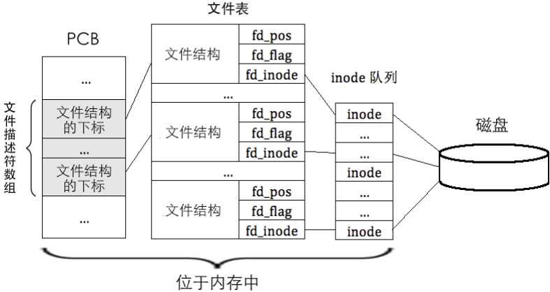
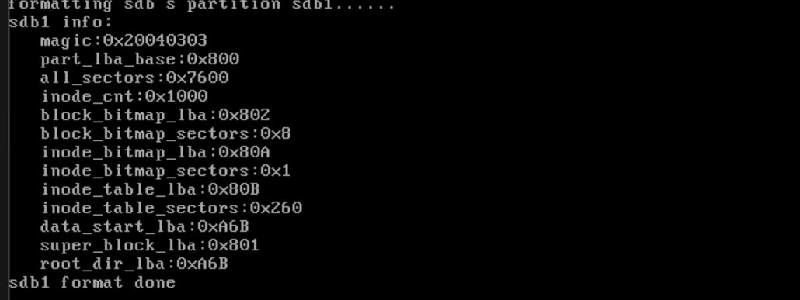

# 说说文件描述符与常见的操作和文件基本操作

> ⚠：从本章开始代码存在问题，但是我没有找到，所以谨慎参考！之后中，所有涉及到文件系统读取的功能都被收到了影响！请注意！！！

​	**在 Linux 系统中，文件操作都是基于文件描述符的。**搞操作系统的朋友肯定知道——无论是哪一个操作系统，最后都会拿一个轻量化的handle来替代文件本身。Handle的思想在Windows还是很常见的，这里我们的文件系统中file descriptor也是一样的。

​	文件描述符用于描述与文件操作相关的对象，它本质上是一个整数，标识进程操作文件时所用的资源。虽然文件本身由 inode 描述，**但 inode 主要用于存储文件的相关信息（如存储位置和权限），与文件操作并不直接相关。文件描述符与 inode 的主要区别在于，文件描述符更关注文件的操作过程，而 inode 主要关心文件的存储和元数据。**

​	在 Linux 中，打开文件的过程不仅涉及找到文件的 inode 位置，还需要为文件创建一个文件结构（file structure）。每当文件被打开时，系统会为文件创建一个文件结构，该结构记录了文件的操作偏移量等信息。即便是同一个文件被多个进程同时打开，每个进程也会有独立的文件结构，它们之间的偏移量互不影响。文件结构存储在一个称为文件表（file table）的数组中。文件表是全局管理的，而每个进程都有一个独立的文件描述符数组，该数组指向文件表中的文件结构。

当通过 `open` 函数打开文件时，系统返回一个文件描述符，这个文件描述符其实是该进程文件描述符数组中的一个下标。该下标并不表示文件的数量，而是指向文件表中的文件结构。每个文件描述符数组和文件表都由操作系统为每个进程单独维护。文件描述符数组包含了标准的文件描述符，如 0 代表标准输入，1 代表标准输出，2 代表标准错误输出。

文件描述符与文件操作的关系比较直观。操作系统通过文件描述符查找文件数据块的过程涉及多个数据结构，包括进程控制块（PCB）中的文件描述符数组、文件表和 inode 队列。通过文件描述符，操作系统可以定位到文件表中的对应文件结构，再从文件结构中获取文件的 inode，最终找到文件的数据块。




​	我们下面给进程塞上文件描述符表先：

```c
/**
 * @brief Process Control Block (PCB) structure for threads and processes.
 *
 * This structure stores the execution context, scheduling information,
 * and resources associated with a thread or process.
 */
typedef struct {
    uint32_t *self_kstack;         // Pointer to the kernel stack of the thread
    pid_t pid;                     // Process ID
    TaskStatus status;             // Current status of the thread
    char name[TASK_NAME_ARRAY_SZ]; // Name of the thread
    uint8_t priority;              // Thread priority level
    uint8_t ticks;                 // Time slices allocated per execution cycle
    uint32_t elapsed_ticks;        // Total CPU time consumed

    /**
     * @brief General list element for scheduling queues.
     *
     * Used to manage the thread in general scheduling queues.
     */
    list_elem general_tag;

    /**
     * @brief List element for all threads.
     *
     * Used to track all threads in the system.
     */
    list_elem all_list_tag;

    uint32_t *pg_dir; // Virtual address of process page directory
    VirtualMemoryHandle userprog_vaddr; // User process virtual memory space
    MemoryBlockDescriptor
        u_block_desc[DESC_CNT]; // User process memory block descriptors
    int32_t
        fd_table[MAX_FILES_OPEN_PER_PROC]; // File descriptors of opened files
    uint32_t stack_magic;  // Stack boundary marker for overflow detection
} TaskStruct;
```

​	我们还需要完成初始化：

```c
static void init_fd_table(TaskStruct *pthread){
    for(uint8_t i = 0; i < 3; i++){
        pthread->fd_table[i] = i;
    }
    uint8_t fd_idx = 3;
    while (fd_idx < MAX_FILES_OPEN_PER_PROC) { 
        pthread->fd_table[fd_idx] = -1;
        fd_idx++;
    }
}

/* Initialize basic thread information */
void init_thread(TaskStruct *pthread, char *name, int prio) {
    k_memset(pthread, 0, sizeof(*pthread));
    pthread->pid = allocate_pid(); // Assign a new pid
    k_strcpy(pthread->name, name);

    if (pthread == main_thread) {
        /* Main thread is set to TASK_RUNNING since it's always running */
        pthread->status = TASK_RUNNING;
    } else {
        pthread->status = TASK_READY;
    }

    /* Initialize the thread's kernel stack */
    pthread->self_kstack = (uint32_t *)((uint32_t)pthread + PG_SIZE);
    pthread->priority = prio;
    pthread->ticks = prio; // Set the number of ticks based on priority
    pthread->elapsed_ticks = 0;
    pthread->pg_dir = NULL;

    init_fd_table(pthread);

    pthread->stack_magic =
        TASK_MAGIC; // Custom magic number for stack validation
}
```

## 对inode完成操作

​	我们先录inode 所在的扇区地址及在扇区内的偏移量，这个事情就在下面

```c
/* Structure to store the inode location */
typedef struct  {
   bool	 two_sec;	// Indicates if the inode spans two sectors
   uint32_t sec_lba;	// The sector number where the inode is located
   uint32_t off_size;	// The byte offset of the inode within the sector
}InodePosition;
```

`InodePosition` 结构体用于存储 inode 的位置。它包含了三个成员。`two_sec` 用来标记 inode 是否跨越了两个扇区。`sec_lba` 是该 inode 所在扇区的逻辑块地址，用于定位 inode 所在的磁盘扇区。`off_size` 表示 inode 在该扇区内的偏移量，确保能够准确找到 inode 的数据。这个结构体有助于文件系统定位 inode，并在磁盘上正确访问它。

```c
/* Locate the sector and offset where the inode is located */
static void inode_locate(DiskPartition* part, uint32_t inode_no, InodePosition* inode_pos) {
    /* The inode table is contiguous on the disk */
    KERNEL_ASSERT(inode_no < 4096);
    uint32_t inode_table_lba = part->sb->inode_table_lba;
 
    uint32_t inode_size = sizeof(Inode);
    uint32_t off_size = inode_no * inode_size;	    // The byte offset of inode_no within the inode table
    uint32_t off_sec  = off_size / 512;		    // The sector offset of inode_no within the inode table
    uint32_t off_size_in_sec = off_size % 512;	    // The start address of the inode within the sector
 
    /* Check if the inode spans across two sectors */
    uint32_t left_in_sec = 512 - off_size_in_sec;
    if (left_in_sec < inode_size ) {	// If the remaining space in the sector is insufficient to hold the inode, it spans two sectors
       inode_pos->two_sec = true;
    } else {				  // Otherwise, the inode fits within a single sector
       inode_pos->two_sec = false;
    }
    inode_pos->sec_lba = inode_table_lba + off_sec;
    inode_pos->off_size = off_size_in_sec;
 }
 
```

​	`inode_locate` 函数用于定位指定 inode 在硬盘上的位置，接受三个参数：分区 `part`、inode 编号 `inode_no` 以及用于记录 inode 位置的 `inode_pos`（类型为 `struct inode_position`）。函数的主要功能是计算 inode 所在的扇区地址和扇区内的偏移量，并将这些信息写入 `inode_pos` 中。首先通过分区超级块的 `inode_table_lba` 获取 inode 表的起始扇区地址，并存入变量 `inode_table_lba`。接着根据 inode 编号 `inode_no`，计算该 inode 在 inode 表中的扇区偏移量 `off_sec` 和扇区内的字节偏移量 `off_size_in_sec`，其中 `off_sec` 是相对于 `inode_table_lba` 的偏移量。

​	由于 inode 表是连续存储的，可能存在 inode 跨扇区的情况，通过计算当前扇区的剩余空间 `left_in_sec`（即扇区大小 512 减去 `off_size_in_sec`），判断 inode 是否跨越扇区。如果 `left_in_sec` 小于 inode 的大小，则将 `inode_pos->two_sec` 置为 `true`，表示 inode 跨扇区；否则置为 `false`。最后，inode 的绝对扇区地址 `inode_pos->sec_lba` 等于 `inode_table_lba` 加上 `off_sec`，而扇区内的字节偏移量 `inode_pos->off_size` 仍然为 `off_size_in_sec`。

```c
/* Synchronize the inode to the disk partition */
void inode_sync(DiskPartition* part, Inode* inode, void* io_buf) {	 // io_buf is the buffer for disk IO
    uint8_t inode_no = inode->i_no;
    InodePosition inode_pos;
    inode_locate(part, inode_no, &inode_pos);	       // The inode position is stored in inode_pos
    KERNEL_ASSERT(inode_pos.sec_lba <= (part->start_lba + part->sec_cnt));
    
    /* Members inode_tag and i_open_cnts in the inode are not needed on the disk,
     * They are used in memory for tracking list positions and shared processes */
    Inode pure_inode;
    k_memcpy(&pure_inode, inode, sizeof(Inode));
 
    /* These three members only exist in memory, we need to clear them before synchronizing the inode to disk */
    pure_inode.i_open_cnts = 0;
    pure_inode.write_deny = false;	 // Set to false to ensure it is writable when read from disk
    pure_inode.inode_tag.prev = pure_inode.inode_tag.next = NULL;
 
    char* inode_buf = (char*)io_buf;
    if (inode_pos.two_sec) {	    // If the inode spans two sectors, read and write two sectors
       ide_read(part->my_disk, inode_pos.sec_lba, inode_buf, 2);	// Read two sectors since the inode was written continuously during formatting
 
    /* Start writing the inode into the two sectors at the appropriate positions */
       k_memcpy((inode_buf + inode_pos.off_size), &pure_inode, sizeof(Inode));
    
    /* Write the modified data back to disk */
       ide_write(part->my_disk, inode_pos.sec_lba, inode_buf, 2);
    } else {			    // If it's just one sector
       ide_read(part->my_disk, inode_pos.sec_lba, inode_buf, 1);
       k_memcpy((inode_buf + inode_pos.off_size), &pure_inode, sizeof(Inode));
       ide_write(part->my_disk, inode_pos.sec_lba, inode_buf, 1);
    }
 }
```

​	`inode_sync` 函数用于将内存中的 inode 数据同步到硬盘，接受三个参数：分区 `part`、待同步的 inode 指针 `inode` 以及操作缓冲区 `io_buf`。函数的主要功能是将 inode 数据写入硬盘的指定位置。首先通过 `inode_locate` 函数获取 inode 的扇区地址和偏移量，信息保存在 `inode_pos` 中。接着，为了避免加载到内存时出现混乱，inode 中的三个成员 `i_open_cnts`、`write_deny` 和 `inode_tag` 仅用于内存中的操作统计，需要在写入硬盘前将其清空。为此，创建一个局部变量 `pure_inode`，将原 inode 的值拷贝到 `pure_inode` 中，并清空上述三个成员的值。如果 `inode_pos.two_sec` 为 `true`，表示 inode 跨扇区，此时需要连续读取两个扇区的数据到 `inode_buf`，将 `pure_inode` 拷贝到 `inode_buf` 的相应位置，然后将两个扇区的数据写入硬盘。如果 inode 未跨扇区，则只需读取一个扇区的数据到 `inode_buf`，将 `pure_inode` 拷贝到 `inode_buf` 的相应位置，然后将一个扇区的数据写入硬盘。整个过程确保了 inode 数据的正确同步和持久化，同时避免了内存中的临时状态信息对文件系统加载的干扰。

```c
/* Open the inode corresponding to the inode number */
Inode* inode_open(DiskPartition* part, uint32_t inode_no) {
    /* First, try to find the inode in the opened inode list for faster access */
    list_elem* elem = part->open_inodes.head.next;
    Inode* inode_found;
    while (elem != &part->open_inodes.tail) {
       inode_found = elem2entry(Inode, inode_tag, elem);
       if (inode_found->i_no == inode_no) {
      inode_found->i_open_cnts++;
      return inode_found;
       }
       elem = elem->next;
    }
 
    /* If the inode is not found in the opened list, read it from the disk and add it to the list */
    InodePosition inode_pos;
 
    /* The inode location information will be stored in inode_pos, including the sector address and byte offset */
    inode_locate(part, inode_no, &inode_pos);
 
    /* To ensure that the inode created by sys_malloc is shared by all tasks,
     * it needs to be placed in kernel space, so temporarily set cur_pbc->pg_dir to NULL */
    TaskStruct* cur = current_thread();
    uint32_t* cur_pagedir_bak = cur->pg_dir;
    cur->pg_dir = NULL;
    /* After these three lines of code, the following memory allocation will be in kernel space */
    inode_found = (Inode*)sys_malloc(sizeof(Inode));
    /* Restore pg_dir */
    cur->pg_dir = cur_pagedir_bak;
 
    char* inode_buf;
    if (inode_pos.two_sec) {	// Handle the case where the inode spans two sectors
       inode_buf = (char*)sys_malloc(1024);
 
    /* The inode table is written continuously by partition_format, so we can read it consecutively */
       ide_read(part->my_disk, inode_pos.sec_lba, inode_buf, 2);
    } else {	// Otherwise, the inode does not span sectors, so a single sector buffer is enough
       inode_buf = (char*)sys_malloc(512);
       ide_read(part->my_disk, inode_pos.sec_lba, inode_buf, 1);
    }
    k_memcpy(inode_found, inode_buf + inode_pos.off_size, sizeof(Inode));
 
    /* Since this inode is likely to be used soon, insert it at the head of the list for quick retrieval */
    list_push(&part->open_inodes, &inode_found->inode_tag);
    inode_found->i_open_cnts = 1;
 
    sys_free(inode_buf);
    return inode_found;
 }
 
 /* Close the inode or decrement its open count */
 void inode_close(Inode* inode) {
    /* If no processes are using the inode anymore, remove it from the list and free the memory */
    Interrupt_Status old_status = set_intr_status(INTR_OFF);
    if (--inode->i_open_cnts == 0) {
       list_remove(&inode->inode_tag);	  // Remove the inode from part->open_inodes
 
    /* The inode was allocated in kernel space via sys_malloc when opened,
       so free the inode's memory in kernel space */
       TaskStruct* cur = current_thread();
       uint32_t* cur_pagedir_bak = cur->pg_dir;
       cur->pg_dir = NULL;
       sys_free(inode);		         // Free the inode's memory
       cur->pg_dir = cur_pagedir_bak;
    }
    set_intr_status(old_status);
 }

 

```

`inode_open` 函数用于打开一个指定 inode 编号的 inode。首先，它在分区的打开 inode 列表中查找该 inode。如果在列表中找到了 inode，则增加其打开计数并返回该 inode。如果在列表中未找到该 inode，则通过调用 `inode_locate` 获取该 inode 的位置，然后从磁盘读取该 inode 数据。读取过程中，如果 inode 跨越了两个扇区，则分配一个 1024 字节的缓冲区，否则只需分配 512 字节。读取完 inode 后，将其复制到内存中，并将其添加到分区的打开 inode 列表中。最后，返回找到的 inode。

`inode_close` 函数用于关闭一个 inode。它首先减少 inode 的打开计数，如果打开计数为 0，则从打开 inode 列表中移除该 inode，并释放分配的内存。释放内存时，需要确保在内核空间中执行内存分配和释放操作。

```c
 /* Initialize a new inode */
 void inode_init(uint32_t inode_no, Inode* new_inode) {
    new_inode->i_no = inode_no;
    new_inode->i_size = 0;
    new_inode->i_open_cnts = 0;
    new_inode->write_deny = false;
 
    /* Initialize the block index array i_sectors */
    uint8_t sec_idx = 0;
    while (sec_idx < 13) {
       /* i_sectors[12] is the address of the first level indirect block */
       new_inode->i_sectors[sec_idx] = 0;
       sec_idx++;
    }
 }
```

`	inode_init` 函数用于初始化一个新的 inode，接受两个参数：inode 编号 `inode_no` 和待初始化的 inode 指针 `new_inode`。函数的主要功能是对 `new_inode` 进行初始化。我们将 `new_inode` 的 `i_no` 初始化为传入的 `inode_no`，表示该 inode 的编号。接着，将 `i_size`（文件大小）和 `i_open_cnt`（打开计数）初始化为 0，并将 `write_deny`（写禁止标志）初始化为 `false`，表示该 inode 当前未被写操作占用。接下来，函数初始化 `i_sectors` 数组。该数组共有 13 个元素，其中前 12 个元素用于存储直接块地址，第 13 个元素用于存储一级间接块索引表地址。尽管 `new_inode` 是通过 `sys_malloc` 分配的内存，而 `sys_malloc` 返回的内存内容默认已被置为 0，但为了代码的可读性和清晰性，这里仍然显式地将 `i_sectors` 数组的所有元素初始化为 0。

关于为何不在创建 inode 时提前分配扇区呢？主要原因有两个：

- 在创建 inode 时无法预知文件的实际大小，因此无法确定需要分配多少个扇区，提前分配可能会导致空间浪费。咱们省着点用哈哈。
- 文件创建后未必会立即写入数据，只有在真正需要写入数据时，根据实际数据量动态分配扇区，可以提高存储空间的利用效率。这种按需分配的策略既节省了空间，也提升了系统的整体性能。

## 文件相关的函数

```c
#define DEFAULT_SECS 1

/* File table */
File file_table[MAX_FILE_OPEN];

/* Retrieves an available slot in the global file table (file_table).
 * Returns the index of the slot if successful, or -1 if all slots are in use.
 */
int32_t get_free_slot_in_global(void)
{
    uint32_t fd_idx = 3; // Start from index 3, skipping stdin, stdout, stderr.
    while (fd_idx < MAX_FILE_OPEN)
    {
        if (file_table[fd_idx].fd_inode ==
            NULL)
        { // Check if the inode is NULL.
            break;
        }
        fd_idx++;
    }
    if (fd_idx == MAX_FILE_OPEN)
    { // All slots are in use.
        ccos_printk("exceed max open files\n");
        return -1;
    }
    return fd_idx;
}

/* Installs the global file descriptor index into the process or thread's local
 * file descriptor table (fd_table). Returns the local file descriptor index if
 * successful, or -1 if all local file descriptor slots are in use. */
int32_t pcb_fd_install(int32_t global_fd_idx)
{
    TaskStruct *cur = current_thread(); // Get the current running thread.
    uint8_t local_fd_idx =
        3; // Start from index 3, skipping stdin, stdout, stderr.
    while (local_fd_idx < MAX_FILES_OPEN_PER_PROC)
    {
        if (cur->fd_table[local_fd_idx] == -1)
        { // -1 means the slot is free.
            cur->fd_table[local_fd_idx] =
                global_fd_idx; // Install the global fd index.
            break;
        }
        local_fd_idx++;
    }
    if (local_fd_idx == MAX_FILES_OPEN_PER_PROC)
    { // All slots are in use.
        ccos_printk("exceed max open files_per_proc\n");
        return -1;
    }
    return local_fd_idx;
}

/* Allocates an inode and returns its inode number. */
int32_t inode_bitmap_alloc(DiskPartition *part)
{
    int32_t bit_idx =
        bitmap_scan(&part->inode_bitmap, 1); // Find an available bit.
    if (bit_idx == -1)
    {
        return -1;
    }
    bitmap_set(&part->inode_bitmap, bit_idx, 1); // Set the bit as used.
    return bit_idx;
}

/* Allocates a block and returns its block address. */
int32_t block_bitmap_alloc(DiskPartition *part)
{
    int32_t bit_idx =
        bitmap_scan(&part->block_bitmap, 1); // Find an available bit.
    if (bit_idx == -1)
    {
        return -1;
    }
    bitmap_set(&part->block_bitmap, bit_idx, 1); // Set the bit as used.
    /* Unlike inode_bitmap_alloc, this function returns the actual block
     * address, not the bitmap index. */
    return (part->sb->data_start_lba + bit_idx); // Calculate the block address.
}

/* Synchronizes the bitmap data of the given type (inode_bitmap or block_bitmap)
 * to the disk. The synchronization is performed by writing the relevant section
 * of the bitmap to the disk. */
void bitmap_sync(DiskPartition *part, uint32_t bit_idx, uint8_t btmp_type)
{
    uint32_t off_sec = bit_idx / 4096; // Offset of the sector in the bitmap.
    uint32_t off_size =
        off_sec * BLOCK_SIZE; // Offset in bytes within the bitmap.
    uint32_t sec_lba;         // Sector address to be written.
    uint8_t *
        bitmap_off; // Pointer to the specific part of the bitmap to be written.

    /* Synchronize inode_bitmap or block_bitmap based on the btmp_type argument.
     */
    switch (btmp_type)
    {
    case INODE_BITMAP:
        sec_lba = part->sb->inode_bitmap_lba + off_sec;
        bitmap_off = part->inode_bitmap.bits + off_size;
        break;

    case BLOCK_BITMAP:
        sec_lba = part->sb->block_bitmap_lba + off_sec;
        bitmap_off = part->block_bitmap.bits + off_size;
        break;
    }
    ide_write(part->my_disk, sec_lba, bitmap_off,
              1); // Write the bitmap data to disk.
}
```

`file_table` 是文件表，即文件结构数组，其长度为 `MAX_FILE_OPEN`，表示系统最多可以同时打开 `MAX_FILE_OPEN` 次文件。由于一个文件可以被多次打开，甚至占满整个 `file_table`，因此这里的单位是“次”而不是“个”。`get_free_slot_in_global` 函数的功能是从文件表 `file_table` 中获取一个空闲位。如果成功找到空闲位，则返回其下标；否则返回 -1。实现原理是遍历 `file_table`，找到 `fd_inode` 为 `null` 的数组元素，表示该位置为空闲，返回其下标即可。需要注意的是，`file_table` 的前 3 个成员预留给标准输入、标准输出和标准错误，后续操作中会用到它们。

`pcb_fd_install` 函数接受一个参数 `globa_fd_idx`，即 `file_table` 数组的下标。其功能是将 `globa_fd_idx` 安装到进程或线程自己的文件描述符数组 `fd_table` 中。如果成功，则返回 `fd_table` 中空位的下标；否则返回 -1。`fd_table` 位于进程控制块（PCB）中，前 3 个元素是标准文件描述符，分别表示标准输入、标准输出和标准错误，不能被占用。其余的元素在初始化线程时被置为 -1，表示可分配的文件描述符。函数的实现逻辑是遍历 `fd_table`，找到值为 -1 的元素并返回其下标。

`inode_bitmap_alloc` 函数接受一个参数 `part`，表示分区。其功能是分配一个 inode，并返回其 inode 号。实现原理是通过操作 inode 位图来分配空闲的 inode。`block_bitmap_alloc` 函数接受一个参数 `part`，表示分区。其功能是分配一个扇区，并返回其扇区地址。实现原理是通过操作块位图来分配空闲的扇区。

`bitmap_sync` 函数接受三个参数：分区 `part`、位索引 `bit_idx` 和位图类型 `btmp_type`。其功能是将内存中位图的第 `bit_idx` 位所在的 512 字节数据同步到硬盘。由于硬盘以扇区为单位进行读写，因此内存中的数据也需要以扇区为单位进行操作。函数首先计算第 `bit_idx` 位相对于位图的扇区偏移量 `off_sec`，然后计算字节偏移量 `off_size`，确定待同步数据在内存中的起始地址。文件系统中有两种位图：inode 位图和块位图。通过 `btmp_type` 判断需要同步的位图类型，并计算位图的扇区地址 `sec_lba` 和字节偏移量 `bitmap_off`，最后通过 `ide_write` 将位图数据写入硬盘。这些函数共同协作，确保文件系统中的文件操作能够高效、正确地执行，同时维护数据的一致性和完整性。

## 目录相关的函数

```c
// Root directory structure
Dir root_dir;

/**
 * Opens the root directory on the specified disk partition.
 * @param part The disk partition containing the root directory.
 */
void open_root_dir(DiskPartition *part) {
    root_dir.inode = inode_open(part, part->sb->root_inode_no);
    root_dir.dir_pos = 0;
}

/**
 * Opens a directory by its inode number on the specified partition.
 * @param part The disk partition.
 * @param inode_no The inode number of the directory.
 * @return A pointer to the opened directory structure.
 */
Dir *dir_open(DiskPartition *part, uint32_t inode_no) {
    Dir *pdir = (Dir *)sys_malloc(sizeof(Dir));
    pdir->inode = inode_open(part, inode_no);
    pdir->dir_pos = 0;
    return pdir;
}

/**
 * Searches for a directory entry with the specified name in the given
 * directory.
 * @param part The disk partition.
 * @param pdir The directory to search.
 * @param name The name of the target file or directory.
 * @param dir_e A pointer to store the found directory entry.
 * @return True if the directory entry is found, false otherwise.
 */
bool search_dir_entry(DiskPartition *part, Dir *pdir, const char *name,
                      DirEntry *dir_e) {
    uint32_t block_cnt =
        140; // Total of 12 direct blocks and 128 indirect blocks
    uint32_t *all_blocks = (uint32_t *)sys_malloc(48 + 512);
    if (!all_blocks ) {
        ccos_printk("search_dir_entry: sys_malloc for all_blocks failed");
        return false;
    }

    uint32_t block_idx = 0;
    while (block_idx < 12) {
        all_blocks[block_idx] = pdir->inode->i_sectors[block_idx];
        block_idx++;
    }

    if (pdir->inode->i_sectors[12] != 0) {
        ide_read(part->my_disk, pdir->inode->i_sectors[12], all_blocks + 12, 1);
    }

    uint8_t *buf = (uint8_t *)sys_malloc(SECTOR_SIZE);
    DirEntry *p_de = (DirEntry *)buf;
    uint32_t dir_entry_size = part->sb->dir_entry_size;
    uint32_t dir_entry_cnt = SECTOR_SIZE / dir_entry_size;

    while (block_idx < block_cnt) {
        if (all_blocks[block_idx] == 0) {
            block_idx++;
            continue;
        }

        ide_read(part->my_disk, all_blocks[block_idx], buf, 1);
        uint32_t dir_entry_idx = 0;

        while (dir_entry_idx < dir_entry_cnt) {
            if (!k_strcmp(p_de->filename, name)) {
                k_memcpy(dir_e, p_de, dir_entry_size);
                sys_free(buf);
                sys_free(all_blocks);
                return true;
            }
            dir_entry_idx++;
            p_de++;
        }
        block_idx++;
        p_de = (DirEntry *)buf;
        k_memset(buf, 0, SECTOR_SIZE);
    }
    sys_free(buf);
    sys_free(all_blocks);
    return false;
}
```

`root_dir`，它是分区的根目录。`open_root_dir` 函数接受一个参数 `part`，表示分区，功能是打开该分区的根目录。实现非常简单，首先调用 `inode_open` 函数打开根目录的 inode，然后将其赋值给 `root_dir` 的 inode 指针，并将 `root_dir` 的 `dir_pos` 置为 0，表示从目录的起始位置开始操作。

接下来是 `dir_open` 函数，它接受两个参数：分区 `part` 和 inode 编号 `inode_no`，功能是在分区 `part` 上打开 inode 编号为 `inode_no` 的目录，并返回目录指针。与 `open_root_dir` 类似，区别在于 `root_dir` 是提前定义好的全局变量，无需为其申请内存，而 `dir_open` 需要为其他目录单独申请内存。具体实现中，完成了内存申请，其余逻辑与 `open_root_dir` 一致。

`search_dir_entry` 函数是一个核心函数，功能较为复杂。它接受四个参数：分区 `part`、目录指针 `pdir`、文件名 `name` 和目录项指针 `dir_e`，功能是在分区 `part` 的目录 `pdir` 中查找名为 `name` 的文件或目录，如果找到则返回 `true` 并将目录项存入 `dir_e`，否则返回 `false`。函数开头定义了变量 `block_cnt`，表示 inode 的总块数，其值为 140（12 个直接块 + 128 个一级间接块）。接着，为这 140 个扇区地址申请内存，返回地址赋值给 `all_blocks`，方便后续统一检索目录 inode 的所有扇区地址。将目录 inode 的 `i_sectors` 中的前 12 个扇区地址录入到 `all_blocks` 中。如果存在一级间接块索引表（即 `i_sectors[12]` 不为 0），则从硬盘的扇区地址 `i_sectors[12]` 处读取 128 个间接块地址，并将其复制到 `all_blocks + 12` 的位置。至此，`all_blocks` 中存储了目录 `pdir` 的所有扇区地址。

为了避免目录项跨扇区的情况，写入目录项时确保每个目录项完整存储在一个扇区内。因此，为缓冲区 `buf` 申请的内存大小为 `SECTOR_SIZE`（即 1 扇区），并将其转换为 `struct dir_entry` 类型的指针 `p_de`，用于遍历缓冲区中的目录项。计算一扇区内容纳的目录项数，结果存入变量 `dir_entry_cnt`。

由于无法预知目录项存储在哪个扇区中，函数通过 `while` 循环在所有扇区中查找目标目录项。目录的所有扇区地址已存储在 `all_blocks` 中。如果扇区地址为 0，表示该扇区未分配，跳过并继续下一次循环。如果扇区地址不为 0，则从该扇区地址读取 1 扇区数据到 `buf`，并用 `p_de` 遍历该扇区内的所有目录项。比较 `p_de->filename` 是否与目标文件名 `name` 相等，如果相等，则表示找到目标文件，将目录项 `p_de` 复制到 `dir_e` 中，释放缓冲区和 `all_blocks`，并返回 `true`。如果未找到，则更新为下一个目录项继续查找。如果当前扇区未找到目标文件，则更新 `block_idx++`，读取下一个扇区并重复查找过程。如果遍历所有扇区后仍未找到目标文件，则释放 `buf` 和 `all_blocks`，并返回 `false`。

```c
/**
 * Closes a directory. Note that the root directory should never be closed.
 * @param dir The directory to close.
 */
void dir_close(Dir *dir) {
    if (dir == &root_dir) {
        return;
    }
    inode_close(dir->inode);
    sys_free(dir);
}

/**
 * Initializes a directory entry in memory.
 * @param filename The name of the file or directory.
 * @param inode_no The inode number.
 * @param file_type The type of the file (directory or regular file).
 * @param p_de A pointer to the directory entry to be initialized.
 */
void create_dir_entry(char *filename, uint32_t inode_no, uint8_t file_type,
                      DirEntry *p_de) {
    KERNEL_ASSERT(k_strlen(filename) <= MAX_FILE_NAME_LEN);
    k_memcpy(p_de->filename, filename, k_strlen(filename));
    p_de->i_no = inode_no;
    p_de->f_type = file_type;
}
```

`dir_close` 函数用于关闭一个目录。如果目录是根目录，则不执行任何操作。否则，关闭该目录的 inode 并释放目录结构的内存。

`create_dir_entry` 函数用于初始化一个目录项，设置文件名、inode 号和文件类型（目录或常规文件）。它检查文件名的长度，确保它不会超过最大文件名长度，并将文件名、inode 号和文件类型复制到目录项中。

```c
/**
 * Synchronizes a directory entry by writing it to disk.
 * @param parent_dir The parent directory.
 * @param p_de The directory entry to write.
 * @param io_buf A buffer used for I/O operations.
 * @return True if the operation succeeds, false otherwise.
 */
bool sync_dir_entry(Dir *parent_dir, DirEntry *p_de, void *io_buf) {
    Inode *dir_inode = parent_dir->inode;
    uint32_t dir_size[[maybe_unused]] = dir_inode->i_size;
    uint32_t dir_entry_size = cur_part->sb->dir_entry_size;

    KERNEL_ASSERT(dir_size % dir_entry_size == 0);

    uint32_t dir_entrys_per_sec = (512 / dir_entry_size);
    int32_t block_lba = -1;
    uint8_t block_idx = 0;
    uint32_t all_blocks[140] = {0};

    while (block_idx < 12) {
        all_blocks[block_idx] = dir_inode->i_sectors[block_idx];
        block_idx++;
    }

    DirEntry *dir_e = (DirEntry *)io_buf;
    int32_t block_bitmap_idx = -1;
    block_idx = 0;

    while (block_idx < 140) {
        block_bitmap_idx = -1;
        if (all_blocks[block_idx] == 0) {
            block_lba = block_bitmap_alloc(cur_part);
            if (block_lba == -1) {
                ccos_printk("alloc block bitmap for sync_dir_entry failed\n");
                return false;
            }
            block_bitmap_idx = block_lba - cur_part->sb->data_start_lba;
            KERNEL_ASSERT(block_bitmap_idx != -1);
            bitmap_sync(cur_part, block_bitmap_idx, BLOCK_BITMAP);

            if (block_idx < 12) {
                dir_inode->i_sectors[block_idx] = all_blocks[block_idx] =
                    block_lba;
            } else if (block_idx == 12) {
                dir_inode->i_sectors[12] = block_lba;
                block_lba = block_bitmap_alloc(cur_part);
                if (block_lba == -1) {
                    block_bitmap_idx =
                        dir_inode->i_sectors[12] - cur_part->sb->data_start_lba;
                    bitmap_set(&cur_part->block_bitmap, block_bitmap_idx, 0);
                    dir_inode->i_sectors[12] = 0;
                    ccos_printk("alloc block bitmap for sync_dir_entry failed\n");
                    return false;
                }

                block_bitmap_idx = block_lba - cur_part->sb->data_start_lba;
                KERNEL_ASSERT(block_bitmap_idx != -1);
                bitmap_sync(cur_part, block_bitmap_idx, BLOCK_BITMAP);
                all_blocks[12] = block_lba;
                ide_write(cur_part->my_disk, dir_inode->i_sectors[12],
                          all_blocks + 12, 1);
            } else {
                all_blocks[block_idx] = block_lba;
                ide_write(cur_part->my_disk, dir_inode->i_sectors[12],
                          all_blocks + 12, 1);
            }

            k_memset(io_buf, 0, 512);
            k_memcpy(io_buf, p_de, dir_entry_size);
            ide_write(cur_part->my_disk, all_blocks[block_idx], io_buf, 1);
            dir_inode->i_size += dir_entry_size;
            return true;
        }

        ide_read(cur_part->my_disk, all_blocks[block_idx], io_buf, 1);
        uint8_t dir_entry_idx = 0;

        while (dir_entry_idx < dir_entrys_per_sec) {
            if ((dir_e + dir_entry_idx)->f_type == FT_UNKNOWN) {
                k_memcpy(dir_e + dir_entry_idx, p_de, dir_entry_size);
                ide_write(cur_part->my_disk, all_blocks[block_idx], io_buf, 1);
                dir_inode->i_size += dir_entry_size;
                return true;
            }
            dir_entry_idx++;
        }
        block_idx++;
    }
    ccos_printk("directory is full!\n");
    return false;
}
```

`sync_dir_entry` 函数接受三个参数：父目录 `parent_dir`、目录项 `p_de` 和缓冲区 `io_buf`，功能是将目录项 `p_de` 写入父目录 `parent_dir` 中，其中 `io_buf` 由主调函数提供。当 inode 是目录时，其 `i_size` 表示目录中所有目录项的大小之和，父目录的大小为 `dir_inode->i_size`，将其赋值给变量 `dir_size`。目录项的大小记录在超级块中，获取超级块的大小并存入变量 `dir_entry_size`。计算一扇区可容纳的完整目录项数，结果写入变量 `dir_entrys_per_sec`，确保写入目录项时不会跨扇区。

将目录的 12 个直接块地址收集到数组 `all_blocks` 中，优先检查这 12 个扇区。使目录项指针 `dir_e` 指向缓冲区 `io_buf`，避免与参数 `p_de` 冲突。由于删除文件时会造成目录中存在空洞（文件系统碎片），因此在写入文件时需要逐个目录项查找空位，避免在目录末尾添加目录项而前面扇区被占用的情况。从头开始在这 12 个扇区中查找空闲目录项位置。虽然 `all_blocks` 中只收集了 12 个直接块地址，但仍需遍历 140 个扇区，因为如果在这 12 个扇区中找不到空位且文件大小未超过 140 个扇区，会为其分配新扇区以容纳目录项。

判断扇区是否已分配，若未分配，则通过 `block_bitmap_alloc` 函数分配一扇区，并将扇区地址写入变量 `block_lba`。由于 `block_bitmap_alloc` 仅操作内存中的块位图，为保持数据同步，需将块位图同步到硬盘。计算 `block_lba` 相对于 `data_start_lba` 的偏移，并调用 `bitmap_sync` 将块位图同步到硬盘。判断当前为空的块是直接块还是间接块，若块索引小于 12，则属于直接块，将分配的扇区地址写入 `i_sectors[block_idx]` 和 `all_blocks[block_idx]`。若正好是第 12 个块（一级间接块索引表地址为空），则创建间接块，将分配的扇区地址 `block_lba` 作为一级间接块索引表地址写入 `i_sectors[12]`，并重新分配一扇区作为第 0 个间接块。如果分配失败，则执行回滚操作；如果成功，则将块位图同步到硬盘，并将新分配的扇区地址更新到 `all_blocks[12]`，随后调用 `ide_write` 将间接块地址写入一级间接块索引表所在的扇区。

若 `block_idx` 超过 12，说明已遍历到间接块，将最初分配的扇区地址 `block_lba` 录入 `all_blocks`，并将间接块地址写入一级间接块索引表所在的扇区。最后将目录项写入扇区，并更新目录大小，使目录的 `i_size` 加上一个目录项大小 `dir_entry_size`。

处理块已存在且不需要分配块的情况时，在该扇区中寻找空闲的目录项。将该扇区读到 `io_buf` 中，通过 `while` 循环遍历 `dir_entrys_per_sec` 个目录项。若目录项的 `f_type` 为 `FT_UNKNOWN`，表示该目录项未分配，可以将目录项 `p_de` 写入 `io_buf`，并调用 `ide_write` 将目录项同步到硬盘，最后使目录的 `i_size` 加上一个目录项大小 `dir_entry_size`。如果所有扇区都满了，则输出“directory is full!”并以 `false` 返回。

## 路径解析

```c
/* Parse the top-level path name */
char *path_parse(char *pathname, char *name_store)
{
    if (pathname[0] == '/')
    { // No need to parse the root directory separately
        /* Skip consecutive '/' characters in the path, e.g., "///a/b" */
        while (*(++pathname) == '/')
            ;
    }

    /* Start general path parsing */
    while (*pathname != '/' && *pathname != 0)
    {
        *name_store++ = *pathname++;
    }

    if (pathname[0] == 0)
    { // If the path string is empty, return NULL
        return NULL;
    }
    return pathname;
}

/* Return the depth of the path, e.g., for /a/b/c, the depth is 3 */
int32_t path_depth_cnt(char *pathname)
{
    KERNEL_ASSERT(pathname);
    char *p = pathname;
    char name[MAX_FILE_NAME_LEN]; // Used as the parameter for path_parse to
                                  // parse the path
    uint32_t depth = 0;

    /* Parse the path and split it into individual names */
    p = path_parse(p, name);
    while (name[0])
    {
        depth++;
        k_memset(name, 0, MAX_FILE_NAME_LEN);
        if (p)
        { // If p is not NULL, continue analyzing the path
            p = path_parse(p, name);
        }
    }
    return depth;
}
```

​	啊哈，这两个函数呢，就是做路径解析的。

`path_parse` 函数接受两个参数：`pathname` 是字符串形式的路径及文件名，`name_store` 是主调函数提供的缓冲区，用于存储最上层路径名。函数的功能是将最上层路径名称解析出来并存储到 `name_store` 中，调用结束后返回除顶层路径之外的子路径字符串的地址。每次调用 `path_parse` 只会解析一层路径名，即最顶层的路径名。例如，解析路径 `/a/b/c` 时，第一次调用后 `name_store` 的值为 `a`，并返回子路径字符串 `/b/c` 的地址；第二次调用时，若传入 `/b/c`，则 `name_store` 的值为 `b`，并返回子路径 `/c` 的地址。

函数开头首先判断路径名的第 0 个字符是否为 `/`，即路径是否以根目录开头。路径中最左边的 `/` 表示根目录，根目录不需要单独解析，因为它已知且已被提前打开。此外，路径中的 `/` 仅表示路径分隔符，函数只关心路径分隔符之间的路径名，因此无论 `/` 表示根目录还是路径分隔符，都需要跳过路径中最左边的 `/`。

接下来，通过 `while` 循环去掉路径中连续重复的多个 `/`。虽然一般情况下路径中各层目录间只有一个 `/`，但在 Linux 中，路径分隔符可以是多个 `/`，例如 `//a/b///c` 是合法的路径。为了兼容这种情况，函数需要去掉路径中连续重复的 `/`。

然后，通过另一个 `while` 循环解析路径，将 `pathname` 中最顶层（最左边）的路径名存入 `name_store`。例如，若 `pathname` 经过处理后变为 `a/b`，则循环处理后 `name_store` 的值为 `a`。如果 `pathname` 已经结束（指向末尾的结束字符 `\0`），则返回 `NULL` 表示处理结束；否则，返回包含子路径的 `pathname`。

`path_depth_cnt` 函数接受一个参数 `pathname`，表示待分析的路径。函数的功能是返回路径的深度。例如，路径 `/a/b/c` 的深度为 3。由于 Linux 中路径分隔符可以是多个 `/`（如 `//a/b///c`），因此不能简单地根据 `/` 的数量统计目录深度。函数的实现主要是通过循环调用 `path_parse` 统计各级路径名，并通过变量 `depth` 累计路径层数。

## 实现文件检索

​	这里需要补充一下：

```c
#ifndef __FS_FS_H
#define __FS_FS_H
#include "include/library/types.h"
#include "include/device/ide.h"
#include "include/filesystem/filesystem_settings.h"

typedef struct __dir Dir;
typedef struct __dirEntry DirEntry;

/* File types */
enum file_types {
   FT_UNKNOWN,    // Unsupported file type
   FT_REGULAR,    // Regular file
   FT_DIRECTORY   // Directory
};

/* File open options */
enum oflags {
   O_RDONLY,      // Read-only
   O_WRONLY,      // Write-only
   O_RDWR,        // Read and write
   O_CREAT = 4    // Create
};

/* Structure to record the search path during file lookup */
struct path_search_record {
   char searched_path[MAX_PATH_LEN]; // Parent path during file lookup
   Dir* parent_dir;                  // Direct parent directory of the file or directory
   enum file_types file_type;        // File type found (regular file, directory, or unknown if not found)
};
#endif
```

​	我们的函数在下面

```c
/* Search for the file by pathname, return its inode number if found, otherwise
 * return -1 */
static int search_file(const char *pathname,
                       struct path_search_record *searched_record)
{
    /* If the root directory is being searched, return the known root directory
     * information */
    if (!k_strcmp(pathname, "/") || !k_strcmp(pathname, "/.") ||
        !k_strcmp(pathname, "/.."))
    {
        searched_record->parent_dir = &root_dir;
        searched_record->file_type = FT_DIRECTORY;
        searched_record->searched_path[0] = 0; // Clear the search path
        return 0;
    }

    uint32_t path_len[[maybe_unused]] = k_strlen(pathname);
    /* Ensure pathname is in the format /x and has a valid length */
    KERNEL_ASSERT(pathname[0] == '/' && path_len > 1 && path_len < MAX_PATH_LEN);
    char *sub_path = (char *)pathname;
    Dir *parent_dir = &root_dir;
    DirEntry dir_e;

    /* Record the parsed path names, e.g., for "/a/b/c", the array name will
     * hold "a", "b", "c" */
    char name[MAX_FILE_NAME_LEN] = {0};

    searched_record->parent_dir = parent_dir;
    searched_record->file_type = FT_UNKNOWN;
    uint32_t parent_inode_no = 0; // Parent directory's inode number

    sub_path = path_parse(sub_path, name);
    while (name[0])
    {   // If the first character is the end of the string, stop
        // the loop
        /* Record the paths searched, but ensure the searched path does not
         * exceed 512 bytes */
        KERNEL_ASSERT(k_strlen(searched_record->searched_path) < 512);

        /* Record the existing parent directory */
        k_strcat(searched_record->searched_path, "/");
        k_strcat(searched_record->searched_path, name);

        /* Search for the file in the specified directory */
        if (search_dir_entry(cur_part, parent_dir, name, &dir_e))
        {
            k_memset(name, 0, MAX_FILE_NAME_LEN);
            /* If sub_path is not NULL, continue splitting the path */
            if (sub_path)
            {
                sub_path = path_parse(sub_path, name);
            }

            if (FT_DIRECTORY == dir_e.f_type)
            { // If the item is a directory
                parent_inode_no = parent_dir->inode->i_no;
                dir_close(parent_dir);
                parent_dir =
                    dir_open(cur_part, dir_e.i_no); // Update parent directory
                searched_record->parent_dir = parent_dir;
                continue;
            }
            else if (FT_REGULAR ==
                     dir_e.f_type)
            { // If the item is a regular file
                searched_record->file_type = FT_REGULAR;
                return dir_e.i_no;
            }
        }
        else
        { // If not found, return -1
            /* If the directory entry is not found, leave parent_dir open,
             * since creating a new file may require adding it to parent_dir */
            return -1;
        }
    }

    /* If we've reached this point, the path has been fully traversed and only a
     * directory with the same name exists */
    dir_close(searched_record->parent_dir);

    /* Save the direct parent directory of the found directory */
    searched_record->parent_dir = dir_open(cur_part, parent_inode_no);
    searched_record->file_type = FT_DIRECTORY;
    return dir_e.i_no;
}
```

`search_file` 函数接受两个参数：`pathname` 是被检索的文件路径，`searched_record` 是路径搜索记录指针。函数的功能是搜索文件 `pathname`，若找到则返回其 inode 号，否则返回 -1。`pathname` 是全路径，即从根目录开始的路径。`searched_record` 由主调函数提供，用于记录搜索过程中的信息，其中的 `parent_dir` 成员记录的是待查找目标（文件或目录）的直接父目录。主调函数通常需要获取目标的父目录作为操作对象，例如创建文件时需要知道在哪个目录中创建文件，因此所有调用 `search_file` 的主调函数需要记得释放 `searched_record->parent_dir`，以避免内存泄漏。

函数首先判断用户输入的路径是否仅为根目录 `/`，如果是，则直接在 `searched_record` 中写入根目录信息并返回，避免无用的查找工作。接着，函数通过指针 `sub_path` 指向路径名 `pathname`，并声明目录指针 `parent_dir` 指向根目录，从根目录开始查找文件。函数还声明了目录项 `dir_e` 和数组 `name[MAX_FILE_NAME_LEN]`，用于存储路径解析中的各层路径名。`parent_inode_no` 用于备份各层解析出来的路径的父目录的 inode 编号，初始化为根目录的 inode 编号 0。

搜索文件的原理是路径解析，即将路径按照分隔符 `/` 拆分，每解析出一层路径名就去目录中确认相应的目录项，与目录项中的 `filename` 比对，找到后继续路径解析，直到路径解析完成或找不到某个中间目录。函数通过 `path_parse` 解析路径，将最上层的路径名存储在 `name` 中，并更新 `sub_path` 为剥去最上层路径后的子路径。通过 `while` 循环处理各层路径，每次解析过的路径都会追加到 `searched_record->searched_path` 中，用于记录已解析的路径。`searched_path` 中的最后一级目录未必存在，但其前的所有路径都是存在的。

在循环中，函数调用 `search_dir_entry` 判断解析出来的上层路径 `name` 是否在父目录 `parent_dir` 中存在。如果存在，则清空 `name` 并继续解析子路径。如果 `name` 是目录，则更新 `parent_inode_no` 为当前目录的 inode 编号，关闭父目录 `parent_dir`，并重新打开当前目录作为新的父目录。如果 `name` 是普通文件，则更新 `searched_record->file_type` 为 `FT_REGULAR`，并返回文件的 inode 编号。

如果 `search_dir_entry` 返回 `false`，表示未找到 `name`，函数直接返回 -1。此时 `parent_dir` 不能被关闭，因为主调函数可能需要在 `parent_dir` 中创建文件 `name`，因此 `searched_record->parent_dir` 指向父目录，主调函数负责关闭该目录。

如果函数执行到最后，说明路径 `pathname` 已被完整解析且各级路径都存在，且最后一层路径是目录而非普通文件。此时 `searched_record->parent_dir` 是路径的最后一级目录，而不是倒数第二级的父目录。为了使 `searched_record->parent_dir` 始终记录目标的直接父目录，函数关闭当前目录并重新打开父目录，更新 `searched_record->parent_dir` 为父目录，并将 `file_type` 更新为 `FT_DIRECTORY`，最后返回目录的 inode 编号。

## 创建文件

​	太多了，我们喘口气缓缓。思考一下我们需要做一些啥！

创建文件的过程涉及多个步骤，每个步骤都需要对文件系统的不同部分进行更新和操作。文件需要通过 inode 来描述其大小、位置等属性，因此创建文件的第一步是创建其 inode。这涉及到向 inode 位图（`inode_bitmap`）申请一个空闲位来获得 inode 号。申请成功后，`inode_bitmap` 会被更新，同时 `inode_table` 数组中的相应项会被新的 inode 填充。文件的实际数据存储在扇区中，因此需要向块位图（`block_bitmap`）申请空闲位来获得可用的块（在这里，1 块等于 1 扇区）。申请成功后，`block_bitmap` 会被更新，分区的数据区（`data_start_lba` 之后的某个扇区）会被分配给该文件。这些扇区地址会记录在 inode 的 `i_sectors` 数组中。

新创建的文件必须存在于某个目录中，因此该目录的 inode 的 `i_size` 会增加一个目录项的大小。新增的文件对应的目录项需要写入该目录的 `i_sectors[]` 中的某个扇区。如果原有扇区已满，则需要申请新的扇区来存储目录项。如果在创建文件的任何一步操作中失败，需要回滚之前已成功的操作，以确保文件系统的一致性。例如，如果分配扇区失败，则需要释放之前申请的 inode 号，并撤销对 `inode_bitmap` 的更新。

在内存中更新的数据（如 `inode_bitmap`、`block_bitmap`、新文件的 inode 及文件所在目录的 inode）需要同步到硬盘，以确保数据的持久性和一致性。这通常通过调用同步函数（如 `bitmap_sync` 和 `inode_sync`）来完成。创建文件的过程包括申请 inode 号并填充 inode 信息、分配存储扇区并记录扇区地址、更新目录信息并写入目录项、处理失败时的回滚操作以及将内存中更新的数据同步到硬盘。这些步骤确保了文件系统的完整性和一致性，同时也为文件的存储和管理提供了基础支持。

下面的编程也就是落到实处了

```c
/* Creates a new file in the given parent directory.
 * Returns the file descriptor if successful, or -1 if an error occurs during
 * creation. */
int32_t file_create(Dir *parent_dir, char *filename, uint8_t flag)
{
    void *io_buf = sys_malloc(1024); // Allocate memory for a temporary buffer.
    if (!io_buf)
    {
        ccos_printk("in file_create: sys_malloc for io_buf failed\n");
        return -1;
    }

    uint8_t rollback_step =
        0; // Step counter for rolling back resources in case of failure.

    /* Allocate an inode for the new file. */
    int32_t inode_no = inode_bitmap_alloc(cur_part);
    if (inode_no == -1)
    {
        ccos_printk("in file_create: allocate inode failed\n");
        return -1;
    }

    /* Allocate memory for the inode and initialize it. */
    Inode *new_file_inode =
        (Inode *)sys_malloc(sizeof(Inode));
    if (!new_file_inode)
    {
        ccos_printk("file_create: sys_malloc for inode failed\n");
        rollback_step = 1;
        goto rollback;
    }
    inode_init(inode_no, new_file_inode); // Initialize the inode.

    /* Get an available slot in the global file table. */
    int fd_idx = get_free_slot_in_global();
    if (fd_idx == -1)
    {
        ccos_printk("exceed max open files\n");
        rollback_step = 2;
        goto rollback;
    }

    /* Initialize the file table entry for the new file. */
    file_table[fd_idx].fd_inode = new_file_inode;
    file_table[fd_idx].fd_pos = 0;
    file_table[fd_idx].fd_flag = flag;
    file_table[fd_idx].fd_inode->write_deny = false;

    /* Create a directory entry for the new file. */
    DirEntry new_dir_entry;
    k_memset(&new_dir_entry, 0, sizeof(DirEntry));
    create_dir_entry(filename, inode_no, FT_REGULAR,
                     &new_dir_entry); // Create the directory entry.

    /* Synchronize the directory entry to the disk. */
    if (!sync_dir_entry(parent_dir, &new_dir_entry, io_buf))
    {
        ccos_printk("sync dir_entry to disk failed\n");
        rollback_step = 3;
        goto rollback;
    }

    k_memset(io_buf, 0, 1024);
    /* Synchronize the parent directory's inode to the disk. */
    inode_sync(cur_part, parent_dir->inode, io_buf);

    k_memset(io_buf, 0, 1024);
    /* Synchronize the new file's inode to the disk. */
    inode_sync(cur_part, new_file_inode, io_buf);

    /* Synchronize the inode bitmap to the disk. */
    bitmap_sync(cur_part, inode_no, INODE_BITMAP);

    /* Add the newly created file's inode to the open_inodes list. */
    list_push(&cur_part->open_inodes, &new_file_inode->inode_tag);
    new_file_inode->i_open_cnts = 1;

    sys_free(io_buf);
    return pcb_fd_install(
        fd_idx); // Install the file descriptor in the process's fd_table.

rollback:
    /* If any step fails, roll back the allocated resources. */
    switch (rollback_step)
    {
    case 3:
        /* Clear the file table entry if synchronization fails. */
        k_memset(&file_table[fd_idx], 0, sizeof(File));
        goto FREE_SRC;
        break;
    case 2:
    FREE_SRC:
        sys_free(new_file_inode); // Free the inode memory.
        goto RESET_MAP;
        break;
    case 1:
    RESET_MAP:
        /* Roll back the inode allocation if it failed. */
        bitmap_set(&cur_part->inode_bitmap, inode_no, 0);
        break;
    }
    sys_free(io_buf);
    return -1;
}
```

咱们的函数很长，实际上函数只是按顺序进行以下步骤：

1. 分配一个inode，并初始化它。如果inode分配失败，函数返回`-1`。
2. 获取一个全局文件表中的空闲槽位，若获取失败，则回滚已分配的资源并返回`-1`。
3. 初始化新文件的文件表条目，包括文件的inode、偏移量和标志等信息。
4. 创建目录项（`DirEntry`）并将其同步到磁盘。如果同步失败，则回滚已分配的资源并返回`-1`。
5. 将父目录和新文件的inode同步到磁盘。
6. 更新inode位图以反映新的inode分配。
7. 将新文件的inode添加到当前分区的`open_inodes`链表中，表示该inode已被打开。
8. 返回新文件的文件描述符。

`file_create` 函数接受三个参数：父目录 `parent_dir`、文件名 `filename` 和创建标识 `flag`，功能是在目录 `parent_dir` 中以模式 `flag` 创建普通文件 `filename`。若成功，则返回文件描述符（即 `pcb->fd_table` 中的下标）；否则返回 -1。为了更好地理解 `file_create` 的功能，可以结合图 14-16 进行参考。

`file_create` 基于之前介绍的基础函数，如 `inode_sync` 和 `sync_dir_entry`。这两个函数用于将数据写入硬盘，其原理是先将原扇区的数据读到内存，在内存中修改数据后再写回硬盘扇区。因此，用于修改数据的内存缓冲区是必不可少的。由于硬盘同步操作通常是多个步骤中的最后一步，如果在这些函数内部申请内存作为缓冲区，可能会因内存不足导致同步失败，从而使之前的所有工作白费。为了避免这种情况，`file_create` 在函数开头就申请了 1024 字节的缓冲区 `io_buf`，用于处理可能跨扇区的数据。如果内存申请失败，函数可以立即返回，避免后续无用的操作。

回滚是指将资源恢复到修改前的状态。文件系统是一套资源管理方法，每修改一种数据都会涉及多种资源的“联动”，即一个事物的状态改变后，相关事物也需要同步变动。这种联动应具有原子性，即要么全部成功，要么全部回滚到之前的状态。创建文件的过程涉及多个资源修改步骤，顺序为：创建文件 inode -> 文件描述符 fd -> 目录项。这种“从后往前”的创建顺序可以减少回滚操作的复杂性。函数通过变量 `rollback_step` 记录回滚步骤，并在标签 `rollback` 处实现回滚逻辑。回滚操作分为三个部分（case 3、case 2、case 1），各 case 之间没有 break，是一种累加的回滚方式。case 3 执行的回滚操作最多，case 1 最少。需要回滚时，只需将 `rollback_step` 设置为相应的 case 值即可。

函数首先调用 `inode_bitmap_alloc` 为新文件分配 inode，然后为 `new_file_inode` 申请内存。如果内存申请失败，`rollback_step` 置为 1，程序跳转到 `rollback` 处执行 case 1 的回滚操作，即恢复 inode 位图状态。如果内存分配成功，则调用 `inode_init` 初始化 `new_file_inode`。接着，函数调用 `get_free_slot_in_global` 从 `file_table` 中获取空闲文件结构的下标，并写入变量 `fd_idx`。如果 `file_table` 中没有空闲位，则返回 -1，并将 `rollback_step` 置为 2，跳转到 `rollback` 处执行 case 2 的回滚操作，释放 `new_file_inode` 的内存并恢复 inode 位图。

函数初始化文件表中的文件结构，并创建新目录项 `new_dir_entry`，将其清空后调用 `create_dir_entry` 用 `filename`、`inode_no` 和 `FT_REGULAR` 填充 `new_dir_entry`。接着，函数调用 `sync_dir_entry` 将目录项写入父目录 `parent_dir`。如果失败，`rollback_step` 置为 3，执行回滚操作。`sync_dir_entry` 会修改父目录 inode 的信息，因此函数调用 `inode_sync` 将父目录 inode 同步到硬盘。随后，函数将新文件的 inode 同步到硬盘，并将 `inode_bitmap` 位图同步到硬盘。最后，函数将新文件的 inode 添加到 `cur_part->open_inodes` 列表，并将其 `i_open_cnts` 置为 1。这些同步操作通常不会失败，因此没有对应的回滚逻辑。

硬盘操作完成后，函数释放 `io_buf`，并调用 `pcb_fd_install(fd_idx)` 在 `pcb->fd_table` 中安装 `fd_idx`。如果成功，则返回空闲位的下标；否则返回 -1。

## 集成一下我们的工作，实现一下sys_open

```c
/* Open or create a file, return the file descriptor if successful, otherwise
 * return -1 */
int32_t sys_open(const char *pathname, uint8_t flags) {
    /* Directories should be opened with dir_open, here we only open files */
    if (pathname[k_strlen(pathname) - 1] == '/') {
        ccos_printk("can't open a directory %s\n", pathname);
        return -1;
    }
    KERNEL_ASSERT(flags <= 7);
    int32_t fd = -1; // Default value indicating file not found

    struct path_search_record searched_record;
    k_memset(&searched_record, 0, sizeof(struct path_search_record));

    /* Record the directory depth to help determine if a subdirectory doesn't
     * exist */
    uint32_t pathname_depth = path_depth_cnt((char *)pathname);

    /* First, check if the file exists */
    int inode_no = search_file(pathname, &searched_record);
    bool found = inode_no != -1 ? true : false;

    if (searched_record.file_type == FT_DIRECTORY) {
        ccos_printk("can't open a directory with open(), use opendir() instead\n");
        dir_close(searched_record.parent_dir);
        return -1;
    }

    uint32_t path_searched_depth =
        path_depth_cnt(searched_record.searched_path);

    /* Check if the entire pathname was accessed, meaning no directory in the
     * path was missing */
    if (pathname_depth != path_searched_depth) { // This means some intermediate
                                                 // directory is missing
        ccos_printk("sorry! cannot access %s: Not a directory, subpath %s isn't exist\n",
               pathname, searched_record.searched_path);
        dir_close(searched_record.parent_dir);
        return -1;
    }

    /* If the file wasn't found and we don't want to create it, return -1 */
    if (!found && !(flags & O_CREAT)) {
        ccos_printk("however in path %s, file %s isn't exist\n",
               searched_record.searched_path,
               (k_strrchr(searched_record.searched_path, '/') + 1));
        dir_close(searched_record.parent_dir);
        return -1;
    } else if (found && flags & O_CREAT) { // If the file already exists but we
                                           // want to create it
        ccos_printk("but %s has already exist!\n", pathname);
        dir_close(searched_record.parent_dir);
        return -1;
    }

    switch (flags & O_CREAT) {
    case O_CREAT:
        ccos_printk("creating file!\n");
        fd = file_create(searched_record.parent_dir,
                         (k_strrchr(pathname, '/') + 1), flags);
        dir_close(searched_record.parent_dir);
        break;
    default:
        /* For other cases, open an existing file: O_RDONLY, O_WRONLY, O_RDWR */
        fd = file_open(inode_no, flags);
    }

    /* The returned fd is the index of the element in the task's fd_table array,
     * not the global file_table index */
    return fd;
}
```

`sys_open` 函数接受两个参数：`pathname` 是待打开文件的绝对路径，`flags` 是打开标识，其值是在 `fs.h` 头文件中定义的 `enum oflags`。函数的功能是打开或创建文件，成功后返回文件描述符（即 `pcb` 中 `fd_table` 的下标），否则返回 -1。目录以字符 `/` 结尾，例如 `/a/` 表示目录 `a`。`sys_open` 只支持文件打开，不支持目录打开，因此在函数开头会判断 `pathname` 是否为目录。如果 `pathname` 的最后一个字符是 `/`，则表示 `pathname` 是目录，函数会打印提示信息并返回 -1。

函数通过 `ASSERT(flag <= 7)` 限制 `flags` 的值在 `O_RDONLY | O_WRONLY | O_RDWR | O_CREAT` 之内。变量 `fd` 初始化为 -1，表示默认找不到文件。函数生成路径搜索记录变量 `searched_record`，用于记录文件查找时遍历过的目录。`searched_record` 会作为参数传递给 `search_file` 函数，并由 `search_file` 填充其值。当查找失败时，主调函数可以根据 `searched_record` 了解在哪层子目录下失败；如果是创建文件，则可以直接获得所创建文件的父目录。`searched_record` 中的 `searched_path` 成员用于记录已处理的路径，可以通过其长度判断查找是否成功。例如，查找目标文件 `c` 的绝对路径为 `/a/b/c`，如果发现 `b` 目录不存在，`searched_path` 的值为 `/a/b`；如果找到 `c`，则 `searched_path` 的值为 `/a/b/c`。

函数在调用 `search_file` 前将 `searched_record` 清空。由于 `searched_record` 位于栈中，栈中数据不会自动清空，这可能导致问题。尤其是在连续调用 `sys_open` 打开不同文件时，如果某些文件不存在或中间路径缺失，`search_file` 会在 `searched_record` 中记录不同的状态。如果不清空 `searched_record`，下一次调用时其数据仍然是上一次的结果，可能影响 `sys_open` 的判断。因此，在使用 `searched_record` 前必须将其清空。

函数通过 `path_depth_cnt` 计算 `pathname` 的深度，结果存入变量 `pathname_depth`。计算目录深度的目的是帮助判断某个目录是否存在。无论是打开文件还是创建文件，都需要先判断文件是否已存在。函数调用 `search_file` 搜索文件 `pathname`，并将搜索结果存入 `searched_record`。变量 `found` 用于记录查找结果。

如果 `pathname` 是目录，函数会打印提示信息并调用 `dir_close` 关闭目录 `searched_record.parent_dir`，然后返回 -1。`search_file` 返回的 `searched_record.parent_dir` 由主调函数负责关闭，因为主调函数可能会用到此目录，例如在创建文件时。函数通过 `path_depth_cnt` 计算 `searched_record.searched_path` 的路径深度，结果存入变量 `path_searched_depth`。如果 `pathname_depth` 与 `path_searched_depth` 不相等，说明查找过程中未访问到全部路径，某个中间目录或目标不存在，函数会输出报错信息并关闭目录，返回 -1。

当 `flags` 包含 `O_CREAT` 时，`sys_open` 可以创建文件。如果目标文件未找到且 `flags` 不包含 `O_CREAT`，说明用户试图打开不存在的文件而非创建文件，函数会输出报错信息并关闭目录，返回 -1。如果找到文件且 `flags` 包含 `O_CREAT`，说明用户试图创建的文件名已存在，函数会输出报错信息并关闭目录，返回 -1。

经过上述检查后，函数进入创建文件的逻辑。`switch` 结构根据 `flags` 中是否包含 `O_CREAT` 进行处理，目前仅支持 `sys_open("xxx", O_CREAT | O_XXX)` 的用法。创建文件通过 `file_create` 实现，函数调用 `file_create` 创建文件，并将返回的文件描述符存入变量 `fd`。完成后关闭目录 `searched_record.parent_dir` 并返回 `fd`，至此文件创建完成。

## 最后一点小工作：文件系统初始化流程的小补充

​	我们还需要打开根目录并初始化文件表

```c
// filesystem_init函数下追加：
    /* Open the root directory of the current partition */
    open_root_dir(cur_part);

    /* Initialize the file table */
    uint32_t fd_idx = 0;
    while (fd_idx < MAX_FILE_OPEN) {
        file_table[fd_idx++].fd_inode = NULL;
    }
```

## 测试一下：

```c
#include "include/device/console_tty.h"
#include "include/kernel/init.h"
#include "include/library/kernel_assert.h"
#include "include/thread/thread.h"
#include "include/user/stdio/stdio.h"
#include "include/memory/memory.h"
#include "include/library/ccos_print.h"
#include "include/filesystem/filesystem.h"

int main(void) { 
    init_all(); 
    sys_open("/file1", O_CREAT); 
    while(1); 
    return 0; 
} 
```




## 最后的尾巴：关闭文件

```c
/* Convert the file descriptor to the global file table index */
uint32_t fd_local2global(uint32_t local_fd) {
    TaskStruct *cur = current_thread();
    int32_t global_fd = cur->fd_table[local_fd];
    KERNEL_ASSERT(global_fd >= 0 && global_fd < MAX_FILE_OPEN);
    return (uint32_t)global_fd;
}

/* Close the file associated with fd, return 0 on success, otherwise return -1
 */
int32_t sys_close(int32_t fd) {
    int32_t ret = -1; // Default return value indicating failure
    if (fd > 2) {
        uint32_t _fd = fd_local2global(fd); 
        ret = file_close(&file_table[_fd]);
        current_thread()->fd_table[fd] = -1; 
    }
    return ret;
}
```

`fd_local2global`函数将本地文件描述符转换为全局文件表索引。首先，它获取当前任务的文件描述符表，然后根据传入的本地文件描述符返回对应的全局文件描述符索引。

`sys_close`函数用于关闭文件。首先，它检查文件描述符是否大于2（标准输入、输出和错误文件描述符不处理）。然后，调用`fd_local2global`将本地文件描述符转换为全局文件描述符，并尝试关闭文件。如果成功，更新任务的文件描述符表并返回0；否则，返回`-1`。

感兴趣的朋友可以自行测试。

## 下一篇

[文件写入](./13.4_file_write.md)
