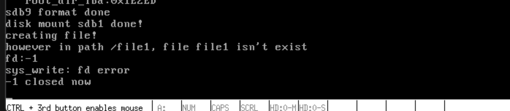

# 文件写入

## 实现文件写入

​	咱们废话少说，直接开门见山！

```c
/* Writes 'count' bytes from 'buf' to the file.
 * Returns the number of bytes written on success,
 * or -1 if an error occurs. */
int32_t file_write(File *file, const void *buf, uint32_t count) {
    // Check if the file size after writing exceeds the maximum allowed size
    // (140 blocks, 71680 bytes).
    if ((file->fd_inode->i_size + count) > (BLOCK_SIZE * 140)) {
        ccos_printk("exceed max file_size 71680 bytes, write file failed\n");
        return -1;
    }

    // Allocate memory for the IO buffer and the block address array.
    uint8_t *io_buf = sys_malloc(BLOCK_SIZE);
    if (!io_buf) {
        ccos_printk("file_write: sys_malloc for io_buf failed\n");
        return -1;
    }

    uint32_t *all_blocks = (uint32_t *)sys_malloc(
        BLOCK_SIZE + 48); // Array to store all block addresses.
    if (!all_blocks ) {
        ccos_printk("file_write: sys_malloc for all_blocks failed\n");
        return -1;
    }

    const uint8_t *src = buf; // Pointer to the data to be written.
    uint32_t bytes_written =
        0; // Variable to track the number of bytes written.
    uint32_t size_left =
        count; // Variable to track the remaining bytes to be written.
    int32_t block_lba = -1; // Block address.
    uint32_t block_bitmap_idx =
        0;            // Block bitmap index used for bitmap synchronization.
    uint32_t sec_idx; // Sector index.
    uint32_t sec_lba; // Sector address.
    uint32_t sec_off_bytes;       // Byte offset within the sector.
    uint32_t sec_left_bytes;      // Remaining bytes in the sector.
    uint32_t chunk_size;          // Size of the data chunk to be written.
    int32_t indirect_block_table; // Address of the indirect block table.
    uint32_t block_idx;           // Block index.

    // If this is the first time writing to the file, allocate the first block.
    if (file->fd_inode->i_sectors[0] == 0) {
        block_lba = block_bitmap_alloc(cur_part);
        if (block_lba == -1) {
            ccos_printk("file_write: block_bitmap_alloc failed\n");
            return -1;
        }
        file->fd_inode->i_sectors[0] = block_lba;

        // Synchronize the block bitmap to disk after allocation.
        block_bitmap_idx = block_lba - cur_part->sb->data_start_lba;
        KERNEL_ASSERT(block_bitmap_idx != 0);
        bitmap_sync(cur_part, block_bitmap_idx, BLOCK_BITMAP);
    }

    // Calculate the number of blocks the file has already occupied and will
    // occupy after writing.
    uint32_t file_has_used_blocks = file->fd_inode->i_size / BLOCK_SIZE + 1;
    uint32_t file_will_use_blocks =
        (file->fd_inode->i_size + count) / BLOCK_SIZE + 1;
    KERNEL_ASSERT(file_will_use_blocks <= 140);

    // Calculate the number of blocks to be added.
    uint32_t add_blocks = file_will_use_blocks - file_has_used_blocks;

    // Collect all the block addresses into 'all_blocks' array.
    if (add_blocks == 0) {
        // If no new blocks need to be allocated, just use the existing blocks.
        if (file_has_used_blocks <= 12) {
            block_idx = file_has_used_blocks - 1; // Last used block.
            all_blocks[block_idx] = file->fd_inode->i_sectors[block_idx];
        } else {
            // If indirect blocks are already used, load the indirect block
            // addresses.
            KERNEL_ASSERT(file->fd_inode->i_sectors[12] != 0);
            indirect_block_table = file->fd_inode->i_sectors[12];
            ide_read(cur_part->my_disk, indirect_block_table, all_blocks + 12,
                     1);
        }
    } else {
        // Allocate new blocks and handle the three cases of block allocation.
        if (file_will_use_blocks <= 12) {
            // Case 1: All new data fits within the first 12 blocks.
            block_idx = file_has_used_blocks - 1;
            KERNEL_ASSERT(file->fd_inode->i_sectors[block_idx] != 0);
            all_blocks[block_idx] = file->fd_inode->i_sectors[block_idx];

            // Allocate new blocks and add them to 'all_blocks'.
            block_idx = file_has_used_blocks;
            while (block_idx < file_will_use_blocks) {
                block_lba = block_bitmap_alloc(cur_part);
                if (block_lba == -1) {
                    ccos_printk("file_write: block_bitmap_alloc for situation 1 "
                           "failed\n");
                    return -1;
                }
                KERNEL_ASSERT(file->fd_inode->i_sectors[block_idx] == 0);
                file->fd_inode->i_sectors[block_idx] = all_blocks[block_idx] =
                    block_lba;
                block_bitmap_idx = block_lba - cur_part->sb->data_start_lba;
                bitmap_sync(cur_part, block_bitmap_idx, BLOCK_BITMAP);
                block_idx++;
            }
        } else if (file_has_used_blocks <= 12 && file_will_use_blocks > 12) {
            // Case 2: Existing data fits within the first 12 blocks, but new
            // data will use an indirect block.
            block_idx = file_has_used_blocks - 1;
            all_blocks[block_idx] = file->fd_inode->i_sectors[block_idx];

            // Allocate an indirect block.
            block_lba = block_bitmap_alloc(cur_part);
            if (block_lba == -1) {
                ccos_printk(
                    "file_write: block_bitmap_alloc for situation 2 failed\n");
                return -1;
            }
            KERNEL_ASSERT(file->fd_inode->i_sectors[12] == 0);
            indirect_block_table = file->fd_inode->i_sectors[12] = block_lba;

            block_idx = file_has_used_blocks;
            while (block_idx < file_will_use_blocks) {
                block_lba = block_bitmap_alloc(cur_part);
                if (block_lba == -1) {
                    ccos_printk("file_write: block_bitmap_alloc for situation 2 "
                           "failed\n");
                    return -1;
                }
                if (block_idx < 12) {
                    KERNEL_ASSERT(file->fd_inode->i_sectors[block_idx] == 0);
                    file->fd_inode->i_sectors[block_idx] =
                        all_blocks[block_idx] = block_lba;
                } else {
                    all_blocks[block_idx] = block_lba;
                }
                block_bitmap_idx = block_lba - cur_part->sb->data_start_lba;
                bitmap_sync(cur_part, block_bitmap_idx, BLOCK_BITMAP);
                block_idx++;
            }
            ide_write(cur_part->my_disk, indirect_block_table, all_blocks + 12,
                      1);
        } else if (file_has_used_blocks > 12) {
            // Case 3: New data will occupy indirect blocks.
            KERNEL_ASSERT(file->fd_inode->i_sectors[12] != 0);
            indirect_block_table = file->fd_inode->i_sectors[12];
            ide_read(cur_part->my_disk, indirect_block_table, all_blocks + 12,
                     1);

            block_idx = file_has_used_blocks;
            while (block_idx < file_will_use_blocks) {
                block_lba = block_bitmap_alloc(cur_part);
                if (block_lba == -1) {
                    ccos_printk("file_write: block_bitmap_alloc for situation 3 "
                           "failed\n");
                    return -1;
                }
                all_blocks[block_idx++] = block_lba;
                block_bitmap_idx = block_lba - cur_part->sb->data_start_lba;
                bitmap_sync(cur_part, block_bitmap_idx, BLOCK_BITMAP);
            }
            ide_write(cur_part->my_disk, indirect_block_table, all_blocks + 12,
                      1);
        }
    }

    // Begin writing data to the collected blocks.
    bool first_write_block = true;
    file->fd_pos = file->fd_inode->i_size - 1;
    while (bytes_written < count) {
        k_memset(io_buf, 0, BLOCK_SIZE);
        sec_idx = file->fd_inode->i_size / BLOCK_SIZE;
        sec_lba = all_blocks[sec_idx];
        sec_off_bytes = file->fd_inode->i_size % BLOCK_SIZE;
        sec_left_bytes = BLOCK_SIZE - sec_off_bytes;

        // Determine the chunk size for this write operation.
        chunk_size = size_left < sec_left_bytes ? size_left : sec_left_bytes;
        if (first_write_block) {
            ide_read(cur_part->my_disk, sec_lba, io_buf, 1);
            first_write_block = false;
        }

        k_memcpy(io_buf + sec_off_bytes, src, chunk_size);
        ide_write(cur_part->my_disk, sec_lba, io_buf, 1);

        src += chunk_size;
        file->fd_inode->i_size += chunk_size;
        file->fd_pos += chunk_size;
        bytes_written += chunk_size;
        size_left -= chunk_size;
    }

    inode_sync(cur_part, file->fd_inode, io_buf);

    // Free allocated memory.
    sys_free(all_blocks);
    sys_free(io_buf);

    return bytes_written;
}
```

`file_write` 函数接受三个参数：文件 `file`、数据缓冲区 `buf` 和字节数 `count`，功能是将 `buf` 中的 `count` 个字节写入 `file`，成功则返回写入的字节数，失败则返回 -1。为了实现简化，块大小与扇区大小相同，均为 512 字节。文件的最大尺寸为 140 个块（即 `BLOCK_SIZE * 140`），因此在函数开头会判断新写入的数据是否会使文件超过最大尺寸。如果超过，函数会打印提示信息并返回 -1。

函数申请了 512 字节的缓冲区 `io_buf`，用于以扇区为单位进行磁盘操作。为了在写入硬盘时方便获取块地址，函数将文件的所有块地址收集到 `all_blocks` 中。为此，函数申请了 `BLOCK_SIZE + 48` 大小的内存，用于存储 128 个间接块和 12 个直接块的地址。

文件中的数据是顺序、连续写入块中的，从最低块 `i_sector[0]` 开始向高块写入。例如，直接块 0 写满后再写入直接块 1，写完直接块后再写入第 0 个间接块，直到第 127 个间接块。文件中的数据不会出现空洞或跨块的情况，这与目录不同，目录中的目录项可以分散在不同的块中。

如果文件是第一次写入数据，函数会通过 `block_bitmap_alloc` 分配扇区，并将地址写入 `i_sectors[0]`，然后将位图同步到硬盘。接着，函数判断是否需要为 `count` 个字节分配新块。变量 `file_has_used_blocks` 表示文件当前使用的块数，`file_will_use_blocks` 表示写入 `count` 字节后文件将使用的块数，`add_blocks` 表示需要为 `count` 字节数据分配的扇区数。

函数将文件当前使用及未来使用的块地址收集到 `all_blocks` 中（不包括不参与写入操作的块地址）。如果 `add_blocks` 为 0，说明 `count` 值小于等于原有扇区中的剩余空间，无需再申请新块。函数会判断原有块地址是直接块还是间接块，并将其收录到 `all_blocks` 中。如果需要分配新块，函数会分三种情况处理：

1. 如果已使用的扇区数在 12 块之内，且新增块后文件大小仍在 12 块之内，直接分配所需块并将地址写入 `i_sectors` 数组。
2. 如果已使用的块数在 12 块之内，但新增块后文件大小超过 12 块，除了将块地址写入 `i_sectors` 数组外，还需要创建一级间接块表并写入块地址。
3. 如果已使用的扇区数超过 12 块，需要在一级间接块表中创建间接块项，并将新分配的块地址收录到 `all_blocks` 中。

函数处理完块地址的分配和收集后，开始将数据写入块中。变量 `first_write_block` 用于标识本次写入操作中第一个写入的块。通常情况下，该块中已存在数据，因此需要先将该块中的数据读出，将新数据写入空闲区域，然后将新老数据一同写入硬盘，以实现数据追加的功能。

函数通过循环将数据写入块中，变量 `bytes_written` 记录已写入的数据量。每次循环开始时，函数会清空 `io_buf`，并根据文件大小计算块索引 `sec_idx`，从 `all_blocks` 中获取扇区地址 `sec_lba`。变量 `sec_off_bytes` 表示数据在最后一个块中的偏移量，`sec_left_bytes` 表示块中的可用字节空间。变量 `chunk_size` 表示本次写入扇区的数据量，`size_left` 表示剩余未写入的数据量。如果 `size_left` 小于当前块的剩余空间，`chunk_size` 等于 `size_left`；否则，`chunk_size` 等于 `sec_left_bytes`。

如果当前块是本次操作中的第一个块，函数会先将该块中的数据读出，然后将新数据拼接到 `io_buf` 中，最后将数据写入硬盘。写入完成后，函数更新文件大小 `i_size`、已写入数据量 `bytes_written` 和剩余数据量 `size_left`。

写入完成后，函数同步 inode 到硬盘，释放 `all_blocks` 和 `io_buf`，并返回已写入的数据量 `bytes_written`。至此，`file_write` 函数结束。

## 升级sys_write函数

还有一个工作，我们有文件写入了，自然可以升级write调用：

```c
/* Write count bytes from buf to the file descriptor fd, return the number of
 * bytes written on success, otherwise return -1 */
int32_t sys_write(int32_t fd, const void *buf, uint32_t count) {
    if (fd < 0) {
        ccos_printk("sys_write: fd error\n");
        return -1;
    }
    if (fd == stdout_no) {
        /* Standard output may be redirected to a pipe buffer, so we need to
         * check */
        char tmp_buf[1024] = {0};
        k_memcpy(tmp_buf, buf, count);
        console_ccos_puts(tmp_buf);
        return count;
    } 
    uint32_t _fd = fd_local2global(fd);
    File *wr_file = &file_table[_fd];
    if (wr_file->fd_flag & O_WRONLY || wr_file->fd_flag & O_RDWR) {
        uint32_t bytes_written = file_write(wr_file, buf, count);
        return bytes_written;
    } else {
        console_ccos_puts("sys_write: not allowed to write file without "
                              "flag O_RDWR or O_WRONLY\n");
        return -1;
    }
}
```

`sys_write` 函数将 `count` 字节的数据从 `buf` 写入到由 `fd` 指定的文件描述符中。如果 `fd` 小于0，表示无效的文件描述符，函数返回 `-1`。如果 `fd` 等于标准输出 (`stdout_no`)，则将数据复制到一个临时缓冲区 `tmp_buf`，然后通过 `console_ccos_puts` 函数输出到控制台，最后返回写入的字节数。

如果 `fd` 指向一个文件，函数会将 `fd` 转换为全局文件描述符 `_fd`，并通过 `file_table[_fd]` 获取对应的文件对象 `wr_file`。接着，检查文件的标志位，只有在文件的标志包含 `O_WRONLY` 或 `O_RDWR` 时，才允许写入文件。如果文件可以写入，则调用 `file_write` 函数将数据写入文件，并返回实际写入的字节数。如果文件不能写入，则输出错误信息并返回 `-1`。

​	我们相应的修改用户测：

```c
/* Writes 'count' characters from 'buf' to file descriptor 'fd' */
uint32_t write(int32_t fd, const void *buf, uint32_t count) {
    return _syscall3(SYS_WRITE, fd, buf, count);
}

// Formats and prints a string based on a format specifier
uint32_t printf(const char* format_string, ...) { 
    va_list args; 
    va_start(args, format_string); // Initialize args to store all additional arguments
    char buffer[PRINTF_IO_BUFFER_LENGTH] = {0};       // Buffer to hold the formatted string
    vsprintf(buffer, format_string, args); 
    va_end(args); 
    return write(1, buffer, k_strlen(buffer)); 
} 

```

## 测试

```c
#include "include/device/console_tty.h"
#include "include/kernel/init.h"
#include "include/library/kernel_assert.h"
#include "include/thread/thread.h"
#include "include/user/stdio/stdio.h"
#include "include/memory/memory.h"
#include "include/library/ccos_print.h"
#include "include/filesystem/filesystem.h"

int main(void) { 
    init_all(); 
    sys_open("/file1", O_CREAT); 
    uint32_t fd = sys_open("/file1", O_RDONLY); 
    printf("fd:%d\n", fd); 
    sys_write(fd, "hello,world\n", 12); 
    sys_close(fd); 
    printf("%d closed now\n", fd); 
    while(1); 
    return 0; 
} 
```



​	但是如你所见，上一个创建失败了，自然也就没法验证。

## 下一篇

[实现文件读](./13.5_file_read.md)
