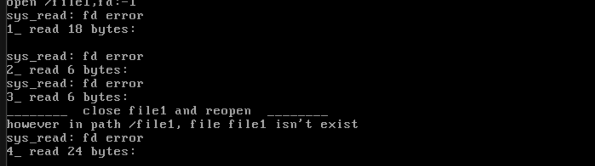

# 文件读

## 实现文件读取

​	咱们废话少说，直接开门见山！（梅开二度）

```c
/* Reads 'count' bytes from the file into 'buf' and returns the number of bytes
   read. Returns -1 if the end of the file is reached. */
int32_t file_read(File *file, void *buf, uint32_t count) {
    uint8_t *buf_dst = (uint8_t *)buf;
    uint32_t size = count, size_left = size;

    /* If the requested number of bytes exceeds the file's readable size,
       use the remaining size as the number of bytes to read. */
    if ((file->fd_pos + count) > file->fd_inode->i_size) {
        size = file->fd_inode->i_size - file->fd_pos;
        size_left = size;
        if (size == 0) { // Return -1 if the end of the file is reached
            return -1;
        }
    }

    uint8_t *io_buf =
        sys_malloc(BLOCK_SIZE); // Allocate buffer for I/O operations
    if (!io_buf) {
        ccos_printk("file_read: sys_malloc for io_buf failed\n");
    }
    uint32_t *all_blocks = (uint32_t *)sys_malloc(
        BLOCK_SIZE + 48); // Allocate space to store the addresses of all blocks
                          // used by the file
    if (!all_blocks ) {
        ccos_printk("file_read: sys_malloc for all_blocks failed\n");
        return -1;
    }

    uint32_t block_read_start_idx =
        file->fd_pos / BLOCK_SIZE; // Start block index of the data to be read
    uint32_t block_read_end_idx =
        (file->fd_pos + size) /
        BLOCK_SIZE; // End block index of the data to be read
    uint32_t read_blocks = block_read_start_idx -
                           block_read_end_idx; // If the difference is 0, data
                                               // is within the same sector
    KERNEL_ASSERT(block_read_start_idx < 139 && block_read_end_idx < 139);

    int32_t indirect_block_table; // To store the address of the indirect block
                                  // table
    uint32_t block_idx;           // To store the block address to be read

    /* Start constructing the 'all_blocks' array, which stores the block
     * addresses used by the file. */
    if (read_blocks ==
        0) { // Data is within the same sector, no need to read across sectors
        KERNEL_ASSERT(block_read_end_idx == block_read_start_idx);
        if (block_read_end_idx <
            12) { // If the data is within the first 12 direct blocks
            block_idx = block_read_end_idx;
            all_blocks[block_idx] = file->fd_inode->i_sectors[block_idx];
        } else { // If indirect block table is used, read the table into memory
            indirect_block_table = file->fd_inode->i_sectors[12];
            ide_read(cur_part->my_disk, indirect_block_table, all_blocks + 12,
                     1);
        }
    } else { // Multiple blocks need to be read
             /* First case: Start and end blocks are within direct blocks */
        if (block_read_end_idx <
            12) { // If the data ends within the direct blocks
            block_idx = block_read_start_idx;
            while (block_idx <= block_read_end_idx) {
                all_blocks[block_idx] = file->fd_inode->i_sectors[block_idx];
                block_idx++;
            }
        } else if (block_read_start_idx < 12 && block_read_end_idx >= 12) {
            /* Second case: Data spans direct and indirect blocks */
            /* First, copy the direct block addresses into 'all_blocks' */
            block_idx = block_read_start_idx;
            while (block_idx < 12) {
                all_blocks[block_idx] = file->fd_inode->i_sectors[block_idx];
                block_idx++;
            }
            KERNEL_ASSERT(
                file->fd_inode->i_sectors[12] !=
                0); // Ensure that the indirect block table has been allocated

            /* Then, copy the indirect block addresses into 'all_blocks' */
            indirect_block_table = file->fd_inode->i_sectors[12];
            ide_read(cur_part->my_disk, indirect_block_table, all_blocks + 12,
                     1); // Read the indirect block table into the memory
                         // starting from the 13th block
        } else {
            /* Third case: Data is entirely within the indirect blocks */
            KERNEL_ASSERT(
                file->fd_inode->i_sectors[12] !=
                0); // Ensure that the indirect block table has been allocated
            indirect_block_table =
                file->fd_inode->i_sectors[12]; // Get the address of the
                                               // indirect block table
            ide_read(cur_part->my_disk, indirect_block_table, all_blocks + 12,
                     1); // Read the indirect block table into the memory
                         // starting from the 13th block
        }
    }

    /* The addresses of the required blocks are now stored in 'all_blocks'.
     * Start reading the data. */
    uint32_t sec_idx, sec_lba, sec_off_bytes, sec_left_bytes, chunk_size;
    uint32_t bytes_read = 0;
    while (bytes_read < size) { // Continue reading until all data is read
        sec_idx = file->fd_pos / BLOCK_SIZE;
        sec_lba = all_blocks[sec_idx]; // Get the logical block address
        sec_off_bytes =
            file->fd_pos % BLOCK_SIZE; // Get the offset within the block
        sec_left_bytes =
            BLOCK_SIZE - sec_off_bytes; // Get the remaining bytes in the block
        chunk_size = size_left < sec_left_bytes
                         ? size_left
                         : sec_left_bytes; // Determine the chunk size to read

        k_memset(io_buf, 0, BLOCK_SIZE); // Clear the I/O buffer
        ide_read(cur_part->my_disk, sec_lba, io_buf,
                 1); // Read the block from disk
        k_memcpy(buf_dst, io_buf + sec_off_bytes,
               chunk_size); // Copy the relevant data into the buffer

        buf_dst += chunk_size;      // Update the destination pointer
        file->fd_pos += chunk_size; // Update the file position
        bytes_read += chunk_size;   // Update the number of bytes read
        size_left -= chunk_size;    // Update the remaining bytes to be read
    }

    sys_free(all_blocks); // Free the block addresses array
    sys_free(io_buf);     // Free the I/O buffer
    return bytes_read;    // Return the number of bytes successfully read
}
```

`file_read` 函数接受三个参数：读取的文件 `file`、数据写入的缓冲区 `buf` 和读取的字节数 `count`，功能是从文件 `file` 中读取 `count` 个字节并写入 `buf`，返回实际读出的字节数。如果读到文件尾，则返回 -1。函数开头将 `buf_dst` 赋值为 `buf`，后续读取的数据会存入 `buf_dst`，而不改变 `buf`。函数首先判断文件是否已读到文件尾，如果是，则返回 -1。

函数使用 `io_buf` 作为硬盘操作的缓冲区，后续从硬盘中读出的数据会存入 `io_buf`。变量 `all_blocks` 用于记录文件所有的块地址，后续的读硬盘操作将从该结构中获取地址。变量 `block_read_start_idx` 表示当前指针 `fd_pos` 所指向的块索引，即数据读取的起始块索引；`block_read_end_idx` 表示相对于当前位置 `fd_pos` 偏移 `count` 个字节所在的块索引，即数据读取的结束块索引。变量 `read_blocks` 表示要读取的块数，`indirect_block_table` 是一级间接块索引表的地址，`block_idx` 用于块索引。

函数开始将读操作中用到的块地址收录到 `all_blocks` 中。如果 `read_blocks` 为 0，说明要读取的 `count` 个字节在一个块中，只需读取一个块。函数分两种情况处理：如果结束块属于直接块，则从 `i_sectors` 中获取块地址；否则，获取一级间接块索引表地址，并读取该表以获取所有的间接块地址。

如果 `read_blocks` 不为 0，说明 `count` 个字节跨块，需要读取多个块。函数分三种情况处理：
1. 如果起始块和终止块都在 12 块之内，直接从 `i_sectors` 数组中读取块地址。
2. 如果起始块在 12 块之内，结束块超过 12 块，除了从 `i_sectors` 数组中读取块地址外，还需要从一级间接块索引表中读取间接块地址。
3. 如果起始块超过 12 块，直接从一级间接块索引表中读取间接块地址。

函数通过循环将所需的块地址录入 `all_blocks` 中。对于跨块读取的情况，函数先收集直接块地址，然后从硬盘上获取所有的间接块地址并录入 `all_blocks` 中。至此，读硬盘操作中涉及的块地址已全部录入 `all_blocks`。

函数通过循环读取硬盘数据，每次读取一个扇区，并将数据拷贝到 `dst_buf` 中。变量 `chunk_size` 表示每次读取的数据量，由 `ide_read` 函数读取一个扇区，然后通过 `memcpy` 将 `chunk_size` 个字节拷贝到 `dst_buf` 中。虽然理论上读入的数据会覆盖 `io_buf` 中的旧数据，且最终返回给用户的数据由 `chunk_size` 控制，但为了确保数据读取的准确性，函数仍然在每次读取前清空 `io_buf`。

最后，函数释放 `all_blocks` 和 `io_buf`，并通过 `return` 返回已读的字节数 `bytes_read`。至此，`file_read` 函数结束。哈哈，是不是跟file_write很像呢？


## 对称的完成sys_read的工作

​	我们相应的实现sys_read：

```c
/* Read count bytes from the file pointed to by file descriptor fd into buf,
 * return the number of bytes read on success, return -1 if end of file is
 * reached
 */
int32_t sys_read(int32_t fd, void *buf, uint32_t count) {
    
    if (fd < 0 || fd == stdout_no || fd == stderr_no) {
        ccos_printk("sys_read: fd error\n");
    }
    KERNEL_ASSERT(buf);
    uint32_t _fd = fd_local2global(fd); 
    return file_read(&file_table[_fd], buf, count); 
}
```

`sys_read` 函数从文件描述符指向的文件中读取指定数量的字节到 `buf` 中。首先检查传入的文件描述符 `fd` 是否有效，确保它不是标准输出或标准错误流。如果文件描述符无效，则打印错误信息。然后，使用 `KERNEL_ASSERT` 确保 `buf` 指针不为空。接着，通过 `fd_local2global` 将本地文件描述符转换为全局文件描述符 `_fd`，并调用 `file_read` 函数从文件中读取数据，返回读取的字节数。如果读取过程中遇到文件末尾，`file_read` 会返回 `-1`。

## 上电现象

```c
#include "include/device/console_tty.h"
#include "include/kernel/init.h"
#include "include/library/kernel_assert.h"
#include "include/thread/thread.h"
#include "include/user/stdio/stdio.h"
#include "include/memory/memory.h"
#include "include/library/ccos_print.h"
#include "include/filesystem/filesystem.h"
#include "include/library/string.h"

int main(void) { 
    init_all();
    uint32_t fd = sys_open("/file1", O_RDWR); 
    printf("open /file1,fd:%d\n", fd); 
    char buf[64] = {0}; 
    int read_bytes = sys_read(fd, buf, 18); 
    printf("1_ read %d bytes:\n%s\n", read_bytes, buf); 

    k_memset(buf, 0, 64); 
    read_bytes = sys_read(fd, buf, 6); 
    printf("2_ read %d bytes:\n%s", read_bytes, buf); 

    k_memset(buf, 0, 64); 
    read_bytes = sys_read(fd, buf, 6); 
    printf("3_ read %d bytes:\n%s", read_bytes, buf); 

    printf("________  close file1 and reopen  ________\n"); 
    sys_close(fd); 
    fd = sys_open("/file1", O_RDWR); 
    k_memset(buf, 0, 64); 
    read_bytes = sys_read(fd, buf, 24); 
    printf("4_ read %d bytes:\n%s", read_bytes, buf); 

    sys_close(fd); 
    while(1); 
    return 0; 
}
```



## 下一篇

[实现文件的lseek](./13.6_lseek.md)