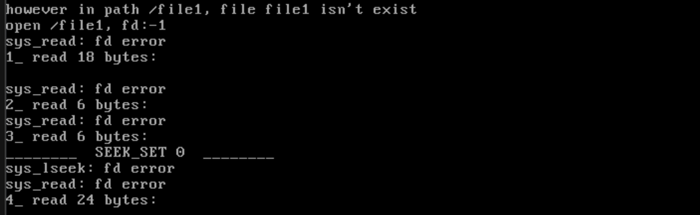

# 实现文件的读写指针定位功能

## 哈哈，就是lseek

实现 `sys_lseek` 功能的目的是为了提供一种灵活的文件读写位置设置方法，避免在需要重新读取文件时频繁关闭和重新打开文件。例如，在上次读取 `file1` 时，由于已经读到文件末尾，`sys_read` 返回了 -1。为了从头读取文件，不得不关闭文件并重新打开，这种方式既繁琐又低效。通过实现 `sys_lseek`，用户可以在不关闭文件的情况下，自由设置文件的读写位置，从而提升文件操作的灵活性和效率。

为了与系统中的其他系统调用保持一致，`lseek` 的内核实现被命名为 `sys_lseek`。`lseek` 函数的原型为 `off_t lseek(int fd, off_t offset, int whence)`，其中 `fd` 是文件描述符，`offset` 是偏移量，`whence` 是偏移量的参照物。函数的功能是将文件的读写指针 `fd_pos` 设置为参照物加上偏移量的值，具体位置不仅取决于 `offset`，还取决于 `whence`。`off_t` 是一个自定义类型，通常等同于 `signed int`，因此 `offset` 可以是正数或负数。

`whence` 参数有三种取值：
1. **SEEK_SET**：`offset` 的参照物是文件的开头，即将读写位置指针设置为距文件开头偏移 `offset` 个字节处。
2. **SEEK_CUR**：`offset` 的参照物是当前读写位置，即将读写位置指针设置为当前位置加上 `offset`。
3. **SEEK_END**：`offset` 的参照物是文件的大小，即文件最后一个字节的下一个字节，即将读写位置指针设置为文件大小加上 `offset`。

需要注意的是，`SEEK_END` 的参照物是文件最后一个字节的下一个字节，而不是文件最后一个字节本身。这是因为文件的读写位置指针 `fd_pos` 始终指向下一个可读写的位置，文件末尾是指文件大小，即超出文件内容的第一个字节。这也是为什么在读取文件时，当指针到达文件末尾时，许多函数会返回 `EOF`（-1），表示已经超出了文件的范围。是的，咱们简直就是复刻Linux的青春版！

```c
/* Reset the offset pointer used for file read/write operations, return the new
 * offset on success, return -1 if an error occurs
 */
int32_t sys_lseek(int32_t fd, int32_t offset, uint8_t whence) {
    if (fd < 0) {
        ccos_printk("sys_lseek: fd error\n");
        return -1;
    }
    KERNEL_ASSERT(whence > 0 && whence < 4);
    uint32_t _fd = fd_local2global(fd);
    File *pf = &file_table[_fd];
    int32_t new_pos = 0; // The new position must be within the file size
    int32_t file_size = (int32_t)pf->fd_inode->i_size;
    switch (whence) {
    /* SEEK_SET - The new read/write position is offset from the beginning of
     * the file */
    case SEEK_SET:
        new_pos = offset;
        break;

    /* SEEK_CUR - The new read/write position is offset from the current
     * position */
    case SEEK_CUR: // offset can be positive or negative
        new_pos = (int32_t)pf->fd_pos + offset;
        break;

    /* SEEK_END - The new read/write position is offset from the end of the file
     */
    case SEEK_END: // In this case, offset should be negative
        new_pos = file_size + offset;
    }
    if (new_pos < 0 || new_pos > (file_size - 1)) {
        return -1;
    }
    pf->fd_pos = new_pos;
    return pf->fd_pos;
}
```

`sys_lseek` 函数用于重置文件的偏移量指针。根据给定的文件描述符 `fd`、偏移量 `offset` 和位置类型 `whence`，计算新的偏移量并更新文件指针。首先检查文件描述符是否有效。然后验证 `whence` 参数是否合法（在 1 到 3 之间）。通过 `fd_local2global` 转换为全局文件描述符，获取文件对象 `pf`。接下来，根据 `whence` 的值进行处理。`SEEK_SET` 设置新的偏移量为 `offset`；`SEEK_CUR` 将当前偏移量加上 `offset`；`SEEK_END` 将偏移量设置为文件末尾加上 `offset`。如果计算出的新的偏移量无效（小于 0 或大于文件大小），则返回 `-1`。否则，更新文件的偏移量指针并返回新的偏移量。

## 测试

```c
#include "include/device/console_tty.h"
#include "include/kernel/init.h"
#include "include/library/kernel_assert.h"
#include "include/thread/thread.h"
#include "include/user/stdio/stdio.h"
#include "include/memory/memory.h"
#include "include/library/ccos_print.h"
#include "include/filesystem/filesystem.h"
#include "include/library/string.h"
int main(void) { 
    init_all();
    uint32_t fd = sys_open("/file1", O_RDWR); 
    printf("open /file1, fd:%d\n", fd); 
    char buf[64] = {0}; 
    int read_bytes = sys_read(fd, buf, 18); 
    printf("1_ read %d bytes:\n%s\n", read_bytes, buf); 

    k_memset(buf, 0, 64); 
    read_bytes = sys_read(fd, buf, 6); 
    printf("2_ read %d bytes:\n%s", read_bytes, buf); 

    k_memset(buf, 0, 64); 
    read_bytes = sys_read(fd, buf, 6); 
    printf("3_ read %d bytes:\n%s", read_bytes, buf); 

    printf("________  SEEK_SET 0  ________\n"); 
    sys_lseek(fd, 0, SEEK_SET); 
    k_memset(buf, 0, 64); 
    read_bytes = sys_read(fd, buf, 24); 
    printf("4_ read %d bytes:\n%s", read_bytes, buf); 

    sys_close(fd); 
    while(1); 
    return 0; 
}
```



## 下一篇

[实现文件的删除](./13.7_file_del.md)

