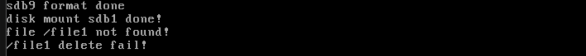

# 文件删除

## 嗯，其实就是回收inode

​	实际上，文件删除就是回收inode。

```c
/* Clear the inode from the disk partition */
void inode_delete(DiskPartition *part, uint32_t inode_no, void *io_buf)
{
   KERNEL_ASSERT(inode_no < 4096);
   InodePosition inode_pos;
   inode_locate(part, inode_no, &inode_pos); // The inode location information is stored in inode_pos
   KERNEL_ASSERT(inode_pos.sec_lba <= (part->start_lba + part->sec_cnt));

   char *inode_buf = (char *)io_buf;
   if (inode_pos.two_sec)
   { // If the inode spans two sectors, read two sectors
      /* Read the original content from the disk */
      ide_read(part->my_disk, inode_pos.sec_lba, inode_buf, 2);
      /* Clear the inode in the buffer */
      k_memset((inode_buf + inode_pos.off_size), 0, sizeof(Inode));
      /* Write the cleared data back to disk */
      ide_write(part->my_disk, inode_pos.sec_lba, inode_buf, 2);
   }
   else
   { // If it does not span sectors, just read one sector
      /* Read the original content from the disk */
      ide_read(part->my_disk, inode_pos.sec_lba, inode_buf, 1);
      /* Clear the inode in the buffer */
      k_memset((inode_buf + inode_pos.off_size), 0, sizeof(Inode));
      /* Write the cleared data back to disk */
      ide_write(part->my_disk, inode_pos.sec_lba, inode_buf, 1);
   }
}


```

`inode_delete` 函数的主要功能是将指定的 inode 从 `inode_table` 中擦除，即将该 inode 对应的内存空间清空。虽然这个函数在功能上并不是必须的，但它对于调试和测试非常有用。inode 的使用情况由 inode 位图控制，从 inode 位图中分配出去的 inode 在创建时会被新数据覆盖，因此在回收 inode 时，只需在 inode 位图中将相应位置 0 即可，无需真正擦除 `inode_table` 中的数据。这与删除文件时不需要真正擦除文件数据块中的数据类似。

`inode_delete` 函数接受三个参数：分区 `part`、inode 编号 `inode_no` 和缓冲区 `io_buf`。函数的功能是将编号为 `inode_no` 的 inode 从 `inode_table` 中擦除，即将该 inode 对应的内存空间清 0。函数开头定义了变量 `inode_pos`，用于存储 inode 的位置信息。接着，函数调用 `inode_locate` 定位编号为 `inode_no` 的 inode，并将位置信息存入 `inode_pos` 中。

函数根据 inode 是否跨扇区分别处理两种情况。如果 inode 跨扇区，函数会从硬盘上读取 2 个扇区到 `io_buf`；否则，读取 1 个扇区到 `io_buf`。无论是哪种情况，函数都会将 `io_buf` 中该 inode 对应的内存空间清 0，然后将 `io_buf` 重新写回到硬盘，从而实现擦除 inode 的目的。

虽然 `inode_delete` 函数在实际操作中并非必需，但它为调试和测试提供了便利，尤其是在需要验证 inode 管理逻辑时。通过该函数，可以确保 inode 的分配和回收过程正确无误，从而提升文件系统的稳定性和可靠性。

下面说说inode的释放问题：

```c
/* Reclaim the data blocks and the inode itself */
void inode_release(DiskPartition *part, uint32_t inode_no)
{
   Inode *inode_to_del = inode_open(part, inode_no);
   KERNEL_ASSERT(inode_to_del->i_no == inode_no);

   /* 1 Reclaim all blocks occupied by the inode */
   uint8_t block_idx = 0, block_cnt = 12;
   uint32_t block_bitmap_idx;
   uint32_t all_blocks[140] = {0}; // 12 direct blocks + 128 indirect blocks

   /* a First, collect the first 12 direct blocks */
   while (block_idx < 12)
   {
      all_blocks[block_idx] = inode_to_del->i_sectors[block_idx];
      block_idx++;
   }

   /* b If the first level indirect block table exists, read its 128 blocks into all_blocks[12~],
      and free the space occupied by the first level indirect block table */
   if (inode_to_del->i_sectors[12] != 0)
   {
      ide_read(part->my_disk, inode_to_del->i_sectors[12], all_blocks + 12, 1);
      block_cnt = 140;

      /* Reclaim the space occupied by the first level indirect block table */
      block_bitmap_idx = inode_to_del->i_sectors[12] - part->sb->data_start_lba;
      KERNEL_ASSERT(block_bitmap_idx > 0);
      bitmap_set(&part->block_bitmap, block_bitmap_idx, 0);
      bitmap_sync(cur_part, block_bitmap_idx, BLOCK_BITMAP);
   }

   /* c All blocks of the inode are now in all_blocks, reclaim each one */
   block_idx = 0;
   while (block_idx < block_cnt)
   {
      if (all_blocks[block_idx] != 0)
      {
         block_bitmap_idx = 0;
         block_bitmap_idx = all_blocks[block_idx] - part->sb->data_start_lba;
         KERNEL_ASSERT(block_bitmap_idx > 0);
         bitmap_set(&part->block_bitmap, block_bitmap_idx, 0);
         bitmap_sync(cur_part, block_bitmap_idx, BLOCK_BITMAP);
      }
      block_idx++;
   }

   /* 2 Reclaim the inode itself */
   bitmap_set(&part->inode_bitmap, inode_no, 0);
   bitmap_sync(cur_part, inode_no, INODE_BITMAP);

   /******     The following inode_delete is for debugging purposes   ******/
   /* This function will clear the inode in the inode_table, but it is not actually needed.
      Inode allocation is controlled by the inode bitmap, and the data on the disk does not need to be cleared.
      It can be directly overwritten. */
   void *io_buf = sys_malloc(1024);
   inode_delete(part, inode_no, io_buf);
   sys_free(io_buf);
   /***********************************************/

   inode_close(inode_to_del);
}
```

`inode_release` 函数接受两个参数：分区 `part` 和 inode 编号 `inode_no`，功能是回收 inode，包括释放 inode 中的数据块以及回收 inode 位图中对应的位。由于文件操作的流程已经较为熟悉，这里不再详细展开。函数首先将直接块的地址收集到 `all_blocks` 数组中，如果存在一级间接块表，则将表中 128 个间接块的地址读到 `all_blocks` 中第 12 块以后的空间中。一级间接块表本身占据一个扇区，因此函数会将该扇区回收。

当函数执行到第 200 行时，该 inode 中所有的块地址已经被收集到 `all_blocks` 中。接下来，函数通过 `while` 循环逐个回收这些块。核心操作是调用 `bitmap_set` 将内存中块位图的 `block_bitmap_idx` 位置为 0，然后调用 `bitmap_sync` 将内存中的位图同步到硬盘。需要注意的是，如果该 inode 是普通文件，由于文件数据是连续存储的，块地址不会出现中间为空（0）的情况，因此可以在 `while` 循环中以块地址为 0 作为结束条件。然而，如果该 inode 是目录，目录中的数据是目录项，每个目录项都可以单独操作。在删除文件时，如果某个目录项单独占用一个块，为了节约资源，函数会回收该块，导致块地址被置为 0。由于这种情况通常发生在块的中间位置，因此对于目录，函数需要完整遍历 140 个块。为了简化实现，函数统一按最大块数 140 遍历，而不单独判断 inode 是目录还是普通文件。

接下来，函数回收该 inode 在 inode 位图中所占用的位，同样通过 `bitmap_set` 和 `bitmap_sync` 两步完成。至此，函数已经回收了 inode 位图中的位以及 inode 涉及到的块。虽然 inode 本身所在的空间不需要真正擦除，但为了在功能验证时更清晰地展示回收过程，函数调用了 `inode_delete` 将 inode 从 `inode_table` 中擦除。为此，函数申请了 1024 字节的 `io_buf` 作为 `inode_delete` 的参数，因为 `inode_delete` 可能需要读取 2 个扇区。

最后，函数调用 `inode_close(inode_to_del)` 关闭 inode，完成整个回收过程。通过 `inode_release` 函数，系统能够高效地回收 inode 及其相关资源，确保文件系统的资源管理更加灵活和可靠。


## 下一个层次删除目录

文件名在文件系统中是通过目录项的方式存在的，因此删除文件时，必须先在相应目录中擦除该文件的目录项。我们删文件目录，要按照这个步骤：

- 在文件所在的目录中，系统会擦除该文件的目录项，将其内容置为 0。这样一来，文件的名字就不再在该目录中存在。

- 咱们的根目录必须保留，因为它是文件系统结构的基础。根目录不会被删除，但可能会发生回收块的情况。如果某个目录项占用了一个单独的块，并且该块不是根目录的最后一个块，那么系统会将这个块回收，以释放空间。

- 接下来，目录 inode 中的 `i_size`（即目录大小）记录了目录项的总和。删除一个目录项后，系统会将 `i_size` 减去一个目录项的大小，以确保目录的大小与实际内容保持一致。

- 我们的目录的 inode 发生改变后，系统会将该变化同步到硬盘中，确保数据持久化。


我们看代码：

```c
/*
 * Deletes a directory entry in the specified partition directory.
 *
 * Parameters:
 * part      - Pointer to the partition where the directory resides.
 * pdir      - Pointer to the parent directory structure containing the entry to
 * delete. inode_no  - Inode number of the directory entry to be deleted. io_buf
 * - Buffer for temporary storage of read/write operations.
 *
 * This function attempts to remove a directory entry by:
 * 1. Collecting all block addresses of the directory.
 * 2. Reading each block to search for the directory entry.
 * 3. When the entry is found:
 *    a) It clears the entry and updates metadata, or
 *    b) Frees the block if it contains only the entry itself and is not the
 * first block.
 *
 * Return:
 * true      - Directory entry was successfully deleted.
 * false     - Directory entry was not found or deletion failed.
 */
bool delete_dir_entry(DiskPartition *part, Dir *pdir, uint32_t inode_no,
                      void *io_buf)
{
    Inode *dir_inode = pdir->inode;
    uint32_t block_idx = 0, all_blocks[140] = {0};

    /* Collect all direct and indirect block addresses */
    while (block_idx < 12)
    {
        all_blocks[block_idx] = dir_inode->i_sectors[block_idx];
        block_idx++;
    }
    if (dir_inode->i_sectors[12])
    {
        ide_read(part->my_disk, dir_inode->i_sectors[12], all_blocks + 12, 1);
    }

    uint32_t dir_entry_size = part->sb->dir_entry_size;
    uint32_t dir_entrys_per_sec = SECTOR_SIZE / dir_entry_size;
    DirEntry *dir_e = (DirEntry *)io_buf;
    DirEntry *dir_entry_found = NULL;
    uint8_t dir_entry_idx, dir_entry_cnt;
    bool is_dir_first_block = false;

    block_idx = 0;

    /* Search all blocks for the directory entry */
    while (block_idx < 140)
    {
        is_dir_first_block = false;
        if (all_blocks[block_idx] == 0)
        {
            block_idx++;
            continue;
        }

        dir_entry_idx = dir_entry_cnt = 0;
        k_memset(io_buf, 0, SECTOR_SIZE);
        ide_read(part->my_disk, all_blocks[block_idx], io_buf, 1);

        /* Traverse all entries in the current block */
        while (dir_entry_idx < dir_entrys_per_sec)
        {
            if ((dir_e + dir_entry_idx)->f_type != FT_UNKNOWN)
            {
                if (!k_strcmp((dir_e + dir_entry_idx)->filename, "."))
                {
                    is_dir_first_block = true;
                }
                else if (k_strcmp((dir_e + dir_entry_idx)->filename, ".") &&
                         k_strcmp((dir_e + dir_entry_idx)->filename, ".."))
                {
                    dir_entry_cnt++;
                    if ((dir_e + dir_entry_idx)->i_no == inode_no)
                    {
                        KERNEL_ASSERT(!dir_entry_found);
                        dir_entry_found = dir_e + dir_entry_idx;
                    }
                }
            }
            dir_entry_idx++;
        }

        if (!dir_entry_found)
        {
            block_idx++;
            continue;
        }

        KERNEL_ASSERT(dir_entry_cnt >= 1);

        if (dir_entry_cnt == 1 && !is_dir_first_block)
        {
            uint32_t block_bitmap_idx =
                all_blocks[block_idx] - part->sb->data_start_lba;
            bitmap_set(&part->block_bitmap, block_bitmap_idx, 0);
            bitmap_sync(cur_part, block_bitmap_idx, BLOCK_BITMAP);

            if (block_idx < 12)
            {
                dir_inode->i_sectors[block_idx] = 0;
            }
            else
            {
                uint32_t indirect_blocks = 0;
                uint32_t indirect_block_idx = 12;
                while (indirect_block_idx < 140)
                {
                    if (all_blocks[indirect_block_idx] != 0)
                    {
                        indirect_blocks++;
                    }
                }
                KERNEL_ASSERT(indirect_blocks >= 1);

                if (indirect_blocks > 1)
                {
                    all_blocks[block_idx] = 0;
                    ide_write(part->my_disk, dir_inode->i_sectors[12],
                              all_blocks + 12, 1);
                }
                else
                {
                    block_bitmap_idx =
                        dir_inode->i_sectors[12] - part->sb->data_start_lba;
                    bitmap_set(&part->block_bitmap, block_bitmap_idx, 0);
                    bitmap_sync(cur_part, block_bitmap_idx, BLOCK_BITMAP);
                    dir_inode->i_sectors[12] = 0;
                }
            }
        }
        else
        {
            k_memset(dir_entry_found, 0, dir_entry_size);
            ide_write(part->my_disk, all_blocks[block_idx], io_buf, 1);
        }

        KERNEL_ASSERT(dir_inode->i_size >= dir_entry_size);
        dir_inode->i_size -= dir_entry_size;
        k_memset(io_buf, 0, SECTOR_SIZE * 2);
        inode_sync(part, dir_inode, io_buf);

        return true;
    }

    return false;
}
```

`delete_dir_entry` 函数的目标是在指定的磁盘分区（`part`）的目录（`pdir`）中删除一个指定的目录项（`inode_no`）。整个过程涉及对目录项的查找、清除，并在必要时释放不再需要的数据块。以下是更详细的解释：

1. **初始化阶段**：首先，通过传入的 `pdir` 获取目录 inode (`dir_inode`) 的信息。接着，函数收集目录 inode 的所有块地址，包括直接块（前 12 个块）和间接块（第 13 个块及之后的块）。如果目录 inode 使用了间接块表（即 `i_sectors[12]` 非零），则通过读取该间接块表的内容，将所有间接块的地址加载到 `all_blocks` 数组中。
2. **准备搜索目录项**：接着，函数定义了 `dir_entry_size`（目录项的大小）和 `dir_entrys_per_sec`（每个扇区能存放的目录项数量）。然后，分配一个缓冲区 `io_buf` 用来暂时存放读取的块数据，并定义 `dir_e` 为指向该缓冲区的 `DirEntry` 类型指针。
3. **查找目录项**：函数开始逐个检查所有块（最多 140 个块）。对于每一个块，首先读取该块内容，如果该块没有被使用（`all_blocks[block_idx] == 0`），则跳过。如果该块存在，则遍历该块中的所有目录项（通过 `dir_entrys_per_sec` 判断）。对于每一个目录项，函数检查它的类型，忽略无效目录项（`f_type == FT_UNKNOWN`）。如果该目录项是当前目录（`"."`）或父目录（`".."`），则标记该块为目录的第一个块。对于其他有效目录项，函数检查其 inode 号是否与要删除的 inode 号匹配，如果匹配，则找到了目标目录项。
4. **删除目录项**：当找到目标目录项时，接下来进行清理工作：
   - 如果目标目录项所在的块只有该项，并且不是目录的第一个块，则释放该块。这是通过从 `block_bitmap` 中清除该块的位来实现的，同时更新目录 inode 的 `i_sectors` 数组，删除该块的引用。
   - 如果该块不是唯一的，或者它是目录的第一个块（即 `.` 或 `..`），则直接清空目录项的数据，即将目录项的内容设置为 0，并更新目录所在的块。
5. **更新 inode**：不论是哪种删除方式，都要更新目录 inode 的大小（`i_size`）。每删除一个目录项，目录的大小减去一个目录项的大小。然后，调用 `inode_sync` 将修改后的 inode 同步到磁盘。
6. **返回值**：如果成功删除目录项，函数返回 `true`，否则返回 `false`。

## 实现sys_unlink

```c
/* Delete a file (not a directory), return 0 on success, return -1 on failure */
int32_t sys_unlink(const char *pathname) {
    KERNEL_ASSERT(strlen(pathname) < MAX_PATH_LEN);

    /* First, check if the file to delete exists */
    PathSearchRecordings searched_record;
    k_memset(&searched_record, 0, sizeof(PathSearchRecordings));
    int inode_no = search_file(pathname, &searched_record);
    KERNEL_ASSERT(inode_no != 0);
    if (inode_no == -1) {
        ccos_printk("file %s not found!\n", pathname);
        dir_close(searched_record.parent_dir);
        return -1;
    }
    if (searched_record.file_type == FT_DIRECTORY) {
        ccos_printk("can't delete a directory with unlink(), use rmdir() instead\n");
        dir_close(searched_record.parent_dir);
        return -1;
    }

    /* Check if the file is currently in use in the open file table */
    uint32_t file_idx = 0;
    while (file_idx < MAX_FILE_OPEN) {
        if (file_table[file_idx].fd_inode &&
            (uint32_t)inode_no == file_table[file_idx].fd_inode->i_no) {
            break;
        }
        file_idx++;
    }
    if (file_idx < MAX_FILE_OPEN) {
        dir_close(searched_record.parent_dir);
        ccos_printk("file %s is in use, cannot delete!\n", pathname);
        return -1;
    }
    KERNEL_ASSERT(file_idx == MAX_FILE_OPEN);

    /* Allocate buffer for delete_dir_entry */
    void *io_buf = sys_malloc(SECTOR_SIZE + SECTOR_SIZE);
    if (!io_buf) {
        dir_close(searched_record.parent_dir);
        ccos_printk("sys_unlink: malloc for io_buf failed\n");
        return -1;
    }

    Dir *parent_dir = searched_record.parent_dir;
    delete_dir_entry(cur_part, parent_dir, inode_no, io_buf);
    inode_release(cur_part, inode_no);
    sys_free(io_buf);
    dir_close(searched_record.parent_dir);
    return 0; // Successfully deleted file
}
```

​	我们验证传入的文件路径 `pathname` 的长度是否超过系统最大限制 `MAX_PATH_LEN`。如果超出限制，程序会触发一个内核断言（`KERNEL_ASSERT`）。接着，调用 `search_file` 函数查找文件对应的 inode。如果找不到该文件，`inode_no` 将为 `-1`，此时函数输出文件未找到的错误信息并返回 -1。

​	如果查找到的 inode 对应的是目录（`FT_DIRECTORY`），函数会打印错误信息，提示用户不能使用 `unlink()` 删除目录，应使用 `rmdir()` 来删除目录，并返回 -1。函数会检查文件是否在系统的打开文件表（`file_table`）中被某个进程使用。它通过遍历 `file_table` 中的每个条目，查找是否有文件描述符指向当前的 inode。如果文件正在被打开，函数会输出文件正在使用的错误信息，并返回 -1。如果文件不在使用中，接下来函数分配一块缓冲区 `io_buf`，用于删除目录项。如果内存分配失败，函数会输出错误信息并返回 -1。 `delete_dir_entry` 删除父目录中的目录项（即将该文件从目录中移除）。之后，调用 `inode_release` 函数释放该文件所占用的数据块和 inode 资源。最后，释放之前分配的内存缓冲区，并关闭父目录（`dir_close`）。如果所有操作都成功完成，函数返回 0，表示文件已成功删除。

## 上电

```c
int main(void) { 
    init_all();
    printf("/file1 delete %s!\n", sys_unlink("/file1") == 0 ? "done" : "fail"); 
    while(1); 
    return 0; 
}
```



## 下一篇

[完善目录的基本操作](./13.8_dirent_op.md)

