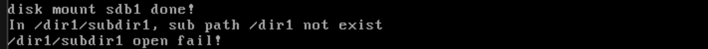

# 目录的基本操作：创建，遍历和删除

## 创建：sys_mkdir

在 Linux 中，`mkdir` 函数用于创建目录，它与同名的 `mkdir` 命令在原理上是相同的，区别在于一个是系统调用，另一个是通过系统调用实现的可执行程序。`mkdir` 函数的原型是 `int mkdir(const char *pathname, mode_t mode)`，其中 `pathname` 是待创建目录的路径和名称，`mode` 是新目录的权限。成功返回 0，失败返回 −1。

创建目录涉及到多个步骤，首先要确认待创建的目录在文件系统中不存在，然后为新目录分配一个 inode。接着，为新目录分配一个块，用于存储该目录中的目录项。每个目录都需要包含两个特殊的目录项：“.”（表示当前目录）和“..”（表示父目录）。随后，系统会在父目录中添加一个新目录的目录项。最后，所有这些资源的变更会被同步到硬盘上，以确保数据的持久化。

这个过程的关键是确保目录结构的正确更新，并保证目录的创建是可靠的。

我们的工作大致思路是这样的：

**内存分配**：函数开始时分配了一块大小为 `SECTOR_SIZE * 2` 的内存 `io_buf`，用于存放目录的内容。如果内存分配失败，则输出错误信息并返回 -1。

**路径查找**：使用 `search_file` 函数查找指定路径 `pathname` 是否已经存在相同的文件或目录。如果文件或目录已经存在，函数会输出错误信息并进行回滚，返回 -1。

**路径深度检查**：如果文件或目录不存在，函数继续检查路径的完整性。它比较传入路径 `pathname` 的深度和当前已搜索路径的深度，确保路径中每个父目录都存在。如果某个中间目录不存在，输出错误信息并进行回滚，返回 -1。

**分配 inode**：如果路径检查通过，函数为新目录分配一个 inode（索引节点）。如果分配失败，输出错误信息并进行回滚，返回 -1。

**分配数据块**：接下来，为新目录分配一个数据块，这个数据块用于存放当前目录 `.` 和父目录 `..` 的目录项。如果分配失败，输出错误信息并进行回滚，返回 -1。

**写入目录项**：为新目录写入两个特殊的目录项：当前目录 `.` 和父目录 `..`。目录项的格式包括文件名、inode 编号和文件类型（目录）。这些目录项写入到新分配的数据块中。

**在父目录中添加目录项**：接下来，创建一个新的目录项，在父目录中添加对新目录的引用。函数调用 `sync_dir_entry` 来同步父目录的数据块和目录项，如果失败，输出错误信息并进行回滚，返回 -1。

**同步 inode 到磁盘**：同步父目录和新目录的 inode 到磁盘，确保文件系统的元数据与实际数据保持一致。

**同步 inode 位图**：同步 inode 位图到磁盘，以便更新系统的 inode 使用状态。

**清理操作**：在成功创建目录后，释放内存并关闭父目录，返回 0 表示成功。

**回滚操作**：如果在上述过程中有任何一步失败，系统会根据失败的步骤回滚之前的操作。回滚步骤包括：

- 如果分配 inode 失败，恢复之前分配的 inode。
- 如果数据块分配失败，恢复之前的操作，并关闭父目录。

```c
/* Create a directory at pathname, return 0 on success, return -1 on failure */
int32_t sys_mkdir(const char *pathname)
{
    uint8_t rollback_step =
        0; // Used to rollback resource states if an operation fails
    void *io_buf = sys_malloc(SECTOR_SIZE * 2);
    if (!io_buf)
    {
        ccos_printk("sys_mkdir: sys_malloc for io_buf failed\n");
        return -1;
    }

    PathSearchRecordings searched_record;
    k_memset(&searched_record, 0, sizeof(PathSearchRecordings));
    int inode_no = -1;
    inode_no = search_file(pathname, &searched_record);
    if (inode_no != -1)
    { // If a file or directory with the same name exists,
      // return failure
        ccos_printk("sys_mkdir: file or directory %s exist!\n", pathname);
        rollback_step = 1;
        goto rollback;
    }
    else
    { // If not found, check whether the final directory exists or if any
      // intermediate directory is missing
        uint32_t pathname_depth = path_depth_cnt((char *)pathname);
        uint32_t path_searched_depth =
            path_depth_cnt(searched_record.searched_path);
        /* First, check if all directory levels of pathname are accessible,
         * i.e., whether a failure occurred in accessing any intermediate
         * directory
         */
        if (pathname_depth !=
            path_searched_depth)
        { // This means some intermediate directory is
          // missing
            ccos_printk("sys_mkdir: can`t access %s, subpath %s isn't exist\n",
                        pathname, searched_record.searched_path);
            rollback_step = 1;
            goto rollback;
        }
    }

    Dir *parent_dir = searched_record.parent_dir;
    /* The directory name might have a '/' character, so it is better to use
     * searched_record.searched_path directly without '/' */
    char *dirname = k_strrchr(searched_record.searched_path, '/') + 1;

    inode_no = inode_bitmap_alloc(cur_part);
    if (inode_no == -1)
    {
        ccos_printk("sys_mkdir: allocate inode failed\n");
        rollback_step = 1;
        goto rollback;
    }

    Inode new_dir_inode;
    inode_init(inode_no, &new_dir_inode); // Initialize the inode

    uint32_t block_bitmap_idx =
        0; // To record the index of block in block_bitmap
    int32_t block_lba = -1;
    /* Allocate a block for the directory to store '.' and '..' */
    block_lba = block_bitmap_alloc(cur_part);
    if (block_lba == -1)
    {
        ccos_printk("sys_mkdir: block_bitmap_alloc for create directory failed\n");
        rollback_step = 2;
        goto rollback;
    }
    new_dir_inode.i_sectors[0] = block_lba;
    /* Synchronize the bitmap to disk after each block allocation */
    block_bitmap_idx = block_lba - cur_part->sb->data_start_lba;
    KERNEL_ASSERT(block_bitmap_idx != 0);
    bitmap_sync(cur_part, block_bitmap_idx, BLOCK_BITMAP);

    /* Write the directory entries for '.' and '..' */
    k_memset(io_buf, 0, SECTOR_SIZE * 2); // Clear io_buf
    DirEntry *p_de = (DirEntry *)io_buf;

    /* Initialize the current directory entry "." */
    k_memcpy(p_de->filename, ".", 1);
    p_de->i_no = inode_no;
    p_de->f_type = FT_DIRECTORY;

    p_de++;
    /* Initialize the parent directory entry ".." */
    k_memcpy(p_de->filename, "..", 2);
    p_de->i_no = parent_dir->inode->i_no;
    p_de->f_type = FT_DIRECTORY;
    ide_write(cur_part->my_disk, new_dir_inode.i_sectors[0], io_buf, 1);

    new_dir_inode.i_size = 2 * cur_part->sb->dir_entry_size;

    /* Add the new directory entry in the parent directory */
    DirEntry new_dir_entry;
    k_memset(&new_dir_entry, 0, sizeof(DirEntry));
    create_dir_entry(dirname, inode_no, FT_DIRECTORY, &new_dir_entry);
    k_memset(io_buf, 0, SECTOR_SIZE * 2); // Clear io_buf
    if (!sync_dir_entry(parent_dir, &new_dir_entry,
                        io_buf))
    { // sync_dir_entry will synchronize the block
      // bitmap to disk
        ccos_printk("sys_mkdir: sync_dir_entry to disk failed!\n");
        rollback_step = 2;
        goto rollback;
    }

    /* Synchronize the inode of the parent directory to disk */
    k_memset(io_buf, 0, SECTOR_SIZE * 2);
    inode_sync(cur_part, parent_dir->inode, io_buf);

    /* Synchronize the inode of the new directory to disk */
    k_memset(io_buf, 0, SECTOR_SIZE * 2);
    inode_sync(cur_part, &new_dir_inode, io_buf);

    /* Synchronize the inode bitmap to disk */
    bitmap_sync(cur_part, inode_no, INODE_BITMAP);

    sys_free(io_buf);

    /* Close the parent directory of the newly created directory */
    dir_close(searched_record.parent_dir);
    return 0;

/* When creating a file or directory, multiple resources need to be created,
  if any step fails, the following rollback steps will be executed */
rollback: // Rollback due to failure at some step
    switch (rollback_step)
    {
    case 2:
        bitmap_set(&cur_part->inode_bitmap, inode_no,
                   0); // If the inode creation for the new directory fails,
                       // restore the previously allocated inode
        goto DIR_CLOSE;
        break;
    case 1:
    DIR_CLOSE:
        /* Close the parent directory of the newly created directory */
        dir_close(searched_record.parent_dir);
        break;
    }
    sys_free(io_buf);
    return -1;
}
```

`sys_mkdir` 函数支持一个参数 `pathname`，功能是创建目录 `pathname`，成功返回 0，失败返回 -1。创建目录的过程由多个步骤组成，因此具有原子性，即要么所有步骤都完成，要么一个都不做。如果在某个步骤失败，必须回滚之前完成的操作。函数开头定义了变量 `rollback_step` 用于记录回滚的步骤，并提前申请了 2 扇区大小的缓冲区 `io_buf`，后续许多操作都会用到它。

在创建目录之前，函数需要判断文件系统上是否已经存在同名的文件或目录。同一目录下不允许存在同名的文件或目录。函数调用 `search_file` 检索 `pathname`，如果找到同名文件或目录，`search_file` 会返回其 inode 编号；否则返回 -1。如果返回值不等于 -1，表示同名文件或目录已存在，函数会输出提示信息并将 `rollback_step` 置为 1，跳转到 `rollback` 处执行回滚操作。回滚操作包括关闭待创建目录的父目录（case 1）以及恢复 inode 位图（case 2）。

如果未找到同名文件或目录，函数还需要检查待创建目录的路径是否有效。例如，创建目录 `/a/b` 时，如果目录 `a` 不存在，函数会拒绝创建目录并输出提示信息。函数通过比较 `pathname` 的路径深度 `pathname_depth` 和已搜索过的路径深度 `path_searched_depth` 来判断中间路径是否存在。如果 `pathname_depth` 大于 `path_searched_depth`，表示某个中间目录不存在，函数会输出提示信息并拒绝创建目录。

函数通过指针 `parent_dir` 指向待创建目录的父目录，并获取 `pathname` 的最后一级目录名 `dirname`。接着，函数调用 `inode_bitmap_alloc` 在 inode 位图中分配 inode。如果分配失败，函数将 `rollback_step` 置为 1，跳转到 `rollback` 处执行回滚操作。

函数为目录新建一个 `new_dir_inode` 并初始化，然后分配一个块并将块地址写入目录 inode 的 `i_sectors[0]` 中，用于存储目录中的目录项。接着，函数将块位图同步到硬盘，并在 `io_buf` 中新建目录项 `.` 和 `..`，同步到硬盘中。这样，目录 `pathname` 中便有了两个目录项。函数初始化目录的尺寸 `new_dir_inode.i_size` 为 2 个目录项的大小。

接下来，函数在父目录中添加待创建目录的目录项。通过 `create_dir_entry` 初始化目录项内容到 `new_dir_entry` 中，然后调用 `sync_dir_entry` 将 `new_dir_entry` 写入父目录 `parent_dir` 中。

最后，函数完成元信息的持久化工作，包括同步父目录 inode 和新目录 inode 到硬盘，以及同步 inode 位图到硬盘。函数释放缓冲区 `io_buf`，关闭父目录 `searched_record.parent_dir`，并返回 0，表示目录创建成功。通过 `sys_mkdir` 函数，系统能够高效地创建目录，并确保文件系统的完整性和一致性。

## 遍历目录

```c
/* Opens the directory specified by name, returns a directory pointer on
   success, returns NULL on failure */
Dir *sys_opendir(const char *name)
{
    KERNEL_ASSERT(strlen(name) < MAX_PATH_LEN);
    /* If it's the root directory '/', directly return &root_dir */
    if (name[0] == '/' && (name[1] == 0 || name[0] == '.'))
    {
        return &root_dir;
    }

    /* Check if the directory to be opened exists */
    PathSearchRecordings searched_record;
    k_memset(&searched_record, 0, sizeof(PathSearchRecordings));
    int inode_no = search_file(name, &searched_record);
    Dir *ret = NULL;
    if (inode_no ==
        -1)
    { // If the directory is not found, print an error message
        ccos_printk("In %s, sub path %s not exist\n", name,
                    searched_record.searched_path);
    }
    else
    {
        if (searched_record.file_type == FT_REGULAR)
        {
            ccos_printk("%s is regular file!\n", name);
        }
        else if (searched_record.file_type == FT_DIRECTORY)
        {
            ret = dir_open(cur_part, inode_no);
        }
    }
    dir_close(searched_record.parent_dir);
    return ret;
}

/* Closes the directory dir, returns 0 on success, returns -1 on failure */
int32_t sys_closedir(Dir *dir)
{
    int32_t ret = -1;
    if (dir)
    {
        dir_close(dir);
        ret = 0;
    }
    return ret;
}

/* Reads one directory entry from the directory dir, returns the directory entry
   address on success, returns NULL at the end of the directory or on error */
DirEntry *sys_readdir(Dir *dir) {
    KERNEL_ASSERT(dir);
    return dir_read(dir);
}
```

​	这段代码包含了三个文件系统相关的函数，用于打开、关闭和读取目录。`sys_opendir`用于打开一个目录并返回该目录的指针。首先，它会检查传入的路径名是否有效（长度不超过 `MAX_PATH_LEN`）。如果路径是根目录 `'/'` 或者是当前目录 `'.'`，它直接返回根目录指针 `&root_dir`。否则，调用 `search_file` 函数检查指定的目录是否存在。如果目录不存在，它会打印错误信息；如果找到该目录且它是一个常规文件（`FT_REGULAR`），则会提示错误信息，说明不能将文件作为目录打开；如果是一个目录（`FT_DIRECTORY`），则会调用 `dir_open` 打开该目录并返回相应的目录指针。最后，函数关闭搜索到的父目录（`searched_record.parent_dir`）并返回打开的目录指针（`ret`），如果失败返回 `NULL`。`sys_closedir`用于关闭一个已经打开的目录。它接收一个目录指针 `dir` 作为参数，如果该指针不为 `NULL`，则调用 `dir_close` 关闭目录并返回成功的状态；否则，返回 `-1`。`sys_readdir`用于从目录中读取一个目录项。它接收一个目录指针 `dir` 作为参数，调用 `dir_read` 函数读取目录项，并返回目录项的地址。如果到达目录末尾或者发生错误，返回 `NULL`。

​	我们下面来看看dir_read:

```c
/*
 * Reads a directory entry from the specified directory.
 *
 * Parameters:
 * dir - Pointer to the directory structure to read from.
 *
 * This function iterates over the blocks of the directory,
 * reading the next valid entry. It skips empty blocks and
 * invalid entries while updating the directory's read position.
 *
 * Return:
 * Pointer to a valid directory entry if successful.
 * NULL if no more entries are found or an error occurs.
 */
DirEntry *dir_read(Dir *dir)
{
    DirEntry *dir_e = (DirEntry *)dir->dir_buf;
    Inode *dir_inode = dir->inode;
    uint32_t all_blocks[140] = {0}, block_cnt = 12;
    uint32_t block_idx = 0, dir_entry_idx = 0;

    /* Collect all direct block addresses */
    while (block_idx < 12)
    {
        all_blocks[block_idx] = dir_inode->i_sectors[block_idx];
        block_idx++;
    }

    /* If there are indirect blocks, read them */
    if (dir_inode->i_sectors[12] != 0)
    {
        ide_read(cur_part->my_disk, dir_inode->i_sectors[12], all_blocks + 12,
                 1);
        block_cnt = 140;
    }
    block_idx = 0;

    uint32_t cur_dir_entry_pos = 0;
    uint32_t dir_entry_size = cur_part->sb->dir_entry_size;
    uint32_t dir_entrys_per_sec = SECTOR_SIZE / dir_entry_size;

    /* Iterate over all blocks to find a valid directory entry */
    while (block_idx < block_cnt)
    {
        if (dir->dir_pos >= dir_inode->i_size)
        {
            return NULL;
        }

        if (all_blocks[block_idx] == 0)
        {
            block_idx++;
            continue;
        }

        k_memset(dir_e, 0, SECTOR_SIZE);
        ide_read(cur_part->my_disk, all_blocks[block_idx], dir_e, 1);
        dir_entry_idx = 0;

        /* Traverse all entries in the current block */
        while (dir_entry_idx < dir_entrys_per_sec)
        {
            if ((dir_e + dir_entry_idx)->f_type)
            {
                if (cur_dir_entry_pos < dir->dir_pos)
                {
                    cur_dir_entry_pos += dir_entry_size;
                    dir_entry_idx++;
                    continue;
                }

                KERNEL_ASSERT(cur_dir_entry_pos == dir->dir_pos);
                dir->dir_pos += dir_entry_size;
                return dir_e + dir_entry_idx;
            }
            dir_entry_idx++;
        }
        block_idx++;
    }

    return NULL;
}

```

`dir_read` 函数接受一个参数 `dir`，即目录指针，功能是读取目录 `dir`，成功时返回一个目录项，失败时返回 `NULL`。目录结构中有一个 512 字节的缓冲区 `dir_buf`，用于存储目录项。函数开头声明了目录项指针 `dir_e`，使其指向目录缓冲区 `dir_buf`。为了读取目录，函数需要知道目录 inode 的所有块地址，因此将目录的所有块地址收集到 `all_blocks` 中，并将块索引 `block_idx` 重置为 0。

函数通过遍历目录的所有块，并在每个块中遍历目录项来读取目录。由于 `dir_read` 每次只返回一个目录项，因此需要通过目录的 `dir_pos` 来确定返回哪个目录项。`dir_pos` 是目录的“游标”，类似于文件结构中的 `fd_pos`，用于记录下一个读写对象的地址。每次返回一个目录项后，`dir_pos` 的值会增加一个目录项的大小，从而确定下一个要返回的目录项。由于目录中的目录项是单独的个体，可能会被单独删除，导致块中存在“空洞”，即目录项不连续存储。这些“空洞”在内存缓冲区中仍然存在，函数不会在内存中整理目录项使其连续，因为这样会降低效率且没有必要。

为了准确找到需要返回的目录项，函数定义了变量 `cur_dir_entry_pos` 来表示当前目录项的地址。每找到一个目录项，`cur_dir_entry_pos` 就会增加一个目录项的大小，直到 `cur_dir_entry_pos` 的值等于 `dir_pos`，此时找到的目录项即为需要返回的目录项。

函数从寻找目录项开始，遍历所有块。由于所有目录项都在文件大小范围内，因此函数判断 `dir_pos` 是否大于等于文件尺寸。如果是，说明已经遍历了所有目录项，函数直接返回 `NULL`。需要注意的是，`dir_pos` 在执行 `sys_opendir` 时会被初始化为 0。

函数将扇区数据读入 `dir_e` 中，并遍历所有目录项。只要目录项有效（即目录项的 `f_type` 不等于 `FT_UNKNOWN`，`FT_UNKNOWN` 值为 0），函数就会比较当前目录项地址 `cur_dir_entry_pos` 和 `dir->dir_pos`。如果 `cur_dir_entry_pos` 小于 `dir->dir_pos`，说明这些目录项已经被返回过，因此将 `cur_dir_entry_pos` 增加一个目录项大小，并使目录项索引 `dir_entry_idx` 加 1，跳过当前目录项，直到 `cur_dir_entry_pos` 等于 `dir->dir_pos`，此时找到的目录项即为需要返回的目录项。

函数将 `dir->dir_pos` 增加一个目录项大小，使其指向下一个待返回的目录项。最后，函数返回目录项地址 `dir_e + dir_entry_idx`。通过 `dir_read` 函数，系统能够高效地读取目录中的目录项，并确保目录操作的准确性和一致性。

## 实现一下目录读取和指针重置

```c
/* Reads one directory entry from the directory dir, returns the directory entry
   address on success, returns NULL at the end of the directory or on error */
DirEntry *sys_readdir(Dir *dir)
{
    KERNEL_ASSERT(dir);
    return dir_read(dir);
}

/* Resets the directory pointer dir_pos to 0 */
void sys_rewinddir(Dir *dir)
{
    dir->dir_pos = 0;
}
```


## 删除目录

​	删除目录，要保证目录是空的！

```c
/*
 * Checks if a directory is empty.
 *
 * Parameters:
 * dir - Pointer to the directory to check.
 *
 * A directory is considered empty if it contains only the
 * entries for "." and "..".
 *
 * Return:
 * true  - Directory is empty.
 * false - Directory contains other entries.
 */
bool dir_is_empty(Dir *dir)
{
    Inode *dir_inode = dir->inode;
    return (dir_inode->i_size == cur_part->sb->dir_entry_size * 2);
}
```

​	若目录的大小等于2 个目录项的大小，就表示该目录为空。（因为只有.和..嘛！）

```c
/*
 * Removes a subdirectory from its parent directory.
 *
 * Parameters:
 * parent_dir - Pointer to the parent directory structure.
 * child_dir  - Pointer to the child directory structure to be removed.
 *
 * This function ensures that the child directory is empty and
 * safely deletes it by:
 * 1. Removing its entry from the parent directory.
 * 2. Releasing all blocks and the inode associated with the child directory.
 *
 * Return:
 * 0  - Directory was successfully removed.
 * -1 - Directory removal failed (e.g., memory allocation error).
 */
int32_t dir_remove(Dir *parent_dir, Dir *child_dir)
{
    Inode *child_dir_inode = child_dir->inode;

    /* Verify that the directory has no extra blocks beyond the first one */
    int32_t block_idx = 1;
    while (block_idx < 13)
    {
        KERNEL_ASSERT(child_dir_inode->i_sectors[block_idx] == 0);
        block_idx++;
    }

    void *io_buf = sys_malloc(SECTOR_SIZE * 2);
    if (!io_buf)
    {
        ccos_printk("dir_remove: malloc for io_buf failed\n");
        return -1;
    }

    /* Remove the directory entry in the parent directory */
    delete_dir_entry(cur_part, parent_dir, child_dir_inode->i_no, io_buf);

    /* Release the blocks and inode associated with the child directory */
    inode_release(cur_part, child_dir_inode->i_no);

    sys_free(io_buf);
    return 0;
}

```

 `dir_remove` 函数的主要功能是从父目录中删除一个子目录。首先，它通过检查子目录的 inode，确保该子目录没有超过一个块的内容。具体来说，函数检查子目录的 inode 的 `i_sectors` 数组中的块，从索引 1 开始，确保没有其他块（即只能有一个块，索引 0）。如果满足条件，接下来会分配一个用于操作的缓冲区 `io_buf`，大小为两个扇区。若分配失败，则返回 -1，表示删除失败。

接下来，函数会从父目录中删除该子目录的目录项，调用 `delete_dir_entry` 函数完成该操作，传入当前磁盘和父目录结构，及子目录 inode 的编号。最后，函数会释放子目录占用的块和 inode 资源，调用 `inode_release` 完成释放操作。释放完资源后，释放分配的缓冲区并返回 0，表示目录成功删除。如果某个操作失败（例如内存分配失败），则返回 -1，表示删除失败。

## 最后的集成：sys_rmdir

​	sys_rmdir则是真正的完成这个事情。

```c
/* Deletes an empty directory, returns 0 on success, returns -1 on failure */
int32_t sys_rmdir(const char *pathname) {
    /* Check if the directory to be deleted exists */
    PathSearchRecordings searched_record;
    k_memset(&searched_record, 0, sizeof(PathSearchRecordings));
    int32_t inode_no = search_file(pathname, &searched_record);
    KERNEL_ASSERT(inode_no != 0);
    int32_t retval = -1; // Default return value
    if (inode_no == -1) {
        ccos_printk("In %s, sub path %s not exist\n", pathname,
               searched_record.searched_path);
    } else {
        if (searched_record.file_type == FT_REGULAR) {
            ccos_printk("%s is regular file!\n", pathname);
        } else {
            Dir *dir = dir_open(cur_part, inode_no);
            if (!dir_is_empty(dir)) { // Non-empty directory cannot be deleted
                ccos_printk("dir %s is not empty, it is not allowed to delete a "
                       "nonempty directory!\n",
                       pathname);
            } else {
                if (!dir_remove(searched_record.parent_dir, dir)) {
                    retval = 0;
                }
            }
            dir_close(dir);
        }
    }
    dir_close(searched_record.parent_dir);
    return retval;
}
```

`sys_rmdir` 函数接受一个参数 `pathname`，即待删除的目录路径，功能是删除空目录 `pathname`，成功时返回 0，失败时返回 -1。删除目录之前，函数需要确认目录在文件系统中是否存在。函数首先定义返回值 `retval`，初始化为 -1，如果在后续步骤中失败，将直接返回该值。

函数调用 `search_file` 检索 `pathname`，如果返回值 `inode_no` 为 -1，说明未找到该目录，函数会输出提示信息并关闭父目录 `searched_record.parent_dir`，然后返回 -1。如果 `inode_no` 不等于 -1，说明找到了 `pathname`，接下来函数会判断 `pathname` 是目录还是普通文件。如果 `searched_record.file_type` 的值为 `FT_REGULAR`，说明 `pathname` 是同名的普通文件，函数会输出提示信息并关闭父目录，返回 -1。

如果 `pathname` 是目录文件，函数会打开该目录并调用 `dir_is_empty` 判断其是否为空。如果目录非空，函数会输出提示信息，不允许删除非空目录，并关闭父目录，返回 -1。如果目录为空，函数会调用 `dir_remove` 将其从硬盘上删除。如果删除成功，函数将 `retval` 置为 0，关闭目录在内存中的资源，并最终关闭父目录，返回 0。通过 `sys_rmdir` 函数，系统能够安全地删除空目录，并确保文件系统的完整性和一致性。

## 上电测试

```c
int main(void)
{
    init_all();
    Dir *p_dir = sys_opendir("/dir1/subdir1");
    if (p_dir)
    {
        printf("/dir1/subdir1 open done!\ncontent:\n");
        char *type = NULL;
        DirEntry*dir_e = NULL;
        while ((dir_e = sys_readdir(p_dir)))
        {
            if (dir_e->f_type == FT_REGULAR)
            {
                type = "regular";
            }
            else
            {
                type = "directory";
            }
            printf("      %s   %s\n", type, dir_e->filename);
        }
        if (sys_closedir(p_dir) == 0)
        {
            printf("/dir1/subdir1 close done!\n");
        }
        else
        {
            printf("/dir1/subdir1 close fail!\n");
        }
    }
    else
    {
        printf("/dir1/subdir1 open fail!\n");
    }
    while (1)
        ;
    return 0;
}
```




## 下一篇

[实现任务的工作目录获取](./13.9_pwd.md)

