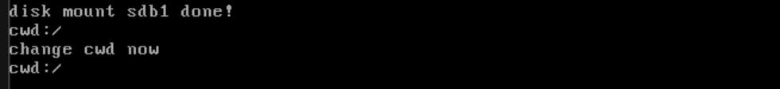

# 实现PWD

## 所以pwd

在 Linux 操作中，当我们使用 `cd` 命令进入子目录时，系统会更改当前的工作目录。而如果没有配置显示完整路径的 shell（通过修改 `$PS1` 变量），我们可以使用 `pwd` 命令来显示当前工作路径。

要理解 `pwd` 命令是如何实现的，我们需要考虑每个目录中都有一个特殊的目录项“..”，它表示父目录。因此，不论我们处于哪一级子目录，只要有了“..”，我们就可以沿着父目录一步一步向上找到根目录。

具体实现过程是，系统首先通过“..”来获取当前目录的父目录，然后在父目录中找到当前目录的目录项，通过目录项得到当前目录的名称。接着，系统继续向上查找父目录的父目录，并依此类推，最终构建出从根目录到当前目录的绝对路径。这就是 `pwd` 命令获取当前工作目录的基本原理。

```c
/* Gets the inode number of the parent directory of a given directory */
static uint32_t get_parent_dir_inode_nr(uint32_t child_inode_nr, void *io_buf)
{
    Inode *child_dir_inode = inode_open(cur_part, child_inode_nr);
    /* The directory entry for ".." includes the parent directory inode number,
       ".." is located in the first block of the directory */
    uint32_t block_lba = child_dir_inode->i_sectors[0];
    KERNEL_ASSERT(block_lba >= cur_part->sb->data_start_lba);
    inode_close(child_dir_inode);
    ide_read(cur_part->my_disk, block_lba, io_buf, 1);
    DirEntry *dir_e = (DirEntry *)io_buf;
    /* The first directory entry is ".", the second directory entry is ".." */
    KERNEL_ASSERT(dir_e[1].i_no < 4096 && dir_e[1].f_type == FT_DIRECTORY);
    return dir_e[1]
        .i_no; // Return the inode number of "..", which is the parent directory
}
```

咱们就在上面实现了工作目录获取的核心。

`get_parent_dir_inode_nr` 函数接受两个参数：子目录的 inode 编号 `child_inode_nr` 和缓冲区 `io_buf`，功能是获取父目录的 inode 编号。该函数通过子目录中的目录项 `..` 来实现。函数首先通过 `inode_open` 获取子目录的 inode，并将其地址保存在指针 `child_dir_inode` 中。目录项 `.` 和 `..` 是在执行 `sys_mkdir` 创建空目录时生成的，它们位于目录的第 0 个直接块中，即 `i_sectors[0]` 中。因此，函数将该块中的数据读入 `io_buf` 中。块中的第 0 个目录项是 `.`，第 1 个目录项是 `..`，函数返回第 1 个目录项的 inode 编号，然后结束。

`get_child_dir_name` 函数接受四个参数：父目录的 inode 编号 `p_inode_nr`、子目录的 inode 编号 `c_inode_nr`、存储路径的缓冲区 `path` 和硬盘读写缓冲区 `io_buf`，功能是在 inode 编号为 `p_inode_nr` 的目录中查找 inode 编号为 `c_inode_nr` 的子目录，并将子目录的名称存入缓冲区 `path`，成功返回 0，失败返回 -1。由于名称存储在目录项中，因此获取名称需要读取目录项所在的块。函数首先打开父目录的 inode，并将目录的所有块地址收集到 `all_blocks` 中。

函数遍历所有块，并在每个块中遍历所有目录项。如果发现某个目录项的 `i_no` 等于 `c_inode_nr`，则使用 `strcat` 将路径分隔符 `/` 追加到 `path` 中，然后将目录项的名称追加到 `/` 之后，最后返回 0，函数结束。需要注意的是，`get_child_dir_name` 每次只获取一层目录的名称，因此主调函数需要多次调用该函数来构建完整的绝对路径。每次调用时，`path` 中已经存储了部分路径，因此使用 `strcat` 进行路径拼接。

通过 `get_parent_dir_inode_nr` 和 `get_child_dir_name` 函数，系统能够高效地获取父目录的 inode 编号以及子目录的名称，从而支持目录树的构建和路径操作。

## sys_getcwd

​	集成上面的工作！我们需要修订一下TaskStruct

```c
/**
 * @brief Process Control Block (PCB) structure for threads and processes.
 *
 * This structure stores the execution context, scheduling information,
 * and resources associated with a thread or process.
 */
typedef struct
{
    uint32_t *self_kstack;         // Pointer to the kernel stack of the thread
    pid_t pid;                     // Process ID
    TaskStatus status;             // Current status of the thread
    char name[TASK_NAME_ARRAY_SZ]; // Name of the thread
    uint8_t priority;              // Thread priority level
    uint8_t ticks;                 // Time slices allocated per execution cycle
    uint32_t elapsed_ticks;        // Total CPU time consumed

    /**
     * @brief General list element for scheduling queues.
     *
     * Used to manage the thread in general scheduling queues.
     */
    list_elem general_tag;

    /**
     * @brief List element for all threads.
     *
     * Used to track all threads in the system.
     */
    list_elem all_list_tag;

    uint32_t *pg_dir;                   // Virtual address of process page directory
    VirtualMemoryHandle userprog_vaddr; // User process virtual memory space
    MemoryBlockDescriptor
        u_block_desc[DESC_CNT];                // User process memory block descriptors
    int32_t fd_table[MAX_FILES_OPEN_PER_PROC]; // File descriptors of opened files
    uint32_t cwd_inode_nr;                     // Inode number of the current working directory
    uint32_t stack_magic;                      // Stack boundary marker for overflow detection
} TaskStruct;
```

​	载初始化线程的时候给cwd_inode_nr一个0

```c
/* Initialize basic thread information */
void init_thread(TaskStruct *pthread, char *name, int prio) {
    k_memset(pthread, 0, sizeof(*pthread));
    pthread->pid = allocate_pid(); // Assign a new pid
    k_strcpy(pthread->name, name);

    if (pthread == main_thread) {
        /* Main thread is set to TASK_RUNNING since it's always running */
        pthread->status = TASK_RUNNING;
    } else {
        pthread->status = TASK_READY;
    }

    /* Initialize the thread's kernel stack */
    pthread->self_kstack = (uint32_t *)((uint32_t)pthread + PG_SIZE);
    pthread->priority = prio;
    pthread->ticks = prio; // Set the number of ticks based on priority
    pthread->elapsed_ticks = 0;
    pthread->pg_dir = NULL;

    init_fd_table(pthread);
    pthread->cwd_inode_nr = 0;       // root is default 
    pthread->stack_magic =
        TASK_MAGIC; // Custom magic number for stack validation
}
```

​	我们封装成系统调用：

```c
/* Writes the absolute path of the current working directory into the buffer
   buf, size is the size of buf. If buf is NULL, the operating system allocates
   memory for the working path and returns the address. Returns NULL on failure
 */
char *sys_getcwd(char *buf, uint32_t size)
{
    /* Ensure buf is not NULL, if the user's buf is NULL,
       the system call getcwd allocates memory for the user's process via malloc
     */
    KERNEL_ASSERT(buf);
    void *io_buf = sys_malloc(SECTOR_SIZE);
    if (!io_buf)
    {
        return NULL;
    }
    TaskStruct *cur_thread = current_thread();
    int32_t parent_inode_nr = 0;
    int32_t child_inode_nr = cur_thread->cwd_inode_nr;
    KERNEL_ASSERT(child_inode_nr >= 0 &&
           child_inode_nr < 4096); // Maximum 4096 inodes supported
    /* If the current directory is the root directory, return '/' */
    if (child_inode_nr == 0)
    {
        buf[0] = '/';
        buf[1] = 0;
        sys_free(io_buf);
        return buf;
    }

    k_memset(buf, 0, size);
    char full_path_reverse[MAX_PATH_LEN] = {0}; // Buffer for the full path

    /* Traverse upwards through the parent directories until the root directory
     * is found. When child_inode_nr is the inode number of the root directory
     * (0), stop, meaning we have processed all directory entries in the root
     * directory */
    while ((child_inode_nr))
    {
        parent_inode_nr = get_parent_dir_inode_nr(child_inode_nr, io_buf);
        if (get_child_dir_name(
                parent_inode_nr, child_inode_nr, full_path_reverse,
                io_buf) == -1)
        { // If name not found, fail and exit
            sys_free(io_buf);
            return NULL;
        }
        child_inode_nr = parent_inode_nr;
    }
    KERNEL_ASSERT(k_strlen(full_path_reverse) <= size);
    /* Now full_path_reverse contains the path in reverse order,
     * i.e., child directory is at the front (left), parent directory at the
     * back (right), reverse the path */
    char *last_slash; // To store the address of the last slash in the string
    while ((last_slash = k_strrchr(full_path_reverse, '/')))
    {
        uint16_t len = k_strlen(buf);
        k_strcpy(buf + len, last_slash);
        /* Add the null terminator in full_path_reverse to act as the boundary
         * for the next strcpy */
        *last_slash = 0;
    }
    sys_free(io_buf);
    return buf;
}
```

`sys_getcwd` 函数接受两个参数：存储绝对路径的缓冲区 `buf` 和缓冲区大小 `size`，功能是将当前工作目录的绝对路径写入 `buf`，成功时返回 `buf` 的地址，失败时返回 `NULL`。函数开头通过 `ASSERT(buf != NULL)` 确保 `buf` 不为空。`buf` 可以由用户进程提供，也可以由操作系统提供。如果用户进程传入的 `buf` 为 `NULL`，系统调用 `getcwd` 会通过 `malloc` 为 `buf` 分配内存。接着，函数为缓冲区 `io_buf` 申请 1 扇区大小的内存。

函数获取当前任务工作目录的 inode 编号，即存储在 `pcb` 中的 `cwd_inode_nr`，并将其赋值给 `child_inode_nr`。如果 `child_inode_nr` 为 0，表示当前目录是根目录，函数直接将 `buf` 设置为 `/` 并返回。

函数定义了一个数组 `full_path_reverse[MAX_PATH_LEN]`，用于存储工作目录的绝对路径的反转形式。注意，这里反转的是目录的顺序，而不是目录名本身。例如，原路径为 `/ab/c`，在 `full_path_reverse` 中存储为 `/c/ab`。

函数从当前目录开始，逐层向上回溯，直到找到根目录。在每次循环中，函数调用 `get_parent_dir_inode_nr` 获取父目录的 inode 编号，并将其存入 `parent_inode_nr`。接着，函数调用 `get_child_dir_name` 将当前工作目录的名称写入 `full_path_reverse` 中。然后，函数将 `child_inode_nr` 更新为 `parent_inode_nr`，开始下一轮循环。

循环结束后，`full_path_reverse` 中存储了绝对路径的反转形式。函数通过 `while` 循环逐层解析目录名，将最终的路径写入 `buf` 中。通过 `sys_getcwd` 函数，系统能够高效地获取当前工作目录的绝对路径，并确保路径的正确性和完整性。

## 测试

```c
int main(void)
{
    init_all();
    char cwd_buf[32] = {0}; 
    sys_getcwd(cwd_buf, 32); 
    printf("cwd:%s\n", cwd_buf); 
    sys_chdir("/dir1"); 
    printf("change cwd now\n"); 
    sys_getcwd(cwd_buf, 32); 
    printf("cwd:%s\n", cwd_buf);
    
    while (1)
        ;
    return 0;
}
```



## 下一篇

[实现文件的stat功能](./13.10_stat.md)

