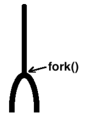

# 实现fork

## 所以，你是说——叉子？

​	欸！真不是，不是叉子啊！您英文太好了，实际上这个是Linux/Unix中非常出名的一个东西。用来实现进程分叉的

​	在Linux中，fork函数的原型是pid_t fork(void)，返回值是数字，该数字有可能是子进程的pid，也有可能是0，也有可能是-1。这是因为Linux中没有直接获取子进程pid的方法，因此为了让父进程知道它的子进程是谁，fork函数会返回子进程的pid给父进程。子进程则通过系统调用getppid获取父进程的pid，而且没有pid为0的进程，因此fork会给子进程返回0，区分父子进程。如果fork调用失败，则返回-1，意味着没有创建子进程。

​	fork之后，一个进程变成了两个进程，这也说明了fork的作用是克隆进程。fork使得程序从一个进程变成了两个进程，内存中因此多出了一个进程，且每个进程都有独立的地址空间，执行的是相同的代码，但它们各自从fork调用后的代码开始执行。父进程继续执行fork后的代码，而子进程则从fork返回后开始执行。虽然父子进程执行相同的代码，但它们的执行流是独立的，这意味着父子进程在fork后开始有不同的执行路径。

​	程序在磁盘上是静态的文件，而进程则是程序被加载到内存中后，作为运行中的程序映像。父子进程的内存体积（代码段、数据段等）完全相同，实际上它们就是同一个程序的两个独立实例。在执行时，虽然两者执行的代码是相同的，但由于它们的执行路径不同，具体的执行分支也不同。通过fork函数，我们创建了一个与父进程一模一样的子进程。父子进程各自独立，拥有独立的地址空间，它们执行的是完全一样的代码。只有在逻辑上，基于pid的判断来区分父子进程的不同执行路径，但这只是程序的设计需要，实际上fork的作用就是克隆一个独立的进程。



进程的资源可以概括为以下几类：

1. 进程控制块（PCB），即 `task_struct`，它相当于进程的“身份证”，包含了进程的基本信息和状态。
2. 程序体，包括代码段和数据段等，它构成了进程的实际内容，是进程的“身体”。
3. 用户栈，进程的局部变量和函数调用栈都存在其中。
4. 内核栈，进程进入内核态时，用来保存上下文环境，同时也用于执行内核代码时的栈空间。
5. 虚拟地址池，每个进程拥有独立的虚拟地址空间，这些地址空间通过虚拟地址池来管理。
6. 页表，帮助进程管理其虚拟地址空间并实现虚拟地址到物理地址的映射。

在 fork 操作中，操作系统会复制上述资源，生成一个与父进程相似的子进程。要使新进程能够执行，只需要将它加入到就绪队列中，并准备好相应的栈，以便它能够正确执行。

在代码实现过程中，需要先做一些基础设施的准备。首先，在 `task_struct` 结构体中增加一个成员变量 `parent_pid`，表示该进程的父进程 PID。默认情况下，父进程的 PID 设置为 `-1`，表示没有父进程。接着，在 `thread.c` 中，定义一个简单的 `fork_pid` 函数来分配 PID。这个函数内部调用了 `allocate_pid`，因为 `allocate_pid` 是一个静态函数，外部无法直接调用，所以我们通过 `fork_pid` 进行封装。这些改动和准备工作为后续 fork 的实现奠定了基础。

通过这种方式，fork 就能在父进程的基础上创建出一个新的子进程，并让子进程从合适的位置开始执行。

## 实现fork

### 安装一个针对fork的虚拟地址位图无需操作的mappings

```c
/* Install a single page of vaddr, specifically for cases where the virtual
 * address bitmap does not need to be modified during a fork */
void *get_a_page_without_opvaddrbitmap(PoolFlag pf, uint32_t vaddr) {
    MemoryPool *mem_pool = pf & PF_KERNEL ? &kernel_pool : &user_pool;
    lock_acquire(&mem_pool->lock);
    void *page_phyaddr = palloc(mem_pool);
    if (!page_phyaddr) {
        lock_release(&mem_pool->lock);
        return NULL;
    }
    page_table_add((void *)vaddr, page_phyaddr);
    lock_release(&mem_pool->lock);
    return (void *)vaddr;
}
```

 `get_a_page_without_opvaddrbitmap`函数用于为指定的虚拟地址 `vaddr` 分配一页物理内存页，且在分配过程中不修改虚拟地址位图，主要用于 `fork` 操作中的特定情况。

首先，根据 `pf` 标志来判断使用的内存池。如果 `pf` 为 `PF_KERNEL`，则使用内核内存池 `kernel_pool`，否则使用用户内存池 `user_pool`。接着，函数通过 `lock_acquire` 获取相应内存池的锁，确保在分配内存页时不会出现竞态条件。

然后，调用 `palloc` 函数从内存池中分配一页物理内存，如果分配失败，释放锁并返回 `NULL`。如果分配成功，使用 `page_table_add` 将分配到的物理内存页映射到指定的虚拟地址 `vaddr` 上。最后，释放内存池的锁，并返回映射后的虚拟地址 `vaddr`。

## 实现fork的核心

```c
extern void intr_exit(void);

/* Copy parent process's PCB, virtual address bitmap, and stack to child process
 */
static int32_t copy_pcb_vaddrbitmap_stack0(TaskStruct *child_thread,
                                           TaskStruct *parent_thread) {
    /* Copy the entire page containing PCB information and level 0 stack, then
     * modify individual parts */
    k_memcpy(child_thread, parent_thread,
           PG_SIZE);                 // Copy parent process's PCB information
    child_thread->pid = fork_pid(); // Assign a PID to the child process
    child_thread->elapsed_ticks =
        0; // Initialize the child process's elapsed ticks
    child_thread->status = TASK_READY; // Set the child process status to ready
    child_thread->ticks =
        child_thread->priority; // Allocate the time slice to the child process
    child_thread->parent_pid =
        parent_thread->pid; // Set the parent PID for the child process
    child_thread->general_tag.prev = child_thread->general_tag.next =
        NULL; // Initialize task list links
    child_thread->all_list_tag.prev = child_thread->all_list_tag.next = NULL;
    block_desc_init(
        child_thread->u_block_desc); // Initialize memory block descriptors for
                                     // the child process

    /* Copy the virtual address bitmap of the parent process */
    uint32_t bitmap_pg_cnt =
        ROUNDUP((0xc0000000 - USER_VADDR_START) / PG_SIZE / 8, PG_SIZE);
    void *vaddr_btmp =
        get_kernel_pages(bitmap_pg_cnt); // Allocate kernel pages for the bitmap
    if (!vaddr_btmp)
        return -1; // Return error if memory allocation fails

    /* Copy the virtual address bitmap to the child process's allocated memory
     */
    k_memcpy(vaddr_btmp, child_thread->userprog_vaddr.vaddr_bitmap.bits,
           bitmap_pg_cnt * PG_SIZE);
    child_thread->userprog_vaddr.vaddr_bitmap.bits = vaddr_btmp;

    return 0;
}

```

`copy_pcb_vaddrbitmap_stack0` 函数接受两个参数：子进程 `child_thread` 和父进程 `parent_thread`，功能是将父进程的 `pcb` 和虚拟地址位图拷贝给子进程。函数开头通过 `memcpy` 将父进程的 `pcb` 及其内核栈一同复制给子进程。接着，函数单独修改子进程 `pcb` 中的属性值。

函数通过 `fork_pid` 为子进程分配新的 `pid`，并将子进程的 `status` 设置为 `TASK_READY`，以便调度器 `schedule` 安排其上 CPU。此外，函数将子进程的时间片 `ticks` 设置为 `child_thread->priority`，为其加满时间片，并将 `parent_pid` 设置为 `parent_thread->pid`。

子进程使用 `child_thread->userprog_vaddr.vaddr_bitmap.bits` 来管理其虚拟地址空间。此时，该指针仍然指向父进程虚拟地址位图所在的内核页框。由于每个进程都有独立的 4GB 虚拟地址空间，子进程不能与父进程共用同一个虚拟地址位图。因此，函数需要复制父进程的虚拟地址位图给子进程。

函数通过 `block_desc_init(child_thread->u_block_desc)` 初始化子进程的内存块描述符。如果没有这行代码，子进程会继承父进程的块描述符，导致在分配内存时触发缺页异常。

函数计算虚拟地址位图所需的页框数 `bitmap_pg_cnt`，并申请 `bitmap_pg_cnt` 个内核页框来存储位图。接着，函数完成虚拟地址位图的复制。通过 `copy_pcb_vaddrbitmap_stack0` 函数，系统能够高效地复制父进程的 `pcb` 和虚拟地址位图，确保子进程拥有独立的虚拟地址空间和正确的初始化状态。

```c
/* Copy the child process's code, data, and user stack from the parent process
 */
static void copy_body_stack3(TaskStruct *child_thread,
                             TaskStruct *parent_thread, void *buf_page) {
    uint8_t *vaddr_btmp = parent_thread->userprog_vaddr.vaddr_bitmap.bits;
    uint32_t btmp_bytes_len =
        parent_thread->userprog_vaddr.vaddr_bitmap.btmp_bytes_len;
    uint32_t vaddr_start = parent_thread->userprog_vaddr.vaddr_start;
    uint32_t idx_byte = 0;
    uint32_t idx_bit = 0;
    uint32_t prog_vaddr = 0;

    /* Scan the parent process's user space for allocated pages */
    while (idx_byte < btmp_bytes_len) {
        if (vaddr_btmp[idx_byte]) { // If the page is allocated in the bitmap
            idx_bit = 0;
            while (idx_bit < 8) {
                if ((BITMAP_MASK << idx_bit) & vaddr_btmp[idx_byte]) {
                    prog_vaddr =
                        (idx_byte * 8 + idx_bit) * PG_SIZE + vaddr_start;

                    /* Copy data from the parent process's user space to the
                    kernel buffer buf_page so that it can be copied to the child
                    process's space after page table switch */
                    k_memcpy(buf_page, (void *)prog_vaddr, PG_SIZE);

                    /* Switch to the child process's page table to prevent
                     * modifying the parent process's page table */
                    page_dir_activate(child_thread);

                    /* Allocate virtual address prog_vaddr for the child process
                     */
                    get_a_page_without_opvaddrbitmap(PF_USER, prog_vaddr);

                    /* Copy data from the kernel buffer to the child process's
                     * user space */
                    k_memcpy((void *)prog_vaddr, buf_page, PG_SIZE);

                    /* Switch back to the parent process's page table */
                    page_dir_activate(parent_thread);
                }
                idx_bit++;
            }
        }
        idx_byte++;
    }
}

```

`copy_body_stack3` 函数接受三个参数：子进程 `child_thread`、父进程 `parent_thread` 和页缓冲区 `buf_page`。`buf_page` 必须是内核页，用于作为所有进程的数据共享缓冲区。函数的主要功能是复制子进程的进程体及用户栈，即将父进程的代码和数据资源复制到子进程中。

由于进程拥有 4GB 的虚拟地址空间，其中低 3GB 是用户空间，直接复制整个 3GB 用户空间既不现实也不高效。因此，函数只复制用户空间中有效的部分，即有数据的部分。用户使用的内存通过虚拟内存池管理，即 `pcb` 中的 `userprog_vaddr`，包括进程体占用的内存、堆中申请的内存和用户栈内存。进程的内存布局中，低地址处是数据段和代码段，其余部分是堆和栈的空间。堆从低地址向高地址发展，栈从 `USER_STACK3_VADDR`（即 `0xc0000000 - 0x1000`）向低地址发展。由于它们的分布不连续，函数需要遍历虚拟地址位图中的每一位，以找出进程正在使用的内存。

函数首先将各种变量指向父进程虚拟内存池相关的参数或值，为后续遍历做准备。接着，函数开始寻找父进程占用的内存。由于各用户进程的低 3GB 空间是独立的，无法直接互相访问，因此函数需要借助内核空间作为数据中转。具体方法是：在父进程虚拟地址空间中每找到一页占用的内存，就在子进程的虚拟地址空间中分配一页内存，然后将 `buf_page` 中父进程的数据复制到为子进程新分配的虚拟地址空间页中。由于采用一页一页的对拷方式，`buf_page` 只需 1 页大小即可。

在分配内存时，函数需要确保页表中的 `pte` 和 `pde` 创建在子进程的页目录表中。因此，在将 `buf_page` 的数据拷贝到子进程之前，函数会调用 `page_dir_activate(child_thread)` 激活子进程的页表，然后调用 `get_a_page_without_opvaddrbitmap(PF_USER, prog_vaddr)` 为子进程分配一页内存，接着调用 `memcpy((void*)prog_vaddr, buf_page, PG_SIZE)` 完成内核空间到子进程空间的复制，最后调用 `page_dir_activate(parent_thread)` 恢复父进程的页表。函数通过循环逐页复制父进程占用的虚拟空间，直到完成用户栈的复制。

通过 `copy_body_stack3` 函数，系统能够高效地复制父进程的进程体和用户栈，确保子进程拥有独立的虚拟地址空间和正确的初始化状态。

```c
/* Build the child process's thread stack and set return value */
static int32_t build_child_stack(TaskStruct *child_thread) {
    /* a Set the child process's PID return value to 0 */
    Interrupt_Stack *intr_0_stack =
        (Interrupt_Stack *)((uint32_t)child_thread + PG_SIZE -
                            sizeof(Interrupt_Stack));
    intr_0_stack->eax = 0; // Set the return value of the child process to 0

    /* b Build the ThreadStack for switch_to, placed below the interrupt stack
     */
    uint32_t *ret_addr_in_thread_stack = (uint32_t *)intr_0_stack - 1;

    /***   These lines are not necessary but help to clarify the thread_stack
     * structure ***/
    uint32_t *esi_ptr_in_thread_stack = (uint32_t *)intr_0_stack - 2;
    uint32_t *edi_ptr_in_thread_stack = (uint32_t *)intr_0_stack - 3;
    uint32_t *ebx_ptr_in_thread_stack = (uint32_t *)intr_0_stack - 4;
    /**********************************************************/

    /* Set the stack pointer (ebp) in the thread stack as the top of the stack
     * for switch_to */
    uint32_t *ebp_ptr_in_thread_stack = (uint32_t *)intr_0_stack - 5;

    /* Update the return address for switch_to to intr_exit, so the program
     * returns from interrupt */
    *ret_addr_in_thread_stack = (uint32_t)intr_exit;

    /* These assignments are just to make the thread_stack clearer; they are not
    strictly needed, as they will be overwritten by subsequent pops during
    interrupt return */
    *ebp_ptr_in_thread_stack = *ebx_ptr_in_thread_stack =
        *edi_ptr_in_thread_stack = *esi_ptr_in_thread_stack = 0;
    /*********************************************************/

    /* Set the top of the thread_stack as the stack pointer to be restored
     * during switch_to */
    child_thread->self_kstack = ebp_ptr_in_thread_stack;
    return 0;
}
```

函数 `build_child_stack` 的作用是为子进程构造 thread_stack，并设置合适的返回值，使子进程能从 fork 调用后继续执行。fork 系统调用会使父进程进入内核态，在中断入口中保存了父进程的上下文，包括返回地址，因此父进程能在 fork 返回后接着执行。为了让子进程也具备同样的能力，内核通过复制父进程的内核栈给子进程，保留了该返回地址，但这还不够，因为子进程将通过调度器调度执行，必须借助 switch_to 函数，而 switch_to 要从 thread_stack 中恢复上下文。因此，函数先定位到子进程内核栈中 intr_stack 的地址，并将其中 eax 寄存器的值设为 0，表示 fork 在子进程中的返回值为 0。接着，函数在 intr_stack 栈顶之下构造出 thread_stack，把 intr_exit 的地址放入 eip 位置上，这意味着当子进程被调度时，将从 intr_exit 返回，从而模拟从中断中恢复的效果。函数还将构造出的 thread_stack 栈顶地址保存到 pcb 的 self_kstack 成员中，供 switch_to 使用。这样，子进程被调度时就能通过 thread_stack 恢复寄存器并跳转到 intr_exit，最终达到从 fork 后继续执行的目的。整个流程核心在于复制上下文并精心设置返回路径，确保子进程逻辑上看起来像是从 fork 返回后立即开始运行。

```c
/* Update inode open count */
static void update_inode_open_cnts(TaskStruct *thread) {
    int32_t local_fd = 3, global_fd = 0;
    while (local_fd < MAX_FILES_OPEN_PER_PROC) {
        global_fd = thread->fd_table[local_fd];
        KERNEL_ASSERT(global_fd < MAX_FILE_OPEN);
        if (global_fd != -1) {
            file_table[global_fd].fd_inode->i_open_cnts++; // Increment inode open count for
                                      // regular files
        }
        local_fd++;
    }
}

```

`update_inode_open_cnts` 函数的目的是更新子进程打开的文件的 inode 引用计数。该函数遍历子进程的文件描述符表，检查每个打开的文件，并增加相应文件的 inode 的打开计数（`i_open_cnts`）。这样做是为了确保每个文件的 inode 引用计数准确，防止在父子进程间共享文件时发生错误。

```c
/* Copy the resources occupied by the parent process to the child process */
static int32_t copy_process(TaskStruct *child_thread,
                            TaskStruct *parent_thread) {
    /* Kernel buffer to temporarily hold data from parent process's user space
     * to be copied to the child process */
    void *buf_page = get_kernel_pages(1);
    if (!buf_page) {
        return -1;
    }

    /* a Copy the parent's PCB, virtual address bitmap, and kernel stack to the
     * child process */
    if (copy_pcb_vaddrbitmap_stack0(child_thread, parent_thread) == -1) {
        return -1;
    }

    /* b Create a page table for the child process, which only includes kernel
     * space */
    child_thread->pg_dir = create_page_dir();
    if (!(child_thread->pg_dir)) {
        return -1;
    }

    /* c Copy the parent process's code and user stack to the child process */
    copy_body_stack3(child_thread, parent_thread, buf_page);

    /* Continue with other operations such as setting up the child thread's
     * stack and updating inode counts */
    build_child_stack(child_thread);
    update_inode_open_cnts(child_thread);

    mfree_page(PF_KERNEL, buf_page, 1);
    return 0;
}
```

函数 `copy_process` 是 fork 实现中的核心步骤之一，它的任务是将父进程的所有关键资源复制给子进程。它接受两个参数，分别是子进程 `child_thread` 和父进程 `parent_thread`，实现的是从父进程派生出一个新的子进程。函数开始时会申请一页内核空间作为中间缓冲区 `buf_page`，用于在复制过程中临时存储数据。接下来通过 `copy_pcb_vaddrbitmap_stack0` 将父进程的任务控制块（PCB）、虚拟地址位图和内核栈整体复制到子进程，确保子进程拥有与父进程一致的结构和内核栈内容。随后调用 `create_page_dir` 为子进程创建独立的页目录，这意味着子进程拥有属于自己的虚拟内存空间，是进程隔离的关键步骤。之后通过 `copy_body_stack3` 将父进程的代码段、数据段和用户栈复制到子进程对应的地址空间，确保子进程从逻辑上执行的代码和数据与父进程一致。接着调用 `build_child_stack` 构建子进程的 thread_stack，使其在被调度时能够正确地从 intr_exit 返回并继续执行 fork 后的代码。然后调用 `update_inode_open_cnts` 更新当前打开文件的 inode 引用计数，表示这些文件现在也被子进程引用。所有步骤完成后释放临时的 `buf_page`。

而 `sys_fork` 是 fork 系统调用在内核中的具体实现。它没有参数，功能是克隆当前进程。函数首先调用 `get_kernel_pages(1)` 分配一页内核空间作为子进程的 PCB 和内核栈使用。然后调用 `copy_process` 将父进程的所有内容复制到新分配的子进程结构中。之后将子进程加入就绪队列和所有任务队列中，使其具备被调度运行的资格。最终，函数返回子进程的 PID 给父进程，而子进程通过 `build_child_stack` 构造的返回值为 0，从而父子进程可以根据返回值进行不同路径的执行。整个流程体现了 Linux 中通过结构复制和上下文模拟来实现进程克隆的思想。

## 最后一击

```c
/* Fork the child process. Kernel threads cannot directly call this function */
pid_t sys_fork(void) {
    TaskStruct *parent_thread = current_thread();
    TaskStruct *child_thread =
        get_kernel_pages(1); // Create PCB for the child process
    if (!child_thread) {
        return -1; // Return error if memory allocation fails
    }
    KERNEL_ASSERT(INTR_OFF == get_intr_status() && parent_thread->pg_dir);

    /* Copy resources from the parent process to the child process */
    if (copy_process(child_thread, parent_thread) == -1) {
        return -1;
    }

    /* Add the child process to the ready thread list and all thread list,
     * allowing the scheduler to manage it */
    KERNEL_ASSERT(!elem_find(&thread_ready_list, &child_thread->general_tag));
    list_append(&thread_ready_list, &child_thread->general_tag);
    KERNEL_ASSERT(!elem_find(&thread_all_list, &child_thread->all_list_tag));
    list_append(&thread_all_list, &child_thread->all_list_tag);

    return child_thread
        ->pid; // Return the PID of the child process to the parent
}
```

`sys_fork` 函数实现了创建子进程的功能，首先获取当前进程的 PCB（即 `parent_thread`）。然后为子进程分配内存，并创建一个新的 PCB。如果内存分配失败，函数会返回 `-1`。接下来，使用 `copy_process` 函数将父进程的资源（如 PCB、虚拟地址、内核栈等）复制到子进程中。如果复制过程中出错，同样会返回 `-1`。函数随后将子进程添加到就绪队列和所有进程队列中，确保调度器能够管理它。最后，返回子进程的 PID。需要注意的是，内核线程不能直接调用这个函数，且该函数的执行要求中断处于关闭状态，并且父进程已经拥有页表。

​	我们马上就要有init进程了：修改我们的进程子系统创建函数：

```
    verbose_ccputs("thread_init start\n");

    list_init(&thread_ready_list); // Initialize the ready list
    list_init(&thread_all_list);   // Initialize the all threads list
    lock_init(&pid_lock);

    create_process(init, "init"); 
    /* Create the main thread */
    make_main_thread();

    /* Create the idle thread */
    idle_thread = thread_start("idle", 10, idle, NULL);

    verbose_ccputs("thread_init done\n");
```

​	直接添加一个init函数:`create_process(init, "init"); `就完事了

## 测试

```c
#include "include/device/console_tty.h"
#include "include/kernel/init.h"
#include "include/library/kernel_assert.h"
#include "include/thread/thread.h"
#include "include/user/stdio/stdio.h"
#include "include/memory/memory.h"
#include "include/library/ccos_print.h"
#include "include/filesystem/filesystem.h"
#include "include/library/string.h"
#include "include/filesystem/dir.h"
#include "include/syscall/syscall.h"
// void thread_a(void *args);
// void thread_b(void *args);
// void u_prog_a(void);
// void u_prog_b(void);
// int prog_a_pid = 0, prog_b_pid = 0;
// init process here
void init(void);

int main(void)
{
    init_all();
    while(1);
}

// init process here
void init(void)
{
    uint32_t ret_pid = fork();
    if (ret_pid)
    {
        printf("i am father, my pid is %d, child pid is %d\n", getpid(), ret_pid);
    }
    else
    {
        printf("i am child, my pid is %d, ret pid is %d\n", getpid(), ret_pid);
    }
    while (1)
        ;
}

```


## 下一篇

[简单的shell](./14.2_simple_shell.md)


