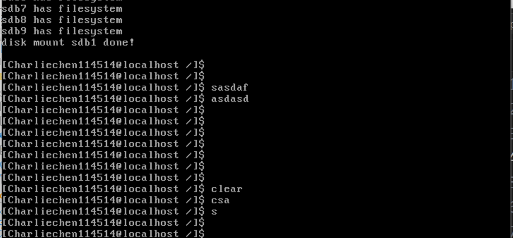

# 实现一个简单的shell

​	我们下面来实现一个简单的shell

## 添加 read 系统调用，获取键盘输入 :sys_read

```c
/* Read count bytes from the file pointed to by file descriptor fd into buf,
 * return the number of bytes read on success, return -1 if end of file is
 * reached
 */
int32_t sys_read(int32_t fd, void *buf, uint32_t count)
{
    KERNEL_ASSERT(buf);
    int32_t ret = -1;
    uint32_t global_fd = 0;
    if (fd < 0 || fd == stdout_no || fd == stderr_no)
    {
        ccos_printk("sys_read: fd error\n");
    }
    else if (fd == stdin_no)
    {
        char *buffer = buf;
        uint32_t bytes_read = 0;
        while (bytes_read < count)
        {
            *buffer = ioq_getchar(&keyboard_ringbuffer);
            bytes_read++;
            buffer++;
        }
        ret = (bytes_read == 0 ? -1 : (int32_t)bytes_read);
    }
    else
    {
        global_fd = fd_local2global(fd);
        ret = file_read(&file_table[global_fd], buf, count);
    }
    return ret;
}
```

​	我们终于跟老朋友见面了。我们修订一下:sys_read，现在实现了读取文件的功能。它首先检查传入的 `buf` 指针是否有效。如果文件描述符 `fd` 无效（例如小于0或者是标准输出、标准错误），则会打印错误信息。如果文件描述符是标准输入（`stdin_no`），函数会从键盘输入的缓冲区 `keyboard_ringbuffer` 中读取字符，将其存入 `buf` 中，直到读取指定的字节数或达到文件末尾。函数会返回成功读取的字节数，如果没有读取到任何数据，返回 `-1`。如果文件描述符不是标准输入，函数会根据 `fd` 获取对应的文件，并调用 `file_read` 函数来执行实际的读取操作，并返回成功读取的字节数。如果文件读取失败，返回 `-1`。

```c
int32_t read(int32_t fd, void *buf, uint32_t count)
{
    return _syscall3(SYS_READ, fd, buf, count);
}
```

## putchar和clear

​	这个把我们之前做的工作编程系统调用即可

```c
/* Outputs a character */
void putchar(char char_asci) {
    _syscall1(SYS_PUTCHAR, char_asci);
}
/* Clears the screen */
void clear(void) {
    _syscall0(SYS_CLEAR);
}

void sys_putchar(char char_asci)
{
    console__ccos_putchar(char_asci);
}


/* Initialize the system call table */
void syscall_init(void) {
    verbose_ccputs(
        "syscall_init start\n"); // Logging the start of syscall initialization
    /* Set the system call table entries for various system call numbers */
    syscall_table[SYS_GETPID] = sys_getpid; // Get process ID
    syscall_table[SYS_WRITE] = sys_write;   // Write to console
    syscall_table[SYS_MALLOC] = sys_malloc; // Memory allocation
    syscall_table[SYS_FREE] = sys_free;     // Free allocated memory
    syscall_table[SYS_FORK] = sys_fork;     // Fork a new process
    syscall_table[SYS_READ] = sys_read;
    syscall_table[SYS_PUTCHAR] = sys_putchar;
    syscall_table[SYS_CLEAR] = clean_screen;
    verbose_ccputs("syscall_init done\n"); // Logging the completion of syscall
                                          // initialization
}
```

## 上班：实现一个简单的shell

```c
#include "include/user/ccshell/ccshell.h"
#include "include/defines.h"
#include "include/filesystem/file.h"
#include "include/library/string.h"
#include "include/library/types.h"
#include "include/syscall/syscall.h"
#include "include/user/stdio/stdio.h"
#include "include/filesystem/filesystem_settings.h"
#include "include/user/library/user_assertion.h"
#define CMD_LEN MAX_PATH_LEN
#define MAX_ARG_NR (16)

/* Stores the input command */
static char cmd_line[CMD_LEN] = {0};

/* Used to record the current directory; it is updated every time the cd command
 * is executed */
char cwd_cache[MAX_PATH_LEN] = {0};

/* Outputs the shell prompt */
void print_prompt(void)
{
    printf("[" HOST_NAME "@localhost %s]$ ", cwd_cache);
}

/* Reads up to 'count' bytes from the keyboard buffer into 'buf' */
static void readline(char *buf, int32_t count)
{
    user_assert(buf && count > 0);
    char *pos = buf;

    while (read(stdin_no, pos, 1) != -1 &&
           (pos - buf) < count)
    { // Read until enter key is found
        switch (*pos)
        {
            /* If enter or newline is found, treat it as the end of the command
             */
        case '\n':
        case '\r':
            *pos = 0; // Add null terminator to cmd_line
            putchar('\n');
            return;

        case '\b':
            if (cmd_line[0] != '\b')
            {          // Prevent deleting non-inputted data
                --pos; // Move back to the previous character in the buffer
                putchar('\b');
            }
            break;

        /* For other characters, output normally */
        default:
            putchar(*pos);
            pos++;
        }
    }
    printf("readline: can't find enter_key in the cmd_line, max num of char is "
           "128\n");
}
```

​	先说说readline:这段代码实现了一个从键盘缓冲区读取用户输入的功能。函数`readline`的作用是从输入流中读取字符，直到遇到回车键（`\n` 或 `\r`）为止，或者读取达到指定的字节数限制。读取的内容会存储到`buf`中。具体步骤如下：

1. 函数首先检查传入的缓冲区指针`buf`是否有效，并确认`count`大于0。
2. `while`循环会持续读取一个字符（通过`read(stdin_no, pos, 1)`），直到读取到回车键或达到指定的字符数量（`count`）。读取的字符会存储在`buf`中。
3. 当遇到回车符（`\n` 或 `\r`）时，表示用户输入完成，此时将当前位置字符设置为`'\0'`，并输出换行符，表示命令输入结束。
4. 如果遇到退格符（`\b`），程序会检查输入内容是否为空。如果不为空，指针会退回一个字符，删除命令行中的最后一个字符，并输出退格符。此功能允许用户删除输入的字符。
5. 其他字符直接输出并追加到`pos`指向的位置，继续读取下一个字符。
6. 如果没有在指定字符数内读取到回车键，则会输出错误提示，表明命令行输入超出了最大字符限制。

这个函数的设计使得用户可以在命令行中输入命令，且支持基本的退格功能，直到按下回车键为止。

​	ccshell是我们的核心：

```c
void ccshell(void)
{
    cwd_cache[0] = '/';
    while (1)
    {
        print_prompt();
        k_memset(cmd_line, 0, CMD_LEN);
        readline(cmd_line, CMD_LEN);
        if (cmd_line[0] == 0)
        {
            continue;
        }
    }
    user_panic("Man!: you should not be here!!!");
}
```

这段代码实现了一个简单的命令行shell功能。函数`ccshell`定义了一个无限循环，其中每次循环都会显示提示符，等待用户输入命令。命令输入通过`readline`函数完成，读取用户输入并存储到`cmd_line`中。每次读取命令之前，`cmd_line`会被清空，确保新命令不会受到旧命令的影响。如果用户没有输入命令，程序会跳过本次循环。当用户输入命令时，如果命令不为空，程序会继续执行。虽然代码没有明确的退出机制，但如果程序异常执行到`user_panic("Man!: you should not be here!!!")`，说明发生了错误。

## 测试上电

```c
#include "include/device/console_tty.h"
#include "include/kernel/init.h"
#include "include/library/kernel_assert.h"
#include "include/thread/thread.h"
#include "include/user/stdio/stdio.h"
#include "include/memory/memory.h"
#include "include/library/ccos_print.h"
#include "include/filesystem/filesystem.h"
#include "include/library/string.h"
#include "include/filesystem/dir.h"
#include "include/syscall/syscall.h"
#include "include/user/ccshell/ccshell.h"
void init(void);

int main(void)
{
    init_all();
    while(1);
}

// init process here
void init(void)
{
    uint32_t ret_pid = fork();
    if (ret_pid)
    {
        while(1);
    }
    else
    {
        ccshell();
    }
    while (1)
        ;
}

```



​	注意多敲几下键盘，因为输出非常多。

## 下一篇

[更好的shell](./14.3_better_shell.md)
