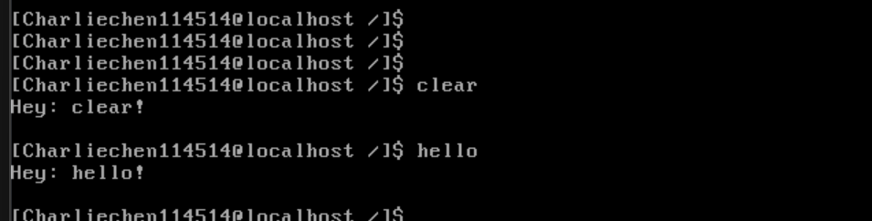

# 实现更好的shell

## 添加ctrl + u和ctrl + l快捷键

在 Linux 系统中，快捷键如“Ctrl+u”和“Ctrl+l”是由操作系统提供的标准功能，但它们的实现方式并不是直接由键盘驱动程序（keyboard.c）来处理的。这是因为键盘驱动程序是一个较低层次的程序，它的主要任务是处理硬件中断并将最原始的按键信息传递给更高层次的系统程序。如果直接在键盘驱动中处理快捷键，会导致以下问题：

1. **中断过多的问题**：每按一个键就会产生两个中断（一个是按下时的通码中断，另一个是释放时的断码中断）。如果在键盘驱动程序中加入过多的逻辑处理，会导致系统的中断处理变得非常复杂，效率降低，进而影响整个系统的响应速度。
2. **保留原始数据**：键盘驱动程序应当尽可能保留原始的键盘输入数据，确保上层程序能够根据需要进行适当的处理。快捷键的处理通常属于更高层的任务，例如在终端或 shell 中处理输入，因此键盘驱动程序不会直接处理快捷键。

为了实现“Ctrl+u”和“Ctrl+l”的功能，快捷键的具体处理应当交给更高层的应用程序或用户界面程序，而不是键盘驱动程序。这些快捷键的功能与屏幕输入和显示的控制相关。例如：

- **Ctrl+u**：用于清除当前输入，可以通过捕获“Ctrl+u”并清空当前行的输入缓冲区来实现。
- **Ctrl+l**：用于清屏，清除终端显示但不影响当前输入的内容。实现时，只需要清空显示缓冲区，而不修改输入缓冲区。

这些功能的实现通常会依赖于用户空间的程序，比如 shell 或终端模拟器。通过捕获键盘事件并进行相应的处理，这些快捷键可以在用户交互过程中提供更好的体验。

​	所以让我们看看：

```
        // Add the character to the buffer if it is not null
        if (cur_char) {

            // Handle shortcut keys Ctrl+L and Ctrl+U
            if ((ctrl_down_last && cur_char == 'l') ||
                (ctrl_down_last && cur_char == 'u')) {
                cur_char -= 'a'; // Map to non-printable ASCII values
            }

            // Add the character to the keyboard buffer if it's not full
            if (!ioq_full(&keyboard_ringbuffer)) {
                ioq_putchar(&keyboard_ringbuffer, cur_char);
            }
            return;
```

​	就是在这个地方上！

## 修订readline

```c
/* Reads up to 'count' bytes from the keyboard buffer into 'buf' */
static void readline(char *buf, int32_t count)
{
    user_assert(buf && count > 0);
    char *pos = buf;

    while (read(stdin_no, pos, 1) != -1 &&
           (pos - buf) < count)
    { // Read until enter key is found
        switch (*pos)
        {
            /* If enter or newline is found, treat it as the end of the command
             */
        case '\n':
        case '\r':
            *pos = 0; // Add null terminator to cmd_line
            putchar('\n');
            return;

        case '\b':
            if (cmd_line[0] != '\b')
            {          // Prevent deleting non-inputted data
                --pos; // Move back to the previous character in the buffer
                putchar('\b');
            }
            break;
        /* ctrl+l clears the screen */
        case 'l' - 'a':
            *pos = 0;
            clear();           // Clear the screen
            print_prompt();    // Print the prompt
            printf("%s", buf); // Print the previous input
            break;

        /* ctrl+u clears the input */
        case 'u' - 'a':
            while (buf != pos)
            {
                putchar('\b');
                *(pos--) = 0;
            }
            break;

        /* For other characters, output normally */
        default:
            putchar(*pos);
            pos++;
        }
    }
    printf("readline: can't find enter_key in the cmd_line, max num of char is "
           "128\n");
}
```

这段`readline`函数扩展了之前的功能，增加了对`ctrl+l`和`ctrl+u`的处理。

1. **`ctrl+l` 清屏功能**：当用户按下`ctrl+l`时，输入缓冲区中的字符会被清除，屏幕会被清空，然后打印命令提示符，再显示用户已输入的命令。
2. **`ctrl+u` 清空当前输入**：当用户按下`ctrl+u`时，输入缓冲区中的字符会被逐个删除，直到光标回到行首，删除的字符会被反向删除显示。
3. **`enter` 或 `newline` 结束输入**：当用户按下回车或换行键时，输入结束，并在输入的命令末尾添加空字符（`\0`）终止符。

其他功能与之前一致：输入的字符会逐个打印，`backspace`（退格键）会删除前一个字符，避免删除没有输入的字符。

此函数使得用户体验更流畅，提供了清屏、清空输入和标准输入功能。

## 预备解析

```c
/* Parses the string 'cmd_str' into words, using 'token' as the delimiter,
 * storing the pointers to words in 'argv' */
static int32_t cmd_parse(char *cmd_str, char **argv, char token)
{
    user_assert(cmd_str);
    int32_t arg_idx = 0;
    while (arg_idx < MAX_ARG_NR)
    {
        argv[arg_idx] = NULL;
        arg_idx++;
    }
    char *next = cmd_str;
    int32_t argc = 0;
    /* Outer loop processes the entire command line */
    while (*next)
    {
        /* Skip spaces between command words or arguments */
        while (*next == token)
        {
            next++;
        }
        /* Handle case where the last argument is followed by a space, e.g., "ls
         * dir2 " */
        if (*next == 0)
        {
            break;
        }
        argv[argc] = next;

        /* Inner loop processes each command word and argument */
        while (*next &&
               *next != token)
        { // Find the delimiter before the string ends
            next++;
        }

        /* If not at the end of the string (token character), replace token with
         * null terminator */
        if (*next)
        {
            *next++ = 0; // End the word and move 'next' to the next character
        }

        /* Avoid out-of-bounds access to argv array if too many arguments */
        if (argc > MAX_ARG_NR)
        {
            return -1;
        }
        argc++;
    }
    return argc;
}

```

做的事情很简单：目的是将命令行字符串 `cmd_str` 按照指定的分隔符 `token`（通常为空格）拆分成多个单词，并将这些单词的指针存储在 `argv` 数组中，返回实际的单词数。首先清空 `argv` 数组，以确保每个元素都为 `NULL`。然后，从命令字符串的开始位置 `cmd_str` 开始，逐个字符地进行处理，跳过所有分隔符（例如空格或其他字符）。外部 `while` 循环会跳过所有分隔符，它使用 `token` 来表示分隔符字符。每次遇到非分隔符字符时，记录当前字符的地址（即单词的起始地址），将其存入 `argv` 数组。内部的 `while` 循环负责跳过当前单词后的字符直到下一个分隔符或字符串结束。遇到分隔符时，替换该字符为 `NULL`（即字符串结束标志），然后移动到下一个字符。如果解析的单词数超过了最大参数数量 `MAX_ARG_NR`，则返回 `-1`，避免访问 `argv` 数组越界。最后返回解析出来的单词数量（即 `argc`），表示命令行中有多少个有效的参数。此函数适用于解析命令行输入，将命令和参数分离，便于后续处理。

## 上电

```c
#include "include/device/console_tty.h"
#include "include/kernel/init.h"
#include "include/library/kernel_assert.h"
#include "include/thread/thread.h"
#include "include/user/stdio/stdio.h"
#include "include/memory/memory.h"
#include "include/library/ccos_print.h"
#include "include/filesystem/filesystem.h"
#include "include/library/string.h"
#include "include/filesystem/dir.h"
#include "include/syscall/syscall.h"
#include "include/user/ccshell/ccshell.h"
void init(void);

int main(void)
{
    init_all();
    while(1);
}

// init process here
void init(void)
{
    uint32_t ret_pid = fork();
    if (ret_pid)
    {
        while(1);
    }
    else
    {
        ccshell();
    }
    while (1)
        ;
}

```

​	

## 下一篇

[更好的shell2](./14.4_better_shell2.md)
