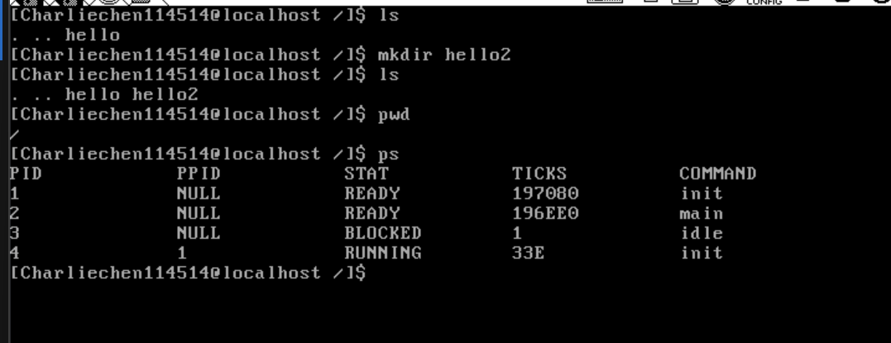

# 更好的shell2

## 批添加syscall

​	我们还是将之前做的一大堆工作集成进来！

```
#ifndef __LIB_USER_SYSCALL_H
#define __LIB_USER_SYSCALL_H

#include "include/thread/thread.h"
#include "include/library/types.h"
#include "include/filesystem/filesystem.h"

enum SYSCALL_NR
{
    SYS_GETPID,
    SYS_WRITE,
    SYS_MALLOC,
    SYS_FREE,
    SYS_FORK,
    SYS_READ,
    SYS_PUTCHAR,
    SYS_CLEAR,
    SYS_GETCWD,
    SYS_OPEN,
    SYS_CLOSE,
    SYS_LSEEK,
    SYS_UNLINK,
    SYS_MKDIR,
    SYS_OPENDIR,
    SYS_CLOSEDIR,
    SYS_CHDIR,
    SYS_RMDIR,
    SYS_READDIR,
    SYS_REWINDDIR,
    SYS_STAT,
    SYS_PS,
};

uint32_t getpid(void);
uint32_t write(int32_t fd, const void *buf, uint32_t count);
void *malloc(uint32_t size);
void free(void *ptr);
pid_t fork(void);
int32_t read(int32_t fd, void *buf, uint32_t count);
/* Clears the screen */
void clear(void);
/* Outputs a character */
void putchar(char char_asci);
char *getcwd(char *buf, uint32_t size);
int32_t open(char *pathname, uint8_t flag);
int32_t close(int32_t fd);
int32_t lseek(int32_t fd, int32_t offset, uint8_t whence);
int32_t unlink(const char *pathname);
int32_t mkdir(const char *pathname);
Dir *opendir(const char *name);
int32_t closedir(Dir *dir);
int32_t rmdir(const char *pathname);
DirEntry *readdir(Dir *dir);
void rewinddir(Dir *dir);
int32_t stat(const char *path, Stat*buf);
int32_t chdir(const char *path);
void ps(void);
#endif
#include "include/syscall/syscall.h"

/* System call with no parameters */
#define _syscall0(NUMBER)                                                  \
    ({                                                                     \
        int retval;                                                        \
        asm volatile("int $0x80" : "=a"(retval) : "a"(NUMBER) : "memory"); \
        retval;                                                            \
    })

/* System call with one parameter */
#define _syscall1(NUMBER, ARG1)               \
    ({                                        \
        int retval;                           \
        asm volatile("int $0x80"              \
                     : "=a"(retval)           \
                     : "a"(NUMBER), "b"(ARG1) \
                     : "memory");             \
        retval;                               \
    })

/* System call with two parameters */
#define _syscall2(NUMBER, ARG1, ARG2)                    \
    ({                                                   \
        int retval;                                      \
        asm volatile("int $0x80"                         \
                     : "=a"(retval)                      \
                     : "a"(NUMBER), "b"(ARG1), "c"(ARG2) \
                     : "memory");                        \
        retval;                                          \
    })

/* System call with three parameters */
#define _syscall3(NUMBER, ARG1, ARG2, ARG3)                         \
    ({                                                              \
        int retval;                                                 \
        asm volatile("int $0x80"                                    \
                     : "=a"(retval)                                 \
                     : "a"(NUMBER), "b"(ARG1), "c"(ARG2), "d"(ARG3) \
                     : "memory");                                   \
        retval;                                                     \
    })

/* Returns the current task's PID */
uint32_t getpid()
{
    return _syscall0(SYS_GETPID);
}

/* Writes 'count' characters from 'buf' to file descriptor 'fd' */
uint32_t write(int32_t fd, const void *buf, uint32_t count)
{
    return _syscall3(SYS_WRITE, fd, buf, count);
}

/* Allocates 'size' bytes of memory and returns the result */
void *malloc(uint32_t size)
{
    return (void *)_syscall1(SYS_MALLOC, size);
}

/* Frees the memory pointed to by 'ptr' */
void free(void *ptr)
{
    _syscall1(SYS_FREE, ptr);
}

/* Creates a child process and returns the child process's PID */
pid_t fork(void)
{
    return _syscall0(SYS_FORK);
}

int32_t read(int32_t fd, void *buf, uint32_t count)
{
    return _syscall3(SYS_READ, fd, buf, count);
}


/* Outputs a character */
void putchar(char char_asci) {
    _syscall1(SYS_PUTCHAR, char_asci);
}

/* Clears the screen */
void clear(void) {
    _syscall0(SYS_CLEAR);
}

/* Gets the current working directory */
char *getcwd(char *buf, uint32_t size) {
    return (char *)_syscall2(SYS_GETCWD, buf, size);
}

/* Opens the file at 'pathname' with 'flag' */
int32_t open(char *pathname, uint8_t flag) {
    return _syscall2(SYS_OPEN, pathname, flag);
}

/* Closes the file descriptor 'fd' */
int32_t close(int32_t fd) {
    return _syscall1(SYS_CLOSE, fd);
}

/* Sets the file offset */
int32_t lseek(int32_t fd, int32_t offset, uint8_t whence) {
    return _syscall3(SYS_LSEEK, fd, offset, whence);
}

/* Deletes the file at 'pathname' */
int32_t unlink(const char *pathname) {
    return _syscall1(SYS_UNLINK, pathname);
}

/* Creates a directory at 'pathname' */
int32_t mkdir(const char *pathname) {
    return _syscall1(SYS_MKDIR, pathname);
}

/* Opens the directory 'name' */
Dir *opendir(const char *name) {
    return (Dir *)_syscall1(SYS_OPENDIR, name);
}

/* Closes the directory 'dir' */
int32_t closedir(Dir *dir) {
    return _syscall1(SYS_CLOSEDIR, dir);
}

/* Deletes the directory at 'pathname' */
int32_t rmdir(const char *pathname) {
    return _syscall1(SYS_RMDIR, pathname);
}

/* Reads an entry from the directory 'dir' */
DirEntry *readdir(Dir *dir) {
    return (DirEntry *)_syscall1(SYS_READDIR, dir);
}

/* Rewinds the directory pointer 'dir' */
void rewinddir(Dir *dir) {
    _syscall1(SYS_REWINDDIR, dir);
}

/* Gets the attributes of 'path' and stores them in 'buf' */
int32_t stat(const char *path, Stat *buf) {
    return _syscall2(SYS_STAT, path, buf);
}

/* Changes the current working directory to 'path' */
int32_t chdir(const char *path) {
    return _syscall1(SYS_CHDIR, path);
}

/* Displays the task list */
void ps(void) {
    _syscall0(SYS_PS);
}
```

​	这就是把我们之前的工作给做了。

## 实现ps

​	看到我们有一个ps没有实现，我们实现一个：

```
#include "include/thread/thread_relative_print.h"
#include "include/library/types.h"
#include "include/library/string.h"
#include "include/filesystem/file.h"
#include "include/library/kernel_assert.h"
#include "include/filesystem/filesystem.h"
#include "include/user/stdio/stdio.h"
/* Output buf with padded spaces */
static void pad_print(char *buf, int32_t buf_len, void *ptr, char format) {
    k_memset(buf, 0, buf_len); // Clear the buffer
    uint8_t out_pad_0idx = 0;
    switch (format) {
    case 's':
        out_pad_0idx = sprintf(buf, "%s", ptr); // Print string
        break;
    case 'd':
        out_pad_0idx =
            sprintf(buf, "%d", *((int16_t *)ptr)); // Print decimal integer
        goto PRT_HEX;
        break;
    case 'x':
    PRT_HEX:
        out_pad_0idx =
            sprintf(buf, "%x", *((uint32_t *)ptr)); // Print hexadecimal
    }
    while (out_pad_0idx <
           buf_len) { // Pad with spaces until the buffer is filled
        buf[out_pad_0idx] = ' ';
        out_pad_0idx++;
    }
    sys_write(stdout_no, buf, buf_len - 1); // Output the formatted string
}

/* Callback function used in list_traversal for processing thread queue */
static bool elem2thread_info(list_elem *pelem, int arg) {
    (void)arg; // Unused argument
    TaskStruct *pthread = elem2entry(TaskStruct, all_list_tag,
                                     pelem); // Convert list element to thread
    char out_pad[16] = {0};

    /* Print PID of the thread */
    pad_print(out_pad, 16, &pthread->pid, 'd');

    /* Print Parent PID, "NULL" if the parent PID is -1 */
    if (pthread->parent_pid == -1) {
        pad_print(out_pad, 16, "NULL", 's');
    } else {
        pad_print(out_pad, 16, &pthread->parent_pid, 'd');
    }

    /* Print thread status */
    switch (pthread->status) {
    case 0:
        pad_print(out_pad, 16, "RUNNING", 's');
        break;
    case 1:
        pad_print(out_pad, 16, "READY", 's');
        break;
    case 2:
        pad_print(out_pad, 16, "BLOCKED", 's');
        break;
    case 3:
        pad_print(out_pad, 16, "WAITING", 's');
        break;
    case 4:
        pad_print(out_pad, 16, "HANGING", 's');
        break;
    case 5:
        pad_print(out_pad, 16, "DIED", 's');
    }

    /* Print elapsed ticks in hexadecimal format */
    pad_print(out_pad, 16, &pthread->elapsed_ticks, 'x');

    /* Print thread name */
    k_memset(out_pad, 0, 16);
    KERNEL_ASSERT(k_strlen(pthread->name) < 17);
    k_memcpy(out_pad, pthread->name, k_strlen(pthread->name));
    k_strcat(out_pad, "\n");
    sys_write(stdout_no, out_pad, k_strlen(out_pad));

    return false; // Return false to continue traversing the list
}

/* Print the task list */
void sys_ps(void) {
    char *ps_title =
        "PID            PPID           STAT           TICKS          COMMAND\n";
    sys_write(stdout_no, ps_title, k_strlen(ps_title)); // Print the header
    list_traversal(&thread_all_list, elem2thread_info,
                   0); // Traverse and print each thread's info
}
```

函数 `pad_print` 的作用是确保输出字符串对齐，主要通过格式化字符串和填充空格来实现。其原理是先使用 `switch` 结构调用 `sprintf` 函数将待输出的字符串（`ptr`）写入到缓冲区 `buf` 中。`buf` 的长度是固定的 (`buf_len`)，无论 `ptr` 的长度是多少，最终都会输出 `buf_len` 长度的字符串。如果 `ptr` 的长度不足 `buf_len`，则使用空格填充至 `buf_len`。

在 `pad_print` 函数中，`switch` 结构有三种情况：

- **case 's'**：处理字符串。
- **case 'd'**：处理16位整数（适用于 `pid`）。
- **case 'x'**：处理32位整数。

理论上，`case 'd'` 和 `case 'x'` 只需要选择一个即可，但由于 `pid` 是16位宽，因此专门为 `pid` 指定了 `case 'd'` 来处理16位数据。这么做是为了避免改变 `pid` 的数据类型（从16位改为32位），因为一旦改动数据类型，后续代码可能会受到影响，造成所谓的“雪崩效应”，即需要改动很多地方的代码和解释。为了避免这种麻烦，直接为 `pid` 选择了专用的16位处理方式。

`elem2thread_info` 函数则是 `list_traversal` 函数中的回调函数，用于打印线程队列中的任务信息。它输出每个任务的 `pid` 和 `ppid`，然后通过 `switch` 结构根据任务的状态（如 `RUNNING`、`READY`、`BLOCKED` 等）输出相应的任务状态。通过调用 `pad_print` 函数，任务信息被对齐为固定长度的输出，最后使用 `sys_write` 将结果写入到输出。

`sys_ps` 是系统调用 `ps` 的内核部分，提供了当前系统进程的状态，利用上面提到的 `elem2thread_info` 来打印所有任务的相关信息。

## 路径转化

```
/* Converts the path old_abs_path by resolving ".." and "." to the actual path
 * and stores it in new_abs_path */
static void wash_path(char *old_abs_path, char *new_abs_path) {
    user_assert(old_abs_path[0] == '/'); // Ensure the path starts with "/"
    char name[MAX_FILE_NAME_LEN] = {0};
    char *sub_path = old_abs_path;
    sub_path = path_parse(sub_path, name);
    if (name[0] ==
        0) { // If the input is just "/", directly set new_abs_path to "/"
        new_abs_path[0] = '/';
        new_abs_path[1] = 0;
        return;
    }
    new_abs_path[0] = 0; // Clear the new_abs_path to avoid residual data
    k_strcat(new_abs_path, "/");
    while (name[0]) {
        /* If it's the parent directory ".." */
        if (!k_strcmp("..", name)) {
            char *slash_ptr = k_strrchr(new_abs_path, '/');
            /* If we're not at the top of the directory, remove the last path
             * component */
            if (slash_ptr !=
                new_abs_path) { // For example, "/a/b" becomes "/a" after ".."
                *slash_ptr = 0;
            } else { // If we're at the top level, reset the path to "/"
                *(slash_ptr + 1) = 0;
            }
        } else if (k_strcmp(".", name)) { // If the path is not ".", append it to
                                        // new_abs_path
            if (k_strcmp(new_abs_path,
                       "/")) { // Avoid double slashes at the beginning
                k_strcat(new_abs_path, "/");
            }
            k_strcat(new_abs_path, name);
        } // Do nothing if name is ".", as it's the current directory

        /* Continue to the next path segment */
        k_memset(name, 0, MAX_FILE_NAME_LEN);
        if (sub_path) {
            sub_path = path_parse(sub_path, name);
        }
    }
}
```

该函数 `wash_path` 的目的是解析一个路径 `old_abs_path`，并将路径中的 `..`（父目录）和 `.`（当前目录）等符号转换为实际的绝对路径，然后将结果存储在 `new_abs_path` 中。首先，它确保路径是以 `/` 开头，表示这是一个绝对路径。然后，函数会逐步解析路径，处理每一个子路径。

函数首先从 `old_abs_path` 中提取每个子路径，并检查路径的第一个子路径。如果该子路径为空，说明路径本身就是根目录 `/`，此时直接将 `new_abs_path` 设置为 `/` 并返回。如果不是根目录，函数则从 `new_abs_path` 开始构建新的路径，逐个处理路径中的部分。对于每个路径部分，如果是 `..`，表示要返回到上一级目录，因此函数会通过查找路径中的最后一个斜杠 `/`，并将其前面的部分删除。如果是 `.`，表示当前目录，函数不做任何修改。如果是其他有效的路径部分，函数会将其附加到 `new_abs_path` 中。

在整个过程中，函数通过调用 `path_parse` 来逐步解析路径，并通过 `k_strcmp` 比较字符串，使用 `k_strcat` 来拼接字符串，使用 `k_memset` 清空缓冲区来存储当前路径部分。最终，函数返回解析后的绝对路径 `new_abs_path`。

## 内建的其他指令补充

```
/* Built-in pwd command function */
void buildin_pwd(uint32_t argc, char **argv) {
    (void)argc;
    (void)argv;
    if (argc != 1) {
        printf("pwd: no argument support!\n"); // Error if there are arguments
        return;
    } else {
        if (NULL != getcwd(final_path, MAX_PATH_LEN)) {
            printf("%s\n", final_path); // Print the current working directory
        } else {
            printf(
                "pwd: get current work directory failed.\n"); // Error if unable
                                                              // to get the
                                                              // current
                                                              // directory
        }
    }
}

/* Built-in cd command function */
char *buildin_cd(uint32_t argc, char **argv) {
    if (argc > 2) {
        printf("cd: only support 1 argument!\n"); // Error if more than one
                                                  // argument is given
        return NULL;
    }

    /* If no argument is given, set path to root directory */
    if (argc == 1) {
        final_path[0] = '/';
        final_path[1] = 0;
    } else {
        make_clear_abs_path(
            argv[1], final_path); // Resolve the given path to an absolute path
    }

    if (chdir(final_path) == -1) { // Change the directory
        printf("cd: no such directory %s\n",
               final_path); // Error if the directory does not exist
        return NULL;
    }
    return final_path;
}

/* Built-in ls command function */
void buildin_ls(uint32_t argc, char **argv) {

    char *pathname = NULL;
    Stat file_stat;
    k_memset(&file_stat, 0, sizeof(Stat));
    bool long_info = false;
    uint32_t arg_path_nr = 0;
    uint32_t arg_idx = 1; // Skip argv[0], which is the "ls" command
    while (arg_idx < argc) {
        if (argv[arg_idx][0] == '-') { // If it's an option, starting with "-"
            if (!k_strcmp("-l", argv[arg_idx])) { // "-l" option for long format
                long_info = true;
            } else if (!k_strcmp("-h", argv[arg_idx])) { // "-h" option for help
                printf("usage: -l list all infomation about the file.\n-h for "
                       "help\nlist all files in the current directory if no "
                       "option\n");
                return;
            } else { // Invalid option
                printf("ls: invalid option %s\nTry `ls -h' for more "
                       "information.\n",
                       argv[arg_idx]);
                return;
            }
        } else { // Path argument for ls
            if (arg_path_nr == 0) {
                pathname = argv[arg_idx];
                arg_path_nr = 1;
            } else {
                printf("ls: only support one path\n"); // Error if more than one
                                                       // path is provided
                return;
            }
        }
        arg_idx++;
    }

    if (!pathname) { // If no path is provided, use the current directory
        if (NULL != getcwd(final_path, MAX_PATH_LEN)) {
            pathname = final_path;
        } else {
            printf("ls: getcwd for default path failed\n"); // Error if unable
                                                            // to get the
                                                            // current directory
            return;
        }
    } else {
        make_clear_abs_path(pathname,
                            final_path); // Resolve the path to an absolute path
        pathname = final_path;
    }

    if (stat(pathname, &file_stat) == -1) { // Check if the path exists
        printf("%s", pathname);
        printf("ls: cannot access %s: No such file or directory\n", pathname);
        return;
    }
    if (file_stat.st_filetype ==
        FT_DIRECTORY) { // If it's a directory, list its contents
        Dir *dir = opendir(pathname);
        DirEntry *dir_e = NULL;
        char sub_pathname[MAX_PATH_LEN] = {0};
        uint32_t pathname_len = k_strlen(pathname);
        uint32_t last_char_idx = pathname_len - 1;
        k_memcpy(sub_pathname, pathname, pathname_len);
        if (sub_pathname[last_char_idx] != '/') {
            sub_pathname[pathname_len] = '/';
            pathname_len++;
        }
        rewinddir(dir);
        if (long_info) {
            char ftype;
            printf("total: %d\n", file_stat.st_size);
            while ((dir_e = readdir(dir))) {
                ftype = 'd';
                if (dir_e->f_type == FT_REGULAR) {
                    ftype = '-';
                }
                sub_pathname[pathname_len] = 0;
                k_strcat(sub_pathname, dir_e->filename);
                k_memset(&file_stat, 0, sizeof(Stat));
                if (stat(sub_pathname, &file_stat) == -1) {
                    printf("ls: cannot access %s: No such file or directory\n",
                           dir_e->filename);
                    return;
                }
                printf("%c  %d  %d  %s\n", ftype, dir_e->i_no,
                       file_stat.st_size, dir_e->filename);
            }
        } else {
            while ((dir_e = readdir(dir))) {
                printf("%s ",
                       dir_e->filename); // Print file names in a simple format
            }
            printf("\n");
        }
        closedir(dir);
    } else {
        if (long_info) {
            printf("-  %d  %d  %s\n", file_stat.st_ino, file_stat.st_size,
                   pathname);
        } else {
            printf("%s\n", pathname); // Print the file name
        }
    }
}

/* Built-in ps command function */
void buildin_ps(uint32_t argc, char **argv) {
    (void)argc;
    (void)argv;
    if (argc != 1) {
        printf("ps: no argument support!\n"); // Error if there are arguments
        return;
    }
    ps(); // Call the ps function to display process status
}

/* Built-in clear command function */
void buildin_clear(uint32_t argc, char **argv) {
    (void)argc;
    (void)argv;
    if (argc != 1) {
        printf("clear: no argument support!\n"); // Error if there are arguments
        return;
    }
    clear(); // Call the clear function to clear the terminal screen
}

/* Built-in mkdir command function */
int32_t buildin_mkdir(uint32_t argc, char **argv) {
    int32_t ret = -1;
    if (argc != 2) {
        printf("mkdir: only support 1 argument!\n"); // Error if there are not
                                                     // exactly 1 argument
    } else {
        make_clear_abs_path(argv[1],
                            final_path); // Resolve the path to an absolute path
        /* If not creating the root directory */
        if (k_strcmp("/", final_path)) {
            if (mkdir(final_path) == 0) { // Create the directory
                ret = 0;
            } else {
                printf("mkdir: create directory %s failed.\n",
                       argv[1]); // Error if directory creation fails
            }
        }
    }
    return ret;
}

/* Built-in rmdir command function */
int32_t buildin_rmdir(uint32_t argc, char **argv) {
    int32_t ret = -1;
    if (argc != 2) {
        printf("rmdir: only support 1 argument!\n"); // Error if there are not
                                                     // exactly 1 argument
    } else {
        make_clear_abs_path(argv[1],
                            final_path); // Resolve the path to an absolute path
        /* If not removing the root directory */
        if (k_strcmp("/", final_path)) {
            if (rmdir(final_path) == 0) { // Remove the directory
                ret = 0;
            } else {
                printf("rmdir: remove %s failed.\n",
                       argv[1]); // Error if directory removal fails
            }
        }
    }
    return ret;
}

/* Built-in rm command function */
int32_t buildin_rm(uint32_t argc, char **argv) {
    (void)argc;
    (void)argv;
    int32_t ret = -1;
    if (argc != 2) {
        printf("rm: only support 1 argument!\n"); // Error if there are not
                                                  // exactly 1 argument
    } else {
        make_clear_abs_path(argv[1],
                            final_path); // Resolve the path to an absolute path
        /* If not deleting the root directory */
        if (k_strcmp("/", final_path)) {
            if (unlink(final_path) == 0) { // Delete the file
                ret = 0;
            } else {
                printf("rm: delete %s failed.\n",
                       argv[1]); // Error if file deletion fails
            }
        }
    }
    return ret;
}
```

​		我们将这些内建的指令添加到我们的shell中

```
void ccshell(void)
{
    cwd_cache[0] = '/';
    cwd_cache[1] = 0;
    while (1) { 
        print_prompt(); 
        k_memset(final_path, 0, MAX_PATH_LEN); 
        k_memset(cmd_line, 0, MAX_PATH_LEN); 
        readline(cmd_line, MAX_PATH_LEN); 
        if (cmd_line[0] == 0) {    // 若只键入了一个回车 
            continue; 
        } 
        argc = -1; 
        argc = cmd_parse(cmd_line, argv, ' '); 
        if (argc == -1) { 
            printf("num of arguments exceed %d\n", MAX_ARG_NR); 
            continue; 
        } 
        if (!k_strcmp("ls", argv[0])) { 
            buildin_ls(argc, argv); 
        } else if (!k_strcmp("cd", argv[0])) { 
            if (buildin_cd(argc, argv)) { 
                k_memset(cwd_cache, 0, MAX_PATH_LEN); 
                k_strcpy(cwd_cache, final_path); 
            } 
        } else if (!k_strcmp("pwd", argv[0])) { 
            buildin_pwd(argc, argv); 
        } else if (!k_strcmp("ps", argv[0])) { 
            buildin_ps(argc, argv); 
        } else if (!k_strcmp("clear", argv[0])) { 
            buildin_clear(argc, argv); 
        } else if (!k_strcmp("mkdir", argv[0])) { 
            buildin_mkdir(argc, argv); 
        } else if (!k_strcmp("rmdir", argv[0])) { 
            buildin_rmdir(argc, argv); 
        } else if (!k_strcmp("rm", argv[0])) { 
            buildin_rm(argc, argv); 
        } else { 
            printf("external command\n"); 
        } 
    }
    
    user_panic("Man!: you should not be here!!!"); // This should never be reached
}
```

## 上电



## 下一篇

[实现exec](./14.5_exec.md)
