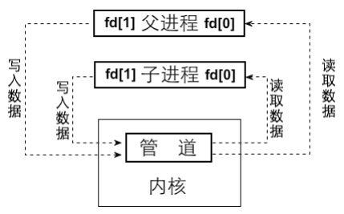
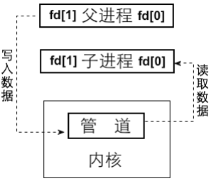

# 最后的最后：实现管道

## 说一说管道

管道是一种进程间通信方式，虽然进程彼此独立，但为了实现协作，必须有通信机制。在Linux中，一切皆文件，管道也不例外，虽然它不在文件系统中存在，但可以通过open、read、write、close等系统调用操作。管道仅存在于内核内存中，是一种被多个进程共享的缓冲区，它的本质是一个环形缓冲区，核心是两个指针：读指针和写指针。写满时写进程休眠，读空时读进程休眠，彼此通过唤醒对方进行协作，从而避免数据丢失。这种机制非常类似生产者消费者模型，前面介绍的ioqueue键盘输入缓冲区也是类似实现。

创建管道时，用户传入一个大小为2的数组，内核将读和写两个文件描述符分别保存在数组的fd[0]和fd[1]中，fd[0]用于读，fd[1]用于写。进程自己创建管道后自读自写没有意义，通常会紧接着调用fork产生一个子进程。由于子进程会继承父进程的文件描述符，因此父子进程就都能访问这两个描述符，从而具备通信能力。它们共享同一个内核缓冲区，因此读写指针也是共享的。一般父进程用于写入，保留fd[1]关闭fd[0]，而子进程用于读取，保留fd[0]关闭fd[1]，形成单向通信。由于匿名管道没有名字，只对创建它的进程和子进程可见，所以只能用于父子进程通信。如果要在非父子进程之间通信，则需要使用有名管道，它通过mkfifo创建，会在文件系统中以文件形式存在，多个进程只要访问这个文件就能通信。目前仅实现匿名管道，有名管道属于扩展内容。





Linux为了屏蔽不同文件系统之间的差异，提供了虚拟文件系统（VFS）这一中间层，用户只和VFS交互，从而不关心底层到底是ext4、nfs还是ntfs。管道在Linux中本质上也是一种文件，因此也会被纳入VFS的统一管理体系。Linux并没有为管道额外设计一套新结构，而是复用了现有的文件结构和inode机制：文件结构中的f_inode指向一个代表管道的虚拟inode，而inode再指向一页大小（通常是4096字节）的内存缓冲区，作为管道的存储空间；同时f_op指向管道的读写操作函数pipe_read和pipe_write。也就是说，Linux利用文件结构+inode+操作函数三者组合来处理管道，不仅统一了接口，也提高了代码复用性。

相比之下，我们的系统就简单多了。没有多种文件系统需要支持，也就不需要像VFS这样的中间层；文件结构也没有f_op这样的函数指针，因为只支持硬盘文件一种操作对象，所有文件操作统一处理即可。我们也决定像Linux那样“部分地效仿”其实现管道的方式——主要是借鉴思路而非结构。我们的文件结构比较简单，只包含fd_pos、fd_flags、fd_inode三个成员。本来这些成员分别表示文件的读写偏移、操作标志和inode指针，但为了节省资源，不打算再为管道额外开辟新的结构体，因此对这三个成员的意义进行“复用”：将fd_flags设置为0xFFFF用作标识这个结构代表的是管道而不是普通文件；将fd_inode用于指向管道的内存缓冲区；将fd_pos记录管道的打开数，方便判断何时回收管道缓冲区。这样，我们用最小的改动，让原本为普通文件设计的结构也能服务于管道。

文件描述符在我们的系统中是进程PCB中fd_table数组的下标，对应的值是全局file_table中的下标，指向真正的文件结构。只要让两个进程的fd_table元素指向同一个file_table项，就能共享该文件结构，也就共享了同一个管道缓冲区。相比Linux那种多个文件结构共享一个inode缓冲区的方式，我们就简单粗暴地直接共享文件结构本身。这也说明我们只支持有限的通信方式，不考虑太复杂的多层结构，也不需要像Linux那样为每个打开的文件结构都维护一份自己的状态。

在管道通信中，生产者进程通过一个fd写数据，消费者进程通过另一个fd读数据。虽然我们用了环形缓冲区，理论上可以实现无损的无限数据传输，但实际上由于我们的进程调度和shell设计较为简单，管道命令如“a|b|c|d”中的命令并非并行执行，而是顺序执行。这样就会带来一个问题：比如a写满了管道缓冲区后会阻塞等待b读取，但如果a不退出，b永远得不到执行机会，从而导致a永远阻塞；反之b若等待a写入也会永远休眠。因此，我们最终采取了折中的策略：不再让进程阻塞，而是让它们每次只读或写“适量”的数据，即生产者只写管道中剩余空间那么多的数据，消费者只读当前已有数据那么多的量。这样就能避免缓冲区满或空的情况，避免进程阻塞。虽然这牺牲了并发性，也限制了传输数据的上限为缓冲区大小减一，但对于我们的系统来说，这种折中在实现难度和系统能力之间找到了一个合适的平衡。

## 看看我们的实现

### 添加ioqueue_length函数

```c
/* Returns the current length of the circular buffer */
uint32_t ioq_length(IOQueue* ioq) {
    uint32_t len = 0;

    // Calculate the length based on the position of head and tail indices
    if (ioq->index_head >= ioq->index_tail) {
        len = ioq->index_head - ioq->index_tail; // Simple subtraction when head is ahead of tail
    } else {
        len = IO_BUF_SIZE - (ioq->index_tail - ioq->index_head); // Wrap around case
    }

    return len; // Return the length of the buffer
}

```

​	返回环形缓冲区中的数据长度

## pipe功能实现

```c
/* Checks if the file descriptor 'local_fd' is a pipe */
bool is_pipe(uint32_t local_fd) {
    uint32_t global_fd = fd_local2global(local_fd);
    return file_table[global_fd].fd_flag == PIPE_FLAG;
}

/* Creates a pipe. Returns 0 on success, -1 on failure */
int32_t sys_pipe(int32_t pipefd[2]) {
    int32_t global_fd = get_free_slot_in_global();

    /* Allocate a kernel memory page for the ring buffer */
    file_table[global_fd].fd_inode = get_kernel_pages(1);

    /* Initialize the ring buffer */
    init_IOQueue((IOQueue *)file_table[global_fd].fd_inode);
    if (!(file_table[global_fd].fd_inode)) {
        return -1;
    }

    /* Reuse 'fd_flag' as the pipe flag */
    file_table[global_fd].fd_flag = PIPE_FLAG;

    /* Reuse 'fd_pos' as the pipe open count */
    file_table[global_fd].fd_pos = 2;
    pipefd[0] = pcb_fd_install(global_fd);
    pipefd[1] = pcb_fd_install(global_fd);
    return 0;
}

/* Reads data from the pipe */
uint32_t pipe_read(int32_t fd, void *buf, uint32_t count) {
    char *buffer = buf;
    uint32_t bytes_read = 0;
    uint32_t global_fd = fd_local2global(fd);

    /* Get the ring buffer of the pipe */
    IOQueue *ioq = (IOQueue *)file_table[global_fd].fd_inode;

    /* Select the smaller data reading size to avoid blocking */
    uint32_t ioq_len = ioq_length(ioq);
    uint32_t size = ioq_len > count ? count : ioq_len;
    while (bytes_read < size) {
        *buffer = ioq_getchar(ioq);
        bytes_read++;
        buffer++;
    }
    return bytes_read;
}

/* Writes data to the pipe */
uint32_t pipe_write(int32_t fd, const void *buf, uint32_t count) {
    uint32_t bytes_write = 0;
    uint32_t global_fd = fd_local2global(fd);
    IOQueue *ioq = (IOQueue *)file_table[global_fd].fd_inode;

    /* Select the smaller data writing size to avoid blocking */
    uint32_t ioq_left = IO_BUF_SIZE - ioq_length(ioq);
    uint32_t size = ioq_left > count ? count : ioq_left;

    const char *buffer = buf;
    while (bytes_write < size) {
        ioq_putchar(ioq, *buffer);
        bytes_write++;
        buffer++;
    }
    return bytes_write;
}

/* Redirects the file descriptor 'old_local_fd' to 'new_local_fd' */
void sys_fd_redirect(uint32_t old_local_fd, uint32_t new_local_fd) {
    TaskStruct *cur = current_thread();
    /* Handle restoring standard descriptors */
    if (new_local_fd < 3) {
        cur->fd_table[old_local_fd] = new_local_fd;
    } else {
        uint32_t new_global_fd = cur->fd_table[new_local_fd];
        cur->fd_table[old_local_fd] = new_global_fd;
    }
}

```

首先看 `sys_pipe`，它的作用是创建一条管道。它接收一个长度为2的整型数组 `pipefd`，成功时会把两个文件描述符填入这个数组。`pipefd[0]` 是读端，`pipefd[1]` 是写端。函数内部先通过 `get_free_slot_in_global` 在全局文件表 `file_table` 中找一个空位作为本次创建管道用的文件结构。然后为这个文件结构的 `fd_inode` 成员分配一页内存，这页内存就是用来传输数据的缓冲区。之后通过 `ioqueue_init` 把这个缓冲区初始化成一个环形队列。

接下来 `fd_flag` 被赋值为 `PIPE_FLAG`，这个值是 `0xFFFF`，用来表示这个文件结构不是普通文件而是管道。这一标记正是为 `is_pipe` 函数服务的。然后 `fd_pos` 被设为 2，表示这条管道有两个引用，分别是读端和写端。接着使用 `pcb_fd_install` 安装两个文件描述符，让当前进程能通过 `pipefd[0]` 和 `pipefd[1]` 访问这个共享的管道。最后返回 0，表示管道创建成功。

回到 `is_pipe`，它就是判断某个文件描述符是不是一个管道。它的逻辑是先根据当前进程的 `fd_table` 找到实际指向的 `file_table` 项，再看那个文件结构的 `fd_flag` 是不是 `PIPE_FLAG`。是的话就说明这个描述符是管道。

然后 `pipe_read` 和 `pipe_write` 是配套的管道数据传输函数。`pipe_read` 先解析出实际的全局文件结构，再取出缓冲区，根据环形缓冲区当前已有数据量和要读取的数据量中较小的一个作为“适量”来读取。每次只读这么多，避免读空时阻塞，然后通过 `ioq_getchar` 循环逐字节地读到用户缓冲区。

`pipe_write` 的过程跟 `pipe_read` 基本对称，只是方向相反。它也是先找出缓冲区，然后根据空余空间大小决定能写多少字节，逐字节写入，防止写满后进程阻塞。

## 更新代码

​	因为有pipe了，咱们要更新一部分代码，没啥特别指出的，只需要额外添加对pipe的处理即可！

### 文件系统的

```c
/* Close the file associated with fd, return 0 on success, otherwise return -1
 */
int32_t sys_close(int32_t fd) {
    int32_t ret = -1; // Default return value indicating failure
    if (fd > 2) {
        uint32_t global_fd = fd_local2global(fd);
        if (is_pipe(fd)) {
            /* If the pipe's file descriptor is closed, release the pipe's ring
             * buffer */
            if (--file_table[global_fd].fd_pos == 0) {
                mfree_page(PF_KERNEL, file_table[global_fd].fd_inode, 1);
                file_table[global_fd].fd_inode = NULL;
            }
            ret = 0;
        } else {
            ret = file_close(&file_table[global_fd]);
        }
        current_thread()->fd_table[fd] =
            -1; // Make the file descriptor available again
    }
    return ret;
}

/* Write count bytes from buf to the file descriptor fd, return the number of
 * bytes written on success, otherwise return -1 */
int32_t sys_write(int32_t fd, const void *buf, uint32_t count) {
    if (fd < 0) {
        ccos_printk("sys_write: fd error\n");
        return -1;
    }
    if (fd == stdout_no) {
        /* Standard output may be redirected to a pipe buffer, so we need to
         * check */
        if (is_pipe(fd)) {
            return pipe_write(fd, buf, count);
        } else {
            char tmp_buf[1024] = {0};
            k_memcpy(tmp_buf, buf, count);
            console_ccos_puts(tmp_buf);
            return count;
        }
    } else if (is_pipe(fd)) { /* If it's a pipe, use pipe methods */
        return pipe_write(fd, buf, count);
    } else {
        uint32_t _fd = fd_local2global(fd);
        File *wr_file = &file_table[_fd];
        if (wr_file->fd_flag & O_WRONLY || wr_file->fd_flag & O_RDWR) {
            uint32_t bytes_written = file_write(wr_file, buf, count);
            return bytes_written;
        } else {
            console_ccos_puts("sys_write: not allowed to write file without "
                              "flag O_RDWR or O_WRONLY\n");
            return -1;
        }
    }
}

/* Read count bytes from the file pointed to by file descriptor fd into buf,
 * return the number of bytes read on success, return -1 if end of file is
 * reached
 */
int32_t sys_read(int32_t fd, void *buf, uint32_t count) {
    KERNEL_ASSERT(buf);
    int32_t ret = -1;
    uint32_t global_fd = 0;
    if (fd < 0 || fd == stdout_no || fd == stderr_no) {
        ccos_printk("sys_read: fd error\n");
    } else if (fd == stdin_no) {
        /* Standard input might be redirected to a pipe buffer, so we need to
         * check */
        if (is_pipe(fd)) {
            ret = pipe_read(fd, buf, count);
        } else {
            char *buffer = buf;
            uint32_t bytes_read = 0;
            while (bytes_read < count) {
                *buffer = ioq_getchar(&keyboard_ringbuffer);
                bytes_read++;
                buffer++;
            }
            ret = (bytes_read == 0 ? -1 : (int32_t)bytes_read);
        }
    } else if (is_pipe(fd)) { /* If it's a pipe, use the pipe methods */
        ret = pipe_read(fd, buf, count);
    } else {
        global_fd = fd_local2global(fd);
        ret = file_read(&file_table[global_fd], buf, count);
    }
    return ret;
}
```

### fork代码更新

```c
/* Update inode open count */
static void update_inode_open_cnts(TaskStruct *thread) {
    int32_t local_fd = 3, global_fd = 0;
    while (local_fd < MAX_FILES_OPEN_PER_PROC) {
        global_fd = thread->fd_table[local_fd];
        KERNEL_ASSERT(global_fd < MAX_FILE_OPEN);
        if (global_fd != -1) {
            if(is_pipe(local_fd)){
                file_table[global_fd].fd_pos++; 
            }else{
                file_table[global_fd].fd_inode->i_open_cnts++; // Increment inode open count for
                // regular files
            } 
        }
        local_fd++;
    }
}
```

### wait exit更新

```c
/* Release user process resources:
 * 1. Physical pages corresponding to page tables
 * 2. Virtual memory pool that occupies physical page frames
 * 3. Close open files */
static void release_prog_resource(TaskStruct *release_thread) {
    uint32_t *pgdir_vaddr = release_thread->pg_dir;
    uint16_t user_pde_nr = 768, pde_idx = 0;
    uint32_t pde = 0;
    uint32_t *v_pde_ptr =
        NULL; // v represents var, distinguishing it from the function pde_ptr

    uint16_t user_pte_nr = 1024, pte_idx = 0;
    uint32_t pte = 0;
    uint32_t *v_pte_ptr =
        NULL; // Adding 'v' to distinguish it from the function pte_ptr

    uint32_t *first_pte_vaddr_in_pde =
        NULL; // Used to record the address of the first pte in pde
    uint32_t pg_phy_addr = 0;

    /* Reclaim physical pages in the user space page tables */
    while (pde_idx < user_pde_nr) {
        v_pde_ptr = pgdir_vaddr + pde_idx;
        pde = *v_pde_ptr;
        if (pde & PG_P_1) { // If the page directory entry's 'present' bit is set
            first_pte_vaddr_in_pde = pte_ptr(
                pde_idx *
                0x400000); // A page table represents 4MB, i.e., 0x400000
            pte_idx = 0;
            while (pte_idx < user_pte_nr) {
                v_pte_ptr = first_pte_vaddr_in_pde + pte_idx;
                pte = *v_pte_ptr;
                if (pte & PG_P_1) {
                    /* Clear the corresponding physical page frame in the memory
                     * pool bitmap */
                    pg_phy_addr = pte & PG_FETCH_OFFSET;
                    free_a_phy_page(pg_phy_addr);
                }
                pte_idx++;
            }
            /* Clear the physical page frame recorded in pde from the memory
             * pool bitmap */
            pg_phy_addr = pde & PG_FETCH_OFFSET;
            free_a_phy_page(pg_phy_addr);
        }
        pde_idx++;
    }

    /* Reclaim physical memory occupied by the user virtual address pool */
    uint32_t bitmap_pg_cnt =
        (release_thread->userprog_vaddr.vaddr_bitmap.btmp_bytes_len) / PG_SIZE;
    uint8_t *user_vaddr_pool_bitmap =
        release_thread->userprog_vaddr.vaddr_bitmap.bits;
    mfree_page(PF_KERNEL, user_vaddr_pool_bitmap, bitmap_pg_cnt);

    /* Close files opened by the process */
    uint8_t local_fd = 3;
    while (local_fd < MAX_FILES_OPEN_PER_PROC) {
        if (release_thread->fd_table[local_fd] != -1) {
            if (is_pipe(local_fd)) {
                uint32_t global_fd = fd_local2global(local_fd);
                if (--file_table[global_fd].fd_pos == 0) {
                    mfree_page(PF_KERNEL, file_table[global_fd].fd_inode, 1);
                    file_table[global_fd].fd_inode = NULL;
                }
            } else {
                sys_close(local_fd);
            }
        }
        local_fd++;
    }
}
```

## 添加shell对管道的支持

```c
/* Executes the command */
static void cmd_execute(uint32_t argc, char **argv) {
    if (!k_strcmp("ls", argv[0])) {
        buildin_ls(argc, argv);
    } else if (!k_strcmp("cd", argv[0])) {
        if (buildin_cd(argc, argv)) {
            k_memset(cwd_cache, 0, MAX_PATH_LEN);
            k_strcpy(cwd_cache, final_path);
        }
    } else if (!k_strcmp("pwd", argv[0])) {
        buildin_pwd(argc, argv);
    } else if (!k_strcmp("ps", argv[0])) {
        buildin_ps(argc, argv);
    } else if (!k_strcmp("clear", argv[0])) {
        buildin_clear(argc, argv);
    } else if (!k_strcmp("mkdir", argv[0])) {
        buildin_mkdir(argc, argv);
    } else if (!k_strcmp("rmdir", argv[0])) {
        buildin_rmdir(argc, argv);
    } else if (!k_strcmp("rm", argv[0])) {
        buildin_rm(argc, argv);
    } else if (!k_strcmp("help", argv[0])) {
        buildin_help(argc, argv);
    } else { // If it's an external command, it needs to be loaded from disk
        int32_t pid = fork();
        if (pid) { // Parent process
            int32_t status;
            int32_t child_pid = wait(&status); // If the child hasn't executed
                                               // exit, the shell is blocked
            if (child_pid ==
                -1) { // This shouldn't be reached under normal conditions
                user_panic("ccos_baseshell: no child\n");
            }
            printf("child_pid %d, its status: %d\n", child_pid, status);
        } else { // Child process
            make_clear_abs_path(argv[0], final_path);
            argv[0] = final_path;

            /* Check if the file exists */
            Stat file_stat;
            k_memset(&file_stat, 0, sizeof(Stat));
            if (stat(argv[0], &file_stat) == -1) {
                printf("ccos_baseshell: cannot access %s: No such file or "
                       "directory\n",
                       argv[0]);
                exit(-1);
            } else {
                execv(argv[0], argv); // Execute the command
            }
        }
    }

```

我们的函数解析并执行用户输入的命令。它首先检查命令是否是内置命令，如果是，则调用相应的内置函数来执行；如果不是内置命令，则尝试将其作为外部命令处理。

函数开始时，通过`k_strcmp`函数比较用户输入的命令名称（`argv[0]`）与一系列内置命令的名称。如果匹配到某个内置命令，比如`ls`、`cd`、`pwd`等，函数会调用对应的内置函数来执行该命令。例如，如果用户输入的是`cd`命令，函数会调用`buildin_cd`来改变当前工作目录，并在成功执行后更新`cwd_cache`（当前工作目录的缓存）。

如果用户输入的命令不是内置命令，函数会尝试将其作为外部命令处理。外部命令是指存储在磁盘上的可执行文件。函数通过`fork`创建一个子进程，父进程会等待子进程执行完毕，并输出子进程的退出状态。子进程则通过`make_clear_abs_path`函数将命令路径转换为绝对路径，并检查该路径是否存在。如果路径不存在，子进程会输出错误信息并退出；如果路径存在，子进程会通过`execv`函数执行该命令。

整个函数的处理过程可以分为两个主要部分：处理内置命令和处理外部命令。处理内置命令时，函数直接调用相应的内置函数；处理外部命令时，函数通过创建子进程并调用`execv`来执行外部程序。这种设计使得函数能够灵活地处理不同类型的命令，同时保持代码的简洁性和可维护性。

```c
void ccshell(void)
{
    cwd_cache[0] = '/';
    while (1) {
        print_prompt();                      // Print the shell prompt
        k_memset(final_path, 0, MAX_PATH_LEN); // Clear the final path buffer
        k_memset(cmd_line, 0, MAX_PATH_LEN);   // Clear the command line buffer
        readline(cmd_line, MAX_PATH_LEN); // Read a line of input from the user
        if (cmd_line[0] == 0) { // If only enter was pressed (empty command)
            continue;           // Skip to the next iteration
        }

        /* Handle pipe operations */
        char *pipe_symbol =
            k_strchr(cmd_line, '|'); // Check for a pipe symbol '|'
        if (pipe_symbol) {
            /* Support multiple pipes, such as cmd1|cmd2|..|cmdn,
             * where the standard output of cmd1 and the standard input of cmdn
             * need to be handled separately */

            /* 1. Create a pipe */
            int32_t fd[2] = {-1}; // fd[0] for input, fd[1] for output
            pipe(fd);             // Create a pipe

            /* Redirect standard output to fd[1], so subsequent output goes to
             * the kernel circular buffer */
            fd_redirect(1, fd[1]);

            /* 2. First command */
            char *each_cmd = cmd_line;
            pipe_symbol = k_strchr(each_cmd, '|'); // Find the first pipe symbol
            *pipe_symbol =
                0; // Terminate the first command string at the pipe symbol

            /* Execute the first command, its output will go to the circular
             * buffer */
            argc = -1;
            argc = cmd_parse(each_cmd, argv,
                             ' ');   // Parse the command into arguments
            cmd_execute(argc, argv); // Execute the first command

            /* Skip over the '|' symbol and handle the next command */
            each_cmd = pipe_symbol + 1;

            /* Redirect standard input to fd[0], pointing to the kernel circular
             * buffer */
            fd_redirect(0, fd[0]);

            /* 3. Intermediate commands, both input and output go to the
             * circular buffer */
            while ((pipe_symbol = k_strchr(each_cmd, '|'))) {
                *pipe_symbol =
                    0; // Terminate the command string at the pipe symbol
                argc = -1;
                argc = cmd_parse(each_cmd, argv, ' '); // Parse the command
                cmd_execute(argc, argv);    // Execute the intermediate command
                each_cmd = pipe_symbol + 1; // Move to the next command
            }

            /* 4. Handle the last command in the pipe */
            /* Restore standard output to the screen */
            fd_redirect(1, 1);

            /* Execute the last command */
            argc = -1;
            argc = cmd_parse(each_cmd, argv, ' '); // Parse the last command
            cmd_execute(argc, argv);               // Execute the last command

            /* 5. Restore standard input to the keyboard */
            fd_redirect(0, 0);

            /* 6. Close the pipe */
            close(fd[0]);
            close(fd[1]);
        } else { // Command without pipe operation
            argc = -1;
            argc = cmd_parse(cmd_line, argv, ' '); // Parse the command
            if (argc == -1) {
                printf("num of arguments exceed %d\n",
                       MAX_ARG_NR); // Error if too many arguments
                continue;
            }
            cmd_execute(argc, argv); // Execute the command
        }
    }
    user_panic("Man!: you should not be here!!!"); // This should never be reached
}
```

函数首先初始化当前工作目录缓存 `cwd_cache` 为根目录 `/`，然后进入一个无限循环。在每次循环中，函数会打印 shell 提示符，并清空用于存储命令路径和命令行的缓冲区 `final_path` 和 `cmd_line`。接着，函数调用 `readline` 读取用户输入的命令行内容。如果用户直接按下回车（即输入为空），则跳过本次循环，继续等待用户输入。

如果用户输入的命令中包含管道符号 `|`，函数会进入管道处理逻辑。管道操作允许多个命令通过管道连接，前一个命令的输出作为后一个命令的输入。函数首先调用 `pipe` 创建一个管道，管道的两端分别用于输入和输出。然后，函数将标准输出重定向到管道的输出端，使得第一个命令的输出可以传递到管道中。接着，函数解析并执行第一个命令，将其输出写入管道。对于中间的命令，函数将标准输入重定向到管道的输入端，使得这些命令可以从管道中读取数据，并依次解析和执行每个中间命令。最后，函数处理最后一个命令，将标准输出恢复为屏幕输出，并执行该命令。完成所有命令的执行后，函数将标准输入恢复为键盘输入，并关闭管道的两端。

如果用户输入的命令中没有管道符号，函数会直接解析并执行该命令。首先调用 `cmd_parse` 解析命令参数，如果参数数量超过最大限制，则输出错误信息并跳过本次循环。否则，调用 `cmd_execute` 执行命令。

函数的最后一行是一个异常处理语句 `user_panic`，用于在正常情况下不应该到达的代码位置触发错误提示。这表明函数的设计是一个无限循环，除非发生异常或用户主动退出，否则不会结束。

## 实现help

​	最后整个活，放松一下吧！

```c
/* Displays the system's supported internal commands */
void sys_help(void) {
    ccos_printk(
"-------------------- Hello! Here Comes the Help! -------------------\n \
   buildin commands:\n\
         ls: show directory or file information\n\
         cd: change current work directory\n\
         mkdir: create a directory\n\
         rmdir: remove a empty directory\n\
         rm: remove a regular file\n\
         pwd: show current work directory\n\
         ps: show process information\n\
         clear: clear screen\n\
   shortcut key:\n\
         ctrl+l: clear screen\n\
         ctrl+u: clear input\n"
           "-------------------- Hello! Here Comes the Help! "
 }
 
 /* Displays the list of system-supported commands */
void help(void) {
    _syscall0(SYS_HELP);
}
```

# 恭喜你，大完结了！
