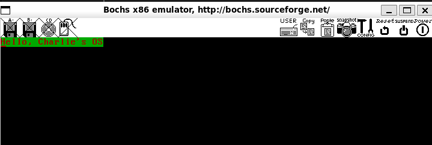

# 让我们从MBR开始

## 前言

​	现在，我们终于可以开始严肃的展开我们的宏伟进程，那就是实现一个操作系统。但我们必须知道，即使是一个玩具级别的操作系统，其工程量也是艰巨的，我们需要一步一步慢慢来。所以现在，**就让我们从MBR开始我们的征程**

​	笔者会简单的介绍BIOS和MBR的基本概念，完成一个玩具MBR的书写，并完成对bochs和硬盘制作的简单教程，当然，不会深入，这是我们之后要做的事情！

## 等等，我还有些迷糊...

​	是的，对于初学者而言，上来我就抛出的MBR的概念，属于是又一些为难人。这里需要说明的是，我们的计算机一上电的时候，其标志着程序运行流状态的两个寄存器——当然我们在讨论的是x86的架构上——也就是我们的CS寄存器（Code Segment）和IP寄存器（Instruction Pointer，也就是程序指针寄存器）就被赋予了一个这样的值，那就是：

| 寄存器 | 取值   |
| ------ | ------ |
| CS     | 0xF000 |
| IP     | 0xFFF0 |

​	当然，一些教材会告诉你，CS和IP会被初始化位0xFFFF:0x0000，这是一种说法。笔者上面给出的是参考了我们Intel IA32手册的结论，截图如下：

> 

​	然而，另一些教材，比如说《Linux内核设计的艺术》此书认为是0xFFFF:0x0000，关于此，笔者认为是硬件设置的问题，但是不管如何，我们最后得到的地址，按照实模式16位地址组合的办法，得到的依然是0xFFFF0这个地址（实模式的段地址左移4位加上偏移量），这个地址非常的关键，笔者在这里提前截了图，请看：

> 

​	在这里，我们的Bochs模拟器依照的是Intel IA32指定的方式进行了初始化，所以，笔者决定将CS:IP为0xF000:0xFFF0作为一个结论放到这里！

> 笔者之前也有阅读的是AMD的架构手册,这一点上为了兼容性没有做更改，好奇的朋友可以一睹芳容！
>
> > AMD Profile: Vol2: System Programming at 14.1.3 : Processor Initialization State
>
> 

​	所以现在，我们就开始好奇，既然我们CPU的上电已经确定是0xFFFF0了，那么显然，看官也就知道，我们的CPU就马上会去执行这个物理地址空间上的代码。所以他是什么呢？答案是这个指令（眼尖的朋友已经看到了我们的Bochs给出了指令）

```
jmpf 0xf000:e05b	; for real mode, its 0xfe05b
```

​	一个远跳指令！对于我们的这种最简单的系统，我们的bochs支持的是使用**BIOS（Basic Input/Output System）**作为我们启动软件

### 下一个问题，啥是BIOS

​	很好！我们马上引导到一个新的问题，什么是BIOS呢？我们知道的是，CPU接受到了RESET脉冲准备重启的时候，他会初始化一部分硬件（上面我给出了，寄存器的值），但是远远不足以驱动我们来加载操作系统这些更加高级的硬件。所以，BIOS这个基本输入输出系统，就充当了我们硬件架构层和软件应用层（说真的跟我们习惯的应用层差远了）的接力棒，这个接力棒就会进行一部分基础的初始化，比如说对我们显卡最基本的模式进行检查和启动，对我们的硬盘进行检查（咱们的操作系统会启动在硬盘上，必须检查我们的物理环境是合格的操作系统才能正确的有容身之处工作，不是嘛？）

​	非常感谢《操作系统还原真相》这本书，我不必去幸幸苦苦翻阅BIOS的资料了。我们现在的IA32架构的虚拟机上，还处于16位的实模式，地址访问还是20位（关于为什么是20位，到这个地方还不理解的话，可以查看笔者在bonus文件夹下的部分文章作为一个额外的解答）。在这1MB大小（$2^{20}b = 1 MB$）的实模式的内存海洋中，已经被约定为如下的内存排布，我们的BIOS作为一定的初始化（基本硬件检查和硬件中断的默认注册）之后，就会执行一个跳转代码（值得注意的是Bochs是陷入一个跳转的中断后直接跳到MBR引导）。

| 起始  | 结束  | 大小              | 用途                                                         |
| ----- | ----- | ----------------- | ------------------------------------------------------------ |
| FFFF0 | FFFFF | 16B               | BIOS入口地址，此地址也属于BIOS代码，同样属于顶部的640KB字节。只是强调其入口地址才单独贴出来。此处16字节的内容是跳转指令 `jmp f000:e05b`。 |
| F0000 | FFFEF | 64KB-16B          | 系统BIOS范围是 F0000~FFFFF 共 64KB，为说明入口地址，将最上面的字节从此处去掉了，所以此处终止地址是 0XFFFFEF。 |
| C8000 | EFFFF | 160KB             | 映射硬件适配器的 ROM 或内存映射式 I/O。                      |
| C0000 | C7FFF | 32KB              | 显示适配器 BIOS。                                            |
| B8000 | BFFFF | 32KB              | 用于文本模式显示适配器。                                     |
| B0000 | B7FFF | 32KB              | 用于黑白显示适配器。                                         |
| A0000 | AFFFF | 64KB              | 用于彩色显示适配器。                                         |
| 9FC00 | 9FFFF | 1KB               | EBDA（Extended BIOS Data Area）扩展 BIOS 数据区。            |
| 7E00  | 9FBFF | 622080B (约608KB) | 可用区域。                                                   |
| 7C00  | 7DFF  | 512B              | MBR 被 BIOS 加载到此处，共 512 字节。                        |
| 500   | 7BFF  | 30464B (约30KB)   | 可用区域。                                                   |
| 400   | 4FF   | 256B              | BIOS Data Area（BIOS 数据区）。                              |
| 000   | 3FF   | 1KB               | Interrupt Vector Table（中断向量表）。                       |

​	BIOS做好了一部分必备的初始化（一个好理解的办法就是想到我们的STM32的初始化文件，都会安排好一部分必要的中断，都会进行自己管辖范围内的内存的初始化等等的操作）之后，就会开始考虑自己的后事——发现我们的主引导记录（也就是我们的主角MBR），并且把程序流转接到那里。办法就是检查我们的引导扇区（可以理解为我们给BIOS提供的一个保障：放心的交给我这个上面的硬盘，上面有你的接班人MBR），办法？那自然是提供一个魔数（身份），看到一个0x55aa那就是一个MBR，直接把这个扇区放到我们的物理地址0x7c00处（需要理解的是：一个硬盘的扇区是512B大小，也就说0x200个字节，所以是0x7C00 ~ 0x7E00！）

​	不管怎么说，BIOS就是一个负责接力的软件，在那之后，他便把程序流引导到我们的MBR，也就是接下来的主角。Master Boot Record上去了。

### 什么是MBR

​	很好，从这里开始，就是我们准备动手的地方了。现在程序流来到了这个地方，那么，问题就在于，我们如何继续往下走呢？是的，这就是我们的工作了，我们要做的就是进一步的去编写我们MBR内部的引导程序，让他进行下一步的操作，比如说，马上我们编写结束MBR后，就会转身去做下一个操作，那就是加载操作系统，但是现在先不着急，我们可以现在MBR内部玩玩。

​	上面提到了，BIOS认为一个扇区的最后两个字节是0x55aa的时候，他就是一个内部存在引导代码的引导扇区，我们的做法就是简单的将我们的这个扇区放上这个0x55aa就完事了。

​	所以到这里，我们的做法就很简单了

> 任务：编写一个简单的MBR引导程序，大小必须是正好的一个扇区，需要做的是将我们的汇编程序起手编译到我们的0x7c00这个地址，然后将这个程序的最后两个字节安排上0x55aa

​	现在请看笔者的代码

```asm
; virtual start, the mbr code place should be start as 0x7c00
; this can be referenced from BIOS, see the BIOS doc for details
%define MBR_VSTART          0x7c00
; jmp to itself
%define STOP                jmp $
%define PLACE_MBR_MAGIC     db 0x55, 0xaa

; sections tells the program parts functionalities
; the name MBR is not the must, it;s just inform us
; that the code is a mbr code
; set the code offset address as the 0x7c00
; then the running flow will jumps here
SECTION MBR vstart=MBR_VSTART
    ; Load Segments
    mov ax, cs
    mov ds, ax
    mov es, ax
    mov ss, ax
    mov fs, ax
    mov sp, MBR_VSTART
    mov ax, 0xb800
    mov gs, ax

; clear the screen by using 0x06

    mov ax, 0x0600
    mov bx, 0x0700
    xor cx, cx
    mov dx, 0x18f4
    int 0x10

; set the cursor to the (0, 0)
; we are ready to display some infomations
    mov ah, 0x02     ; 0x02 is the funtionalities of BIOS
    				; who helps set the cursor
    mov bh, 0        ; 页码0
    mov dh, 0        ; 行号0 (第一行)
    mov dl, 0        ; 列号0 (第一列)
    int 0x10         ; 调用中断

; get the cursor positions
; this is because we will ready to print strings, the bh should be the page
; index, so we fetch it using funtional index 0x02
    mov ah, 0x02
    mov bh, 0
    int 0x10
    
    ; at here, we fetch the bh as the page index
    ; gs is the register that will be used for BIOS
    ; for display, meaning that we need to write messages to there
    mov di, 0x00        ; we set as the start

    ; register the string 
    mov si, welcome     ; pass the soruce index to si
    
; start our loop to place the strings
store_loop:
	; lodsb promised to load a char from si, and ++si
    lodsb               ; 加载一个字符到 al，并更新 si
    ; once the al is 0, we convinced its the end!
    or al, al           
    jz done             ; and we quit the issue 

    ; still the char we need to print, load to the gs
    mov [gs:di], al     ; 
    inc di              ; update the di

    ; 存储 0xA4 到 [gs:di]
    mov byte [gs:di], 0xA4	; 0xA4 is the char style, see doc for the ref
    inc di              ; update the di, ready for the next writing sessions

    jmp store_loop      ; 

done:
    STOP                ; stop, stuck the cs:ip

; the string we display
welcome db "Hello, Charlie's OS", 0
; the string index we put
welcome_len equ $ - welcome
; replace all 0 to the rest of place!
times 510 - ($ - $$) db 0
; and place the final magic, done!
PLACE_MBR_MAGIC
```

​	这就是代码，一般的，我们需要上电看看现象。

​	笔者在setup的时候就强调过，你需要nasm来完成这个文件的编译，办法如下：

```
nasm -o mbr.bin mbr.S
```

​	在这里，我们会把mbr.S文件按照nasm的编译规则编译成可执行的二进制文件（看到.bin文件后缀了嘛，这个就是代表本文件是一个可以执行的二进制文件的含义）

​	之后，按照约定，我们会把这个文件刻录到我们的硬盘当中，我们的操作系统将会从硬盘启动！

​	所以现在，我们就是要制作一个硬盘帮助我们模拟一个虚拟机操作系统启动的必备硬件了。这里给出一个文档，你需要按照这个做出配置（bximage的使用教程）

> [Make A Disk To Boot up](../bonus/chap2/use_bximage_to_make_hard_disk.md)

​	制作好了硬盘，我们还需要将我们的二进制文件烧录到硬盘当中去。

```
dd if=mbr.bin of=boot.img bs=512 count=1 conv=notrunc
```

​	dd是一个Linux下的一个方便的二进制工具，关于dd的完全使用，笔者认为你需要自己学会查阅文档，这里给出一个范例：

```
dd --help
Usage: dd [OPERAND]...
  or:  dd OPTION
Copy a file, converting and formatting according to the operands.
... # 之后的省略
```

​	笔者建议你先查阅文档，看看参数的含义都是什么意思后，我在继续说。

​	很简单，就是按照不截断的方式，将我们的mbr二进制文件烧录到一个叫做boot.img的文件当中，烧录的大小是1块512字节区块！

```
>> dd if=mbr.bin of=boot.img bs=512 count=1 conv=notrunc
1+0 records in
1+0 records out
512 bytes copied, 7.7208e-05 s, 6.6 MB/s
```

​	之后我们需要正确的配置我们的boshsrc，boshsrc存放着我们对bochs启动的配置文件！请看文档：

> [Config Boshsrc To Correctly setup the bochs](../bonus/chap2/using_bochs_to_setup_code.md)

​	现在就是激动人心的启动时刻了！

```
bochs -f bochsrc
```

​	这句话将会指引我们的bochs读取我们在上面的文档中书写的bochs启动配置。

​	现在我们就会来到这个地方：


​	哈哈，现在可以验证我之前所说的内容了，关于bochs调试的基本办法等内容我会在之后的博客中一一铺开。

​	bochs现在再等待我们输入指令，我们输入c并敲下回车，得到了一个我们振奋的结果。



​	一个闪烁的Hello, Charlie's OS！，你可以换成任何你喜欢的字符串打印！恭喜你！你已经迈出了手搓最基本的操作系统的第一步！

​	想要结束我们的模拟，嗯下Ctrl + C，输入q回车后，就会退出我们的模拟了！

## 下一个小节

[下一节：进一步刨析我们的MBR](./2.2_Next_For_Details.md)

## 代码参考

> [Code](./2.1_code)

## 笔者翻阅的参考

1. IA32手册：[Intel® 64 and IA-32 Architectures Software Developer Manuals](https://www.intel.cn/content/www/cn/zh/developer/articles/technical/intel-sdm.html)，笔者下载的是1~4卷，当然，对汇编足够熟悉的朋友不妨直接下载第三卷，直接阅读系统编程
2. 《操作系统还原真相》作者: [郑钢](https://book.douban.com/search/郑钢)，[操作系统真象还原 (豆瓣)](https://book.douban.com/subject/26745156/)

