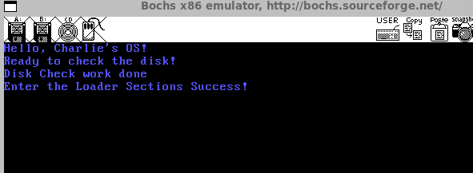

# 从0开始的操作系统手搓教程 4做好准备，跳到加载器（Loader）

​	现在，我们马上就要准备实现一个加载器了，也就是Loader，我们所需要做的是进一步的改造我们的MBR引导文件。具体的，笔者会介绍如下的概念：

- 对于NASM这个编译器，笔者会：
  - 介绍NASM进一步的实模式下的语法
  - 介绍NASM宏等一些预处理的语句的介绍

- 对于bochs，我们将准备介绍我们的调试手段的内容
- 我们还会引入对硬盘的介绍和一些对实模式更加进一步的理解

​	好像看似内容跟操作系统没什么大关系，但是笔者要说的是——看，修改操作系统，离不开上面的最基本的知识。在之后，你可能会去使用qemu, gas等工具完成底层代码的编写，他们内部最核心的概念并没有偏离我们的nasm和bochs。所以，笔者还是决定在这里细心的介绍一下我们后面的代码编写中使用的概念，大纲已经在上面的了。大致的内容如次，enjoy！

## 为什么要加载Loader，Loader是干什么的？

​	首先，我们回顾一下之前最简单的操作系统的加载顺序。我们给CPU上电后，CS:IP被置为0xF000:0xFFF0，这里固化了一个BIOS的跳转指令，BIOS完成了一部分硬件的初始化和BIOS中断向量表的布置之后，他又让我们的程序流跳转道了0x7c00开始的，他认为是一个引导分区的地方。我们的MBR虽然有512个字节，但是需要注意的是，这个512字节远远不足以启动我们的操作系统。我们还需要让MBR交出他的一棒，传递给下一个负责初始化的模块。Loader就是加载器的意思，加载啥？加载我们在后面准备写的操作系统的核心！所以，我们要在MBR做的，就是将我们的接力棒递交给我们的Loader上去。让他继续我们加载操作系统的伟大事业。

## 上菜！

​	是的，为了展开直观的理解我们今天讲解的内容，我们需要做的是直接将我们的内容呈现在看官的面前。

```asm
%include "boot.inc"  ; Include an external file, which may define constants, macros, or other configurations

; Export a global symbol so that other modules can call this function
global mbr_print_strings

; Define the code section, starting at the address MBR_VSTART (likely defined in boot.inc)
section mbr vstart=MBR_VSTART
    ; Initialize segment registers
    mov ax, cs       ; Copy the value of the code segment register CS into AX
    mov ds, ax       ; Copy the value of AX into the data segment register DS
    mov es, ax       ; Copy the value of AX into the extra segment register ES
    mov ss, ax       ; Copy the value of AX into the stack segment register SS
    mov fs, ax       ; Copy the value of AX into the FS segment register
    mov sp, MBR_VSTART ; Set the stack pointer SP to the starting address of the MBR
    mov ax, 0xb800   ; Load the address of the video memory (text mode) into AX
    mov gs, ax       ; Copy the value of AX into the GS segment register (used for video memory access)

; Clear the screen using BIOS interrupt 0x10, function 0x06
    mov ax, 0x0600   ; AH = 0x06 (scroll up function), AL = 0x00 (clear entire screen)
    mov bx, 0x0700   ; BH = 0x07 (attribute for blank lines, white on black)
    xor cx, cx       ; CH = 0, CL = 0 (top-left corner of the screen: row 0, column 0)
    mov dx, 0x184f   ; DH = 0x18 (24 rows), DL = 0x4F (79 columns) (bottom-right corner of the screen)
    int 0x10         ; Call BIOS interrupt 0x10 to clear the screen

; Print the "Hello" string on the screen
; Set the cursor to the first row, first column (DH = 0, DL = 0)
    mov si, welcome     ; Load the address of the "welcome" string into SI
    mov cx, 0           ; Set CX to 0 (row number)
    call mbr_print_strings  ; Call the string printing function

; After printing, check the hard disk for the bootloader
; Set the cursor to the next line
    mov si, tell_check_disk  ; Load the address of the "tell_check_disk" string into SI
    mov cx, 1                ; Set CX to 1 (next row)
    call mbr_print_strings    ; Call the string printing function

; Check the disk for the bootloader
    mov eax, LOADER_START_SECTOR  ; Load the starting sector of the bootloader into EAX
    mov bx, LOADER_BASE_ADDR      ; Load the destination address for the bootloader into BX
    mov cx, 1                     ; Set CX to 1 (read 1 sector)
    call check_disk               ; Call the disk checking function

; Print a message indicating that the disk check is complete
    mov si, tell_check_disk_done  ; Load the address of the "tell_check_disk_done" string into SI
    mov cx, 2                     ; Set CX to 2 (next row)
    call mbr_print_strings        ; Call the string printing function

; Jump to the bootloader's base address to transfer control
    jmp LOADER_BASE_ADDR          ; Jump to the bootloader's starting address

; ------------------------------------------
; Function Declarations
; ------------------------------------------

; --------------------------
; Function: check_disk
; Parameters:
;   EAX - Starting sector (LBA)
;   BX  - Destination address in memory
;   CX  - Number of sectors to read
; --------------------------
check_disk:
    ; Save registers that will be modified
    push esi
    push di

    ; Save parameters in registers for convenience
    mov esi, eax  ; Save the starting sector in ESI
    mov di, cx    ; Save the number of sectors in DI

    ; Tell the hard disk controller to read the specified number of sectors
    mov dx, 0x01f2  ; Port 0x1F2: Sector count port
    mov al, cl      ; Set AL to the number of sectors to read
    out dx, al      ; Write the value to the port

    ; Restore EAX to its original value
    mov eax, esi

    ; Send the LBA (Logical Block Address) to ports 0x1F3-0x1F6
    mov dx, 0x01f3  ; Port 0x1F3: LBA low byte
    out dx, al      ; Write the low byte of the LBA

    mov cl, 8       ; Shift EAX by 8 bits to get the next byte
    shr eax, cl
    mov dx, 0x01f4  ; Port 0x1F4: LBA middle byte
    out dx, al      ; Write the middle byte of the LBA

    shr eax, cl     ; Shift EAX by another 8 bits
    mov dx, 0x01f5  ; Port 0x1F5: LBA high byte
    out dx, al      ; Write the high byte of the LBA

    shr eax, cl     ; Shift EAX by another 8 bits
    and al, 0x0f    ; Mask the top 4 bits
    or al, 0xe0     ; Set the LBA mode (bit 6) and drive number (bit 4)
    mov dx, 0x1f6   ; Port 0x1F6: LBA top 4 bits and drive select
    out dx, al      ; Write the value to the port

    ; Send the read command to the disk controller
    mov dx, 0x01f7  ; Port 0x1F7: Command port
    mov al, 0x20    ; Command 0x20: Read sectors with retry
    out dx, al      ; Write the command to the port

; Wait for the disk to be ready
.disk_not_ready:
    nop             ; No operation (wait for 1 clock cycle)
    in al, dx       ; Read the status from the command port
    and al, 0x88    ; Check the BSY (busy) and DRQ (data request) bits
    cmp al, 0x08    ; Compare with 0x08 (DRQ bit set, ready to transfer data)
    jnz .disk_not_ready  ; If not ready, keep waiting

; Disk is ready, read the data
    mov ax, di      ; Load the number of sectors into AX
    mov dx, 256     ; Each sector is 512 bytes, so 256 words per sector
    mul dx          ; Multiply AX by DX to get the total number of words to read
    mov cx, ax      ; Store the result in CX (loop counter)
    mov dx, 0x01f0  ; Port 0x1F0: Data port

; Read data from the disk into memory
.read_data:
    in ax, dx       ; Read a word from the data port
    mov [bx], ax    ; Store the word in memory at the address in BX
    add bx, 2       ; Increment the memory address by 2 bytes
    loop .read_data ; Repeat until all words are read

    ; Restore registers
    pop di
    pop esi
    ret             ; Return from the function

; ------------------------------------------
; Function: mbr_print_strings
; Parameters:
;   SI - Address of the string to print
;   CL - Row number (0-based)
; ------------------------------------------
mbr_print_strings:
    push di         ; Save the DI register
    push ax         ; Save the AX register
    mov ax, 0xA0    ; Each row in text mode is 160 bytes (80 columns * 2 bytes per character)
    mov di, 0x00    ; Set the offset in the GS segment to 0
    mul cl          ; Multiply AX by CL to get the offset for the specified row
    add di, ax      ; Add the offset to DI

; Loop to store characters in video memory
store_loop:
    lodsb           ; Load a byte from the address in SI into AL, and increment SI
    or al, al       ; Check if the character is 0 (end of string)
    jz done_print   ; If the character is 0, end the loop

    ; Store the character in video memory at [GS:DI]
    mov [gs:di], al ; Store the character in the GS segment at the offset in DI
    inc di          ; Increment DI to point to the next position

    ; Store the attribute byte (0xA4) in video memory at [GS:DI]
    mov byte [gs:di], PRINT_STYLE  ; Store the attribute byte (color/style)
    inc di          ; Increment DI to point to the next position

    jmp store_loop  ; Repeat for the next character

; End of the printing loop
done_print:
    pop ax          ; Restore the AX register
    pop di          ; Restore the DI register
    ret             ; Return from the function

; ------------------------------------
; Data Section
; ------------------------------------
welcome                 db "Hello, Charlie's OS!", 0  ; Welcome message
tell_check_disk         db "Ready to check the disk!", 0  ; Disk check message
tell_check_disk_done    db "Disk Check work done", 0  ; Disk check completion message

; Fill the remaining space in the MBR with zeros
times 510 - ($ - $$) db 0

; Add the MBR magic number (0xAA55) at the end of the 512-byte sector
PLACE_MBR_MAGIC
```

​	显然，多了太多的东西了，你可以自己试试探索一下笔者到底写了什么，但是这里，我会一步一步的进行分析和讲解。

## NASM的预处理语句

​	如果你熟悉C语言的编程，写过哪怕一点多小的玩具项目你都会知道C语言的项目中，到处都有这两个经典的预处理指令

```
#define
#include
```

​	复习一下，他们分别为定义宏预处理语句和包含文件预处理语句。当我们使用GCC扫描一个C语言文件准备对他进行编译的时候，他首先会扫描一下有没有预处理指令——**比如说上面个两个就在GCC识别的范畴内，看到#define，就会做宏的替换和展开，看到#include，就会找到并打开读取我们被#include的文件，随后将文件的内容直接粘贴到被扫描的文件上，对的——一个字不差的粘贴**！这里，笔者认为都来看操作系统的手搓教程了，自然都对编译器/汇编器如何解析include path的规则非常的烂熟于心了，所以这里不重复浪费大家的时间。

### %include包含其他文件

​	那么，在NASM中，也存在类似的语法。比如说，包含文件

```asm
%include "boot.inc"  ; Include an external file, which may define constants, macros, or other configurations
```

​	这句话，类比（类比也是一个非常重要的学习能力）一下C语言中对`#include`的要求，自然也是将我们的文件读取到，放到我们的mbr.s文件当中来。

​	先不着急，我们看看我们的boot.inc中放了什么东西来

> 笔者发现，一些人有这样的错觉，好像#include的文件必须一定是xx后缀，注意，这个更多的是规范，给人看的。对于编译器，他不关心文件后缀！这个事情任何一个又简单的入门计算机的朋友都应该要明白，切不可跟别人说gcc包含文件的时候必须是.h结尾的文件

```
; Provides basic includes
%define MBR_VSTART              0x7c00
%define STOP                    jmp $
%define PLACE_MBR_MAGIC         db 0x55, 0xaa
%define PRINT_STYLE             0x09

; sector macros
%define LOADER_BASE_ADDR        0x900
%define LOADER_START_SECTOR     0x2


%macro SET_CURSOR 2
    mov ah, 0x02     ; BIOS中断0x10的设置光标位置功能
    mov bh, 0        ; 页码0
    mov dh, %1        ; 行号0 (第一行)
    mov dl, %2        ; 列号0 (第一列)
    int 0x10         ; 调用中断
%endmacro
```

​	Oh my god，好像还是看不懂，别急，这就是我下面要说的。

### %define定义一个常量

​	当然，在NASM中，**定义一个立即数的办法可以有如下的办法，以下面的代码为例子**

```
定义	MBR_VSTART	为一个值是0x7c00的常量
```

1. 笔者是参考《操作系统真相还原》此书入门手搓操作系统的，所以，这位大佬定义常量的时候

   ```
   MBR_VSTART		equ 	0x7c00
   ```

   NASM的手册中，给到了equ这个伪指令的用法：[NASM - The Netwide Assembler](https://www.nasm.us/doc/nasmdoc3.html#section-3.2.4)，笔者决定粘贴出来：

   > EQU 将符号定义为给定的常量值：使用 EQU 时，源行必须包含标签。EQU 的操作是将给定的标签名称定义为其（唯一）操作数的值。此定义是绝对的，以后不能更改。因此，例如，
   >
   > ```
   > message db 'hello, world'
   > msglen equ $ - message
   > ```
   >
   > 将 msglen 定义为常量 12。msglen 以后不能重新定义。这也不是预处理器定义：msglen 的值只计算一次，在定义点使用 $ 的值，而不是在引用它的地方计算，并在引用点使用 \$ 的值。

2. 笔者更加倾向于使用的是NASM中内置提供的预处理指令

   ```
   %define MBR_VSTART              0x7c00
   ```

   define一个常量，在手册的[NASM - The Netwide Assembler](https://www.nasm.us/doc/nasmdoc4.html#section-4.2.1)这里。

   > %define是声明一个单行宏的伪指令。是使用 %define 预处理器指令定义的。**定义的工作方式与 C 类似；因此您可以执行以下操作：**
   >
   > ```
   > %define ctrl 0x1F &
   > %define param(a,b) ((a)+(a)*(b))
   > mov byte [param(2,ebx)], ctrl 'D'
   > ```
   >
   >
   > 这将扩展为
   >
   > ```
   > mov byte [(2)+(2)*(ebx)], 0x1F & 'D'
   > ```
   >
   > 当单行宏的扩展包含调用另一个宏的标记时，扩展是在调用时执行的，而不是在定义时执行的。因此，代码
   >
   > ```
   > %define a(x) 1+b(x)
   > %define b(x) 2*x
   > mov ax,a(8)
   > ```
   >
   > 将以预期的方式评估为 mov ax,1+2*8，即使在定义 a 时未定义宏 b。
   >
   > 请注意，单行宏参数列表前面不能有空格。否则它将被视为扩展。例如：
   >
   > ```
   > %define foo (a,b) ; 没有参数，(a,b) 是扩展
   > %define bar(a,b) ; 两个参数，空扩展
   > ```
   >
   > 使用 %define 定义的宏区分大小写：在 %define foo bar 之后，只有 foo 会扩展为 bar：Foo 或 FOO 不会。通过使用%idefine 而不是 %define（“i”代表“不敏感”），您可以一次定义宏的所有大小写变体，这样 %idefine foo bar 会导致foo、Foo、FOO、fOO 等都扩展为 bar。
   >
   > 有一种机制可以检测宏调用是否由于先前扩展了同一个宏而发生，以防止循环引用和无限循环。如果发生这种情况，预处理器将只扩展宏的第一次出现。因此，如果您编写代码
   >
   > ```
   > %define a(x) 1+a(x)
   > mov ax,a(3)
   > ```
   >
   > 宏 a(3) 将扩展一次，变为 1+a(3)，然后不再扩展。
   >
   > 您可以重载单行宏：如果您编写
   >
   > ```
   > %define foo(x) 1+x
   > %define foo(x,y) 1+x*y
   > ```
   >
   > 预处理器将能够处理这两种类型的宏调用，方法是计算您传递的参数；因此 foo(3) 将变为 1+3，而 foo(ebx,2) 将变为 1+ebx*2。但是，如果您定义
   >
   > ```
   > %define foo bar
   > ```
   >
   > 则不会接受 foo 的其他定义：没有参数的宏禁止定义与有参数的宏相同的名称，反之亦然。
   >
   > 这不会阻止单行宏被重新定义：您可以完美地使用
   >
   > ```
   > %define foo bar
   > ```
   >
   > 定义宏，然后稍后在同一个源文件中使用
   >
   > ```
   > %define foo baz
   > ```
   >
   > 重新定义它，然后无论在何处调用宏 foo，它都会根据最新的定义进行扩展。这在使用 %assign 定义单行宏时特别有用

3. 你也可以使用%assign，但是这里，笔者就不多介绍了。显得实在有些啰嗦了，地址在：[NASM - The Netwide Assembler](https://www.nasm.us/doc/nasmdoc4.html#section-4.2.8)

### %macro来定义一个代码宏

​	%macro实际上是C语言中#define的一个子功能，[NASM - The Netwide Assembler](https://www.nasm.us/doc/nasmdoc4.html#section-4.5)阐述了%macro的格式。在这里我简要的说一下。

```
%macro param_num
	body
%endmacro
```

​	就是一个完整的宏定义的流程，其中，我们索引参数是通过%n来实现的，索引第一个参数那就是%1，第二个是%2，你问我%0是什么意思呢？%0存储的是参数列表的个数。

```
%macro SET_CURSOR 2
    mov ah, 0x02     ; BIOS中断0x10的设置光标位置功能
    mov bh, 0        ; 页码0
    mov dh, %1        ; 行号0 (第一行)
    mov dl, %2        ; 列号0 (第一列)
    int 0x10         ; 调用中断
%endmacro
```

​	所以，setcursor的一个调用例子就是

```
SET_CURSOR 1, 0
```

​	就会被展开为

```
    mov ah, 0x02     ; BIOS中断0x10的设置光标位置功能
    mov bh, 0        ; 页码0
    mov dh, 1        ; 行号0 (第一行)
    mov dl, 0        ; 列号0 (第一列)
    int 0x10         ; 调用中断
```

## 进一步说明常见的NASM的常见的语法和指令

​	现在，我们必须要进一步了解更多的NASM的指令，不理解这些，我们的代码完全没办法进行下去，写出来的操作系统也会产生形形色色的问题。伴随着代码量的增大，我们有必要进一步的引入更多更加高级的技术。比如说，函数的引入，比如说，学会使用bochs调试我们的代码。

### 进一步理解我们的实模式

​	请前往笔者的实模式的介绍文件，导览到进一步进行阅读：[Bonus of Real Mode](../bonus/Real_Mode.md)，可以直接从内存寻址的部分进一步阅读。

​	阅读结束后，可以自己分析一下我们的

```asm
; Print the "Hello" string on the screen
; Set the cursor to the first row, first column (DH = 0, DL = 0)
    mov si, welcome     ; Load the address of the "welcome" string into SI
    mov cx, 0           ; Set CX to 0 (row number)
    call mbr_print_strings  ; Call the string printing function

; After printing, check the hard disk for the bootloader
; Set the cursor to the next line
    mov si, tell_check_disk  ; Load the address of the "tell_check_disk" string into SI
    mov cx, 1                ; Set CX to 1 (next row)
    call mbr_print_strings    ; Call the string printing function
```

​	在做什么。这里留作各位看官的动笔小菜了。

### 关于NASM中对于-I指令的使用办法

> -Ipath        add a pathname to the include file path

​	所以，我们在include path上就跟gcc的使用完全一致了，我们仍然可以使用-I来添加编译器的头文件搜索路径，让我们可以少写点include的前缀路径。

## 关于bochs的高级调试手段

​	在我们的开发中，无论我们是开发何种程序，一定都少不了调试。这里，笔者就要展开对我们这个工具的调试的文档整理了。

> [Debug Our Operating System](../bonus/Debug_Bochs.md)

## 步入正轨：对硬盘进行系统编程

```asm
; Check the disk for the bootloader
    mov eax, LOADER_START_SECTOR  ; Load the starting sector of the bootloader into EAX
    mov bx, LOADER_BASE_ADDR      ; Load the destination address for the bootloader into BX
    mov cx, 1                     ; Set CX to 1 (read 1 sector)
    call check_disk               ; Call the disk checking function
```

​	我们的CPU需要跟硬盘打交道，就必须走我们的IO端口进行交流。这个是任何学习了微机原理的人都可以说出来的话。

​	针对系统编程，我们首先要知道的就是硬盘是分为主通道和辅通道的。也就是Primary通道和Secondary通道。说到底就是传递数据的通道，所以，我们的programming table就是这样的

| IO端口 (Primary) | IO端口 (Secondary) | 读操作时                                                     | 写操作时                                                     |
| ---------------- | ------------------ | ------------------------------------------------------------ | ------------------------------------------------------------ |
| 0x1F0            | 0x170              | 从硬盘读取数据。数据通过该端口传输到CPU或内存。              | 向硬盘写入数据。数据通过该端口从CPU或内存传输到硬盘。        |
| 0x1F1            | 0x171              | 读取错误寄存器，包含上一次操作的错误代码（如坏扇区、CRC校验错误等）。 | 写入特性寄存器，用于设置硬盘的特定功能（如启用高级电源管理、设置传输模式）。 |
| 0x1F2            | 0x172              | 读取当前操作的扇区数量，检查剩余需要读取的扇区数。           | 设置需要读取或写入的扇区数量（如设置为1表示读写1个扇区）。   |
| 0x1F3            | 0x173              | 读取LBA（Logical Block Address）地址的低8位。                | 设置LBA地址的低8位，与LBA Mid和LBA High一起构成完整的28位LBA地址。 |
| 0x1F4            | 0x174              | 读取LBA地址的中间8位。                                       | 设置LBA地址的中间8位。                                       |
| 0x1F5            | 0x175              | 读取LBA地址的高8位。                                         | 设置LBA地址的高8位。                                         |
| 0x1F6            | 0x176              | 读取设备寄存器，包含当前选择的硬盘（主盘或从盘）及LBA模式信息。 | 设置设备寄存器，选择硬盘（主盘或从盘）及LBA模式。            |
| 0x1F7            | 0x177              | 读取状态寄存器，包含硬盘的当前状态（如忙、就绪、错误等）。   | 写入命令寄存器，发送操作命令（如读取、写入、识别等）。       |

> 补充：
>
> - LBA是逻辑块地址，用来说明的是硬盘的寻址的。
> - sector就是我们的扇区数。

当然，还有我们的控制块指令。

| IO端口 (Primary) | IO端口 (Secondary) | 读操作时 (Alternate Status)                                  | 写操作时 (Device Control)                                    |
| ---------------- | ------------------ | ------------------------------------------------------------ | ------------------------------------------------------------ |
| 0x3F6            | 0x376              | 读取备用状态寄存器，包含硬盘的当前状态（如忙、就绪、错误等）。 | 写入设备控制寄存器，用于控制硬盘的行为（如复位、启用中断等）。 |


### 系统编程中对硬盘编程的办法

​	当然，任何有对复杂外设，比如说经典的就是我们的MPU6050啊，W25Q64啊，LCD啊这些器件在STM32的编程的都知道，我们想要操作这些外设，一般都会去写寄存器，还有一些相关的参数，随后才会传递数据。也就是说，操作这类外设的步骤必须非常的严密。否则就会出错。

​	常规的，我们按照如下的步骤进行干活

1. 首先，我们要确定通道，是Primary通道还是Secondary通道，随后往该通道的sector count寄存器中写入待操作的扇区数。
2. 现在，往该通道上的三个LBA寄存器写入扇区起始地址的低24位。
3. 往device寄存器中写入LBA地址的24～27位，并置第6位为1，使其为LBA模式，设置第4位，选择操作的硬盘（master硬盘或slave硬盘）。
4. 往该通道上的 command寄存器写入操作命令。
5. 读取该通道上的 status寄存器，判断硬盘工作是否完成。
6. 对于写硬盘，到此为止。读硬盘就是把数据取出来。

​	对于读写硬盘上，硬盘方就是这样了，对于我们主板上的芯片，还要进一步理解CPU传递数据的几种基本的办法。

- 无条件传送方式：无条件传送的代表就是寄存器和内存，我们随叫随到，随时拿数据随时潇洒走人。
- 查询传送方式：也称为程序I/O、PIO(Programming Input/OutputModel),是指传输之前， 由程序先去检测设备的状态。**数据源设备在一定的条件下才能传送数据，这类设备通常是低速设备，比CPU慢很多。**CPU需要数据时，先检查该设备的状态，如果状态为“准备好了可以发送”，CPU再去获取数据。**硬盘有status寄存器，里面保存了工作状态，所以对硬盘可以用此方式来获取数据。**
- 中断传送方式：由于CPU需要不断查询设备状态，所以意味着只有最后一刻的查询才是有意义的，之前的查询都是发生在数据尚未准备好的时间段里，所以说效率不高，仅对于不要求速度的系统可以采用**。可以改进的地方是如果数据源设备将数据准备好后再通知CPU来取，这样效率就高了。**通知CPU可以采用中断的方式，当数据源设备准备好数据后，它通过发中断来通知CPU来拿数据，这样避免了CPU花在查询上的时间，效率较高。
- 直接存储器存取方式（DMA）：完全由数据源设备和内存直接传输。CPU直接到内存中拿数据就好了。这就是此方式中“直接”的意思。不过DMA是由硬件实现的，不是软件概念，所以需要DMA控制器才行。
- I/O处理机传送方式：比DMA更高阶，CPU完全对数据传输不知情，所有的操作都由它包办了。

## 对硬盘进行编程

​	下面，我们可以看到笔者的MBR的代码中，发起了一个叫做check_disk的函数调用。是的，这里就是对我们上面的阐述的一个代码描述。

​	我们的参数实际上有三个。eax是我们的我们设定的0x900的地址，bx说明了我们的sector的起始地址。这里是2，表达的是第二个扇区，注意，第一个扇区上我们放了MBR了。所以，Loader在我们后面去改makefile的时候需要注意这个事情。对于CX作为第三个参数的载体，则是说明我们要准备读的数据。

```
; sector macros
%define LOADER_BASE_ADDR        0x900
%define LOADER_START_SECTOR     0x2
```

​	笔者的代码中，使用到了esi和di两个寄存器，所以，笔者选择先压栈保存。然后把我们的数据传递到目标的寄存器中

```asm
; --------------------------
; check_disk
; eax, LOADER BASE ADDRESS
; bx, waiting write address
; cx, read sectors size
; --------------------------
check_disk:
    ; Save registers to preserve their values
    push esi
    push di
    ; Save the base address (eax) and sector size (cx) for later use
    mov esi, eax
    mov di, cx
```

​	看到我们的硬盘boshsrc配置，显然，我们的虚拟硬盘是ata0，读取的要是primary通道。

```
# disk related
ata0:               enabled=1, ioaddr1=0x1f0, ioaddr2=0x3f0, irq=14
ata0-master:        type=disk, path="boot.img", mode=flat
```

​	所以，我们才需要这样编程

```asm
    ; Tell the hard disk port to read the sector
    ; Set the number of sectors to read (cx) in port 0x1F2 (Sector Count)
    mov dx, 0x01f2
    mov al, cl
    out dx, al
```

​	out指令表达的是向目标的端口写入数据。显然，我们向0x1F2端口写入我们准备读一个扇区的内容。

```asm
    ; Restore the base address (eax) for LBA calculation
    mov eax, esi
```

​	现在设置完了读取的扇区，下一步就是去恢复我们要读的地址，然后依次传送到硬盘中：

```asm
    ; Save the LBA (Logical Block Address) to ports 0x1F3 ~ 0x1F6
    ; LBA low byte (0x1F3)
    mov dx, 0x01f3
    out dx, al

    ; Shift eax right by 8 bits to get the next byte (LBA mid byte)
    mov cl, 8
    shr eax, cl
    mov dx, 0x01f4
    out dx, al

    ; Shift eax right by another 8 bits to get the next byte (LBA high byte)
    shr eax, cl
    mov dx, 0x01f5
    out dx, al
```

​	上面的三次传送已经在表格中了，可以查询。下一步，我们就需要读取状态寄存器，来看看我们的设备准没准备好：

```asm
    ; Shift eax right by another 8 bits and set LBA mode in port 0x1F6 (Device/Head)
    shr eax, cl
    and al, 0x0f        ; Mask the lower 4 bits (LBA bits 24-27)
    or al, 0xe0         ; Set LBA mode (bit 6) and select master drive (bit 4)
    mov dx, 0x1f6
    out dx, al
    ; Send the read command (0x20) to port 0x1F7 (Command)
    mov dx, 0x01f7
    mov al, 0x20        ; Command 0x20 = Read Sectors
    out dx, al
```

​	没有准备好的时候，显然我们不能贸然行进。我们需要做的是检查我们的状态寄存器的状态是不是正确的：

```asm
; Wait for the disk to be ready
.disk_not_ready:
    nop                 ; Small delay (1 clock cycle)
    in al, dx           ; Read status from port 0x1F7 (Status)
    and al, 0x88        ; Check if the disk is busy (bit 7) and data is ready (bit 3)
    cmp al, 0x08        ; Compare to see if data is ready (bit 3 set) and not busy (bit 7 clear)
    jnz .disk_not_ready ; If not ready, keep waiting
```

​	当我们通过了这段代码的时候，硬盘准备好了，我们就把我们的Loader读入进来，在那之前，我们需要确定读取多少次。首先，我们**依次会读取两个字节**，一个扇区**512字节**，所以实际上，我们要做的就是读取CX（现在被存储到了DI上）乘上512字节再除以2，得到的结果就是我们循环的次数。

```asm
    ; Disk is now ready to transfer data

    ; Calculate the number of words to read (sectors * 256 words per sector)
    mov ax, di          ; Sector count (cx saved in di earlier)
    mov dx, 256         ; Each sector has 256 words (512 bytes)
    mul dx              ; Multiply sectors by 256 to get total words
    mov cx, ax          ; Set cx as the loop counter for the number of words to read
    ; Set the data port (0x1F0) for reading
    mov dx, 0x01f0
```

​	设置我们的读取端口后，就是周而复始的读取和写入内存了。

```asm
; Read data from the disk
.read_data:
    in ax, dx           ; Read a word (16 bits) from the data port
    mov [bx], ax        ; Store the word in memory at the address pointed to by bx
    add bx, 2           ; Increment the memory pointer by 2 bytes (1 word)
    loop .read_data     ; Repeat until all words are read
```

​	最后就是恢复我们的寄存器，结束搬运

```asm
    ; Restore the saved registers
    pop di
    pop esi
    ret                 ; Return from the function
```

### 最后一瞥

```asm
; --------------------------
; check_disk
; eax, LOADER BASE ADDRESS
; bx, waiting write address
; cx, read sectors size
; --------------------------
check_disk:
    ; Save registers to preserve their values
    push esi
    push di
    
    ; Save the base address (eax) and sector size (cx) for later use
    mov esi, eax
    mov di, cx

    ; Tell the hard disk port to read the sector
    ; Set the number of sectors to read (cx) in port 0x1F2 (Sector Count)
    mov dx, 0x01f2
    mov al, cl
    out dx, al

    ; Restore the base address (eax) for LBA calculation
    mov eax, esi

    ; Save the LBA (Logical Block Address) to ports 0x1F3 ~ 0x1F6
    ; LBA low byte (0x1F3)
    mov dx, 0x01f3
    out dx, al

    ; Shift eax right by 8 bits to get the next byte (LBA mid byte)
    mov cl, 8
    shr eax, cl
    mov dx, 0x01f4
    out dx, al

    ; Shift eax right by another 8 bits to get the next byte (LBA high byte)
    shr eax, cl
    mov dx, 0x01f5
    out dx, al

    ; Shift eax right by another 8 bits and set LBA mode in port 0x1F6 (Device/Head)
    shr eax, cl
    and al, 0x0f        ; Mask the lower 4 bits (LBA bits 24-27)
    or al, 0xe0         ; Set LBA mode (bit 6) and select master drive (bit 4)
    mov dx, 0x1f6
    out dx, al

    ; Send the read command (0x20) to port 0x1F7 (Command)
    mov dx, 0x01f7
    mov al, 0x20        ; Command 0x20 = Read Sectors
    out dx, al

; Wait for the disk to be ready
.disk_not_ready:
    nop                 ; Small delay (1 clock cycle)
    in al, dx           ; Read status from port 0x1F7 (Status)
    and al, 0x88        ; Check if the disk is busy (bit 7) and data is ready (bit 3)
    cmp al, 0x08        ; Compare to see if data is ready (bit 3 set) and not busy (bit 7 clear)
    jnz .disk_not_ready ; If not ready, keep waiting

    ; Disk is now ready to transfer data

    ; Calculate the number of words to read (sectors * 256 words per sector)
    mov ax, di          ; Sector count (cx saved in di earlier)
    mov dx, 256         ; Each sector has 256 words (512 bytes)
    mul dx              ; Multiply sectors by 256 to get total words
    mov cx, ax          ; Set cx as the loop counter for the number of words to read

    ; Set the data port (0x1F0) for reading
    mov dx, 0x01f0

; Read data from the disk
.read_data:
    in ax, dx           ; Read a word (16 bits) from the data port
    mov [bx], ax        ; Store the word in memory at the address pointed to by bx
    add bx, 2           ; Increment the memory pointer by 2 bytes (1 word)
    loop .read_data     ; Repeat until all words are read

    ; Restore the saved registers
    pop di
    pop esi
    ret                 ; Return from the function
```

## 添加一个Loader.S作为测试

​	现在为了测试我们的搬运是否成功，添加一个Loader.S来作为测试

```asm
%include "boot.inc"
section loader vstart=LOADER_BASE_ADDR
    mov si, enter_loader
    mov cx, 3
    call loader_print_strings
    STOP

; ------------------------------------------
; mbr_print_strings
; 函数名: mbr_print_strings
; 参数: si - 字符串地址
; 参数: cl - 行号
; ------------------------------------------
loader_print_strings:
    push di            ; 保存 di 寄存器
    push ax
    mov ax, 0xA0
    mov di, 0x00       ; 设置 gs 段的偏移地址为 0
    mul cl
    add di, ax

loader_store_loop:
    lodsb                   ; 加载一个字符到 al，并更新 si
    or al, al               ; 检查字符是否为 0（字符串结束符）
    jz loader_done_print    ; 如果字符为 0，结束循环

    ; 存储字符到 [gs:di]
    mov [gs:di], al    ; 将字符存储到 gs:di
    inc di             ; 更新 di，指向下一个存储位置

    ; 存储 0xA4 到 [gs:di]
    mov byte [gs:di], PRINT_STYLE
    inc di             ; 更新 di，指向下一个存储位置

    jmp loader_store_loop     ; 继续处理下一个字符

loader_done_print:
    pop ax             ; resume ax
    pop di             ; resume di
    ret                ; 返回

enter_loader db "Enter the Loader Sections Success!", 0
```

​	这个代码的含义不言自明，所以笔者不浪费口舌了。

## 	修订我们的makefile。

```makefile
MBR 	= mbr
LOADER	= loader
UTILS   = utils
# Same in bochsrc, if u gonna switch the name, do also modified the bochsrc
BOOT_IMG	= boot.img
MBR-OBJ:
	nasm -o ${MBR}.bin 		${MBR}.S
	nasm -o ${LOADER}.bin 	${LOADER}.S

.PHONY: clean upload all

clean:
	rm -rf *.bin *.out *.img

upload:
	rm -rf ${BOOT_IMG}
	bximage -func=create -hd=60M -q ${BOOT_IMG}
	dd if=${MBR}.bin of=${BOOT_IMG} bs=512 count=1 conv=notrunc
	dd if=${LOADER}.bin of=${BOOT_IMG} bs=512 count=1 seek=2 conv=notrunc
	bochs -f bochsrc
all:
	make clean;make;make upload
```

​	现在，我们make all看一下现象。



非常好，出现了我们预期的现象，回到我们的调试上


​	跳转的地址也是大致符合我们的预期。所以完事！我们已经成功的加载了我们的Loader的代码了！

## 代码

> [code this sections](./2.3_code)

## 参考

- NASM手册：[NASM - The Netwide Assembler](https://www.nasm.us/doc/nasmdoci.html)
- Bochs手册[Bochs User Manual](https://bochs.sourceforge.io/doc/docbook/user/index.html)
- 《操作系统还原真相》作者: [郑钢](https://book.douban.com/search/郑钢)，[操作系统真象还原 (豆瓣)](https://book.douban.com/subject/26745156/)