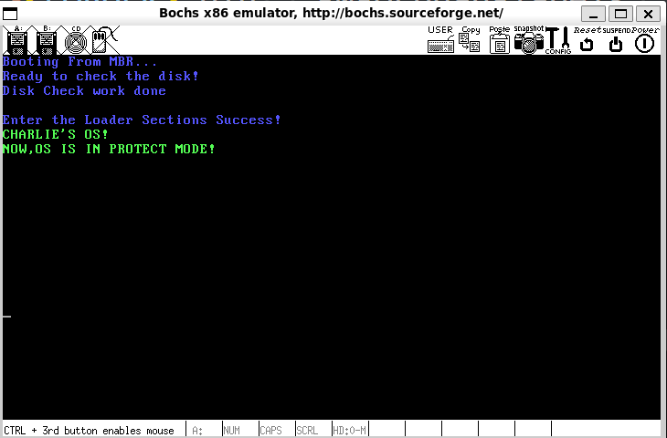

# 从保护模式说起

​	现在，我们终于准备进入加载器了，加载器就是将我们的内核加载进入内存，准备进入我们的任务核心——那就是使用操作系统向下统管我们的硬件，对向上的应用程序提供一个有效的，简化的计算机抽象。

​	在这篇博客中，笔者更多打算的是简单说明一下保护模式，GDT布置，内存获取和页表布置等内容。所以，现在我们就可以开始了。量非常大，请慢慢观看。

## 关于保护模式

关于保护模式，笔者有一篇进5000字的导论博客。笔者强烈建议您先看看！

> [保护模式导论](../bonus/ProtectMode.md)

## 从相对于16位指令的32位扩展开始谈起

​	现在我们马上就要run进32位。在保护模式导论中，笔者强调了我们的数据和代码都应该是32位的，否则就会抛出异常。

​	在NASM中，显示的指定我们使用32位进行编码的办法是

```
[bits 32]
```

​	在这之后的所有的代码都将会被32位大小进行编译。这个时候，我们的所有的代码都会按照32位的模式进行编译。这个，需要我们做好了GDT表的初始化和A20地址线的开启之后，我们才会做这个事情。

## 布置我们的GDT表

​	关于GPT表本身的阐述，我已经分离到了保护模式导论中去了，现在，笔者直接给出gpt.inc文件：

```asm
; -----------------------------------
;   gpt.inc promised the gpt settings
; -----------------------------------
; the section's size per is 4K
DESC_G_4K       equ     (1 << 23)

; Running in the 32bits mode
DESC_D_32       equ     (1 << 22)
; Disabling as we run in 32bits mode, code page is 32 bits
DESC_L          equ     (0 << 21)
; For fun, no usage here :)
DESC_AVL        equ     (0 << 20)
; (4GB / 4KB) - 1 = 0xFFFFF，Segment limits is 0xFFFF
DESC_LIMIT_CODE2 equ    11110_00000_00000_00000b
DESC_LIMIT_DATA2 equ    DESC_LIMIT_CODE2
; base addr of Protect mode is 0xb8000, set as here
DESC_LIMIT_VIDEO2 equ   1011b

; the property of the description tables
; TIPS, MY EYES SUCKS FOR COUNTING THE 0 REQUIRED
; So I put it at here :)
DESC_P          equ     1000_0000_0000_0000b
DESC_DPL_0      equ     000_000000000000b
DESC_DPL_1      equ     010_000000000000b
DESC_DPL_2      equ     100_000000000000b
DESC_DPL_3      equ     110_000000000000b
DESC_S_CODE     equ     1_0000_0000_0000b
DESC_S_DATA     equ     DESC_S_CODE
DESC_S_SYS      equ     00000_0000_0000b
DESC_TYPE_CODE  equ     1000_0000_0000b
DESC_TYPE_DATA  equ     0010_0000_0000b

; Compose the type for the usage in loader.S
; Define segment descriptor properties for code, data, and video
DESC_CODE_HIGH4 equ (0x00 << 24) + DESC_G_4K + DESC_D_32 + \
    DESC_L + DESC_AVL + DESC_LIMIT_CODE2 + \
    DESC_P + DESC_DPL_0 + DESC_S_CODE + DESC_TYPE_CODE + 0x00
; Code segment descriptor:
; - The base is shifted left 24 bits (0x00 << 24)
; - Granularity is set to 4K (DESC_G_4K)
; - 32-bit operand size (DESC_D_32)
; - 32-bit segment limit (DESC_L)
; - Available for system use (DESC_AVL)
; - Code limit set to 2 (DESC_LIMIT_CODE2)
; - Present flag (DESC_P)
; - Descriptor privilege level 0 (DESC_DPL_0)
; - Code segment (DESC_S_CODE)
; - Type of segment is code (DESC_TYPE_CODE)

DESC_DATA_HIGH4 equ (0x00 << 24) + DESC_G_4K + DESC_D_32 + \
    DESC_L + DESC_AVL + DESC_LIMIT_DATA2 + \
    DESC_P + DESC_DPL_0 + DESC_S_DATA + DESC_TYPE_DATA + 0x00
; Data segment descriptor:
; - Similar structure as the code segment but for data segment (DESC_S_DATA and DESC_TYPE_DATA)

DESC_VIDEO_HIGH4 equ (0x00 << 24) + DESC_G_4K + DESC_D_32 + \
    DESC_L + DESC_AVL + DESC_LIMIT_VIDEO2 + \
    DESC_P + DESC_DPL_0 + DESC_S_DATA + DESC_TYPE_DATA + 0x00
; Video segment descriptor:
; - Similar structure to the data segment but with a different limit (DESC_LIMIT_VIDEO2)

; Selector Property Definitions
RPL0    equ 00b        ; Requestor Privilege Level 0 (highest privilege)
RPL1    equ 01b        ; Requestor Privilege Level 1
RPL2    equ 10b        ; Requestor Privilege Level 2
RPL3    equ 11b        ; Requestor Privilege Level 3 (lowest privilege)

TI_GDT  equ 000b       ; Table Indicator for GDT (Global Descriptor Table)
TI_LDT  equ 100b       ; Table Indicator for LDT (Local Descriptor Table)

; Selector values for different segments
SELECTOR_CODE equ (0x0001 << 3) + TI_GDT + RPL0
; Code segment selector (index 1 in GDT, TI_GDT, RPL0)

SELECTOR_DATA equ (0x0002 << 3) + TI_GDT + RPL0
; Data segment selector (index 2 in GDT, TI_GDT, RPL0)

SELECTOR_VIDEO equ (0x0003 << 3) + TI_GDT + RPL0
; Video segment selector (index 3 in GDT, TI_GDT, RPL0)


%macro GPT_TABLE 0  
    GDT_BASE:
        dd 0x0000_0000                      ; GDT Base Must be dummy
        dd 0x0000_0000                      ; I say it at bonus/ProtectMode.md
    CODE_DESC:
        dd 0x0000_ffff                      ; Set code descriptor limit to 0xffff
        dd DESC_CODE_HIGH4                  ; Set code descriptor attributes
    DATA_STACK_DESC:
        dd 0x0000_ffff                      ; Set data and stack descriptor limit to 0xffff
        dd DESC_DATA_HIGH4                  ; Set data and stack descriptor attributes
    
    VIDEO_DESC:
        dd 0x8000_0007                      ; Set video descriptor limit to 7
        dd DESC_VIDEO_HIGH4                 ; Set video descriptor attributes
    
    GDT_SIZE equ $ - GDT_BASE               ; Calculate the size of the GDT table
    GDT_LIMIT equ GDT_SIZE - 1              ; Set the GDT limit (size - 1)
    times 60 dq 0                           ; Reserve 60 bytes (data)
    ; Lastly, the GDT Table
    GDT_PTR dw GDT_LIMIT                    ; Set the pointer to the GDT limit
            dd GDT_BASE                     ; Set the base address of the GDT    
%endmacro
```

​	在Loader.S中，就写下这样的话：

```asm
%include "boot.inc"       ; Include boot section
%include "gpt.inc"        ; Include GPT section
%include "print.inc"      ; Include print section

; -------------------------------------------
;   Author Mentioned:
;       You can place a jmp here, but the base will
;       be offseted to 0x903, so remember this later
; -------------------------------------------
section loader vstart=LOADER_BASE_ADDR   ; Define loader section starting at LOADER_BASE_ADDR
    jmp loader_start                      ; Jump to loader_start

; gpt table here, see the gpt.inc for better 
GPT_TABLE

LOADER_STACK_TOP    equ LOADER_BASE_ADDR   ; Set stack top address for the loader
enter_loader        db "Enter the Loader Sections Success!", 0  ; Success message string

; Jmp to here!
loader_start:
    mov si, enter_loader                 ; Load the address of the message into si
    mov cx, 4                            ; Set the number of characters to print
    call loader_print_strings            ; Call function to print strings
    ;
```

​	在上一个MBR跳转进来之后呢，我们直接进一步跳下去，跳过我们的GDT表！打印一个信息。

## 打开A20地址线

​	我们马上就要飞跃进入32位的CPU时代了，所以下一步非常的关键。就是打开A20地址线，允许我们访问更多的内存。

​	A20地址线的打开办法是从0x92端口获取我们的状态寄存，然后为第二位赋值1.注意，不要使用mov的办法，因为我们还有其他的选项需要保留，使用or赋值是最合理的。

```asm
    ; open the A20
    in al, 0x92                          ; Read from port 0x92
    or al, 0000_0010b                    ; Set the A20 bit to enable it
    out 0x92, al                         ; Write the modified value back to port 0x92
```

## 加载GDT

```
lgdt [GDT_PTR]
```

​	注意！我们的GDTR寄存器属于程序员不可知寄存器，所以，需要使用一个叫做LGDT的指令将我们的GDT的相关的参数加载进入我们的寄存器中。

## 打开我们的保护模式

​	终于！我们终于来到了保护模式的开关的位置！我们就是要操作我们的CR0控制寄存器。将其PE位置上1.整个CR0寄存器的全貌是

| 标志位 | 描述                             |
| ------ | -------------------------------- |
| PE     | Protection Enable                |
| MP     | Monitor coProcessor/Math Present |
| EM     | Emulation                        |
| TS     | Task Switched                    |
| ET     | Extension Type                   |
| NE     | Numeric Error                    |
| WP     | Write Protect                    |
| AM     | Alignment Mask                   |
| NW     | Not Writethrough                 |
| CD     | Cache Disable                    |
| PG     | Paging                           |

​	我们还会再下一篇博客中再谈到分页的事情，所以不着急，我们一步一步慢慢来。

```asm
    lgdt [GDT_PTR]                       ; Load the GDT pointer
    mov eax, cr0                         ; Read the control register CR0
    or eax, 0x0000_0001                  ; Set the PE bit to enable protected mode
    mov cr0, eax                         ; Write the updated value back to CR0
```

​	现在，万事俱备，只欠东风，我们下一步就是尝试跳转道32位的世界了，请看代码：

```asm
	jmp dword SELECTOR_CODE:protect_mode_start ; Jump to protected mode start
   	; ... codes for loader_print_string
[bits 32]                                ; Set 32-bit mode for the following code
protect_mode_start:
    mov ax, SELECTOR_DATA                ; Load the data selector into ax
    mov ds, ax                           ; Set ds to the value in ax

    mov es, ax                           ; Set es to the value in ax
    mov ss, ax                           ; Set ss to the value in ax

    mov esp, LOADER_STACK_TOP            ; Set the stack pointer to the loader stack top
    mov ax, SELECTOR_VIDEO               ; Load the video selector into ax
    mov gs, ax                           ; Set gs to the value in ax

    push di                               ; Save di register
    SET_PROTECT_PRINT_LINE 5             ; Set the line to print for the protection mode
    print_hello_os_protect_mode          ; Print the hello message for protected mode
    SET_PROTECT_PRINT_LINE 6             ; Set the next line to print
    print_protect_mode_state             ; Print the protected mode state

    pop di                                ; Restore di register
    Terminate                            ; Terminate the loader process
```

​	当然，这里设计到了我们的print.inc文件，笔者也给出来

```asm
%include "boot.inc"

; ------------------------------------
;   print.inc helps print some infos
; ------------------------------------

; ------------------------------------
; In VGA Text Mode, Each Line contains 80 chars
; and 2 bytes each char promised 160 bytes are requried
; for each line, so add 160 can shift the displaying into
; next line
; ------------------------------------
%define NEW_LINE_LENGTH 160

; base offser print of the 
%define BASE_PRINT              0

; ------------------------------------
;   SET_PROTECT_PRINT_LINE
;   params: line offset in the protected mode
; ------------------------------------
%macro SET_PROTECT_PRINT_LINE 1
    mov di, BASE_PRINT + %1 * NEW_LINE_LENGTH
%endmacro

; ------------------------------------
;   PRINT_IN_PROTECT_MODE
;   params1: the Char display
;   params2: the Style follows the VGA Settings
;   ---------------------------------
;   | K | R | G | B | I | R | G | B |
;   ---------------------------------
; ------------------------------------

%macro PRINT_IN_PROTECT_MODE 2
    mov byte [gs:di], %1
    inc di
    mov byte [gs:di], %2
    inc di
%endmacro

; ------------------------------------
;   PRINT_IN_PROTECT_MODE
;   params1: the Char display
;   Protect Mode Print Style
%define PRO_PRINT_STYLE         0x0A
; ------------------------------------
%macro PRINT_IN_PROTECT_MODE_STYLE 1
    mov byte [gs:di], %1
    inc di
    mov byte [gs:di], PRO_PRINT_STYLE
    inc di
%endmacro

; Oh shit, I make a difficulty in displaying
; as the data segments abolished in the using file
; so currently place as here
; then i shell modified at next release :)
; possibly...

; Author Update
; I find the currect way to make a display
; but not this chapter! so it should be a
; mysterious right now ;)
%macro print_hello_os_protect_mode 0
    PRINT_IN_PROTECT_MODE_STYLE 'C'
    PRINT_IN_PROTECT_MODE_STYLE 'H'
    PRINT_IN_PROTECT_MODE_STYLE 'A'
    PRINT_IN_PROTECT_MODE_STYLE 'R'
    PRINT_IN_PROTECT_MODE_STYLE 'L'
    PRINT_IN_PROTECT_MODE_STYLE 'I'
    PRINT_IN_PROTECT_MODE_STYLE 'E'
    PRINT_IN_PROTECT_MODE_STYLE 0x27
    PRINT_IN_PROTECT_MODE_STYLE 'S'
    PRINT_IN_PROTECT_MODE_STYLE ' '
    PRINT_IN_PROTECT_MODE_STYLE 'O'
    PRINT_IN_PROTECT_MODE_STYLE 'S'
    PRINT_IN_PROTECT_MODE_STYLE '!'
%endmacro

%macro print_protect_mode_state 0
    PRINT_IN_PROTECT_MODE_STYLE 'N'
    PRINT_IN_PROTECT_MODE_STYLE 'O'
    PRINT_IN_PROTECT_MODE_STYLE 'W'
    PRINT_IN_PROTECT_MODE_STYLE ','
    PRINT_IN_PROTECT_MODE_STYLE 'O'
    PRINT_IN_PROTECT_MODE_STYLE 'S'
    PRINT_IN_PROTECT_MODE_STYLE ' '
    PRINT_IN_PROTECT_MODE_STYLE 'I'
    PRINT_IN_PROTECT_MODE_STYLE 'S'
    PRINT_IN_PROTECT_MODE_STYLE ' '
    PRINT_IN_PROTECT_MODE_STYLE 'I'
    PRINT_IN_PROTECT_MODE_STYLE 'N'
    PRINT_IN_PROTECT_MODE_STYLE ' '
    PRINT_IN_PROTECT_MODE_STYLE 'P'
    PRINT_IN_PROTECT_MODE_STYLE 'R'
    PRINT_IN_PROTECT_MODE_STYLE 'O'
    PRINT_IN_PROTECT_MODE_STYLE 'T'
    PRINT_IN_PROTECT_MODE_STYLE 'E'
    PRINT_IN_PROTECT_MODE_STYLE 'C'
    PRINT_IN_PROTECT_MODE_STYLE 'T'
    PRINT_IN_PROTECT_MODE_STYLE ' '
    PRINT_IN_PROTECT_MODE_STYLE 'M'
    PRINT_IN_PROTECT_MODE_STYLE 'O'
    PRINT_IN_PROTECT_MODE_STYLE 'D'
    PRINT_IN_PROTECT_MODE_STYLE 'E'
    PRINT_IN_PROTECT_MODE_STYLE '!'
%endmacro
```

​	哈哈，实在是笨拙，不过不必着急，你可以自己尝试改一下这个，算是笔者留的小伏笔了！提示你：这个函数千万不要放错了位置，放到16位代码段去了，否则就会出现位数不匹配，导致机器死机或者是疯狂的重启。

​	当然，之前的loader_print_string的代码，笔者放出来

> 小疑问：为什么不复用我们的mbr_print_string呢？这个问题笔者决定交给你来探索。你认为一个纯粹的二进制文件支持向外寻找符号吗？所以链接器的作用是什么呢？

```asm
; ------------------------------------------
; loader_print_strings
; Function Name: loader_print_strings
; Parameters: si - string address
;            cl - line number
; ------------------------------------------
loader_print_strings:
    push di                              ; Save di register
    push ax                              ; Save ax register
    mov ax, 0xA0                         ; Load value 0xA0 into ax
    mov di, 0x00                         ; Set di to 0 (GS segment offset)
    mul cl                                ; Multiply ax by cl
    add di, ax                            ; Add the result to di

loader_store_loop:
    lodsb                                ; Load a byte from [si] into al and update si
    or al, al                            ; Check if the character is 0 (end of string)
    jz loader_done_print                 ; If al is 0, jump to end of print loop

    ; Store character into [gs:di]
    mov [gs:di], al                     ; Store the character in gs:di
    inc di                               ; Increment di to point to the next position

    ; Store 0xA4 into [gs:di]
    mov byte [gs:di], PRINT_STYLE       ; Store 0xA4 in gs:di (set style)
    inc di                               ; Increment di to the next position

    jmp loader_store_loop                ; Continue processing the next character

loader_done_print:
    pop ax                               ; Restore ax register
    pop di                               ; Restore di register
    ret            
```

​	放到`[bits 32]`之前的位置上！

​	到这里我们的代码部分就写完了。下一步，我们来更改Makefile

```makefile
MBR 	= mbr
LOADER	= loader
UTILS   = utils
# Same in bochsrc, if u gonna switch the name, do also modified the bochsrc
BOOT_IMG	= boot.img
ASM_INC_DIR = include/asm

MBR-OBJ:
	nasm -o ${MBR}.bin 		-w-orphan-labels	-I${ASM_INC_DIR} ${MBR}.S
	nasm -o ${LOADER}.bin 	-w-orphan-labels	-I${ASM_INC_DIR} ${LOADER}.S

.PHONY: clean upload all

# clean the builds
clean:
	rm *.bin *.out *.img

upload:
	rm -rf ${BOOT_IMG}
	bximage -func=create -hd=60M -q ${BOOT_IMG}
	dd if=${MBR}.bin of=${BOOT_IMG} bs=512 count=1 conv=notrunc
	dd if=${LOADER}.bin of=${BOOT_IMG} bs=512 count=4 seek=2 conv=notrunc
	bochs -f bochsrc

all:
	make clean;make;make upload
```

## 效果图



​	完美收工！

## 代码

> [3.1部分代码](./3.1_code)