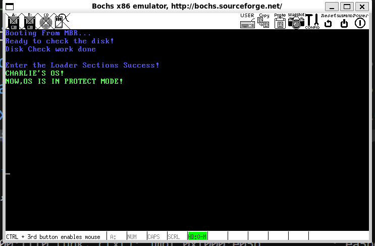

# 加载我们的内核1——检查我们的内存信息

​	现在，我们可以进一步迈向我们的内核了。那就是加载我们的内核。刚刚我们说过，加载我们的内核之前需要做的就是配置好我们的GPT表，开启A20地址分线和开启保护模式，在之后，我们就需要确定我们的内存大小，布置我们的页表以及将内核加载进入我们的内存。从而进入我们的操作系统当中去。本篇的任务亦如此。

## 如何检测内存

​	BIOS存在一个方法，那就是使用BIOS 0x15号中断完成对内存的检测。说起来，就是分为三个部分：

- 办法1：使用系统功能号0xE820办法，遍历主机板上所有可以被识别的内存，这样我们就可以获取主机上所有的内存大小了
- 办法2：使用功能号0xE801，分别检测两次内存。第一次检测的是低15MB的内存，第二次才会检测16MB~4GB的内存。这个方法就是极限检测4GB的内存
- 办法3：使用AH为0x88的办法，最大只可以返回64MB内存。

​	笔者看到大部分人的实现都是0xE820办法失败后，就直接进入卡死通知内存检测失败了。笔者这里打算致敬一下《操作系统真相还原》，三个方法都进行尝试。

### 使用0xE820办法获取所有的内存

​	0xE820办法是最好的，它会返回我们内存信息的详细布局。每一个系统内存的属性是各不相同的，所以，BIOS采取一种类似于遍历的办法来逐步获取每一个属性部分的内存。所以，我们请求一次，他会返回我们内存信息的属性和状况一次直到没有了。

​	为了记录BIOS好心给我们的一大堆信息，我们必须对接好内存的格式。答案是——ARDS（地址范围描述符）

| 字节偏移量 | 属性名称     | 描述                             |
| ---------- | ------------ | -------------------------------- |
| 0          | BaseAddrLow  | 基地址的低 32 位                 |
| 4          | BaseAddrHigh | 基地址的高 32 位                 |
| 8          | LengthLow    | 内存长度的低 32 位，以字节为单位 |
| 12         | LengthHigh   | 内存长度的高 32 位，以字节为单位 |
| 16         | Type         | 本段内存的类型                   |

​	这个结构体的大小是20个字节，每一次我们的字段大小都会是4个字节大小，一共5个字段，所以一个这样的结构体就是20个字节！我们是32位OS，一般而言就会用到低32位的属性。

​	下面来看看Type。Type说明了这段内存的用途，比如说，我们的BIOS会告诉我们的这块内存的用途可能是如下的：

- 系统的ROM
- ROM用到了这部分的内存做一部分事情
- 设备内存被安排到了这里
- 因为未知原因，这段内存没办法提供给标准设备使用

| Type 值 | 名称                 | 描述                                                         |
| ------- | -------------------- | ------------------------------------------------------------ |
| 1       | AddressRangeMemory   | 这段内存可以被操作系统使用                                   |
| 2       | AddressRangeReserved | 内存使用中或者被系统保留，操作系统不可以用此内存             |
| 其他    | 未定义               | 未定义，将来会用到，目前保留。但是需要操作系统一样将其视为 ARR（AddressRangeReserved） |

​	还是一样，我们只关心系统编程，让我们看看这个时候我们应该怎么做：

​	我们的功能的输入接口看下面这个表格

| 寄存器或状态位 | 参数用途                                                     |
| :------------- | :----------------------------------------------------------- |
| EAX            | 子功能号：**EAX 寄存器用来指定子功能号，此处输入为 0xE820**  |
| EBX            | ARDS 后续值：内存信息需要按类型分多次返回，由于每次执行一次中断都只返回一种类型内存的 ARDS 结构，所以要记录下一个待返回的内存 ARDS。在下次中断调用时通过此值告诉 BIOS 该返回哪个 ARDS，这就是后续值的作用。**第一次调用时一定要置为 0**，EBX 具体值我们不用关注，字取决于具体 BIOS 的实现。每次中断返回后，BIOS 会更新此值 |
| ES:DI          | ARDS 缓冲区：BIOS 将获取到的内存信息写入此寄存器指向的内存，每次都以 ARDS 格式返回 |
| ECX            | ARDS 结构的字节大小：用来指示 BIOS 写入的字节数。调用者和 BIOS 都同时支持的大小是 20 字节，将来也许会扩展此结构 |
| EDX            | 固定为签名标记 0x53444150，此十六进制数字是字符串 SMAP 的 ASCII 码；BIOS 将调用者正在请求的内存信息写入 ES：DI 寄存器所指向的 ARDS 缓冲区后，再用此签名校验其中的信息 |

​	下面这个是输出的表格，在这里，我们看到我们应该如何承接我们的输出内存信息

| 寄存器或状态位 | 参数用途                                                     |
| :------------- | :----------------------------------------------------------- |
| CF 位          | 若 CF 位为 0 表示调用未出错，CF 为 1，表示调用出错           |
| EAX            | 字符串 SMAP 的 ASCII 码 0x53444150                           |
| ES:DI          | ARDS 缓冲区地址，同输入值是一样的，返回时此结构中已经被 BIOS 填充了内存信息 |
| ECX            | BIOS 写入到 ES:DI 所指向的 ARDS 结构中的字节数，**BIOS 最小写入 20 字节** |
| EBX            | 后续值：下一个 ARDS 的位置。每次中断返回后，BIOS 会更新此值，BIOS 通过此值可以找到下一个待返回的 ARDS 结构，咱们不需要改变 EBX 的值，下一次中断调用时还会用到它。**在 CF 位为 0 的情况下，若返回后的 EBX 值为 0，表示这是最后一个 ARDS 结构** |

​	所以，我们的做法是——

1. 按照BIOS的功能输入要求，填写我们的表单参数
2. 调用int 0x15号中断
3. 在CF位为0的情况下，我们的输出会放置有我们期盼的结果。

### 使用E801办法获取我们的内存

​	这个就会更加的简单了，我们的这个方法最大也就只能认出来4GB的内存。我们的两部分内容是放到了AX-CX组和BX-DX组，前者衡量的是16MB内存，后者就是4GB余下的部分了。

​	分为两组，设计到历史的缘故。当时一些ISA(Industry Standard Architecture)设备（放心，今天实际上已经绝迹了，你不需要担心为它做兼容）会用到15MB以上的地址做缓冲，这个缓冲是1MB大小，所以，内存检查中，会为了兼容这个1MB的空洞，分次返回我们的内存数量。

​	关于调用部分，我们就是直接使用子功能号就完事了

| 调用或返回 | 寄存器或状态位 | 用途          | 描述             |
| ---------- | -------------- | ------------- | ---------------- |
| 调用前输入 | AX             | Function Code | 子功能号：0xE801 |

​	输出的部分就是简单的算术运算问题。这里就不加以讲解了。

| 调用或返回 | 寄存器或状态位 | 用途         | 描述                                                         |
| ---------- | -------------- | ------------ | ------------------------------------------------------------ |
| 返回后输出 | CF 位          | Carry Flag   | 若 CF 位为 0 表示调用未出错，CF 为 1，表示调用出错           |
|            | AX             | Extended 1   | 以 1KB 为单位，只显示 15MB 以下的内存容量，故最大值为 0x3c00，即最大内存为 0x3c00*1024=15MB |
|            | BX             | Extended 2   | 以 64KB 为单位，内存空间 16MB~4GB 中连续的单位数量，即内存大小为 BX\*64\*1024 字节 |
|            | CX             | Configured 1 | 同 AX                                                        |
|            | DX             | Configured 2 | 同 BX                                                        |

​	所以事已至此，我们看看做什么：

1. 按照BIOS的功能输入要求，直接将我们的EAX赋值成0xE801
2. 调用int 0x15号中断
3. 在CF位为0的情况下，我们的输出会放置有我们期盼的结果。

### 大保底：使用0x88功能

​	这个方法最菜，最简单。我们直接速速看看怎么做就好了（还是会少1MB，这1MB是给中断的，我们后面会覆盖，所以还要加上）

​	输入

| 调用或返回 | 寄存器或状态位 | 描述           |
| ---------- | -------------- | -------------- |
| 调用前输入 | AH             | 子功能号：0x88 |

​	输出

| 调用或返回 | 寄存器或状态位 | 描述                                                         |
| ---------- | -------------- | ------------------------------------------------------------ |
| 返回后输出 | CF 位          | 若 CF 位为 0 表示调用未出错，CF 为 1，表示调用出错           |
|            | AX             | 以 1KB 为单位大小，内存空间 1MB 之上的连续单位数，不包括最低端 1MB 内存，故内存大小为 AX*1024 字节+1MB |

​	所以，现在我们就可以开始搓我们的Loader加载器的正式功能了。

## 开始实现

​	因为这篇的内容代码非常的多，所以，笔者决定还是采用分布的写代码的方式，一个模块一个模块的完成我们这次的任务。

### 修正我们的跳转偏移

​	首先就是放置我们的ards描述符表格。在这里，笔者放到了gpt.inc文件中，笔者构思到：我们的ards表跟我们的GPT_PTR都隶属于系统信息，所以为了语义更加明确，分割为了如下的模样

> gpt.inc

```
; -----------------------------------
;   gpt.inc promised the gpt settings
; -----------------------------------
; the section's size per is 4K
DESC_G_4K       equ     (1 << 23)

; Running in the 32bits mode
DESC_D_32       equ     (1 << 22)
; Disabling as we run in 32bits mode, code page is 32 bits
DESC_L          equ     (0 << 21)
; For fun, no usage here :)
DESC_AVL        equ     (0 << 20)
; (4GB / 4KB) - 1 = 0xFFFFF，Segment limits is 0xFFFF
DESC_LIMIT_CODE2 equ    11110_00000_00000_00000b
DESC_LIMIT_DATA2 equ    DESC_LIMIT_CODE2
; base addr of Protect mode is 0xb8000, set as here
DESC_LIMIT_VIDEO2 equ   1011b

; the property of the description tables
; TIPS, MY EYES SUCKS FOR COUNTING THE 0 REQUIRED
; So I put it at here :)
DESC_P          equ     1000_0000_0000_0000b
DESC_DPL_0      equ     000_000000000000b
DESC_DPL_1      equ     010_000000000000b
DESC_DPL_2      equ     100_000000000000b
DESC_DPL_3      equ     110_000000000000b
DESC_S_CODE     equ     1_0000_0000_0000b
DESC_S_DATA     equ     DESC_S_CODE
DESC_S_SYS      equ     00000_0000_0000b
DESC_TYPE_CODE  equ     1000_0000_0000b
DESC_TYPE_DATA  equ     0010_0000_0000b

; Compose the type for the usage in loader.S
; Define segment descriptor properties for code, data, and video
DESC_CODE_HIGH4 equ (0x00 << 24) + DESC_G_4K + DESC_D_32 + \
    DESC_L + DESC_AVL + DESC_LIMIT_CODE2 + \
    DESC_P + DESC_DPL_0 + DESC_S_CODE + DESC_TYPE_CODE + 0x00
; Code segment descriptor:
; - The base is shifted left 24 bits (0x00 << 24)
; - Granularity is set to 4K (DESC_G_4K)
; - 32-bit operand size (DESC_D_32)
; - 32-bit segment limit (DESC_L)
; - Available for system use (DESC_AVL)
; - Code limit set to 2 (DESC_LIMIT_CODE2)
; - Present flag (DESC_P)
; - Descriptor privilege level 0 (DESC_DPL_0)
; - Code segment (DESC_S_CODE)
; - Type of segment is code (DESC_TYPE_CODE)

DESC_DATA_HIGH4 equ (0x00 << 24) + DESC_G_4K + DESC_D_32 + \
    DESC_L + DESC_AVL + DESC_LIMIT_DATA2 + \
    DESC_P + DESC_DPL_0 + DESC_S_DATA + DESC_TYPE_DATA + 0x00
; Data segment descriptor:
; - Similar structure as the code segment but for data segment (DESC_S_DATA and DESC_TYPE_DATA)

DESC_VIDEO_HIGH4 equ (0x00 << 24) + DESC_G_4K + DESC_D_32 + \
    DESC_L + DESC_AVL + DESC_LIMIT_VIDEO2 + \
    DESC_P + DESC_DPL_0 + DESC_S_DATA + DESC_TYPE_DATA + 0x00
; Video segment descriptor:
; - Similar structure to the data segment but with a different limit (DESC_LIMIT_VIDEO2)

; Selector Property Definitions
RPL0    equ 00b        ; Requestor Privilege Level 0 (highest privilege)
RPL1    equ 01b        ; Requestor Privilege Level 1
RPL2    equ 10b        ; Requestor Privilege Level 2
RPL3    equ 11b        ; Requestor Privilege Level 3 (lowest privilege)

TI_GDT  equ 000b       ; Table Indicator for GDT (Global Descriptor Table)
TI_LDT  equ 100b       ; Table Indicator for LDT (Local Descriptor Table)

; Selector values for different segments
SELECTOR_CODE equ (0x0001 << 3) + TI_GDT + RPL0
; Code segment selector (index 1 in GDT, TI_GDT, RPL0)

SELECTOR_DATA equ (0x0002 << 3) + TI_GDT + RPL0
; Data segment selector (index 2 in GDT, TI_GDT, RPL0)

SELECTOR_VIDEO equ (0x0003 << 3) + TI_GDT + RPL0
; Video segment selector (index 3 in GDT, TI_GDT, RPL0)

%macro GPT_TABLE 0  
    GDT_BASE:
        dd 0x0000_0000                      ; GDT Base Must be dummy
        dd 0x0000_0000                      ; I say it at bonus/ProtectMode.md
    CODE_DESC:
        dd 0x0000_ffff                      ; Set code descriptor limit to 0xffff
        dd DESC_CODE_HIGH4                  ; Set code descriptor attributes
    DATA_STACK_DESC:
        dd 0x0000_ffff                      ; Set data and stack descriptor limit to 0xffff
        dd DESC_DATA_HIGH4                  ; Set data and stack descriptor attributes
    
    VIDEO_DESC:
        dd 0x8000_0007                      ; Set video descriptor limit to 7
        dd DESC_VIDEO_HIGH4                 ; Set video descriptor attributes
    
    GDT_SIZE equ $ - GDT_BASE               ; Calculate the size of the GDT table
    GDT_LIMIT equ GDT_SIZE - 1              ; Set the GDT limit (size - 1)
    times 60 dq 0                           ; Reserve 60 bytes x 4(data)
%endmacro

%macro  KERNEL_INFO 0
; memorize the memory we owns, we will setup user pool then
total_mem_bytes dd 0					 
; gpt ptr base
GDT_PTR  
    dw  GDT_LIMIT 
    dd  GDT_BASE
    
; kernel infos
; buf for the 244 and record how many ards buffer actually
ards_buf times 244 db 0
ards_nr dw 0		         
%endmacro
```

​	其次，笔者打算严格的保证我们的GPT偏移是0x900，还有我们为了方便存储的内存容量大小，所以，我们直接修改MBR的跳转地址，分析一下，首先，我们的GPT表大小是给出的8个dd和60个dp大小填充的——64x8 = 512 = 0x200字节大小的GPT表。

```
%macro GPT_TABLE 0  
    GDT_BASE:
        dd 0x0000_0000                      ; GDT Base Must be dummy
        dd 0x0000_0000                      ; I say it at bonus/ProtectMode.md
    CODE_DESC:
        dd 0x0000_ffff                      ; Set code descriptor limit to 0xffff
        dd DESC_CODE_HIGH4                  ; Set code descriptor attributes
    DATA_STACK_DESC:
        dd 0x0000_ffff                      ; Set data and stack descriptor limit to 0xffff
        dd DESC_DATA_HIGH4                  ; Set data and stack descriptor attributes
    
    VIDEO_DESC:
        dd 0x8000_0007                      ; Set video descriptor limit to 7
        dd DESC_VIDEO_HIGH4                 ; Set video descriptor attributes
    
    GDT_SIZE equ $ - GDT_BASE               ; Calculate the size of the GDT table
    GDT_LIMIT equ GDT_SIZE - 1              ; Set the GDT limit (size - 1)
    times 60 dq 0                           ; Reserve 60 bytes x 4(data)
%endmacro
```

​	其次，我们的系统信息需要薄记的内容为：(2 + 4) * 2+ 244 = 256 = 0x100个字节大小，所以，事情变得非常的简单。我们只需要在原来的基础上多跳转0x300就好了。

```
%macro  KERNEL_INFO 0
; memorize the memory we owns, we will setup user pool then
total_mem_bytes dd 0					 
; gpt ptr base
GDT_PTR  
    dw  GDT_LIMIT 
    dd  GDT_BASE
    
; kernel infos
; buf for the 244 and record how many ards buffer actually
ards_buf times 244 db 0
ards_nr dw 0		         
%endmacro
```

> boot.inc中添加一行：

```
%define JMP_TO_LOADER           (LOADER_BASE_ADDR + 0x300)
```

​	为了测试我们的想法，我们需要把enter_loader的字符串放到loader_print_strings的上方（之前放到了loader_start的下方，这会导致loader_start的偏移量还要加上这个字符串的长度，你就会发现你的loader飞了），现在我们启动一下，就会发现没有任何问题。程序仍然有上一次结尾的现象，非常的安全！



### 开始内存检查

​	现在我们就是要首先我们的内存检查了，回顾一下我们的。首先就是预备一下：

```
   xor ebx, ebx		      ; ebx should be 0
   mov edx, E820Magic	      
   mov di, ards_buf	      ;  see gpt sections for details
```

​	这里面装啥，具体看上面我说的输入编程表

```
.fetch_each_memory_info:	      ;
   mov eax, E820SubFunc	   ;
   mov ecx, 20		         ;  20 bytes each
   int 0x15
   ;  if 1, failed, so we check e801
   jc .try_e801   
   add di, cx              ; Increase di by 20 bytes to point to the new ARDS structure position in the buffer
   inc word [ards_nr]       ; Increment the ARDS count
   cmp ebx, 0               ; If ebx is 0 and cf is not 1, it means all ARDS have been returned, and we are at the last one
   jnz .fetch_each_memory_info

```

​	首先，我们必须要一次获取并且填充我们的ards描述符表，当我们的CF为1的时候，就说明我们的E820检查办法失败了，跳转道我们的E801办法继续尝试

```asm
; Find the maximum value of (base_add_low + length_low) among all ARDS structures, which represents the largest memory capacity.
   mov cx, [ards_nr]        ; Loop through each ARDS structure, the loop runs for the number of ARDS structures
   mov ebx, ards_buf 
   xor edx, edx             ; Clear edx, which will hold the largest memory capacity
.find_max_mem_area:        ; No need to check the type, the largest memory block is always usable
   mov eax, [ebx]           ; base_add_low
   add eax, [ebx+8]         ; length_low
   add ebx, 20              ; Move to the next ARDS structure in the buffer
   cmp edx, eax             ; Compare and find the maximum value, edx will always hold the largest memory capacity
   jge .next_ards
   mov edx, eax             ; edx will hold the total memory size

.next_ards:
   loop .find_max_mem_area
   jmp .mem_get_ok
```

​	这一步则是找出来我们的最大的内存区域，这个区域必然是可用的，所以找出来，然后准备填写到我们的total_mem_bytes上去，笔者已经封装到了KERNEL_INFO的宏中去了。

​	E801的编程方法就变得简单

```asm
;------  int 15h ax = E801h Max support 4G  ------
.try_e801:
   mov ax,E801Magic
   int 0x15
   jc .try88Method   ; same, if we failed, our last way :(

   mov cx,0x400	     
   mul cx 
   shl edx,16
   and eax,0x0000FFFF
   or edx,eax
   add edx, 0x100000    ; add 1MB
   mov esi,edx	         ;

;  transfer to byte storage
   xor eax,eax
   mov ax,bx		
   mov ecx, 0x10000	; => 64KB
   mul ecx		      
   add esi,eax		  
   mov edx,esi		   
   jmp .mem_get_ok

```

​	最后是我们的88方法

```asm
;-----------------  int 15h ah = 0x88 64M  ----------
.try88Method: 
   ;int 15后，KB as the counts
   mov  ah, 0x88
   int  0x15
   jc .error_hlt
   and eax,0x0000FFFF
      
   mov cx, 0x400    
   mul cx
   shl edx, 16	     
   or edx, eax	    
   add edx,0x100000  

.mem_get_ok:
   mov [total_mem_bytes], edx	 ; put it into the case, we will fetch it later:)
   ; ...
; memory check failed 
.error_hlt:		  
   hlt
```

​	程序不会有啥其他的现象，不过你要是喜欢，可用自行调试查看信息。笔者给你看一眼：

```
<bochs:1> c
^CNext at t=451984200
(0) [0x000000000f57] 0008:00000f57 (unk. ctxt): jmp .-2  (0x00000f57)     ; ebfe
<bochs:2> xp 0xb00
[bochs]:
0x00000b00 <bogus+       0>:    0x02000000
```

​	在这个地方就是存放着我们的内存啦！32MB大小！