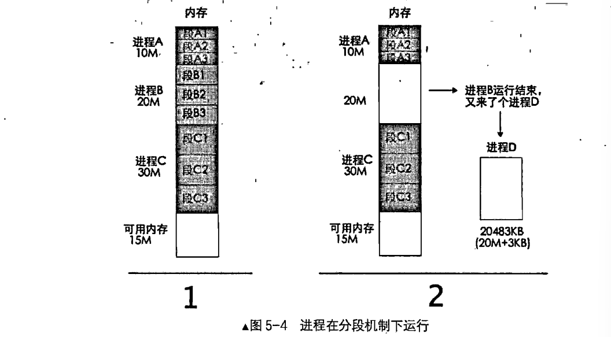
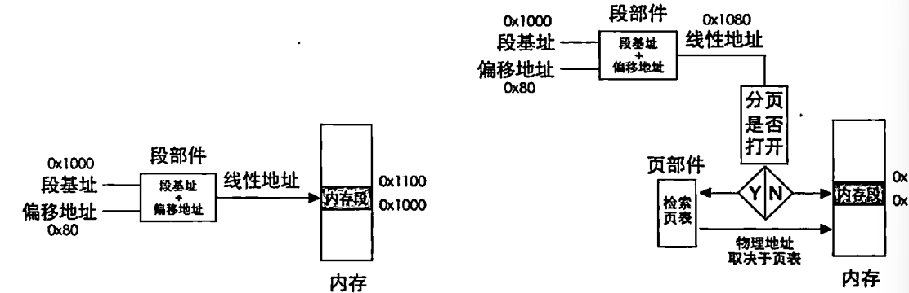
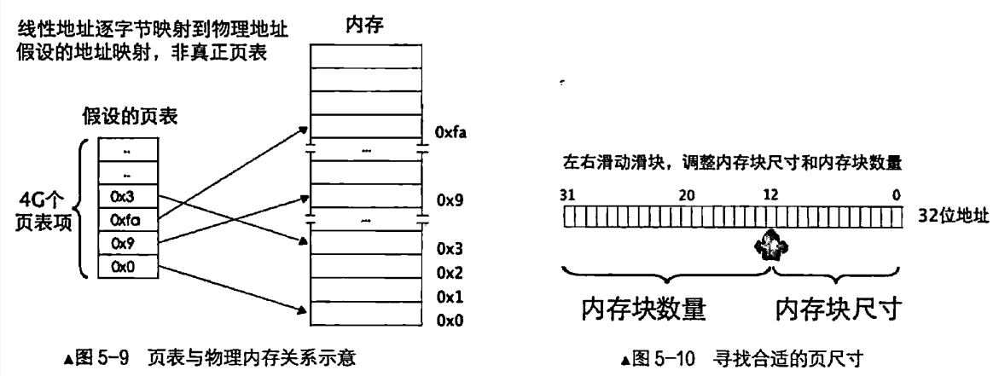
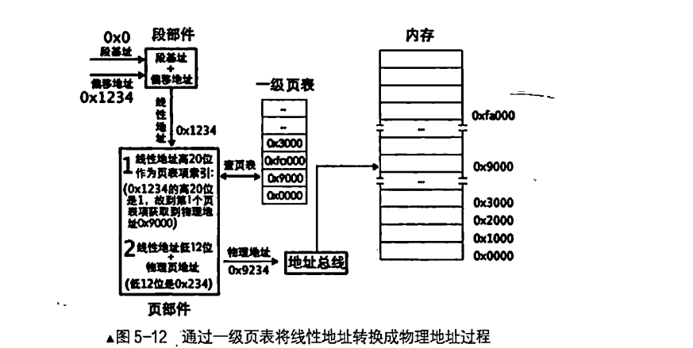
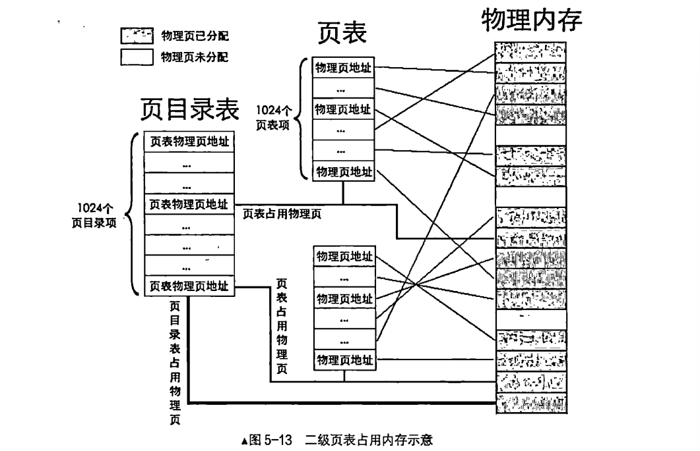
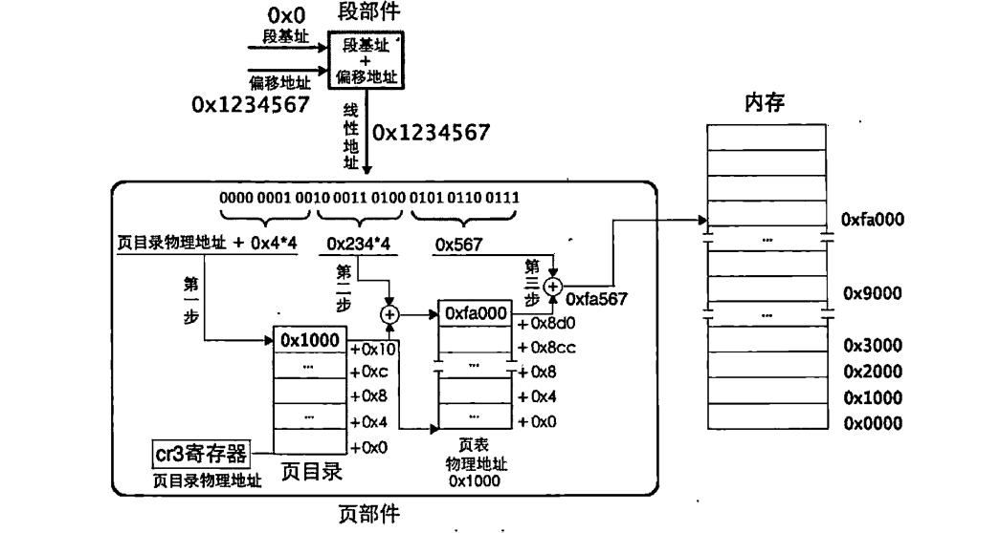
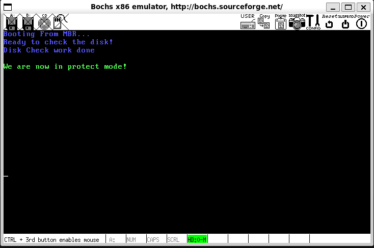

# 建立我们的页表

> Preface：非常感谢来自[Dessera (Dessera)](https://github.com/Dessera)的提问，笔者决定根据他的疑问，修订了一下这个博客（2025.2.27）

​	上一小节中，我们建立了内存探测的机制。下面就是建立我们的页表了。

## 现代操作系统的划分方案：分页机制

​	实际上我们更多使用的是分页机制。分页出现的比分段晚。我们知道。Intel等早期的计算机架构设计公司创新，推广了我们的分段机制，但是它没办法解决一个非常尴尬的问题——那就是我们的内存碎片问题。我们看看一个例子：




​	这是一个操作系统内存视图——当进程B撤销后，我们打算换上D进程，他就是需要20483KB，就是比20M稍微大了一点——不好意思，这是不允许被载入的。他要么等待A或者是C进程撤销，要么就是把其中一个段搬到磁盘上。后者被称为内存的交换。我们把暂时还用不上的程序段或者是数据段请到磁盘上，然后用到了再加载回来。我们知道，每一个段描述符都有一个P位，这个P就是代表我们的段在不在内存中，就是上面笔者谈论到的情况。因此，操作系统看到P为0的时候却要访问，就会抛出一个NP异常，我们捕获后再把内存段换上就好了。当然，这个是更加高级的功能。笔者的OS中并没有实现。

​	这个问题就算说到现在还是没有解决，问题就是在于——**我们的程序总是认为我们的地址必须是连续的，但是，可用的物理地址实际上可能并不连续，这就必须请出来我们的计算机的一个大招思想——加抽象层。我们添加页表这个抽象，将程序使用的地址，和真实的物理地址隔离开来**，这样，我们例子中余下的3KB,就可以使用页表这个机制给他映射到低15MB上去不就OK了嘛！这就是页表的作用！

### 先来说说一级页表

​	现在，我们经过了分段之后，拿到了我们组合出来的有效线性地址，这个线性地址就是我们的动手目标。当我们开启分页机制的时候，就要去页表这个部件进行地址转换，才能拿到真正的物理地址。所以，现在我们就需要给两个地址：转换前地址和转换后地址，一个全新的名称：转换前的程序使用的地址，就叫做虚拟地址，转换后的，真实存在于我们的内存的offset，就是我们的物理地址。




​	页表将我们的整个4GB内存都切成大小相同的块，在绝大部分的默认设置下的操作系统，都会把**我们的一块大小，或者被称作一个页面**设置为4096Bytes，或者说4KB。我们隔离了虚拟地址和物理地址，就意味着进程不需要关心我们的地址到底有没有别的东西在参合了，这个工作被解耦合到了我们的页表来做！




​	毫无疑问的，任意一个地址最终会落到某一个物理页中（注意：我们的页面的映射尺寸就是1个页面为单位——一个虚拟页映射成一个物理页，之后具体寻找字节使用低12位偏移）。32位地址空间共有1M（1048756 = 2的20次方，这是因为我们默认4KB为一个页面，余下的部分就区分2的20个这样的页面了，恰好就是1M）个物理页，首先要做的是定位到某个具体物理页，然后给出物理页内的偏移量就可以访问到任意1字节的内存。**所以，用20位二进制就可以表示全部物理页啦。标准页都是4KB，12位二进制便可以表达4KB之内的任意地址。**

​	在32位保护模式下任何地址都是用32位二进制表示的，包括虚拟地址也是。经以上分析，虚拟地址的高20位可用来定位一个物理页，低12位可用来在该物理页内寻址。




​	上面就是一个一级页表转换一个地址的详细过程，我们将高20位看作是页面的索引，使用转换器将我们的高20位转化成一个实际的物理地址index，再使用低的12位在这个物理地址组成的4KB大小的页面块中寻找真正的内存地址。

- 分页机制打开前要将页表地址加载到控制寄存器cr3中，这是启用分页机制的先决条件之一，在介绍二级页表时会细说。所以，在打开分页机制前加载到寄存器cr3中的是页表的物理地址，页表中页表项的地址自然也是物理地址了。
- 虽然内存分页机制的作用是将虚拟地址转换成物理地址，但其转换过程相当于在关闭分页机制下进行，过程中所涉及到的页表及页表项的寻址，它们的地址都被CPU当作最终的物理地址（本来也是物理地址）直接送上地址总线，不会被分页机制再次转换。

### 二级页表，出击！

​	但是问题还是有，我们的一级页表中，每一个页表项都是32字节4Byte，那么页表项全部存满是4MB。另一个问题是——我们的页表项都要提前建立好。每一个进程都会要拥有自己的映射页表项。那问题大了，进程一多，占用就非常的可观。

​	所以我们还是太着急了，既然如此，我们就把页表分拆的思想贯彻到底——我们使用一个页目录表（PDE）来来存储页表。无论是几级页表，标准页的尺寸都是4KB，这一点是不变的。所以4GB线性地址空间最多有1M个标准页。一级页表是将这1M个标准页放置到一张页表中，二级页表是将这1M个标准页平均放置1K个页表中。每个页表中包含有1K个页表项。页表项是4字节大小，页表包含1K个页表项，故页表大小为4KB，这恰恰是一个标准页的大小。



​	现在，我们的转化就变得更加的复杂了：



​	我们依次拆分我们的虚拟地址为PTE，PDE和Offset逐步拿到我们的物理地址。值得注意的是——我们这样分拆，就是为了将不用的细粒度的映射不纳入页表：一级页表需要为整个虚拟地址空间分配连续的页表项，即使某些虚拟地址范围未被使用。这会导致内存浪费；二级页表通过将页表分成多个级别，只分配实际使用的页表部分，从而节省内存。未使用的虚拟地址范围不需要分配页表项。而且，我们还可以动态的增删改查我们的PDE，可以根据需要动态分配和释放页表，适应不同的内存使用模式。

​	下面，我们就来看看以二级页表为例子，每一个PDE，PTE都长啥样

#### PDE

| 31                    | 12   | 11   | 9    | 8    | 7    | 6    | 5    | 4    | 3    | 2    | 1    | 0    |
| --------------------- | ---- | ---- | ---- | ---- | ---- | ---- | ---- | ---- | ---- | ---- | ---- | ---- |
| 页表物理页地址31~12位 | AVL  | G    | 0    | D    | A    | PCD  | PWT  | US   | RW   | P    |      |      |

#### PTE

| 31                | 12   | 11   | 9    | 8    | 7    | 6    | 5    | 4    | 3    | 2    | 1    | 0    |
| ----------------- | ---- | ---- | ---- | ---- | ---- | ---- | ---- | ---- | ---- | ---- | ---- | ---- |
| 物理页地址31~12位 | AVL  | G    | PAT  | D    | A    | PCD  | PWT  | US   | RW   | P    |      |      |

​	说一下每一个位干嘛的：

| 位   | 名称                                           | 描述                                                         |
| ---- | ---------------------------------------------- | ------------------------------------------------------------ |
| P    | Present（存在位）                              | 若为1表示该页存在于物理内存中，若为0表示该表不在物理内存中。操作系统的页式虚拟内存管理通过P位和相应的pagefault异常来实现。 |
| RW   | Read/Write（读写位）                           | 若为1表示可读可写，若为0表示可读不可写。                     |
| US   | User/Supervisor（普通用户/超级用户位）         | 若为1时，表示处于User级，任意级别（0、1、2、3）特权的程序都可以访问该页。若为0，表示处于Supervisor级，特权级别为3的程序不允许访问该页，该页只允许特权级别为0、1、2的程序可以访问。 |
| PWT  | Page-level Write-Through（页级通写位）         | 若为1表示此项采用通写方式，表示该页不仅是普通内存，还是高速缓存。此项和高速缓存有关，“通写”是高速缓存的一种工作方式。通常置为0。 |
| PCD  | Page-level Cache Disable（页级高速缓存禁止位） | 若为1表示该页启用高速缓存，为0表示禁止将该页缓存。通常置为0。 |
| A    | Accessed（访问位）                             | 若为1表示该页被CPU访问过。该位由CPU设置，可以用来记录某一内存页的使用频率。操作系统定期将该位清0，统计一段时间内变成1的次数，从而在内存不足时将使用频率较低的页面换出到外存。 |
| D    | Dirty（脏页位）                                | 当CPU对一个页面执行写操作时，就会设置对应页表项的D位为1。此项仅针对页表项有效，并不会修改页目录项中的D位。 |
| PAT  | Page Attribute Table（页属性表位）             | 能够在页面一级的粒度上设置内存属性。通常置为0。              |
| G    | Global（全局位）                               | 若为1表示是全局页，该页将在高速缓存TLB中一直保存，给出虚拟地址直接就由物理地址，无需三步骤转换。若为0表示不是全局页。 |
| AVL  | Available（可用位）                            | 表示可用，操作系统可用该位，CPU不理会该位的值。              |

### 启动分页的系统编程步骤

​	现在就要启动分页了，启动分页需要做好这些事情：

- 建立我们的pagetable
- 然后将我们的页表地址写入cr3寄存器
- 然后就是将我们的PG位置1通知CPU开启我们的分页机制。

## 上班！看代码

​	为了隔离开来，我们新建一个pagetable.inc文件：

```asm
; page table is placed at 1MB
%define PAGE_TABLE_POSITION    0x100000
%define PAGE_SIZE              4096
; --------- Page Table Properties --------
PAGE_TABLE_P        equ     1b
PAGE_READ           equ     0000_0000b
PAGE_WRITE          equ     0000_0010b
PAGE_USER           equ     0000_0100b
PAGE_SYSTEM         equ     0000_0000b
```

​	我们第一件事情，就是安排我们的页表项搁哪呢。答案是安排到1MB地址处，下面的更多的就是属性的封装宏， 

​	然后写一个函数叫做setup_page！注意的是——我们按照传统的32位分法：即3GB用户，1GB内核，所以内核的虚拟地址位置必然位于0xc0000000处！这个只需要我们扒一个指头算一下就好了。（很简单，`16 / 4 * 3 = 12 -> c`）

​	理解下面的代码，需要我们注意的是——我们的设计是为了以后实现进程方便，我们的目标是：

- 初始化第一个`PDE-PTE`映射组，完成第一个页表的自举访问。从而开启分页之后，我们的地址访问不会崩溃
- 将高1/4的页表PDE部分指向我们的内核空间，原因很简单，之后我们的进程都会有自己的页表，用户页表那就缺啥加载啥，内核的就总是共享那一个就好（内核只有一个，不是吗）


### 逐个自己的清空我们的第一个PDE

这里的代码非常的简单，就是逐个自己的清空我们的第一个PDE。

```asm
;-------------   Create Page Directory and Page Tables   ---------------
setup_page:
; First, clear the space occupied by the page directory byte by byte
   mov ecx, 4096
   mov esi, 0
.clear_page_dir:
   mov byte [PAGE_TABLE_POSITION + esi], 0
   inc esi
   loop .clear_page_dir
```

​	显然，我们的PDE大小是4096个字节，这是怎么来的呢？我们知道，刚刚的图例中，我们看到了二级页表的PDE一共10位，注意到，每一项都是32位大小，也就是4个字节，显然，10位可以表达`2^10 = 1024 = 1K`个数目，每一个数目4个字节，一共4K = 4096，这是没有啥问题的。

​	下面事情就开始复杂起来了。我们马上准备简历第一个PDE。

```asm
; Start creating Page Directory Entries (PDE)
.create_pde:                     ; Create Page Directory Entry
   mov eax, PAGE_TABLE_POSITION
   add eax, 0x1000               ; Now eax is the location and attributes of the first page table
   mov ebx, eax                  ; Assign ebx here to prepare for .create_pte, ebx is the base address.

;   Now store the address of the first page table in both directory entries 0 and 0xc00,
;   One page table can represent 4MB of memory, so addresses below 0xc03fffff and 0x003fffff point to the same page table,
;   This is to prepare for mapping addresses to kernel addresses
   or eax, PAGE_USER | PAGE_WRITE | PAGE_TABLE_P   ; Page directory entry attributes RW and P bits are 1, US is 1, indicating user attributes, accessible by all privilege levels.
   mov [PAGE_TABLE_POSITION + 0x0], eax            ; The first directory entry, write the location (0x101000) and attributes (3) of the first page table into the first directory entry in the page directory table
   mov [PAGE_TABLE_POSITION + 0xc00], eax          ; Each page table entry occupies 4 bytes, 0xc00 represents the directory entry occupied by the 768th page table, directory entries above 0xc00 are used for kernel space,
                                                   ; i.e., page tables 0xc0000000~0xffffffff totaling 1G belong to the kernel, 0x0~0xbfffffff totaling 3G belong to user processes.
   sub eax, 0x1000
   mov [PAGE_TABLE_POSITION + 4092], eax      ; Make the last directory entry point to the address of the page directory table itself
```

​	很显然，我们把一个指针needle设置到了我们的PAGE_TABLE_POSITION上，另一个则是跨过了PDE，准备指向PTE的第一个入口，这样我们就做到了一种线性的对齐。即：我们把第一个PDE指向了我们的第一个PTE。实现了高10位向中间10位索引的作用。这个不难理解，但是` mov [PAGE_TABLE_POSITION + 0xc00], eax `又是为何呢？答案是，我们在之后实现用户和内核进程分层的时候，需要为之分配不一样的页表。现在很显然了，我们给第0xc00和第0x0的页表都安排指向了相同的PTE，也就意味着我们会拿到相同的地址了。同样，我们在第一个PDE的末尾，也就是最后一个index上，把我们的地址映射回到了PDE本身，也就是先了自己的回换。

​	下一个问题，我们需要给这个的每一个项赋予一个属性，这体现在了`or eax, PAGE_USER | PAGE_WRITE | PAGE_TABLE_P`，存在一个问题：为什么不是PAGE_SYSTEM而是PAGE_USER呢？我们知道：这里的特权位用来限制某些特权级的任务对此内存空间的访问（无论该内存空间中存放的是指令，还是普通数据）。所以，好像使用PAGE_SYSTEM是没问题的，但是我们后面呢，会实现一个初始化后续用户服务的init进程，这个进程是一个位于内核区域的特殊用户态进程，就必须在特权级 3 的情况下执行 init，这 会访问到内核空间，这就是此处用属性 PAGE_USER 的目的

​	最后，我们难道是闲的蛋疼，把最后一个PDE赋值成页表本身的地址呢？答案是：后续我们软件层需要Query我们的页表做动态修改的时候，我们可以直接能够动态操作页表，简单来讲，就是我们直接使用一个虚拟地址，直接拿到了页表，而不是爬一次物理地址得到页表。节省了计算资源。这样我们在没有修改 `CR3`（页目录基址寄存器）的情况下，方便地进行页表管理：这个说法是——通过这个映射，系统可以直接修改页表的内容，比如**创建新的页表、修改页表项、释放页表**等，**无需临时关闭分页**或**使用复杂的映射机制**。

### 下一步，创建PTE，做到最后一步

​	很好！我们看到我们的下一步

```asm
; Now create Page Table Entries (PTE)
   mov ecx, 256                     ; 1M low-end memory / 4k per page = 256
   mov esi, 0
   mov edx, PAGE_USER | PAGE_WRITE | PAGE_TABLE_P        ; Attributes are 7, US=1, RW=1, P=1
.create_pte:                     ; Create Page Table Entry
   mov [ebx+esi*4],edx           ; Now ebx has been assigned the value 0x101000 through eax, which is the address of the first page table 
   add edx,4096
   inc esi
   loop .create_pte
```

​	这个部分，我们钻到我们的第一个PDE上，准备开始整活，注意：我们的这个PTE，准备映射的是我们的低1MB内存，也就是我们内核一大堆东西所在的地方。显然，`1M / 4K = 256`，这个事情就解决了，我们还是老样子，赋予权限：`PAGE_USER | PAGE_WRITE | PAGE_TABLE_P`，理由同上一步所言。

​	我们马上就会处理我们的PTE。这个ebx，在开头的`mov ebx, eax`上已经锁定到了PTE上了，所以直接偏移4字节，偏移4字节的慢慢赋值，事情就会好起来（笑），然后，我们依次加上4096，这是什么意思呢：每次 edx 加上4KB，其物理地址就是连续分配的（啊哈！熟悉Linux内核的朋友马上想到了内核是按照线性映射完成的，这就是这个道理实现的！），即在低端 1MB 内存中，虚拟地址等于物理地址。 

### 现在，处理我们的第二个PDE

```asm
; Create PDEs for other kernel page tables
   mov eax, PAGE_TABLE_POSITION
   add eax, 0x2000               ; Now eax is the location of the second page table
   or eax, PAGE_USER | PAGE_WRITE | PAGE_TABLE_P  ; Page directory entry attributes RW and P bits are 1, US=0
   mov ebx, PAGE_TABLE_POSITION
   mov ecx, 254                  ; Range is the number of directory entries from 769 to 1022
   mov esi, 769
.create_kernel_pde:
   mov [ebx+esi*4], eax
   inc esi
   add eax, 0x1000
   loop .create_kernel_pde
   ret
```

​	啊哈！下一个页表呢，就是给我们的内核进程一个页表映射啦！我们知道，经典的Linux就是给所有的Kernel进程一个完全相同的页表，他们是共享的一份映射页表，换而言之。每一个进程拿到的页表都是一样的，我们就是争取做到这一点。

​	所以这段代码看起来，就是完全的拷贝我们的第一个PDE的高254个页表。。。问题来了，769，254咋来的？

​	按照线性的排列，我们算到了第768（`0xc00 / 4 = 768`）的页表映射到跟页表起始的位置一样。这些数是怎么算出来的呢？啊哈，那自然是因为我们的页表实际上是尝试连续排布映射物理内存，显然一共4096（0x1000）个PDE项，这个我们之前就说过了，然后，按照我们的内核切分占据高1GB内存，自然也就是`0x1000 x 3 / 4 = 0xc00`咯，然后，我们下面是按照四个字节四个字节的赋值我们的PTE属性，所以，我们的index就是`0xc00 / 4 = 768`。完美！所以，完美就是从第769个PDE开始整活。整的活，如你所见，就是附上的地址为内核所在的空间。之后，每一个用户进程都会拿到一个页表，这个页表包含了内核的部分，放在高1G处。为了实现所有用户进程共享内核，各用户进程的高 1GB 必须“都”指向内核 所在的物理内存空间，也就是说每个进程页目录表中第 768～1022 个页目录项都是与其他进程相同的（各 进程页目录表中第1023 个目录项指向页目录表自身），因此在为用户进程创建页表时，我们应该把内核页 表中第768～1022 个页目录项复制到用户进程页目录表中的相同位置。一个页目录项对应一个页表地址，页表地址固定了，后来新增的页表项也只会加在这些固定的页表中。

## 修改保护模式部分的代码

```asm
[bits 32]                                ; Set 32-bit mode for the following code
protect_mode_start:
   mov ax, SELECTOR_DATA                ; Load the data selector into ax
   mov ds, ax                           ; Set ds to the value in ax

   mov es, ax                           ; Set es to the value in ax
   mov ss, ax                           ; Set ss to the value in ax

   mov esp, LOADER_STACK_TOP            ; Set the stack pointer to the loader stack top
   mov ax, SELECTOR_VIDEO               ; Load the video selector into ax
   mov gs, ax                           ; Set gs to the value in ax

   ; Create page directory and page tables, and initialize page memory bitmap
   call setup_page

   ; Store the descriptor table address and offset into memory GDT_PTR, then reload with new address
   sgdt [GDT_PTR]                      ; Store to the original gdt location

   ; Add 0xc0000000 to the segment base address in the video segment descriptor in the GDT
   mov ebx, [GDT_PTR + 2]  
   ; Video segment is the 3rd descriptor, each descriptor is 8 bytes, hence 0x18.
   ; The highest byte of the high 4 bytes of the segment descriptor is bits 31~24 of the segment base address
   or dword [ebx + 0x18 + 4], 0xc0000000     

   ; Add 0xc0000000 to the GDT base address to make it a high address in the kernel
   add dword [GDT_PTR + 2], 0xc0000000
   add esp, 0xc0000000                 ; Map the stack pointer to the kernel address

   ; Load the page directory address into cr3
   mov eax, PAGE_TABLE_POSITION
   mov cr3, eax

   ; Enable paging by setting the PG bit (bit 31) in cr0
   mov eax, cr0
   or eax, 0x80000000
   mov cr0, eax

   ; After enabling paging, reload the GDT with the new address
   lgdt [GDT_PTR]                      ; Reload

   mov esi, success_in_pro_mode
   mov cx, 4
   call protective_print_string

   Terminate
   
; setup_page ommited...

; ----------------------------
;   functions that enters the protective mode
;   esi is the ptr points to the string position
;   cl is the line numbers
; ----------------------------
protective_print_string:
   ; reserved using registers
   push edi
   push eax

   mov eax, NEW_LINE_LENGTH
   xor edi, edi

   mul cl
   add edi, eax

start_display:
   lodsb
   ; test if is NULL
   or al, al
   jz finish_job

   mov byte [gs:di], al
   inc edi
   
   mov byte [gs:di], PRO_PRINT_STYLE
   inc edi
   jmp start_display
   
finish_job:    
   pop edi
   pop eax
   ret

success_in_pro_mode    db "We are now in protect mode!", 0
```

​	这里说一下下面这个代码：gdt_ptr处的值包括两部分，前部分是2字节大小的偏移量，其后是4字节大小GDT基址。这里先要得到GDT地址，所以在156行gdt_ptr加了2，即“movebx,[gdt_ptr+2]”。之后ebx是GDT的地址。由 于显存段描述符是GDT中第3个描述符，一个描述符大小是8字节，所以ebx要加上0x18才能访问显存段描述符。这里要将段描述符的基地址修改为3GB以上，所以在原有地址的基础上要加上0xc0000000。这里的立即数中只有最高位是c，其他位都为0，段描述符中记录段基址最高位的部分是在段描述符的高4字节的最高1字节，所以ebx不仅要加上0x18，还要加上0x4。为了省事，我们直接将整个4字节做或运算。最后就是第157行的指令“or dword [ebx+0x18+4]，0xc0000000”。

​	在修改完了显存段描述符后，现在可以修改GDT基址，我们把GDT也移到内核空间中。所以第161行，直接将gdt_ptr+2处的GDT基址加了0xc0000000。其实这不是必须的，如果分页后不重复加载GDT的话，也可以不修改GDT基址。

```asm
   ; Add 0xc0000000 to the segment base address in the video segment descriptor in the GDT
   mov ebx, [GDT_PTR + 2]  
   ; Video segment is the 3rd descriptor, each descriptor is 8 bytes, hence 0x18.
   ; The highest byte of the high 4 bytes of the segment descriptor is bits 31~24 of the segment base address
   or dword [ebx + 0x18 + 4], 0xc0000000     

   ; Add 0xc0000000 to the GDT base address to make it a high address in the kernel
   add dword [GDT_PTR + 2], 0xc0000000
   add esp, 0xc0000000                 ; Map the stack pointer to the kernel address

```

​	现在我们来试试看效果。



​	这个看不出来什么，我们中断一下，检查一下我们的gdt表：

```
<bochs:2> info gdt
gdt (base=0xc0000900, limit=31):
gdt[0x0000]=<null entry>
gdt[0x0008]=Code segment, base=0x00000000, limit=0xffffffff, Execute-Only, Non-Conforming, Accessed, 32-bit
gdt[0x0010]=Data segment, base=0x00000000, limit=0xffffffff, Read/Write, Accessed
gdt[0x0018]=Data segment, base=0xc00b8000, limit=0x00007fff, Read/Write, Accessed
```

> 看到了新的 GDT 的段基址，已经变成了0xc0000900。最后一个是显存段描述符的段基址，已经是 0xc00b8000，不再是 0xb8000 了。

```
<bochs:3> info tab
cr3: 0x000000100000
0x00000000-0x000fffff -> 0x000000000000-0x0000000fffff
0xc0000000-0xc00fffff -> 0x000000000000-0x0000000fffff
0xffc00000-0xffc00fff -> 0x000000101000-0x000000101fff
0xfff00000-0xffffefff -> 0x000000101000-0x0000001fffff
0xfffff000-0xffffffff -> 0x000000100000-0x000000100fff
```

> 看第一行，虚拟地址 0x00000000～0x000fffff，这是虚拟空间低端 1M 内存，其对应的物理地址是 0x000000000000～0x0000000fffff。这是咱们的第0 个页表起的作用，可以翻翻上面的代码5-2，就是ecx=256 的那个，为 256 个页表项分配物理页。 
> 第二行，虚拟地址 0xc0000000～0xc00fffff，这是咱们第 768 个页表起的作用。由于第 0 个页目录项 和第 768 个页目录项指向的是同一个页表，所以其映射的物理地址依然是 0x000000000000 ～ 0x0000000fffff。这个并不意外，我们上面就是这样做的，我们也是这样分析的！
>
> 第三行，有点奇怪：`0xffc00000～0xffc00fff -> 0x000000101000～0x000000101fff `
> **最后一个目录项是第1023 个目录项，我们已经知道，虚拟地址的高 10 位用来访问页目录表中的目录项，如果高10位全为1 ，即1111111111b=0x3ff=1023，则访问的是最后一个目录项，该目录项中的高20 位是页目录表本身的物理地址0x100000。**不过，由于该地址是经过虚拟地址的高10 位索引到的，所以被认为是 个页表的地址，也就是说，页目录表此时被当作页表来用啦。线性地址的中间 10 位用来在页表中定位一个 页表项，从该页表项中获取物理页地址。这时，若虚拟地址中间 10 位为 0000000000b=0x0，即检索到第 0 个页表项，此时的页目录表作为页表，故第0 个页表项实际上是页目录表的第0 个页目录项，其中记录的是 第一个页表的物理地址，其值是 0x101000，此值被认为是最终的物理页地址。如果虚拟地址的低 12 位为 000000000000b=0x000 ，最终的物理地址是 0x101000+0x000=0x101000 。故虚拟地址是 0xffc00000 ～ 0xffc00fff ，其被映射的物理地址范围是 0x00101000～0x00101fff。第一个奇怪的地址映射说通了。 高 10 位若为 0x3ff，则会访问到页目录表中最后一个页目录项，由于页表中也是 1024 个页表项，故中间 10 位若为 0x3ff，则会访问到页表中最后一个页表项。 
>
> 第四行： `0xfff00000～0xfff00fff -> 0x000000101000～0x000000101fff `
> 虚拟地址 0xfff00000 的高10 位依然为 0x3ff，中间 10 位是1100000000b=0x300，这是第768 个页目录 项，该页目录项指向的页表与第0 个页目录项指向的页表相同。所以虚拟地址 0xfff00000 映射为物理地址 0x00101000 成立，这下大家也容易理解 0xfff00fff 映射为 0x00101fff。 
>
> 第五行：`0xfffff000～0xffffffff -> 0x000000100000～0x000000100fff `0xfffff000 的高 10 位是0x3ff，中间 10 位依然是 0x3ff，大家将其换成二进制后就容易看出来了。如果 高 10 位为0x3ff，则会访问到最后一个页目录项，该页目录项中是我们的页目录表的物理地址。目录项中 的应该是页表的物理地址，所以此页目录表被当作页表来用。中间10 位也是0x3ff，用它在页表内索引页 表项，在此是在页目录表中索引，所以，索引到的是最后一个项目，页部件认为该项是页表项，但其实是 页目录项，该页目录项中的是页目录表的物理地址。虚拟地址的低 12 位是 0x000，所以得到的物理地址 最终是页目录表的物理地址+0x000=页目录表的物理地址。我们的页目录表物理地址是0x00100000。于是 虚拟地址 0xfffff000 映射成为物理地址 0x00100000 成立，也同样容易理解 0xffffffff 映射为 0x00100fff。 

非常好，完美结束我们的任务！

## 下一篇

> [最后一击：加载内核](./3.4_final_load_kernel.md)