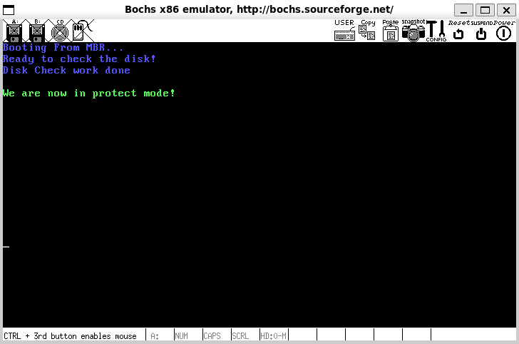

# 最后一击——加载我们的内核

​	是时候结束我们的主战场是汇编的艰难之旅了。我们做最后一个事情，那就是加载我们的内核！

## 书写我们的搬运的函数

```asm
; -------------------------   Load Kernel  ----------------------
   mov eax, KERNEL_BIN_SECTOR          ; Sector number where kernel.bin is located
   mov ebx, KERNEL_BIN_BASE_ADDR       ; Address to write the data after reading from disk
   mov ecx, KERNEL_SECTOR_LOAD_READ    ; Number of sectors to read
   
   call rd_disk_m_32
```

​	我们如法炮制，如何搬运Loader我们就怎么样搬运我们的内核。所以，直接cv（没办法复用的原因是我们按照我们的binary格式进行无运行时的依赖编译，自然没法复用，此外，搬运Loader的代码是16位的，我们是32位！）

​	我们需要找一块地方放我们的kernel.bin。这个地址当然是越高越不错的。当然，笔者的内核是在0x70000。没有原因，这部分搬运参考其他人的代码，所以就没有做改动了，最大也就是到我们的9fbff处，上面就是BIOS的数据了。

| 起始地址 | 结束地址 | 大小             | 描述                                            |
| -------- | -------- | ---------------- | ----------------------------------------------- |
| 9FC00    | 9FFFF    | 1K               | ERDA (Extended BIOS Data Area) 扩展 BIOS 数据区 |
| 7E00     | 9FBFF    | 622000 B 约 606K | 可用区域                                        |
| 7C00     | 7DFF     | 512B             | MBR 被 BIOS 加载到此处，共 512 字节             |
| 500      | 7BFF     | 30464B 约 30K    | 可用区域                                        |
| 400      | 4FF      | 256B             | BIOS Data Area (BIOS 数据区)                    |
| 000      | 3FF      | 1K               | Interrupt Vector Table (中断向量表)             |

```asm
;-------------------------------------------------------------------------------
; Function: Read n sectors from the hard disk
rd_disk_m_32:	 
; eax=LBA sector number
; ebx=Memory address to write data to
; ecx=Number of sectors to read  
;-------------------------------------------------------------------------------

   mov esi,eax           ; Backup eax
   mov di,cx             ; Backup sector count to di
; Read/write hard disk:
; Step 1: Set the number of sectors to read
   mov dx,0x1f2
   mov al,cl
   out dx,al            ; Number of sectors to read

   mov eax,esi          ; Restore ax

   ; Step 2: Store the LBA address in 0x1f3 ~ 0x1f6

   ; LBA address bits 7~0 to port 0x1f3
   mov dx,0x1f3                       
   out dx,al                          

   ; LBA address bits 15~8 to port 0x1f4
   mov cl,8
   shr eax,cl
   mov dx,0x1f4
   out dx,al

   ; LBA address bits 23~16 to port 0x1f5
   shr eax,cl
   mov dx,0x1f5
   out dx,al

   shr eax,cl
   and al,0x0f          ; LBA bits 24~27
   or al,0xe0           ; Set bits 7~4 to 1110, indicating LBA mode
   mov dx,0x1f6
   out dx,al

   ; Step 3: Write the read command 0x20 to port 0x1f7
   mov dx,0x1f7
   mov al,0x20                        
   out dx,al

;;;;;;;  Now, the hard disk controller will read cx sectors starting 
;;;;;;;  from the specified LBA address (eax), check the hard disk status, 
;;;;;;;  and if not busy, read out the data from these cx sectors

   ; Step 4: Check hard disk status
.not_ready:              ; Test the BSY bit of port 0x1f7 (status register)
   ; The same port, when writing, represents the command word, when reading, represents the hard disk status
   nop
   in al,dx
   and al,0x88          ; Bit 4 is 1 indicating the hard disk controller is ready for data transfer, bit 7 is 1 indicating the hard disk is busy
   cmp al,0x08
   jnz .not_ready       ; If not ready, continue waiting.

   ; Step 5: Read data from port 0x1f0
   mov ax, di           ; The following reads data from the hard disk port using insw is faster, but to demonstrate more command usage,
                        ; we use this method here, and will use insw and outsw later

   mov dx, 256          ; di is the number of sectors to read, each sector is 512 bytes, each read is a word, so di*512/2 times, hence di*256
   mul dx
   mov cx, ax	   
   mov dx, 0x1f0
.go_on_read:
   in ax,dx		
   mov [ebx], ax
   add ebx, 2
                        ; Since in real mode the offset address is 16 bits, using bx will only access offsets 0~FFFFh.
                        ; The loader's stack pointer is 0x900, bx points to the data output buffer, and is 16 bits,
                        ; After exceeding 0xffff, the bx part will start from 0, so when the number of sectors to read is too large, and the address to write exceeds the range of bx,
                        ; The data read from the hard disk will overwrite 0x0000~0xffff,
                        ; Causing the stack to be corrupted, so when ret returns, the return address is corrupted, and is no longer the previous correct address,
                        ; So the program will error, and it is not known where it will go.
                        ; So replace bx with ebx to point to the buffer, so the generated machine code will have 0x66 and 0x67 in front to reverse.
                        ; 0X66 is used to reverse the default operand size! 0X67 is used to reverse the default addressing mode.
                        ; When the CPU is in 16-bit mode, it will naturally assume that the operand and addressing are 16-bit, when in 32-bit mode,
                        ; It will also assume that the instruction to be executed is 32-bit.
                        ; When we use the addressing mode or operand size of another mode in either mode (let's assume 16-bit mode uses 16-bit byte operands,
                        ; 32-bit mode uses 32-byte operands), the compiler will add 0x66 or 0x67 in front of the instruction for us,
                        ; Temporarily change the current CPU mode to the other mode.
                        ; Assuming running in 16-bit mode, when encountering 0X66, the operand size becomes 32-bit.
                        ; Assuming running in 32-bit mode, when encountering 0X66, the operand size becomes 16-bit.
                        ; Assuming running in 16-bit mode, when encountering 0X67, the addressing mode becomes 32-bit addressing
                        ; Assuming running in 32-bit mode, when encountering 0X67, the addressing mode becomes 16-bit addressing.

   loop .go_on_read
   ret
```

## 初始化kernel部分的代码

​	我们现在马上就要开始写kernel了，为此，我们打算拿一个main.c的文件凑合一下。

```c
int main()
{
    while(1);
    return 0;
}
```

​	现在，我们就是要使用gcc的编译连接，显然，我们要将我们的main安排到一个我们的Loader可以跳转进入的位置，预期而言，我们需要计算一下Loader的偏移 + Loader的大小 + 虚拟地址0xc0000000的加成。所以，笔者跟随了《操作系统真相还原》的作者选定的地址，也就是0xc0001500这个地址作为我们的最终的选择。

```makefile
# Some dependencies macro
KERNEL_MAIN_OBJ = ${OBJ_DIR}/main.o

${BOOT_IMG}.img: ${OBJ_DIR}/${MBR}.bin ${OBJ_DIR}/${LOADER}.bin ${KERNEL_MAIN_OBJ}
# Specify the i386 cpu link mode and
# Specify the non-execution stack mode 
# To set up, we need to call at front end, with impl at backend
	ld -m elf_i386 -z noexecstack \
		${OBJ_DIR}/main.o -Ttext 0xc0001500 -e main \
		-o ${OBJ_DIR}/${KERNEL}.bin

# MBR guidance asm
${OBJ_DIR}/${MBR}.bin:
	mkdir -p ${OBJ_DIR}
	nasm -o ${OBJ_DIR}/${MBR}.bin 		-I${ASM_INC_DIR} ${ARCH_ASM_DIR}/${MBR}.S

# Loader the kernel asm
${OBJ_DIR}/${LOADER}.bin:
	nasm -o ${OBJ_DIR}/${LOADER}.bin 	-I${ASM_INC_DIR} ${ARCH_ASM_DIR}/${LOADER}.S

# Main Kernels
${KERNEL_MAIN_OBJ}:
	${GCC} -m32 -I. ${DEBUG_FLAG} -c ${KER_C_DIR}/main.c -o ${OBJ_DIR}/main.o
```

​	笔者小小的修订了一下Makefile，所以看起来他现在长这样。我们将我们的main.c文件的main函数放到Loader知道的地址，也就是我们的0xc0001500上。生成的kernel.bin就是我们的主操作系统所在的主文件了！以后我们就是跟它打交道了！

​	现在，我们要做的就是把kernel.bin搬运到我们的内存上！

​	这里还额外涉及到了我们ELF的知识，所以，笔者将会放到我的bonus文件夹进行介绍。

> [ELF文件导论](../bonus/elf.md)

​	函数kernel_init的作用是将kernel.bin中的**段（segment）拷贝到各段自己被编译的虚拟地址处**，将这些段单独提取到内存中，这就是平时所说的内存中的程序映像。**kernel_init的原理是分析程序中的每个段（segment），如果段类型不是PT_NULL（空程序类型），就将该段拷贝到编译的地址中。**现在内核已经被加载到KERNEL_BIN_BASE_ADDR地址处，该处是文件头 elf_header。在我们的程序中，遍历段的方式是指向第一个程序头后，每次增加一个段头的大小，即e_phentsize。该属性位于偏移程序开头42字节处。我们用寄存器dx来存储段头大小，这是为了以后遍历段时方便，避免了频繁的访问内存，

​	基于次，我们的目标就变成了——嘿！怎么把所有的段找出来啊？答案是获取我们的程序头表。程序头表中存在每一个段的大小，获取好了之后，就是依次将这些段进行拷贝

```asm
;-----------------   Copy segments from kernel.bin to the compiled address   -----------
   kernel_init:
   xor eax, eax
   xor ebx, ebx                        ; ebx records the program header table address
   xor ecx, ecx                        ; cx records the number of program headers in the program header table
   xor edx, edx                        ; dx records the size of each program header, i.e., e_phentsize

   mov dx, [KERNEL_BIN_BASE_ADDR + 42] ; The attribute at offset 42 bytes in the file is e_phentsize, indicating the size of each program header
   mov ebx, [KERNEL_BIN_BASE_ADDR + 28] ; The attribute at offset 28 bytes in the file is e_phoff, indicating the offset of the first program header in the file
                                     ; Actually, this value is 0x34, but we read it here for caution
   add ebx, KERNEL_BIN_BASE_ADDR
   mov cx, [KERNEL_BIN_BASE_ADDR + 44] ; The attribute at offset 44 bytes in the file is e_phnum, indicating the number of program headers
.each_segment:
   cmp byte [ebx + 0], PT_NULL          ; If p_type equals PT_NULL, this program header is .
   je .PTNULL

; Push parameters for the memcpy function, parameters are pushed from right to left. Function prototype is similar to memcpy(dst,src,size)
   push dword [ebx + 16]               ; The attribute at offset 16 bytes in the program header is p_filesz, push as the third parameter for memcpy: size
   mov eax, [ebx + 4]                  ; The attribute at offset 4 bytes in the program header is p_offset
   add eax, KERNEL_BIN_BASE_ADDR       ; Add the physical address where kernel.bin is loaded, eax is the physical address of this segment
   push eax                            ; Push as the second parameter for memcpy: source address
   push dword [ebx + 8]                ; Push as the first parameter for memcpy: destination address, the attribute at offset 8 bytes in the program header is p_vaddr, which is the destination address
   call mem_cpy                        ; Call mem_cpy to copy the segment
   add esp,12                          ; Clean up the three parameters pushed onto the stack
   .PTNULL:
   add ebx, edx                        ; edx is the size of each program header, i.e., e_phentsize, so ebx points to the next program header 
   loop .each_segment
   ret

;----------  Byte-by-byte copy mem_cpy(dst,src,size) ------------
; Input: Three parameters on the stack (dst,src,size)
; Output: None
;---------------------------------------------------------
   mem_cpy:		      
   cld
   push ebp
   mov ebp, esp
   push ecx                        ; rep uses ecx, but ecx is still needed for the outer loop, so back it up first
   mov edi, [ebp + 8]              ; dst
   mov esi, [ebp + 12]             ; src
   mov ecx, [ebp + 16]             ; size
   rep movsb                       ; Byte-by-byte copy

   ; Restore environment
   pop ecx		
   pop ebp
   ret
```

​	所以，在我们万事俱备之后，就是直接跳转进入内核了。当然，这里我们将esp设置成这个值，是考虑到后面我们的主线程将会被扔进TCB中，他是4KB字节对齐的，所以我们选择的是将他设置为页的顶部向下增长。当然，设置程我们的0xc009c000也不是不行，但是原因我说了，考虑后面的事情。

```asm
;;;;;;;;;;;;;;;;;;;;;;;;;;;;  No need to flush the pipeline at this point  ;;;;;;;;;;;;;;;;;;;;;;;;
; Since we are always in 32-bit mode, in principle, there is no need to force a flush. After testing, the following two lines are not necessary.
; But just in case, they are added to avoid potential future issues.
   jmp SELECTOR_CODE:enter_kernel      ; Force flush the pipeline, update GDT
enter_kernel:    
;;;;;;;;;;;;;;;;;;;;;;;;;;;;;;;;;;;;;;;;;;;;;;;;;;;;;;;;;;;;;;;;;;;;;;;;;;;;;;;;
   call kernel_init
   mov esp, 0xc009f000
   jmp KERNEL_ENTRY_POINT              ; when in bochs. try vb 0008:0xc0001500, if stop, ok!
```

​	现在，让我们试试看！

​	还是不会有啥现象，原因很简单，我们没有实现内核层级的打印呢！



​	嗯下Ctrl + C，注意，成功的跳转是这样的。

```
[0x00000000150e] 0008:c000150e (unk. ctxt): jmp .-3  (0xc000150d)     ; ebfd
<bochs:4> 
```

​	作为验证，你可以在0008:0xc0001500打下断点。命中断点即为成功！

```
<bochs:2> c
(0) Breakpoint 1, in 0008:c0001500 (0xc0001500)
Next at t=17404911
(0) [0x000000001500] 0008:c0001500 (unk. ctxt): push ebp                  ; 55
<bochs:3> 
```

## 代码

> [代码](./3.4_code)
