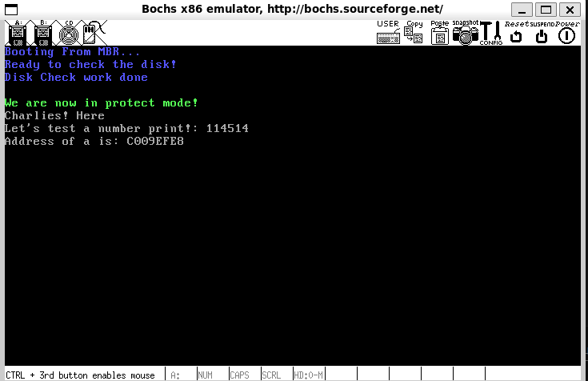

# 更好的内核——实现我们自己的打印函数

​	下面，我们就来实现内核层级的打印函数，也就是说，我们马上就要有自己的puts，putchar了，你可能会询问printf呢？答案是先不着急，我们会在后面实现内核层级的printf的时候，重新回来实现变参数的格式化打印，这里我们先实现最基础的打印！

​	本篇内容更多的是对之前知识的落实，所以，没啥知识点，更多的是编程实践。

## 1. 约束我们的数据类型

​	现在我们需要约束整个内核的整数数据类型。也就是定义属于我们自己的uint8_t等数据类型。笔者这里提供一份：

```
#ifndef CCOS_TYPES_H
#define CCOS_TYPES_H

typedef signed char         int8_t;
typedef signed short        int16_t;
typedef signed int          int32_t;
typedef signed long long    int64_t;
typedef unsigned char       uint8_t;
typedef unsigned short      uint16_t;
typedef unsigned int        uint32_t;
typedef unsigned long long  uint64_t;

/* kernel usage */
typedef uint8_t                 bool;

#ifndef true
#define true                    (1)
#endif

#ifndef false
#define false                   (0)
#endif

#define UINT8_MAX           (0xff)
#define NULL                ((void*)0)

#endif
```

​	实在没什么好说的，不浪费各位的时间了。

## 2. 从最小的做起：实现打印一个字符

#### 几个方便的宏

​	本质上，我们的打印字符串都是使用打印字符一个一个传递到我们的显存上去的，所以，实现一个字符的打印显得非常的至关重要。

​	这里，我们还会复用一下我们在之前MBR和Loader打印代码，笔者先给出一部分封装：

```asm
%define TI_GDT              0
%define RPL0                0
%define SELECTOR_VIDEO      (0X0003 << 3) + TI_GDT + RPL0
```

​	前三行，是我们关于我们的打印函数上使用到的显卡段与选择子等相关内容的设置，笔者放到这里，你也可以放到自己喜欢的一个.inc文件中，这里就不加以做了。

```asm
%define BACKSPACE_ASCII_VAL 0x08
%define CR_ASCII_VAL        0x0d
%define LF_ASCII_VAL        0x0a
```

​	这里则是我们下面要做的一部分字符转义的工作，这里到我们的下面会详细的进行解释。

```asm
; console style 
; review from the 
%define CONSOLE_STYLE       0x07
```

​	还记得我们的显卡VGA模式的字符控制模式嘛？所以，这里显然是——背景黑色，字符白色的经典模式，你可以在这里调整你自己喜欢的字符打印的模式。

```asm
; VGA Screen's property
%define CURSOR_END          2000
%define CARRY_CHAR_NUM      ((2000 - 80) * 2)
%define CARRY_CHAR_NUM_TIME (CARRY_CHAR_NUM / 4)
```

​	这里是我们的一部分宏设置，先放到这里，笔者后面会解释这些都是什么的

​	这个就是一个快速的设置光标的宏，我们把光标值存储在了bx上。关于如何解析，仍然看笔者之前在MBR中的介绍，这里不加以重复了

```asm
%macro  SET_CURSOR_CONV  0
    mov dx, 0x03d4
    mov al, 0x0e
    out dx, al
    mov dx, 0x03d5
    mov al, bh
    out dx, al

    mov dx, 0x03d4
    mov al, 0x0f
    out dx, al
    mov dx, 0x03d5
    mov al, bl
    out dx, al
%endmacro
```

#### 正文开始：函数定义与预备工作1

​	很显然，我们放置一个字符的参数，应当是非常简单的：

```
void __ccos_putchar(uint8_t ascii_char);
```

​	也就是说，我们需要获取一个待打印的字符来！下面就是实现我们的函数

```asm
[bits 32]
section .data
global __ccos_internal_style_sheet
__ccos_internal_style_sheet     db CONSOLE_STYLE
section .text

; -----------------------------------
;   put the char into the cosole
; -----------------------------------
global __ccos_putchar
__ccos_putchar:
    pushad  ; push the 32 bits registers value
    mov ax, SELECTOR_VIDEO
    mov gs, ax

    mov dx, 0x03d4
    mov al, 0x0e
    out dx, al
    mov dx, 0x03d5
    in  al, dx
    mov ah, al

    mov dx, 0x03d4
    mov al, 0x0f
    out dx, al
    mov dx, 0x03d5
    in  al, dx
    mov bx, ax
```

​	前面的部分是老生常谈的获取光标的部分。这里，我们看到了一个新的面孔：

#### pushad

​	pushad是一个备份所有的双字长的，也就是经典的8个寄存器——EAX, ECX, EDX, EBX, ESP, EBP, ESI和EDI，分别按照笔者谈到的顺序进行压栈。当然，这个顺序如何，我们其实不太关心，除非用到了值！

#### 函数定义与预备工作2

```asm
    mov ecx, [esp + 36]
```

​	等等，这是干啥呢在？答案是获取我们的参数，怎么算出来是36的呢？首先，pushad将我们的8个寄存器都压入栈中，双字长，也就是4 * 8 = 32个字节。还有一个函数的返回地址在里头，所以，偏移36个地址是合理的，这样就能取到我们的打印的参数了。

#### 判断是不是什么特殊字符

​	我们的putchar要支持转义字符，就需要对特定的字符做一些操作。

```asm
    cmp cl, CR_ASCII_VAL
    jz  .is_carriage_return
    cmp cl, LF_ASCII_VAL
    jz  .is_line_feed
    cmp cl, BACKSPACE_ASCII_VAL
    jz  .is_backspace
    jmp .put_other
```

#### 如果是退格backspace

```asm
.is_backspace:
    dec bx
    shl bx, 1
    mov byte[gs:bx], 0x20
    inc bx
    push ax
    mov byte al, [__ccos_internal_style_sheet]
    mov byte [gs:bx], al
    pop ax
    shr bx, 1
    jmp .set_cursor
```

​	如果是退格，我们直接让光标后退一格就好了，这里将该处的字符用空格覆盖，就可与消除上一个字符了。

```asm
    dec bx
    shl bx, 1
```

​	就是起到这个作用的，用dec指令先将bx减1，这样光标坐标便指向前一个字符了，第53行用shl指令将bx左移1位，相当于乘以2，用shl指令做乘法比用mul指令方便。由于字符在显存中占2字节，低字节是ASCI码，高字符是属性。

```asm
    mov byte[gs:bx], 0x20
    inc bx
    push ax
    mov byte al, [__ccos_internal_style_sheet]
    mov byte [gs:bx], al
    pop ax
```

​	这里则是将我们的空白字符写入删除的字符上。

```
    shr bx, 1
    jmp .set_cursor
```

​	由于删除了一个字符，bx中的光标坐标已经被更新为前一位，我们直接右移1个，相当于除以2取整。bx就会指向了我们新覆盖的空格的位置。

#### 可见字符的处理

```
.put_other:
    shl bx, 1
    mov [gs:bx], cl
    inc bx
    push ax
    mov byte al, [__ccos_internal_style_sheet]
    mov byte [gs:bx], al
    pop ax
    shr bx, 1
    inc bx
    cmp bx, CURSOR_END
    jl .set_cursor
```

​	老样子，处理可见字符相当的容易，注意的是我们还需要看看是不是大于2000个字符（CURSOR_END），如果是的话，需要滚屏。

#### 处理换行

```asm
.is_line_feed:
.is_carriage_return:
    xor dx, dx
    mov ax, bx
    mov si, 80
    div si
    sub bx, dx
.carriage_return_end:
    add bx, 80
    cmp bx, CURSOR_END
.line_feed_end:
    jl .set_cursor
```

​	我们的换行，实际上就是我们直接将光标添加一行中余下没有填充的字符数。我们对bx除以80，得到的余数相减之后，就是一个行的行首，这就是\r的作用，之后就是\n，直接对我们添加一行的长度80即可。这样就是先了一个换行。

#### 滚屏与光标处理

```asm
.roll_screen:
; 将我们的数据向上搬运一行
    cld
    mov ecx, CARRY_CHAR_NUM_TIME
    mov esi, 0xc00b80a0
    mov edi, 0xc00b8000
    rep movsd

    mov ebx, CARRY_CHAR_NUM
    mov ecx, 80
; 清空我们的最底下的那一行
.cls:
    mov word [gs: ebx], 0x0720
    add ebx, 2
    loop .cls
    mov bx, CARRY_CHAR_NUM / 2
.set_cursor:
    SET_CURSOR_CONV

.end_ccos_putchar:
    popad
    ret
```

​	笔者实现的滚屏方案非常的简单：

- 将第1～24行的内容整块搬到第0～23行，也就是把第0行的数据覆盖。
- 再将第24行，也就是最后一行的字符用空格覆盖，这样它看上去是一个新的空行。
- 把光标移到第24行也就是最后一行行首。

​	经过这三步，屏幕就像向上滚动了一行（似乎我们是字符的搬运工一样！）。之后我们的set_cursor就会帮助我们实现光标置位，最后就是弹栈恢复我们的上下文。

## 2.清屏

​	清屏直接搬代码，直接对整个屏幕填上我们的

```asm
; Screen cleaner function
global clean_screen
clean_screen:
    pushad                      ; Save all general-purpose registers
    mov ax, SELECTOR_VIDEO      ; Load video memory selector
    mov gs, ax                  ; Set GS segment register to video memory

    mov ebx, 0                   ; Initialize EBX to 0 (offset in video memory)
    mov ecx, 80*25               ; Total number of screen characters (80 columns * 25 rows)
.clean_each_cls:
    mov word [gs:ebx], 0x0720    ; Write space character (0x20) with attribute (0x07)
    add ebx, 2                   ; Move to the next character cell (2 bytes per character)
    loop .clean_each_cls         ; Repeat until all characters are cleared
    mov ebx, 0                   ; Reset EBX to 0

    SET_CURSOR_CONV              ; Call macro to reset cursor position
    popad                        ; Restore all general-purpose registers
    ret                          ; Return from function

```

## 3. 写入字符串

​	写入字符串也不难：

```asm
global ccos_puts
ccos_puts:
    push ebx                  ; Save EBX register
    push ecx                  ; Save ECX register
    xor ecx, ecx              ; Clear ECX (used to store current character)
    mov ebx, [esp + 12]       ; Load string pointer from stack

.continue_fetch:
    mov cl, [ebx]             ; Load the current character from the string
    cmp cl, 0                 ; Check if it is the null terminator
    jz .ccos_puts_done        ; If null, exit the loop

    push ecx                  ; Push the character onto the stack
    call __ccos_putchar       ; Call function to print the character
    add esp, 4                ; Clean up stack after function call
    inc ebx                   ; Move to the next character in the string
    jmp .continue_fetch       ; Repeat the loop

.ccos_puts_done:
    pop ecx                   ; Restore ECX register
    pop ebx                   ; Restore EBX register
    ret                       ; Return from function
```

​	我们需要做的就是逐字节的访问字符串，直到访问了\0就停下来，是不是很简单？

## 4.设置光标位置

```asm
global __ccos_set_console_cursor
__ccos_set_console_cursor:
    pushad                    ; Save all general-purpose registers

    mov ecx, [esp + 36]       ; Load row value into ECX
    mov edx, [esp + 40]       ; Load column value into EDX

    ; Combine row and column into BX register
    mov ebx, ecx              ; Copy row value to EBX
    shl ebx, 8                ; Shift row value left by 8 bits
    add bl, dl                ; Add column value to BL (low byte of EBX)

    xor ecx, ecx              ; Clear ECX
    xor edx, edx              ; Clear EDX

    SET_CURSOR_CONV           ; Call macro set cursor position

    popad                     ; Restore all general-purpose registers
    ret                       ; Return from function
```

​	这个事情需要注意的是，我们的行列进制是255，所以笔者写了一个辅助的函数

```c
#include "include/library/ccos_print.h"

// Function to set the position of the console cursor
void ccos_set_console_cursor(uint16_t row, uint16_t col)
{
    // Calculate the column offset based on the row and column
    uint8_t __col = col + CONSOLE_WIDTH * row; 
    
    // Calculate the row offset based on the column and row position
    uint8_t __row = (CONSOLE_WIDTH * row + col - __col) % UINT8_MAX;
    
    // Call the function that actually sets the cursor position
    __ccos_set_console_cursor(__row, __col);
}

```

​	整个函数将我们的坐标进行一定的转换，从而设置我们的打印的位置。

## 5. 整数的打印

```asm
[bits 32]
section .data
; ... omiited
__ccos_interger_display_buffer  dq 0   ; Buffer for storing the integer display in hexadecimal
; --- add this above ^^^^
; ... omiited

global __ccos_display_int

__ccos_display_int:
    pushad                           ; Save all registers to the stack
    mov ebp, esp                     ; Set up stack frame
    mov eax, [ebp + 36]              ; Load the argument (integer to display) into eax
    mov edx, eax                     ; Copy the integer to edx for processing
    mov edi, 7                       ; Set edi to point to the end of the display buffer (8 bytes)
    mov ecx, 8                       ; Set the loop counter to 8 (for 8 hex digits)
    mov ebx, __ccos_interger_display_buffer  ; Load the address of the display buffer into ebx
```

​	还是一样，备份我们的寄存器，注意到的是——我们的数字打印是从缓冲区的最高处开始的，所以，放置我们的偏移量位7，处理8位数字：

```asm
.16based_4bits:
    and edx, 0x0000_000F             ; Mask the lower 4 bits of edx (to get the current hex digit)
    cmp edx, 9                       ; Compare the digit with 9
    jg .display_A2F                  ; If greater than 9, it’s a letter (A-F)
    add edx, '0'                     ; Convert to ASCII digit ('0' - '9')
    jmp .store
```

​	现在在这里呢，我们就是判断我们的数字是不是大于我们的10，大于的话，就需要处理A-F的逻辑，反之，我们直接加上ASCII字符0就好了，这个事情很简单，查一下ASCII的事情。

```asm
.display_A2F:
    sub edx, 10                       ; Subtract 10 to convert to the range for letters (A-F)
    add edx, 'A'                      ; Convert to ASCII letter ('A' - 'F')

.store:
    mov [ebx + edi], dl               ; Store the converted character in the buffer
    dec edi                           ; Move to the previous byte in the buffer
    shr eax, 4                        ; Shift eax right by 4 bits (to process the next hex digit)
    mov edx, eax                      ; Update edx with the new value of eax
    loop .16based_4bits               ; Repeat for all 8 hex digits
```

​	我们之后就是将我们的转换的字符存储到缓冲区上去，准备处理下一个数字（右移4位拿到下一个位）

```asm
.ready_to_trans:
    inc edi                           ; Move to the next byte in the buffer
.skip_prefix_0:
    cmp edi, 8                        ; Check if we’ve reached the end of the buffer
    je .full0                         ; If so, skip to full 0 display
.skip:
    mov cl, [__ccos_interger_display_buffer + edi]  ; Load the character from the buffer
    inc edi                           ; Move to the next character
    cmp cl, '0'                       ; Check if the character is '0'
    je .skip_prefix_0                 ; If it's '0', skip it
    dec edi                           ; If not, step back and prepare to print
    jmp .print_each_num

.full0:
    mov cl, '0'                       ; If buffer is empty, display '0'

.print_each_num:
    push ecx                          ; Push the character to be printed onto the stack
    call __ccos_putchar               ; Call the function to display the character
    add esp, 4                        ; Clean up the stack
    inc edi                           ; Move to the next character in the buffer
    mov cl, [__ccos_interger_display_buffer + edi]  ; Load the next character
    cmp edi, 8                        ; Check if we've reached the 8th character
    jl .print_each_num                ; If not, keep printing

    popad                             ; Restore the registers from the stack
    ret
```

​	之后呢，就是开始我们的打印，首先我们需要完成对前导0的跳过，直到第一个不是0的数字。然后就开始轮循的打印即可。

## 完成我们的测试

​	这一次代码量非常大，笔者也更改了makefile，请看：

```makefile
MBR 	= mbr
LOADER	= loader
KERNEL	= kernel
# Same in bochsrc, if u gonna switch the name, do also modified the bochsrc
BOOT_IMG	= boot.img
ASM_INC_DIR = include
ARCH_ASM_DIR= arch/asm
KER_C_DIR	= kernel
OBJ_DIR		= middleware
DISASM_DIR  = disasm


# ASM Issue
KERDIR_ASM_DIR	= arch/kernel
KERMAIN_ASFLAGS = -f elf

# C Issue
KERMAIN_CFLAGS 	= 	-I. -Wall -m32 -fno-stack-protector \
					-c -fno-builtin -W -Wstrict-prototypes -Wmissing-prototypes

# Linkages
ENTRY_POINT		= 0xc0001500
# Specify the i386 cpu link mode and
# Specify the non-execution stack mode 
# To set up, we need to call at front end, with impl at backend
KERNEL_MAIN_LD_FLAG =  	\
					-m elf_i386 -z noexecstack \
					-Ttext $(ENTRY_POINT) -e main -Map $(OBJ_DIR)/kernel.map


DEBUG_FLAG	:=
# Modify the GCC for the usage
AS 			= nasm
GCC			= gcc
LD			= ld
# Some dependencies macro
KERNEL_MAIN_OBJ = 	${OBJ_DIR}/main.o $(OBJ_DIR)/ccos_print.o \
					${OBJ_DIR}/_ccos_print.o

${BOOT_IMG}: \
	${OBJ_DIR}/${MBR}.bin ${OBJ_DIR}/${LOADER}.bin $(OBJ_DIR)/${KERNEL}.bin

$(OBJ_DIR)/${KERNEL}.bin: $(KERNEL_MAIN_OBJ)
	$(LD) $(KERNEL_MAIN_LD_FLAG) $^ -o $@

# MBR guidance asm
${OBJ_DIR}/${MBR}.bin:
	mkdir -p ${OBJ_DIR}
	nasm -o ${OBJ_DIR}/${MBR}.bin 	-w-orphan-labels	-I${ASM_INC_DIR} ${ARCH_ASM_DIR}/${MBR}.S

# Loader the kernel asm
${OBJ_DIR}/${LOADER}.bin:
	nasm -o ${OBJ_DIR}/${LOADER}.bin -w-orphan-labels	-I${ASM_INC_DIR} ${ARCH_ASM_DIR}/${LOADER}.S

# Main Kernels
${KERNEL_MAIN_OBJ}:
	${AS} ${KERMAIN_ASFLAGS} ${KERDIR_ASM_DIR}/_ccos_print.S -o $(OBJ_DIR)/_ccos_print.o
	${GCC} ${KERMAIN_CFLAGS} ${KER_C_DIR}/library/ccos_print.c -o $(OBJ_DIR)/ccos_print.o
	${GCC} -m32 -I. ${DEBUG_FLAG} -c ${KER_C_DIR}/main.c -o ${OBJ_DIR}/main.o

# Phony's are the scrpits usage
.PHONY: clean upload disasm all

# clean the builds
clean:
# Clean the disasm folder if using make disasm
	rm -rf ${DISASM_DIR}/* ${DISASM_DIR}
# Clean the compile time folder	
	rm -rf ${OBJ_DIR}/* ${OBJ_DIR}
# clean the bochs running log and image
	rm -f *.out *.img
	

disasm:
# create the disasm folder
	mkdir -p ${DISASM_DIR}
	ndisasm -o 0x0900 	${OBJ_DIR}/${LOADER}.bin > ${DISASM_DIR}/dis${LOADER}.asm
	ndisasm -o 0x7c00	${OBJ_DIR}/${MBR}.bin > ${DISASM_DIR}/dis${MBR}.asm
	ndisasm -o 0x0000	${OBJ_DIR}/print.o > ${DISASM_DIR}/disprint.asm
	objdump -d --adjust-vma=0xC0001500 ${OBJ_DIR}/main.o  > ${DISASM_DIR}/dismain.asm

# upload the issue
# for bochs 2.8+, you need to specify the creation in -func=create
# on the other hand, below this, use -mode=create
# regards from bochs documenations :)
upload:
	rm -f ${BOOT_IMG}
	bximage -func=create -hd=60M -q ${BOOT_IMG}
	dd if=${OBJ_DIR}/${MBR}.bin of=${BOOT_IMG} bs=512 count=1 conv=notrunc
	dd if=${OBJ_DIR}/${LOADER}.bin of=${BOOT_IMG} bs=512 count=5 seek=2 conv=notrunc
	dd if=${OBJ_DIR}/${KERNEL}.bin of=${BOOT_IMG} bs=512 count=200 seek=9 conv=notrunc
	bochs -f bochsrc

all:
	make clean;make;make upload
```

​	我们在主函数中列写测试

```c
#include "include/library/ccos_print.h"

int main()
{
    // test setcursor
    ccos_set_console_cursor(5, 0);
    // test the putchar
    // __ccos_putchar('C');
    // __ccos_putchar('h');
    // __ccos_putchar('a');
    // __ccos_putchar('r');
    // __ccos_putchar('l');
    // __ccos_putchar('i');
    // __ccos_putchar('e');
    // clean screen
    // clean_screen();
    // test puts
    ccos_puts("Charlies! Heri\be\n");
    ccos_puts("Let's test a number print!: ");
    __ccos_display_int(0x114514);
    __ccos_putchar('\n');
    int a = 0;
    ccos_puts("Address of a is: ");
    __ccos_display_int(&a);
    __ccos_putchar('\n');
    while(1);
    return 0;
}
```

#### 补充

​	需要小心的是——我们链接文件的时候，需要将我们的次序调整为main.o优先，这里是内核代码入口。需要做的是按照——“调用再先，实现在后的顺序”完成。否则的话就会出现虚拟地址对不上的问题，导致内核崩溃。这个事情属于链接器的顺序敏感特性。笔者会在后面给出Makefile地址。

## 看看成果



## 代码

> 所有的代码都在：[代码](./4.2_code)