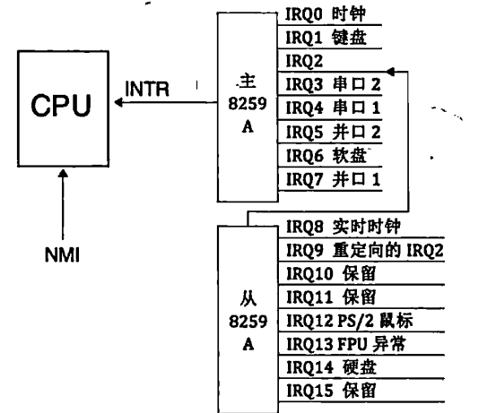
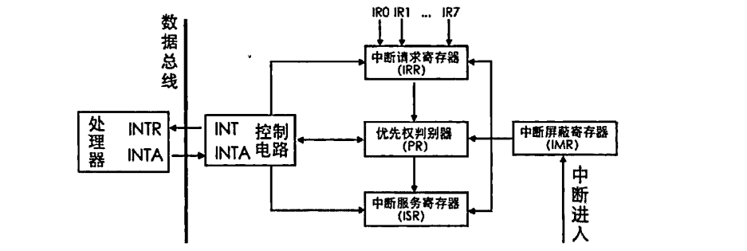

# 下一步——对8259A的编程导论

​	本篇文档是对8259A编程方法的记录。笔者单独开一张，是因为他实在是太复杂了。但是，我们在完成操作系统的中断子模块的时候，又不得不理解这个内容，所以，笔者单开说明。

## 8259A：对外部中断管理的代理人

​	是的，代理人。我们的外设千千万，但是想要得到CPU的理睬，必须要通过8259A的裁决。8259A本身是为了分担CPU对中断的裁决，留存和处理功能的器件。

​	8259A一个片子上，有8个中断，Intel的处理器支持至少256个中断，所以我们一般采取这样的级联：

​	所以，我们N片级联，支持的就是7N + 1个中断源，其中一个是做主片，这个主片对接我们的CPU，其他的都是从片，不直接跟CPU对话。

### 8259A的构成

​	下面这个图是对8259A内部原理示意图的介绍。

- INT：8259A选出优先级最高的中断请求后，发信号通知CPU。
- INTA:INT Acknowledge,中断响应信号。位于8259A中的INTA接收来自CPU的INTA接口的 中断响应信号。
- IMR:Interrupt Mask Register,中断屏蔽寄存器，宽度是8位，用来屏蔽某个外设的中断。
- IRR:Interrupt Request Register,中断请求寄存器，宽度是8位。它的作用是接受经过IMR寄存器过 滤后的中断信号并锁存，此寄存器中全是等待处理的中断，“相当于”5259A维护的未处理中断信号队列。
- PR：Priority Resolver，优先级仲裁器。当有多个中断同时发生，或当有新的中断请求进来时，将它与当前正在处理的中断进行比较，找出优先级更高的中断。
- ISR：In—Service Register，中断服务寄存器，宽度是8位。当某个中断正在被处理时，保存在此寄存器中。

### 所以，8259A如何履行它的职责？

​	当某个外设发出一个中断信号时，由于主板上已经将信号通路指向了8259A芯片的某个IRQ接口，所以该中断信号最终被送入了8259A。

​	**8259A首先检查IMR寄存器中是否已经屏蔽了来自该IRQ接口的中断信号。**IMR寄存器中的位，为1，则表示中断屏蔽，为0，则表示中断放行。如果该IRQ对应的相应位已经被置1，即表示来自该IRQ接口上的中断已经被屏蔽了，则将该中断信号丢弃，否则，将其送入IRR寄存器，将该IRQ接口所在IRR寄存器中对应的BIT置1。

​	**IRR寄存器的作用“相当于”待处理中断队列。在某个恰当时机，优先级仲裁器PR会从IRR寄存器中挑选一个优先级最大的中断，此处的优先级决判很简单，就是IRQ接口号越低，优先级越大，所以IRQ0优先级最大。**

​	作为主片的8259A，会把裁决好的中断准备好，发送一个INTR信号给CPU，CPU就会准备处理给定的中断。在处理完自己的后事后，它发送一个中断响应信号，让8259A继续它的代理人工作。8259A收到这个应答，立即将刚才选出来的优先级最大的中断在ISR寄存器中对应的BIT置1，此寄存器表示当前正在处理的中断，同时要将该中断从“待处理中断队列”寄存器IRR中去掉，也就是在IRR中将该中断对应的BIT置0。

​	CPU会在后面继续发一个INTA信号，要求获得请求的中断号，8259A就会将起始中断向量号+IRQ接口号发送给CPU的数据总线，CPU就会拿到外面的中断向量号，后面的流程你知我知了。

​	如果8259A的“EOI通知（EndOfInterrupt）”若被设置为非自动模式（手工模式），中断处理程序结束处必颁有向8259A发送EOI的代，8259A在收到EOI后，将当前正处理的中断在ISR寄存器中对应的BIT置0。如果“EOI通知”被设置为自动模式，在刚才8259A接收到第二个INTA信号后，也就是CPU向8259A要中断向量号的那个INTA，8259A会自动将此中断在ISR中对应的BIT置0。

## 编程我们的8259A

​	8259A的内部，存在2组寄存器，一组是我们的初始化命令寄存器组（这个事情编程过舵机的朋友清楚），被用来保存初始化命令字ICW的，一共四个。另一组是操作命令字OCW，三个。所以，我们的编程也就必须分成两个部分：

- 一部分是用ICW做初始化，用来确定是否需要级联，设置起始中断向量号，设置中断结束模式。其编程就是往8259A的端口发送一系列ICW。由于从一开始就要决定8259A的工作状态，所以要一次性写入很多设置，某些设置之间是具有关联、依赖性的，也许后面的某个设置会依赖前面某个ICW写入的设置。我们编程的时候，也就必须要依次写入ICW1、ICW2、ICW3、ICW4防止整活。
- 另一部分是用OCW来操作控制8259A,前面所说的中断屏蔽和中断结束，就是通过往8259A端 口发送OCW实现的。OCW的发送顺序不固定，3个之中先发送哪个都可以。

#### ICW1	

ICW1用来初始化8259A的连接方式和中断信号的触发方式。连接方式是指用单片工作，还是用多片 级联工作，触发方式是指中断请求信号是电平触发，还是边沿触发。

| 7    | 6    | 5    | 4    | 3    | 2    | 1    | 0    |
| ---- | ---- | ---- | ---- | ---- | ---- | ---- | ---- |
| 0    | 0    | 0    | 1    | LIIM | ADI  | SNGL | IC4  |

- IC4是控制要不要写入ICW4的，对于我们的x86系统必须写1，所以这个地方对我们而言，默认为1.
- SNGL则是标识是不是级联，为1则是单片，否则是级联
- ADI是设置8085调用时间的，跟我们没关系
- LTIM是中断检测方式的编程：为0边沿触发，反之电平触发

#### ICW2

ICW2是设置起始中断向量号的。注意，ICW2需要写入到主片的0x21端口和从片的OxAl端口。一般，我们只需要设置IRQ0的中断向量号，后面的自动顺延。所以，我们只需要负责填写高5位T3~T7，这样就实际上设置了IRQ0，后面的三位就表达了8个号。ID0到ID2不是我们设置的，就不填写。

| 7    | 6    | 5    | 4    | 3    | 2    | 1    | 0    |
| ---- | ---- | ---- | ---- | ---- | ---- | ---- | ---- |
| T7   | T6   | T5   | T4   | T3   | ID2  | ID1  | ID0  |

#### ICW3

​	ICW3仅在级联的方式下才需要（如果ICW1中的SNGL为0），用来设置主片和从片用哪个IRQ接口互连。需要写入主片的0x21端口及从片的OxAl端口。由于主片和从片的级联方式不一样，对于这个ICW3,主片和从片都有自己不同的结构，

##### ICW3 Master

​	对于主片，ICW3中置1的那一位对应的IRQ接口用于连接从片，若为0则表示接外部设备。举个例子，我们的IRQ2和IRQ4有从片，写00010100

| 7    | 6    | 5    | 4    | 3    | 2    | 1    | 0    |
| ---- | ---- | ---- | ---- | ---- | ---- | ---- | ---- |
| S7   | S6   | S5   | S4   | S3   | S2   | S1   | S0   |

##### ICW3 Slave

​	设置从片连接主片的方法是只需要在从片上指定主片用于连接自己的那个IRQ接口。在中断响应时，主片会发送与从片做级联的IRQ接口号，所有从片用自己的ICW3的低3位和它对比，若一致则认为是发给自己的。

| 7    | 6    | 5    | 4    | 3    | 2    | 1    | 0    |
| ---- | ---- | ---- | ---- | ---- | ---- | ---- | ---- |
| 0    | 0    | 0    | 0    | 0    | ID2  | ID1  | ID0  |

#### ICW4

​	muPM是处理器类型，我们这里写1表达的是x86处理器。AEOI表达的是自动结束中断，我们的中断需要结束后才会处理下一个，这里是设置要不要让8259A自动结束中断。是我们控制还是自己裁决。对于SFNM表达的是嵌套模式的选择。BUF则是设置是不是在缓冲模式。

​	对于级联模式下，在缓冲模式中。M/S规定了自己是从片还是主片。不再缓冲模式，MS无效。

| 7    | 6    | 5    | 4    | 3    | 2    | 1    | 0    |
| ---- | ---- | ---- | ---- | ---- | ---- | ---- | ---- |
| 0    | 0    | 0    | SFNM | BUF  | M/S  | AEOI | muPM |

#### OCW1

   OCW1用来屏蔽连接在8259A上的外部设备的中断信号,实际上就是把OCW1写入了 IMR寄存器。这里的屏蔽是说是否把来自外部设备的中断信号转发给CPU。

​	由于外部设备的中断都是可屏蔽中断，所以最终还是要受标志寄存器eflags中的IF位的管束，若IF为0,可屏蔽中断全部被屏蔽，也就是说，在IF为0的情况下，即使8259A把外部设备的中断向量号发过来.CPU也置之不理。

​	OCW1要写入主片的0x21或从片的OxAl端口，这里下面的实际上表达的是——为0不屏蔽，为1屏蔽。

| 7    | 6    | 5    | 4    | 3    | 2    | 1    | 0    |
| ---- | ---- | ---- | ---- | ---- | ---- | ---- | ---- |
| M7   | M6   | M5   | M4   | M3   | M2   | M1   | M0   |

#### OCW2

​	设置中断结束方式和优先级。需要写到主片的0x20和从片的0xA0端口。

​	SL可与针对某一个特定的优先级进行操作。这个开关可让我们后面的设置更加细腻。

​	OCW2其中的一个作用就是发EOI信号结束中断.如果使SL为1,可以用OCW2的低3位告知结束哪一个中断信号。为0会自动将正在处理的中断结束

​	另一个作用：设置优先级控制方式，这是用R位（第7位）来设置的。

- 如果R为0,表示固定优先级方式，即IRQ接口号越低，优先级越高。
- 如果R为1,表明用循环优先级方式，这样优先级会在0~7内循环。如果SL为0,初始的优先级次序为IR0>IRl>IR2>IR3>IR4>IR5>IR6>IR7。当某级别的中断被处理完成后，它的优先级别将变成最低，将最高优先级传给之前较之低一级别的中断请求，其他依次类推。所以，可循环方式多用于各中断源优先级相同的情况，优先级通过这种循环可以实现轮询处理。比如，当前IR3为最高级别中断请求，处理完成后，IR3将变成最低级别。IR4变成最高级别，这一组循环之后的优先级变成了： IR4>IR5>IR6>IR7>IR0>IRl>IR2>IR3。还可以打开SL开关，使SL为1,再通过L2〜L1指定最低优先级

​	下面继续说位：

​	R,Rotation,表示是否按照循环方式设置中断优先级。R为1表示优先级自动循环，R为0表示不自动循环，采用固定优先级方式。
​	SL,Specific Level,表示是否指定优先等级。等级是用低3位来指定的。此处的SL只是开启低3位的开关，所以SL也表示低3位的L2〜L0是否有效。SL为1表示有效，SL为0表示无效。

​	EOI, End Of Interrupt,为中断结束命令位。令EOI为1,则会令ISR寄存器中的相应位清0,也就是将当前处理的中断清掉，表示处理结束。向8259A主动发送EOI是手工结束中断的做法，所以，使用此命令有个前提，就是ICW4中的AEOI位为0,非自动结束中断时才用。

​	值得注意的是在手动结束中断（AEOI位为0）的情况下，如果中断来自主片，只需要向主片发送EOI就行了，如果中断来自从片，除了向从片发送EOI以外，还要再向主片发送EOI。

| 7    | 6    | 5    | 4    | 3    | 2    | 1    | 0    |
| ---- | ---- | ---- | ---- | ---- | ---- | ---- | ---- |
| R    | SL   | EOI  | 0    | 0    | L2   | L1   | L0   |

​	说了一大堆，看表：

| R    | SL   | ROI  | 描述                                                         |
| ---- | ---- | ---- | ------------------------------------------------------------ |
| 0    | 0    | 1    | 普通EOI结束方式： 当中断处理完成后，向8259A发送EOI命令，8259A会将ISR中当前级别最高的位置0 |
| 0    | 1    | 1    | 特殊EOI结束方式： 当中断处理完成后，向8259A发送EOI命令，8259A将ISR寄存器中由L2〜L0指定的位清0 |
| 1    | 0    | 1    | 普通EOI循环命令:                                         ： 当中断处理完成后，8259A将ISR中当前优先级最高的位清0,并使此位的优先级变成最低，使原 来第二高的优先级成为最高优先级.其他优先级类推 |
| 1    | 1    | 1    | 特殊EOI循环命令： 当中断处理完成后，8259A将ISR中由L2〜L0指定的相应位清仇并使此位的优先级变成最低，使原来第二高的优先级成为最高优先级.其他优先级类推 |
| 0    | 0    | 0    | 清除自动EOI循环命令                                          |
| 1    | 0    | 0    | 设置自动EOI循环命令                                          |
| 1    | 1    | 0    | 8259A自动将ISR寄存器中当前处理的中断位清0,并使此位的优先级变成最低，使原来第二高的优先级成为最高优先级。其他优先级类推 |
| 0    | 1    | 0    | 无操作                                                       |

#### OCW3

| 7    | 6    | 5    | 4    | 3    | 2    | 1    | 0    |
| ---- | ---- | ---- | ---- | ---- | ---- | ---- | ---- |
| /    | ESMM | SMM  | 0    | 1    | P    | PR   | RIS  |

​	第七位没用到，随意

​	第 6 位的 ESMM (Enable Special Mask Mode)和第 5 位的 SMM (Special Mask Mode)是组合在一起用的，用来启用或禁用特殊屏蔽模式。ESMM是特殊屏蔽模式允许位，是个开关。

​	SMM是特殊屏蔽模式位。只有在启用特殊屏蔽模式时，特殊屏蔽模式才有效。也就是若ESMM为0,则SMM无效。若ESMM为1,SMM为0,表示未工作在特殊屏蔽模式。若ESMM和SMM都为1,这才正式工作在特殊屏蔽模式下。
​	第4~3位的01是OCW3的标识，8259A通过这两位判断是哪个控制字。

​	P,PoIl command,查询命令，当P为1时，设置8259A为中断查询方式.这样就可以通过读取寄存器,如IRS,来查看当前的中断处理情况。              ^

​	RR,ReadRegister,读取寄存器命令。它和RIS位是配合在一起使用的。当RR为1时才可以读取寄存器。

​	RIS,Read Interrupt register Select,读取中断寄存器选择位，顾名思义，就是用此位选择待读取的寄存器。有点类似显卡寄存器中的索引的意思。若RIS为L表示选择ISR寄存器，若RIS为0,表示选择IRR寄存器。RR的值为1，这两个寄存器就可被读取

​	说完了，好累，就先这样。