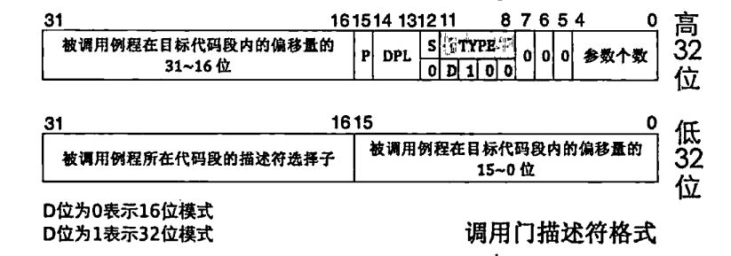

# 为底层添砖加瓦：中断

​	我们这一张，就是要让我们的操作系统拥有注册中断，响应中断的能力。你可能还不清楚啥是中断。这个事情如果您有单片机的编程经验，可能会对本章更加有感觉一些。没有没关系，我们慢慢说。

## 所以，啥是中断

​	先不着急，我们看一个例子先。

​	现实生活中，我们可能往往会被任何啥东西打断，比如说，此时此刻我正在写一个阐述中断的博客，我的一个好朋友突然给我发QQ，向我抱怨该死的爬虫实在是太慢了，需要优化一下并发的结构。这个时候，我就跑去回应他，刚准备打几个字，我的母上大人着急的找我问点事情，我又抛下对这个哥们的回复，冲过去回复我母上大人的问题，之后再回复我兄弟的抱怨，最后回来，继续抓耳挠腮的写下这段话。

​	当然，让我们短暂的抛开我好兄弟继续向我们抱怨这该死的爬虫之外，我们继续将目光回到我们的中断上。

​	中断就是计算机系统中一种非常重要的机制，用于处理突发事件或优先级较高的任务。你可以把它想象成一个紧急通知系统。当某个硬件设备或软件需要处理紧急任务时，它会向处理器发送一个中断信号，告诉处理器：“嘿，有重要的事情需要你马上处理！”处理器收到这个信号后，会暂时停下当前的工作，保存好当前的进度，然后去处理这个紧急任务。处理完之后，处理器会回到之前的工作，继续从刚才停下的地方开始。中断机制的好处是能让计算机同时处理多个任务，并且能及时响应外部设备的请求，比如键盘输入、鼠标点击或者网络数据的到达。如果没有中断，计算机可能会一直忙于某个任务，无法及时响应其他需求，效率会大大降低。值得一提的是——中断自身存在一个优先级衡量，如果在处理中断做响应的时候还发生了更加高优先级的请求，那还的继续脱离出去直接跑过去执行更加高级的中断响应。

> 这个事情单片机编程的朋友自然被串口里的delay搞过，笔者犯过这样的错误，这就是没有理解中断优先级导致的

### 操作系统自身是中断驱动的

​	是的，我们的操作系统本身就是由中断驱动的。我们的操作系统在执行完初始化部分之后，常常就隐身事后，直到有各式各样的中断通知它起来薄记，或者是提供服务的时候，他起来把事情做好了之后就又去休眠了。

​	所以这样看，操作系统到达我们这个层次的时候，就要向事件驱动的类型理解了，我们这几张的内容，更多的也是去搭建这个框架。中断可以说是这个框架的马达，一个根本的动力所在了

## 进一步理解我们的中断

​	所以我们需要理解一下中断的分类。是的，中断存在分类。而且这个分类对我们之后的编程非常重要，笔者打算打起精神，好好说一下（灌一口咖啡）

### 外部中断

​	所以我们首先要说的就是外部中断。外部外部，顾名思义，CPU的外部的一个东西，发起了一个中断请求CPU的响应。就是这个道理。

​	我们主板上，或者是外接总线上就会挂载很多的设备，这些设备归根结底，都会向我们的CPU发送中断请求处理。但是，CPU自身肯定不可能富裕到每一个引脚来处理这样的一个设备。怎么办嗯？

​	答案是，按照中断代表含义的严重性——分成两个大类。也就是分为可以屏蔽的中断和不可以屏蔽的中断两种。

- INTR: Interrupt线，这个上面的中断也是可以（被）屏蔽的，换而言之，这样的中断被屏蔽不会对系统造成故障级别的损失。
- NMI中断，也就是None Maskable Interrupt，不可屏蔽中断。换而言之，这类的中断实际上是一种告知——系统出现了灾难性的问题——比如说电源掉电（台式），内存读写错误，总线奇偶校验错误等等。

​	让我们按照键盘作为例子吧，比如说，笔者现在就正在使用键盘写这篇文档。当我在键盘上按下一个键时，键盘控制器会检测到这个动作，并生成一个中断信号。这个信号通过中断控制器发送给CPU，告诉它有一个键盘事件需要处理。CPU在收到中断信号后，会立即暂停当前正在执行的任务，保存当前的上下文（包括程序计数器、寄存器状态等），**然后跳转到预先定义好的中断处理程序，也就是键盘中断服务例程。**

​	键盘中断服务例程会从键盘控制器的缓冲区中读取你按下的键的扫描码，并将其转换成对应的字符或命令。这个过程涉及到查表（是的，我们后面就会写）等操作。转换完成后，中断服务例程会将这个字符或命令放入系统的输入队列中，以便操作系统或应用程序后续处理。

​	处理完键盘中断后，CPU会恢复之前保存的上下文，继续执行被中断的任务。这样我们就完成了一次外部中断的响应。

### 内部中断

​	下面我们要说的就是内部中断。内部中断自己分成两种：一种就是大名鼎鼎的软中断。也就是软件中断，也就是说，这个中断的来源不光来自计算机系统的核心，而且是软件自己发起的中断。到这里呢，我们使用的——以x86为例子，是int指令。这个指令就是告知处理器此时的程序执行流发起了一个软件中断，需要处理。

- `int intr_num`，这就是这个指令的全部，我们还会在系统调用那个章节再次看到这个玩意，所以不着急。
- `int3`这个指令是大名鼎鼎的断点调试指令。我们的调试往往都有硬件层级的支持的。这里就是通知硬件协调调试。

​	另一种呢，就是我们的异常。异常既包括了软中断的“主动”请求，还包含了“错误”的结果。也就是说，还包含了我们软件层次上的底层错误的含义，比如说into就是一个中断溢出，发起的是4号中断，bound则是检查数组访问是否越界等等。

​	我们的EFLAGS寄存器——这个时候当然需要请出我们的Intel的手册了：

​	我们关心的是IF标志位。

> IF（位 9）中断启用标志 — 控制处理器对可屏蔽中断请求的响应。设置为可响应可屏蔽中断；清除可抑制可屏蔽中断。

​	当然，IF标志位不对任何的运行时类的中断起作用。这包括：

- 显然，只要是导致运行错误的中断类型都会无视IF位，不受IF位的管束，如NMI、异常。这些中断只是通知系统出现了运行的异常，掩耳盗铃是没用的
- 由于intn型的软中断用于实现系统调用功能，这属于软件上层之间有意的协调，不能因为IF位为0就不顾用户请求，所以为了用户功能正常，软中断必须也无视IF位。

​	例子：

- 比如说在执行DIV和IDIV除法指令时，处理器发现分母为0（除0，通常是程序忘记为分母赋值或传给分母的参数有误导致的），除法中分母是不能为0的，这不符合除法要求，将引发0号异常（叫中断也行）。
- 当处理器无法识别某个机器码时，就会发起6号中断（异常），这和主动用ud2指令发起的中断是一样的。比如我们在程序尾用到了很多的死循环指令jmp $和while（1），把它们去掉后，很可能CPU就把内存中的垃圾当成了指令来解码，如果碰巧能解码为某个指令，CPU还能往前走一步，否则解码失败时就会抛出无效操作码6号异常。

#### 异常自己还能进一步的分类

​	不是所有的异常都很致命，按照轻重程度，可以分为以下三种。

- Fault，也称为故障。这种错误是可以被修复的一种类型，属于最轻的一种异常，它给软件一次“改过自新”的机会。当发生此类异常时CPU将机器状态恢复到异常之前的状态，之后调用中断处理程序时，CPU将返回地址依然指向导致fault异常的那条指令。通常中断处理程序中会将此问题修复，待中断处理程序返回后便能重试。最典型的例子就是操作系统课程中所说的缺页异常page fault，话说Linux的虚拟内存就是基于page fault的，这充分说明这种异常是极易被修复的，甚至是有益的。
- Trap，也称为陷阱，这一名称很形象地说明软件掉进了CPU设下的陷阱，导致停了下来。此异常通常用在调试中，比如int3指令便引发此类异常，为了让中断处理程序返回后能够继续向下执行，CPU将中断处理程序的返回地址指向导致异常指令的下一个指令地址。
- Abort，也称为终止，从名字上看，这是最严重的异常类型，一旦出现，由于错误无法修复，程序将无法继续运行，操作系统为了自保，只能将此程序从进程表中去掉。导致此异常的错误通常是硬件错误，或者某些系统数据结构出错。

​	某些异常会有单独的错误码，即error code，进入中断时CPU会把它们压在栈中，这是在压入eip之后做的，别急，我们会去做这个事情。

​	我们的Intel架构规定了一些保留的异常，这些是不允许我们操作系统自由发挥的。所以，放在这里，你可以可以参考Intel手册的第三卷的第七章。笔者的五卷合订本上是3303页。

| Vector No. | Mnemonic            | Description                                             | Source                                                       | Type       | Error code (Y/N) |
| ---------- | ------------------- | ------------------------------------------------------- | ------------------------------------------------------------ | ---------- | ---------------- |
| 0          | #DE                 | Divide Error                                            | DIV and IDIV instructions                                    | Fault      | N                |
| 1          | #DB                 | Debug                                                   | Any code or data reference                                   | Fault/Trap | N                |
| 2          | /                   | NMI Interrupt                                           | Non-maskable external interrupt                              | Interrupt  | N                |
| 3          | #BP                 | Breakpoint                                              | INT3 instruction                                             | Trap       | N                |
| 4          | #OF                 | Overflow                                                | INTO instruction                                             | Trap       | N                |
| 5          | #BR                 | Bound Range Exceeded                                    | BOUND instruction                                            | Fault      | N                |
| 6          | #UD                 | Invalid Opcode (UnDefined Opcode)                       | UD2 instruction or reserved opcode.1                         | Fault      | N                |
| 7          | #NM                 | Device Not Available (No Math Coprocessor)              | Floating-point or WAIT/FWAIT instruction                     | Fault      | N                |
| 8          | #DF                 | Double Fault                                            | Any instruction that can generate an exception, an NMI, or an INTR. | Abort      | Y(0)             |
| 9          | #MF                 | CoProcessor Segment Overrun (reserved)                  | Floating-point instruction.2                                 | Fault      | N                |
| 10         | #TS                 | Invalid TSS                                             | Task switch or TSS access                                    | Fault      | Y                |
| 11         | #NP                 | Segment Not Present                                     | Loading segment registers or accessing system segments.      | Fault      | Y                |
| 12         | #SS                 | Stack Segment Fault                                     | Stack operations and SS register loads.                      | Fault      | Y                |
| 13         | #GP                 | General Protection                                      | Any memory reference and other protection checks.            | Fault      | Y                |
| 14         | #PF                 | Page Fault                                              | Any memory reference.                                        | Fault      | Y                |
| 15         | Reserved            |                                                         |                                                              |            |                  |
| 16         | #MF                 | Floating-Point Error (Math Fault)                       | Floating-point or WAIT/FWAIT instruction                     | Fault      | N                |
| 17         | #AC                 | Alignment Check                                         | Any data reference in memory.3                               | Fault      | Y(0)             |
| 18         | #MC                 | Machine Check                                           | Error codes (if any) and source are model dependent.4        | Abort      | N                |
| 19         | #XM                 | SIMD Floating-Point Exception                           | SIMD Floating-Point Instruction5                             | Fault      | N                |
| 20–31      | Reserved            |                                                         |                                                              |            |                  |
| 32–255     | Maskable Interrupts | External interrupt from INTR pin or INT in instruction. | Interrupt                                                    |            |                  |

​	我们还会再用到这个表的。所以别急。

## IDT

​	上面的表中，我们很容易想到一个问题。既然连Intel架构都规定了必须存在保留部分的异常，我们应该怎么做才能存贮这些信息呢？答案就是IDT。在保护模式下，IDT就是存储中断处理程序的——你可以理解为收到message后调用hook钩子完成中断的请求。

> 玩个概念游戏——IVT相信是不少人也听说过的，这个中断向量表跟IDT很接近，但是，这个是实模式的概念。

​	IDT不光存储中断的东西，实际上还有任务描述符表和陷阱们描述符表。

	

#### 任务门

​	TSS，啊哈，我们到时候实现用户级线程的时候，会仿照这个来做用户线程的切换保存，但是大部分的操作系统没有使用硬件TSS

#### 中断门

​	包含了中断处理程序所在的段选择子和偏移地址，进入这里的时候，除非是不可避免的中断，架构会自动的把IF拉成0防止同级嵌套造成系统死机。

#### 陷阱门

​	区别在于，我们的IF不会自动的置0，只允许放到IDT中。

#### 调用门

​	调用门是用户进程进入特权0级的方式，他不能使用int指令进行调用，只能使用call和jmp进入

​	当然，Linux中，很少使用任务门和调用门，我们只把重心放到中断门上。

#### 那，IDT放哪

​	我们的操作系统还在保护模式的时候，笔者就说过低1MB内存的事情，显然，我们的0~0x3ff这个1KB的地方放置了IVT。在保护模式时代，我们终于可以指定地方了。办法是：IDTR寄存器会记录我们的IDT指针。IDT跟我们的GDT结构差不多，都是32位表基址和16位表界限组成。所以，我们的表界限是64KB大小，我们刚刚说过，一个中断门大小是8个字节，所以，可与放置8K=8192个中断描述符。

## 理解中断处理的过程

​	在开头，我们就有了中断处理的映像了，现在，我们来详细说说。

​	对于外部的中断，我们会使用一个专门的硬件来进行管理综合裁决将最终决定交给CPU处理的中断发送给CPU。比如说，代表性质的就是我们的8259A。我们的bochs模拟的时候也是选择了这个作为我们的中断处理的外部硬件。至于内部中断，嗨，都是处理器自己玩自己了，自然没啥好说的，下面的步骤就是共同的了。

1. 处理器根据所接受到的中断先判断类型，得到的中断向量号准备前往IDT查表得到中断处理子程序的首地址：具体来说，就是我们的标号乘8加上IDTR的段基址，得到的地址就是我们的例程的首地址了
2. 特权级检查，现在我们就要做特权级的检查，我们需要保证特权级为3的用户代码不会直接越过中断调用历程
   - 对于软中断：则是需要检查当前的特权级Current Privilage Level(CPL)和门描述符(Description Privilage Level)，必须要求我们的CPL小于等于我们的DPL，否则就发生异常
   - 我们下一步，还需要检查特权级的上限，也就是说，我们的CPL跟门描述符指向的代码的特权级的对比（复杂的说，是门描述符记录的段选择子的目标代码段的DPL）要满足CPL大于DPL，否则会引发异常，也就是说：请求要高，但是做的代码要权限低。
3. 最后，执行程序，把目标代码段的段选择子加载到CS上，偏移地址加载到EIP上

​	中断发生后，eflags中的NT位和TF位会被置0。如果中断对应的门描述符是中断门，标志寄存器eflags中的IF位被自动置0，避免中断嵌套，即中断处理过程中又来了个新的中断，这是为防止在处理某个中断的过程中又来了个相同的中断，即同一种中断未处理完时又来了一个，这会导致一般保护性（GP）异常。这表示默认情况下，处理器会在无人打扰的方式下执行中断门描述符中的中断处理例程。若中断发生时对应的描述符是任务门或陷阱门的话，CPU是不会将IF位清0的。因为陷阱门主要用于调试，它允许CPU响应更高级别的中断，所以允许中断嵌套。而对任务门来说，这是执行一个新任务，任务都应该在开中断的情况下进行，否则就独占CPU资源，操作系统也会由多任务退化成单任务了。

​	**从中断返回的指令是iret**，它从栈中弹出数据到寄存器cs、eip、eflags等，根据特权级是否改变，判断是否要恢复旧栈，也就是说是否将栈中位于SS_old和ESP_old位置的值弹出到寄存ss和esp。当中断处理程序执行完成返回后，**通过iret指令从栈中恢复eflags的内容。**

​	更加具体的说——对于我们的32位保护模式下，当我们通过了刀山火海的检查，准备加载了CS和EIP后，都会把我们的CS，EIP和EFLAGS寄存器保存，对于发现特权级变化的转移，还要压入SS和ESP寄存器。

​	处理器进入中断执行完中断处理程序后，还要返回到被中断的进程，这是进入中断的逆过程。中断返回是用iret指令实现的。Iret,即interrupt ret,此指令专用于从中高地址 断处理程序返回，假设在32位模式下，它从当前栈顶处依次弹出32位数据分别到寄存器EIP、CS、EFLAGS。iret指令并不清楚栈数据的正确性，它只负责把栈顶处往上的数据，每次4字节，对号入座弹出到相关寄存器，所以在使用iret之前，一定要保证栈顶往上的数据是正确的，且从栈顶往上的顺序是EIP、CS、EFLAGS，根据特权级是否有变化，还有ESP、SS。
​	由于段寄存器CS是16位，故从栈中返回的32位数据，其高16位被丢弃，只将低16位载入到CS。若处理器发现返回后特权发生变化，那就再返回ESP和SS，SS也是16位寄存器，所以同样也是弹出32位数据后，只将其中的低16位加载到SS。

​	iret指令意味着从中断返回，所以，它是中断处理程序中最后一个指令。

​	注意，如果中断有错误码，处理器并不会主动跳过它的位置，咱们必须手动将其跳过，也就是说，在准备用iret指令返回时，当前栈指针esp必须指向栈中备份的EIP_old所在的位置，这样处理器才能将栈中的数据对号入座，弹出到各自对应的寄存器中。

#### 中断错误码

​	当然，我们一些中断是报告错误的，这些中断会在栈中压入一个错误码给程序提供一些线索。对于高16位，我们保留0，第16位中的高13位是高13位索引，然后是TI（去GDT找还是去LDT，IDT位：是不是指向IDT，和EXT：是不是来自外部）

#### sti和cli

​	处理器提供了专门用于控制IF位的指令，通过它，IF可以直接控制。指令cli使IF位为0，这称为关中断，指令sti使IF位为1，这称为开中断。IF位只能限制外部设备的中断，对那些影响系统正常运行的中断都无效，如异常exception，软中断，如int n等，不可屏蔽中断NMI都不受IF限制。

## 下一篇

> [Programming 8259A](./5,2_Programming_8259A.md)
