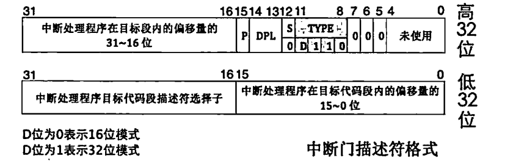
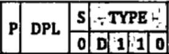
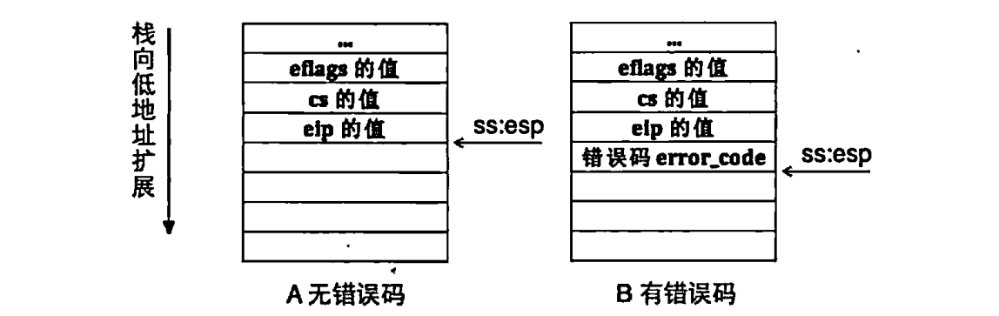
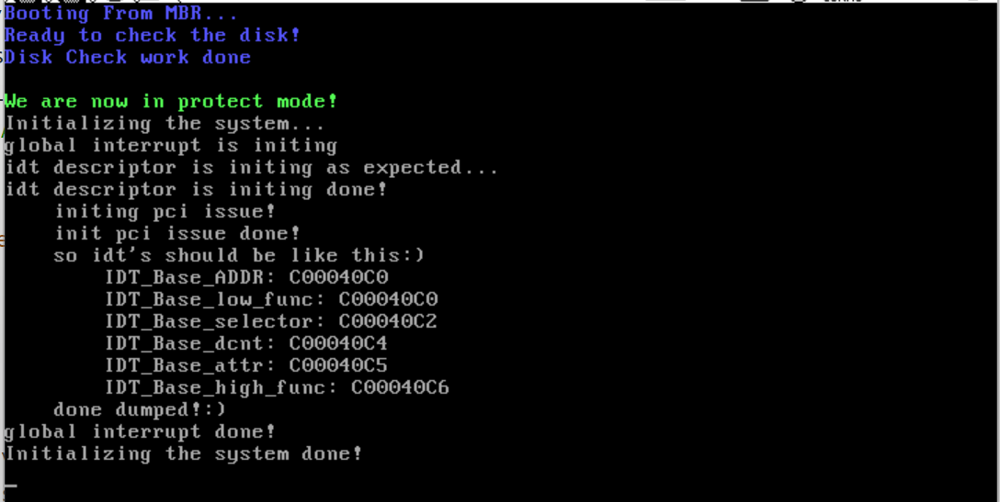
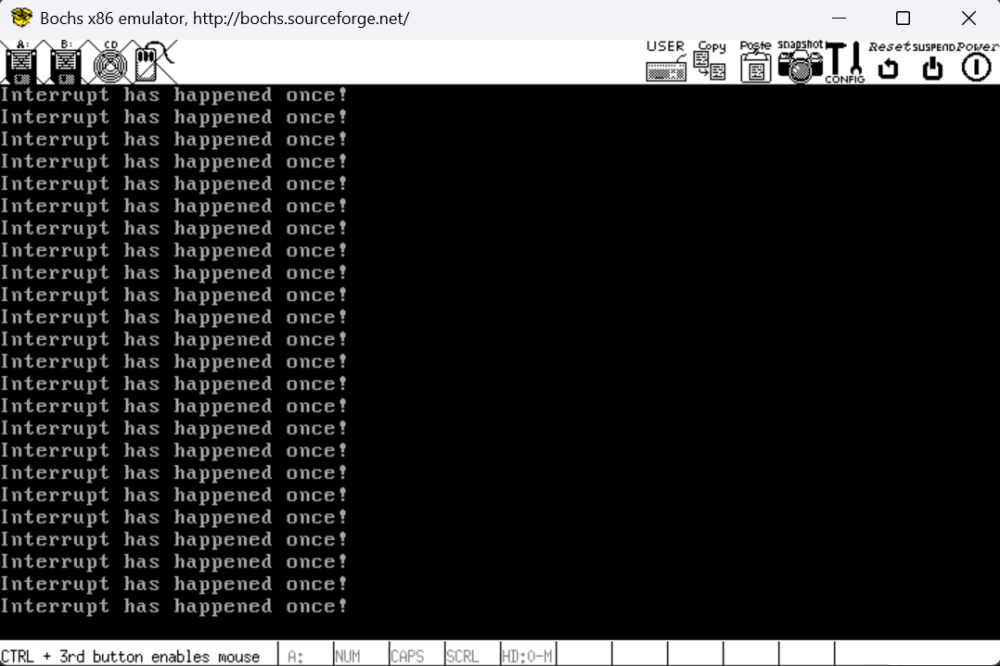

# 动手实现我们的中断子系统

​	下一步，让我们实现我们的中断子系统！我们需要做的事情非常的多，所以，需要每一步的都谨慎的做好，笔者会教授一些更加高级的调试方式。

​	我们介绍的8259A，本身就被放置在了

## 注册一个我们自己的中断向量表

​	是的，我们的中断必须要有一个Callback，这个事情还是很简单的。首先，我们在我们的空间中，生成一个IDT描述符结构体的指针。这个事情，需要回到我们的IDT描述符表的设置当中。这个在上一篇博客已经谈论到了，这里就不再说明了

```c
// GateDescriptor structure represents the interrupt descriptor entry
// The structure defines how the interrupt descriptor is laid out in memory
#pragma pack(push, 1)
typedef struct
{
    uint16_t func_offset_low_word;        // Low 16 bits of the function address
    uint16_t selector;                    // Selector for code segment
    uint8_t dcount;                       // Number of arguments for the function
    uint8_t attribute;                    // Attributes (DPL, type of gate)
    uint16_t func_offset_high_word;       // High 16 bits of the function address
} __attribute__((packed)) GateDescriptor; // Ensure the structure is packed (no padding)
#pragma pack(pop)
```

​	这里开始稍微有点复杂。笔者慢慢说一下：



​	回到这个图，我们看到，整个IDT字段都是非常严密的排列，不允许任何间隙。而且，我们依次从低到高放上了：

- 中断处理程序的偏移量的低16位
- 段选择子属性，16位
- 然后就是没有被使用的dcount占位符
- 然后是IDT属性
- 然后就是我们的处理的高16位

​	一共看起来就是64位，8个字节的内容。除此之外，我们还有很多新的东西。

```
#pragma pack(push, 1)
#pragma pack(pop)
```

​	整个是编译器的预处理指令。实际上，我们的ifndef防止重定义的套件，完全可以换成一个非常著名的预处理指令叫做pragma once

> [Structure-Packing Pragmas - Using the GNU Compiler Collection (GCC)](https://gcc.gnu.org/onlinedocs/gcc-4.4.4/gcc/Structure_002dPacking-Pragmas.html)

​	在我们的GCC手册中，有点遗憾，笔者直接找到的是GCC4.4的老古董手册说法。实际上，我们的手册是这样阐述我们的pack指令的：

- #pragma pack(n) 只是设置新的对齐方式。
- #pragma pack() 将对齐方式设置为编译开始时生效的对齐方式（另请参见命令行选项 -fpack-struct[=<n>]，参见代码生成选项）。
- #pragma pack(push[,n]) 将当前对齐方式设置推送到内部堆栈，然后可选地设置新的对齐方式。
- #pragma pack(pop) 将对齐方式设置恢复为保存在内部堆栈顶部的对齐方式（并删除该堆栈条目）。请注意，#pragma pack([n]) 不会影响此内部堆栈；因此，#pragma pack(push) 后面可以跟多个 #pragma pack(n) 实例，最后由单个 #pragma pack(pop) 完成。

​	所以，实际上上面两行的代码含义非常的简单：

> `#pragma pack(push, 1)`：将我们先前结构体的对齐方式进行压栈处理，然后设置为1字节对齐
>
> `#pragma pack(pop)`：将我们之前的方式进行弹栈恢复。也就是恢复默认的对齐方式。

​	也就是对于整个结构体，我们将会按照单字节对齐，严密的生成一个非常紧密的结构体对象。这是必要的，否则就会发生意想不到的错误（提示，IDT描述符要求是严格的8字节，你可以尝试`sizeof(GateDescriptor)`，用以检查我们的IDT描述符是不是8个字节，后面，我们实现自己的Kernel Assert的时候，还会重新来到这里）

​	下一个新东西是：

```
__attribute__((packed))
```

​	`__attribute__((packed))`是一个特定于GCC的属性，**用于指示编译器在编译过程中取消结构体的优化对齐，而是按照实际占用的字节数进行对齐。**笔者在自己的硬件上测试过，可以既不使用#pragma pack(push, 1)和pop填充，也不适用`__attribute__((packed))`对于上述的结构体排列，也可以做选择性的其中一个。笔者这样写是明确的表达了自己的语义，即：完全按照非填充的单字节对齐的强耦合结构体排列我们的IDT描述符表。

​	下一步，是定义我们的中断处理函数句柄类型。

```
typedef void *intr_functor; // Type for interrupt function pointers
```

​	注意到我没有使用一个函数指针的typedef，因为后面我们的register的函数指针类型非常的通用，完全将实际的操作托付给了我们的底层而不是C语言应用层。这样，我们就可以写中断处理的IDT描述符函数了。我们注意到的是，我们现在还是只有一个内核态，注册到内核的代码段是非常没有问题的。

```c
// Function to initialize a single IDT descriptor
static void make_idt(GateDescriptor *desp, uint8_t attr, intr_functor func)
{
    // Fill in the gate descriptor with the function address and other attributes
    desp->func_offset_low_word = LOW_16BITS(func);   // Lower 16 bits of function address
    desp->func_offset_high_word = HIGH_16BITS(func); // Upper 16 bits of function address
    desp->dcount = 0;                                // No arguments for the interrupt function
    desp->attribute = attr;                          // Set the gate attributes (e.g., privilege level)
    desp->selector = SELECTOR_K_CODE;                // Selector for the kernel code segment
}
```

​	特别的，笔者这里封装了一个这样的抽象

```c
#define LOW_16BITS(value)   ((uint32_t)value & 0x0000FFFF)
#define HIGH_16BITS(value)  (((uint32_t)value & 0xFFFF0000) >> 16)
```

​	非常简单，实际上就是萃取高16位和低16位出来。

```c
// Function to initialize all IDT descriptors
static void idt_desp_init(void)
{
    verbose_ccputs("idt descriptor is initing as expected...\n");

    // Loop through all interrupt descriptors and initialize them
    for (uint16_t i = 0; i < IDT_DESC_CNT; i++)
    {
        make_idt(&idt_table[i], IDT_DESC_ATTR_DPL0, asm_intr_vector_table[i]);
    }

    verbose_ccputs("idt descriptor is initing done!\n");
}

```

> 小差：verbose_ccputs是笔者自己更新的一个用于verbose level打印的函数，定义上很简单：
>
> ```c
> void verbose_ccputs(char* message){
> #ifdef VERBOSE
>     ccos_puts(message);
> #endif    
> }
> ```
>
> 其他事情如法炮制，我们默认定义VERBOSE来开启冗余打印，这样的话就会很灵活的显示我们想看到的东西了。

​	对于整个IDT的描述符表，我们需要做的是依次注册我们的初步的回调函数。也就是依次对IDT中赋予直接可以访问的汇编接口的hook。

​	我们知道，对于一个内核态的中断属性，需要设置一个属性。我们后面还会涉及到非常非常多的属性问题，笔者在这里封装了一个专门的文件来说明，请看：

```c
#ifndef PROPERTY_SELECTOR_H
#define PROPERTY_SELECTOR_H

// RPL Settings for IDT (Request Privilege Level)
#define  RPL0  0   // Ring 0: Kernel mode
#define  RPL1  1   // Ring 1: Reserved for device drivers
#define  RPL2  2   // Ring 2: Reserved for certain kernel functions
#define  RPL3  3   // Ring 3: User mode

// TI (Table Indicator) values
#define TI_GDT 0   // GDT (Global Descriptor Table)
#define TI_LDT 1   // LDT (Local Descriptor Table)

// Selectors for various segments (Code, Data, Stack, GS)
#define SELECTOR_K_CODE    ((1 << 3) + (TI_GDT << 2) + RPL0)  // Kernel Code Segment Selector
#define SELECTOR_K_DATA    ((2 << 3) + (TI_GDT << 2) + RPL0)  // Kernel Data Segment Selector
#define SELECTOR_K_STACK   SELECTOR_K_DATA                 // Kernel Stack Segment Selector (same as Data)
#define SELECTOR_K_GS      ((3 << 3) + (TI_GDT << 2) + RPL0)  // Kernel GS Segment Selector

//--------------   IDT Property Table ------------

// IDT descriptor properties
#define  IDT_DESC_P        1   // Present flag (descriptor is present)
#define  IDT_DESC_DPL0     0   // Descriptor Privilege Level 0 (Kernel)
#define  IDT_DESC_DPL3     3   // Descriptor Privilege Level 3 (User)
#define  IDT_DESC_32_TYPE  0xE // 32-bit Gate Type (Interrupt Gate)
#define  IDT_DESC_16_TYPE  0x6 // 16-bit Gate Type (Trap Gate)

// IDT descriptor attributes with privilege levels
#define  IDT_DESC_ATTR_DPL0  ((IDT_DESC_P << 7) + (IDT_DESC_DPL0 << 5) + IDT_DESC_32_TYPE)  // 32-bit interrupt gate with DPL 0
#define  IDT_DESC_ATTR_DPL3  ((IDT_DESC_P << 7) + (IDT_DESC_DPL3 << 5) + IDT_DESC_32_TYPE)  // 32-bit interrupt gate with DPL 3

#endif
```

​	我们的IDT的说明位，结合给出的这个图：



首先段存在，DPL按照Intel架构的分类是0级是内核，3级是用户，给定了DPL的抽象，剩下的0xE是作为32位段的指示Type，也就是0xE，这个没啥好说的。作为对比，当D为0的时候，我们描述的是16位段。这就是我们给每一个中断注册`IDT_DESC_ATTR_DPL0`的根本原因。

## 注册我们的中断向量表到内核代码段和地址段上

​	下一个，就是提供一个汇编层次的callback hook，笔者这里首先需要你回顾——我们实际上是将我们的中断号作为偏移寻址我们的终端向量表，然后自动将我们的代码段和偏移量更新到这个中断向量表给出的位置上，这个事情，我们实际上使用一个宏来生成。我们约定一个依赖于中断名称的symbols，在那个向量表上，我们放置这个symbols，在汇编的时候被动态的替换成了symbols的地址，我们的中断发生之后，自然就会取到这个地址加载进入我们的代码段和IP偏移量。我们在那里书写我们的逻辑就好了。

​	使用之前我们就聊过的Macro宏就能完成这个事情

```asm
; Followings are the operetions the Interrupt enter
; behaviour done
%define DO_NOP      nop
%define PUSH_ZERO   push 0

; EOI command
%define EOI         0x20
%define SLAVE_PORT  0x0a
%define MASTER_PORT 0x20

%macro INTR_VECTOR 2
section .text
intr%1enrty:
    %2
    push intr_str	; This is the information we defined in the main file. In order to verify that our process is correct, we will print it here.
    call ccos_puts	; external in main file
    add esp, 4		; jump off the string
    mov al, EOI
    out SLAVE_PORT, al
    out MASTER_PORT,al

    add esp, 4
    iret
section .data
    dd  intr%1enrty
%endmacro
```



​	说回来，我们的%2实际上是在做这样的事情，请看上图。上图中，我们看到了一些中断会压入返回值，另一些不会。比起来判断中断号，我们这里需要一个更加统一的处理，这样既不会增加额外代码，也不会刷新流水线造成严重的迟钝（注意中断可是系统的生命线！我们这里是要极端追求速度的！），所以我们自己静态化处理方式。对于那些压入了参数的中断，啥也不做。对于那些没有压入错误码的，我们手动压入一个0.然后需要注意的是我们需要在这里跳过我们的参数，需要add esp 4来跳过我们的string。

​	下一步，我们需要向8259A发送一个中断处理结束的指令，否则8259A就会一直等待我们的消息。

```
    mov al, EOI
    out SLAVE_PORT, al
    out MASTER_PORT,al
```

​	也就是0x20指令，不懂的话，查阅笔者上一篇写道的关于8259A的编程，这里不再重复说明。最后我们将esp指向我们的返回地址EIP，就需要统一的跳过错误码。所以还需要add esp 4之后，再iret返回我们的主线程。

```asm
[bits 32]
%include "asm/kernel/interrupt.inc"

; using in test the interrupt issue
extern ccos_puts

section .data
intr_str db "Interrupt has happened once!", 0xA, 0

; This is the asm intr table,
; using in indicate for the lower level intr controls call
global asm_intr_vector_table
asm_intr_vector_table:

INTR_VECTOR 0x00, PUSH_ZERO
INTR_VECTOR 0x01, PUSH_ZERO
INTR_VECTOR 0x02, PUSH_ZERO
INTR_VECTOR 0x03, PUSH_ZERO 
INTR_VECTOR 0x04, PUSH_ZERO
INTR_VECTOR 0x05, PUSH_ZERO
INTR_VECTOR 0x06, PUSH_ZERO
INTR_VECTOR 0x07, PUSH_ZERO 
INTR_VECTOR 0x08, DO_NOP
INTR_VECTOR 0x09, PUSH_ZERO
INTR_VECTOR 0x0a, DO_NOP
INTR_VECTOR 0x0b, DO_NOP 
INTR_VECTOR 0x0c, PUSH_ZERO
INTR_VECTOR 0x0d, DO_NOP
INTR_VECTOR 0x0e, DO_NOP
INTR_VECTOR 0x0f, PUSH_ZERO 
INTR_VECTOR 0x10, PUSH_ZERO
INTR_VECTOR 0x11, DO_NOP
INTR_VECTOR 0x12, PUSH_ZERO
INTR_VECTOR 0x13, PUSH_ZERO 
INTR_VECTOR 0x14, PUSH_ZERO
INTR_VECTOR 0x15, PUSH_ZERO
INTR_VECTOR 0x16, PUSH_ZERO
INTR_VECTOR 0x17, PUSH_ZERO 
INTR_VECTOR 0x18, DO_NOP
INTR_VECTOR 0x19, PUSH_ZERO
INTR_VECTOR 0x1a, DO_NOP
INTR_VECTOR 0x1b, DO_NOP 
INTR_VECTOR 0x1c, PUSH_ZERO
INTR_VECTOR 0x1d, DO_NOP
INTR_VECTOR 0x1e, DO_NOP
INTR_VECTOR 0x1f, PUSH_ZERO
; THE IRQ0: Sysclk handler
INTR_VECTOR 0x20, PUSH_ZERO 
```

​	asm_intr_vector_table就是我们的直接的中断向量注册表的Hook。我们就是在这里直接排上了我们的中断向量表的。需要注意的是，前32个中断是Intel默认保留的，下面的0x20号就是我们马上准备测试使用的时钟中断。

​	没啥好说的，我们回来，继续看代码。

## 设置我们的8259A的属性编程

​	还记得笔者讲的昏昏欲睡的8259A的编程嘛？我们马上就要开始了！

### 封装IO端口的汇编操作

​	很好，我们需要封装IO端口的汇编操作，不然的话，实在没办法对8259做指令编程的。

```c
#ifndef _IO_IO_H
#define _IO_IO_H
#include "include/library/types.h"

/* IO Operation level */
/* To make things fast, we need to define as inline */

/* write port a byte*/
// Inline function to write a byte to the specified I/O port
static inline void outb(uint16_t port, uint8_t data) {
    asm volatile ( 
        "outb %b0, %w1"  // Assembly instruction to output a byte (%b0) to a port (%w1)
        :                 // No outputs
        : "a" (data),     // Input: data in the AL register (8-bit, hence %b0 corresponds to the byte)
          "Nd" (port)     // Input: port address in the DX register (%w1 corresponds to the 16-bit port)
    );    
}

/* write words */
// Inline function to write a word (16-bit) to the specified I/O port multiple times
static inline void outsw(uint16_t port, const void* addr, uint32_t word_cnt) {
   asm volatile (
        "cld; \              // Clear direction flag to ensure string operations go forward (increasing address)"
        "rep outsw"          // Repeat the 'outsw' instruction (write word) for word_cnt times
        : 
        "+S" (addr),        // Input and output: address of the data to be written (register SI)
        "+c" (word_cnt)     // Input and output: word count (register CX)
        : "d" (port)        // Input: port address (register DX)
    );
}

// read bytes 
// Inline function to read a byte from the specified I/O port
static inline uint8_t inb(uint16_t port) {
    uint8_t data;
    asm volatile (
        "inb %w1, %b0"      // Assembly instruction to input a byte from port (%w1) into the AL register (%b0)
        : "=a" (data)       // Output: the value read from the port is stored in the data variable (AL register)
        : "Nd" (port)       // Input: port address (DX register)
    );
    return data;
}
    
/* read words */
// Inline function to read words (16-bit) from the specified I/O port multiple times
static inline void insw(uint16_t port, void* addr, uint32_t word_cnt) {
    asm volatile (
        "cld; \              // Clear direction flag to ensure string operations go forward (increasing address)"
        "rep insw"           // Repeat the 'insw' instruction (input word) for word_cnt times
        : "+D" (addr),       // Input and output: address where the data will be stored (register DI)
          "+c" (word_cnt)    // Input and output: word count (register CX)
        : "d" (port)         // Input: port address (register DX)
        : "memory"           // Clobber memory: inform the compiler that memory may have been modified
    );
}
    
#endif
```

​	上面的部分上，我们已经封装好了对IO的操作，下面笔者需要带你做一点复习，知道怎么个事情的，直接跳过去就好了，如果你不想理解这部分内容！

#### outb outsw inb insw的指令说明

​	我们的确需要好好说说Intel汇编对IO封装的操作。

> **`outb` 操作：**
>
> - **我们使用outb来将一个字节的数据写入指定的端口**。通过使用内联汇编，我们可以直接控制 `outb` 指令的执行，这样就可以实现对硬件端口的低级访问。**在这条指令中，`%b0` 是表示 8 位数据的寄存器，它被存储在 `AL` 寄存器中，而 `%w1` 是 16 位端口地址，通过 `DX` 寄存器传递。**
>
> **`outsw` 操作：**
>
> - **我们封装一个更加独立的操作来完成将多个 16 位数据（字）写入指定的端口的任务。**它采用了 `cld` 指令来清除方向标志位，确保接下来的字符串操作是按递增地址的方式执行。`rep outsw` 是重复执行 `outsw` 指令直到写入的次数达到指定值。关于为什么这样设置input output，笔者写在了注释上
>
> **`inb` 操作：**
>
> - **`inb` 操作是用来从指定的端口读取一个字节数据的。**通过将数据存储在 `AL` 寄存器中，并返回给程序变量，允许程序直接与 I/O 端口进行交互，读取硬件设备的状态。内联汇编的使用使得这种低级访问更高效，并且减少了编译器的干扰。端口地址存储在 `DX` 寄存器中，而结果存储在 `AL` 寄存器中。
>
> **`insw` 操作：**
>
> - **`insw` 操作用于从指定端口批量读取 16 位数据。**与 `outsw` 类似，它使用了 `cld` 指令来清除方向标志位，确保读取是按地址递增的顺序进行的。通过 `rep insw` 指令，我们可以重复读取多个数据项，这比逐个读取更高效。`DI` 寄存器存储目标地址，`CX` 寄存器保存读取次数，`DX` 寄存器提供端口地址。

### 对8259A的编程

​	下面，我们来完成对8259A的编程吧！

```c
#include "include/device/pci.h"
#include "include/io/io.h"
#include "include/library/ccos_print.h"

// PCI ports for controlling and data transfer
#define PCI_MASTER_CONTROL_PORT     (0x20)  // Port for the master PIC control
#define PCI_MASTER_DATA_PORT        (0x21)  // Port for the master PIC data
#define PCI_SLAVE_CONTROL_PORT      (0xa0)  // Port for the slave PIC control
#define PCI_SLAVE_DATA_PORT         (0xa1)  // Port for the slave PIC data

// Initialize the PCI interrupt controller
void pci_init()
{
    verbose_ccputs("    initing pci issue!\n");  // Debug message indicating the start of PCI initialization
    
    // Initialize the master PIC (Programmable Interrupt Controller) with ICW1
    outb(PCI_MASTER_CONTROL_PORT, 0x11);   // Send ICW1: initialization command word 1
    outb(PCI_MASTER_DATA_PORT, 0x20);      // Send ICW2: vector offset for interrupts from the master PIC
    outb(PCI_MASTER_DATA_PORT, 0x04);      // Send ICW3: slave connection (master to slave IRQ2)
    outb(PCI_MASTER_DATA_PORT, 0x01);      // Send ICW4: final initialization command (non-buffered mode)

    // Initialize the slave PIC with ICW1
    outb(PCI_SLAVE_CONTROL_PORT, 0x11);    // Send ICW1 for the slave PIC
    outb(PCI_SLAVE_DATA_PORT, 0x28);       // Send ICW2 for the slave PIC (vector offset for interrupts from the slave)
    outb(PCI_SLAVE_DATA_PORT, 0x02);       // Send ICW3 for the slave PIC (slave PIC is connected to IRQ2 of master)
    outb(PCI_SLAVE_DATA_PORT, 0x01);       // Send ICW4 for the slave PIC (non-buffered mode)

    // Mask interrupts to disable all IRQs
    outb(PCI_MASTER_DATA_PORT, 0xfe);      // Mask all IRQs on the master PIC (set bit 0)
    outb(PCI_SLAVE_DATA_PORT, 0xff);       // Mask all IRQs on the slave PIC (set all bits)

    verbose_ccputs("    init pci issue done!\n");  // Debug message indicating PCI initialization is complete
}
```

​	关于端口的规定，我们已经在8259A的编程中谈论过了，这里我们依次说明一下设置了什么。

```c
    // Initialize the master PIC (Programmable Interrupt Controller) with ICW1
    outb(PCI_MASTER_CONTROL_PORT, 0x11);   // Send ICW1: initialization command word 1
    outb(PCI_MASTER_DATA_PORT, 0x20);      // Send ICW2: vector offset for interrupts from the master PIC
    outb(PCI_MASTER_DATA_PORT, 0x04);      // Send ICW3: slave connection (master to slave IRQ2)
    outb(PCI_MASTER_DATA_PORT, 0x01);      // Send ICW4: final initialization command (non-buffered mode)
```

​	我们首先初始化主8259A片，毫无疑问，我们按照顺序，依次写入初始化指令字：

- ICW1：我们设置中断是边沿触发,而且还需要级联我们的8259A，所以设置需要ICW4
- ICW2：设置我们的PIC的从IRQ0开始的中断号对应的是从0x20开始。为什么是0x20，看上面，我说过了。
- ICW3：将 IR2 设置为级联到另一块 PIC。 
- ICW4：将 PIC 设置为 8086 模式，并发出中断结束信号 (EOI)。

```c
    // Initialize the slave PIC with ICW1
    outb(PCI_SLAVE_CONTROL_PORT, 0x11);    // Send ICW1 for the slave PIC
    outb(PCI_SLAVE_DATA_PORT, 0x28);       // Send ICW2 for the slave PIC (vector offset for interrupts from the slave)
    outb(PCI_SLAVE_DATA_PORT, 0x02);       // Send ICW3 for the slave PIC (slave PIC is connected to IRQ2 of master)
    outb(PCI_SLAVE_DATA_PORT, 0x01);       // Send ICW4 for the slave PIC (non-buffered mode)
```

- ICW1：我们设置中断是边沿触发,而且还需要级联我们的8259A，所以设置需要ICW4
- ICW2：设置我们的PIC的从IRQ0开始的中断号对应的是从0x28，这个是顺乘了我们的主片设置
- ICW3：将 IR2 设置为级联到主 PIC。
- ICW4：将 PIC 设置为 8086 模式，并发出中断结束信号 (EOI)。

​	最后，使能我们感兴趣的中断，显然我们测试我们的第一个中断，也就是时钟中断，就只使能IRQ0

```c
    // Mask interrupts to disable all IRQs
    outb(PCI_MASTER_DATA_PORT, 0xfe);      // Mask all IRQs on the master PIC (set bit 0)
    outb(PCI_SLAVE_DATA_PORT, 0xff);       // Mask all IRQs on the slave PIC (set all bits)
```

到此为之，我们终于可以临门一脚了

## 组合我们的终端子系统的初步构建抽象

​	当然到这里，实际上还差另一半——对异常的注册和处理。不着急，我们先一步步慢慢来。

### 依次初始化我们的IDT表和8259使能

```c
// Function to initialize the global interrupt descriptor table (IDT)
void init_idt(void)
{
    verbose_ccputs("global interrupt is initing\n");

    // Initialize the exception handlers
    idt_desp_init();

    // Initialize PCI devices (used for interrupt handling in some cases)
    pci_init();

	...

    verbose_ccputs("global interrupt done!\n");
}
```

### 完成对IDT表的加载

​	激动人心的时刻到了，我们马上就来加载IDT表

```c
    // Load the IDT into the IDT register
    load_idt();
```

```c
// Macro to compose the value to load into the IDT register
#define COMPOSE_LIDT_VALUE() (                                          \
    ((uint64_t)(uint32_t)idt_table << 16) | /* IDT base address */      \
    (sizeof(idt_table) - 1)                 /* Size of the IDT table */ \
)

// Function to load the IDT into the IDT register (LIDT instruction)
static void load_idt(void)
{
    uint64_t idt_op = COMPOSE_LIDT_VALUE();
    asm volatile("lidt %0" ::"m"(idt_op)); // Load the IDT
}
```

​	idt_op是如何的出来的呢？答案是IDTR寄存器的结构，高32位是偏移地址，低16位是中断向量的界限。需要减一是因为我们的计数从0开始！

​	下面这个函数用来打印一个IDT表的显示的，这里指示给出实现。

```c
// Conditional compilation for viewing the IDT structure in memory
#ifdef VIEW_IDT_STRUTURE
static void view_idt_struct_memory_mappings(void)
{
    verbose_ccputs("    so idt's should be like this:)\n");
    verbose_ccputs("        IDT_Base_ADDR: ");
    verbose_ccint((uint32_t)&idt_table[0]);
    verbose_ccputchar('\n');
    verbose_ccputs("        IDT_Base_low_func: ");
    verbose_ccint((uint32_t)&(idt_table[0].func_offset_low_word));
    verbose_ccputchar('\n');
    verbose_ccputs("        IDT_Base_selector: ");
    verbose_ccint((uint32_t)&(idt_table[0].selector));
    verbose_ccputchar('\n');
    verbose_ccputs("        IDT_Base_dcnt: ");
    verbose_ccint((uint32_t)&(idt_table[0].dcount));
    verbose_ccputchar('\n');
    verbose_ccputs("        IDT_Base_attr: ");
    verbose_ccint((uint32_t)&(idt_table[0].attribute));
    verbose_ccputchar('\n');
    verbose_ccputs("        IDT_Base_high_func: ");
    verbose_ccint((uint32_t)&(idt_table[0].func_offset_high_word));
    verbose_ccputchar('\n');
    verbose_ccputs("    done dumped!:)\n");
}
#endif
```

​	我们也就这样调用之。

```c
    // Optionally, view the structure of the IDT in memory (for debugging)
#ifdef VIEW_IDT_STRUTURE
    view_idt_struct_memory_mappings();
#endif
```

### 封装一个开关中断的函数

```c
// Function to enable interrupts globally (using the STI instruction)
void sti(void)
{
    asm volatile("sti"); // Set the interrupt flag (enable interrupts)
}

// Function to disable interrupts globally (using the CLI instruction)
void cli(void)
{
    asm volatile("cli"); // Clear the interrupt flag (disable interrupts)
}
```

​	太简单了，笔者不说了，实际上这两个指令就是设置EFlags寄存器的IF值。

## 完成全系统的预备初始化函数init_all函数

​	你当然可以将一大堆初始化代码零碎的放到main函数里，但是笔者认为实在是太没法看了，因为所有的接口部分的头文件全部被堆到了main函数里。所以，封装一个init_all函数可以分离一些依赖。

```c
void init_all(void)
{
    ccos_set_console_cursor(5, 0);
    ccos_puts("Initializing the system...\n");
    init_idt();
    ccos_puts("Initializing the system done!\n");
}
```

​	在主函数中

```c
#include "include/library/ccos_print.h"
#include "include/kernel/init.h"
#include "include/kernel/interrupt.h"
int main(void)
{
    init_all();
    // sti();
    while(1);
    return 0;
}
```

​	外面先继续屏蔽我们的中断而不打开。在settings.h文件中，定义宏VIEW_IDT_STRUTURE。

## Makefile

​	笔者修订了这个实验的Makefile，更加规范一些

```makefile
MBR 	= mbr
LOADER	= loader
KERNEL	= kernel
# Same in bochsrc, if u gonna switch the name, do also modified the bochsrc
BOOT_IMG	= boot.img

# disasm and middlewares
OBJ_DIR		= middleware
DISASM_DIR  = disasm

# MBR And Loader

ASM_INC_DIR = include
ARCH_ASM_DIR= arch/asm

# Kernel Mains
# ASM Issue
KERDIR_ASM_DIR	= arch/kernel
KERMAIN_ASFLAGS = -f elf
KER_ASM_INCLUDE		= include

# C Issue
DEBUG_FLAG	:=
KER_C_DIR			= kernel
KERMAIN_CFLAGS 	= 	-I. -Wall -m32 -fno-stack-protector \
					-c -fno-builtin -W -Wstrict-prototypes -Wmissing-prototypes

# Linkages
ENTRY_POINT		= 0xc0001500
# Specify the i386 cpu link mode and
# Specify the non-execution stack mode 
# To set up, we need to call at front end, with impl at backend
KERNEL_MAIN_LD_FLAG =  	\
					-m elf_i386 -z noexecstack \
					-Ttext $(ENTRY_POINT) -e main -Map $(OBJ_DIR)/kernel.map


# Modify the GCC for the usage
AS 			= nasm
GCC			= gcc
LD			= ld
# Some dependencies macro
KERNEL_MAIN_OBJ = 	${OBJ_DIR}/main.o ${OBJ_DIR}/init.o $(OBJ_DIR)/ccos_print.o \
					${OBJ_DIR}/_ccos_print.o ${OBJ_DIR}/_interrupt_asm.o \
					${OBJ_DIR}/pci.o ${OBJ_DIR}/interrupt.o  

${BOOT_IMG}: \
	${OBJ_DIR}/${MBR}.bin ${OBJ_DIR}/${LOADER}.bin $(OBJ_DIR)/${KERNEL}.bin

$(OBJ_DIR)/${KERNEL}.bin: $(KERNEL_MAIN_OBJ)
	$(LD) $(KERNEL_MAIN_LD_FLAG) $^ -o $@

# MBR guidance asm
${OBJ_DIR}/${MBR}.bin:
	mkdir -p ${OBJ_DIR}
	nasm -o ${OBJ_DIR}/${MBR}.bin 	-w-orphan-labels	-I${ASM_INC_DIR} ${ARCH_ASM_DIR}/${MBR}.S

# Loader the kernel asm
${OBJ_DIR}/${LOADER}.bin:
	nasm -o ${OBJ_DIR}/${LOADER}.bin -w-orphan-labels	-I${ASM_INC_DIR} ${ARCH_ASM_DIR}/${LOADER}.S

# Main Kernels
${KERNEL_MAIN_OBJ}:
	${AS} ${KERMAIN_ASFLAGS} ${KERDIR_ASM_DIR}/_ccos_print.S -I${KER_ASM_INCLUDE} -o $(OBJ_DIR)/_ccos_print.o
	${AS} ${KERMAIN_ASFLAGS} ${KERDIR_ASM_DIR}/interrupt.S -I${KER_ASM_INCLUDE} -o $(OBJ_DIR)/_interrupt_asm.o
	${GCC} ${KERMAIN_CFLAGS} ${KER_C_DIR}/library/ccos_print.c -o $(OBJ_DIR)/ccos_print.o
	${GCC} ${KERMAIN_CFLAGS} -c ${KER_C_DIR}/kernel/interrupt.c -o ${OBJ_DIR}/interrupt.o
	${GCC} ${KERMAIN_CFLAGS} -c ${KER_C_DIR}/kernel/init.c -o ${OBJ_DIR}/init.o
	${GCC} ${KERMAIN_CFLAGS} -c ${KER_C_DIR}/device/pci.c -o ${OBJ_DIR}/pci.o
	${GCC} ${KERMAIN_CFLAGS} -c ${KER_C_DIR}/main.c -o ${OBJ_DIR}/main.o

# Phony's are the scrpits usage
.PHONY: clean upload disasm all rebuild

# clean the builds
clean:
# Clean the disasm folder if using make disasm
	rm -rf ${DISASM_DIR}/* ${DISASM_DIR}
# Clean the compile time folder	
	rm -rf ${OBJ_DIR}/* ${OBJ_DIR}
# clean the bochs running log and image
	rm -f *.out *.img
	

disasm:
# create the disasm folder
	mkdir -p ${DISASM_DIR}
	ndisasm -o 0x0900 	${OBJ_DIR}/${LOADER}.bin > ${DISASM_DIR}/dis${LOADER}.asm
	ndisasm -o 0x7c00	${OBJ_DIR}/${MBR}.bin > ${DISASM_DIR}/dis${MBR}.asm
	ndisasm -o 0x0000	${OBJ_DIR}/print.o > ${DISASM_DIR}/disprint.asm
	objdump -d --adjust-vma=0xC0001500 ${OBJ_DIR}/main.o  > ${DISASM_DIR}/dismain.asm

# upload the issue
# for bochs 2.8+, you need to specify the creation in -func=create
# on the other hand, below this, use -mode=create
# regards from bochs documenations :)
upload:
	rm -f ${BOOT_IMG}
	bximage -func=create -hd=60M -q ${BOOT_IMG}
	dd if=${OBJ_DIR}/${MBR}.bin of=${BOOT_IMG} bs=512 count=1 conv=notrunc
	dd if=${OBJ_DIR}/${LOADER}.bin of=${BOOT_IMG} bs=512 count=5 seek=2 conv=notrunc
	dd if=${OBJ_DIR}/${KERNEL}.bin of=${BOOT_IMG} bs=512 count=200 seek=9 conv=notrunc
	bochs -f bochsrc

rebuild:
	make clean;make

all:
	make clean;make;make upload
```

## 启动！

​	一个make all



非常好，不会出现毛病了。我们的系统也没有发生意外：

```
<bochs:1> c
^CNext at t=24495723541
(0) [0x000000001519] 0008:c0001519 (unk. ctxt): jmp .-3  (0xc0001518)     ; ebfd
```

​	安稳的停顿在了这里。说明没有发生中断开启之前的错误。我们打开中断

```c
#include "include/library/ccos_print.h"
#include "include/kernel/init.h"
#include "include/kernel/interrupt.h"
int main(void)
{
    init_all();
    sti();
    while(1);
    return 0;
}
```

​	

​	下班！

## 下一篇

[进一步完善我们的中断子系统和完成8253的编程](./5.4_Implement_InterruptSubSystem_2.md)