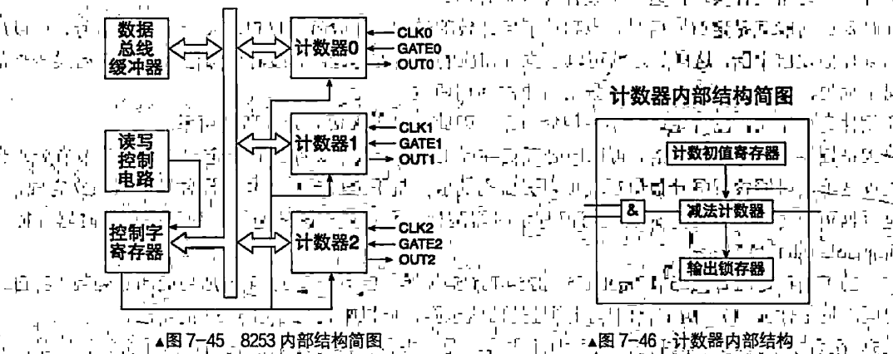
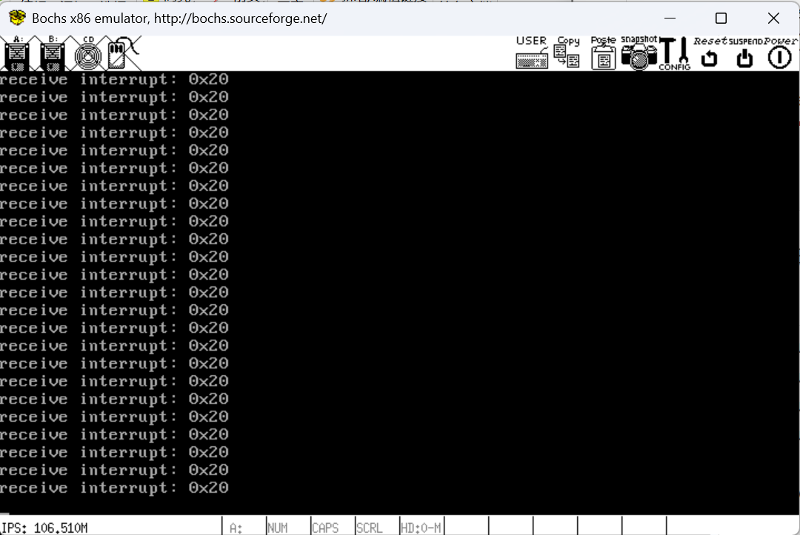

# 进一步完成中断子系统

## 所以，如何查看我们的IDT呢

​	查看很简单，Bochs提供了一个查看IDT表的功能

```
<bochs:3> info idt
Interrupt Descriptor Table (base=0xc00040c0, limit=263):
IDT[0x00]=32-Bit Interrupt Gate target=0x0008:0xc0001870, DPL=0
...
IDT[0x20]=32-Bit Interrupt Gate target=0x0008:0xc0001b85, DPL=0
```

## 改进我们的中断处理hook

​	使用汇编完成这个事情属于是有点太抽象了。我们知道，可能还会有其他的Hook调用，如果使用汇编完成那是实在太有生活了。所以，我们尝试来将我们的汇编Hook最后转到我们的C语言上来，这样的话，我们就可以方便的完成我们的事情了

```asm
; Followings are the operetions the Interrupt enter
; behaviour done
%define DO_NOP      nop
%define PUSH_ZERO   push 0

; EOI command
%define EOI         0x20
%define SLAVE_PORT  0xa0
%define MASTER_PORT 0x20

%macro INTR_VECTOR 2
section .text
intr%1enrty:
    %2

    push ds
    push es
    push fs
    push gs
    pushad    

    ; write the 8259A
    mov al, EOI
    out SLAVE_PORT, al
    out MASTER_PORT,al

    push %1              ; Regardless of whether the target function in idt_table needs parameters, always push the interrupt vector number for debugging convenience.
    call [internal_exception_callback + %1 * 4]  ; Call the C version interrupt handler function in idt_table.
    jmp intr_exit

section .data
    dd  intr%1enrty
%endmacro

...
section .text
global intr_exit
intr_exit:	     
; Restore the context environment below.
    add esp, 4              ; Skip the interrupt number.
    popad
    pop gs
    pop fs
    pop es
    pop ds
    add esp, 4              ; Skip DO_NOP.
    iretd
```

​	修订一下我们的宏，这一次，我们取消了字符的打印，我们把这个事情移出来干到C语言的层次，而且，提供更多的信息给系统编程人员完成参考，我们需要做的，无非就是在C语言层次上注册一个C语言的callback，然后再汇编层进行一个调用，将后请求转发出去。这里，笔者设定了我们的C语言Level的函数数组列表为internal_exception_callback

```
// Exception names array, describing each interrupt type
static const char *INTERRUPT_NAME[] = {
    "#DE Divide Error",
    "#DB Debug Exception",
    "#NMI Interrupt",
    "#BP Breakpoint Exception",
    "#OF Overflow Exception",
    "#BR BOUND Range Exceeded Exception",
    "#UD Invalid Opcode Exception",
    "#NM Device Not Available Exception",
    "#DF Double Fault Exception",
    "Coprocessor Segment Overrun",
    "#TS Invalid TSS Exception",
    "#NP Segment Not Present",
    "#SS Stack Fault Exception",
    "#GP General Protection Exception",
    "#PF Page-Fault Exception",
    "#Intel Reserved Exceptions",
    "#MF x87 FPU Floating-Point Error",
    "#AC Alignment Check Exception",
    "#MC Machine-Check Exception",
    "#XF SIMD Floating-Point Exception"};

// dynamics contains size
static char *interrpt_name[IDT_DESC_CNT];
// internal intr functors
intr_functor internal_exception_callback[IDT_DESC_CNT];
```

​	这些就穿起来了。

```c
// Function to set up a default callback for exception interrupts
static void __def_exception_callback(uint8_t nvec)
{
    if(nvec == 0x27 || nvec == 0x2f) {  // Ignore certain interrupts
        return;
    }
    ccos_puts("receive interrupt: 0x");  // Print received interrupt
    __ccos_display_int(nvec);  // Display interrupt vector
    __ccos_putchar('\n');  // Print a newline
}

// Initialize the exceptions and set default callback functions
static void init_exceptions(void)
{
    uint16_t i = 0;
    for(i = 0; i < ARRAY_SIZE(INTERRUPT_NAME); i++){
        internal_exception_callback[i] = __def_exception_callback;  // Set default callback
        interrpt_name[i] = (char*)INTERRUPT_NAME[i];  // Set the exception name
    }

    // For undefined interrupts, set to a generic "Unknown Exception"
    for(i = ARRAY_SIZE(INTERRUPT_NAME); i < IDT_DESC_CNT; i++){
        internal_exception_callback[i] = __def_exception_callback;  // Set default callback
        interrpt_name[i] = "#Unknown Exception";  // Set unknown exception name
    }
}
```

## 对8253编程，提升系统的频率

### 导论

​	我们下一步，来对8253这个著名的定时器进行编程。

​	我们知道，从计算机的底层触发，整个计算机系统实际上是按照一个节拍在运行。换而言之，一个定时器产生的周期信号正在共同协调的约束我们系统按照一个节拍运行。这就是系统时钟。系统时钟就约束了我们一个封闭计算机系统核心板上的工作速度。整个速度，你可以类比到STM32的系统时钟上去。

​	还有一种办法，产生一个周期信号，我们专门使用一个定时器外设作为资源，输入到我们的8259A上作为一个中断源。我们整个应用层（也就是操作系统及其之上层次的系统节拍）就可以依赖于整个频率来作为一个尺度运行。

​	我们这里，就是采用8253A作为一个经典的定时器，来模拟我们的外部时钟信号源了。下面就是一个8253定时器的结构图。



​	先大体看下计数器的工作原理。我们关心的是右侧是三个输入引脚：

- CLK表示时钟输入信号，即计数器自己工作的节拍，也就是计数器自己的时钟频率。每当此引.脚收到一个时钟信号，减法计数器就将计数值减1。连接到此引脚的脉冲频率最高为10MHz，8253为2MHz。
- GATE表示门控输入信号，在某些工作方式下用于控制计数器是否可以开始计数，在不同工作方式下GATE的作用不同
- OUT表示计数器输出信号。当定时工作结束，也就是计数值为0时，根据计数器的工作方式，会在OUT引脚上输出相应的信号。此信号用来通知处理器或某个设备：定时完成。这样处理器或外部设备便可以执行相应的行为动作

​	计数开始之前的计数初值保存在计数初值寄存器中，计数器执行部件（减法计数器）将此初值载入后，计数器的CLK引脚每收到一个脉冲信号，计数器执行部件（减法计数器）便将计数值减1，同时将当前计.数值保存在输出锁存器中。当计数值减到0时，表示定时工作结束，此时将通过OUT引脚发出信号，此信号可以用来向处理器发出中断请求，也可以直接启动某个设备工作。

​	**计数初值寄存器用来保存计数器的初始值，它是16位宽度，我们对8253初始化时写入的计数初始值就保存在计数初值寄存器。**它的作用是为计数器执行部件准备初始计数值，之后的计数过程与它无关。当计数器选择了某种重复计数的工作方式后，比如工作方式2和工作方式3（后面介绍），还需要将此计数初值重新装载到计数器执行部件中。

​	**计数器执行部件是计数器中真正“计数”的部件，计数的工作是由计数器执行部件完成的，所以它才是真正实际的计数器。8283是个倒计时计数器，原因是计数器执行部件是个16位的减法计数器，它从初值寄存器中拿到起始值，载入到自己的寄存器后便开始递减计数。**注意，计数过程中不断变化的值称为当前计数值，它保存在执行部件自己的寄存器中，初值寄存器中的值不受影响。

​	输出锁存器也称为当前计数值锁存器，用于把当前减法计数器中的计数值保存下来，其目的就是为了让外界可以随时获取当前计数值。计数器中的计数值是不断变化的，处理器无法直接从计数器中获取当前计数值。原因是这样的：计数器的使命就是通过计数的方式实现定时功能，必须要求精准，所以绝不能为了获取计数值而计数器停止计数。为了获取任意时刻的计数值，8253只有将它送到输出锁存器，此锁存器起到暂存寄存器的作用。这样处理器便能够从输出锁存器中获取瞬间计数值。

​	下面我们来看看三个计时器不同的作用。

| 计算器名称 | 端口 | 用途                                                         |
| ---------- | ---- | ------------------------------------------------------------ |
| 计数器 0   | 0x40 | 在个人计算机中，计数器 0 专用于产生时钟信号。它采用工作方式 3，在此计数器写入时最大计数值 65536。 |
| 计数器 1   | 0x41 | 在个人计算机中，计数器 1 专用于 DRAM 的定时刷新控制。PC/XT 规定在 2ms 内进行 128 次刷新。PC/AT 规定在 4ms 内进行 256 次刷新。 |
| 计数器 2   | 0x42 | 在个人计算机中，计数器 2 专用于声卡输出不同音调的声音，原理是给扬声器输出不同频率的方波。 |

​	我们实际上就是关心定时器0的编程，不需要设置其他的定时器（用不上）

### 控制字说明

​	很显然，我们总是要对器件编程，就会喜欢关心它的外部特性，8253的端口是0x43端口，它的格式如下：

| SC1  | SC0  | RW1  | RW0  | M2   | M1   | M0   | BCD  |
| ---- | ---- | ---- | ---- | ---- | ---- | ---- | ---- |

SC的两个位上，则是选择我们的计数器：

> - `00` 选择计数器 0
> - `01` 选择计数器 1
> - `10` 选择计数器 2
> - `11` 未定义

BCD上则是选择数字的格式是二进制还是BCD格式

> - `0` - 二进制
> - `1` - BCD码
>

RW两个位约束了读写的办法

> - `00` 锁存数据
> - `01` 只读写低字节
> - `10` 只读写高字节
> - `11` 先读写低字节，后读写高字节

M的三个位约定了我们的方式

> - `000` 方式 0
> - `001` 方式 1
> - `X10` 方式 2
> - `X11` 方式 3
> - `100` 方式 4
> - `101` 方式 5

#### 说一下每个方式——概论

​	这里为了参考方便，先说下每一个计数干啥的

**方式 0：中断请求（Interrupt on Terminal Count, IRTC）**

- 在此模式下，计数器从给定的初始值开始倒计时，直到计数值达到零为止。当计数值达到零时，产生一个中断信号（IRQ）。这种模式常用于需要触发中断的定时器任务。

**方式 1：硬件单脉冲（Hardware Retriggerable One-Shot）**

- 在此模式下，计数器开始倒计时并生成一个脉冲信号，脉冲的宽度由计数器值决定。当脉冲结束时，计数器停止工作，并且必须通过重新加载初始值才能再次触发一个脉冲。这种方式常用于单次触发任务。

**方式 2：可编程定时器（Rate Generator）**

- 在此模式下，计数器不断重复倒计时并生成脉冲。每次计数到零时，会重新加载初始值并继续倒计时。这种方式用于产生频率稳定的脉冲输出，适合生成时钟信号或定期事件。

**方式 3：方波生成（Square Wave Generator）**

- 在此模式下，计数器每次倒计时完成后，会切换输出状态（高电平和低电平交替），生成一个方波信号。方波的频率由计数器的初始值决定。此模式常用于产生精确的方波信号。

**方式 4：软件触发（Software Triggered Strobe）**

- 在此模式下，计数器从初始值开始倒计时，当计数器计数到零时，输出一个脉冲信号并停止倒计时。此模式通常用于需要由软件触发的精确脉冲。

**方式 5：硬件触发脉冲（Hardware Triggered Strobe）**

- 在此模式下，计数器开始倒计时并生成一个脉冲信号。每当计数器计数到零时，脉冲会重复生成。这种方式适用于需要硬件触发且脉冲频率固定的场合。

### 说一说计数器如何进行计时

​	计数器开始计数要满足两个条件：

- GATE为高电平，即GATE为1，这是由硬件来控制的。
- 计数初值已写入计数器中的减法计数器，这是由软件out指令控制的。当这两个条件具备后，计数器将在下一个时钟信号CLK的下降沿开始计数。

​	对于任意一个条件没有完成，我们分成了两种启动方式

- 软件启动：软件启动是指上面硬件负责的条件1已经完成，也就是GATE已经为1，目前只差软件来完成条件2，即尚未写入计数初值，只要软件负责的条件准备好，计数器就开始启动。当处理器用out指令往计数器写入计数初值，减法器将此初值加载后，计数器便开始计数。工作方式0、2、3、4都是用软件启动计数过程。
- 硬件启动：硬件启动是指上面软件负责的条件2已经完成，即计数初值已写入计数器。目前只差硬件来完成条件1了，也就是门控信号GATE目前还是低电平，即目前GATE=0，只要硬件负责的条件准备好，计数器就开始启动。GATE引脚是由外部信号来控制的，只有当GATE由0变1的上升沿出现时，计数器才开始启动计数。工作方式1、5都是用硬件启动计数过程。

​	对于8253，停止方式又分成这些：

- 强制终止：有些工作方式中，计数器是重复计数的，当计时到期（计数值为0）后，减法计数器又会重新把计数初值寄存器中的值重新载入，继续下一轮计数，比如工作方式2和工作方式3都是采用此方式计数，此方式常见于需要周期性发信号的场合。对于采用此类循环计数工作方式的计数器，只能通过外加控制信号来将其计数过程终止，办法是破坏启动计数的条件：将GATE置为0即可。
- 自动终止：有些工作方式中，计数器是单次计数，只要定时（计数）一到期就停止，不再进行下一轮计数，所以计数过程自然就自动终止了。比如工作方式0、1、4、5都是单次计数，完成后自动终止。如果想在计数过程中将其终止怎么做呢？还是用那个简单粗暴可依赖的方法，将GATE置0。

#### 方式0

方式0也称为“计数结束输出正跳变信号”方式，其典型应用是作为事件计数器。

在方式0时，对8253任意计数器通道写入控制字，都会使该计数器通道的OUT变为低电平，直到计数值为0。当GATE为高电平（条件1），并且计数初值已经被写入计数器（条件2）后，注意，此时计数器并未开始计数，大伙儿知道，计数器有自己的工作节奏，就是时钟信号CLK。计数工作会在下一个时钟信号的下降沿开始。方式0下的计数工作由软件启动，故当处理器用out指令将计数初值写入计数器，然后到计数器开始减1，这之间有一个时钟脉冲的延迟。之后，CLK引脚每次收到一个脉冲信号，减法计数器就会将计数值减1。

当计数值递减为0时，OUT引脚由低电平变为高电平，这是个由低到高的正跳变信号，此信号可以接在中断代理芯片8259A的中断引脚IR0上，所以此信号可以用来向处理器发出中断，故称为计数结束“中断”方式。

方式0进行计数时，计数器只是单次计数，计数为0时，并不会再将计数初值寄存器中的值重新载入。此方式中，门控信号GATE用于允许或禁止计数，当GATE=1时允许计数，GATE=0时则禁止计数。

#### 方式1

方式1的典型应用是作为可编程单稳态触发器，其触发信号是GATE，这是由硬件来控制的，故此方式称为硬件可重触发单稳方式。

在方式1下，由处理器将计数初值写入计数器后，OUT引脚变为高电平。不过，无论此时GATE是高电平，还是低电平，计数器都不会启动计数，而是等待外部门控脉冲信号GATE由低到高的上升沿出现，这是由硬件启动的，之后才会在下一个时钟信号CLK的下降沿开始启动计数，同时会将OUT引脚变为低电平。此后，每当CLK引脚收到一个时钟脉冲信号时，在其下降沿，减法计数器便开始对计数值减1。OUT引脚的低电平状态一直保持到计数为0，当计数为0时，OUT引脚产生由低到高的正跳变信号。

#### 方式2

方式2是比率发生器方式，即按照比率来分频，其典型应用就是分频器，故也称为分频器方式。在我们的应用中，也将选用此方式作为计数器的工作方式，以改变时钟中断的频率。
当处理器把控制字写入到计数器后，OUT端变为高电平。在GATE为高电平的前提下，处理器将计数初值写入后，在下一个CLK时钟脉冲的下降沿，计数器开始启动计数，这属于软件启动。当计数值为1时，OUT端由高电平变为低电平，此低电平的状态一直到计数为0，也就是持续一个CLK周期。当计数为0时，OUT端又变为高电平，同时，计数初值又会被载入减法计数器，重新开始下一轮计数，从此周而复始地循环计数。
此方式的特点是计数器计数到达后，自动重新载入计数初值，不需要重新写入控制字或计数初值便能连续工作。当计数初值为N时，每N个CLK时钟脉冲，就会在OUT端产生一个输出信号，这样一来，输入信号CLK和输出信号OUT的关系是N:1，其作用就是个分频器。

#### 方式3

计数器在方式3下工作，就相当于一个方波发生器，当处理器把控制字写入到计数器后，OUT端输出高电平。在GATE为高电平的前提下，在处理器把计数初值写入计数器后的下一个CLK时钟脉冲的下降沿，计数器开始计数。
如果计数初值为偶数，在每一个CLK时钟脉冲发生时，计数值均减2，当计数值为0时，OUT端由高电平变为低电平，并且自动重新载入计数初值，开始下一轮计数。在新的一轮计数中，当计数值再次为0时，OUT端又会变成高电平，同时再次载入计数初值，又开始一轮新的计数。
如果计数初值为奇数，并且OUT端为高电平，则在第一个时钟脉冲的下降沿将计数减1，这样剩下的计数值便为偶数了，所以在之后的每个时钟脉冲，计数值都被减2。当计数值变为0时，OUT端又变成低电平，同时自动从计数初值寄存器中载入计数初值开始下一轮计数。注意，在新一轮计数中，第一个时钟脉冲会将计数值减3，这样剩下的计数值也为偶数，之后的每个时钟脉冲都会将计数值减2。当计数值又减为0时，OUT端又重新回到高电平，同时自动从计数初值寄存器中载入计数初值，开始又一轮循环计数。
方式3和方式2类似，都是软件启动，并且OUT端都是周期性脉冲，用在循环计数的场合。

#### 方式4

当处理器把控制字写入到计数器后，OUT端变成高电平。在GATE为高电平的前提下，在处理器把计数初值写入计数器后的下一个CLK时钟脉冲的下降沿，计数器开始计数，所以是软件启动。
当计数值为1时，OUT端由高电平变为低电平，当计数值为0，即持续一个CLK时钟周期后，OUT端又回到高电平，此时计数器停止计数。此方式和方式0类似，都是单次计数，只有在重新写入控制字或重新写入计数初值时才会重新开启计数。

#### 方式5

此方式与方式4类似，都是一次计数，区别是计数启动的方式不同，方式5是硬件启动。我们需要把初值写入到我们的计数器后，方才开始工作。

### 回到问题，我们如何设置单次触发冲断的时隔呢？

​	利用了分频器的原理，将高频的输入脉冲信号CLK转换为低频的输出信号OUT，此信号就是时钟中断信号。这与计数器的工作方式有关。并不是所有的模式都可以产生周期的中断 

​	CLK引脚上的时钟脉冲信号是计数器的工作频率节拍，三个计数器的工作频率均是1.19318MHz，即一秒内会有1193180次脉冲信号。每发生一次时钟脉冲信号，计数器就会将计数值减1，也就是1秒内会将计数值减1193180次1。当计数值递减为0时，计数器就会通过OUT引脚发出一个输出信号，此输出信号用于向处理器发出时钟中断信号。一秒内会发出多少个输出信号，取决于计数值变成0的速度，也就是取决于计数初始值是多少。默认情况下计数器0的初值寄存器值是0，即表示65536。计数值从65536变成0需要修改65536次，所以，一秒内发输出信号的次数为1193180/65536，约等于18.206，即一秒内发的输出信号次数为18.206次，时钟中断信号的频率为18.206Hz。1000毫秒/（1193180/65536）约等于54.925，这样相当于每隔55毫秒就发一次中断。所以，提升我们的时钟，就是要准备重定向我们的初值。

## 对8253进行编程

​	开始！

```
#ifndef TIMER_SETTINGS_H
#define TIMER_SETTINGS_H

#define IRQ0_FREQUENCY	    (100)
#define INPUT_FREQUENCY	    (1193180)
#define COUNTER0_VALUE	    INPUT_FREQUENCY / IRQ0_FREQUENCY
#define CONTRER0_PORT	    (0x40)
#define COUNTER0_NO	        (0)
#define COUNTER_MODE	    (2)
#define READ_WRITE_LATCH    (3)
#define PIT_CONTROL_PORT    (0x43)
#define MILISEC_PER_INT     (1000 / IRQ0_FREQUENCY)

#endif
```

```c
#include "include/device/timer.h"          // Include the header for timer-related definitions
#include "include/device/timer_settings.h" // Include the header for timer settings
#include "include/library/ccos_print.h"    // Include the header for printing functions
#include "include/io/io.h"                 // Include the header for I/O functions

uint32_t ticks; // 'ticks' variable registers the time passed since system start

/**
 * frequency_set function configures a counter in the PIT (Programmable Interval Timer)
 * @param counter_port The port of the counter to configure
 * @param counter_no The counter number (0, 1, or 2)
 * @param rwl The read/write latch mode (0 for write, 1 for read latch)
 * @param counter_mode The mode of the counter (e.g., 0 for interrupt on terminal count)
 * @param counter_value The value to load into the counter (16-bit value)
 */
static void frequency_set(
    uint8_t counter_port, uint8_t counter_no,
    uint8_t rwl, uint8_t counter_mode, uint16_t counter_value)
{
    // Send the control word to configure the counter
    // The control word consists of:
    // - counter_no: 2 bits for the counter number (shifted to bits 6 and 7)
    // - rwl: 1 bit for read/write latch (shifted to bit 4)
    // - counter_mode: 3 bits for the counter mode (shifted to bits 1, 2, and 3)
    // The control word is sent to the PIT control port
    outb(PIT_CONTROL_PORT, (uint8_t)(counter_no << 6 | rwl << 4 | counter_mode << 1));

    // Write the lower 8 bits of the counter value to the counter port
    outb(counter_port, (uint8_t)counter_value);

    // Write the upper 8 bits of the counter value to the counter port
    outb(counter_port, (uint8_t)(counter_value >> 8));
}

/**
 * init_system_timer initializes the system timer (PIT8253)
 * This function sets up the timer and configures counter 0 with the appropriate settings.
 */
void init_system_timer(void)
{
    // Print message indicating the timer is being initialized
    ccos_puts("   timer is initing...\n");

    // Configure the timer's counter 0 with appropriate settings
    // The function frequency_set will configure the counter 0 port, set the mode,
    // and initialize it with the value defined in COUNTER0_VALUE.
    frequency_set(CONTRER0_PORT, COUNTER0_NO, READ_WRITE_LATCH, COUNTER_MODE, COUNTER0_VALUE);

    // Print message indicating the timer has been successfully initialized
    ccos_puts("   timer is initing! done!\n");
}

```

​	实际上就是简单的重定向我们的时钟初值，然后我们将我们的时钟初始化放到我们的初始化函数中

```c
#include "include/kernel/interrupt.h"
#include "include/library/ccos_print.h"
#include "include/device/timer.h"
#include "include/kernel/init.h"

void init_all(void)
{
    ccos_set_console_cursor(5, 0);
    ccos_puts("Initializing the system...\n");
    init_idt();
    init_system_timer();
    ccos_puts("Initializing the system done!\n");
}
```

## 上电看现象



​	完事！

## 代码

[代码](./5.4_Implement_InterruptSubSystem_2)

## 下一篇

[构建一个内存操作库](../6_Setup_Our_Kernel_Library/6.1_start_from_string_h.md)