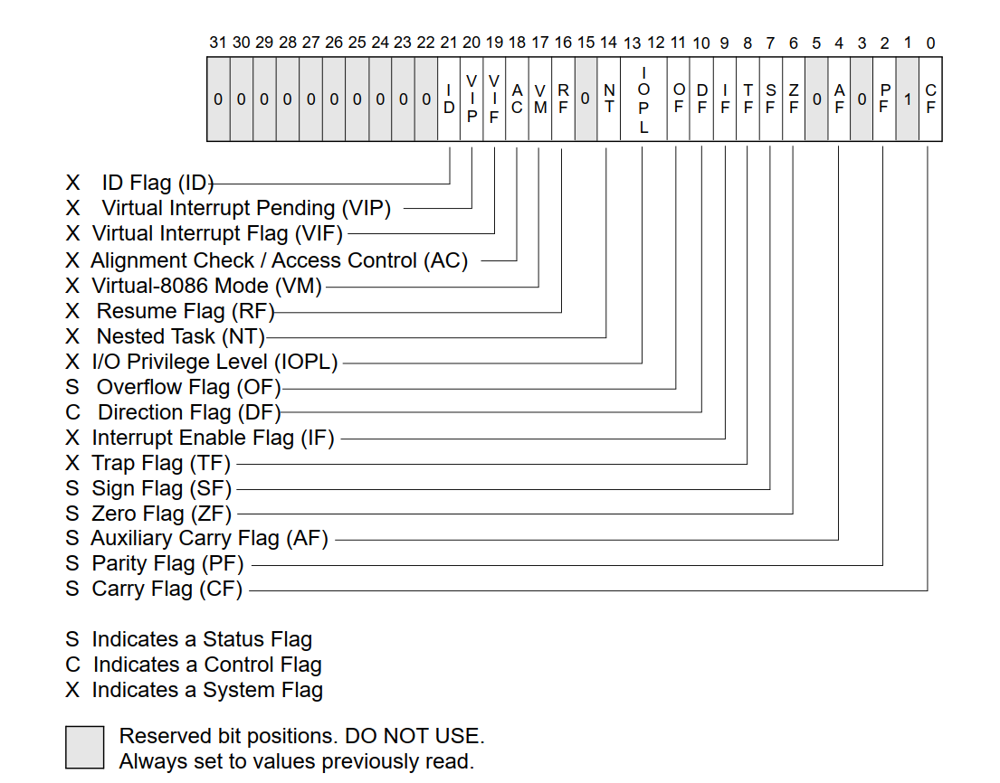
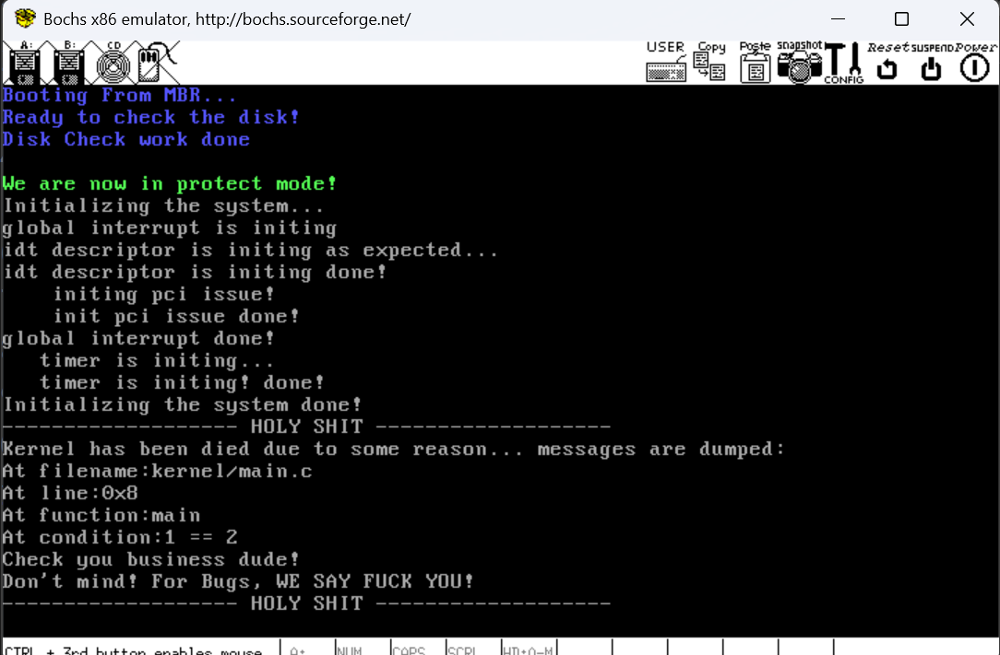

# 构建属于我们自己的内核库1——实现kernel的string.h

​	很快，我们就要一步一步完成其他的内核子系统了。本来，笔者计划是直接进入我们的内存子系统，但是笔者回忆自己的手搓教程，非常悲伤的发现，我们实现其他子系统之前，必须提供一个kernel level的通用库（你可能很快就会着急的反驳我：为什么？不能使用我们的GLibc内建的库函数嘛？哈哈，不着急我会回答的）。本章，我们会着手构建四个重要的库。

1. 实现自己的ASSERT，从而给内核实现我们自己的提前检查。
2. string.h作为内存和字符串中重要的操作库。
3. bitmap.h来实现一个内核层次的位图。
4. list.h来实现一个跟Linux内核同款的非嵌入式的通用链表。

​	之后，笔者还会介绍测试的概念，保证我们的库的质量是可以保证的。

​	前两个，我们在构建内存池子系统的时候会用到。链表是我们构建进程子系统的时候会用到。所以笔者建议的是——即使本章节跟我们的操作系统可以说并没有太多紧密的关系，但是笔者仍然认为，懂得如何实现一个数据结构来服务我们的内核，是非常重要的！

## 回答开头的问题：为什么要自己手搓库

​	很好！那我问你，我们的glibc是“干净的”嘛？我们知道，我们使用的编译器，一般使用的是默认内建的，运行在用户态上的程序而不是内核态上的程序。所以，你会发现很多我们熟悉的memcpy，strcpy等函数，是依赖于用户层的接口的，底层的ABI是我们的操作系统提供的。比如说分配内存策略是采用的人家OS的调用，而不是我们自己的。所以你一旦试图使用用户态的glibc提供的编译器内建函数，他们就会去找更底层的操作系统调用，我们甚至还没实现呢！依赖的malloc，printf需要内核提供的功能甚至还是空白，完全没办法使用于我们的内核。Linux自身就在lib文件夹下实现了自己的一个内核子库。调用时候完全不使用也不能使用GCC的自建库。

## 所以，让我们从一切的根本：ASSERT开始吧

​	我们在这场旅途的终点，实现两种assert，内核态的ASSERT和用户态的assert。不着急，用户态的程序对于现在的我们而言遥远到发指。所以，让我们专心的处理我们内核的ASSERT。

​	assert是断言的意思，主要用于在程序运行时检查某个条件是否成立。如果条件不满足，程序会终止并打印错误信息。我们的gcc就提供了用户态的assert。

```c
#include <assert.h>
#include <stdio.h>
int main()
{
    printf("Welcomes assert demo!\n");
    int x = 5;
    printf("x is %d\nwe will assert that x > 0, which will be pass!\n", x);
    assert(x > 0);
    printf("ok, and then it will failed as we assert x is <= 0!\n");
    assert(x <= 0);
}
```

​	测试一下这个，笔者也提供了准备好的文件：请看文件：[assert的一个使用办法体验](./6.1_section_assert_demo_code)。

### 进一步改进我们的中断子系统的接口

​	是的，这一个小节是为数不多跟操作系统相关的内容，我们知道，当我们触发了ASSERT断言的否定（也就是不满足ASSERT的条件的时候），一个系统实际上就是要挂了，不应该再走下去，否则肯定会出错。举个例子，我们要访问一个位图的下标是负数，显然不符合我们的语义。肯定是我们编写程序的时候参数传递错误了。这个时候，咱们的assert就应该要发力，阻止我们一错再错，不然只给出一个内存溢出的错误谁知道发生了啥。

​	所以，一个断言被触发的时候，必须要屏蔽我们的中断，不要让之后其他哪一个子系统打印的玩意把我们的ASSERT的内容冲碎掉。所以，我们需要关掉中断。当然，如果只是这样，我不会在这里单列一个标题不是吗。

​	实际上，我们需要给外部提供一个更加语义明确的get和set接口来设置或者是获取中断子系统的状态。所以，我们还是需要老老实实的进一步规范我们的接口。

​	我们设置的get接口，实际上就是获取我们的EFLAGS寄存器的状态，笔者决定给出这个图，之前给过，但是您就不必劳费心思去翻手册了。



​	显然，我们要萃取的是EFLAGS的第九位的值。

```c
/*
EFLAGS (Status Flags Register) structure:

31      22 21 20 19 18 17 16 15 14 13 12 11 10  9  8
-------------------------------------------------------
| Reserved | IOPL | NT | DF | OF | I | T | S | Z |  A | P | C | Reserved |
-------------------------------------------------------

EFLAGS_IF (0x00000200) corresponds to the Interrupt Flag (IF), which is the 9th bit in EFLAGS.
When IF is set (1), interrupts are enabled. If it is cleared (0), interrupts are disabled.
This value is used to manipulate the interrupt enable/disable state by directly modifying the IF flag.
*/

#define EFLAGS_IF (0x00000200)

/* 
 GET_EFLAGS(EFLAG_VAR) is a macro used to retrieve the current value of the EFLAGS register and store it in the variable EFLAG_VAR.

 Breakdown of the assembly code:
 
 1. `pushfl` - This instruction pushes the current value of the EFLAGS register onto the stack.
 2. `popl %0` - This instruction pops the top value from the stack (which is the value of EFLAGS) into the specified variable (EFLAG_VAR in this case).

 The macro uses the `volatile` keyword to prevent the compiler from optimizing this code away, ensuring that the assembly code is executed as intended.

 Result: After calling this macro, the EFLAGS register's value will be stored in EFLAG_VAR.
*/

#define GET_EFLAGS(EFLAG_VAR) asm volatile(" \
    pushfl; \
    popl %0" : "=g" (EFLAG_VAR))
```

​	GET_EFLAGS宏是实现我们的取值的关键。注意到，pushfl是将我们的EFLAGS寄存器的值压栈，然后弹出到我们的变量当中，这里EFLAG_VAR就承接了这个值。我们稍后，与上EFLAGS_IF萃取第九位的结果，是1说明IF为1，中断开启，反之中断关闭。

```c
Interrupt_Status get_intr_status(void)
{
    uint32_t eflags = 0; // Declare a variable to store the value of the EFLAGS register.
    GET_EFLAGS(eflags);  // Use the macro GET_EFLAGS to retrieve the current EFLAGS value into eflags variable.

    // Check the Interrupt Flag (IF) bit in EFLAGS.
    // If the IF bit is set (EFLAGS_IF is non-zero), interrupts are enabled (INTR_ON).
    // If the IF bit is cleared, interrupts are disabled (INTR_OFF).
    return (EFLAGS_IF & eflags) ? INTR_ON : INTR_OFF;
}
```

​	很简单吧。我们看设置咋搞。我们取消上一次我们暴露的cli和sti接口，因为实在是太裸了，封装一个更好，尽管笔者的设置实际上违反了单一职责，但是笔者实在疲惫于设计一个重复的`set_intr_status_with_old_status_return`的接口，显得太呆板了，所以就无所谓了。

```c
Interrupt_Status set_intr_status(const Interrupt_Status status)
{
    // Retrieve the current interrupt status before making any changes.
    Interrupt_Status old_status = get_intr_status();

    // Based on the desired status (INTR_ON or INTR_OFF), adjust the interrupt state.
    switch (status)
    {
    case INTR_OFF: // If we want to turn off the interrupts
        // If interrupts are currently enabled, disable them by executing the 'cli' instruction.
        if (old_status == INTR_ON)
        {
            cli(); // Disable interrupts by clearing the Interrupt Flag (IF) in EFLAGS.
        }
        break;
    case INTR_ON: // If we want to turn on the interrupts
        // If interrupts are currently disabled, enable them by executing the 'sti' instruction.
        if (old_status == INTR_OFF)
        {
            sti(); // Enable interrupts by setting the Interrupt Flag (IF) in EFLAGS.
        }
        break;
    }

    // Return the old interrupt status (before the change) to allow the caller to restore the state if needed.
    return old_status;
}
```

​	可以 将我们的`sti()`换成`set_intr_status(INTR_ON)`了！看看自己有没有发生啥问题就好了。

### 所以开始正式的实现一个KERNEL_ASSERT

​	所以我们开始实现我们自己的KERNEL_ASSERT了。显然，我们要告知我们的函数在哪个地方，哪个文件，哪个行号，什么条件上挂了，这样我们方便快速的查找问题。

```c
#include "include/kernel/interrupt.h"
#include "include/library/ccos_print.h"
#include "include/library/kernel_assert.h"

/*
 * kernel_panic_spin function is used to handle kernel panic scenarios, where
 * the kernel encounters a critical error that requires immediate attention.
 * This function will print detailed information about the panic and enter an
 * infinite loop to prevent further execution, essentially halting the kernel.
 *
 * Parameters:
 * - filename: The name of the source file where the panic occurred.
 * - line: The line number where the panic was triggered.
 * - func_name: The name of the function where the panic occurred.
 * - condition: The condition that caused the panic (usually a failed assertion).
 */
void kernel_panic_spin(char *filename, int line,
                       const char *func_name,
                       const char *condition)
{
    // Disable interrupts to prevent further interruptions during panic handling.
    set_intr_status(INTR_OFF);

    // Print a message indicating a panic has occurred.
    ccos_puts("------------------- HOLY SHIT -------------------\n");
    ccos_puts("Kernel has been died due to some reason... messages are dumped:\n");

    // Print the filename where the panic happened.
    ccos_puts("At filename:");
    ccos_puts(filename);
    ccos_puts("\n");

    // Print the line number where the panic happened.
    ccos_puts("At line:0x");
    __ccos_display_int(line); // Display the line number in hexadecimal format.
    ccos_puts("\n");

    // Print the function name where the panic happened.
    ccos_puts("At function:");
    ccos_puts((char *)func_name);
    ccos_puts("\n");

    // Print the condition that caused the panic (e.g., failed assertion).
    ccos_puts("At condition:");
    ccos_puts((char *)condition);
    ccos_puts("\n");

    // Print a message encouraging the user to check the issue and not to worry.
    ccos_puts("Check you business dude!\n");
    ccos_puts("Don't mind! For Bugs, WE SAY FUCK YOU!\n");

    // Print another line to mark the end of the panic message.
    ccos_puts("------------------- HOLY SHIT -------------------\n");

    // Enter an infinite loop to halt further kernel execution.
    // This is where the kernel stays in a "panic" state indefinitely.
    while (1)
        ;
}
```

​	我相信这是真的很简单。关中断也很好理解——系统要挂了，不可以让其他部分干扰我们的实现。关键在于，难道这些信息要我们自己填写嘛？非也。gcc也！

```c
#ifndef KERNEL_ASSERT_H
#define KERNEL_ASSERT_H

/*
    user should never call this directly as it is auto implemented
    by gcc!
*/
void kernel_panic_spin(char *filename, int line, const char *func_name, const char *condition);

// kernel panic spin macro
#define KERNEL_PANIC_SPIN(...) kernel_panic_spin(__FILE__, __LINE__, __func__, __VA_ARGS__)

#ifdef RELEASE_MODE
#define KERNEL_ASSERT(COND) ((void)0)
#else
#define KERNEL_ASSERT(COND)                               \
    if ((COND))                                           \
    {                                                     \
        /* do anything here for all assertions success */ \
    }                                                     \
    else                                                  \
    {                                                     \
        KERNEL_PANIC_SPIN(#COND);                         \
    }
#endif

#endif
```

​	首先先看`KERNEL_PANIC_SPIN`，玩过可变参数的朋友都知道，...表达的就是可变参数的意思。当然，你可以直接使用一个const char*传递，但是鼻子和认为，后续如果我们还填写其他信息，直接可以不改动调用接口了。

```
kernel_panic_spin(__FILE__, __LINE__, __func__, __VA_ARGS__)
```

​	是依次使用了gcc的内置宏，编译器看到这些宏就会辅助填写文件，行号，函数名称和可变参数的部分，这里就是我们的触发条件。我们测试一下，写的对不对哈。

```c
#include "include/library/ccos_print.h"
#include "include/kernel/init.h"
#include "include/library/kernel_assert.h"
#include "include/kernel/interrupt.h"
int main(void)
{
    init_all();
    KERNEL_ASSERT(1 == 2);
    while(1);
    return 0;
}
```



​	嗯，没问题。

## 将我们的ASSERT部署到我们的中断测试子系统上

### 为什么要测试？

​	首先测试啥？显然是我们的功能函数。我们对函数功能进行测试，是为了确保它们在各种情况下都能正确地工作。即使我们编写的代码逻辑看起来没有问题，实际运行时也可能会遇到意外的错误或未考虑到的边界情况。

​	通过对函数进行全面的测试，我们可以确认每个功能都按预期执行，并且能处理不同的输入和异常情况。测试不仅可以帮助我们发现潜在的漏洞或问题，还能在代码更改或扩展时提供保障，确保修改不会破坏已有功能。

​	而且，至少我们的测试可以将一些早期的问题工程化而不是拖到后面，在一个地方炸锅，最后导致一片狼藉！也就是永远要把问题扼杀在早期！

### 所以，我们如何设计测试呢？

​	**设计测试的过程需要根据程序的功能和需求来制定相应的测试策略**。人话就是——你先知道你这些函数干了啥。我们都知道，函数封装了一个子过程。提供一个输入吐出一个输出。所以，设计测试的时候，装作自己是一个外宾。你给啥样的输入，不管里面咋实现的，你就看输出符不符合你的预期！

​	那我们的预期如何度量呢？我们要理解我们测试对象的输入、输出、边界条件以及可能的异常情况。

​	常见的测试需要涵盖常规输入、边界输入和错误输入等各种情形。

- 常规输入是指正常情况下的测试数据。
- 边界输入则包括最大值、最小值或者空值等极限情况。
- 错误输入则用于模拟无效的参数，看看程序能否正确处理这些错误。
- 每个测试用例应该包括输入数据、预期输出和验证方式，以确保测试结果可以被清晰地判断。

​	当然，对于协议性质的测试，我们需要注意的是——只需要关心我们的代码行为是不是满足了协议即可。

### 小试身手：测试我们的IDT成员是否符合Intel架构约束

```c
// Assert checks for the size and offsets of the members
// of GateDescriptor structure
static inline void make_idt_check(void)
{
    // Check the size of the structure. It should be exactly 8 bytes (16 bits * 4 + 8 bits * 1)
    KERNEL_ASSERT(sizeof(GateDescriptor) == 8);

    // Check the offsets of the structure members manually.

    // func_offset_low_word should be at offset 0
    KERNEL_ASSERT((char *)&((GateDescriptor *)0)->func_offset_low_word == (char *)0);

    // selector should be at offset 2 (2 bytes after func_offset_low_word)
    KERNEL_ASSERT((char *)&((GateDescriptor *)0)->selector == (char *)2);

    // dcount should be at offset 4
    KERNEL_ASSERT((char *)&((GateDescriptor *)0)->dcount == (char *)4);

    // attribute should be at offset 5
    KERNEL_ASSERT((char *)&((GateDescriptor *)0)->attribute == (char *)5);

    // func_offset_high_word should be at offset 6
    KERNEL_ASSERT((char *)&((GateDescriptor *)0)->func_offset_high_word == (char *)6);
}
```

​	嗯？啥意思啊？

```
KERNEL_ASSERT(sizeof(GateDescriptor) == 8);
```

​	很显然，这一句你知道，测试我们的IDT描述符是不是8个字节大小嘛！那下面呢？

```
KERNEL_ASSERT((char *)&((GateDescriptor *)0)->func_offset_low_word == (char *)0);
```

​	熟悉Linux的朋友极有可能一眼认出来这就是offsetof的实现，但是先不着急，我慢慢说：

- **`(GateDescriptor *)0`**：这里我们将 `0` 强制转换为 `GateDescriptor *` 类型，意味着我们在模拟一个 `GateDescriptor` 类型的指针，指向内存地址 0。这样做的目的是为了计算结构体成员在内存中的偏移量。**实际上，在 C 语言中，结构体成员的偏移量是相对于结构体起始地址的，因此通过指向 `0` 地址的指针可以有效计算出成员的偏移。**
- **`&((GateDescriptor *)0)->func_offset_low_word`**：这部分代码访问 `GateDescriptor` 结构体的 `func_offset_low_word` 成员。通过 `((GateDescriptor *)0)` 获取结构体指针，然后使用 `->` 操作符访问成员，最终通过 `&` 操作符获取 `func_offset_low_word` 成员的地址。因为我们使用的是指向地址 0 的指针，实际上获取的是 `func_offset_low_word` 在结构体中的偏移地址。
- **`(char *)0`**：我们将地址 `0` 强制转换为 `char *` 类型，这样做是为了让编译器将该值视为字节地址（1 字节），从而使得偏移量的计算精确到字节级别。
- **`KERNEL_ASSERT(...)`**：这部分用于验证偏移量是否符合预期。具体来说，它检查 `func_offset_low_word` 成员的偏移地址是否为 0。如果成员的偏移量不是 0，则表示该成员的位置发生了偏移，这可能是由于结构体对齐或填充造成的，显然这样会直接造成中断触发时的异常！

​	我们插入到idt_init中，当然，不会发生意外！当然，如果发生了意外，说明你跳过了上一篇博客来到了这里（笑）。

## 让我们开始手搓string.h吧！

​	这里，我们即将提供一套自己的string.h，里面提供了各式各样的，操作我们内存和字符串的方法。所以，让我们直接开始！