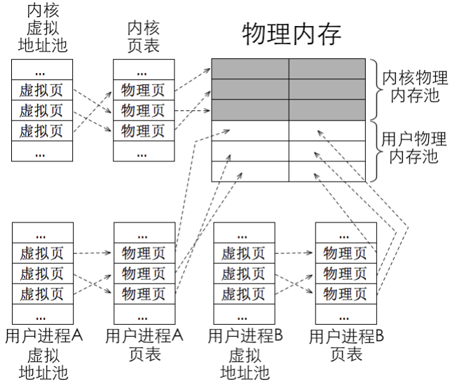
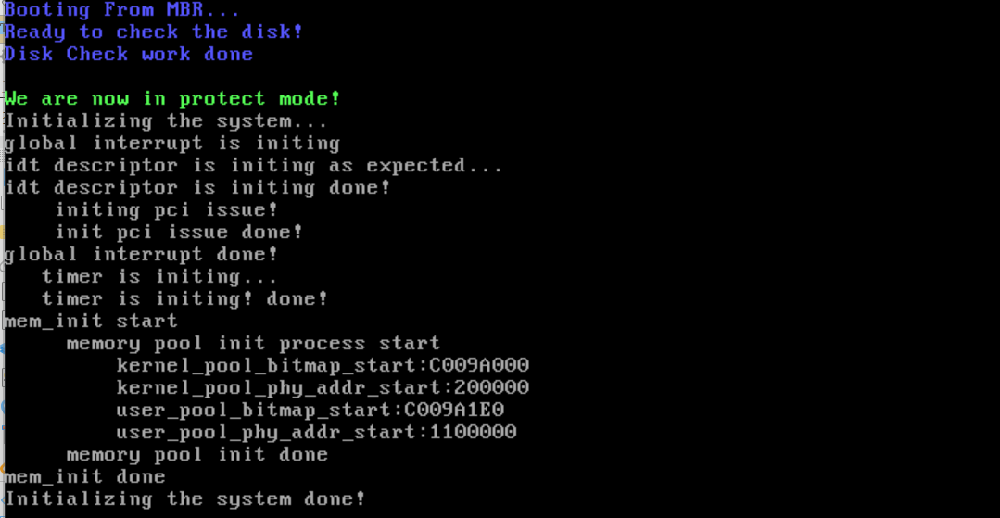

# 构建我们的内存管理——第一步：将我们先前获取的内存大小取出来

## 前言

​	现在我们终于回归了我们的话题，那就是进一步实现我们的操作系统。为此，我们需要做的就是构建一个内存管理子系统，现在我们只是起一个头。再完成后面的抽象中，我们每一个子系统会一步一步走向完善。

## 所以，我们的内存管理系统，其载体是什么

​	答案是内存池。显然，内核和用户进程肯定都要运行在物理内存之中。这是一句正确的废话。问题来了，哪些物理内存用来运行内核，哪些物理内存用来运行用户进程呢？我们无论是现在手上的内核，还是将来实现的用户进程，都是毫无疑问的准备要来请求内存的，我们咋薄记？

​	一种可行的方案是将物理内存划分成两部分，一部分只用来运行内核，另一部分只用来运行用户进程，将内存规划出不同的部分，专项专用。 **操作系统为了能够正常运行，不能用户进程申请多少内存就分配多少，必须得给自己预留出足够的内存才行，否则有可能会出现因为物理内存不足，导致内核自己都无法正常运行、自身难保的现象。**

​	所以，在划分上，我们就将全片物理内存分成两个部分：一部分称为用户物理内存池，此内存池中的物理内 
存只用来分配给用户进程。另一部分就是内核物理内存池，此内存池中的物理内存只给操作系统使用。 

​	在分配上，我们从内存池中获取内存资 源也得按单位大小来获取，这个单位大小是 4KB，称为页，故，内存池中管理 
的是一个个大小为 4KB 的内存块，从内存池中获取的内存大小至少为 4KB 或者为 4KB 的倍数。这样，我们实际上就是通过薄记哪一些内存被使用了，哪一些没有，实现对内存的管理。当然，我们后面还会实现更加精细的内存管理，但是那是基于本次工作的集成。所以我们还是脚踏实地的搞这个吧

​	为了方便实现，咱们把这两个内存池的大小设为一致，即各占一半的物理内存。我们构建两个物理内存池来维护我们的内存。当用户内存池中的内存都被用户进程耗尽时，不再向内核内存池申请，而是返回信息“内存不足”，拒绝请求。 虽说内核也是随意的想用就用，但是，我们最好还是实现薄记，这样方便告知我们此时操作系统的状态，方便我们的抽象。

​	我们在Loader时候就开启的分页。在分页机制下程序中的地址都是虚拟地址，虚拟地址的范围取决于地址总线的宽度，咱们是在32 位环境下，所以虚拟地址空间为4GB。除了地址空间比较大以外， 分页机制的另一个好处是每个任务都有自己的 4GB 虚拟地址空间，也就是各程序中的虚拟地址不会与其 他程序冲突，都可以为相同的虚拟地址，不仅用户进程是这样，内核也是。程序中的地址是由链接器在链 接过程中分配的，分配之后就不会再变了，运行时按部就班地送上处理器的 CS 和 EIP 即可。 所以显然，每一个进程都需要一个这样的虚拟页表，因为正如我所说的——每一个进程都有隶属于自己的4GB。

​	不管是内核还是用户态，实现这样的虚拟——物理内存分配的时候，都需要在页表中建立联系，这就跟第三章的页表建立起来了联系，忘记的朋友可以去看看。申请内存时，操作系统先从用户进程自己的虚拟 地址池中分配空闲虚拟地址，然后再从用户物理内存池（所有用户进程共享）中分配空闲的物理内存，然 后在该用户进程自己的页表将这两种地址建立好映射关系。 



​	这个就是我们的构建视图，行动起来！

## 开始我们的抽象事业

​	开始来活了！我们这一次就是要准备建立两个抽象——虚拟地址的Mappings维护，和物理地址内存池的维护。我们使用这样的一个抽象。你可以去查看本节的代码仓库得到我们的结论（include/memory/memory.h）

```c
// Define a structure to hold information about virtual address mappings
// The structure includes a bitmap to track the allocation of virtual addresses and the starting address for virtual memory
typedef struct
{
    Bitmap virtual_mem_bitmap; // A bitmap for tracking allocated and free virtual memory pages
    uint32_t vaddr_start;      // The starting address of the virtual memory region
} VirtualAddressMappings;
```

​	这个抽象并不费解。我们在搓位图的时候笔者就说过了，位图可以被等效成一个迷你内存薄记，这里，我们一个位用来薄记一个页（4KB大小），至于多大，咋算，是我们初始化的工作。

​	下面，我们来一一思考如何确定每一个变量

​	为了配置方便，我单开了一个配套的memroy_settings.h来存放我们的内存相关的settings。

```
// Define the base address of the memory bitmap, which is a data structure used for managing memory blocks
// The bitmap will be used to track memory allocations and deallocations
#define MEMORY_BITMAP_BASE      (0xc009a000)
```

​	我们的内核虚拟地址位图的位置是硬耦合的。当然这并不好，感兴趣的朋友可以自己做细致的抽象。这个值是笔者随了笔者参考的《操作系统真相还原》给出的地址，请看郑刚老师的分析：

> 这其实和进程PCB 或线程TCB（PCB 程序控制块，TCB 线程控制块）结构有一定关系。在实现进程子系统的时候，每一个PCB要占用一页内存。PCB 所占用的内存必须是自然页，自然页就是页的起始地址必须是0xXXXXX000，终止地址必须 是 0xXXXXXfff。也就是不能跨页占用，PCB 必须是完整、单独地占用一个物理页框。
>
> 一个PCB就标识了一个进程！在 PCB 的最低处 0xXXXXX000 以上存储的是进程或线程的信息，这包括 pid、进程状态等。PCB 的最高处0xXXXXXfff 以下用于进程或线程在0 特权级下所使用的栈。 因为压栈操作的原理是栈指针 esp 先自减，然后再往自减后的地址处存储数据，故，任何进程或线程 初始的栈顶便是此页框的最顶端+1，即下一个页框的起始处，也就是 0xXXXXXfff + 1。 程序都有个主线程，咱们的内核也是一样，这个主线程就是指正式进入内核时所运行的程序，其实就是main 线程。main线程就是我们当前的线程，只不过现在它还是裸奔的。在之后，我们就会在我们于Loader预留的部分直接就地初始化一个PCB：因此您肯定知道了将来主线程的 PCB 地址 是 0xc009e000，对，确实如此。


 	下面我们再看内存池的抽象，这个我们不能暴露到外面去，所以一个合理的办法还是在memory.c文件中留下抽象，在这里：

```c
// Physical Memory Pools definition
// The 'MemoryPool' structure represents a physical memory pool, managing the pool's bitmap,
// the starting address of the physical memory, and the pool's total size in bytes.
typedef struct __mem_pool
{
    Bitmap pool_bitmap;      // Bitmap used by this pool to track allocated and free memory pages
    uint32_t phy_addr_start; // The start address of the physical memory managed by this pool
    uint32_t pool_size;      // Total size of this memory pool in bytes
} MemoryPool;

// Declare the kernel and user memory pools, and the structure for virtual address mappings
MemoryPool kernel_pool, user_pool;   // Kernel and user memory pools
VirtualAddressMappings kernel_vaddr; // Virtual address mapping for kernel space
```

​	这个抽象也谈不上复杂。很简单，就是创建一个告知当前内存池维护的大小，维护是否可用状态，以及维护的物理起始地址在何处的MemoryPool结构体。

​	下一步，我们就是对我们构建的抽象进行重要的初始化的环节

```c
static void init_memory_pool(const uint32_t all_memory)
{
    verbose_ccputs("     memory pool init process start\n");

    // Calculate the size of a single page table in bytes (256 entries * 4 bytes each)
    const uint32_t PAGETABLE_SZ = PG_SIZE * 256;

    // Reserved memory for initial kernel setup (includes page table and low memory)
    const uint32_t used_memory = PAGETABLE_SZ + KERNEL_LOW_1M_MEM;

    // Calculate the free memory available for the pools (total memory - used memory)
    const uint32_t free_memory = all_memory - used_memory;

    // Calculate the number of free pages available
    const uint16_t all_free_pages = free_memory / PG_SIZE;

    // Split the available free memory between kernel and user spaces (50/50 split here)
    const uint16_t all_free_kernel_pages = all_free_pages / 2;
    const uint16_t all_free_user_pages = all_free_pages - all_free_kernel_pages;

    // Calculate the size of the bitmaps for the kernel and user memory pools
    const uint32_t kbm_length = all_free_kernel_pages / 8;
    const uint32_t ubm_length = all_free_user_pages / 8;

    // Set the starting physical address for the kernel and user memory pools
    const uint32_t kernel_pool_start = used_memory;
    const uint32_t user_pool_start = kernel_pool_start + all_free_kernel_pages * PG_SIZE;

    // Initialize the kernel pool's properties
    kernel_pool.pool_size = all_free_kernel_pages * PG_SIZE;   // Size in bytes
    kernel_pool.pool_bitmap.btmp_bytes_len = kbm_length;       // Bitmap size
    kernel_pool.pool_bitmap.bits = (void *)MEMORY_BITMAP_BASE; // Bitmap location in memory
    kernel_pool.phy_addr_start = kernel_pool_start;            // Starting physical address

    // Initialize the user pool's properties
    user_pool.pool_size = all_free_user_pages * PG_SIZE;                    // Size in bytes
    user_pool.pool_bitmap.bits = (void *)(MEMORY_BITMAP_BASE + kbm_length); // Bitmap location in memory
    user_pool.pool_bitmap.btmp_bytes_len = ubm_length;                      // Bitmap size
    user_pool.phy_addr_start = user_pool_start;                             // Starting physical address
    // Initialize the bitmaps for both kernel and user memory pools to 0 (free all memory pages)
    bitmap_init(&kernel_pool.pool_bitmap);
    bitmap_init(&user_pool.pool_bitmap);
```

​	这个参数传递进来的，就是我们维护的，薄记内存的地址部分，我们在搓Loader的时候就验证过了，这个地方是0xb00，所以，我们需要一个抽象：

```c
// Define a memory address where a pointer to the memory size record is stored
// This is used to track the total size of available memory in the system
// you should have seen this at previous bochs debug
// steps should be:
//  1. place the memory fetch using e820 method in an address anywhere you like
//  2. caculate the address offset, which will be used later like here
//  3. validate this by using bochs debug with xp <target addr>
//  4. thats the case, modify here.
#define MEMORY_SIZE_RECORD_PTR  (0xb00)

// Dereference the pointer stored at MEMORY_SIZE_RECORD_PTR to obtain the memory size in bytes
// MEMORY_SZ_DETECT is a 32-bit unsigned integer that will contain the total amount of available memory in the system
#define MEMORY_SZ_DETECT        (*(uint32_t *)(MEMORY_SIZE_RECORD_PTR))  // Fetch the memory size value stored at the given address
```

​	笔者在注释里提示了如果你是自由发挥放置的地址，请按照类似上面的方法完成排查。我们访问这个地址得到的内存就是我们准备进行规划的内存了。

​	PAGETABLE_SZ记录页目录表和页表占用的字节大小，总大小等于页目录 表大小+页表大小。页目录大小为1 页框，第0 和第768 个页目录项指向同一个页表，它们共享这1 页框空间，第 769～1022 个页目录项共指向 254 个页表，故页表总大小等于 256*PG_SIZE，共计 0x200000 字节， 2MB。注意，最后一个页目录项（第 1023 个 pde）指向页目录表，因此不重复计算空间。

​	按照有没有被使用，我们分别薄记了used_memory和free_memory。显然，笔者这里偷了大懒，省去了薄记低1MB内存的内容。下一步，将广阔的内存海洋划分成页，薄记每一个内存池需要管理的页有多少。这里我们显然是将我们的用户bitmap和内核bitmap一起薄记了，所以直接连续放置即可。

​	余下部分的初始化看注释吧！我说的应该很清楚了。

​	我们接下来就是初始化虚拟内存的维护映射

```c
    // Initialize the kernel's virtual address mappings bitmap and set the starting address
    kernel_vaddr.virtual_mem_bitmap.btmp_bytes_len = kbm_length;
    kernel_vaddr.virtual_mem_bitmap.bits = (void *)(MEMORY_BITMAP_BASE + kbm_length + ubm_length); // Start of virtual memory bitmap
    kernel_vaddr.vaddr_start = KERNEL_HEAP_V_START;                                                // Starting virtual address for kernel heap
    bitmap_init(&kernel_vaddr.virtual_mem_bitmap);                                                 // Initialize the virtual address mapping bitmap

```

​	这里是线性的映射，所以没啥说的，就是这样的easy。

## 初始化内存子系统部分

```
// Function to initialize memory management system
void memory_management_init(void)
{
    verbose_ccputs("mem_init start\n");

    // Fetch the total memory size from the system
    const uint32_t mem_bytes_total = MEMORY_SZ_DETECT;

    // Initialize memory pools based on the total available memory size
    init_memory_pool(mem_bytes_total);

    verbose_ccputs("mem_init done\n");
}
```

​	我们把之前设置的地址传递进去就好了。

### tips

​	笔者优化了一下，将init时的开中断放到了init.h中封装了一个函数。

```
void interrupt_enabled(void);
void interrupt_enabled(void)
{
    set_intr_status(INTR_ON);
}
```

​	这样做的目的是将我们的文件尽可能的收拢。

## 运行截图




## 下一篇

[完成初步搭建内存池框架](./7.2_Setup_PageFetch.md)

