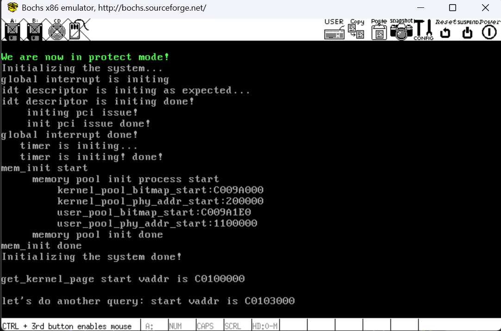

# 构建我们的内存管理——第二步：内存子系统进化，获取页！

​	下面，我们来讨论的是如何在内存子系统获取页这种粗粒度。换而言之，我们准备处理一个接口：`get_kernel_page(const int pg_cnt)`。处理我们的请求需要面对的是两个内存池。

```c
// Pool flags tells to allocate from which pool flags :)
typedef enum { 
    PF_KERNEL = 1,  // allocate from kernel
    PF_USER = 2     // allocate from user
} PoolFlag;
```

​	整个PoolFlag维护了我们准备面向请求的内存池。然后，我们把页表里面属性给抽象出来：

```c
/*
    Memory Page Property Settings
*/ 
// Define the existence flag for page table or page directory entry
// The PG_P bit is set to 1 if the entry is valid (exists), and 0 if it's invalid (does not exist)
#define PG_P_1   (1)     // Page table or page directory entry exists (valid)
#define PG_P_0   (0)     // Page table or page directory entry does not exist (invalid)

// Define the Read/Write (R/W) attribute flag values for page table or directory entries
// The R/W bit specifies the access rights: read/write or read/execute
#define PG_RW_R  (0)     // Read/execute only (no write permissions)
#define PG_RW_W  (2)     // Read/write/execute (write permissions enabled)

// Define the User/Supervisor (U/S) attribute flag values for page table or directory entries
// The U/S bit specifies whether the page is accessible in user mode or only in supervisor (kernel) mode
#define PG_US_S  (0)     // System-level access (supervisor/privileged mode only)
#define PG_US_U  (4)     // User-level access (accessible by user-mode programs)
```

- PG_P_1 表示 P 位的值为 1，表示此页内存已存在。 
- PG_P_0 表示 P 位的值为 0，表示此页内存不存在。 
- PG_RW_W 表示 RW 位的值为 W，即 RW=1，表示此页内存允许读、写、执行。 
- PG_RW_R 表示 RW 位的值为 R，即 RW=0，表示此页内存允许读、执行。 
- PG_US_S 表示US 位的值为 S，即US=0，表示只允许特权级别为 0、1、2 的程序访问此页内存，3 特权级程序不被允许。 
- PG_US_U 表示 US 位的值为 U，即 US=1，表示允许所有特权级别程序访问此页内存。 

## 讨论页表的分析和索引的完成

​	让我们回忆一下页表的部分，请参考笔者之前在搓Loader时候的：[](../3_Implement_A_Loader/3.3_setup_page_tables.md)

- 高10 位是页目录项pde 的索引，用于在页目录表中定位 pde，**细节是处理器获取高 10 位后自动将其乘以 4，再加上页目录表的物理地址**，这样便得到了 pde 索引对应的pde 所在的物理地址，然后自动在该物理地址中，即该 pde 中，获取保存的页表物理地址（也就是索引我们到PTE的物理地址） 
- 中间 10 位是页表项 pte 的索引，用于在页表中定位 pte。细节是处理器获取中间 **10 位后自动将其乘以 4，再加上第一步中得到的页表的物理地址，这样便得到了 pte 索引对应的 pte 所在的物理地址**， 然后自动在该物理地址（该 pte）中获取保存的普通物理页的物理地址。 
- 低 12 位是物理页内的偏移量，页大小是4KB，12 位可寻址的范围正好是4KB，因此处理器便直接把低12 位作为第二步中获取的物理页的偏移量，无需乘以4。用物理页的物理地址加上这低 12 位的和 便是这 32 位虚拟地址最终落向的物理地址。 

​	基于上面我们的讨论，我们的编程思路就很清晰了。现在，让我们从顶向下，一步一步完成我们的系统编程。

### 完成一个宽泛的页获取

​	所以，很容易想到，我们的需求是：**获取给定页数的内核页，其参数（输入）显然是一个描述个数的，获取一个返回这一串连续页的虚拟地址。**注意的是——我们的程序从头到尾都在操作虚拟内存，想要得到物理内存就必须操作页表自己完成转换。得到的地址就是一个线性偏移关系的物理地址，从而在实际上操作我们的物理地址。

```c
// Function to allocate a specified number of kernel pages and return their virtual addresses
void* get_kernel_pages(const uint32_t kpage_count) { 
    void* vaddr =  malloc_page(PF_KERNEL, kpage_count);  // Request kernel pages
    if (vaddr) {  // If successful, clear the allocated pages and return the address
        k_memset(vaddr, 0, kpage_count * PG_SIZE); 
    } 
    return vaddr;  // Return the virtual address of the allocated kernel pages
}
```

​	这个函数所完成的事情简直不需要我再多说什么。但是这里，我们有一个有意思的问题，这个可以暂时跳过，等您完成了这个博客的任务，再回来看这里

> ​	可以看到，我们返回一个虚拟地址之后，会习惯性的对我们返回的连续的虚拟地址进行清零操作。你可能会疑问：为什么呢？
>
> ​	答案是，任何一个操作系统作为底层的构件，就必须保证做最小满足客户需求的事情的基础上，尽可能的提升用户的使用体验性能。往往，我们再回收一个页面（不是再这个章节中完成），回直接解除映射，而不是先清零，再解除映射。毕竟——一些页我们可能永远不会在之后用到，一个合理的办法是——直到我们确认对query内存的使用所属权。这个时候，我们才会去做清空。
>
> ​	所以答案呼之欲出：我们之前实际上再解除映射的时候不会完成清空。这之前，可就会存在上一次使用这些内存的数据。这些数据如果被误用，可能导致程序行为异常或者错误的内存映射，这个时候程序的排查就会异常困难。这个事情，笔者建议你去完成一下MIT S6081的操作系统实验：
>
> [Lab: System calls](https://pdos.csail.mit.edu/6.S081/2024/labs/syscall.html)中的Attack xv6实验，理解一下如果我们不去使用页表清理的手段，我们的操作系统会如何被攻击。

### 从指定的内存池中分配若干页

```c
static bool accept_allocate_policy(const uint32_t pg_cnt)
{
    return 
        pg_cnt > 0 && 
        pg_cnt < (MAX_ACCEPT_SINGLE_ALLOCATE_MB * MB / PG_SIZE);
}

// Function to allocate a specified number of pages and map them between virtual and physical memory
void* malloc_page(const PoolFlag pf, const uint32_t pg_cnt) { 
    KERNEL_ASSERT(accept_allocate_policy(pg_cnt));  // Ensure the requested page count is valid

    /*********** The malloc_page function performs three actions: ***********
    1. Allocates virtual addresses through vaddr_get.
    2. Allocates physical pages through palloc.
    3. Maps the virtual and physical addresses in the page table via page_table_add.
    ********************************************************************/

    // Get the starting virtual address for the requested number of pages
    void* vaddr_start = vaddr_get(pf, pg_cnt); 
    if (!vaddr_start) { 
        return NULL;  // Return NULL if the virtual address allocation fails
    } 

    uint32_t vaddr = (uint32_t)vaddr_start, cnt = pg_cnt; 
    MemoryPool* mem_pool = pf & PF_KERNEL ? &kernel_pool : &user_pool;  // Select the appropriate memory pool

    // The virtual address is contiguous, but physical addresses may not be. Therefore, handle the mapping one page at a time.
    while (cnt-- > 0) { 
        // Allocate a physical page from the chosen memory pool
        void* page_phyaddr = palloc(mem_pool); 
        if (!page_phyaddr) {  // If allocation fails, revert previously allocated pages
            return NULL; 
        } 

        // Add the mapping between the virtual address and physical page in the page table
        page_table_add((void*)vaddr, page_phyaddr); 
        
        vaddr += PG_SIZE;  // Move to the next virtual page
    } 

    return vaddr_start;  // Return the starting virtual address of the allocated space
}
```

​	函数的开头中，我们有了一个非常有趣的限制。我们谈到，我们的分配Policy是静态按照对半开的，显然，我们需要保证我们申请的page_count是不可以超过3840的（本身当前我们使用的是32MB的内存空间，对半开16MB，其中，内核少1MB，我们实际上是15MB所用的内核的数量），如果超过了，我们需要直接拉起警报。说明内核在检查我们的分配大小的时候存在大小检查的缺失。这里，笔者采用更加灵活的静态方案。这里的定义中：

```
#define MB              (1024 * 1024)			// memory_tools.h
#define MAX_ACCEPT_SINGLE_ALLOCATE_MB   (15)	// memory_settings.h
```

#### 获取准备用来提供给客户端方向的虚拟地址起始位置

​	这个函数是由vaddr_get发起请求的，其定义如下：

```c
/* Allocate virtual memory pages from the specified pool (kernel or user).
 * If successful, return the starting virtual address; otherwise, return NULL. */
static void *vaddr_get(const PoolFlag pf, const uint32_t pg_cnt)
{
    int vaddr_start = 0, bit_idx_start = -1;
    uint32_t cnt = 0;

    switch (pf) // Determine which pool to allocate from based on the PoolFlag
    {
        case PF_KERNEL: // If the pool is the kernel memory pool
        {
            bit_idx_start = bitmap_scan(&kernel_vaddr.virtual_mem_bitmap, pg_cnt); // Find the first free block of 'pg_cnt' pages
            if (bit_idx_start == -1)
            {
                return NULL; // If no free block is found, return NULL
            }
            while (cnt < pg_cnt)
            {
                bitmap_set(&kernel_vaddr.virtual_mem_bitmap, bit_idx_start + cnt, 1); // Mark the pages as allocated in the bitmap
                cnt++; // Increment the page count
            }
            vaddr_start = kernel_vaddr.vaddr_start + bit_idx_start * PG_SIZE; // Calculate the starting virtual address of the allocated pages
            break; // Exit the case block
        }
        case PF_USER: // If the pool is the user memory pool
        {
            // waiting for further implementations
        }
    }
    return (void *)vaddr_start; // Return the starting virtual address of the allocated pages
}
```

​	当然，我们需要做分类讨论，现在我们没有实现用户层抽象，那就暂时空在此处，之后铩羽归来实现。这里，实际上就是对我们内存空间位图申请占用即可。正如我们所说的那样，实际上内核就是在裸奔，想用就用，不想用就不用。我们这里实际上就是申请薄记了此处连续的pages_count个PG_SIZE大小的虚拟地址此时被薄记使用了。

​	我们返回这个有效的结合位图指示的起始地址之后，就准备进入下一步

#### 根据内存池的选择，完成对物理内存的获取

​	这个事情由palloc函数完成

```c
/* Allocate 1 physical page from the memory pool m_pool.
 * If successful, returns the physical address of the page; otherwise, returns
 * NULL */
static void *palloc(MemoryPool *m_pool) {
    /* Bitmap scan or setting should be atomic */
    int bit_idx =
        bitmap_scan(&m_pool->pool_bitmap, 1); // Find an available physical page
    if (bit_idx == -1) {
        return NULL;
    }
    bitmap_set(&m_pool->pool_bitmap, bit_idx,
               1); // Set the bit at index bit_idx to 1
    return (void *)((bit_idx * PG_SIZE) + m_pool->phy_addr_start);
}
```

​	palloc函数薄记了在我们物理内存的维护位图当中的占用来表达我们进程对pagetable的所有权。现在，我们把对应允许的物理地址返回回来。返回的逻辑跟上面虚拟地址的返回是完全一致的，我们不会再多说。

#### 关联我们的物理内存和虚拟内存

```c
// Function to add a mapping between a virtual address and a physical address in the page table
static void page_table_add(const void *_vaddr, const void *_page_phyaddr)
{
    uint32_t vaddr = (uint32_t)_vaddr;
    uint32_t page_phyaddr = (uint32_t)_page_phyaddr;
    uint32_t *pde = pde_ptr(vaddr); // Get the pointer to the page directory entry
    uint32_t *pte = pte_ptr(vaddr); // Get the pointer to the page table entry

    /************************   Attention   *************************
     * When accessing *pte, it may refer to an empty pde.
     * Therefore, ensure that the pde is created before accessing *pte.
     * Otherwise, a page fault will occur.
     * If *pde is 0, the *pte can only be accessed after *pde is properly initialized.
     ************************************************************/

    // First, check the existence of the page directory entry (PDE)
    // If the PDE exists (P bit is 1), we can proceed to work with the PTE
    if (*pde & PG_P_1)
    {
        // Check if the PTE exists. If it does, no error; otherwise, create it
        if (*pte & PG_P_1)
        {
            KERNEL_PANIC_SPIN("pte repeat");
        }
        else
        {
            *pte = (page_phyaddr | PG_US_U | PG_RW_W | PG_P_1); // Create the PTE with necessary flags
        }
    }
    else
    { // If the PDE does not exist, we need to create it first
        // Allocate physical memory for the page directory entry (PDE) from the kernel space
        uint32_t pde_phyaddr = (uint32_t)palloc(&kernel_pool);

        // Initialize the PDE with the allocated physical address, setting appropriate flags
        *pde = (pde_phyaddr | PG_US_U | PG_RW_W | PG_P_1);

        // Clear the physical memory allocated for the PDE to avoid any old data being interpreted as page table entries
        k_memset((void *)((int)pte & PG_FETCH_OFFSET), 0, PG_SIZE);

        // Ensure that the PTE is not set already before proceeding to write
        KERNEL_ASSERT(!(*pte & PG_P_1));

        // Now create the PTE with the appropriate flags (US=1, RW=1, P=1)
        *pte = (page_phyaddr | PG_US_U | PG_RW_W | PG_P_1);
    }
}
```

​	函数page_table_add接受两个参数，虚拟地址`_vaddr` 和物理地址`page_phyaddr`，功能是 
添加虚拟地址`_vaddr`与物理地址`page_phyaddr`的映射。 虚拟地址和物理地址的映射关系是在页表中完成的，本质上是在页表中添加此虚拟地址对应的页表项 pte， 并把物理页的物理地址写入此页表项pte 中。

​	`pte_ptr`和`pde_ptr`函数封装了我们的从虚拟地址获取ptr和pde部分的

```c
// Define the macro to extract the Page Directory Entry (PDE) index from a virtual address
// The virtual address is divided into multiple parts for paging: 
// The top 10 bits (bits 22–31) correspond to the Page Directory index.
// The macro uses bitwise operations to mask and shift the address to isolate these bits.
#define PDE_IDX(addr)   ((addr & 0xffc00000) >> 22)  // Extract the top 10 bits for the PDE index

// Define the macro to extract the Page Table Entry (PTE) index from a virtual address
// The next 10 bits (bits 12–21) correspond to the Page Table index.
// The macro uses bitwise operations to mask and shift the address to isolate these bits.
#define PTE_IDX(addr)   ((addr & 0x003ff000) >> 12)  // Extract bits 12–21 for the PTE index
```

​	回顾我们分析页表的流程。这两个工具函数就变得非常容易理解了。

```c
#include "include/memory/memory_tools.h"
// Function to get the pointer to the Page Table Entry (PTE) corresponding to a virtual address
uint32_t* pte_ptr(uint32_t vaddr) { 
    /* First, access the page table itself + 
    Then, use the Page Directory Entry (PDE) (which is an index in the page directory) to access the Page Table + 
    Finally, use the Page Table Entry (PTE) index to calculate the offset within the page. */
    
    // Calculate the PTE address: 
    // 1. Start from the base address for the page tables (0xffc00000).
    // 2. Shift the virtual address to extract the Page Directory index and use it to locate the page table.
    // 3. Use the PTE index to find the specific entry within the page table and multiply by 4 to account for 32-bit (4-byte) entries.
    return (uint32_t*)(0xffc00000 + 
            ((vaddr & 0xffc00000) >> 10) +   // Extract PDE index and shift it for the page table location
            PTE_IDX(vaddr) * 4);             // Use PTE index to find the exact entry in the page table
}

// Function to get the pointer to the Page Directory Entry (PDE) corresponding to a virtual address
uint32_t* pde_ptr(uint32_t vaddr) { 
    /* Use 0xfffff000 to access the base address of the page directory. */
    
    // Calculate the PDE address: 
    // 1. Start from the base address of the page directory (0xfffff000).
    // 2. Use the Page Directory Entry index to calculate the offset and multiply by 4 for the 32-bit entries.
    return (uint32_t*)((PG_FETCH_OFFSET) + PDE_IDX(vaddr) * 4); // Return the calculated PDE pointer
}
```

​	继续回到我们的代码上。pte 隶属于某个页表，而页表地址保存在 pde 中。一个 pte 代表一个物理页，物理页是 4KB 大小，一 个页表中可支持 1024 个 pte，故一个页表最大支持 4MB 内存。由于我们目前已经有了一个页表，故在 4MB（0x0～0x3ff000）的范围内新增pte 时，只要申请个物理页并将此物理页的物理地址写入新的pte 即 可，无需再做额外操作。可是，当我们访问的虚拟地址超过了此范围时，比如 0x400000，这不仅是添加 pte 的问题，同时还要申请个物理页来新建页表，同时将用作页表的物理页地址写入页目录表中的第 1 个 页目录项 pde 中。也就是说，只要新增的虚拟地址是 4MB 的整数倍时，就一定要申请两个物理页，一个 物理页作为新的页表，同时在页目录表中创建个新的 pde，并把此物理页的物理地址写入此 pde。另一个 物理页作为普通的物理页，同时在新建的页表中添加个新的 pte，并把此物理页的物理地址写入此 pte。 因此，在添加一个页表项pte 时，我们务必要判断该pte 所在的页表是否存在。在第 96 行就是在判断页表项中的 P 位，如果此位为 1，则表示页目录项已存在，不需要再建立。 后面，我们会清空PTE，来保证我们的映射是干净的，随后再赋值我们新的物理地址写入。

​	回到起头的malloc page函数，我们就是封装了这三步骤：

- 通过 vaddr_get 在虚拟内存池中申请虚拟地址。 
- 通过 palloc 在物理内存池中申请物理页。 
- 通过 page_table_add 将以上两步得到的虚拟地址和物理地址在页表中完成映射。

​	笔者在源代码中附上了非常详细的注释。可以到：[内存池框架代码](./7.2_implement_page_fetch_code)好好阅读

## 编写尝试

```c
#include "include/library/ccos_print.h"
#include "include/kernel/init.h"
#include "include/library/kernel_assert.h"
#include "include/memory/memory.h"
int main(void)
{
    init_all();
    void* addr = get_kernel_pages(3);
    ccos_puts("\nget_kernel_page start vaddr is "); 
    __ccos_display_int((uint32_t)addr); 
    ccos_puts("\n");
    ccos_puts("\nlet's do another query: start vaddr is "); 
    addr = get_kernel_pages(3);
    __ccos_display_int((uint32_t)addr); 
    ccos_puts("\n");
    // interrupt_enabled(); // comment the intr for the display
    while(1);
    return 0;
}
```

## 运行的截图



## 下一篇

[开始我们的进程子系统](../8_Thread_Management/8.1_Implement_KernelThread.md)

