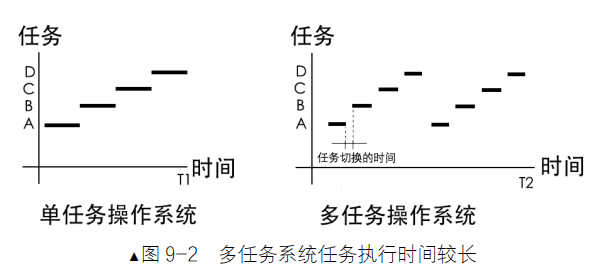
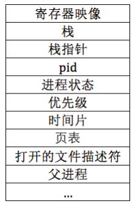
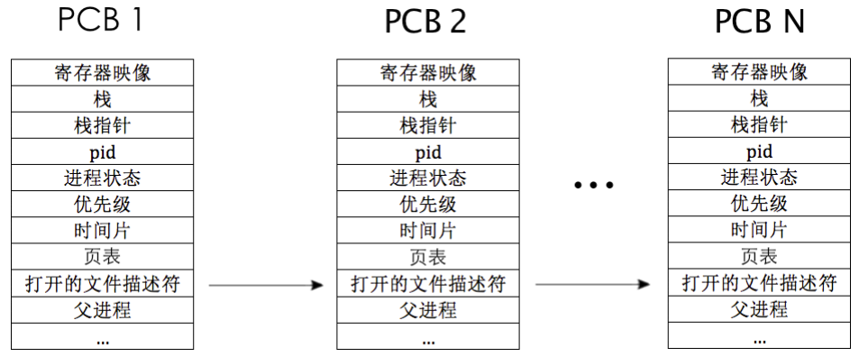
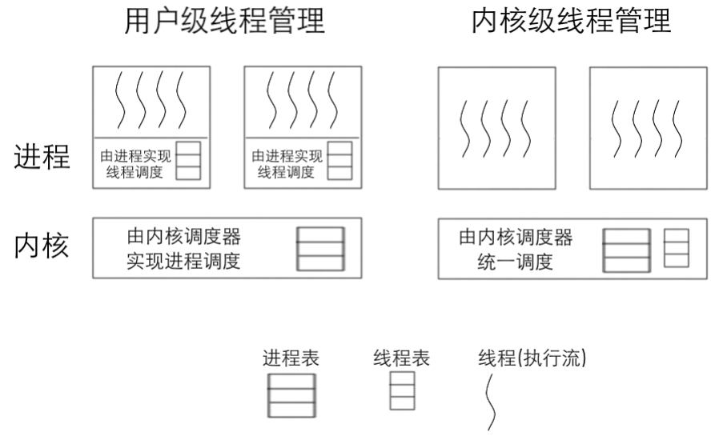
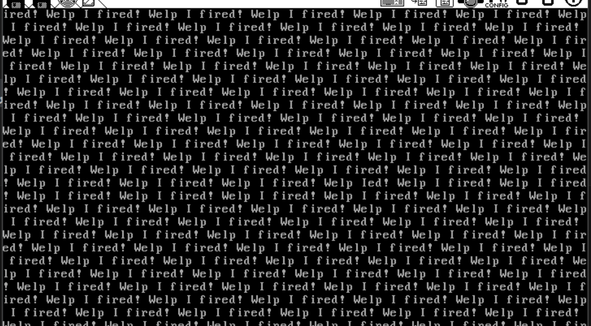

# 进程子系统的构建——实现内核线程

## 前言

​	好消息！我们终于可以向更近一步迈出了！那就是构建我们的进程子系统！这就意味着，我们终于可以准备向并发任务靠近了！

## 所以，我们的执行流是什么

​	一个更加高级的对处理器处理指令抽象。我认为如此。在之前，我们的计算机只有一个处理器（现在好多了，笔者的电脑上是16个逻辑CPU！），所以，在多任务的操作系统出现之前，我们的计算机一次真的只能做一个事情，即：任务的执行都是串行的，一个任务彻底执行完成后才能开始下一个任务。 可以想象这样的计算机工作起来是多么的不方便。任务是按照时间提交的顺序依次执行。所以，只要任何一个任务被提交上去了，之后的任务都必须死板的进行等待。（换而言之，处理器不会同时的做多个任务）

​	毫无疑问，伴随着计算机产业的爆发，需要交给计算机做的事情越来越多了，我们希望，系统可以**提高自己的响应性**，至少看起来，我们的系统可以并发的做非常多的事情。于是，在处理器数量不变的情况下，多任务操作系统出现了，它采用了 一种称为多道程序设计的方式，使处理器在所有任务之间来回切换，这样就 给用户一种所有任务并行运行的错觉，这称为“伪并行”，毕竟在任意时刻，处理器只会执行某一个任务，**处理器会落到哪些任务上执行，这是由操作系统中的任务调度器决定的。每一个任务都在CPU上跑一小会，到点我们就换一个。**

​	负责这个的是任务调度器，**简单来说，就是操作系统中用于把任务轮流调度上处理器运行的一个软件模块，它是操作系统的一部分。**调度器在内核中维护一个任务表（也称进程表、线程表或调度表），然后按照一定的算法， 从任务表中选择一个任务，然后把该任务放到处理器上运行，当任务运行的时间片到期后，再从任务表中 找另外一个任务放到处理器上运行，周而复始，让任务表中的所有任务都有机会运行。正是因为有了调度器，**多任务操作系统才能得以实现，它是多任务系统的核心，它的好坏直接影响了系统的效率。** 这种伪并行的好处是降低了任务的平均响应时间，通俗点说，就是让那些执行时间短的任务不会因为 “后到”而不得不等前面“先来”的且执行时间很长的程序执行完后才能获得执行的机会，整体上“显得”快了很多。当然这和调度算法有关，**这里所说的调度算法是较为“公正”的时间片轮转算法，也称为轮询。**

​	我们对于所有的任务而言，其理想综合时间没有变化，甚至更加严谨的说是变长了。因为软件切换也需要时间。

> 笔者记得有一篇Paper探讨了任务切换时间和响应度之间的文章，但是笔者最近没空找。简单的说——任务切换是需要时间的，我们不可以无限的加大切换的频率，否则，我们的电脑只会疲惫的切换任务而不执行任务，导致响应比断崖式下跌

​	这样看来，我们期望的图就变成了下面这个样子，请看：



> 请回忆一下，我们的Intel x86架构存在一个有意思的东西，叫做TSS段。很多人会发出疑问：诶？既然有硬件支持了，大部分的操作系统为什么不去使用TSS作为切换的基础硬件呢？
>
> 一种说法是——不利于移植。的确，TSS这个玩意只存在x86的编程体系当中，其他架构笔者的确没有接触到直接存在基于分段技术的任务切换。不过，这个并不能作为一个理由。因为Linux等操作系统本身就是准备面像多架构的。架构之间必然存在差异。总是要出现移植的。
>
> 笔者赞同另一种说法：这个说法可能会让你大吃一惊。那就是：开销不可接受。是的，基于TSS的进程切换开销远比软件模拟要大。
>
> **TSS切换需要保存和恢复CPU所有寄存器的状态（如通用寄存器、段寄存器、EIP等），这一过程通过`ljmp`指令触发硬件级别的任务切换，通常需要200多个时钟周期**，相比之下，我们的软件切换是直接压入寄存器保存到一个软件现场上，直接切换单个TSS的指向就好了。这样会快很多。还有一些说法，下面的说法是没有求证的，所以谨慎参考：
>
> - 在TSS切换过程中，若中断发生时未正确处理中断屏蔽或重入问题，可能导致状态不一致或死锁。例如，时钟中断触发任务切换时若未及时开启中断屏蔽，可能引发任务无法正常切换的异常。

​	所以说，为什么叫执行“流”呢？欸！请习惯这样的一个构建。CPU本身完全不知道外面啥情况，他只会来一条数据执行一条数据，其他的硬件辅助CPU正确的运行完成外面的期望。此时此刻.指令相当于发号施令的人由它指导处理器产生相应的行为。指令是由处理器来执行的，它引领处理器“前进”的方向，用“流”来表示处理器中程序计数器的航向，借此比喻处理器依次把此区域中的指令执行完后，所形成的像河流一样曲直不一的执行轨迹、执行路径（由顺序执行指令及跳转指令导致）。 

​	所以,这样看,面对过程的程序设计比较靠近机器层次多一点.提供一组让CPU执行的执行流可以大到可以是整个程序文件，即进程，小到可以是一个功能独立的代码块，即函数， 而线程本质上就是函数。 执行流是独立的，它的独立性体现在每个执行流都有自己的栈、一套自己的寄存器映像和内存资源， 这是 Intel 处理器在硬件上规定的，其实这正是执行流的上下文环境。

​	这样看就很明确了  对于单核CPU上，他没办法天生的支持多任务，但是我们可以打点的，每一次让他执行不同任务的代码，只要速度非常快，用户就会感觉所有的任务都在执行。实际上是我们的处理器当了千手观音。每一次都在哗哗执行不同执行流的代码。处理器根本就不在乎切换任务这回事。我们没有使用架构层次的切换，我们只是自己手动的给处理器源源不断的指令——物理层次上，指令是连续的。因为处理器只知道加电后按照程序计数器中的地址不断地执行下去， 在不断执行的过程中，我们把程序计数器中的下一条指令地址所组成的执行轨迹称为程序的控制执行流。这就是我们之后要做的工作！

### 在我们行动之前。。。

​	在我们准备梭哈进程之前，有必要玩一个文字游戏的区分。那就是我们有必要澄清一下进程和线程。

#### 程序

​	我现在就在含情脉脉的看着我的PCL Minecraft Launcher，为了写这个操作系统我已经很久没有打开我的MC了。你看，这个时候PCL Minecraft Launcher安静的躺在了我的磁盘上，没有被执行起来，打开你的任务管理器，或者是top一下，你不可能找到PCL Minecraft Launcher（前提是你没有偷偷的打开PCL Minecraft Launcher偷懒）。此时此刻，他就是一个安静的躺在磁盘上的代码。**处理器没有将这个可以被执行的，被架构识别的二进制文件纳入执行的考虑，因为我们没启动它！**程序就是这样的，指代**静态的、存储在文件系统上、尚未运行的指令代码，它是实际运行时程序的映像。** 相当于一个水源。

#### 进程

​	进程的一个经典定义是——正在执行的程序。换而言之，我最终还是偷懒了，在Windows操作系统上，我双击了这个可执行文件，在Linux上，我可能是使用Bash fork了一个进程来执行PCL Minecraft Launcher（不懂fork？没关系，我们会实现它的，在我们的第十四章！）

​	想让你的程序跑起来成为一个进程。显然，光给执行流不够，咱们还要提供操作的内存，咱们还要占用文件描述符让我们的进程可以跟外界交互。。。总的来看，进程就是妈，非常的重！我们必须在进程层次上满足处理器执行写的代码所需要的所有的资源。

​	从操作系统的视角上来看，我们的进程就是**进行资源分配的基本单位**。每个进程都有独立的内存空间，这意味着一个进程崩溃不会直接影响其他进程。进程之间的通信需要通过特定的机制，如管道、消息队列或共享内存等。由于进程拥有独立的地址空间，创建和销毁进程的开销相对较大，因为它们涉及到内存分配、资源初始化等操作。那如果我只是关心**执行**，有没有更加轻量的实现呢？有

#### 线程

​	**处理器的执行单位，或者称为调度单位**，就是**线程**。也就是说，处理器看来，更关心的是内部所要求执行的代码，我们只看执行流的时候，说的更加像是线程。

​	一个进程可以包含多个线程，这些线程共享进程的内存空间和资源。线程之间的通信更加直接和高效，因为它们可以直接读写相同的内存地址。同样的，到时候我们手搓进程切换的时候就知道了——非常的轻量！直接进行一个上下文寄存器压栈就完事了。

​	我们的调度Level到今天不再是进程而是线程。并发的线程库成为了今天庞大软件的一个支柱。进程是这些线程的妈，线程负责跑，进程来提供这些孩子跑的资源。所以这样看是不是进程和线程就在资源上构成了解耦合的关系呢？是的。进程原先的职责的进一步细分诞生了线程，我们的线程专心的处理执行逻辑，进程不过是更宏大的抽象的一个具体实体——即，进程包含了线程，给线程一个托付之地，给他提供一系列的资源。

## 线程/进程也有状态

​	当然，笔者认为这些都谈不上毛病，我们说的状态最终指向了我们的逻辑任务的状态。

​	我们知道：程序在运行时，有可能因为某种情况而无法继续运行，比如某进程的功能是分析日志，它先要读取磁盘，把日志从文件系统中读入内存，之后再从内存中分析日志。访问文件系统需要经过外部设备的操作，比如硬盘，这通常比较耗时，因此在等待 IO 操作的时间内，分析日志的工作是无法进行的，**该进程无法做任何事，只能等待。当日志文件从磁盘调入到内存后，进程便准备做日志分析的工作了，之后开始运行 日志分析的代码，处理日志，直到完成。** 

​	这样看来，程序从执行到结束的整个过程中，并不是所有阶段都一直开足马力在处理器上运行，有的时候也会由于依赖第三方等“种种无奈”的外在条件而不得不停下来，当这种情况出现时，**操作系统就可以把处理器分配给其他线程使用，这样就可以充分利用处理器的宝贵资源了。 为此，操作系统把进程“执行过程”中所经历的不同阶段按状态归为几类，注意，强调的是“执行过程”，意为进程的状态描述的是进程中有关“动作”的执行流部分，即线程，而不包括静止的资源部分**。 

​	把上述需要等待外界条件的状态称为“阻塞态”，也就是BLOCK了，把外界条件成立时，进程可以随时准备运行的状态称为“就绪态”（READY），把正在处理器上运行的进程的状态称为“运行态”（RUNNING）。 只要“条件”成立，进程的状态就可以改变，通常这种状态的转变是由操作系统的调度器及相关代码负责的，因为只有它们才知道“条件”是否满足了，如图9-5 所示。进程的状态表示进程从出生到死亡的一系列所处的阶段，操作系统的调度器 可以利用它更加高效地管理进程调度。 

## 所以，我们需要一个进程的身份证——PCB结构

​	那既然我们的处理器真不知道啥任务是啥任务，我们就得知道，这就是为什么我们需要请出一个重要的结构——PCB。他需要解决下面的这六个问题

所以问题来了：

1. 要加载一个任务上处理器运行，任务由哪来？也就是说，调度器从哪里才能找到该任务？ 
2. 即使找到了任务，任务要在系统中运行，其所需要的资源从哪里获得？ 
3. 即使任务已经变成进程运行了，此进程应该运行多久呢？总不能让其独占处理器吧。 
4. 即使知道何时将其换下处理器，那当前进程所使用的这一套资源（寄存器内容）应该存在哪里？ 
5. 进程被换下的原因是什么？下次调度器还能把它换上处理器运行吗？ 
6. 前面都说过了，进程独享地址空间，它的地址空间在哪里？





​	来看看PCB！Process Control Block! 这就是我们说的进程身份证。我们一个一个回答上面的问题。

​	之前我们说过，物理上，处理器不关心我们的任务执行的代码到底是不是一个线程的，但是在逻辑层面上，我们不得不关心！我们使用PCB来表示一个进程。

​	PCB 没有具体的格式，其实际格式取决于操作系统的功能复杂度，以上只是列出了基本该有的内容。 

​	PCB 中包含“进程状态”，它解决了上面第5个问题，比如进程状态为阻塞态，下次就不能把它调度到处理器上了。“时间片”解决上面第 3 个问题，当时间片的值为 0 时，表示该进程此次的运行时间到期了，踢下 CPU ！

​	“页表”解决了上面第6 个问题，它代表进程的地址空间。

​	“寄存器映像”是用来解决上面第4 个问题的，即保存进程的“现场”，进程在处理器上运行时，所有寄存器的值都将保存到此处。一般情况下它位于 PCB 的顶端，不过位置也不固定，具体位置取决于 0 级 栈指针的位置，总之它会在 PCB 中上下滑动。其实第 4 个问题解决了，第 2 个问题也就一同搞定了，再从 PCB 中把寄存器映像加载到寄存器中就行了。 

​	目前只剩下第1 个问题没有解决了，其实，要解决此问题，就是要单独维护一个进程表，将所有的PCB结构加载到此表中，由调度器直接在进程表中找相应进程的 PCB，从而获取到对应进程的信息，将其寄 存器映像加载到处理器后，新进程就开始运行了。 

​	当然，还有一个叫做栈的东西：进程使用的栈也属于 PCB 的一部分， 不过此栈是进程所使用的0 特权级下内核栈（并不是3 特权级下的用户栈）。栈在PCB 中，这听上去有点不可思议，但细想一下还是觉得合理的。和进程相关的所有资源都应该集中放在一起，这样才方便管理。

​	所以，PCB 一般都很大，通常以页为单位，咱们系统比较小， PCB 只占一页。顺便说一句，上面所说的“寄存器映像”的位置并不固定，原因就是“寄存器映像”存 储到内核栈中，通常情况下进程或线程被中断时，处理器自动在 TSS 中获取内核栈指针，这通常是 PCB 的顶端，因此通常情况下“寄存器映像”位于 PCB 的顶端。

​	但有时候进程或线程的上下文，也就是“寄存器映像”，并不是在中断发生时保存到栈中的，而是在内核态下工作时，栈指针已经发生了变化时才向 栈中保存“寄存器映像”，比如线程主动让出处理器，这时候就得保存线程的现场，此时“寄存器映像” 必然就不在 PCB 顶端了。提醒一下，内核态未必都是关中断的状态，可以在开中断下执行内核代码，否 则就不会接收时钟中断，进而就不会调用调度器，也就无法进行任务调度了

​	鉴于“寄存器映像”的位置并不固定，我们在 PCB 中还要维护一个“栈指针”成员，它记 录 0 级栈栈顶的位置，借此找到进程或线程的“寄存器映像”。 

## 实现线程的两种方式——内核或用户进程 

​	线程的实现就有两种 方式，要么由操作系统原生支持，用户进程通过系统调用使用线程，要么操作系统不支持线程，由进程自 己想办法解决。因此，线程要么在 0 特权级的内核空间中实现，要么在 3 特权级的用户空间实现

​	线程仅仅是个执行流，在用户空间，还是在内核空间实现它，最大的区别就是线程表在哪里，由谁来 调度它上处理器。如果线程在用户空间中实现，线程表就在用户进程中，用户进程就要专门写个线程用作 线程调度器，由它来调度进程内部的其他线程。如果线程在内核空间中实现，线程表就在内核中，该线程就 会由操作系统的调度器统一调度，无论该线程属于内核，还是用户进程。 

​	对于内核线程：

1. 内核线程可以直接映射到CPU的核心上，因此多个线程可以真正并行执行（在多核处理器上）。这使得内核线程非常适合需要高并发和高性能的应用场景。
2. 由于内核线程由操作系统直接管理，操作系统可以更有效地将线程分配到不同的CPU核心上，充分利用多核处理器的计算能力。
3. 如果一个内核线程执行了阻塞操作（如I/O操作），内核可以调度其他线程继续执行，而不会阻塞整个进程。这使得内核线程在处理I/O密集型任务时表现更好。
4. 内核线程由操作系统直接管理，因此可以充分利用操作系统提供的功能，如优先级调度、资源管理和安全性控制。
5. 内核线程之间的错误通常不会相互影响，因为操作系统会为每个线程提供独立的上下文和资源管理。
6. 内核线程的创建、销毁和上下文切换需要内核的介入，这会导致较高的开销。每次线程切换都需要从用户态切换到内核态，增加了额外的性能损耗。
7. 内核线程的实现和调度逻辑较为复杂，需要操作系统的支持。开发者对线程的控制能力较弱，无法直接优化线程的行为。
8. 每个内核线程都需要占用一定的内核资源（如栈空间和线程控制块），因此创建大量内核线程可能会导致系统资源耗尽。
9. 内核线程的实现依赖于操作系统的支持，因此在不同操作系统之间的可移植性较差。

对于用户线程库，一个代表就是pthread库，但是不知道现在有没有做调整。

1. 用户线程的创建、销毁和上下文切换完全在用户空间完成，不需要内核的介入，因此开销较低。线程切换只需要保存和恢复用户空间的寄存器状态，速度更快。
2. 用户线程的调度策略可以由开发者自定义，而不受操作系统的限制。这使得用户线程非常适合需要特定调度策略的应用场景。
3. 用户线程的实现通常基于标准的线程库，因此在不同操作系统之间的可移植性较好。
4. 用户线程不需要占用内核资源，因此可以创建大量的线程而不会导致系统资源耗尽。
5. 用户线程非常适合需要大量并发线程的任务（如网络服务器），因为它们的创建和切换开销较低。
6. 用户线程无法直接映射到CPU核心上，因此无法真正实现并行执行（除非与内核线程结合使用）。在多核处理器上，用户线程的性能优势有限。
7. 如果一个用户线程执行了阻塞操作（如I/O操作），整个进程都会被阻塞，因为操作系统并不知道用户线程的存在。这会导致其他用户线程无法继续执行。
8. 用户线程的调度完全由用户空间的线程库管理，无法利用操作系统提供的优先级调度和资源管理功能。
9. 用户线程的实现需要开发者自行管理线程的调度和同步，增加了开发的复杂性。
10. 用户线程无法直接利用操作系统提供的某些功能（如信号处理、CPU亲和性等），这可能会限制其应用场景。



​	看看这个图！说的很明白了，也就是说，后者的实现更加干净利落些。所以笔者决定使用后者的方式！

## 手搓PCB，启动！

​	终于要来代码了，做好准备，马上发车！

```c
/**
 * @brief Function pointer type for thread execution.
 * 
 * A thread function should accept a single void pointer argument.
 */
typedef void (*TaskFunction)(void *);

/**
 * @brief Enumeration for thread status.
 * 
 * Represents the possible states a thread can be in during execution.
 */
typedef enum
{
    TASK_RUNNING,  // Thread is currently executing
    TASK_READY,    // Thread is ready to execute but not running
    TASK_BLOCKED,  // Thread is blocked and waiting for an event
    TASK_WAITING,  // Thread is waiting for a resource
    TASK_HANGING,  // Thread is suspended
    TASK_DIED      // Thread has terminated
} TaskStatus;
```

​	上面笔者说过，进程是存在状态的。我们的TaskStatus就是干这个事情的。上面的TaskFunction类型，就代表了我们正在执行的执行流函数。

​	下面整个结构体很大。

```c
/**
 * @brief Interrupt stack structure.
 * 
 * This structure stores the register values when an interrupt occurs.
 * It is used to save and restore the thread's execution context.
 */
typedef struct
{
    uint32_t vec_no;     // Interrupt vector number, this is done by INTR_VECTOR, err_code is pushed
    uint32_t edi;
    uint32_t esi;
    uint32_t ebp;
    uint32_t esp_dummy;  // Placeholder for alignment
    uint32_t ebx;
    uint32_t edx;
    uint32_t ecx;
    uint32_t eax;
    uint32_t gs;
    uint32_t fs;
    uint32_t es;
    uint32_t ds;

    /* From low to high privilege level */
    uint32_t err_code;   // Error code pushed by the processor
    void (*eip)(void);   // Instruction pointer at the time of interrupt
    uint32_t cs;         // Code segment
    uint32_t eflags;     // CPU flags
    void *esp;           // Stack pointer
    uint32_t ss;         // Stack segment
} Interrupt_Stack;
```

​	这个Interrupt Stack跟我们的时钟中断是有关系的。我们想，说到底我们需要一个东西来指挥我们的切换。还记得我们上一次搓的中断子系统不？那个就是我们的命根子。其0x20号中断就被用来hook我们的切换，但是先不着急，我们先建立起来抽象再说。

​	回到上面，实际上你一看这就是X86寄存器的全家桶。是的。我们就是抽象这个结构体，用来于发生中断的时候，我们将所有寄存器的状态保存到这个结构体内部。然后，我们的中断处理程序按照这个结构压入上下文。具体的实现放在后面，这个只需要记得是跟上下文切换打交道的。

```c
/**
 * @brief Thread stack structure.
 * 
 * This structure defines the stack layout for a thread.
 * It is used for context switching.
 */
typedef struct
{
    uint32_t ebp;
    uint32_t ebx;
    uint32_t edi;
    uint32_t esi;

    /**
     * @brief Entry point for the thread.
     * 
     * When the thread is first scheduled, this function is called with
     * the specified function and argument.
     */
    void (*eip)(TaskFunction func, void *func_arg);

    /* These fields are used only when the thread is first scheduled. */
    void (*_retaddr);    // Placeholder return address
    TaskFunction function; // Function to be executed by the thread
    void *func_arg;       // Argument to be passed to the function
} ThreadStack;
```

​	我们的线程栈就定义好了。

​	先说eip，这个是一个函数指针，我们稍后就会按按照类似func(func_arg)的方式调用它。eip实际上薄记了当前我们正在跑的函数首次执行某个函数时，这个栈就用来保存待运行的函数，其中 eip 便是该函数的地址。之后，switch_to 函数（在一个汇编文件，我们下一个小节会写）实现任务切换，当任务切换时，此eip用于保存任务切换后的新任务的返回地址。 

​	下一个问题，上面的四个寄存器干啥的，为什么就是这四个寄存器呢？

​	这涉及到ABI 内容，也就是程序的二进制接口了。我们在写汇编的时候就体会过，我们的函数调用本质上就是标签跳转，或者说刷新本来连贯程序流的执行代码。参数传递上，处理器是对之毫不知情的。你给他啥他就用啥执行啥。参数之间如何传递？返回值如何存储？系统调用的实现方式？目标文件格式或数据类型...等等！这就是ABI之间的约定。我们手搓的操作系统自然可以自己约定，但是那就意味着我们需要手改太多的东西。我们的编译器的和大部分的应用程序的约定是：

> All registers on the Intel386 are global and thus visible to both a calling and a called function. Registers %ebp, %ebx, %edi, %esi, and %esp ‘‘belong’’ to the calling function. In other words, a called function must preserve these registers’ values for its caller. Remaining registers ‘‘belong’’ to the called function. If a calling function wants to preserve such a register value across a function call, it must save the value in its local stack frame. 
>
> Intel386 上的所有寄存器都是全局的，因此对调用函数和被调用函数都可见。寄存器 %ebp、%ebx、%edi、%esi 和 %esp“属于”调用函数。换句话说，**被调用函数必须为其调用者保留这些寄存器的值。其余寄存器“属于”被调用函数。如果调用函数想要在函数调用期间保留这样的寄存器值，它必须将该值保存在其本地堆栈框架中。**

​	也就是说，我们不希望我们在中途被其他函数打断的时候，这五个寄存器的值是咱们要promise的esp 的值会由调用约定来保证，因此我们不打算保护 esp 的值。在我们的实现中，由被调函数保存除 esp 外的 4 个寄存器，这就是线程栈 thread_stack 前 4 个成员的作用，我们将来用 switch_to 函数切换时， 先在线程栈 thread_stack 中压入这 4 个寄存器的值。 

​	下面的内容是第一次调度的时候使用的：

```c
    /* These fields are used only when the thread is first scheduled. */
    void (*_retaddr);    // Placeholder return address
    TaskFunction function; // Function to be executed by the thread
    void *func_arg;       // Argument to be passed to the function
```

​	其中，_retaddr用来充当返回地址，在返回地址所在的栈帧占个位置，因此 _retaddr 中的值 并不重要，仅仅起到占位的作用。 function 是由函数kernel_thread 所调用的函数名,即 function 是在线程中执行的函数。

​	func_arg 是由 kernel_thread 所调用的函数所需的参数，即 function 的参数，因此最终的情形是：在线程中调用的是 function(func_arg)。

​	我们需要再回来理解一下调用的事情。你的大脑可能糊成一坨了。先看着，后面代码我详细分析的时候会好很多：

​	刚刚我们说的：ABI是一个约定，大家都遵守这个规矩，游戏才能玩的下去。


​	请看上图，我们发生跳转的时候，X86体系会将我们的返回地址放到栈中去，特别值得一提的是——ARM架构则是放到一个专门叫做LR的寄存器当中。关于一份专门的笔者自己总结的Intel X86-64架构的CALL And Return Procedure，笔者放到了bonus文件夹重作为一个附录，感兴趣的朋友可以参考。

> 我们看到Intel手册的原文：The CALL instruction transfers program control from the current (or calling) procedure to another procedure (the called procedure). To allow a subsequent return to the calling procedure, the CALL instruction saves the current contents of the EIP register on the stack before jumping to the called procedure. The EIP register (prior to trans-ferring program control) contains the address of the instruction following the CALL instruction. When this address is pushed on the stack, it is referred to as the return instruction pointer or return address.（Intel Arch Reference Vol1 7.15）
>
> CALL 指令将程序控制从当前（或调用）过程转移到另一个过程（被调用过程）。为了允许随后返回到调用过程，CALL 指令在跳转到被调用过程之前将 EIP 寄存器的当前内容保存在堆栈上。EIP 寄存器（在转移程序控制之前）包含 CALL 指令之后的指令的地址。当此地址被推送到堆栈上时，它被称为返回指令指针或返回地址。

​	这里就体现出来了——对于有参类型的函数，我们只需要让我们的EIP指向我们的kernel_thread函数，伪装的发起调用，这样，参数就会按照我们的意图压入：处理器会认为当前栈顶“应该是”调用者的返回地址，因此它会从当前栈顶+4 的位置找参数。进入到函数 kernel_thread 时，栈顶处是返回地址，因此栈顶+4 的位置保存的是 function，栈顶+8 保 存的是 func_arg。

​	那，我们的kernel_thread是啥时候发生调用的呢？我们没有call kernel_thread，他是被ret回来的！在保证栈顶值正确的情况下，ret 能把处理器重新带回到主调函数中。这里我们灵活运用了ret 指令，即在没有 call 指令的前提下，直接在栈顶装入函数的返回地址，再利用ret 指令执行该函数，也就是函数kernel_thread 作为“某个函数”（此函数暂时为 thread_start）的返回地址，通过 ret 指令使函数 kernel_thread 的偏移地址（段基址为 0）被载入到处理器的EIP 寄存器，从而处理器开始执行函数kernel_thread，但由于它的执行并不是通过call 指令实现的，所 以进入到函数kernel_thread 中执行时，栈中并没有返回地址。 

​	为什么要这么做呢？

​	第1个作用是在线程首次运行时，线程栈用于存储创建线程所需的相关数据。和线程有关的数据应该都在该 线程的PCB 中，这样便于线程管理，避免为它们再单独维护数据空间。创建线程之初，要指定在线程中运行的 函数及参数，因此，把它们放在位于PCB 所在页的高地址处的0级栈中比较合适，该处就是线程栈的所在地址。

​	第2 个作用是用在任务切换函数 switch_to 中的，这是线程已经处于正常运行后线程栈所体现的作用。 它是被内核调度器 函数调用的，因此这里面涉及到主调函数寄存器的保护，就是 ebp、ebx、edi 和 esi 这 4 个寄存器，前面那段英文已经阐述了，它们属于主调函数（这里是指调度器函数），咱们要在被调用函数 switch_to 中将它们保护起来，也就是将它们保存在栈中，这必然涉及到压栈指令 push。当然可以使用内嵌汇编，但是笔者看着别扭，还是分开一个switch_to吧

为了满足 C 语言的调用形式，使 kernel_thread 以为自己是通过“正常渠道”，也就是 call 指令调用执 
行的，当前栈顶必须得是返回地址，故参数 _retaddr只为占位置充数，由它充当栈顶，其值充当返回地 址，所以它的值是多少都没关系，因为咱们将来不需要通过此返回地址“返回”，咱们的目的是让 
kernel_thread 去调用 func(func_arg)，也就是“只管继续向前执行”就好了，此时不需要“回头”。总之我们只 要保留这个栈帧位置就够了，**为的是让函数kernel_thread 以为栈顶是它自己的返回地址，这样便有了一个正确的基准，并能够从栈顶+4 和栈顶+8 的位置找到参数func 和func_arg**。否则，若没有占位成员unused_ret 的话，处理器依然把栈顶当作返回地址作为基准，以栈顶向上+4 和+8 的地方找参数func 和func_arg，但由于没有返回地址，此时栈顶就是参数func，栈顶+4 就是func_arg，栈顶+8 的值目前未知，要看实际编译情况因此处 理器便找错了栈帧位置，后果必然出错。 

​	第2 个作用中，会由调度函数switch_to 为其留下返回地址，这时才需要返回。

```c
/**
 * @brief Task control block structure.
 * 
 * This structure represents a thread and stores its execution context.
 */
typedef struct
{
    uint32_t *self_kstack; // Kernel stack pointer for the thread
    TaskStatus status;      // Current status of the thread
    uint8_t priority;       // Thread priority level
    char name[TASK_NAME_ARRAY_SZ]; // Thread name
    uint32_t stack_magic;   // Magic value for stack overflow detection
} TaskStruct;
```

​	这是最简单的PCB啦！name用来标识自己的线程的名称，我们会在很久之后的INIT进程发力。self_kstack 是各线程的内核栈顶指针，**当线程被创建时，self_kstack 被初始化 为自己 PCB 所在页的顶端。之后在运行时，在被换下处理器前，我们会把线程的上下文信息（也就是寄 存器映像）保存在0 特权级栈中**，self_kstack 便用来记录0特权级栈在保存线程上下文后的新的栈顶，在 下一次此线程又被调度到处理器上时，可以把 self_kstack 的值加载到 esp 寄存器，这样便从0 特权级栈中 获取了线程上下文，从而可以加载到处理器中运行。 

### 先不着急，让进程跑起来

```c
/**
 * @brief Start a new thread.
 * 
 * This function allocates a new kernel thread, initializes it, and sets up
 * the stack for execution. It then switches to the new thread context.
 * 
 * @param name The name of the thread.
 * @param priority The priority level of the thread.
 * @param function The function to be executed by the thread.
 * @param func_arg The argument to be passed to the function.
 * @return Pointer to the created TaskStruct.
 */
TaskStruct *thread_start(
    char *name, int priority,
    TaskFunction function, void *func_arg)
{
    // Allocate memory for the thread control block
    TaskStruct* thread = get_kernel_pages(PCB_SZ_PG_CNT);
    // Initialize the thread structure
    init_thread(thread, name, priority);

    // Set up the thread stack
    create_thread(thread, function, func_arg);
    asm volatile ("movl %0, %%esp; \
        pop %%ebp; \
        pop %%ebx; \
        pop %%edi; \
        pop %%esi; \
        ret": : "g" (thread->self_kstack) : "memory");
    return thread;
}

```

​	老样子，我们说过了，要让我们的进程成为进程，需要提供资源，上面的事情就是让进程获取她所拥有的资源。

​	我们先使用get_kernel_pages函数获取内核页1张，当然，PCB_SZ_PG_CNT这里就是1，在到路途的终点都会是1.我们的PCB很小，所以不需要分配很多页。

​	下一步，就是将我们的线程做信息层级的初始化：

```c
/**
 * @brief Initialize a thread structure.
 * 
 * This function initializes the thread control block with the provided
 * parameters and sets up the default values.
 * 
 * @param pthread Pointer to the TaskStruct to be initialized.
 * @param name The name of the thread.
 * @param priority The priority level of the thread.
 */
static void init_thread(TaskStruct *pthread, char *name, int priority)
{
    k_memset(pthread, 0, sizeof(TaskStruct));  // Clear the structure
    k_strcpy(pthread->name, name);  // Set thread name
    pthread->status = TASK_RUNNING;  // Set the status as running
    pthread->priority = priority;  // Assign priority
    pthread->self_kstack = (uint32_t *)((uint32_t)pthread + PG_SIZE);  // Set stack pointer
    pthread->stack_magic = TASK_MAGIC;  // Assign magic value for stack integrity check
}
```

​	啊哈，很简单吧！我们需要注意的是`pthread->self_kstack = (uint32_t *)((uint32_t)pthread + PG_SIZE);`这个表达式。我们说过，要放到我们的页的顶部

​	PCB 的上端是 0 特权级栈，将来线程在内核态下的任何栈操作都是用此 PCB 中的栈，如果出现了某些异常导致入栈操作过多，这会破坏 PCB 低处的线程信息。为此，需要检测这些线程信息是否被破坏了，stack_magic 被安排在线程信息的最边缘，作为它与栈的边缘。目前用不到此值，以后在线程调度时会检测它。这里stack_magic随意的值，笔者反正写了TASK_MAGIC，自己定义的宏。

​	回到create_thread函数：

```c
/**
 * @brief Create a new kernel thread.
 * 
 * This function initializes the thread stack and prepares the execution
 * environment for the new thread.
 * 
 * @param pthread Pointer to the TaskStruct representing the thread.
 * @param function The function to be executed by the thread.
 * @param func_arg The argument to be passed to the function.
 */
static void create_thread(TaskStruct *pthread, TaskFunction function, void *func_arg)
{
    // Allocate space for the interrupt stack
    pthread->self_kstack -= sizeof(Interrupt_Stack);

    // Allocate space for the thread stack
    pthread->self_kstack -= sizeof(ThreadStack);

    // Set up the thread stack
    ThreadStack *kthread_stack = (ThreadStack *)pthread->self_kstack;
    kthread_stack->eip = kernel_thread;  // Entry point for the thread
    kthread_stack->function = function;  // Task function
    kthread_stack->func_arg = func_arg;  // Argument for the function
    kthread_stack->ebp = 0;
    kthread_stack->ebx = 0;
    kthread_stack->esi = 0;
    kthread_stack->edi = 0;
}
```

pthread->self_kstack -= sizeof（struct intr_stack）是为了预留线程所使用的中断栈 
struct intr_stack 的空间，这有两个目的。 
（1）将来线程进入中断后，位于 kernel.S 中的中断代码会通过此栈来保存上下文。 
（2）将来实现用户进程时，会将用户进程的初始信息放在中断栈中。 
因此，必须要事先把 struct intr_stack 的空间留出来。 

​	我们进一步将kstack做初始化，也就是将我们的结构体中kstack进一步的初始化。后面，我们第一次将线程进行运行的时候，就会首先call kernel_thread函数，然后正确的将实际运行的内容和参数放置到我们的结构体当中去。

```c
/**
 * @brief Kernel thread entry function.
 * 
 * This function serves as the entry point for a new kernel thread.
 * It directly calls the provided task function with its argument.
 * 
 * @param function The task function to be executed by the thread.
 * @param func_arg The argument to be passed to the task function.
 */
static void kernel_thread(TaskFunction function, void *func_arg)
{
    function(func_arg);
}

```

​	下一步，我们的最后是一个临时演示的方案。这里，我们实际上是直接将self_stack压栈。在输出部分，"g" (thread->self_kstack)使 thread->self_kstack 的值作为输入，采用通用约束 g，即内存 或寄存器都可以

```asm
    asm volatile ("movl %0, %%esp; \
        pop %%ebp; \
        pop %%ebx; \
        pop %%edi; \
        pop %%esi; \
        ret": : "g" (thread->self_kstack) : "memory");
    return thread;
```

​	看到了嘛，我们下面马上就要准备发动线程大招了。我们先把thread->self_kstack依次放到了ebp, ebx,edi,esi当中，下一个是啥呢？自然就是eip咯！我们一个ret就会把此时此刻栈上的数据当成返回地址送上处理器的 EIP 寄存器。 这个时候，我们的值指向的是kernel_thread上，那自然就是指向我们自己派发的函数咯。

```
#include "include/library/ccos_print.h"
#include "include/kernel/init.h"
#include "include/library/kernel_assert.h"
#include "include/memory/memory.h"
#include "include/thread/thread.h"

void thread_a(void* args);

int main(void)
{
    init_all();
    thread_start("thread_a", 31, thread_a, "Welp I fired! ");
    while(1);
    return 0;
}

// this is the thread we shell fired!
// remember to put it after the main, else the main will be
// missed at 0xc0001500 :) these will be sad :(
void thread_a(void* args){
    char* arg = (char*)args;
    while(1){
        ccos_puts(arg);
    }
}
```

​	不管三七二十一，上面的程序试一下。



​	完事！