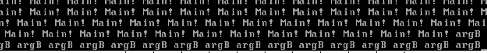

# 锁让我们的并发变得更加安全

​	笔者是先于此项目才知道的锁的。实际上，上一个问题的根源是——锁的缺失导致程序潜在的不安全。

​	如果你学习过锁和信号量，那显然，你就可以直接跳到实现上，直接实现一个信号量和锁就可以结束本小节的内容了，如果你没有，请听我慢慢道来。

​	现在呢，我们启动这个存在问题的内核。然后当运行还在正常的时候，快速的嗯下我们的Ctrl + C稍微让我们的内核休息一下。然后，我们就打开外部中断检测。

```
<bochs:2> show extint
```

​	OK，在执行一段时间后，我们终于看到了触发异常的地方了

```
00191742487: exception (not softint) 0008:c0001cb9 (0xc0001cb9)
00191742554: iret 0008:c0001816 (0xc0001816)
00191782487: exception (not softint) 0008:c0001cb9 (0xc0001cb9)
00191782950: iret 0008:c000176e (0xc000176e)
00191782969: exception (not softint) 0008:c0001aab (0xc0001aab)
```

​	这里，我们看到的是时刻00191782969发生了不应该发生的东西。我们把断点打在00191782968时刻。

```
(0) Caught time breakpoint
Next at t=191782968
(0) [0x0000000017b7] 0008:c00017b7 (unk. ctxt): shl bx, 0x01              ; 66d1e3
<bochs:3> s
Next at t=191782969
(0) [0x0000000017ba] 0008:c00017ba (unk. ctxt): mov byte ptr gs:[bx], cl  ; 6567880f
<bochs:4> r
eax: 0xc000c6c6 -1073690938
ebx: 0xc0008d8c -1073705588
ecx: 0x00000072 114
edx: 0xc00003d5 -1073740843
esp: 0xc0101de4 -1072685596
ebp: 0xc0101e40 -1072685504
esi: 0x00000000 0
edi: 0x00000000 0
eip: 0xc00017ba
eflags: 0x00000283: id vip vif ac vm rf nt IOPL=0 of df IF tf SF zf af pf CF
```

​	嗯？看看我们的bx，这里显然是我们自己手搓的一个显示底层的代码框架。这里我们分析一下bx，因为mov不会触发异常，那显然是内存访问出现了问题。

​	我们分析一下，这里的地址访问显然是内核的，针对我们布置的页表映射。显然，我们bx的值是8d8c。回忆一下，文本模式下显存物理地址范围为 0xb8000～0xbffff，咱们的显存段描述符是按照此范围来 设置的，因此段基址为 0xb8000，段大小为 0xcffff-0xb8000=0x7fff，寄存器bx 用作显存段内的偏移量，因此它不应该超过 0x7fff。

​	等等！这分明是0x8d8c，一眼大于0x7fff，特权检查会直接将这个指令的执行砍死，自然也就会抛GP错误。

​	其实，这是因为我们的IO操作不是“原子性”所导致的。要知道，我们现在开启了时钟中断。意味着我们线程在干活的时候，一旦发生中断，就必须立刻把手头的活放下去，换成别人进行。这个时候，我们对公共资源的访问的进度不一致（视图不一致），就会导致这种并发访问的数据竞争问题。

​	举个例子，在这里的GP异常，就是因为我们的光标赋值操作不是原子性所导致的。在咱们的代码中，光标设置分为 4 个微操作。 

- 通知光标寄存器要设置高 8 位，
- 输入光标值的高 8 位
- 通知光标寄存器要设置低 8 位 
- 输入光标值的低 8 位

​	所以，只要这中间，任何一个步骤被打断了，光标没有设置完全原子化（也就是高八位和低八位是同一个人设置的话），就会触发潜在的异常。比如说，大篇幅的空缺，覆盖，甚至当恰好换页的时候，由于我们马上发生滚屏操作，如果恰好准备滚屏被切换的时候，高八位仍然没有复原，就会被另一个线程抢走，如果这个线程恰好准备赋值第八位然后传递到写入位置的时候，这个时候组合产生的位置就是严重非法的，自然，一个写入就会爆炸。

## 所以，我们需要锁

​	在我们的确想明白了需要锁之后，我们需要引入两个新概念——临界区和互斥。毕竟，刚刚的问题就是因为——我们没有保证对共享资源的访问一致性。每一个进程拿到的共享资源视图不一样。所以，只要一个进程进去设置了共享资源，我们就让所有其他准备赶来写/读的线程门外竖着。等待里面的进程干完活了再来看也不迟。这里，我们针对这样需要**“上锁”**（为什么叫上锁呢？嗯，就像你在厕所方便，显然你占用了**厕所的公共资源**，你也不喜欢被别人大摇大摆的冲进来把你扔到门外使用你的厕所吧！）。这个时候，我们就把厕所叫做临界区，厕所里的资源就是互斥的，要不你使用，要不他使用。

​	所以，事情变得很明白了。严肃的讲：

- 公共资源是指被所有任务共享的一套资源，可以是公共内存、公共文件、公共硬件等。在代码中，显卡的光标寄存器和显存就是公共资源。
- 临界区是指程序中访问公共资源的指令代码，当多个任务访问同一公共资源时，各任务中访问这些资源的指令代码组成的区域就是临界区。需要强调的是，临界区是指令代码，而不是受访的静态公共资源。举个例子，我们的__ccos_putchar就是访问了底层共享的VGA文本显示器资源
- 互斥是指某一时刻公共资源只能被一个任务独享，即不允许多个任务同时出现在自己的临界区中。公共资源在任意时刻只能被一个任务访问，其他任务必须等待当前任务执行完临界区代码后才能访问。
- 竞争条件是指多个任务以非互斥的方式同时进入临界区，导致公共资源的最终状态依赖于这些任务的执行次序。当多个任务“同时”读写公共资源时，它们的访问会以混杂并行的方式进行，后面任务的结果可能会覆盖前面任务的结果，最终公共资源的状态取决于所有任务的执行时序。这里的“同时”不仅指真正的并行，也包括多任务的伪并行情况

​	这些就是我们谈论到的重要的概念，所以，我们需要保证我们的操作是——*“原子的”*，只有这样我们才能保证我们的代码是临界的，对公共资源的访问是**线程安全的**（至少你晚上睡觉不必担心一个GP噩梦），能够消灭竞争条件的！

​	所以咋实现代码原子化呢？别急，这不就来了？

## 实现一个锁：CCLocker与CCSemaphore

```c
/* 信号量结构 */
typedef struct {
   uint8_t  value;
   list     waiters;
}CCSemaphore;

/* 锁结构 */
typedef struct {
   TaskStruct* holder;	    // 锁的持有者
   CCSemaphore   semaphore;	    // 用二元信号量实现锁
   uint32_t holder_repeat_nr;		    // 锁的持有者重复申请锁的次数
}CCLocker;
```

​	这个就是一个最简单的信号量和锁了！

​	所以，如何理解信号量呢，我们还是看看上面的CCSemaphore。我们使用一份叫做value的变量来表达我们的是否可申请，可以申请多少资源的抽象结构体。可以认为，这里的value就是资源余量。当我们资源还剩下N个的时候，我们的value就是N，0个的时候就是

​	所以，每当我们获取现在的资源的时候，我们就给value--，就代表我们的资源上被一个对象占用了。走出临界区，我们归还资源，value++。

​	具体来从计算机层面上谈：

- 增加操作 up 包括两个微操作。 
  1. 将信号量的值加 1。 
  2. 唤醒在此信号量上等待的线程。 
- 减少操作 down 包括三个子操作。 
  1. 判断信号量是否大于 0
  2. 若信号量大于 0，则将信号量减 1。 
  3. 若信号量等于 0，当前线程将自己阻塞，以在此信号量上等待。

​	啊哈，那我们就意识到，这个操作仍然也不是原子性质的。所以，我们也需要作点小动作，那就是将我们在执行这些操作的时候整点关开中断的操作。

​	所以，我们的线程需要具备阻塞和解锁的功能。我们的线程自己睡去，但是唤醒却没办法自己来。

​	已被阻塞的线程是无法运行的，属于完全没法动弹的“鬼压床”阶段中，必须别人来摇醒他自己，否则它永远没有运行的机会。这个“大恩人”便是锁的持有者，它释放了锁之后便去唤醒在它后面因获取该锁而阻塞 的线程。因此唤醒已阻塞的线程是由别的线程，通常是锁的持有者来做的。 

​	值得注意的是线程阻塞是线程执行时的“动作”，因此线程的时间片还没用完，在唤醒之后，线程会继续在剩余的时间片内运行，调度器并不会将该线程的时间片“充满”，也就是不会再用线程的优先级 priority 为时间片 ticks 赋值。因为阻塞是线程主动的意愿，它也是“迫于无奈”才“慷慨”地让出处理器资源给其他线程，所以调度器没必要为其“大方”而“赏赐”它完整的时间片。 

​	所以现在让我们看看，如何实现进程的block方法和unblock方法。

```c
/* Block the current thread, marking its status as stat */
void thread_block(TaskStatus stat) {
    /* stat must be one of TASK_BLOCKED, TASK_WAITING, or TASK_HANGING */
    KERNEL_ASSERT(((stat == TASK_BLOCKED) || (stat == TASK_WAITING) ||
            (stat == TASK_HANGING)));
    
    // Disable interrupts and save the previous interrupt status
    Interrupt_Status old_status = set_intr_status(INTR_OFF);
    
    // Get the current running thread
    TaskStruct *cur_thread = current_thread();
    
    // Set the current thread's status to the given stat
    cur_thread->status = stat;  
    
    // Schedule another thread to run
    schedule();                 
    
    // Restore the previous interrupt state
    set_intr_status(old_status); 
}
```

​	首先，准备将自己睡下去的时候，我们必须提前设置好状态（意图明确），这样我们就准备好设置自己的状态后，将自己切换成其他进程进来进行运行。整个执行流的中断在很久之后可以回复回来的时候，调用`set_intr_status(old_status); `恢复回来

```c
/* Unblock a thread */
void thread_unblock(TaskStruct *pthread) {
    // Disable interrupts and save the previous interrupt status
    Interrupt_Status old_status = set_intr_status(INTR_OFF);
    
    // Ensure the thread is currently blocked, waiting, or hanging
    KERNEL_ASSERT(((pthread->status == TASK_BLOCKED) ||
            (pthread->status == TASK_WAITING) ||
            (pthread->status == TASK_HANGING)));
    
    // If the thread is not already ready, move it to the ready list
    if (pthread->status != TASK_READY) {
        KERNEL_ASSERT(!elem_find(&thread_ready_list, &pthread->general_tag)); // Ensure the thread is not already in the ready list
        
        // Ensure the thread is not in the ready list, if it is, panic
        if (elem_find(&thread_ready_list, &pthread->general_tag)) {
            KERNEL_PANIC_SPIN("thread_unblock: blocked thread in ready_list\n");
        }
        
        // Add the thread to the front of the ready list
        list_push(&thread_ready_list, &pthread->general_tag); 
        
        // Set the thread status to ready
        pthread->status = TASK_READY;     
    }
    
    // Restore the previous interrupt state
    set_intr_status(old_status); 
}
```

​	我们的外部人员要将一个睡下去的THREAD设置为ready（不可以是running，不能直接打破当前物理运行的线程唯一性），我们需要判断一下——不要重复添加我们的进程到预备队列中后，添加我们的进程到预备队列中，最后，恢复一下中断。事情就结束了。

```c
#include "include/kernel/lock.h"
#include "include/kernel/interrupt.h"
#include "include/library/kernel_assert.h"
#include "include/library/list.h"
#include "include/library/types.h"

/* Initialize semaphore */
void sema_init(CCSemaphore *psema, uint8_t value) {
    psema->value = value;       // Set the initial value of the semaphore
    list_init(&psema->waiters); // Initialize the semaphore's waiting list
}

/* Initialize lock plock */
void lock_init(CCLocker *plock) {
    plock->holder = NULL;
    plock->holder_repeat_nr = 0;
    sema_init(&plock->semaphore, 1); // Initialize the semaphore with value 1
}

/* CCSemaphore down operation (P operation) */
void sema_down(CCSemaphore *psema) {
    /* Disable interrupts to ensure atomic operation */
    Interrupt_Status old_status = set_intr_status(INTR_OFF);
    while (psema->value == 0) { // If value is 0, it means the semaphore is held by someone else
        KERNEL_ASSERT(!elem_find(&psema->waiters, &current_thread()->general_tag));
        /* The current thread should not already be in the semaphore's waiters
         * list */
        if (elem_find(&psema->waiters, &current_thread()->general_tag)) {
            KERNEL_PANIC_SPIN(
                "sema_down: thread blocked has been in waiters_list\n");
        }
        /* If semaphore's value is 0, the current thread adds itself to the
         * waiters list and blocks itself */
        list_append(&psema->waiters, &current_thread()->general_tag);
        thread_block(TASK_BLOCKED); // Block the thread until it is awakened
    }
    /* If value is 1 or the thread is awakened, proceed with acquiring the lock
     */
    psema->value--;
    KERNEL_ASSERT(psema->value == 0);
    /* Restore the previous interrupt status */
    set_intr_status(old_status);
}

/* CCSemaphore up operation (V operation) */
void sema_up(CCSemaphore *psema) {
    /* Disable interrupts to ensure atomic operation */
    Interrupt_Status old_status = set_intr_status(INTR_OFF);
    KERNEL_ASSERT(psema->value == 0);
    if (!list_empty(&psema->waiters)) {
        TaskStruct *thread_blocked =
            elem2entry(TaskStruct, general_tag, list_pop(&psema->waiters));
        thread_unblock(thread_blocked); // Unblock the thread that was waiting
                                        // for the semaphore
    }
    psema->value++;
    KERNEL_ASSERT(psema->value == 1);
    /* Restore the previous interrupt status */
    set_intr_status(old_status);
}

/* Acquire lock plock */
void lock_acquire(CCLocker *plock) {
    /* Exclude the case where the current thread already holds the lock but
     * hasn't released it */
    if (plock->holder != current_thread()) {
        sema_down(
            &plock->semaphore); // Perform P operation on semaphore (atomic)
        plock->holder = current_thread();
        KERNEL_ASSERT(plock->holder_repeat_nr == 0);
        plock->holder_repeat_nr = 1;
    } else {
        plock->holder_repeat_nr++; // If the thread already holds the lock,
                                   // increment the repeat count
    }
}

/* Release lock plock */
void lock_release(CCLocker *plock) {
    KERNEL_ASSERT(plock->holder == current_thread());
    if (plock->holder_repeat_nr > 1) {
        plock->holder_repeat_nr--; // Decrease repeat count if the thread holds
                                   // the lock multiple times
        return;
    }
    KERNEL_ASSERT(plock->holder_repeat_nr == 1);

    plock->holder =
        NULL; // Set lock holder to NULL before performing V operation
    plock->holder_repeat_nr = 0;
    sema_up(&plock->semaphore); // Perform V operation on semaphore (atomic)
}

```

​	围绕此，我们几乎可以说是简单的对我们上面说的事情编程，然后没了！

> - `sema_init` 函数用于初始化信号量，设置初始值，并初始化等待队列。`lock_init` 函数用于初始化互斥锁，其中 `holder` 记录当前持有锁的线程，`holder_repeat_nr` 记录锁的重入次数，`semaphore` 采用一个初值为 1 的信号量实现互斥效果。
> - `sema_down` 函数实现信号量的 P 操作，表示获取信号量。函数执行时会先关中断确保操作的原子性。如果信号量值为 0，说明资源被占用，当前线程会被加入等待队列并进入阻塞状态，直到被其他线程唤醒。当信号量可用时，函数会减少信号量的值，并恢复之前的中断状态。
> - `sema_up` 函数实现信号量的 V 操作，表示释放信号量。函数执行时同样会关中断确保原子性，检查是否有等待的线程。如果等待队列不为空，则从队列中取出一个线程并将其唤醒。然后增加信号量的值，并恢复之前的中断状态。
> - `lock_acquire` 函数用于获取互斥锁。若当前线程不是锁的持有者，则执行 `sema_down` 使信号量减少到 0，表示锁已被占用，同时将 `holder` 设为当前线程，并将 `holder_repeat_nr` 置为 1，表示成功获取锁。如果当前线程已经持有锁，则简单地增加 `holder_repeat_nr`，实现锁的可重入。
> - `lock_release` 函数用于释放互斥锁。首先确保锁的持有者是当前线程。如果 `holder_repeat_nr` 大于 1，说明线程多次获取了锁，此时只需减少 `holder_repeat_nr` 并返回。如果 `holder_repeat_nr` 为 1，表示锁可以被释放，此时将 `holder` 设为空，并调用 `sema_up` 释放信号量，使其他等待的线程有机会获取锁。

## 实现一个带有锁的控制台Output子系统

​	是的，就是简单的封装了一下：

```c
#include "include/device/console_tty.h"
#include "include/kernel/lock.h"
#include "include/thread/thread.h"
#include "include/library/ccos_print.h"
#include "include/library/types.h"

// Static locker for console synchronization
// this is acceptable, for we only have one actually console
static CCLocker console_lock; // Lock for controlling access to the console

/**
 * Initializes the console.
 * This function sets up the console lock to ensure thread-safe operations.
 */
void console_init() {
    lock_init(&console_lock); // Initialize the console lock
}

/**
 * Acquires the console lock.
 * This function ensures exclusive access to the console by acquiring the lock.
 * If the lock is already held by another thread, the current thread will block
 * until the lock is released.
 */
void console_acquire() {
    lock_acquire(&console_lock); // Acquire the console lock
}

/**
 * Releases the console lock.
 * This function releases the lock, allowing other threads to acquire it and
 * access the console.
 */
void console_release() {
    lock_release(&console_lock); // Release the console lock
}

/**
 * Prints a string to the console.
 * This function ensures thread-safe printing by acquiring the console lock
 * before calling the underlying `ccos_puts` function and releasing the lock
 * afterward.
 *
 * @param str The string to be printed to the console.
 */
void console_ccos_puts(char *str) {
    console_acquire(); // Acquire the console lock
    ccos_puts(str);    // Print the string to the console
    console_release(); // Release the console lock
}

/**
 * Prints a character to the console.
 * This function ensures thread-safe printing by acquiring the console lock
 * before calling the underlying `__ccos_putchar` function and releasing the
 * lock afterward.
 *
 * @param char_asci The ASCII value of the character to be printed.
 */
void console__ccos_putchar(uint8_t char_asci) {
    console_acquire();         // Acquire the console lock
    __ccos_putchar(char_asci); // Print the character to the console
    console_release();         // Release the console lock
}

/**
 * Prints a 32-bit integer in hexadecimal format to the console.
 * This function ensures thread-safe printing by acquiring the console lock
 * before calling the underlying `__ccos_display_int` function and releasing the
 * lock afterward.
 *
 * @param num The 32-bit integer to be printed in hexadecimal format.
 */
void console__ccos_display_int(uint32_t num) {
    console_acquire();       // Acquire the console lock
    __ccos_display_int(num); // Print the integer in hexadecimal format
    console_release();       // Release the console lock
}
```

​	很简单吧！

## 写一下代码

```c
#include "include/device/console_tty.h"
#include "include/kernel/init.h"
#include "include/library/kernel_assert.h"
#include "include/memory/memory.h"
#include "include/thread/thread.h"

void thread_a(void* args);
void thread_b(void* args);
int main(void)
{
    init_all();
    thread_start("k_thread_a", 31, thread_a, "argA "); 
    thread_start("k_thread_b", 16, thread_b, "argB "); 
    interrupt_enabled();
    // code is baddy! we need LOCK!!!!
    while(1){
        console_ccos_puts("Main! ");
    }
}

void thread_a(void* args){
    char* arg = (char*)args;
    while(1){
        console_ccos_puts(arg);
    }
}

void thread_b(void* args){
    char* arg = (char*)args;
    while(1){
        console_ccos_puts(arg);
    }
}
```

## 效果图



