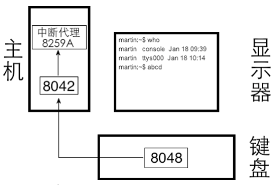
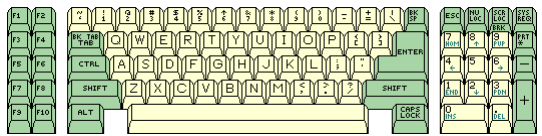
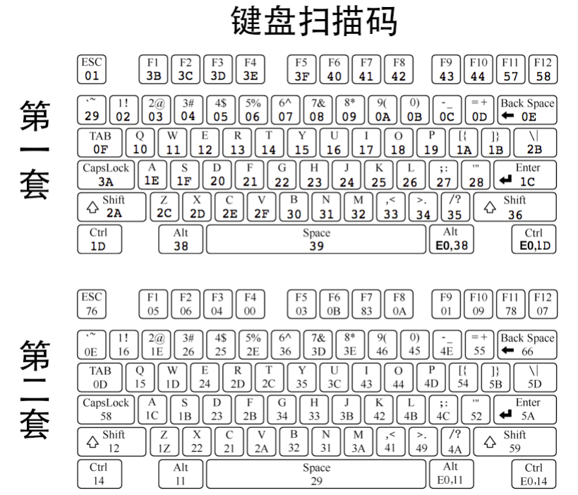
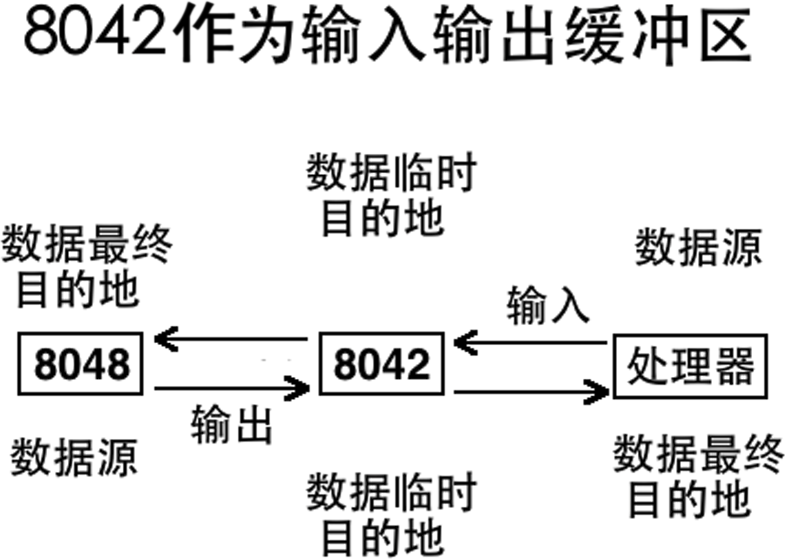
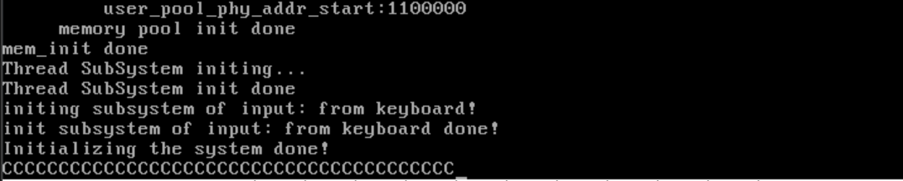

# 构建输入子系统——实现键盘驱动1——热身驱动

​	我们下一步就是准备进一步完善我们系统的交互性。基于这个，我们想到的第一个可以用来进行输入的设备，就是键盘！这个不假。我们这个章节的核心内容，就是构建一个基于键盘的输入子系统。给我们之后的系统更多功能添砖加瓦！

## 所以，键盘是如何工作的

​	虽然现在的键盘可以说是日新月异，但是基本的工作原理不会发生很大的改变。我们的键盘是一个独立的设备，需要介入总线跟我们的主板系统沟通。不管怎么说，我们的主板上，存在一个Intel 8048 或兼容芯片，它的作用是：每当键盘上发生按键操作，它就向键盘控制器报告哪个键被按下，按键是否弹起。




​	上图的8048 是键盘上的芯片，其主要责任就是监控哪个键被按下。当键盘上发生按键操作时，8048 当然知道是哪个键被按下。但光它自己知道还不 行，它毕竟要将按键信息传给8042，必须得让8042 知道到底是按下了哪个键，为此8048 必然要和8042达成一个协议，这个协议规定了键盘上的每个物理键对应的唯一数值，说白了就是对键盘上所有的按键进行编码，为每个按键分配唯一的数字，这样双方都知道了每个数值代表哪个键。当某个键被按下时，8048 把这个键对应的数值发送给8042，8042根据这个数值便知道是哪个键被按下了。 

​	现在，笔者就在使用键盘敲击一些字符，我松开手，按键被弹起来了，输入显然完成了，8048就会通知在主板上的8042何时按键被弹起，也就是击键操作何时结束，这样8042才知道用户在一次持续按键操作中到底输入了多少个相同的字符。因此，键盘扫描码中不仅仅要记录按键被按下时对应的编码，还要记录按键被松开（弹起）时的编码。这下事情变得显然了，我们不得不请出两个码——**按键被按下时的编码叫通码，也就是表示按键上的触点接通了内部电路，使硬件产生了一个码，故通码也称为 makecode。按键在被按住不松手时会持续产生相同的码，直到按键被松开时才终止，因此按键被松开弹起时产生的编码叫断码，也就是电路被断开了，不再持续产生码了，故断码也称为breakcode。**一个键的扫描码是由通码和断码组的。 



​	郑刚老师在《操作系统真相还原》中介绍了三种扫描码，这里只介绍第二种，因为余下的已经几乎没人使用了，我们（程序员）不是不知道键盘用的是哪种扫描码吗，那好，只要 8042 知道就行。为了兼容第一套 键盘扫描码对应的中断处理程序，不管键盘用的是何种键盘扫描码，当键盘将扫描码发送到 8042 后，都 由 8042 转换成第一套扫描码，这就是我们上一节中所说的 8042 的“处理”。 因此，我们在键盘的中断处理程序中只处理第一套键盘扫描码就可以了。关于整张表，参考笔者的附录即可。

​	看完这个表，你仔细观察一下，大多数情况下第一套扫描码中的通码和断码都是 1 字节大小。而且不难发现：断码 = 0x80 + 通码。

​	所以回过头来，我们在分析一下：完整的击键操作包括两个过程，先是被按下，也许是被按下一瞬间，也许是持续保持被按下，然后是被松开，总之，按下的动作是先于松开发生的，因此每次按键时会先产生通码，再产生断码。比如我们按下字符 a 时，按照第一套键盘扫描码来说，先是产生通码 0x1e，后是产生断码 0x9e。 

​	另一些我们注意到：一些按键的通码和断码都以0xe0 开头，它们占2 字节，甚至Pause 键以0xe1 开头， 占6字节。原因是这样的，并不是一种键盘就要用一套键盘扫描码，最初第一套键盘扫描码是由XT 键盘所使用的，它后来也被一些更新的键盘所使用。XT 键盘上的键很少，比如右边回车键附近就没有alt 和ctrl 键，这是在后来的键盘中才加进去的，因此表示扩展 extend，所以在扫描码前面加了 0xe0 作为前缀。比如在 XT 键盘上，左边有alt 键，其通码为0x38，断码为0xb8。右边的alt 键是后来在新的键盘上加进去的，因此，一方面为了表示都是同样功能的alt 键，另一方面表示不是左边那个alt，而是右边的alt，于是这个扩展的alt 键的扫描码便为“0xe0 和原来左边alt 的扫描码”。因此，右边alt 键的通码便为“0xe0,0x38”，断码为“0xe0,0xb8”。

​	那组合键呢？比如说我们嗯下Ctrl + C键，想要复制郑刚老师的教授内容，自己偷个懒的时候，这个是如何处理的呢？

​	现在你自己慢慢做一次Ctrl + C试一下：

1. 你先摁下Ctrl键，毕竟你先按C就会打印出字符C了。
2. 你保持Ctrl键不松手
3. 一个手指按下C
4. 然后随意的松开，比如说可能松开ctrl
5. 松开C，然后感觉自己像是一个笨蛋一样（笑）

​	不开玩笑了，当我们做步骤一的时候，8048向8042发送了`<L-ctrl>`键的通码0x14，当然，这显然是第二套扫描码8042收到0x14后将其转换为第一套键盘扫描码0x1d，并将其保存到自己的输出缓冲区寄存器中。接着，8042向中断代理发送中断信号，处理器随后执行键盘中断处理程序。键盘中断处理程序从8042的输出缓冲区寄存器中获取扫描码0x1d，并判断这次按下的是`<L-ctrl>`键（实际上无论是`<L-ctrl>`还是`<R-ctrl>`，通常都被视为Ctrl键，因为它们只是位置不同，功能相同）。

​	我们的键盘处理程序在某个全局变量中记录Ctrl键已被按下。这个，跟大部分的键盘处理程序是一样的。

​	第二步的时候，我们的`<L-ctrl>`键持续按住不松手因此8048会持续向8042发送0x14。8042每次都会将其转换为第一套键盘扫描码0x1d，并向中断代理发送中断信号。每次键盘中断处理程序都会从8042中获取到0x1d。与步骤一相同，键盘处理程序判断这是`<L-ctrl>`的通码，并在全局变量中记录Ctrl键被按下。尽管Ctrl键已经被按下，键盘处理程序可能只记录最后一次按下的键，而不关心之前按下了多少次相同的键。（我们好像没必要记着，对吧）

​	第三步，我们终于准备发送c的第二套键盘扫描码0x21，8042将其转换为第一套键盘扫描码0x2e，并保存到输出缓冲区寄存器中，随后向中断代理发送中断信号。

​	键盘中断处理程序开始执行，从8042的输出缓冲区寄存器中获取0x2e。键盘处理程序判断这次按下的是c键，并检查之前Ctrl键已经被按下（全局变量中有记录），因此判断用户按下的是“Ctrl+c”组合键。Ctrl、Alt、Shift等控制键通常与后续按下的键组合使用，这是基于微软的操作习惯，即控制键先按下，普通键后按下。由于这次按下的不是控制键，键盘处理程序将记录Ctrl键是否按下的全局变量清空，并将“Ctrl+C”这一消息上报给上层模块。我们的上层接受到后，就会做对应的Hook操作。

​	我们在步骤四种假设你是，，`<L-ctrl>`键被松开，8048向8042发送它的第二套键盘扫描码0xf0和0x14（断码）。第二套键盘扫描码的断码通常由固定的前缀0xf0和其通码组成。8042将这两个字节转换为第一套键盘扫描码0x9d（断码），随后发送中断信号。键盘中断处理程序发现最高位为1，表示这是断码，意味着键被松开。无论松开的是什么键，键盘处理程序都会忽略，不做任何处理。

​	在步骤五中，a键被松开，8048向8042发送它的第二套键盘扫描码0xf0和0x21（断码）。8042将其转换为0xae并保存到输出缓冲区寄存器中，随后发送中断信号。键盘中断处理程序读取该扫描码，发现是键被弹起，因此忽略该事件。

​	

## 说一说我们的8042

​	Intel 8042 芯片或兼容芯片被集成在主板上的南桥芯片中，它是键盘控制器，也就是键盘的 IO 接口， 因此它是8048的代理，也是前面所得到的处理器和键盘的“中间层”。8048通过PS/2、USB 等接口与8042通信，处理器通过端口与8042通信（IO 接就是外部硬件的代理，它和处理器都位于主机内部，因此处理器与 IO 接口可以通过端口直接通信）。 

​	我们来看看IO口：

| 寄存器                         | 端口 | 读/写 |
| ------------------------------ | ---- | ----- |
| Output Buffer（输出缓冲区）    | 0x60 | 读    |
| Input Buffer（输入缓冲区）     | 0x60 | 写    |
| Status Register（状态寄存器）  | 0x64 | 读    |
| Control Register（控制寄存器） | 0x64 | 写    |

​	8042 是连接 8048 和处理器的桥梁，8042 存在的目的是：为**了处理器可以通过它控制 8048 的工作方式，然后让8048 的工作成果通过8042 回传给处理器。此时8042 就相当于数据的缓冲区、中转站，根据数据被发送的方向，8042 的作用分别是输入和输出。**

​	处理器把对 8048 的控制命令临时放在 8042 的寄存器中，让 8042 把控制命令发送给 8048，此时 8042 充当了 8048 的参数输入缓冲区。 8048 把工作成果临时提交到8042 的寄存器中，好让处理器能从 8042 的寄存器中获取它（8048）的工作成果，此时 8042 充当了 8048 的结果输出缓冲区。



​	当需要把数据从处理器发到8042 时（数据传送尚未发生时），0x60 端口的作用是输入缓冲区，此时应该用out 指令写入0x60 端口。

​	当数据已从 8048 发到 8042 时，0x60 端口的作用是输出缓冲 区，此时应该用in指令从8042 的0x60 端口（输出缓冲区寄存器）读 取8048 的输出结果。 

​	最后，出于编程目的，还差寄存器说明：

| **寄存器**           | **宽度** | **读写属性** | **描述**                                                     |
| :------------------- | :------- | :----------- | :----------------------------------------------------------- |
| **输入缓冲区寄存器** | 8 位     | 只写         | 键盘驱动程序通过 `out` 指令向此寄存器写入对 8048 的控制命令、参数等。对于 8042 本身的控制命令也是写入此寄存器。 |
| **状态寄存器**       | 8 位     | 只读         | 反映 8048 和 8042 的内部工作状态。各位意义详见描述。         |
| **控制寄存器**       | 8 位     | 只写         | 用于写入命令控制字。每个位都可以设置一种工作方式，意义详见描述。 |

#### 输出缓冲区寄存器

​	8042的输出缓冲区寄存器是一个8位宽度的寄存器，只读，键盘驱动程序从此寄存器中通过in指令读取来自8048 的扫描码、来自8048 的命令应答以及对8042 本身设置时，8042 自身的应答也从该寄存器中获取。 

​	注意，输出缓冲区寄存器中的扫描码是给处理器准备的，在处理器未读取之前，8042 不会再往此寄 存器中存入新的扫描码。 

​	8042 是怎样知道输出缓冲区寄存器中的值是否被读取了呢？这个简单，8042 也有个 智能芯片，它为处理器提供服务，当处理器通过端口跟它要数据的时候它当然知道了，因此，每当有 in 指令来读取此寄存器时，8042 就将状态寄存器中的第0位置成0，这就表示寄存器中的扫描码数据已经被取走，可以继续处理下一个扫描码了。当再次往输出缓冲寄存器存入新的扫描码时，8042 就将状态寄存器中的第 0 位置为 1，这表示输出缓冲寄存器已满，可以读取了。 

#### 状态寄存器

| **位** | **描述**                                                     |
| :----- | :----------------------------------------------------------- |
| 位 0   | 置 1 时表示输出缓冲区寄存器已满，处理器通过 `in` 指令读取后该位自动置 0。 |
| 位 1   | 置 1 时表示输入缓冲区寄存器已满，8042 将值读取后该位自动置 0。 |
| 位 2   | 系统标志位，最初加电时为 0，自检通过后置为 1。               |
| 位 3   | 置 1 时，表示输入缓冲区中的内容是命令，置 0 时，输入缓冲区中的内容是普通数据。 |
| 位 4   | 置 1 时表示键盘启用，置 0 时表示键盘禁用。                   |
| 位 5   | 置 1 时表示发送超时。                                        |
| 位 6   | 置 1 时表示接收超时。                                        |
| 位 7   | 来自 8048 的数据在奇偶校验时出错。                           |

#### 控制寄存器

| **位** | **描述**                                   |
| :----- | :----------------------------------------- |
| 位 0   | 置 1 时启用键盘中断。                      |
| 位 1   | 置 1 时启用鼠标中断。                      |
| 位 2   | 设置状态寄存器的位 2。                     |
| 位 3   | 置 1 时，状态寄存器的位 4 无效。           |
| 位 4   | 置 1 时禁止键盘。                          |
| 位 5   | 置 1 时禁止鼠标。                          |
| 位 6   | 将第二套键盘扫描码转换为第一套键盘扫描码。 |
| 位 7   | 保留位，默认为 0。                         |

## 动手！

### 注册中断

​	这里我们先把中断一次性注册了，省事

```asm
; -------------------------------------------------------------------------
;   Part 2 Table Page for the interrupt for kernel
; -------------------------------------------------------------------------
INTR_VECTOR 0x20, PUSH_ZERO  ; Entry for the timer interrupt.
INTR_VECTOR 0x21, PUSH_ZERO  ; Entry for the keyboard interrupt.
INTR_VECTOR 0x22, PUSH_ZERO  ; Cascade interrupt.
INTR_VECTOR 0x23, PUSH_ZERO  ; Entry for serial port 2.
INTR_VECTOR 0x24, PUSH_ZERO  ; Entry for serial port 1.
INTR_VECTOR 0x25, PUSH_ZERO  ; Entry for parallel port 2.
INTR_VECTOR 0x26, PUSH_ZERO  ; Entry for the floppy disk.
INTR_VECTOR 0x27, PUSH_ZERO  ; Entry for parallel port 1.
INTR_VECTOR 0x28, PUSH_ZERO  ; Entry for the real-time clock.
INTR_VECTOR 0x29, PUSH_ZERO  ; Redirect.
INTR_VECTOR 0x2a, PUSH_ZERO  ; Reserved.
INTR_VECTOR 0x2b, PUSH_ZERO  ; Reserved.
INTR_VECTOR 0x2c, PUSH_ZERO  ; PS/2 mouse.
INTR_VECTOR 0x2d, PUSH_ZERO  ; FPU floating-point unit exception.
INTR_VECTOR 0x2e, PUSH_ZERO  ; Hard disk.
INTR_VECTOR 0x2f, PUSH_ZERO  ; Reserved.
```

​	记得修改一下支持的中断数

```
#define IDT_DESC_CNT (0x30) // The number of interrupt descriptors in the IDT
```

​	然后在pci.c种，记得只打开键盘的中断

```c
    // Mask interrupts to disable all IRQs
    outb(PCI_MASTER_DATA_PORT, 0xfd);      // Mask all IRQs on the master PIC (set bit 0)
    outb(PCI_SLAVE_DATA_PORT, 0xff);       // Mask all IRQs on the slave PIC (set all bits)
```

### 简单整个键盘驱动

​	实际上就是直接读缓存端口就好了哈哈

```c
#include "include/device/keyboard.h"
#include "include/library/ccos_print.h"
#include "include/kernel/interrupt.h"
#include "include/device/configs/keyboard_ascii.h"
#include "include/device/configs/keyboard_mappings.h"
#include "include/io/io.h"

static void keyboard_intr_handler(void)
{
    // hey don't use puts here, gs is not switched, else we will visit
    // wrong place
    __ccos_putchar('C');
    // uint8_t scancode = 
        inb(KEYBOARD_BUF_PORT);
    // __ccos_display_int(scancode);
    return;
}

// register the interrupt here
void init_basic_input_subsystem(void)
{
    ccos_puts("initing subsystem of input: from keyboard!\n");
    register_intr_handler(KEYBOARD_INTERRUPT_N, keyboard_intr_handler);
    ccos_puts("init subsystem of input: from keyboard done!\n");
}
```

​	这里呢，`#include "include/device/configs/keyboard_ascii.h" #include "include/device/configs/keyboard_mappings.h"`两个文件就具体到笔者的代码种看先。

​	嘿！我们上电试试看，不用担心线程的事情，我们把时钟中断关闭了。



​	可以看到我们摁下摁键的时候，这些字符就会蹦出来了！注意，嗯下一次，弹起一次。这就说明了通码和断码的存在了。

​	小小的修改一下代码哈：

```c
static void keyboard_intr_handler(void)
{
    // hey don't use puts here, gs is not switched, else we will visit
    // wrong place
    // __ccos_putchar('C');
    uint8_t scancode = 
        inb(KEYBOARD_BUF_PORT);
    __ccos_display_int(scancode);
    __ccos_putchar(' ');
    return;
}
```


​	看看！现在外面收到了scancode了！

## 下一篇

[更加完善的键盘驱动程序](./9.2_finish_input_subsystem.md)

# Reference

## ScanCode Table

| 键            | 通码 | 断码 | 键            | 通码  | 断码  |
| ------------- | ---- | ---- | ------------- | ----- | ----- |
| `<esc>`       | 01   | 81   | `<caps lock>` | 3a    | ba    |
| F1            | 3b   | bb   | a             | 1e    | 9e    |
| F2            | 3c   | bc   | s             | 1f    | 9f    |
| F3            | 3d   | bd   | d             | 20    | a0    |
| F4            | 3e   | be   | f             | 21    | a1    |
| F5            | 3f   | bf   | g             | 22    | a2    |
| F6            | 40   | c0   | h             | 23    | a3    |
| F7            | 41   | c1   | j             | 24    | a4    |
| F8            | 42   | c2   | k             | 25    | a5    |
| F9            | 43   | c3   | l             | 26    | a6    |
| F10           | 44   | c4   | `:;`          | 27    | a7    |
| F11           | 57   | d7   | `"'`          | 28    | a8    |
| F12           | 58   | d8   | `<enter>`     | 1c    | 9c    |
| `~·`          | 29   | a9   | `<L-Shift>`   | 2a    | aa    |
| `!1`          | 02   | 82   | z             | 2c    | ac    |
| `@2`          | 03   | 83   | x             | 2d    | ad    |
| `#3`          | 04   | 84   | c             | 2e    | ae    |
| `$4`          | 05   | 85   | v             | 2f    | af    |
| `%5`          | 06   | 86   | b             | 30    | b0    |
| `^6`          | 07   | 87   | n             | 31    | b1    |
| `&7`          | 08   | 88   | m             | 32    | b2    |
| `*8`          | 09   | 89   | `<,`          | 33    | b3    |
| `(9`          | 0a   | 8a   | `>.`          | 34    | b4    |
| `)0`          | 0b   | 8b   | `?/`          | 35    | b5    |
| `_-`          | 0c   | 8c   | `<R-shift>`   | 36    | b6    |
| `+=`          | 0d   | 8d   | `<L-ctrl>`    | 1d    | 9d    |
| `<backspace>` | 0e   | 8e   | `<L-alt>`     | 38    | b8    |
| `<tab>`       | 0f   | 8f   | `<space>`     | 39    | b9    |
| q             | 10   | 90   | `<R-alt>`     | e0,38 | e0,b8 |
| w             | 11   | 91   | `<R-ctrl>`    | e0,1d | e0,9d |
| e             | 12   | 12   |               |       |       |
| r             | 13   | 93   |               |       |       |
| t             | 14   | 94   |               |       |       |
| y             | 15   | 95   |               |       |       |
| u             | 16   | 96   |               |       |       |
| i             | 17   | 97   |               |       |       |
| o             | 18   | 98   |               |       |       |
| p             | 19   | 99   |               |       |       |
| `{[`          | 1a   | 9a   |               |       |       |
| `}]`          | 1b   | 9b   |               |       |       |
| `|\`          | 2b   | ab   |               |       |       |

| 键                  | 通码        | 断码        | 键        | 通码  | 断码  |
| ------------------- | ----------- | ----------- | --------- | ----- | ----- |
| `PrintScreen SysRq` | e0,2a,e0,37 | e0,b7,e0,aa | `NumLock` | 45    | c5    |
| `Scroll Lock`       | 46          | c6          | `/`       | e0,35 | e0,b5 |
| `Pause Break`       | e1,1d,45    | e1,9d,c5    | `*`       | 37    | b7    |
| `Insert`            | e0,52       | e0,d2       | `-`       | 4a    | ca    |
| `Home`              | e0,47       | e0,c7       | `7Home`   | 47    | c7    |
| `Page Up`           | e0,49       | e0,c9       | `8Up`     | 48    | c8    |
| `Delete`            | e0,53       | e0,d3       | `9PgUp`   | 49    | c9    |
| `End`               | e0,4f       | e0,cf       | `4Left`   | 4b    | cb    |
| `Page Down`         | e0,51       | e0,d1       | `5`       | 4c    | cc    |
| `←`                 | e0,46       | e0,c6       | `6Right`  | 4d    | cd    |
| `→`                 | e0,4d       | e0,cd       | `1End`    | 4f    | cf    |
| `↑`                 | e0,48       | e0,c8       | `2Down`   | 50    | d0    |
| `↓`                 | e0,50       | e0,d0       | `3PgDn`   | 51    | d1    |
| `0Ins`              | 52          | d2          | `.Del`    | 53    | d3    |
| `+`                 | 4e          | ce          | `Enter`   | e0,1c | e0,9c |