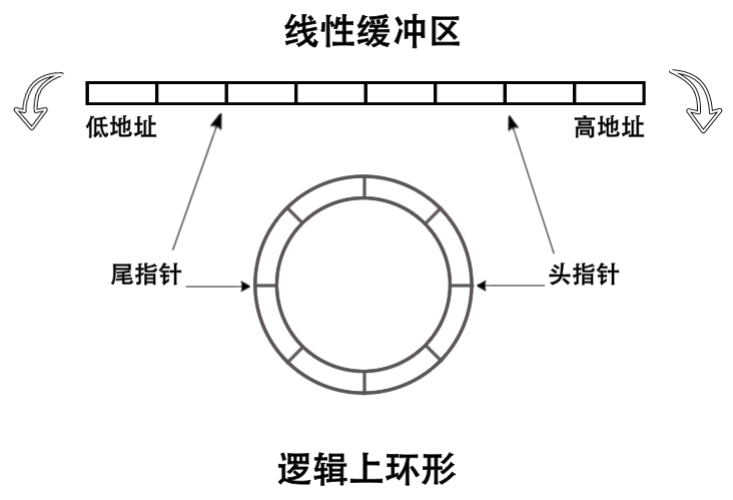
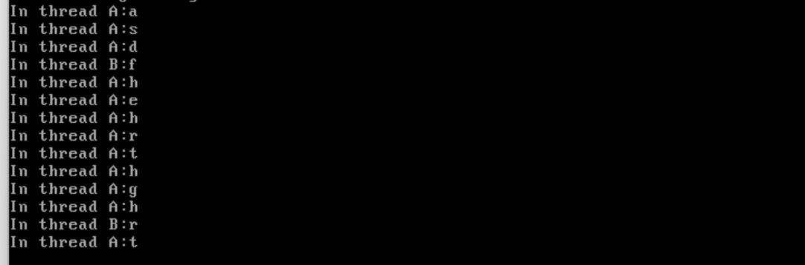

# 使用环状缓冲区来让我们的键盘驱动真正的有作用起来

​	然而，上面的驱动程序，我相信不少朋友发现毛病了——那就是他是处理完一个字符之后，就迅速的扔掉，没法找到了。换而言之，我们需要一个缓冲区，让我们可以记住用户之前输入了什么。这不，环状缓冲区就来了。

​	缓冲区就是为了解决生产者和消费者问题而存在的，想象一下。笔者之前跟着做一个项目的时候，我的Leader会安排给我一系列的任务，我的Leader就是生产者，他给我生产了一大堆任务，需要push我去完成，我也会及时的处理这些任务，我这个时候就充当了消费者的作用，我的任务清单，就是一个缓冲区，Leader给我加任务了，我就会去填上任务清单，我完成了，就会勾掉这个任务，也就是消费了这个任务。



​	我们的情况复杂的多，可能是一堆Leader分派任务，让一堆我去完成。也就是——缓冲区是多个线程共同使用的共享内存，线程在并行访问它时难免会乱套，我们不能指望线程们会老老实实排好队，以串行的方式逐个使用缓冲区。缓冲区大小无关紧要，问题的关键在于缓冲区操作上，因 
最好是在缓冲区的操作方法上下功夫，保证对缓冲区是互斥访问，并且不会对其过度使用，从而确保不 会使缓冲区遭到破坏。也就是说，只要我们能够设计出合理的缓冲区操作方式，就能够解决生产者与消费 者问题。 

​	内存中的缓冲区就是用来暂存数据的一片内存区域，内存是按地址来访问的，因此内存缓冲区实际上 是线性存储。但是我们可以设计出逻辑上非线性的内存缓冲区，通过合理的操作方式可以构造出任何我们 想要的数据结构，在这里我要介绍下环形缓冲区。 环形缓冲区本质上依然是线性缓冲区，但其使用方式像环一样，没有固定的起始地址和终止地址，环 内任何地址都可以作为起始和结束。

​	对于缓冲区的访问，我们提供两个指针，一个是头指针，用于往缓冲区中写数据，另一个是尾指针，用于从缓冲区中读数据。每次通过头指针往缓冲区中写入一个数据后，使头指针加1 指向缓冲区中下一个可写入数据的地址，每次通过尾指 
针从缓冲区中读取一个数据后，使尾指针加1 指向缓冲区中下一个可读入数据的地址，也就是说，缓冲区相当于一个队列，数据在队列头被写入，在队尾处被读出。用线性空间实现这种逻辑上的环形空间，只要我们控制好头指针和尾指针的位置就好了，无论它们怎样变化，始终让它们落在缓冲区空间之内，当指针到达缓冲区的上边界后，想办法将指针置为缓冲区的下边界（通常是对缓冲区大小取模），从而使头尾指针形成回路，逻辑上实现环形缓冲区。这两个指针相当于缓冲区的游标， 在缓冲区空间内来回滑动。 

​	我们的环形缓冲区是个线性队列，队列可以用线性数据结构来实现，比如数组和链表，为了简单，咱们用数组来定义队列，实现环形缓冲区。 

​	下面就是笔者的一个实现了：

```c
#include "include/library/types.h"
#include "include/kernel/lock.h"
#include "include/settings.h"
typedef struct __cctaskstruct TaskStruct;
// kernel io buffer size
#define IO_BUF_SIZE     (32)

typedef struct{
    TaskStruct* producer;
    TaskStruct* consumer;
    CCLocker    locker;
    char        buf[IO_BUF_SIZE];
    int32_t     index_head;
    int32_t     index_tail;
}IOQueue;

void        init_IOQueue(IOQueue* ioq);
bool        ioq_full(IOQueue* ioq);
bool        ioq_empty(IOQueue* ioq);
char        ioq_getchar(IOQueue* ioq);
void        ioq_putchar(IOQueue* ioq, char byte);
uint32_t    ioq_length(IOQueue* ioq);
```

​	上面就是我们的IOQueue的签名，我们下面一一看看实现：

```c
#include "include/thread/thread.h"
#include "include/io/ioqueue.h"
#include "include/kernel/interrupt.h"
#include "include/library/types.h"
#include "include/library/kernel_assert.h"

/* Initializes the I/O queue structure */
void init_IOQueue(IOQueue* ioq) {
    lock_init(&ioq->locker);  // Initialize the lock for the I/O queue
    ioq->producer = ioq->consumer = NULL;  // Set both producer and consumer to NULL initially
    ioq->index_head = ioq->index_tail = 0; // Set the head and tail indices of the buffer to 0
}
```

​	上面的函数初始化了一个ioqueue。它首先通过 `lock_init(&ioq->locker)` 初始化队列的锁，确保对队列的访问是线程安全的。接着，它将 `producer` 和 `consumer` 指针初始化为 `NULL`，表示初始时没有生产者和消费者在等待。同时，`index_head` 和 `index_tail` 被初始化为 0，表示队列的缓冲区头部和尾部都指向缓冲区的起始位置。这个函数的作用是为 I/O 队列的后续操作做好准备，确保队列的初始状态是空的且没有线程在等待。

```c
/* Returns the next position in the circular buffer for the given position */
static int32_t next_pos(int32_t pos) {
    return (pos + 1) % IO_BUF_SIZE; // Wraps around when the position reaches the buffer size
}
```

​	这个纯粹是一个工具函数，实际上就是笔者说的——回换的作用。它通过 `(pos + 1) % IO_BUF_SIZE` 计算下一个位置，确保当位置达到缓冲区大小时会回绕到缓冲区的起始位置。这个函数的作用是支持队列的头部和尾部在缓冲区中循环移动，避免越界。

```c
/* Checks if the queue is full */
bool ioq_full(IOQueue* ioq) {
    KERNEL_ASSERT(get_intr_status() == INTR_OFF); // Ensure that interrupts are disabled
    return next_pos(ioq->index_head) == ioq->index_tail; // Full when head's next position is tail
}

/* Checks if the queue is empty */
bool ioq_empty(IOQueue* ioq) {
    KERNEL_ASSERT(get_intr_status() == INTR_OFF); // Ensure that interrupts are disabled
    return ioq->index_head == ioq->index_tail; // Empty when head and tail are at the same position
}
```

​	`bool ioq_full(IOQueue* ioq)` 函数用于检查队列是否已满。它首先通过 `KERNEL_ASSERT(get_intr_status() == INTR_OFF)` 确保当前中断状态是关闭的，以避免在检查队列状态时发生竞态条件。然后，它通过比较 `next_pos(ioq->index_head)` 和 `ioq->index_tail` 来判断队列是否已满。如果头部的下一个位置等于尾部的位置，则队列已满。这个函数的作用是帮助生产者在向队列中添加数据时判断是否需要等待。

​	相同的：`bool ioq_empty(IOQueue* ioq)` 函数用于检查队列是否为空。它同样通过 `KERNEL_ASSERT(get_intr_status() == INTR_OFF)` 确保中断状态是关闭的。然后，它通过比较 `ioq->index_head` 和 `ioq->index_tail` 来判断队列是否为空。如果头部和尾部的位置相同，则队列为空。这个函数的作用是帮助消费者在从队列中获取数据时判断是否需要等待。

​	下一个函数就是wait函数，这个也是一个工具函数，实际上，我们要求等待的waiter一方必须是空的，由工具函数进行填充：它首先通过 `KERNEL_ASSERT(*waiter == NULL && waiter != NULL)` 确保传入的 `waiter` 指针是有效的且当前没有线程在等待。然后，它将当前线程设置为等待者，并通过 `thread_block(TASK_BLOCKED)` 将线程阻塞，直到被唤醒。这个函数的作用是实现线程的等待机制，避免忙等待。

```c
/* Makes the current producer or consumer wait on this queue */
static void ioq_wait(TaskStruct** waiter) {
    KERNEL_ASSERT(*waiter == NULL && waiter != NULL); // Ensure that the waiter is currently unset
    *waiter = current_thread(); // Set the current thread as the waiter
    thread_block(TASK_BLOCKED); // Block the thread until it is unblocked
}
/* Wakes up a waiting producer or consumer */
static void wakeup(TaskStruct** waiter) {
    KERNEL_ASSERT(*waiter != NULL); // Ensure that there is a thread to wake up
    thread_unblock(*waiter); // Unblock the waiting thread
    *waiter = NULL; // Reset the waiter pointer to NULL
}
```

​	相反的函数就是wakeup函数。它首先通过 `KERNEL_ASSERT(*waiter != NULL)` 确保有线程在等待。然后，它通过 `thread_unblock(*waiter)` 唤醒等待的线程，并将 `waiter` 指针重置为 `NULL`。这个函数的作用是实现线程的唤醒机制，确保等待的线程能够继续执行。

```c
/* Retrieves a character from the I/O queue (used by consumers) */
char ioq_getchar(IOQueue* ioq) {
    KERNEL_ASSERT(get_intr_status() == INTR_OFF); // Ensure that interrupts are disabled

    // If the queue is empty, the consumer will wait
    while (ioq_empty(ioq)) {
        lock_acquire(&ioq->locker); // Acquire the queue lock
        ioq_wait(&ioq->consumer);  // Wait until the producer provides data
        lock_release(&ioq->locker); // Release the lock
    }

    char byte = ioq->buf[ioq->index_tail]; // Get the character at the tail index
    ioq->index_tail = next_pos(ioq->index_tail); // Move the tail index to the next position

    // If there is a waiting producer, wake it up
    if (ioq->producer != NULL) {
        wakeup(&ioq->producer);
    }

    return byte; // Return the retrieved character
}

/* Adds a character to the I/O queue (used by producers) */
void ioq_putchar(IOQueue* ioq, char byte) {
    KERNEL_ASSERT(get_intr_status() == INTR_OFF); // Ensure that interrupts are disabled

    // If the queue is full, the producer will wait
    while (ioq_full(ioq)) {
        lock_acquire(&ioq->locker); // Acquire the queue lock
        ioq_wait(&ioq->producer);  // Wait until the consumer consumes data
        lock_release(&ioq->locker); // Release the lock
    }

    ioq->buf[ioq->index_head] = byte; // Add the character to the buffer at the head index
    ioq->index_head = next_pos(ioq->index_head); // Move the head index to the next position

    // If there is a waiting consumer, wake it up
    if (ioq->consumer != NULL) {
        wakeup(&ioq->consumer);
    }
}
```

​	`char ioq_getchar(IOQueue* ioq)` 和`void ioq_putchar(IOQueue* ioq, char byte)` 是我们的接口函数，第一个函数用于从 I/O 队列中获取一个字符，通常由消费者调用。它首先通过 `KERNEL_ASSERT(get_intr_status() == INTR_OFF)` 确保中断状态是关闭的。如果队列为空，消费者会通过 `lock_acquire(&ioq->locker)` 获取队列锁，并调用 `ioq_wait(&ioq->consumer)` 进入等待状态，直到生产者提供数据。当队列不为空时，消费者从 `ioq->buf[ioq->index_tail]` 中获取字符，并将 `index_tail` 移动到下一个位置。如果此时有等待的生产者，消费者会调用 `wakeup(&ioq->producer)` 唤醒生产者。最后，函数返回获取的字符。这个函数的作用是实现消费者从队列中安全地获取数据。

​	第二个函数，用于向 I/O 队列中添加一个字符，通常由生产者调用。它首先通过 `KERNEL_ASSERT(get_intr_status() == INTR_OFF)` 确保中断状态是关闭的。如果队列已满，生产者会通过 `lock_acquire(&ioq->locker)` 获取队列锁，并调用 `ioq_wait(&ioq->producer)` 进入等待状态，直到消费者消费数据。当队列未满时，生产者将字符添加到 `ioq->buf[ioq->index_head]` 中，并将 `index_head` 移动到下一个位置。如果此时有等待的消费者，生产者会调用 `wakeup(&ioq->consumer)` 唤醒消费者。这个函数的作用是实现生产者向队列中安全地添加数据。

​	最后一个是获取我们的ioqueue的长度的函数，它通过比较 `index_head` 和 `index_tail` 的位置来计算长度。如果 `index_head` 大于或等于 `index_tail`，则长度为 `index_head - index_tail`；否则，长度为 `IO_BUF_SIZE - (ioq->index_tail - ioq->index_head)`，即处理缓冲区回绕的情况。这个函数的作用是提供队列中当前数据的长度信息，便于调试或状态检查。

```c
/* Returns the current length of the circular buffer */
uint32_t ioq_length(IOQueue* ioq) {
    uint32_t len = 0;

    // Calculate the length based on the position of head and tail indices
    if (ioq->index_head >= ioq->index_tail) {
        len = ioq->index_head - ioq->index_tail; // Simple subtraction when head is ahead of tail
    } else {
        len = IO_BUF_SIZE - (ioq->index_tail - ioq->index_head); // Wrap around case
    }

    return len; // Return the length of the buffer
}
```

## 修订我们的程序

```c
        // Add the character to the buffer if it is not null
        if (cur_char) {
            if (!ioq_full(&keyboard_ringbuffer)){
                // working as temp, test producer
                // __ccos_putchar(cur_char);
                ioq_putchar(&keyboard_ringbuffer, cur_char); 
            }
           return;
        }
```

​	我们换下来驱动程序中直接输出字符的部分，当然，为了测试我们的缓冲区也没有起作用，可以解开`__ccos_putchar(cur_char);`的注释，不然的话，多少没啥现象没意思。

​	程序的现象就不截图了，实际上就是达到满的时候直接无法输出字符了。因为进不去putchar的逻辑。

## 下一步，我们测试一下生产消费环境

​	尽管实际的测试要在我们搓shell的时候才能看到，但是笔者打算建立一个测试环境：

​	为了测试键盘驱动，咱们目前只打开了键盘中断，为了让消费者线程能够上处理器运行，现在必须要 打开时钟中断。修改下 interrupt.c，将时钟中断和键盘中断都打开

```c
    // Mask interrupts to disable all IRQs
    outb(PCI_MASTER_DATA_PORT, 0xfc);      // Mask all IRQs on the master PIC (set bit 0)
    outb(PCI_SLAVE_DATA_PORT, 0xff);       // Mask all IRQs on the slave PIC (set all bits)
```

​	来看看Main的部分

```c
#include "include/device/console_tty.h"
#include "include/kernel/init.h"
#include "include/library/kernel_assert.h"
#include "include/memory/memory.h"
#include "include/thread/thread.h"
#include "include/kernel/interrupt.h"
#include "include/device/keyboard.h"
void thread_a(void *args);
void thread_b(void *args);
int main(void)
{
    init_all();
    thread_start("k_thread_a", 31, thread_a, "In thread A:");
    thread_start("k_thread_b", 16, thread_b, "In thread B:");
    interrupt_enabled();
    while (1)
    {}
}

void thread_a(void* args){
    while(1){
        Interrupt_Status old_status = set_intr_status(INTR_OFF); 
        char* arg = (char*)args;
        if (!ioq_empty(&keyboard_ringbuffer)) {
            console_ccos_puts(arg);
            char byte = ioq_getchar(&keyboard_ringbuffer);
            console__ccos_putchar(byte);
            console__ccos_putchar('\n');
        }
        set_intr_status(old_status);
    }
    
}

void thread_b(void* args){
    while(1){
        Interrupt_Status old_status = set_intr_status(INTR_OFF); 
        char* arg = (char*)args;
        if (!ioq_empty(&keyboard_ringbuffer)) {
            console_ccos_puts(arg);
            char byte = ioq_getchar(&keyboard_ringbuffer);
            console__ccos_putchar(byte);
            console__ccos_putchar('\n');
        }
        set_intr_status(old_status);
    }
}
```



​	Over!

## 下一篇

[实现TSS](../10_Implement_User_Thread/10.1_implement_tss.md)
