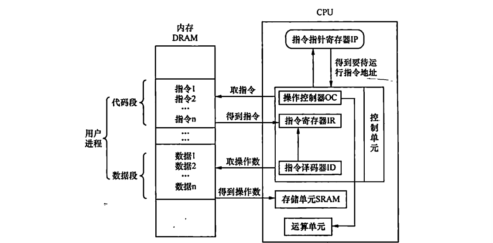

# Real Mode Introductions

​	本部分的额外内容是配合我们的2.2小节的实模式开始的，笔者打算简单的介绍一下实模式这个东西。

​	实模式就是CPU的一种工作模式。与之相对的一个经典的模式是保护模式，关于保护模式，我们会在加载器准备操作系统的时候开启，这里先不谈论。

​	CPU是一个这样的器件，我们提供一系列的流水线一般的指令，他解码指令，做这个指令蕴含含义的操作——去其他地方拿到操作数，按照给定的指令对操作数操作，然后放到一个地方进行存储

​	这幅图是笔者在《操作系统真相还原》中截取的，我们的CPU就是在这样的逻辑框图下完成对指令的执行，这台机器才进行正常的周转。

​	为了配合CPU进行工作，我们提供了若干的寄存器，存储CPU将会使用的，使用时的中介，以及结束运算的结果的一个存储的介质。一般而言，结合IA32手册，我们会有如下的两大类寄存器

1. 对程序员可见的寄存器——也就是可见寄存器，他们包含了经典的通用寄存器和段寄存器。（当然现在你去翻阅IA32和衍生的x86-64架构的手册，实际上现在的CPU的工作方式已经发生了不小的变化，段寄存器实际上已经不被在现代的架构中采用了，只是为了出于兼容性进行保留）
2. 对程序员不可见的寄存器，我们没办法直接对这样的寄存器进行编程，需要通过一定的中转，比如说我们的GDTR寄存器（存放全局描述符表的寄存器），LDTR（存放局部描述符的寄存器），标志寄存器（16位下是FLAGS寄存器，32位和64位是EFLGAS寄存器，设置CPU的工作状态使用的寄存器，CS和IP寄存器用于表示执行流，还有其他的控制寄存器等等），我们只能使用特定的指令进行访问而不可以随意的使用诸如mov等的指令直接对这些寄存器进行操作

## 通用寄存器

​	IA32下，可以使用的寄存器个数不多，相对于其他架构和它自身的衍生64位x86-64架构，那简直可以说是非常的囧破了。就八个寄存器。

| 15   | 7    | 0    |
| ---- | ---- | ---- |
| AH   | AL   | AX   |
| BH   | BL   | BX   |
| CH   | CL   | CX   |
| DH   | DL   | DX   |
| SI   |      |      |
| DI   |      |      |
| BP   |      |      |
| SP   |      |      |

​	你可以看到，我们的寄存器就是这个8个，其中AX-DX是为了兼容8位CPU时代的CPU而设置的高低寄存器。

### 每一个寄存器的功能

​	我少废话，直接看表。

| 寄存器 | 助记名称                            | 功能描述                                                     |
| ------ | ----------------------------------- | ------------------------------------------------------------ |
| ax     | 累加器（accumulator）               | 使用频度最高，常用于算术运算、逻辑运算、保存与外设输入输出的数据 |
| bx     | 基址寄存器（base）                  | 常用来存储内存地址，用此地址作为基址，用来遍历一片内存区域   |
| cx     | 计数器（counter）                   | 顾名思义，计数器的作用就是计数，所以常用于循环指令中的循环次数 |
| dx     | 数据寄存器（data）                  | 可用于存放数据，通常情况下只用于保存外设控制器的端口号地址   |
| si     | 源变址寄存器（source index）        | 常用于字符串操作中的数据源地址，即被传送的数据在哪里。通常需要与其他指令配合使用，如批量数据传送指令族movs[bwd] |
| di     | 目的变址寄存器（destination index） | 和si一样，常用于字符串操作。但di是用于数据的目的地址，即数据被传送到哪里 |
| sp     | 栈指针寄存器（stack pointer）       | 其段基址是SS，用来指向栈顶。随着栈中数据的进出，push和pop这两个对栈操作的指令会修改sp的值 |
| bp     | 基址指针（base pointer）            | 访问栈有两种方式，一种是用push和pop指令操作栈，sp指针的值会自动更新，但我们只能获取栈顶sp指针指向的数据。很多时候，我们需要读写在栈底和栈顶之间的数据，处理器为了让开发人员方便控制栈中数据，还提供了把栈当成数据段来访问的方式，即提供了寄存器bp，所以bp默认的段寄存器就是SS，可通过SS：bp的方式把栈当成普通的数据段来访问，只不过bp不像sp那样随push、pop自动改变 |

​	请记住我们每一个寄存器的常见用途，当然，忘记了可以自己来这个文档查表。

## 谈论分段机制

​	现在，实际上已经很少看到分段寄存器的直接使用了，毕竟这个机制是在我们的硬件资源非常匮乏的几十年前发明的，现在还存在不过是为了兼容。

​	早期，CPU使用的地址都是裸奔的，换而言之，你访问啥，那个地方就是啥，没有做任何中间的隔离抽象。所以说，只要我们的地方上存在另一个程序，使用硬编码地址的程序就要挂掉等待上一个程序执行结束！太折磨了，写一个程序还要担心我们的地址上有没有程序在运行，所以，Intel引入了一个分段技术——使用一个段作为基址，偏移量访问的机制，只需要更改我们程序的基址，整个程序就会在内存海洋中漂移防止跟其他程序撞车。

## 其他的部分等待笔者的补充