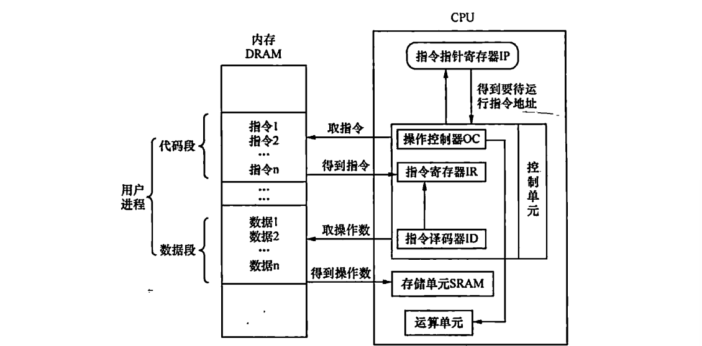

# Real Mode Introductions

​	本部分的额外内容是配合我们的2.2小节的实模式开始的，笔者打算简单的介绍一下实模式这个东西。

​	实模式就是CPU的一种工作模式。与之相对的一个经典的模式是保护模式，关于保护模式，我们会在加载器准备操作系统的时候开启，这里先不谈论。

​	CPU是一个这样的器件，我们提供一系列的流水线一般的指令，他解码指令，做这个指令蕴含含义的操作——去其他地方拿到操作数，按照给定的指令对操作数操作，然后放到一个地方进行存储



​	这幅图是笔者在《操作系统真相还原》中截取的，我们的CPU就是在这样的逻辑框图下完成对指令的执行，这台机器才进行正常的周转。

​	为了配合CPU进行工作，我们提供了若干的寄存器，存储CPU将会使用的，使用时的中介，以及结束运算的结果的一个存储的介质。一般而言，结合IA32手册，我们会有如下的两大类寄存器

1. 对程序员可见的寄存器——也就是可见寄存器，他们包含了经典的通用寄存器和段寄存器。（当然现在你去翻阅IA32和衍生的x86-64架构的手册，实际上现在的CPU的工作方式已经发生了不小的变化，段寄存器实际上已经不被在现代的架构中采用了，只是为了出于兼容性进行保留）
2. 对程序员不可见的寄存器，我们没办法直接对这样的寄存器进行编程，需要通过一定的中转，比如说我们的GDTR寄存器（存放全局描述符表的寄存器），LDTR（存放局部描述符的寄存器），标志寄存器（16位下是FLAGS寄存器，32位和64位是EFLGAS寄存器，设置CPU的工作状态使用的寄存器，CS和IP寄存器用于表示执行流，还有其他的控制寄存器等等），我们只能使用特定的指令进行访问而不可以随意的使用诸如mov等的指令直接对这些寄存器进行操作

## 通用寄存器

​	IA32下，可以使用的寄存器个数不多，相对于其他架构和它自身的衍生64位x86-64架构，那简直可以说是非常的囧破了。就八个寄存器。

| 15   | 7    | 0    |
| ---- | ---- | ---- |
| AH   | AL   | AX   |
| BH   | BL   | BX   |
| CH   | CL   | CX   |
| DH   | DL   | DX   |
| SI   |      |      |
| DI   |      |      |
| BP   |      |      |
| SP   |      |      |

​	你可以看到，我们的寄存器就是这个8个，其中AX-DX是为了兼容8位CPU时代的CPU而设置的高低寄存器。

### 每一个寄存器的功能

​	我少废话，直接看表。

| 寄存器 | 助记名称                            | 功能描述                                                     |
| ------ | ----------------------------------- | ------------------------------------------------------------ |
| ax     | 累加器（accumulator）               | 使用频度最高，常用于算术运算、逻辑运算、保存与外设输入输出的数据 |
| bx     | 基址寄存器（base）                  | 常用来存储内存地址，用此地址作为基址，用来遍历一片内存区域   |
| cx     | 计数器（counter）                   | 顾名思义，计数器的作用就是计数，所以常用于循环指令中的循环次数 |
| dx     | 数据寄存器（data）                  | 可用于存放数据，通常情况下只用于保存外设控制器的端口号地址   |
| si     | 源变址寄存器（source index）        | 常用于字符串操作中的数据源地址，即被传送的数据在哪里。通常需要与其他指令配合使用，如批量数据传送指令族movs[bwd] |
| di     | 目的变址寄存器（destination index） | 和si一样，常用于字符串操作。但di是用于数据的目的地址，即数据被传送到哪里 |
| sp     | 栈指针寄存器（stack pointer）       | 其段基址是SS，用来指向栈顶。随着栈中数据的进出，push和pop这两个对栈操作的指令会修改sp的值 |
| bp     | 基址指针（base pointer）            | 访问栈有两种方式，一种是用push和pop指令操作栈，sp指针的值会自动更新，但我们只能获取栈顶sp指针指向的数据。很多时候，我们需要读写在栈底和栈顶之间的数据，处理器为了让开发人员方便控制栈中数据，还提供了把栈当成数据段来访问的方式，即提供了寄存器bp，所以bp默认的段寄存器就是SS，可通过SS：bp的方式把栈当成普通的数据段来访问，只不过bp不像sp那样随push、pop自动改变 |

​	请记住我们每一个寄存器的常见用途，当然，忘记了可以自己来这个文档查表。

## 谈论分段机制

​	现在，实际上已经很少看到分段寄存器的直接使用了，毕竟这个机制是在我们的硬件资源非常匮乏的几十年前发明的，现在还存在不过是为了兼容。

​	早期，CPU使用的地址都是裸奔的，换而言之，你访问啥，那个地方就是啥，没有做任何中间的隔离抽象。所以说，只要我们的地方上存在另一个程序，使用硬编码地址的程序就要挂掉等待上一个程序执行结束！太折磨了，写一个程序还要担心我们的地址上有没有程序在运行，所以，Intel引入了一个分段技术——使用一个段作为基址，偏移量访问的机制，只需要更改我们程序的基址，整个程序就会在内存海洋中漂移防止跟其他程序撞车。

## 实模式下的寻址方式

​	现在是微机原理的复习时间（笔者是电子系的，我们这边管这类底层的课程为微机原理，教授的是老毕等8086而不是计算机组成原理中的RISC-V）

​	我们知道，在x86体系中，寻址大致分为三大类

- 寄存器寻址
- 立即数寻址
- 内存寻址

​	特别的，我们后面最多打交道的就是我们的内存寻址，内存寻址分为4个部分。

1. 直接寻址
2. 基址寻址
3. 变址寻址
4. 基址变址寻址

### 寄存器寻址

​	寄存器寻址是非常简单的——我们的目标在寄存器中，所以，直接从寄存器中拿到数据，或者是往寄存器中送入数据，都算寄存器的寻址。

```
mov ax, 0x1145
mov bx, 0x1419
mov cx, bx
```

### 立即数寻址

​	立即数寻址就是在指令中！他们在指令解码的时候就会产生送到CPU当中运行。这些就是常数的最优的一种优化。直接从解码器中产生而不需要消耗时间从寄存器或者是内存中获取。

```
mov ax, 0x1145
```

​	对于操作数而言就是一个立即数的寻址。

### 内存寻址

​	这就是说，我们的操作数在内存里。但是我们都知道，内存是一块好汉的海洋，我们要拿到内存里的东西，就要给出一个地址，一个内存块的编号。所以，实际上刚刚的四种分类，是对我们如何提供内存块编号的分类

#### 直接寻址

​	直接给出我们的地址！

```
mov ax, [0x1234]
mov bx, [fs:0x1145]
```

​	也就是说，我们直白的告诉机器，直接到偏移量为0x1234的地址，取出想要的数据！问题来了，那基址是啥呢？揭晓答案：默认是DS，当然如果我们想要指定其他段基址，使用第二条语句的方式做。

#### 基址寻址

​	我们将用bx寄存器或者是以bx寄存器作为地址的起始，访问我们的内存。一个常见的，也是我们后面最重要的一个应用，就是我们内存模型中的栈。

​	栈的概念，笔者认为不需要我的介绍。我们选取一块内存来作为我们的栈，取SS寄存器的内容作为我们的栈低，SP寄存器用来衡量我们的栈顶，我们压入数据就是一个压栈的过程，请看：

```
sub sp, 2	; 将栈指针 sp 减少 2，为新的数据分配 2 字节的空间。栈是向下增长的，所以 `sp` 的值会减小。
mov sp, ax	; 将ax的内容放到刚刚sp开辟出来的内存的两个字节处
```

​	举个例子，假设初始状态：

- `sp` 的值为 `0x1000`。
- `ax` 的值为 `0x1234`。
- 栈的内存布局如下：

| 地址   | 值         |
| :----- | :--------- |
| 0x1000 | ??`<- sp`  |
| 0x0FFE | ??(未使用) |
| 0x0FFC | ??(未使用) |
| ...    | ...        |

------

##### 步骤 1: `sub sp, 2`

- `sp` 的初始值为 `0x1000`。
- 执行 `sub sp, 2` 后，`sp` 的值变为 `0x0FFE`。
- 栈的内存布局更新为：

| 地址   | 值        |
| :----- | :-------- |
| 0x1000 | ??        |
| 0x0FFE | ??        |
| 0x0FFC | ??`<- sp` |
| ...    | ...       |

------

##### 步骤 2: `mov [sp], ax`

- `ax` 的值为 `0x1234`。
- 将 `ax` 的值存储到 `sp` 指向的地址 `0x0FFE`。
- 由于 `ax` 是 16 位寄存器，它会占用 `0x0FFE` 和 `0x0FFF` 两个字节。
- 栈的内存布局更新为：

| 地址   | 值   |           |
| :----- | :--- | --------- |
| 0x1000 | ??   |           |
| 0x0FFE | 0x34 | (低字节)  |
| 0x0FFF | 0x12 | (高字节)  |
| 0x0FFC | ??   | ??`<- sp` |
| ...    | ...  |           |

下面，我们来看一个更加复杂的例子。

```
void func(int a, int b){
	int d;
}

int main(){
	func(1, 2)
}
```

​	**一般的（为什么是一般的，后面会在其他的bonus中谈到其他的参数传递的方式）**，函数调用的实现也是通过压栈进行参数的传递。我们的例子中不考虑函数如何返回。假设我们的esp指向的是0x1002。

```
+-------------------+-------------------+-------------------+
| 操作              | sp 的值           | 栈内存变化        |
+-------------------+-------------------+-------------------+
| 初始状态          | 0x1002            | 0x1002: <- sp	  	|
|                   |                   | 0x0FFE: (未使用)  |
|                   |                   | 0x0FFC: (未使用)  |
+-------------------+-------------------+-------------------+
```

​	首先，我们的main函数调用func函数，这里，我们的func函数需要的是两个参数，于是，我们的esp指针就要向下挪动两个int大小的单位

> ```
> sub sp, 8 ; 减少8个字节大小，腾出两个整型空间
> ```

```
+-------------------+-------------------+-------------------+
| 操作              | sp 的值           | 栈内存变化        |
+-------------------+-------------------+-------------------+
| 初始状态          | 0x0FF8            | 0x1002:   	|
|                   |                   | 0x0FFE: (未使用)  |
|                   |                   | 0x0FFC: (未使用)  |
|                   |                   | 0x0FFA: (未使用)  |
|                   |                   | 0x0FF8: <- sp	  |
+-------------------+-------------------+-------------------+
```

​	并且，传统的压栈方式是采用从右到左依次压入参数

```
+-------------------+-------------------+-------------------+
| 操作              | sp 的值           | 栈内存变化        |
+-------------------+-------------------+-------------------+
| 初始状态          | 0x0FF8            | 0x1002:   		|
|                   |                   | 0x0FFE:0000  		|
|                   |                   | 0x0FFC:0001  		|
|                   |                   | 0x0FFA:0000  		|
|                   |                   | 0x0FF8:0000 <- sp	|
+-------------------+-------------------+-------------------+
```

​	现在，我们还要知道，跳转进入函数之后还要返回，所以，我们还会再压入函数的返回地址，一般的，我们会存储在ebp中，所以把ebp的值压入栈中，然后更新现在的esp为ebp的值，ebp从此作为了我们的新的函数的栈的栈低（栈基址）

```
+-------------------+-------------------+-------------------+
| 操作              | sp 的值           | 栈内存变化        |
+-------------------+-------------------+-------------------+
| 初始状态          | 0x0FEC            | 0x1002: ???? 		|
|                   |                   | 0x0FFE:0000  		|
|                   |                   | 0x0FFC:0001  		|
|                   |                   | 0x0FFA:0000  		|
|                   |                   | 0x0FF8:0000 		|
|                   |                   | 0x0FF4:xxxx  		|
|                   |在这里是原先EBP的值 | 0x0FF0:xxxx 		  |
|                   |                   |  0x0FEC:xxxx <- sp|
+-------------------+-------------------+-------------------+
```

​	现在，我们就会跳转进入函数，我们声明了d这个新的变量，还会再压入d这个变量的值，这里不再话题，下一步就是运算函数的内容。

​	当函数运算结束之后，我们就要回复环境，准备返回上一级的调用了。首先，我们要回复我们的返回地址处，那就是将这个即将结束生命的func函数的栈的栈低0x0FF0地址上的值取出来。在那之前，他一直存放在我们压入栈的栈低上。办法也很简单。现在的栈低上存放上一个函数的地址，而现在我们的函数的栈底放在ebp中，所以，只需要：

```
mov esp, ebp
```

后，恢复我们的ebp：

```
pop ebp
```

​	现在我们就清理了栈，然后最后就是将函数参数的占用空间也回收了：

```
add esp, 8
```

​	这样我们就恢复了原状。

## 实模式下的 call 和 ret

​	我们的call和ret是一对。当我们call了一个标签的时候，就说明它终将返回回来，至少意图如此！所以，标志程序流应该返回的时候，我们就会使用ret大回旋回旋回调用处。

​	注意的是——call far和ret far是一对，call和ret是一对，前者压入的是段基址和偏移量，后者只认为程序在同一个段中，所以只压入偏移量。

## 实模式的jmp

​	jmp则是无条件的跳转，一般的，我们会用在循环中，跳回起始部分；或者，跳到其他的程序流中一去不复返。

1. **直接绝对地址跳转**
   直接指定目标的内存地址。例如：`jmp 0x00401000`，跳转到内存地址 `0x00401000`。
2. **寄存器间接跳转**
   使用寄存器中存储的地址作为跳转目标。例如：`jmp eax`，跳转到 `eax` 寄存器中存储的地址。
3. **内存间接跳转**
   使用内存中存储的地址作为跳转目标。例如：`jmp [0x00401000]`，从内存地址 `0x00401000` 处读取一个地址并跳转。
4. **相对地址跳转**
   使用相对于当前指令指针（`EIP` 或 `RIP`）的偏移量作为跳转目标。例如：`jmp short 0x10`，跳转到当前指令指针加上 `0x10` 的地址。
5. **段间跳转（Far Jump）**
   在分段内存模型中，跳转到另一个代码段的地址。例如：`jmp 0x1000:0x2000`，跳转到段地址 `0x1000` 和偏移量 `0x2000` 处。
6. **段内跳转（Near Jump）**
   在当前代码段内跳转，仅修改指令指针（`EIP` 或 `RIP`），不修改段寄存器。
7. **间接远跳转**
   使用内存中存储的段地址和偏移量作为跳转目标。例如：`jmp far [0x00401000]`，从内存地址 `0x00401000` 处读取段地址和偏移量并跳转。
8. **条件跳转**
   虽然 `jmp` 是无条件跳转，但与之相关的条件跳转指令（如 `je`、`jne` 等）也使用类似的地址分类，但跳转取决于标志寄存器的状态。当然，这样的跳转的表格在这里。

| 转移指令    | 条件          | 意义                         | 英文助记                                |
| ----------- | ------------- | ---------------------------- | --------------------------------------- |
| jz/jc       | ZF=1          | 相减结果等于0/相等时转移     | Jump if Zero/Equal                      |
| jnz/jne     | ZF=0          | 不等于0/不相等时转移         | Jump if Not Zero/Not Equal              |
| js          | SF=1          | 负数时转移                   | Jump if Sign                            |
| jns         | SF=0          | 正数时转移                   | Jump if Not Sign                        |
| jo          | OF=1          | 溢出时转移                   | Jump if Overflow                        |
| jno         | OF=0          | 未溢出时转移                 | Jump if Not Overflow                    |
| jp/jpe      | PF=1          | 低字节中有偶数个1时转移      | Jump if Parity/Parity Even              |
| jnp/jpo     | PF=0          | 低字节中有奇数个1时转移      | Jump if Not Parity/Parity Odd           |
| jbe/jna     | CF=1 或 ZF=1  | 小于等于/不大于时转移        | Jump if Below or Equal/Not Above        |
| jnbe/ja     | CF=ZF=0       | 不小于等于/大于时转移        | Jump if Not Below or Equal/Above        |
| jc/jb/jnae  | CF=1          | 进位/小于/不大于等于时转移   | Jump if Carry/Below/Not Above Equal     |
| jnc/jnb/jae | CF=0          | 未进位/不小于/大于等于时转移 | Jump if Not Carry/Not Below/Above Equal |
| jl/jnge     | SF≠OF         | 小于/不大于等于时转移        | Jump Less/Not Great Equal               |
| jnl/jge     | SF=OF         | 不小于/大于等于时转移        | Jump if Not Less/Great Equal            |
| jle/jng     | ZF=1 或 SF≠OF | 小于等于/不大于时转移        | Jump if Less or Equal/Not Great         |
| jnle/jg     | SF=OF 且 ZF=0 | 不小于等于/大于时转移        | Jump Not Less Equal/Great               |
| jcxz        | CX 寄存器值=0 | CX 寄存器值为0时转移         | Jump if register CX's value is Zero     |

## FLAGS寄存器

| 位   | 标志位名称 | 描述                                                         |
| ---- | ---------- | ------------------------------------------------------------ |
| 0    | CF         | 进位标志（Carry Flag）：表示无符号数运算的进位或借位。       |
| 1    | PF         | 奇偶标志（Parity Flag）：表示结果的最低有效字节中 1 的个数是否为偶数。 |
| 2    | AF         | 辅助进位标志（Auxiliary Carry Flag）：用于 BCD 运算。        |
| 3    | ZF         | 零标志（Zero Flag）：表示运算结果是否为零。                  |
| 4    | SF         | 符号标志（Sign Flag）：表示运算结果的符号（正或负）。        |
| 5    | TF         | 陷阱标志（Trap Flag）：用于单步调试。                        |
| 6    | IF         | 中断使能标志（Interrupt Enable Flag）：控制是否响应可屏蔽中断。 |
| 7    | DF         | 方向标志（Direction Flag）：控制字符串操作的方向（递增或递减）。 |
| 8    | OF         | 溢出标志（Overflow Flag）：表示有符号数运算是否溢出。        |
| 9    | IOPL       | I/O 特权级别（I/O Privilege Level）：控制 I/O 指令的执行权限。 |
| 10   | NT         | 嵌套任务标志（Nested Task Flag）：表示当前任务是否嵌套。     |
| 11   | RF         | 恢复标志（Resume Flag）：用于调试异常处理。                  |
| 12   | VM         | 虚拟 8086 模式标志（Virtual 8086 Mode Flag）：启用虚拟 8086 模式。 |
| 13   | AC         | 对齐检查标志（Alignment Check Flag）：启用内存对齐检查。     |
| 14   | VIF        | 虚拟中断标志（Virtual Interrupt Flag）：虚拟模式下的中断标志。 |
| 15   | VIP        | 虚拟中断挂起标志（Virtual Interrupt Pending Flag）：虚拟模式下的中断挂起。 |
| 16   | ID         | ID 标志（ID Flag）：表示 CPU 是否支持 CPUID 指令。           |