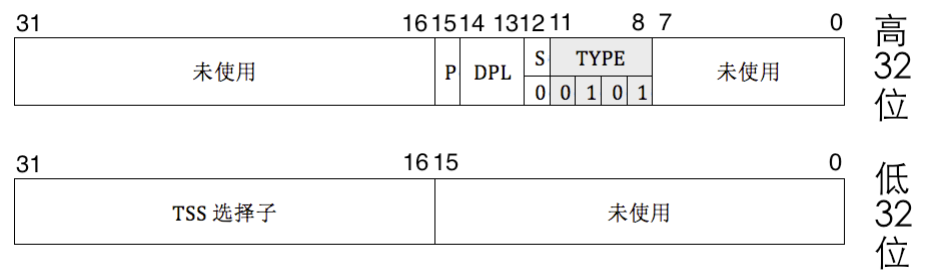
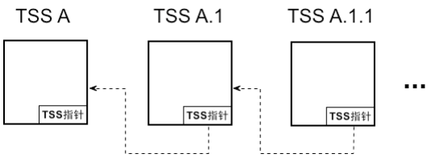

#  CPU 原生支持的任务切换方式 

​	我们说说Intel计划的CPU切换任务的想法。

​	为了支持多任务，CPU 厂商提供了LDT 及TSS 这两种原生支持，他们要求为每一个任务分 别配一个LDT 及TSS（这由咱们程序员来构建），LDT 中保存的是任务自己的实体资源，也就是数据和代码，TSS 中保存的是任务的上下文状态及三种特权级的栈指针、I/O 位图等信息。

​	既然LDT 和TSS 用来表示一个任务，那么任务切换就是换这两个结构：将新任务对应的LDT 信息加载到LDTR 寄存器。对应的TSS 信息加载到TR 寄存器。下面我们看看CPU 是怎样进行任务切换的。 

​	TSS 被 CPU 用于保存任务的状态及任务状态的恢复，而 LDT 是任务的实体资源，CPU 厂商只是建议这样做，其实没有 LDT 的话也是可以的。比如我们可以把任务自己的段描述符放在 GDT 中，或者干脆采用平坦模型直接用 4GB 大小的全局描述符。任务的段放在 GDT，还是 LDT 中，无非就是在用选择子选择它们时有区别，就是选择子中TI 位的取值，0 是从 GDT 中选择段描述符，1 是从 LDT中选择段描述符。描述符及描述符表只是逻辑上对内存区域的划分（当然这也包括其他各种属性，但对此来说并不重要），**任务要想执行，归根结底都是用 CS:[E]ip 指向这个任务的代码段内存区域以及 DS 指向其数据段内存区域，所以任务私有的实体资源不是必须放在它自己的 LDT 中。** 

​	综上所述，LDT 是可有可无的，真正用于区分一个任务的标志是 TSS，所以用于任务切换的根本方法必然是和任务的 TSS 选择子相关。

​	进行任务切换的方式有“中断+任务门”，“call 或 jmp+任务门”和 iretd

#### 方式一：中断+任务门

​	咱们的目前的内核线程切换中用的就是时钟中断。中断是定时发生的，因此用中断进行任务切换的好处是明显的。 

- 实现简单。 
- 抢占式多任务调度，所有任务都有运行的机会。



​	您看，任务门描述符中的内容是 TSS 选择子，任务门描述符也是系统段，因此S的值为0，在S 为0的情况下，TYPE 的值为 0101 时，就表示此描述符是任务门描述符。 

​	中断是任何时候都会发生的，任务在执行时都会被中断信号打断，在中断描述符表中的描述符可以是中断门、陷阱门、任务门，所以，当前任务被中断后，要么是去执行中断处理程序，要么是进行任务切换。

​	当中断发生时，处理器通过中断向量号在IDT 中找到描述符后，通过分析描述符中字段S 和字段TYPE 的组合，判断描述符的类型。 

​	若发现此中断对应的描述符是中断门描述符，则转而去执行此中断门描述符中指定的中断处理例程。在中断处理程序的最后，通过 iretd 指令返回到被中断任务的中断前的代码处。若发现中断对应的是门描述符，此时便进行任务切换。

#### 方式2：iretd

​	之前咱们讨论过，一个完整的任务包括用户空间代码及内核空间代码，这两种代码加起来才是任务，另外，在 CPU 眼里，一个 TSS 就代表一个任务，TSS 才是任务的标志，CPU 区分任务就是靠TSS，因此，只要 TR 寄存器中的TSS 信息不换，无论执行的是哪里的指令，也无论指令是否跨越特权级（从用户态到内核态），CPU 都认为还是在同一个任务中。 咱们平时所写的程序代码都只是用户态代码，对于完整的任务来说它属于半成品。用户代码和内核代码只是同一个任务的不同部分而已。中断处理例程属于内核代码，因此它也属于当前的任务，当在中断处理例程中执行 iretd 指令从中断返回后，是返回到当前任务在中断前的代码处，依然属于当前任务，只是返回到了当前任务的不同部分。 

​	之前咱们接触中断时，我们已了解 iretd 指令用于从中断处理例程中返回，其实这只是它的一个功能， 它一共有两个功能。 

- 从中断返回到当前任务的中断前代码处。 
- 当前任务是被嵌套调用时，它会调用自己 TSS 中“上一个任务的 TSS 指针”的任务，也就是返回到上一个任务。 

​	一个指令在不同环境下具备不同的功能，有时候这很容易引起混淆，现在模拟一下这个情况就知道了， 当中断发生时，假设当前任务 A 被中断，CPU 进入中断后，它有可能的动作是： 

- 假设是中断门或陷阱门，执行完中断处理例程后是用 iretd 指令返回到任务A 中断前的指令部分。 
- 假设是任务门，进行任务切换，此时是嵌套调用任务 B，任务 B 在执行期间又发生了中断，进入了对应的中断门，当执行完对应的中断处理程序后，用 iretd 指令返回。 
- 同样假设是任务门，任务A 调用任务 B 执行，任务 B 执行完成后要通过 iretd 指令返回到任务A，使任务 A 继续完成后续的指令。 

​	那，咱们咋区分呢？看eflags 中的 NT 位和 TSS 中的“上一个任务的 TSS 指针”字段。NT 位是 eflags 中的第14 位，1bit 的宽度，它表示Nest Task Flag，任务嵌套。任务嵌套是指当前任务是被前一个任务调用后才执行的，也就是当前任务嵌套于另一个任务中，相当于另一个任务的子任务，在 此任务执行完成后还要回到前一个任务，使其继续执行。这一点类似于我们在函数 A 中调用一个子函数Ac，子函数 Ac 执行完成后还是要回到函数 A 中。TSS 的字段“上一个任务的 TSS 指针”，用于记录是哪个任务调用了当前任务，有些类似于“父任务”，此字段中的值是TSS 的地址，因此它就形成了任务嵌套关系的单向链表，每个TSS 属于链表中的结点，CPU用此链表来记录任务的嵌套调用关系。



​	当调用一个新任务时，处理器做了两件准备工作。

1. 自动将新任务eflags 中的NT 位置为1，这就表示新任务能够执行的原因是被别的任务调用，也就是嵌套调用。 
2. 随后处理器将旧任务的 TSS 选择子写入新任务TSS 的“上一个任务的TSS 指针”字段中。 

​	有了上面的准备工作后，当 CPU 执行 iretd 指令时，始终要判断 NT 位的值。如果 NT 等于 1，这表示是从新任务返回到旧任务，于是 CPU 到当前任务（新任务）TSS 的“上一个任务的 TSS 指针”字段中 获取旧任务的 TSS，转而去执行旧任务。如果 NT 等于 0，这表示要回到当前任务中断前的指令部分。 强调一下，只有 NT 为 1 时，iretd 的功能才是任务调用（返回到旧任务）。 

​	所以，中断发生时，通过任务门进行任务切换的过程如下：

##### 切换任务

1. **从任务门描述符中取出任务的 TSS 选择子。**
2. **用新任务的 TSS 选择子在 GDT 中索引 TSS 描述符。**
3. **判断该 TSS 描述符的 P 位是否为 1：**
   - 为 1 表示该 TSS 描述符对应的 TSS 已经位于内存中 TSS 描述符指定的位置，可以访问。
   - 否则 P 不为 1 表示该 TSS 描述符对应的 TSS 不在内存中，这会导致异常。
4. **从寄存器 TR 中获取旧任务的 TSS 位置，保存旧任务（当前任务）的状态到旧 TSS 中。**
   - 任务状态是指 CPU 中寄存器的值，这仅包括 TSS 结构中列出的寄存器：
     - 8 个通用寄存器
     - 6 个段寄存器
     - 指令指针 eip
     - 栈指针寄存器 esp
     - 页表寄存器 cr3
     - 标志寄存器 eflags 等。
5. **把新任务的 TSS 中的值加载到相应的寄存器中。**
6. **使寄存器 TR 指向新任务的 TSS。**
7. **将新任务（当前任务）的 TSS 描述符中的 B 位置 1。**
8. **将新任务标志寄存器中 eflags 的 NT 位置 1。**
9. **将旧任务的 TSS 选择子写入新任务 TSS 中“上一个任务的 TSS 指针”字段中。**
10. **开始执行新任务。**

##### 任务嵌套调用的说明

- 在执行新任务之前，旧任务是当前的任务，因此旧任务 TSS 描述符中的 B 位为 1。
- 在调用新任务后也不会修改旧任务的 B 位，因为它尚未执行完，属于嵌套调用别的任务，并不是单独的任务。

#####  `iretd` 指令返回到旧任务

当新任务执行完成后，调用 `iretd` 指令返回到旧任务，此时处理器检查 NT 位，若其值为 1，便进行返回工作，步骤如下：

1. **将当前任务（新任务）标志寄存器中 eflags 的 NT 位置 0。**
2. **将当前任务 TSS 描述符中的 B 位置为 0。**
3. **将当前任务的状态信息写入 TR 指向的 TSS。**
4. **获取当前任务 TSS 中“上一个任务的 TSS 指针”字段的值，将其加载到 TR 中，恢复上一个任务的状态。**
5. **执行上一个任务（当前任务），从而恢复到旧任务。**

#### call、jmp 切换任务 

- 首先，任务门描述符除了可以在 IDT 中注册，还可以在 GDT 和 LDT 中注册。 
- 其次，任务以 TSS 为代表，只要包括 TSS 选择子的对象都可以作为任务切换的操作数。 

​	TSS 中已经包含了任务的详细信息，任务门描述符中又包含了TSS 选择子（似乎看来任务门很多余）， 所以它和所有的门描述符一样，使用 TSS 和任务门作为 call 和 jmp 指令操作数时，操作数中包含了偏移 量，CPU 只用选择子部分就够了，会忽略其中的偏移量部分。 

举个例子：假设任务门选择子定义在 GDT 中第 2 个描述符位置： 

```
call 0x0010:0x1234 
```

假设 TSS 选择子定义在 GDT 中第 3 个描述符位置： 

```
call 0x0018:0x1234 
```

上述两个指令中的偏移量 0x1234 都会被处理器忽略。 

​	call 指令以任务嵌套的方式调用新任务，当以 call 指令调用新任务时，我们以操作数为 TSS 选择子为例，比如“call 0x0018:0x1234”，任务切换的步骤如下。 

1. **CPU 忽略偏移量 0x1234，拿选择子 0x0018 在 GDT 中索引到第 3 个描述符。**
2. **检查描述符中的 P 位：**
   - 若 P 为 0，表示该描述符对应的段不存在，这将引发异常。
   - 同时检查该描述符的 S 与 TYPE 的值，判断其类型：
     - 如果是 TSS 描述符，检查该描述符的 B 位：
       - B 位若为 1 将抛出 GP 异常，即表示调用不可重入。
3. **进行特权级检查：**
   - 数值上“CPL 和 TSS 选择子中的 RPL”都要小于等于 TSS 描述符的 DPL。
   - 否则抛出 GP 异常。
4. **特权检查完成后，将当前任务的状态保存到寄存器 TR 指向的 TSS 中。**
5. **加载新任务 TSS 选择子到 TR 寄存器的选择器部分：**
   - 同时把 TSS 描述符中的起始地址和偏移量等属性加载到 TR 寄存器中的描述符缓冲器中。
6. **将新任务 TSS 中的寄存器数据载入到相应的寄存器中：**
   - 同时进行特权级检查，如果检查未通过，则抛出 GP 异常。
7. **CPU 会把新任务的标志寄存器 eflags 中的 NT 位置为 1。**
8. **将旧任务 TSS 选择子写入新任务 TSS 中的字段“上一个任务的 TSS 指针”中：**
   - 这表示新任务是被旧任务调用才执行的。
9. **将新任务 TSS 描述符中的 B 位置为 1 以表示任务忙：**
   - 旧任务 TSS 描述符中的 B 位不变，依然保持为 1。
   - 旧任务的标志寄存器 eflags 中的 NT 位的值保持不变，之前是多少就是多少。
10. **开始执行新任务，完成任务切换。**

#### 回顾一下

​	说完了，你发现没有，我们只是Involk一个函数都要花费这么多时间，CPU 除了做特权级检查外，还要在 TSS 的加载、保存、设置 B位，以及设置标志寄存器 eflags 的 NT 位诸多方面消耗很多精力，这导致此种切换方式效能很低

​	其次，常见的指令集有两大派系，复杂指令集 CISC 和精简指令集 RISC。x86 使用的指令集属于 CISC， 在此指令集的发展过程中，工程师为了让程序员少写代码，把指令的功能做得越发强大，因此在 RISC 中多条指令才能完成的工作，在 CISC 中只用一条指令就完成了。看上去感觉很爽的样子，但这只是开发效率上的提升，执行效率却下降了，原因是：表面强大的功能是用内部复杂、数量更多的微操作换来的，也就是说，CISC 的强大需要更多的时钟周期作为代价。虽然 Intel 提供了 call 和 jmp 指令实现任务切换，但 
这两个指令所消耗的时钟周期也是可观的！

​	最后，一个任务需要单独关联一个TSS，TSS 需要在 GDT 中注册，GDT 中最多支持8192 个描述符， 为了支持更多的任务，随着任务的增减，要及时修改 GDT，在其中增减 TSS 描述符，修改过后还要重新 加载 GDT。这种频繁修改描述符表的操作还是很消耗 CPU 资源的。 

​	以上是效率方面的原因，除了效率以外，还有便携性和灵活性等原因，不仅 Linux 未采用这种原生的 任务切换方法，而且几乎所有 x86 操作系统都未采用。 不幸的是，我们是在 CPU 制定的规则上编写程序的，因此始终脱离不了大规则的束缚，还有一件工 作必须且只能用 TSS 来完成，这就是 CPU 向更高特权级转移时所使用的栈地址，需要提前在 TSS 中写入。

​	导致转移到更高特权级的一种情况是在用户模式下发生中断，CPU 会由低特权级进入高特权级，这 会发生堆栈的切换。当一个中断发生在用户模式（特权级 3），处理器从当前 TSS 的SS0 和 esp0 成员中获 取用于处理中断的堆栈。因此，我们必须创建一个 TSS，并且至少初始化 TSS 中的这些字段。 尽管 CPU 提供了0、1、2、3 共4 个特权级，但我们效仿 Linux 只用其中的2 个，内核处理特权级0， 用户进程处于特权级 3。 

​	结论：我们使用 TSS 唯一的理由是为 0 特权级的任务提供栈。 

​	我们下面看看Linux咋做的：Linux 为每个 CPU 创建一个 TSS，在各个 CPU 上的所有任务共享同一个 TSS，各 CPU 的 TR 寄存器保存各 CPU 上的TSS，在用 ltr 指令加载TSS 后，该 TR 寄存器永远指向同一个 TSS，之后再也不会重新加载 TSS。在进程切换时，只需要把 TSS 中的 SS0 及 esp0 更新为新任务的内核栈的段地址及栈指针。 

​	您看，实际上Linux 对 TSS 的操作是一次性加载TSS 到 TR，之后不断修改同一个 TSS 的内容，不再 
进行重复加载操作。Linux 在 TSS 中只初始化了 SS0、esp0 和 I/O 位图字段，除此之外 TSS 便没用了，就是个空架子，不再做保存任务状态之用。 

​	那任务的状态信息保存在哪里呢？ 是这样的，当 CPU 由低特权级进入高特权级时，CPU 会“自动”从TSS 中获取对应高特权级的栈针（TSS 是 CPU 内部框架原生支持的嘛，当然是自动从中获取新的栈指针）。我们具体说一下，Linux 只用到了特权 3 级和特权 0 级，因此 CPU 从 3 特权级的用户态进入 0 特权级的内核态时（比如从用户进程进入中断），CPU 自动从当前任务的 TSS 中获取 SS0 和 esp0 字段的值作为0 特权级的栈，然后 Linux“手动”执行一系列的push 指令将任务的状态的保存在0 特权级栈中，也就是TSS 中SS0 和esp0 所指向的栈。要知道，人家Intel 当初是打算让 TR 寄存器指向不同任务的 TSS 以实现任务切换的，Linux 这里只换了 TSS 中的部分内容，而 TR 本身没换，还是指向同一个TSS，这种“自欺欺人”的好处是任务切换的开销更小了，因为和修改 TSS 中的内容所带来的开销相比，在 TR 中加载 TSS 的开销要大得多。您想，每次切换任务都要用 ltr 指令重新加载新任务的 TSS 到寄存器TR，TSS 是位于内存中的，而内存很慢的，随着任务数量一多，这种频繁重复加载的开销就更为“可观”。 另外，Linux 中任务切换不使用 call 和jmp 指令，这也避免了任务切换的低效。 

·	一句话：Linux就没换TSS，直接换里面的内容。