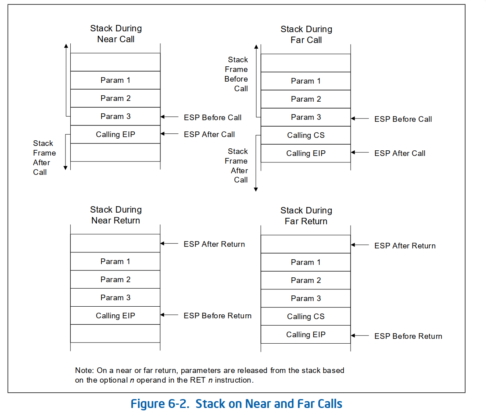
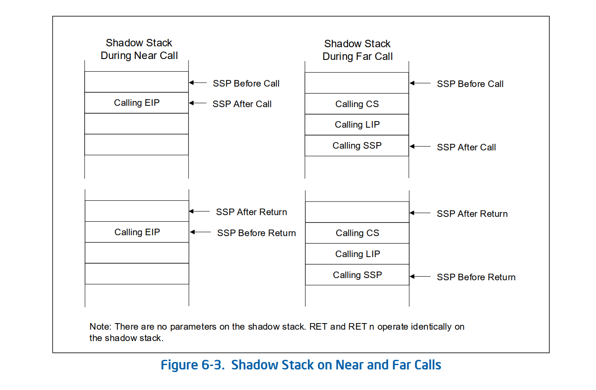
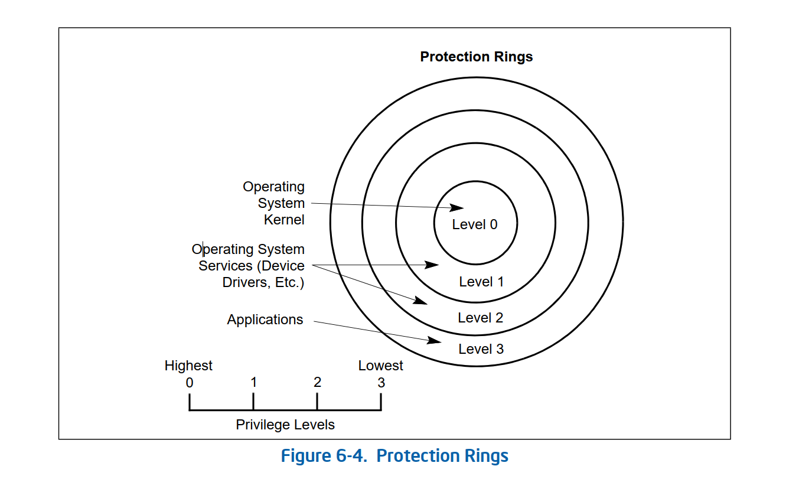
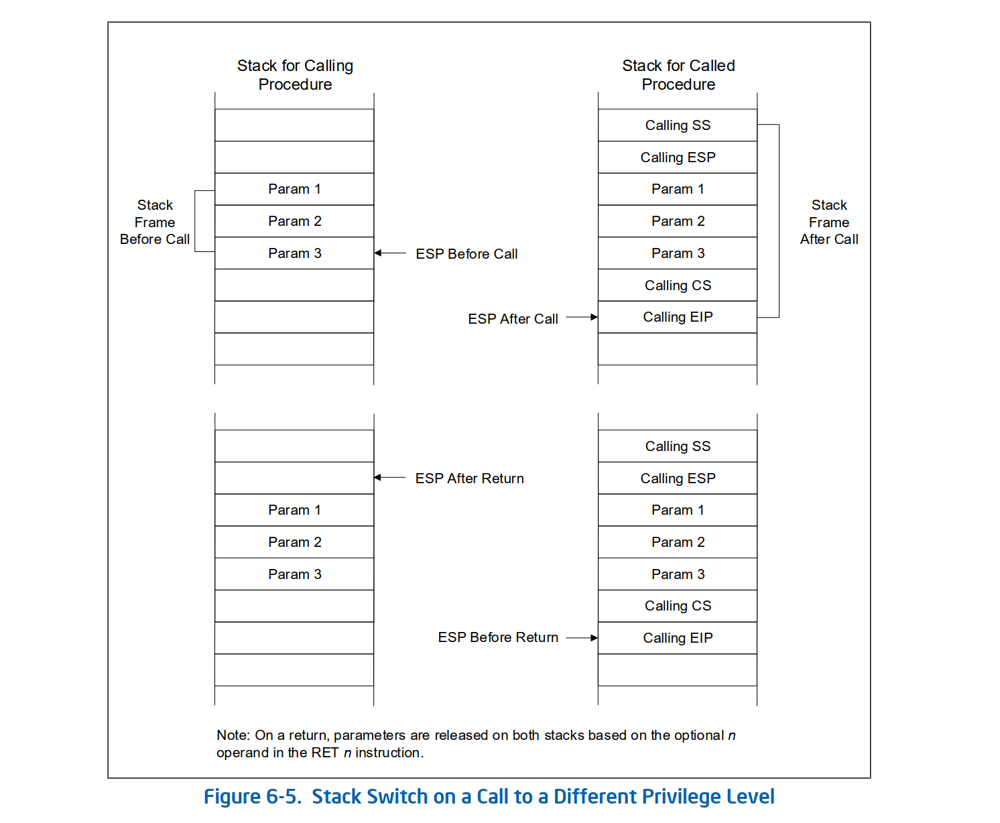
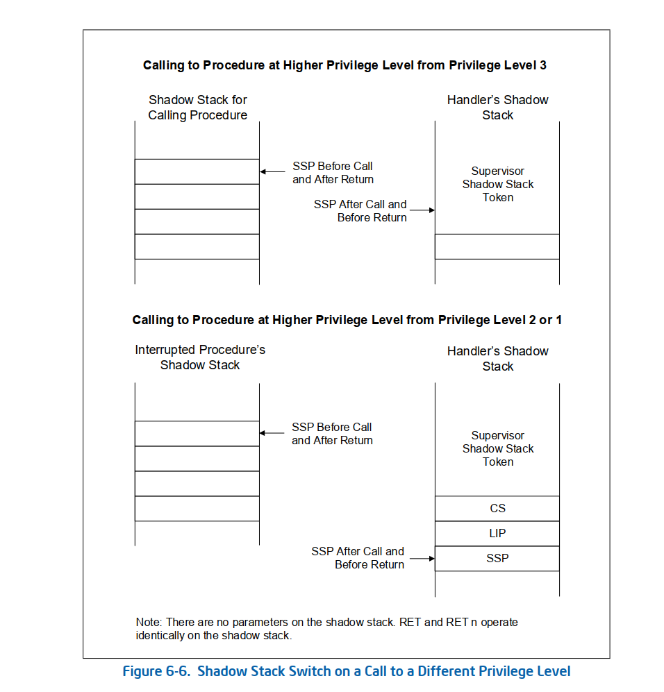

# 手册原文

# 6.4 CALLING PROCEDURES USING CALL AND RET

​	The CALL instruction allows control transfers to procedures within the current code segment (near call) and in a different code segment (far call). Near calls usually provide access to local procedures within the currently running program or task. Far calls are usually used to access operating system procedures or procedures in a different task. See “CALL—Call Procedure” in Chapter 3, “Instruction Set Reference, A-L,” of the Intel® 64 and IA-32 Architectures Software Developer’s Manual, Volume 2A, for a detailed description of the CALL instruction.The RET instruction also allows near and far returns to match the near and far versions of the CALL instruction. In addition, the RET instruction allows a program to increment the stack pointer on a return to release parameters from the stack. The number of bytes released from the stack is determined by an optional argument (n) to the RET instruction. See “RET—Return from Procedure” in Chapter 4, “Instruction Set Reference, M-U,” of the Intel® 64 and IA-32 Architectures Software Developer’s Manual, Volume 2B, for a detailed description of the RET instruction.

## 6.4.1 Near CALL and RET Operation

​	When executing a near call, the processor does the following (see Figure 6-2): 

1. Pushes the current value of the EIP register on the stack.
If shadow stack is enabled and the displacement value is not 0, pushes the current value of the EIP register on 
the shadow stack.

2. Loads the offset of the called procedure in the EIP register.
3. Begins execution of the called procedure.
When executing a near return, the processor performs these actions:
1. Pops the top-of-stack value (the return instruction pointer) into the EIP register.
If shadow stack is enabled, pops the top-of-stack (the return instruction pointer) value from the shadow stack 
and if it’s not the same as the return instruction pointer popped from the stack, then the processor causes a 
control protection exception with error code NEAR-RET (#CP(NEAR-RET)).
2. If the RET instruction has an optional n argument, increments the stack pointer by the number of bytes 
specified with the n operand to release parameters from the stack. 
3. Resumes execution of the calling procedure.

## 6.4.2 Far CALL and RET Operation

When executing a far call, the processor performs these actions (see Figure 6-2): 

1. Pushes the current value of the CS register on the stack.
    If shadow stack is enabled:
    a. Temporarily saves the current value of the SSP register internally and aligns the SSP to the next 8 byte 
    boundary.
    b. Pushes the current value of the CS register on the shadow stack.
    c. Pushes the current value of LIP (CS.base + EIP) on the shadow stack.
    d. Pushes the internally saved value of the SSP register on the shadow stack.
2. Pushes the current value of the EIP register on the stack.
3. Loads the segment selector of the segment that contains the called procedure in the CS register.
4. Loads the offset of the called procedure in the EIP register.
5. Begins execution of the called procedure.

When executing a far return, the processor does the following:

1. Pops the top-of-stack value (the return instruction pointer) into the EIP register.
2. Pops the top-of-stack value (the segment selector for the code segment being returned to) into the CS register.
   If shadow stack is enabled:
   a. Causes a control protection exception (#CP(FAR-RET/IRET)) if the SSP is not aligned to 8 bytes. 
   b. Compares the values on the shadow stack at address SSP+8 (the LIP) and SSP+16 (the CS) to the CS and 
   (CS.base + EIP) popped from the stack, and causes a control protection exception (#CP(FAR-RET/IRET)) if 
   they do not match. 
   c. Pops the top-of-stack value (the SSP of the procedure being returned to) from shadow stack into the SSP 
   register.
3. If the RET instruction has an optional n argument, increments the stack pointer by the number of bytes 
   specified with the n operand to release parameters from the stack. 
4. Resumes execution of the calling procedure.

## 6.4.3 Parameter Passing

Parameters can be passed between procedures in any of three ways: through general-purpose registers, in an argument list, or on the stack.

## 6.4.3.1 Passing Parameters Through the General-Purpose Registers

The processor does not save the state of the general-purpose registers on procedure calls. A calling procedure can thus pass up to six parameters to the called procedure by copying the parameters into any of these registers (except the ESP and EBP registers) prior to executing the CALL instruction. The called procedure can likewise pass parameters back to the calling procedure through general-purpose registers.

## 6.4.3.2 Passing Parameters on the Stack

To pass a large number of parameters to the called procedure, the parameters can be placed on the stack, in the stack frame for the calling procedure. Here, it is useful to use the stack-frame base pointer (in the EBP register) to make a frame boundary for easy access to the parameters.The stack can also be used to pass parameters back from the called procedure to the calling procedure.

## 6.4.3.3 Passing Parameters in an Argument List

An alternate method of passing a larger number of parameters (or a data structure) to the called procedure is to place the parameters in an argument list in one of the data segments in memory. A pointer to the argument list can then be passed to the called procedure through a general-purpose register or the stack. Parameters can also be passed back to the calling procedure in this same manner.

## 6.4.4 Saving Procedure State Information

The processor does not save the contents of the general-purpose registers, segment registers, or the EFLAGS register on a procedure call. A calling procedure should explicitly save the values in any of the general-purpose registers that it will need when it resumes execution after a return. These values can be saved on the stack or in memory in one of the data segments.
The PUSHA and POPA instructions facilitate saving and restoring the contents of the general-purpose registers. PUSHA pushes thevalues in all the general-purpose registers on the stack in the following order: EAX, ECX, EDX, EBX, ESP (the value prior to executing the PUSHA instruction), EBP, ESI, and EDI. The POPA instruction pops all the register values saved with a PUSHA instruction (except the ESP value) from the stack to their respective registers. If a called procedure changes the state of any of the segment registers explicitly, it should restore them to their former values before executing a return to the calling procedure.
	If a calling procedure needs to maintain the state of the EFLAGS register, it can save and restore all or part of the register using the PUSHF/PUSHFD and POPF/POPFD instructions. The PUSHF instruction pushes the lower word of the EFLAGS register on the stack, while the PUSHFD instruction pushes the entire register. The POPF instruction pops a word from the stack into the lower word of the EFLAGS register, while the POPFD instruction pops a double word from the stack into the register.

6.4.5 Calls to Other Privilege Levels
The IA-32 architecture’s protection mechanism recognizes four privilege levels, numbered from 0 to 3, where a greater number mean less privilege. The reason to use privilege levels is to improve the reliability of operating systems. For example, Figure 6-4 shows how privilege levels can be interpreted as rings of protection. 

In this example, the highest privilege level 0 (at the center of the diagram) is used for segments that contain the most critical code modules in the system, usually the kernel of an operating system. The outer rings (with progres-sively lower privileges) are used for segments that contain code modules for less critical software. Code modules in lower privilege segments can only access modules operating at higher privilege segments by means of a tightly controlled and protected interface called a gate. Attempts to access higher privilege segments without going through a protection gate and without having sufficient access rights causes a general-protection exception (#GP) to be generated.If an operating system or executive uses this multilevel protection mechanism, a call to a procedure that is in a more privileged protection level than the calling procedure is handled in a similar manner as a far call (see Section 6.4.2, “Far CALL and RET Operation”). The differences are as follows:
The segment selector provided in the CALL instruction references a special data structure called a call gate descriptor. Among other things, the call gate descriptor provides the following:
— Access rights information.
— The segment selector for the code segment of the called procedure.
— An offset into the code segment (that is, the instruction pointer for the called procedure).
The processor switches to a new stack to execute the called procedure. Each privilege level has its own stack. The segment selector and stack pointer for the privilege level 3 stack are stored in the SS and ESP registers, respectively, and are automatically saved when a call to a more privileged level occurs. The segment selectors and stack pointers for the privilege level 2, 1, and 0 stacks are stored in a system segment called the task state segment (TSS). 
	The use of a call gate and the TSS during a stack switch are transparent to the calling procedure, except when a general-protection exception is raised.

## 6.4.6 CALL and RET Operation Between Privilege Levels

When making a call to a more privileged protection level, the processor does the following (see Figure 6-5): 

1. Performs an access rights check (privilege check).
2. Temporarily saves (internally) the current contents of the SS, ESP, CS, and EIP registers.
3. Loads the segment selector and stack pointer for the new stack (that is, the stack for the privilege level being 
   called) from the TSS into the SS and ESP registers and switches to the new stack.
4. Pushes the temporarily saved SS and ESP values for the calling procedure’s stack onto the new stack.
5. Copies the parameters from the calling procedure’s stack to the new stack. A value in the call gate descriptor 
determines how many parameters to copy to the new stack.
6. Pushes the temporarily saved CS and EIP values for the calling procedure to the new stack.
If shadow stack is enabled at the privilege level of the calling procedure, then the processor temporarily saves 
the SSP of the calling procedure internally. If the calling procedure is at privilege level 3, the SSP of the calling 
procedure is also saved into the IA32_PL3_SSP MSR.

If shadow stack is enabled at the privilege level of the called procedure, then the SSP for the called procedure is obtained from one of the MSRs listed below, depending on the target privilege level. The SSP obtained is then verified to ensure it points to a valid supervisor shadow stack that is not currently active by verifying a supervisor shadow stack token at the address pointed to by the SSP. The operations performed to verify and acquire the supervisor shadow stack token by making it busy are as described in Section 18.2.3 of the Intel® 64 and IA-32 Architectures Software Developer’s Manual, Volume 1.
— IA32_PL2_SSP if transitioning to ring 2.
— IA32_PL1_SSP if transitioning to ring 1.
— IA32_PL0_SSP if transitioning to ring 0.
If shadow stack is enabled at the privilege level of the called procedure and the calling procedure was not at privilege level 3, then the processor pushes the temporarily saved CS, LIP (CS.base + EIP), and SSP of the calling procedure to the new shadow stack.1
7. Loads the segment selector for the new code segment and the new instruction pointer from the call gate into 
the CS and EIP registers, respectively.
8. Begins execution of the called procedure at the new privilege level.
When executing a return from the privileged procedure, the processor performs these actions: 
1. Performs a privilege check.
2. Restores the CS and EIP registers to their values prior to the call.
If shadow stack is enabled at the current privilege level:
— Causes a control protection exception (#CP(FAR-RET/IRET)) if SSP is not aligned to 8 bytes.
— If the privilege level of the procedure being returned to is less than 3 (returning to supervisor mode):
• Compares the values on shadow stack at address SSP+8 (the LIP) and SSP+16 (the CS) to the CS and 
(CS.base + EIP) popped from the stack and causes a control protection exception (#CP(FAR-
RET/IRET)) if they do not match. 
• Temporarily saves the top-of-stack value (the SSP of the procedure being returned to) internally.
— If a busy supervisor shadow stack token is present at address SSP+24, then marks the token free using 
operations described in Section 18.2.3 of the Intel® 64 and IA-32 Architectures Software Developer’s 
Manual, Volume 1.
— If the privilege level of the procedure being returned to is less than 3 (returning to supervisor mode), re-
stores the SSP register from the internally saved value.
— If the privilege level of the procedure being returned to is 3 (returning to user mode) and shadow stack is 
enabled at privilege level 3, then restores the SSP register with value of IA32_PL3_SSP MSR.
3. If the RET instruction has an optional n argument, increments the stack pointer by the number of bytes 
specified with the n operand to release parameters from the stack. If the call gate descriptor specifies that one 
or more parameters be copied from one stack to the other, a RET n instruction must be used to release the 
parameters from both stacks. Here, the n operand specifies the number of bytes occupied on each stack by the 
parameters. On a return, the processor increments ESP by n for each stack to step over (effectively remove) 
these parameters from the stacks.
4. Restores the SS and ESP registers to their values prior to the call, which causes a switch back to the stack of 
the calling procedure.
5. If the RET instruction has an optional n argument, increments the stack pointer by the number of bytes 
specified with the n operand to release parameters from the stack (see explanation in step 3).
6. Resumes execution of the calling procedure.
See Chapter 6, “Protection,” in the Intel® 64 and IA-32 Architectures Software Developer’s Manual, Volume 3A, for 
detailed information on calls to privileged levels and the call gate descriptor.