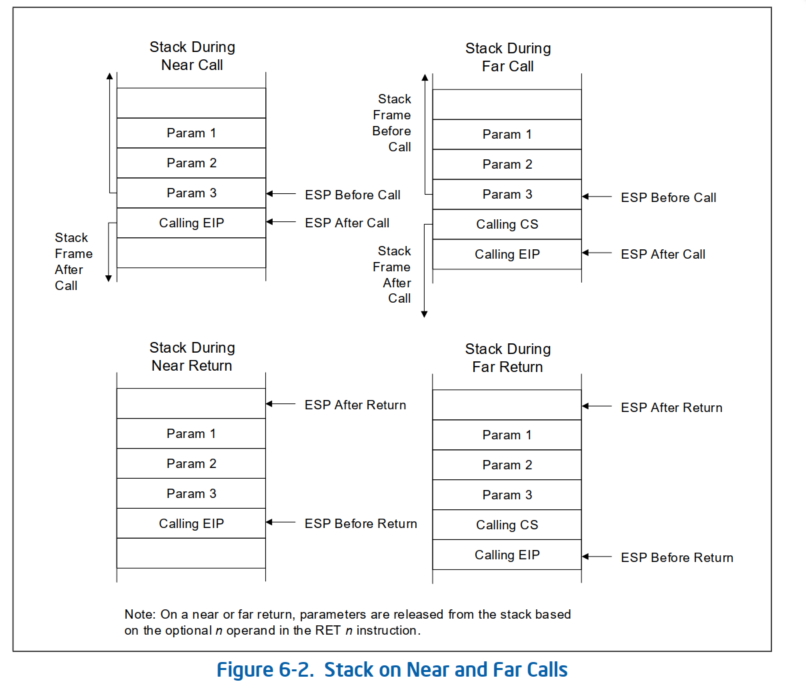
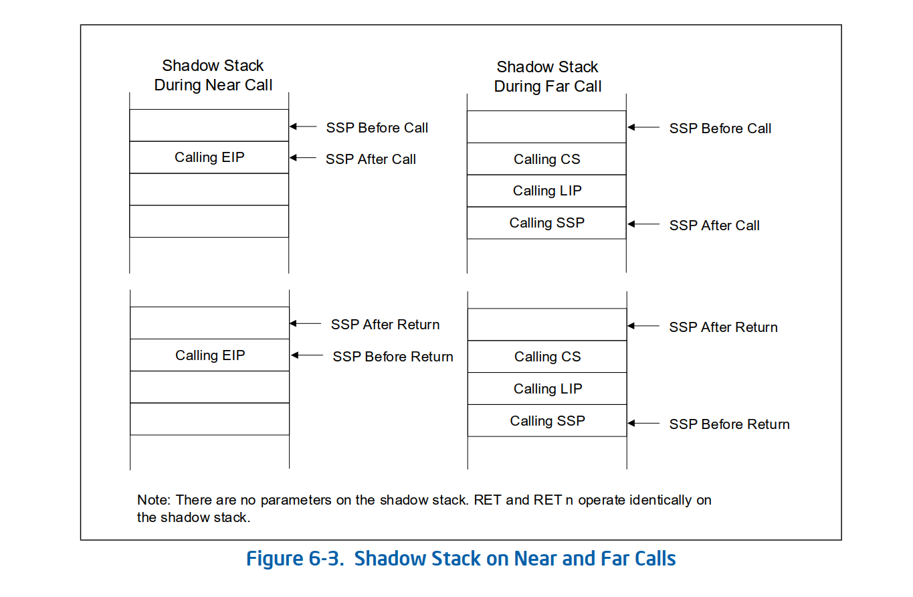
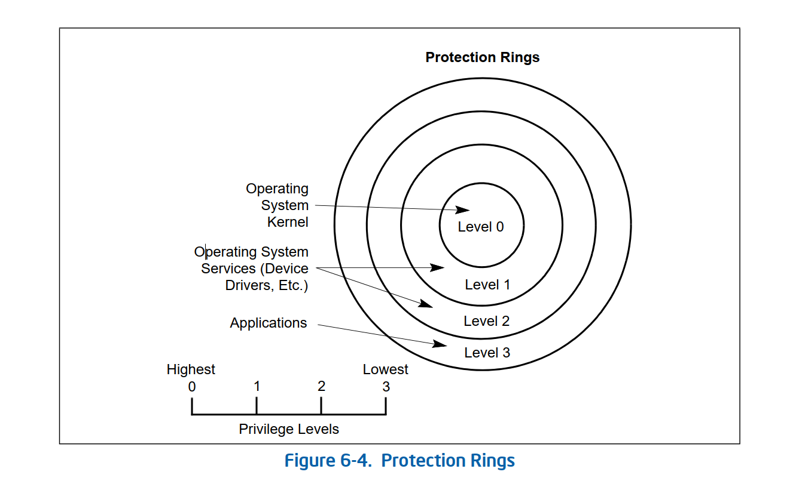
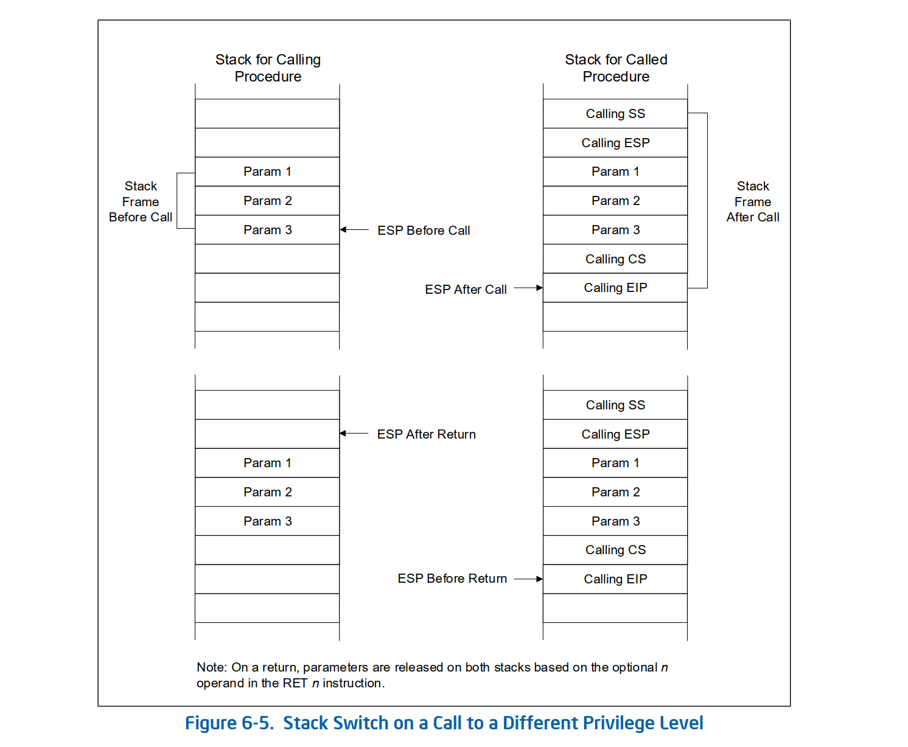
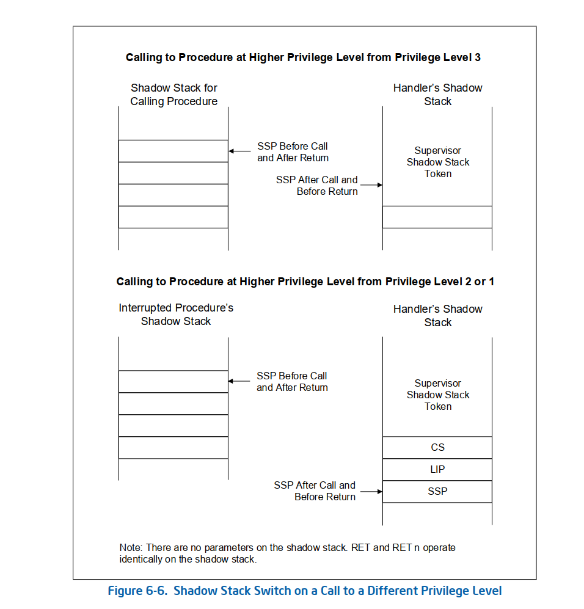

# 手册原文

# 6.4 使用 CALL 和 RET 调用过程

 CALL 指令允许将控制权转移到当前代码段（近调用）和不同代码段（远调用）中的过程。近调用通常提供对当前正在运行的程序或任务中的本地过程的访问。远调用通常用于访问操作系统过程或不同任务中的过程。有关 CALL 指令的详细描述，请参阅《英特尔® 64 和 IA-32 架构软件开发人员手册》第 2A 卷第 3 章“指令集参考，A-L”中的“CALL—调用过程”。RET 指令还允许近返回和远返回以匹配 CALL 指令的近返回和远返回版本。此外，RET 指令允许程序在返回时增加堆栈指针以从堆栈中释放参数。从堆栈中释放的字节数由 RET 指令的可选参数 (n) 决定。有关 RET 指令的详细说明，请参阅《英特尔® 64 和 IA-32 架构软件开发人员手册》第 2B 卷第 4 章“指令集参考，M-U”中的“RET—从过程返回”。

## 6.4.1 近调用和 RET 操作

 执行近调用时，处理器执行以下操作（参见图 6-2）：

1. 将 EIP 寄存器的当前值推送到堆栈上。

如果启用了影子堆栈并且位移值不为 0，则将 EIP 寄存器的当前值推送到影子堆栈上。

2. 在 EIP 寄存器中加载被调用过程的偏移量。

3. 开始执行被调用过程。
执行近返回时，处理器执行以下操作：
1. 将堆栈顶部的值（返回指令指针）弹出到 EIP 寄存器中。
如果启用了影子堆栈，则从影子堆栈中弹出堆栈顶部（返回指令指针）的值

如果它与从堆栈中弹出的返回指令指针不同，则处理器引发控制保护异常，错误代码为 NEAR-RET (#CP(NEAR-RET))。
2. 如果 RET 指令具有可选的 n 参数，则将堆栈指针增加 n 操作数指定的字节数，以从堆栈中释放参数。
3. 恢复执行调用过程。

## 6.4.2 远调用和 RET 操作

执行远调用时，处理器执行以下操作（参见图 6-2）：

1. 将 CS 寄存器的当前值推送到堆栈。

如果启用了影子堆栈：
a. 临时内部保存 SSP 寄存器的当前值，并将 SSP 与下一个 8 字节边界对齐。
b.将 CS 寄存器的当前值推送到影子堆栈。
c. 将 LIP（CS.base + EIP）的当前值推送到影子堆栈。
d. 将 SSP 寄存器的内部保存值推送到影子堆栈。
2. 将 EIP 寄存器的当前值推送到堆栈。
3. 将包含被调用过程的段的段选择器加载到 CS 寄存器中。
4. 将被调用过程的偏移量加载到 EIP 寄存器中。
5. 开始执行被调用过程。

执行远返回时，处理器执行以下操作：

1. 将堆栈顶部值（返回指令指针）弹出到 EIP 寄存器中。
2. 将堆栈顶部值（返回到的代码段的段选择器）弹出到 CS 寄存器中。
如果启用了影子堆栈：
a.如果 SSP 未与 8 个字节对齐，则会导致控制保护异常 (#CP(FAR-RET/IRET))。
b. 将影子堆栈上地址 SSP+8（LIP）和 SSP+16（CS）的值与从堆栈中弹出的 CS 和
（CS.base + EIP）进行比较，如果它们不匹配，则会导致控制保护异常 (#CP(FAR-RET/IRET))。
c. 将堆栈顶部值（返回到的过程的 SSP）从影子堆栈弹出到 SSP
寄存器中。
3. 如果 RET 指令具有可选的 n 参数，则将堆栈指针增加 n 操作数指定的字节数以从堆栈中释放参数。
4. 恢复执行调用过程。

## 6.4.3 参数传递

参数可以通过以下三种方式在过程之间传递：通过通用寄存器、在参数列表中或在堆栈上。

## 6.4.3.1 通过通用寄存器传递参数

处理器不会在过程调用时保存通用寄存器的状态。因此，调用过程可以在执行 CALL 指令之前将参数复制到这些寄存器中的任何一个（ESP 和 EBP 寄存器除外），从而将最多六个参数传递给被调用过程。被调用过程同样可以通过通用寄存器将参数传回给调用过程。

## 6.4.3.2 在堆栈上传递参数

向被调用过程传递大量参数时，可以将参数放在堆栈上，即调用过程的堆栈框架中。此时，使用堆栈框架基指针（在 EBP 寄存器中）来设置框架边界，以便轻松访问参数，这很有用。堆栈还可用于将参数从被调用过程传递回调用过程。

## 6.4.3.3 在参数列表中传递参数

向被调用过程传递大量参数（或数据结构）的另一种方法是将参数放在内存中某个数据段的参数列表中。然后可以通过通用寄存器或堆栈将指向参数列表的指针传递给被调用过程。参数也可以以相同的方式传递回调用过程。

## 6.4.4 保存过程状态信息

处理器不会在过程调用时保存通用寄存器、段寄存器或 EFLAGS 寄存器的内容。调用过程应明确保存返回后恢复执行时所需的任何通用寄存器中的值。这些值可以保存在堆栈中或数据段之一的内存中。
PUSHA 和 POPA 指令有助于保存和恢复通用寄存器的内容。PUSHA 按以下顺序将所有通用寄存器中的值推送到堆栈上：EAX、ECX、EDX、EBX、ESP（执行 PUSHA 指令之前的值）、EBP、ESI 和 EDI。POPA 指令将使用 PUSHA 指令保存的所有寄存器值（ESP 值除外）从堆栈弹出到各自的寄存器中。如果被调用过程明确更改任何段寄存器的状态，则应在执行返回调用过程之前将它们恢复为以前的值。
如果调用过程需要保持 EFLAGS 寄存器的状态，则可以使用 PUSHF/PUSHFD 和 POPF/POPFD 指令保存和恢复全部或部分寄存器。PUSHF 指令将 EFLAGS 寄存器的低位字推送到堆栈上，而 PUSHFD 指令则推送整个寄存器。POPF 指令将堆栈中的一个字弹出到 EFLAGS 寄存器的低位字中，而 POPFD 指令将堆栈中的一个双字弹出到寄存器中。

6.4.5 调用其他特权级别
IA-32 架构的保护机制识别四个特权级别，编号从 0 到 3，数字越大表示特权越少。使用特权级别的原因是为了提高操作系统的可靠性。例如，图 6-4 显示了特权级别如何被解释为保护环。

在此示例中，最高特权级别 0（位于图表中心）用于包含系统中最关键代码模块的段，通常是操作系统的内核。外环（特权逐渐降低）用于包含不太重要的软件的代码模块的段。较低特权段中的代码模块只能通过严格控制和保护的接口（称为门）访问在较高特权段中运行的模块。尝试在不经过保护门且没有足够的访问权限的情况下访问更高权限的段会导致生成一般保护异常 (#GP)。如果操作系统或执行程序使用此多级保护机制，则对处于比调用程序更高权限保护级别的程序的调用将以与远调用类似的方式处理（请参见第 6.4.2 节“远调用和 RET 操作”）。区别如下：
CALL 指令中提供的段选择器引用称为调用门描述符的特殊数据结构。除其他外，调用门描述符还提供以下内容：
— 访问权限信息。
— 被调用程序代码段的段选择器。
— 代码段的偏移量（即被调用程序的指令指针）。
处理器切换到新堆栈以执行被调用程序。每个权限级别都有自己的堆栈。特权级别 3 堆栈的段选择器和堆栈指针分别存储在 SS 和 ESP 寄存器中，并在调用更高特权级别时自动保存。特权级别 2、1 和 0 堆栈的段选择器和堆栈指针存储在称为任务状态段 (TSS) 的系统段中。
堆栈切换期间调用门和 TSS 的使用对调用过程是透明的，除非引发一般保护异常。

## 6.4.6 特权级别之间的 CALL 和 RET 操作

调用更高特权保护级别时，处理器执行以下操作

（见图 6-5）：

1. 执行访问权限检查（特权检查）。

2. 临时保存（内部）SS、ESP、CS 和 EIP 寄存器的当前内容。

3. 将新堆栈（即被调用特权级别的堆栈）的段选择器和堆栈指针从 TSS 加载到 SS 和 ESP 寄存器中，并切换到新堆栈。

4. 将调用过程堆栈的临时保存的 SS 和 ESP 值推送到新堆栈。

5. 将参数从调用过程的堆栈复制到新堆栈。调用门描述符中的值决定了要复制到新堆栈的参数数量。

6. 将调用过程的临时保存的 CS 和 EIP 值推送到新堆栈。

如果在调用过程的特权级别启用了影子堆栈，则处理器会临时保存调用过程的 SSP。如果调用过程处于特权级别 3，则调用过程的 SSP 也会保存到 IA32_PL3_SSP MSR 中。

如果在被调用过程的特权级别启用了影子堆栈，则根据目标特权级别，从下面列出的 MSR 之一获取被调用过程的 SSP。然后验证获得的 SSP，通过验证 SSP 指向的地址处的主管影子堆栈令牌，确保它指向当前未活动的有效主管影子堆栈。通过使其忙碌来验证和获取主管影子堆栈令牌的操作如《英特尔® 64 和 IA-32 架构软件开发人员手册》第 1 卷第 18.2.3 节所述。
— 如果转换到环 2，则为 IA32_PL2_SSP。
— 如果转换到环 1，则为 IA32_PL1_SSP。
— 如果转换到环 0，则为 IA32_PL0_SSP。
如果在被调用过程的特权级别启用了影子堆栈，并且调用过程不在特权级别 3，则处理器将调用过程的临时保存的 CS、LIP（CS.base + EIP）和 SSP 推送到新的影子堆栈。1

7. 将新代码段的段选择器和新指令指针从调用门分别加载到
CS 和 EIP 寄存器中。
8. 在新的特权级别开始执行被调用过程。
执行特权程序返回时，处理器执行以下操作：
1. 执行特权检查。
2. 将 CS 和 EIP 寄存器恢复为调用之前的值。
如果在当前特权级别启用了影子堆栈：
— 如果 SSP 未与 8 个字节对齐，则会导致控制保护异常 (#CP(FAR-RET/IRET))。
— 如果返回到的程序的特权级别小于 3（返回到管理模式）：
• 将地址 SSP+8（LIP）和 SSP+16（CS）处的影子堆栈上的值与从堆栈中弹出的 CS 和
（CS.base + EIP）进行比较，如果它们不匹配，则会导致控制保护异常 (#CP(FAR-
RET/IRET))。
• 内部临时保存堆栈顶部值（返回到的程序的 SSP）。
— 如果地址 SSP+24 处存在繁忙的管理员影子堆栈令牌，则使用《英特尔® 64 和 IA-32 架构软件开发人员手册》第 1 卷第 18.2.3 节中描述的操作将该令牌标记为空闲。
— 如果返回到的程序的特权级别小于 3（返回到管理员模式），则从内部保存的值恢复 SSP 寄存器。
— 如果返回到的程序的特权级别为 3（返回到用户模式）并且影子堆栈在特权级别 3 处启用，则使用 IA32_PL3_SSP MSR 的值恢复 SSP 寄存器。
3. 如果 RET 指令具有可选的 n 参数，则将堆栈指针增加 n 操作数指定的字节数以从堆栈中释放参数。如果调用门描述符指定将一个或多个参数从一个堆栈复制到另一个堆栈，则必须使用 RET n 指令从两个堆栈中释放参数。这里，n 操作数指定参数在每个堆栈上占用的字节数。返回时，处理器将每个堆栈的 ESP 增加 n，以从堆栈中跳过（有效地删除）这些参数。
4. 将 SS 和 ESP 寄存器恢复为调用之前的值，这会导致切换回调用过程的堆栈。
5. 如果 RET 指令具有可选的 n 参数，则将堆栈指针增加 n 操作数指定的字节数，以从堆栈中释放参数（参见步骤 3 中的说明）。
6. 恢复调用过程的执行。
有关特权级别调用和调用门描述符的详细信息，请参阅《英特尔® 64 和 IA-32 架构软件开发人员手册》第 3A 卷第 6 章“保护”。