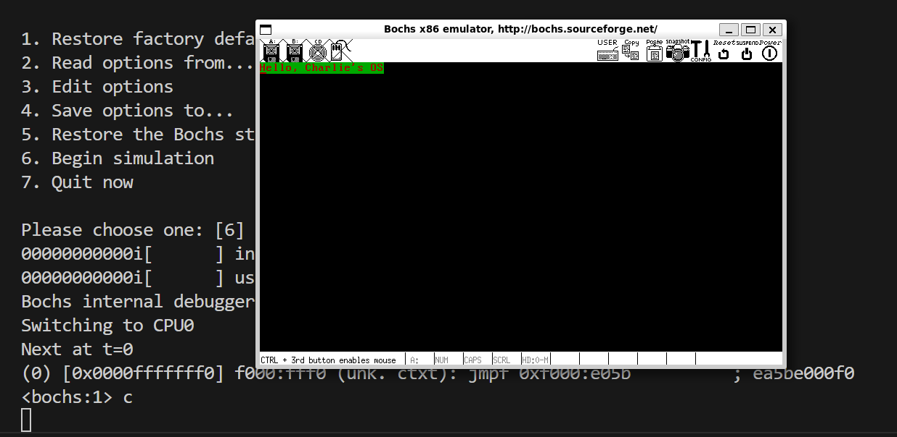

# Setup In WSL Arch Linux 

​	在Arch Linux上更新环境，你需要做的是

1. 请刷新并同步你的数据库！

   ```
   yay -Syyu
   ```

2. 下载gcc, nasm和bochs

   ```
   yay -S gcc nasm
   ```

3. 不同于我们的直接运行的发行版，我们需要自己手动编译bochs来保证正确的运行，截至到笔者作稿，bochs的最新的版本是2.8.1，这里，笔者采取的是2.8版本进行编译。

   1. 下载bochs

      ```
      wget https://sourceforge.net/projects/bochs/files/bochs/2.8/bochs-2.8.tar.gz
      ```

   2. 解压缩

      ```
      tar -xvf bochs-2.8.tar.gz
      ```

   3. 设置配置，笔者使用的配置是：

      ```
      ./configure --prefix=/path/to/your/prefix --enable-debugger --enable-disasm --enable-iodebug --enable-x86-debugger --with-x --with-x11
      ```

      > :heavy_exclamation_mark: 请注意，检查你的日志，如果没有出现`X -- Headerschecking for X... libraries , headers `的时候，或者是是任何出现bochs的编译没有找到XServer的情况，对于这里，请先使用install X Server的开发文件，截止到2025年2月12日，你仍然可以通过下载xorg-server或者是您自行决定的更加轻量或者重量的包
      >
      > ```
      > yay -S xorg-server
      > ```
      >
      > 对于WSL，你需要设置转发端口，你可以设置`export DISPLAY=:0.0`，让他在当前端口使能xorg-server的转发IP和端口，随后，在windows下使用任何一款可以接受xserver转发的软件接收，您可以使用XMing，不需要做热门和设置就能直接将操作系统连接到您的Windows窗口上！

      但是笔者的版本不使用prefix，我想偷懒，毕竟我是在虚拟机和样机中开发，无所谓环境，如果你有强烈的环境洁癖，请设置好prefix路径

   4. ```
      sudo make -j4 		# compile
      sudo make install 	# install
      # if you use a defined prefix, remember add to your PATH or any other method shell
      # can recognize gcc, make, nasm and bochs :)
      # export PATH=/path/to/your/bochs_install_folder:$PATH
      ```

      

4. 一个良好的习惯就是确认他们都在！

   ```
   >> gcc -v
   >> nasm -v
   >> bochs --help
   ```

5. 克隆此项目，然后，cd到任何一个随意的章节代码

   ```
   git clone https://github.com/Charliechen114514/CCOperateSystem
   ```

6. 使用make来构建代码，然后输入make upload来启动项目。如果你遇到了任何问题，可以先尝试阅读Makefile文件！

```
>> make
# Ensure that no error has been occurred
>> make upload
# This will run the codes in bochs
```

6. 现在，代码运行起来了，但是你会发现，你的终端被bochs接管之后，似乎停下来了，这是因为笔者默认给您使用的是调试模式，你只需要输入'c'并且回车，就会发现代码跑起来了！

   下面的截图是笔者运行Chap2章节的代码，你可以试试！




## 潜在的问题

1. 找不到VGAImage, ROMImage或者是Keyboard等文件

   请自行寻找自己编译或者是包管理下载的bochs文件将您的VGAImage文件放在何处，在bochsrc中修改指向这个文件，推介使用绝对路径

2. 待补充