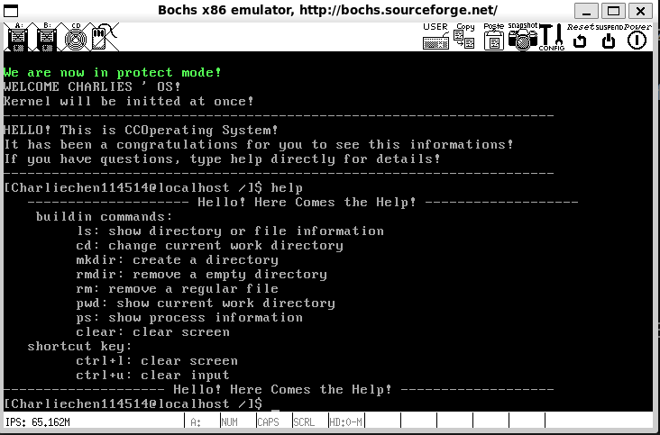
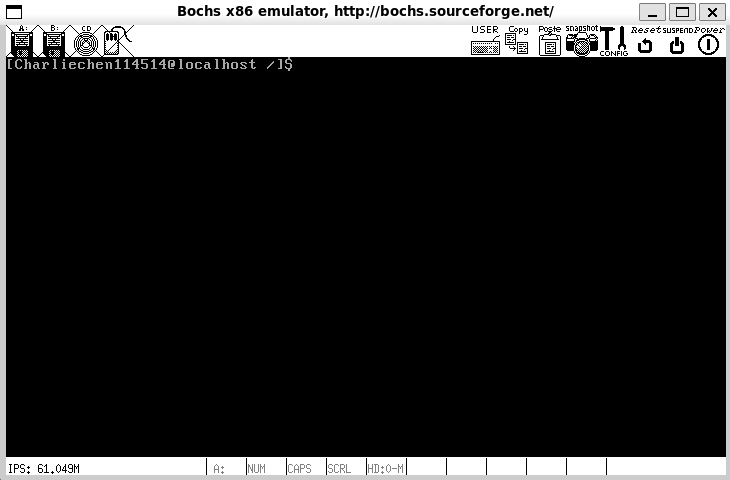
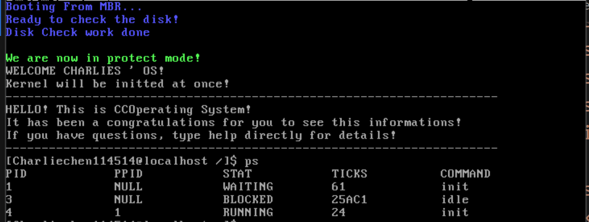

# CCOperateSystem

 

 一句话：一个简单的教程尝试教你如何使用 C 语言和典型的 nasm 在现代工具链中制作操作系统。点击下面的语言标签切换本文档的语言~

- 简体中文：

- English：

CCOperatingSystem是一种非常简单的操作系统，可以在bochs虚拟机中运行。要启动，您需要设置您的工作环境，目前，我可以保证除了我特别标记的代码之外，所有代码都可以使用最新的 gcc 和 nasm 进行编译。

​	 所以，你需要做的事情非常简单。最重要的是，我们只需要

- `gcc（至少检测过的版本> = 4.4.7，最高为最新版本）(现在笔者测试的版本是gcc version 14.2.1 20250207 (GCC), 但是，笔者测试疑似gcc 14.2.1存在栈溢出风险(Invalid OP Code错误)，导致操作系统崩溃，WIP: 修复这个错误。完全没问题的版本是Ubuntu的自带gcc, 13.3.0是完全没有任何问题的)`
- `nasm（至少检测过的最新版本）(NASM version 2.16.03 compiled on May  4 2024)`
- `bochs（检测过的是使用 2.8，当然其他的也可以，需要自己魔改，请参考其他教程灵活调整您的配置！`

​	请注意，本操作系统目前只能在bochs上跑，qemu会卡死在硬盘读取上，本错误长期不打算修复，如果你有更好的对Loader的实现，请Issue我进一步探讨！

​	无冗余信息的启动界面

​	看看用法：

​	清空（CTRL + L清屏幕，CTRL + U清输入）

​	ps进程显示

	

操作文件系统

 	异常处理显示：

​	从这里开始！

> :link: :point_right:  [Preface of the tour!](./Documentations/README_EN.md)
>
> :link: :point_right:  [前言！](./Documentations/README.md)

​	如果你想让你的操作系统可以实现更好，更加连贯的抽象，想挑战自己的话，考虑一个正在WIP的，使用纯粹GNU工具链的kdemo:

- Author: [Dessera (Dessera)](https://github.com/Dessera)
- KDemo: [Dessera/kdemo](https://github.com/Dessera/kdemo)

​	如果你更加倾向于稳定的实现，并可以接受较老工具链。请考虑这位的

- Author: [Cooi-Boi (Love6)](https://github.com/Cooi-Boi)
- Tidy-OS: [Cooi-Boi/Tiny-OS: 《操作系统真象还原》自写源码实现 并于CSDN上面详细记录操作系统的整个实现流程 包括Debug步骤与书籍中错误勘误 Bochs2.6.8 Gcc4.4 本书除最后三个小功能其余全部实现 6k行左右的代码 希望能帮到各位 ^^](https://github.com/Cooi-Boi/Tiny-OS/tree/master)

​	一个更加完善的讲解实现：

- [yifengyou (游~游~游)](https://github.com/yifengyou)
- [yifengyou/os-elephant: 《操作系统真象还原》源码及学习笔记（os-elephant）还原真相](https://github.com/yifengyou/os-elephant)

​	本教程的参考资料几乎是派生自《操作系统还原真相》此书。感兴趣的朋友可以购买一本支持郑刚老师！
