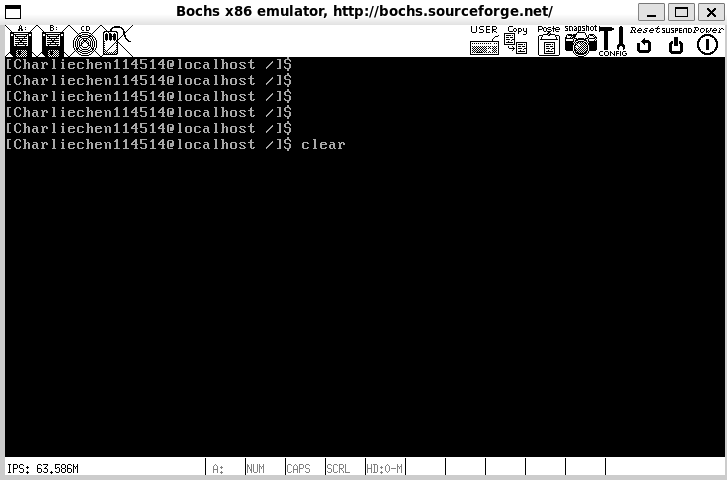
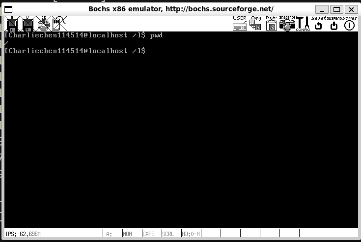

# CCOperateSystem

 

 一句话：一个简单的教程尝试教你如何使用 C 语言和典型的 nasm 在现代工具链中制作操作系统。

- 简体中文：

- English：

 CCOperatingSystem是一种非常简单的操作系统，可以在bochs虚拟机中运行。要启动，您需要设置您的工作环境，目前，我可以保证除了我特别标记的代码之外，所有代码都可以使用最新的 gcc 和 nasm 进行编译。

 所以，你需要做的事情非常简单。最重要的是，我们只需要

- `gcc（至少检测过的版本> = 4.4.7，最高为最新版本）`
- `nasm（至少检测过的最新版本）`
- `bochs（检测过的是使用 2.8，当然其他的也可以，需要自己魔改，请参阅下面的documentations指引！`

 就是这样！作者已经在 WSL、Ubuntu 和 Arch Linux 中进行了测试，因此我可以为您提供设置说明！有关详细信息，请参阅以下教程！

​	无冗余信息的启动界面

​	看看用法：

​	清空（CTRL + L清屏幕，CTRL + U清输入）

​	文件系统初试

 	异常处理显示：

从这里开始！

> :link: :point_right:  [Preface of the tour!](./Documentations/README_EN.md)
>
> :link: :point_right:  [前言！](./Documentations/README.md)
