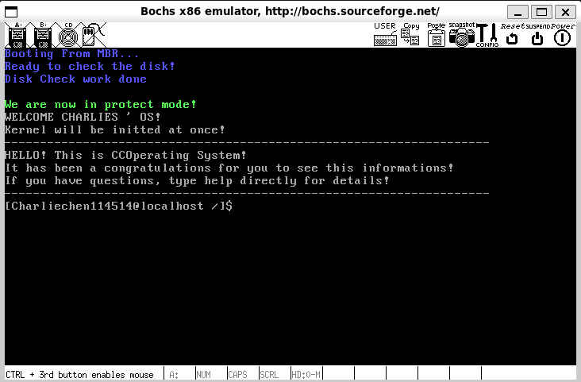
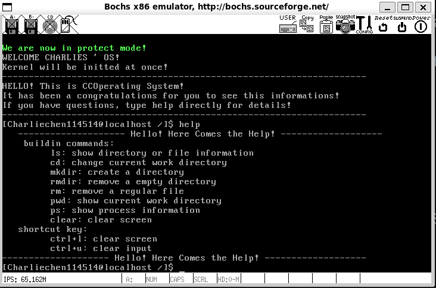
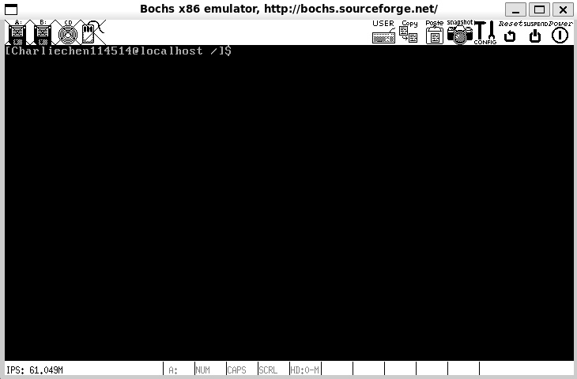
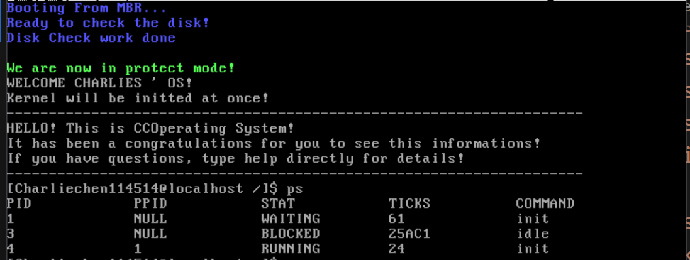
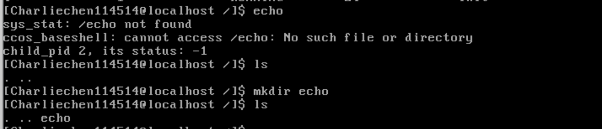
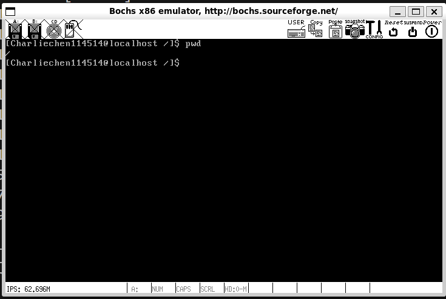
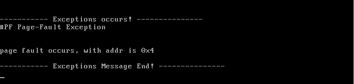

# CCOperateSystem

  

In one sentence: A simple tutorial tries to teach you how to make an operating system in a modern toolchain using C language and typical nasm. Simply Click the label below to switch the language :)

- Simplified Chinese: 

- English: 

CCOperatingSystem is a very simple operating system that can run in a bochs virtual machine. To start, you need to set up your working environment. At present, I can guarantee that all codes can be compiled with the latest gcc and nasm except for the codes I specially marked.

 So, what you need to do is very simple. Most importantly, we only need

- `gcc (at least the tested version > = 4.4.7, the latest version at most) (the version I tested is gcc version 14.2.1 20250207 (GCC), but the author tested that gcc 14.2.1 has a stack overflow risk (Invalid OP Code error), causing the operating system to crash. WIP: fix this error. The version that has no problems is Ubuntu's built-in gcc, 13.3.0 has no problems at all)`
- `nasm (at least the latest version tested) (NASM version 2.16.03 compiled on May 4 2024)`
- `bochs (the tested version is 2.8, of course, other versions are also OK, you need to modify it yourself, please refer to other tutorials to flexibly adjust your configuration!`

Please note that this operating system can only run on bochs at present, and qemu will get stuck on hard disk reading. This error is not planned to be fixed for a long time. If you have a better implementation of Loader, please issue me for further discussion!

 Startup interface without redundant information

 See the usage:

 Clear (CTRL + L to clear the screen, CTRL + U clear input)

 ps process display

Operating file system

Exception handling display:

 Start here!

> :link: :point_right: [Preface of the tour!](./Documentations/README_EN.md)
>
> :link: :point_right: [Preface! ](./Documentations/README.md)

 If you want to make your operating system achieve better and more coherent abstractions, and want to challenge yourself, consider a WIP kdemo that uses a pure GNU toolchain:

- Author: [Dessera (Dessera)](https://github.com/Dessera)
- KDemo: [Dessera/kdemo](https://github.com/Dessera/kdemo)

 If you prefer a stable implementation and can accept an older toolchain. Please consider this

- Author: [Cooi-Boi (Love6)](https://github.com/Cooi-Boi)
- Tidy-OS: [Cooi-Boi/Tiny-OS: "Restoring the True Image of the Operating System" self-written source code implementation and detailed record of the entire implementation process of the operating system on CSDN, including Debug steps and errors in the book Bochs2.6.8 Gcc4.4 This book implements all except the last three small functions. About 6k lines of code. I hope it can help you ^^](https://github.com/Cooi-Boi/Tiny-OS/tree/master)

 A more complete explanation implementation:

- [yifengyou (游~游~游)](https://github.com/yifengyou)
- [yifengyou/os-elephant: "Operating System Truth Restoration" Source Code and Study Notes (os-elephant) Restoring the Truth](https://github.com/yifengyou/os-elephant)

 The reference materials of this tutorial are almost derived from the book "Operating System Truth Restoration". Interested friends can buy a copy to support Mr. Zheng Gang!
